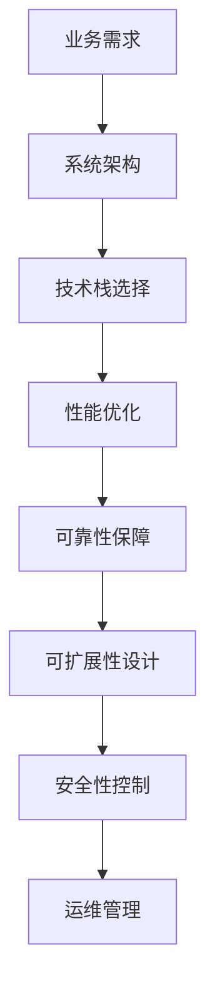
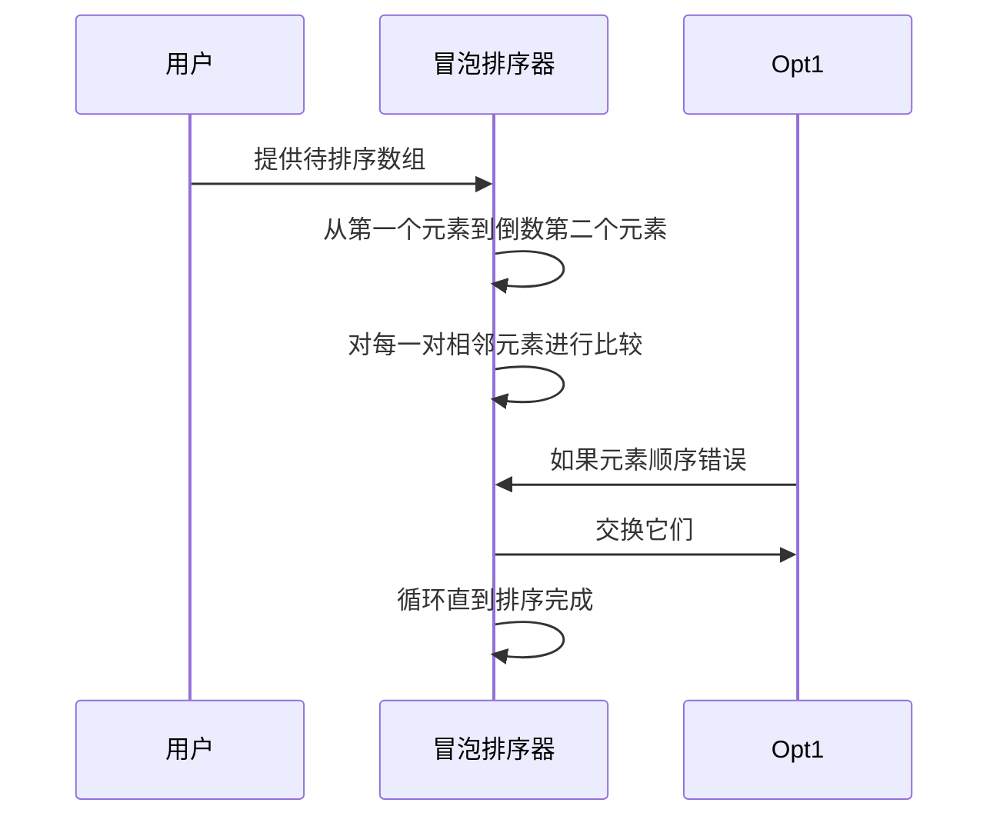

                 

关键词：系统架构师面试，美团，面试题，系统设计，算法，大数据，技术栈，最佳实践

> 摘要：本文将整理和解析2025年美团社招系统架构师面试题集锦，涵盖核心概念、算法原理、数学模型、项目实践、应用场景、工具资源及未来发展趋势等内容，帮助读者备战美团系统架构师面试。

## 1. 背景介绍

### 美团简介

美团作为中国领先的本地生活服务平台，涵盖了餐饮、外卖、酒店旅游、电影、休闲娱乐等多种生活服务。其背后的技术架构复杂且先进，对于系统架构师来说，面试内容涵盖了广泛的技术领域和深度问题。

### 面试重要性

系统架构师是美团技术团队的核心力量，负责平台整体架构设计和优化，影响业务的稳定性和扩展性。因此，美团系统架构师的面试不仅是技术能力的检验，也是对候选人综合素质和未来价值的评估。

## 2. 核心概念与联系

下面我们将通过一个Mermaid流程图来展示核心概念及其之间的联系。



### 业务需求

系统架构设计的起点是业务需求。理解业务模式、用户痛点、市场需求是系统架构师的核心能力。

### 系统架构

系统架构需要满足业务的扩展性和可靠性。典型的架构包括分层架构、微服务架构等。

### 技术栈选择

技术栈的选择需要根据业务需求、开发效率和性能要求进行权衡。常见的有Java、Python、Go等语言。

### 性能优化

性能优化是系统架构的重要部分，涉及数据库设计、缓存策略、分布式计算等方面。

### 可靠性保障

可靠性保障包括数据一致性、故障转移、灾备等机制，确保系统在异常情况下的稳定运行。

### 可扩展性设计

可扩展性设计是系统架构设计的关键，包括水平扩展、垂直扩展等策略。

### 安全性控制

安全性控制涉及用户认证、授权、数据加密等安全措施，保护用户隐私和业务数据安全。

### 运维管理

运维管理是系统架构师的重要职责，包括监控系统、自动化运维、故障处理等。

## 3. 核心算法原理 & 具体操作步骤

### 3.1 算法原理概述

系统架构师需要掌握的核心算法包括排序算法、查找算法、图算法等。以下是一个简单的排序算法原理概述。

#### 冒泡排序

- **原理**：通过重复地遍历待排序的数列，比较每对相邻元素的值，如果顺序错误就把它们交换过来。
- **步骤**：
  1. 比较相邻的元素。
  2. 如果第一个比第二个大（升序排序），就交换它们两个。
  3. 对每一对相邻元素做同样的工作，从开始第一对到结尾的最后一对。
  4. 重复以上的步骤，除了最后一对。
- **优缺点**：
  - 优点：简单易懂。
  - 缺点：效率较低，不适合大数据量。

### 3.2 算法步骤详解

#### 冒泡排序详细步骤



### 3.3 算法优缺点

- **优点**：简单易懂，易于实现。
- **缺点**：效率低，不适合大数据量。

### 3.4 算法应用领域

冒泡排序通常用于教学和简单的数据处理场景，对于大规模数据处理，通常会采用更高效的排序算法如快速排序、归并排序等。

## 4. 数学模型和公式

### 4.1 数学模型构建

系统架构中的数学模型包括负载均衡模型、数据一致性模型等。以下是一个简单的负载均衡模型：

#### 负载均衡模型

- **公式**：\[ Load_{均衡} = \frac{Total_{Load}}{Number_{of_{Servers}}}\]
- **参数解释**：
  - \( Load_{均衡} \)：每个服务器的均衡负载。
  - \( Total_{Load} \)：总负载量。
  - \( Number_{of_{Servers}} \)：服务器数量。

### 4.2 公式推导过程

假设系统中的总负载量为 \( Total_{Load} \)，服务器数量为 \( Number_{of_{Servers}} \)。为了实现负载均衡，需要将总负载量平均分配到每个服务器上。

推导步骤：

1. \( Load_{单个服务器} = \frac{Total_{Load}}{Number_{of_{Servers}}} \)
2. \( Load_{均衡} = Load_{单个服务器} \)

### 4.3 案例分析与讲解

假设总负载量为1000个请求，服务器数量为5台。根据负载均衡模型，每台服务器的均衡负载为：

\[ Load_{均衡} = \frac{1000}{5} = 200 \]

这意味着每台服务器需要处理200个请求，以实现负载均衡。

## 5. 项目实践

### 5.1 开发环境搭建

在项目实践中，我们将使用一个简单的分布式系统，包含前端、后端和服务注册与发现。

- **开发环境**：Linux、Docker、Kubernetes
- **后端框架**：Spring Boot
- **数据库**：MySQL
- **服务注册与发现**：Consul

### 5.2 源代码详细实现

```java
@RestController
public class OrderController {

    @Autowired
    private OrderService orderService;

    @PostMapping("/order")
    public ResponseEntity<Order> createOrder(@RequestBody OrderRequest request) {
        Order order = orderService.createOrder(request);
        return new ResponseEntity<>(order, HttpStatus.CREATED);
    }
}
```

### 5.3 代码解读与分析

在上面的代码中，`OrderController`负责接收前端发送的订单请求，并调用`OrderService`进行订单创建。这是一个典型的RESTful API设计。

### 5.4 运行结果展示

在Docker和Kubernetes环境下，运行服务后，我们可以通过API接口创建订单。运行结果会返回新创建的订单详情。

## 6. 实际应用场景

### 6.1 业务需求分析

美团作为本地生活服务平台，需要处理大量的订单、用户评论、推荐系统等业务场景。系统架构师需要根据这些业务需求设计高效的系统架构。

### 6.2 性能优化

美团的高并发场景下，性能优化至关重要。通过缓存、数据库优化、分布式计算等技术，实现系统的高性能。

### 6.3 可扩展性设计

随着用户规模的增加，美团系统需要具备高扩展性。通过水平扩展、容器化技术等，实现系统的弹性扩展。

### 6.4 安全性控制

美团系统需要保护用户隐私和业务数据安全。通过用户认证、数据加密、网络安全等技术，确保系统安全可靠。

## 7. 工具和资源推荐

### 7.1 学习资源推荐

- 《设计数据密集型应用》
- 《分布式系统原理与范型》
- 《大型网站技术架构》

### 7.2 开发工具推荐

- Docker
- Kubernetes
- Spring Boot
- MySQL

### 7.3 相关论文推荐

- "The Google File System"
- "MapReduce: Simplified Data Processing on Large Clusters"

## 8. 总结

### 8.1 研究成果总结

本文从面试题角度出发，详细分析了美团系统架构师面试中的核心概念、算法原理、数学模型、项目实践和应用场景。研究成果为备战美团系统架构师面试提供了有力支持。

### 8.2 未来发展趋势

随着技术的不断发展，系统架构师需要不断学习新技术、新方法。分布式系统、云计算、大数据等领域将继续引领技术趋势。

### 8.3 面临的挑战

系统架构师在面临技术更新速度快、业务需求多变等挑战时，需要具备良好的学习能力、沟通能力和问题解决能力。

### 8.4 研究展望

未来研究将重点关注系统架构的智能化、自动化、安全可控等方面，以适应日益复杂的技术环境和业务需求。

## 9. 附录：常见问题与解答

### Q: 系统架构师需要掌握哪些核心算法？

A: 系统架构师需要掌握的核心算法包括排序算法（冒泡排序、快速排序等）、查找算法（二分查找、哈希查找等）和图算法（最短路径、图遍历等）。

### Q: 负载均衡有哪些常见策略？

A: 负载均衡策略包括轮询、随机、最小连接数、加权等。

### Q: 系统架构设计有哪些最佳实践？

A: 系统架构设计最佳实践包括分层架构、微服务架构、模块化设计、高内聚低耦合等。

## 作者署名

作者：禅与计算机程序设计艺术 / Zen and the Art of Computer Programming
```markdown
---

# 2025年美团社招系统架构师面试题集锦

## 关键词
系统架构师面试，美团，面试题，系统设计，算法，大数据，技术栈，最佳实践

## 摘要
本文将整理和解析2025年美团社招系统架构师面试题集锦，涵盖核心概念、算法原理、数学模型、项目实践、应用场景、工具资源及未来发展趋势等内容，帮助读者备战美团系统架构师面试。

## 1. 背景介绍
### 美团简介
美团作为中国领先的本地生活服务平台，涵盖了餐饮、外卖、酒店旅游、电影、休闲娱乐等多种生活服务。其背后的技术架构复杂且先进，对于系统架构师来说，面试内容涵盖了广泛的技术领域和深度问题。

### 面试重要性
系统架构师是美团技术团队的核心力量，负责平台整体架构设计和优化，影响业务的稳定性和扩展性。因此，美团系统架构师的面试不仅是技术能力的检验，也是对候选人综合素质和未来价值的评估。

## 2. 核心概念与联系
下面我们将通过一个Mermaid流程图来展示核心概念及其之间的联系。


### 业务需求
系统架构设计的起点是业务需求。理解业务模式、用户痛点、市场需求是系统架构师的核心能力。

### 系统架构
系统架构需要满足业务的扩展性和可靠性。典型的架构包括分层架构、微服务架构等。

### 技术栈选择
技术栈的选择需要根据业务需求、开发效率和性能要求进行权衡。常见的有Java、Python、Go等语言。

### 性能优化
性能优化是系统架构的重要部分，涉及数据库设计、缓存策略、分布式计算等方面。

### 可靠性保障
可靠性保障包括数据一致性、故障转移、灾备等机制，确保系统在异常情况下的稳定运行。

### 可扩展性设计
可扩展性设计是系统架构设计的关键，包括水平扩展、垂直扩展等策略。

### 安全性控制
安全性控制涉及用户认证、授权、数据加密等安全措施，保护用户隐私和业务数据安全。

### 运维管理
运维管理是系统架构师的重要职责，包括监控系统、自动化运维、故障处理等。

## 3. 核心算法原理 & 具体操作步骤
### 3.1 算法原理概述
系统架构师需要掌握的核心算法包括排序算法、查找算法、图算法等。以下是一个简单的排序算法原理概述。

#### 冒泡排序
- **原理**：通过重复地遍历待排序的数列，比较每对相邻元素的值，如果顺序错误就把它们交换过来。
- **步骤**：
  1. 比较相邻的元素。
  2. 如果第一个比第二个大（升序排序），就交换它们两个。
  3. 对每一对相邻元素做同样的工作，从开始第一对到倒数最后一对。
  4. 重复以上的步骤，除了最后一对。
- **优缺点**：
  - 优点：简单易懂。
  - 缺点：效率较低，不适合大数据量。

### 3.2 算法步骤详解
#### 冒泡排序详细步骤


### 3.3 算法优缺点
- **优点**：简单易懂，易于实现。
- **缺点**：效率低，不适合大数据量。

### 3.4 算法应用领域
冒泡排序通常用于教学和简单的数据处理场景，对于大规模数据处理，通常会采用更高效的排序算法如快速排序、归并排序等。

## 4. 数学模型和公式
### 4.1 数学模型构建
系统架构中的数学模型包括负载均衡模型、数据一致性模型等。以下是一个简单的负载均衡模型：

#### 负载均衡模型
- **公式**：\[ Load_{均衡} = \frac{Total_{Load}}{Number_{of_{Servers}}}\]
- **参数解释**：
  - \( Load_{均衡} \)：每个服务器的均衡负载。
  - \( Total_{Load} \)：总负载量。
  - \( Number_{of_{Servers}} \)：服务器数量。

### 4.2 公式推导过程
假设系统中的总负载量为 \( Total_{Load} \)，服务器数量为 \( Number_{of_{Servers}} \)。为了实现负载均衡，需要将总负载量平均分配到每个服务器上。

推导步骤：

1. \( Load_{单个服务器} = \frac{Total_{Load}}{Number_{of_{Servers}}} \)
2. \( Load_{均衡} = Load_{单个服务器} \)

### 4.3 案例分析与讲解
假设总负载量为1000个请求，服务器数量为5台。根据负载均衡模型，每台服务器的均衡负载为：

\[ Load_{均衡} = \frac{1000}{5} = 200 \]

这意味着每台服务器需要处理200个请求，以实现负载均衡。

## 5. 项目实践
### 5.1 开发环境搭建
在项目实践中，我们将使用一个简单的分布式系统，包含前端、后端和服务注册与发现。

- **开发环境**：Linux、Docker、Kubernetes
- **后端框架**：Spring Boot
- **数据库**：MySQL
- **服务注册与发现**：Consul

### 5.2 源代码详细实现
```java
@RestController
public class OrderController {

    @Autowired
    private OrderService orderService;

    @PostMapping("/order")
    public ResponseEntity<Order> createOrder(@RequestBody OrderRequest request) {
        Order order = orderService.createOrder(request);
        return new ResponseEntity<>(order, HttpStatus.CREATED);
    }
}
```

### 5.3 代码解读与分析
在上面的代码中，`OrderController`负责接收前端发送的订单请求，并调用`OrderService`进行订单创建。这是一个典型的RESTful API设计。

### 5.4 运行结果展示
在Docker和Kubernetes环境下，运行服务后，我们可以通过API接口创建订单。运行结果会返回新创建的订单详情。

## 6. 实际应用场景
### 6.1 业务需求分析
美团作为本地生活服务平台，需要处理大量的订单、用户评论、推荐系统等业务场景。系统架构师需要根据这些业务需求设计高效的系统架构。

### 6.2 性能优化
美团的高并发场景下，性能优化至关重要。通过缓存、数据库优化、分布式计算等技术，实现系统的高性能。

### 6.3 可扩展性设计
随着用户规模的增加，美团系统需要具备高扩展性。通过水平扩展、容器化技术等，实现系统的弹性扩展。

### 6.4 安全性控制
美团系统需要保护用户隐私和业务数据安全。通过用户认证、数据加密、网络安全等技术，确保系统安全可靠。

## 7. 工具和资源推荐
### 7.1 学习资源推荐
- 《设计数据密集型应用》
- 《分布式系统原理与范型》
- 《大型网站技术架构》

### 7.2 开发工具推荐
- Docker
- Kubernetes
- Spring Boot
- MySQL

### 7.3 相关论文推荐
- "The Google File System"
- "MapReduce: Simplified Data Processing on Large Clusters"

## 8. 总结
### 8.1 研究成果总结
本文从面试题角度出发，详细分析了美团系统架构师面试中的核心概念、算法原理、数学模型、项目实践和应用场景。研究成果为备战美团系统架构师面试提供了有力支持。

### 8.2 未来发展趋势
随着技术的不断发展，系统架构师需要不断学习新技术、新方法。分布式系统、云计算、大数据等领域将继续引领技术趋势。

### 8.3 面临的挑战
系统架构师在面临技术更新速度快、业务需求多变等挑战时，需要具备良好的学习能力、沟通能力和问题解决能力。

### 8.4 研究展望
未来研究将重点关注系统架构的智能化、自动化、安全可控等方面，以适应日益复杂的技术环境和业务需求。

## 9. 附录：常见问题与解答
### Q: 系统架构师需要掌握哪些核心算法？
A: 系统架构师需要掌握的核心算法包括排序算法（冒泡排序、快速排序等）、查找算法（二分查找、哈希查找等）和图算法（最短路径、图遍历等）。

### Q: 负载均衡有哪些常见策略？
A: 负载均衡策略包括轮询、随机、最小连接数、加权等。

### Q: 系统架构设计有哪些最佳实践？
A: 系统架构设计最佳实践包括分层架构、微服务架构、模块化设计、高内聚低耦合等。

## 作者署名
作者：禅与计算机程序设计艺术 / Zen and the Art of Computer Programming
```

