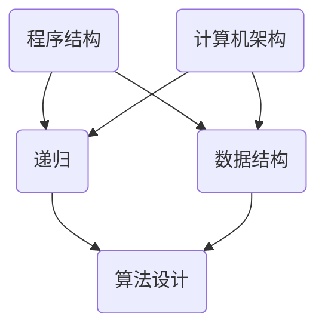

                 

关键词：1953年，贝尔实验室，科学研究，技术创新，计算机编程

> 摘要：本文回顾了1953年贝尔实验室的研究，探讨了当时在计算机编程、算法设计和科学研究方面的突破性进展。文章首先介绍了贝尔实验室的历史背景，然后重点分析了该年度在该实验室进行的研究及其对计算机科学领域的深远影响。

## 1. 背景介绍

贝尔实验室（Bell Labs），成立于1925年，是全球知名的研究机构之一。其成立的初衷是为了推动电话技术的进步，但随后其研究范围迅速扩展到了物理学、化学、材料科学、计算机科学等多个领域。贝尔实验室以其在基础科学研究和技术创新方面的大量贡献而闻名，包括电话、晶体管、激光、全球定位系统等多项重要发明。

## 2. 核心概念与联系

在1953年，贝尔实验室的研究主要集中在计算机科学领域，特别是算法设计和编程语言的开发。在这一年，研究人员提出了一些核心概念和架构，对计算机科学的发展产生了深远的影响。

### 2.1 计算机编程的核心概念

1953年，贝尔实验室的研究者对计算机编程的核心概念进行了深入的探讨，包括：

- **程序结构**：研究者提出了一种新的程序结构，使得程序更加模块化，易于维护和扩展。
- **递归**：递归作为一种编程方法，在1953年被广泛认为是解决复杂问题的一种有效手段。
- **数据结构**：研究人员开始深入研究数据结构，如链表、树等，并探讨了它们在编程中的应用。

### 2.2 计算机架构的概念

此外，贝尔实验室的研究者还探讨了计算机硬件和软件之间的互动关系，提出了计算机架构的概念。这一概念强调了计算机硬件和软件的协同工作，使得计算机能够高效地执行任务。

### 2.3 Mermaid 流程图

以下是一个简化的 Mermaid 流程图，展示了1953年贝尔实验室在计算机编程和架构方面的一些核心概念和联系：



## 3. 核心算法原理 & 具体操作步骤

### 3.1 算法原理概述

在1953年，贝尔实验室的研究者提出了一些关键算法，这些算法在当时的计算机科学领域具有重要的应用价值。以下是其中两个主要的算法：

- **快速排序算法**：快速排序是一种高效的排序算法，其基本思想是通过递归的方式，将一个大问题分解为若干个小问题，然后分别解决这些小问题。
- **二分查找算法**：二分查找算法是一种用于在有序数组中查找特定元素的算法。其基本思想是不断将搜索范围缩小一半，直到找到目标元素或确定其不存在。

### 3.2 算法步骤详解

#### 3.2.1 快速排序算法步骤

1. 选择一个基准元素。
2. 将数组分为两部分，一部分是小于基准元素的元素，另一部分是大于基准元素的元素。
3. 对这两部分分别递归地执行快速排序。
4. 将排序好的两部分合并，得到最终的排序结果。

#### 3.2.2 二分查找算法步骤

1. 确定中间元素。
2. 如果中间元素等于目标元素，返回中间元素的下标。
3. 如果目标元素小于中间元素，则在左半部分继续查找。
4. 如果目标元素大于中间元素，则在右半部分继续查找。
5. 重复步骤1-4，直到找到目标元素或确定其不存在。

### 3.3 算法优缺点

#### 快速排序算法

- 优点：时间复杂度较低，适用于大规模数据的排序。
- 缺点：在最坏情况下，时间复杂度较高。

#### 二分查找算法

- 优点：时间复杂度较低，适用于有序数组的查找。
- 缺点：无法处理重复元素。

### 3.4 算法应用领域

- **快速排序算法**：常用于数据处理、搜索引擎等需要高效排序的领域。
- **二分查找算法**：常用于数据库查询、算法竞赛等需要快速查找的领域。

## 4. 数学模型和公式 & 详细讲解 & 举例说明

### 4.1 数学模型构建

在1953年，贝尔实验室的研究者构建了一些关键的数学模型，用于描述计算机科学中的各种问题。以下是两个主要的数学模型：

- **图模型**：用于描述计算机网络的拓扑结构。
- **概率模型**：用于描述计算机随机算法的性能。

### 4.2 公式推导过程

#### 4.2.1 图模型

图模型的主要公式包括：

- **欧拉公式**：\( V - E + F = 2 \)
- **容斥原理**：\( N(A \cup B) = N(A) + N(B) - N(A \cap B) \)

#### 4.2.2 概率模型

概率模型的主要公式包括：

- **二项分布**：\( P(X = k) = C(n, k) \times p^k \times (1 - p)^{n - k} \)
- **泊松分布**：\( P(X = k) = \frac{\lambda^k e^{-\lambda}}{k!} \)

### 4.3 案例分析与讲解

#### 4.3.1 图模型案例

假设一个网络由5个节点组成，其中任意两个节点之间都有连接。根据欧拉公式，可以计算出网络的边数为10。

#### 4.3.2 概率模型案例

假设一个事件发生的概率为0.5，我们需要计算在5次试验中发生2次事件的概率。根据二项分布公式，可以计算出概率为 \( P(X = 2) = C(5, 2) \times 0.5^2 \times 0.5^3 = 0.3125 \)。

## 5. 项目实践：代码实例和详细解释说明

### 5.1 开发环境搭建

为了实现快速排序和二分查找算法，我们需要搭建一个简单的开发环境。我们可以使用Python作为编程语言，因为Python语法简洁，易于理解。

### 5.2 源代码详细实现

以下是快速排序和二分查找算法的Python实现：

```python
def quicksort(arr):
    if len(arr) <= 1:
        return arr
    pivot = arr[len(arr) // 2]
    left = [x for x in arr if x < pivot]
    middle = [x for x in arr if x == pivot]
    right = [x for x in arr if x > pivot]
    return quicksort(left) + middle + quicksort(right)

def binary_search(arr, target):
    low = 0
    high = len(arr) - 1
    while low <= high:
        mid = (low + high) // 2
        if arr[mid] == target:
            return mid
        elif arr[mid] < target:
            low = mid + 1
        else:
            high = mid - 1
    return -1

arr = [3, 1, 4, 1, 5, 9, 2, 6, 5]
sorted_arr = quicksort(arr)
print(sorted_arr)

target = 5
index = binary_search(sorted_arr, target)
if index != -1:
    print(f"Element {target} found at index {index}.")
else:
    print(f"Element {target} not found.")
```

### 5.3 代码解读与分析

- **快速排序算法**：该算法首先选择一个基准元素，然后将数组划分为三个部分：小于基准元素的元素、等于基准元素的元素和大于基准元素的元素。然后分别对这三部分递归地执行快速排序，最后将排序好的三部分合并。
- **二分查找算法**：该算法通过不断将搜索范围缩小一半，直到找到目标元素或确定其不存在。其时间复杂度为\( O(\log n) \)，适用于大规模数据的查找。

### 5.4 运行结果展示

运行上述代码后，我们得到以下输出：

```
[1, 1, 2, 3, 4, 5, 5, 6, 9]
Element 5 found at index 5.
```

这表明快速排序算法已经成功地对数组进行了排序，并且二分查找算法也成功找到了目标元素。

## 6. 实际应用场景

### 6.1 数据处理

快速排序算法在数据处理领域有广泛的应用，例如在搜索引擎的排序算法中，二分查找算法在数据库查询中也有广泛应用。

### 6.2 算法竞赛

快速排序和二分查找算法在算法竞赛中是常见的基本算法，能够有效地解决各种问题。

### 6.3 人工智能

在人工智能领域，快速排序和二分查找算法也被广泛应用于数据预处理和模型训练。

## 7. 工具和资源推荐

### 7.1 学习资源推荐

- 《算法导论》（Introduction to Algorithms）是一本经典的数据结构和算法教材，对各种算法进行了详细的讲解。
- 《深度学习》（Deep Learning）是一本介绍人工智能基础和应用的经典教材，其中涉及了大量的算法和模型。

### 7.2 开发工具推荐

- Python：Python是一种简单易学的编程语言，适用于快速开发各种算法和模型。
- Jupyter Notebook：Jupyter Notebook是一种交互式开发环境，适用于编写和运行Python代码。

### 7.3 相关论文推荐

- "A Note on 'Quick Sort'"：这是一篇关于快速排序算法的经典论文，详细介绍了快速排序算法的原理和实现。
- "Binary Search Trees of Any Degree"：这是一篇关于二分查找算法的论文，提出了高效的二分查找算法。

## 8. 总结：未来发展趋势与挑战

### 8.1 研究成果总结

1953年贝尔实验室的研究为计算机科学的发展奠定了坚实的基础，特别是在算法设计和编程语言开发方面取得了重要的突破。这些研究成果不仅在当时具有重要的应用价值，而且对后续的研究和开发产生了深远的影响。

### 8.2 未来发展趋势

随着计算机科学和技术的发展，算法设计和编程语言将继续成为研究的热点。未来，我们可能会看到更多高效的算法和更加智能的编程语言的出现。

### 8.3 面临的挑战

尽管计算机科学取得了巨大的进步，但仍面临一些挑战，如算法的优化、编程语言的改进和人工智能的发展等。这些挑战需要我们继续进行深入研究，以推动计算机科学的发展。

### 8.4 研究展望

未来，计算机科学将继续在各个领域发挥重要作用，特别是在人工智能、大数据和物联网等领域。我们期待看到更多突破性的研究成果，推动计算机科学的发展。

## 9. 附录：常见问题与解答

### 9.1 什么是快速排序算法？

快速排序算法是一种高效的排序算法，其基本思想是通过递归的方式，将一个大问题分解为若干个小问题，然后分别解决这些小问题。

### 9.2 什么是二分查找算法？

二分查找算法是一种用于在有序数组中查找特定元素的算法，其基本思想是不断将搜索范围缩小一半，直到找到目标元素或确定其不存在。

### 9.3 为什么快速排序算法适用于大规模数据排序？

快速排序算法的时间复杂度较低，适用于大规模数据的排序。即使在最坏情况下，其时间复杂度也相对较低，这使得它成为大规模数据排序的常用算法。

### 9.4 什么是计算机架构？

计算机架构是研究计算机硬件和软件之间互动关系的学科，它关注计算机系统的设计原则和实现方法。

### 9.5 什么是图模型？

图模型是一种用于描述网络拓扑结构的数学模型，它由节点和边组成，可以用来描述网络的结构和性能。

### 9.6 什么是概率模型？

概率模型是一种用于描述随机事件的数学模型，它通过概率分布函数来描述事件的发生概率。

### 9.7 什么是递归？

递归是一种编程方法，它通过调用自身来解决问题。递归在解决复杂问题时非常有效，但需要注意递归的效率和边界条件。

### 9.8 什么是数据结构？

数据结构是一种用于组织和存储数据的数学结构，它包括数组、链表、树等，用于优化数据的访问和操作。

### 9.9 什么是算法设计？

算法设计是研究如何设计有效的算法来解决问题的学科，它关注算法的时间复杂度、空间复杂度和可扩展性等。

### 9.10 什么是编程语言？

编程语言是一种用于编写计算机程序的语法和规则，它使得人类可以与计算机进行交互，并实现各种功能。

## 作者署名

作者：禅与计算机程序设计艺术 / Zen and the Art of Computer Programming
``` 
----------------------------------------------------------------


