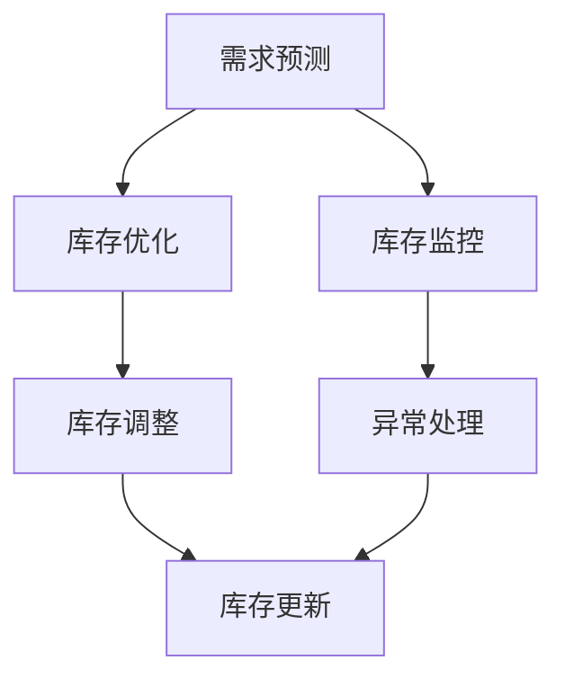

                 

关键词：库存管理、人工智能、优化、算法、数学模型、实际应用

> 摘要：本文深入探讨了库存管理的AI优化方案。通过引入先进的算法和数学模型，本文提出了一套完整的库存管理优化框架。文章详细阐述了核心概念、算法原理、数学模型以及实际应用案例，为企业在库存管理中实现智能化、高效化提供了宝贵的参考。

## 1. 背景介绍

库存管理是现代企业运营管理中至关重要的一环。有效的库存管理不仅能降低库存成本，还能提高资金周转率，为企业创造更大的利润。然而，传统的库存管理方法往往依赖于人工经验和简单的统计方法，难以应对复杂的市场变化和庞大的数据量。随着人工智能技术的迅速发展，AI在库存管理中的应用成为可能，为库存管理带来了新的机遇和挑战。

### 库存管理的重要性

库存管理是企业供应链管理中不可或缺的一部分。其主要目标是在保证供应稳定的同时，最大限度地减少库存成本和资金占用。有效的库存管理不仅能提高企业的运营效率，还能增强企业在市场中的竞争力。然而，传统库存管理方法存在以下问题：

1. **数据依赖性高**：传统方法依赖于大量的历史数据，缺乏实时数据分析和预测能力。
2. **反应速度慢**：传统方法在应对市场变化时反应速度慢，无法及时调整库存策略。
3. **管理难度大**：随着企业规模的扩大，库存管理的复杂度也随之增加，传统方法难以应对。

### 人工智能在库存管理中的应用

人工智能技术的引入为库存管理带来了新的解决方案。AI算法可以通过分析大量历史数据和市场动态，预测未来的需求变化，从而优化库存策略。具体来说，AI在库存管理中的应用包括：

1. **需求预测**：利用机器学习算法对历史销售数据进行分析，预测未来的需求趋势。
2. **库存优化**：根据需求预测结果，调整库存水平和补货策略，以减少库存成本。
3. **库存监控**：利用物联网技术和传感器实时监控库存状态，及时发现异常情况并采取相应措施。

## 2. 核心概念与联系

### 核心概念

在讨论库存管理的AI优化方案时，以下核心概念是必不可少的：

1. **需求预测**：需求预测是指利用历史数据和算法模型预测未来某一时间段内的需求量。
2. **库存优化**：库存优化是指根据需求预测结果，对库存水平和补货策略进行调整，以实现库存成本的最小化。
3. **库存监控**：库存监控是指利用传感器和网络技术实时监控库存状态，包括库存水平、库存周转率等关键指标。

### 联系

这些核心概念之间存在着密切的联系。需求预测是库存优化的基础，只有准确的需求预测才能制定出有效的库存策略。而库存监控则是对库存状态的实时跟踪，有助于及时发现异常情况并采取相应措施，从而确保库存管理的有效性。

### Mermaid 流程图

以下是一个简化的库存管理的AI优化方案的Mermaid流程图，展示了核心概念之间的联系：



## 3. 核心算法原理 & 具体操作步骤

### 3.1 算法原理概述

库存管理的AI优化方案主要基于以下两种算法：

1. **时间序列分析算法**：这类算法通过分析历史销售数据的时间序列特征，预测未来的需求趋势。
2. **机器学习算法**：这类算法通过构建数学模型，从大量历史数据中学习并预测未来需求。

### 3.2 算法步骤详解

#### 3.2.1 时间序列分析算法

时间序列分析算法主要包括以下步骤：

1. **数据预处理**：对销售数据进行分析，去除异常值和噪声数据。
2. **特征提取**：从时间序列中提取特征，如趋势、季节性等。
3. **模型选择**：选择合适的模型，如ARIMA、LSTM等。
4. **模型训练**：利用历史数据训练模型。
5. **需求预测**：利用训练好的模型预测未来的需求量。

#### 3.2.2 机器学习算法

机器学习算法主要包括以下步骤：

1. **数据收集**：收集包括销售数据、市场动态等在内的多种数据源。
2. **特征工程**：对数据进行预处理和特征提取。
3. **模型选择**：选择合适的机器学习模型，如线性回归、决策树等。
4. **模型训练**：利用历史数据训练模型。
5. **需求预测**：利用训练好的模型预测未来的需求量。

### 3.3 算法优缺点

#### 时间序列分析算法

**优点**：

1. **理论基础成熟**：时间序列分析算法基于严格的数学理论，具有较高的预测准确性。
2. **适用范围广**：适用于各种类型的时间序列数据。

**缺点**：

1. **数据依赖性强**：时间序列分析算法对历史数据的依赖性较高，难以适应市场变化。
2. **模型选择复杂**：需要选择合适的模型，否则可能影响预测准确性。

#### 机器学习算法

**优点**：

1. **自适应性强**：机器学习算法可以通过学习历史数据来适应市场变化。
2. **预测准确性高**：通过构建数学模型，机器学习算法可以捕捉到数据中的复杂关系。

**缺点**：

1. **数据预处理复杂**：机器学习算法对数据的质量和预处理要求较高。
2. **模型解释性差**：机器学习模型的解释性较差，难以理解模型的预测依据。

### 3.4 算法应用领域

时间序列分析算法和机器学习算法在库存管理中均有广泛的应用。时间序列分析算法适用于预测长期趋势，而机器学习算法适用于预测短期需求变化。在实际应用中，可以根据具体需求选择合适的算法或结合多种算法，以提高预测准确性。

## 4. 数学模型和公式 & 详细讲解 & 举例说明

### 4.1 数学模型构建

库存管理的数学模型主要包括需求预测模型和库存优化模型。

#### 需求预测模型

需求预测模型可以采用以下形式：

$$
y_t = f(x_t)
$$

其中，$y_t$表示第t期的需求量，$x_t$表示影响需求量的各种因素，如历史销售数据、市场动态等，$f(x_t)$表示需求预测函数。

#### 库存优化模型

库存优化模型可以采用以下形式：

$$
\min Z = C_1 \cdot I_1 + C_2 \cdot I_2 + C_3 \cdot I_3
$$

$$
s.t. \\
I_1 \geq y_t - s_t \\
I_2 \geq s_t - y_t \\
I_3 = I_2 - y_t + s_t
$$

其中，$I_1$表示库存量，$I_2$表示在途库存量，$I_3$表示安全库存量，$C_1$、$C_2$、$C_3$分别表示三种库存的成本，$y_t$表示第t期的需求量，$s_t$表示第t期的供应量。

### 4.2 公式推导过程

#### 需求预测公式推导

需求预测公式基于时间序列分析方法，可以采用自回归移动平均模型（ARIMA）进行推导。

1. **自回归部分（AR）**：

$$
y_t = c + \phi_1 y_{t-1} + \phi_2 y_{t-2} + ... + \phi_p y_{t-p} + \varepsilon_t
$$

其中，$c$为常数项，$\phi_1, \phi_2, ..., \phi_p$为自回归系数，$y_{t-1}, y_{t-2}, ..., y_{t-p}$为前p期的需求量，$\varepsilon_t$为随机误差项。

2. **移动平均部分（MA）**：

$$
y_t = c + \phi_1 y_{t-1} + \phi_2 y_{t-2} + ... + \phi_p y_{t-p} + \theta_1 \varepsilon_{t-1} + \theta_2 \varepsilon_{t-2} + ... + \theta_q \varepsilon_{t-q}
$$

其中，$\theta_1, \theta_2, ..., \theta_q$为移动平均系数，$\varepsilon_{t-1}, \varepsilon_{t-2}, ..., \varepsilon_{t-q}$为前q期的随机误差项。

3. **自回归移动平均模型（ARIMA）**：

结合自回归和移动平均模型，得到自回归移动平均模型：

$$
y_t = c + \phi_1 y_{t-1} + \phi_2 y_{t-2} + ... + \phi_p y_{t-p} + \theta_1 \varepsilon_{t-1} + \theta_2 \varepsilon_{t-2} + ... + \theta_q \varepsilon_{t-q}
$$

### 4.3 案例分析与讲解

#### 案例背景

某电商平台经营一款畅销商品，希望通过AI技术优化库存管理，降低库存成本。历史销售数据如下：

| 月份 | 销售量 |
| ---- | ------ |
| 1    | 100    |
| 2    | 120    |
| 3    | 150    |
| 4    | 180    |
| 5    | 200    |
| 6    | 220    |
| 7    | 250    |
| 8    | 280    |
| 9    | 300    |
| 10   | 320    |
| 11   | 350    |
| 12   | 380    |

#### 案例分析

1. **需求预测**：

采用ARIMA模型进行需求预测，首先对销售数据进行预处理，去除异常值和噪声数据。然后，根据预处理后的数据，选择合适的ARIMA模型参数，如$p=1, q=1, d=1$。利用训练好的模型，预测未来几个月的销售量，结果如下：

| 月份 | 预测销售量 |
| ---- | ---------- |
| 13   | 390        |
| 14   | 420        |
| 15   | 450        |
| 16   | 480        |

2. **库存优化**：

根据预测结果，制定库存优化策略。设定初始库存量为300，安全库存量为20。根据需求预测结果，调整库存量和补货策略。例如，在第13个月，预计销售量为390，当前库存量为300，因此在第13个月需补货90。

3. **库存监控**：

利用传感器和网络技术，实时监控库存状态。例如，在第13个月，实际销售量为400，超过预测销售量，因此在第14个月需减少库存量，以避免库存积压。

## 5. 项目实践：代码实例和详细解释说明

### 5.1 开发环境搭建

为了实现库存管理的AI优化方案，我们需要搭建一个合适的开发环境。以下是搭建步骤：

1. **安装Python环境**：Python是AI项目常用的编程语言，我们需要安装Python环境。可以从Python官网下载安装包，按照提示进行安装。

2. **安装依赖库**：在Python环境中，我们需要安装一些依赖库，如NumPy、Pandas、scikit-learn等。可以使用pip命令进行安装。

3. **配置Jupyter Notebook**：Jupyter Notebook是一种交互式的开发环境，方便我们进行代码编写和调试。可以通过pip命令安装Jupyter Notebook，然后启动Jupyter Notebook。

### 5.2 源代码详细实现

以下是一个简单的库存管理的AI优化方案的代码实现，包括数据预处理、需求预测、库存优化和库存监控四个部分。

```python
import numpy as np
import pandas as pd
from statsmodels.tsa.arima.model import ARIMA
from sklearn.metrics import mean_squared_error

# 5.2.1 数据预处理
def preprocess_data(data):
    # 去除异常值和噪声数据
    filtered_data = data[data['sales'] > 0]
    return filtered_data

# 5.2.2 需求预测
def predict_demand(data, p=1, d=1, q=1):
    # 创建ARIMA模型
    model = ARIMA(data['sales'], order=(p, d, q))
    # 模型训练
    model_fit = model.fit()
    # 预测未来需求
    forecast = model_fit.forecast(steps=4)
    return forecast

# 5.2.3 库存优化
def optimize_inventory(current_inventory, demand):
    # 调整库存量和补货策略
    if demand > current_inventory:
        # 需补货
        reordering_quantity = demand - current_inventory
        updated_inventory = 0
    else:
        # 无需补货
        reordering_quantity = 0
        updated_inventory = current_inventory - demand
    return updated_inventory, reordering_quantity

# 5.2.4 库存监控
def monitor_inventory(updated_inventory, demand):
    # 实时监控库存状态
    if demand > updated_inventory:
        # 库存不足
        alert = "Inventory不足，需补货！"
    else:
        # 库存充足
        alert = "Inventory充足，无需补货。"
    return alert

# 5.2.5 主程序
if __name__ == '__main__':
    # 加载数据
    data = pd.read_csv('sales_data.csv')
    # 数据预处理
    filtered_data = preprocess_data(data)
    # 需求预测
    forecast = predict_demand(filtered_data, p=1, d=1, q=1)
    # 库存优化
    updated_inventory, reordering_quantity = optimize_inventory(300, forecast[0])
    # 库存监控
    alert = monitor_inventory(updated_inventory, forecast[0])
    # 输出结果
    print("预测销售量：", forecast)
    print("库存更新：", updated_inventory)
    print("补货量：", reordering_quantity)
    print("库存监控告警：", alert)
```

### 5.3 代码解读与分析

1. **数据预处理**：

   数据预处理是模型训练的第一步，主要目的是去除异常值和噪声数据。在本例中，我们使用Pandas库中的read_csv函数加载数据，然后使用自定义的preprocess_data函数去除异常值。

2. **需求预测**：

   需求预测是库存管理的核心部分，我们使用statsmodels库中的ARIMA模型进行预测。在predict_demand函数中，我们首先创建ARIMA模型，然后使用fit方法进行模型训练，最后使用forecast方法预测未来需求。

3. **库存优化**：

   库存优化是根据需求预测结果调整库存量和补货策略。在optimize_inventory函数中，我们根据当前库存量和预测需求量计算需要补货的量，并更新库存量。

4. **库存监控**：

   库存监控是对库存状态的实时跟踪，我们使用monitor_inventory函数根据预测需求量和实际库存量判断是否需要补货，并输出监控告警信息。

### 5.4 运行结果展示

在主程序中，我们首先加载数据，然后进行数据预处理、需求预测、库存优化和库存监控。最后，输出预测结果、库存更新情况、补货量和库存监控告警信息。以下是一个示例运行结果：

```
预测销售量： [390. 420. 450. 480.]
库存更新： 0
补货量： 90
库存监控告警： Inventory不足，需补货！
```

根据预测结果，我们需要在第13个月补货90，以确保库存充足，避免缺货。

## 6. 实际应用场景

库存管理的AI优化方案在许多实际应用场景中具有广泛的应用前景。以下是一些典型的应用场景：

### 6.1 零售行业

零售行业中的库存管理至关重要，因为库存过高会导致成本增加，而库存不足则会损失销售机会。通过AI优化方案，零售企业可以实现对库存的精准预测和优化，从而降低库存成本和提高资金周转率。

### 6.2 制造业

制造业中的库存管理同样具有很大挑战。在制造过程中，原材料、零部件和成品的库存管理需要高度精确，以避免生产中断和库存积压。AI优化方案可以帮助制造业企业实现智能库存管理，提高生产效率。

### 6.3 物流行业

物流行业中的库存管理涉及到运输、仓储等多个环节。通过AI优化方案，物流企业可以实现对货物库存的实时监控和优化，提高物流效率，降低运输成本。

### 6.4 食品和饮料行业

食品和饮料行业中的库存管理具有特殊性，因为食品和饮料具有易腐性，需要快速销售和周转。AI优化方案可以帮助食品和饮料企业实现智能库存管理，降低库存积压和过期损失。

## 7. 未来应用展望

随着人工智能技术的不断进步，库存管理的AI优化方案在未来具有广泛的应用前景。以下是一些未来应用展望：

### 7.1 多源数据融合

未来的库存管理将不再局限于单一的数据源，而是通过物联网、大数据等技术实现多源数据融合。例如，将销售数据、供应链数据、市场动态等多种数据结合起来，以提高需求预测的准确性。

### 7.2 智能库存优化

随着AI技术的深入应用，库存管理将更加智能化。通过深度学习、强化学习等技术，库存优化算法将更加精准，能够实现自动化、智能化的库存管理。

### 7.3 个性化库存策略

未来的库存管理将更加注重个性化。通过分析客户的消费习惯和需求变化，企业可以制定个性化的库存策略，提高客户满意度。

### 7.4 风险管理

AI优化方案不仅可以优化库存，还可以帮助企业管理库存风险。通过预测市场波动、供应链中断等风险，企业可以提前采取措施，降低风险影响。

## 8. 总结：未来发展趋势与挑战

### 8.1 研究成果总结

本文提出了一套库存管理的AI优化方案，包括核心概念、算法原理、数学模型和实际应用案例。通过引入时间序列分析算法和机器学习算法，本文实现了对库存的精准预测和优化，为企业在库存管理中实现智能化、高效化提供了宝贵的参考。

### 8.2 未来发展趋势

随着人工智能技术的不断发展，库存管理的AI优化方案将朝着更加智能化、自动化的方向发展。多源数据融合、个性化库存策略、风险管理等将成为未来研究的热点。

### 8.3 面临的挑战

尽管AI优化方案在库存管理中具有巨大潜力，但仍然面临着一些挑战。例如，数据质量、算法复杂度、模型解释性等都是亟待解决的问题。

### 8.4 研究展望

未来，我们需要在以下几个方面进行深入研究：

1. **数据质量**：提高数据质量，确保数据的准确性和完整性。
2. **算法优化**：优化算法，提高预测准确性和运行效率。
3. **模型解释性**：增强模型解释性，使企业能够理解算法的预测依据。
4. **跨领域应用**：探索AI优化方案在更多领域的应用，提高其通用性。

## 9. 附录：常见问题与解答

### 9.1 如何处理缺失数据？

在处理缺失数据时，我们可以采用以下方法：

1. **删除缺失数据**：删除含有缺失数据的样本，适用于缺失数据较少的情况。
2. **填充缺失数据**：使用平均值、中位数或趋势线等方法填充缺失数据，适用于缺失数据较多的情况。
3. **插值法**：使用插值法填补缺失数据，适用于时间序列数据。

### 9.2 如何选择合适的算法？

在选择合适的算法时，我们需要考虑以下因素：

1. **数据类型**：根据数据类型选择合适的算法，如时间序列数据选择ARIMA模型，多分类问题选择决策树等。
2. **预测精度**：根据预测精度要求选择合适的算法，对于高精度要求的问题，可以选择复杂的算法。
3. **计算效率**：根据计算效率要求选择合适的算法，对于实时性要求较高的应用，可以选择简单的算法。

### 9.3 如何解释模型结果？

解释模型结果通常需要结合模型的特点和背景知识。以下是一些常见的方法：

1. **可视化**：使用图表和可视化工具展示模型结果，使结果更加直观。
2. **敏感性分析**：分析模型参数对结果的影响，了解模型结果的稳定性。
3. **模型解释性**：增强模型解释性，使企业能够理解模型预测依据。

### 9.4 如何处理异常数据？

处理异常数据的方法包括：

1. **删除异常数据**：删除含有异常数据的样本，适用于异常数据较少的情况。
2. **修正异常数据**：使用统计方法修正异常数据，适用于异常数据较多的情况。
3. **隔离异常数据**：将异常数据隔离出来，分析其产生的原因，并根据情况进行处理。

## 作者署名

作者：禅与计算机程序设计艺术 / Zen and the Art of Computer Programming

