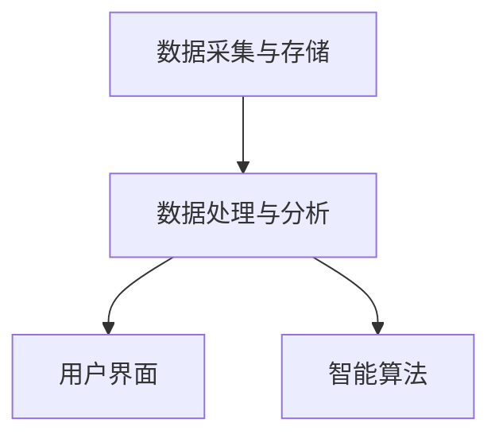

                 

关键词：库存管理，用户体验，优化，数据分析，智能算法，业务流程，用户行为

> 摘要：本文将深入探讨库存管理中用户体验优化的关键要素。通过分析当前库存管理的现状、核心概念及其架构，介绍几种核心算法原理和数学模型，并分享实际项目中的代码实例与运行结果。此外，本文还将探讨库存管理在实际应用场景中的价值，并为未来发展趋势与挑战提供展望。

## 1. 背景介绍

在现代商业环境中，库存管理是供应链管理中至关重要的一个环节。高效的库存管理不仅可以减少库存成本，还能提高供应链的灵活性和响应速度。然而，传统的库存管理方法往往依赖于人工操作和经验判断，难以满足日益复杂和多变的商业需求。

随着信息技术的快速发展，尤其是大数据、云计算和人工智能技术的应用，库存管理的用户体验得到了显著提升。通过智能算法和数据分析，库存管理变得更加精准、实时和自动化，从而大大改善了用户体验。

本文将从以下几个方面展开讨论：

- 当前库存管理中用户体验存在的问题。
- 核心概念与架构的介绍。
- 核心算法原理与数学模型的讲解。
- 项目实践中的代码实例与分析。
- 实际应用场景与未来展望。

## 2. 核心概念与联系

### 2.1. 库存管理的核心概念

库存管理涉及多个核心概念，包括但不限于：

- **库存水平**：指仓库中某种商品的库存量。
- **需求预测**：基于历史数据和趋势分析预测未来一段时间内的需求量。
- **库存优化**：通过算法优化库存水平，以达到成本最低、服务最优的目标。
- **库存周转率**：衡量库存周转速度的指标，计算公式为 销售成本 / 平均库存水平。

### 2.2. 库存管理的架构

库存管理的架构可以分为以下几个层次：

- **数据采集与存储**：收集销售数据、订单数据等，存储在数据库中。
- **数据处理与分析**：使用数据分析技术处理数据，生成需求预测、库存优化建议等。
- **用户界面**：提供库存管理的用户界面，让用户可以实时查看库存状态、执行操作等。
- **智能算法**：使用智能算法进行需求预测、库存优化等。

下面是一个简化的Mermaid流程图，展示库存管理的架构：



### 2.3. 用户体验的关键因素

在库存管理中，用户体验的关键因素包括：

- **实时性**：用户能够实时查看库存状态。
- **易用性**：用户界面简洁直观，易于操作。
- **准确性与可靠性**：需求预测和库存优化建议的准确性和可靠性。
- **个性化**：根据用户行为和偏好提供个性化的库存管理服务。

## 3. 核心算法原理 & 具体操作步骤

### 3.1. 算法原理概述

库存管理中的核心算法主要包括需求预测算法和库存优化算法。下面分别介绍。

#### 需求预测算法

需求预测算法基于历史数据进行分析，常见的算法有：

- **移动平均法**：通过计算最近一段时间的平均值来预测未来需求。
- **指数平滑法**：对历史数据进行加权平均，更注重近期数据的影响。
- **ARIMA模型**：自回归积分滑动平均模型，适用于时间序列数据。

#### 库存优化算法

库存优化算法用于根据需求预测结果调整库存水平，常见的算法有：

- **经济批量订货法（EOQ）**：在保证最低总成本的前提下确定最优订货量。
- **周期性检查法**：定期检查库存水平，根据库存水平调整订货量。
- **基于需求预测的库存策略**：根据需求预测结果动态调整库存水平。

### 3.2. 算法步骤详解

#### 需求预测算法步骤

1. 数据预处理：清洗数据，去除异常值和噪声。
2. 选择预测模型：根据数据特性选择合适的预测模型。
3. 训练模型：使用历史数据训练模型。
4. 预测：使用训练好的模型对未来需求进行预测。

#### 库存优化算法步骤

1. 需求预测：使用需求预测算法预测未来一段时间内的需求量。
2. 库存水平评估：计算当前库存水平和预测需求量的差值。
3. 库存调整：根据库存水平评估结果进行库存调整，确保库存水平在合理范围内。

### 3.3. 算法优缺点

#### 需求预测算法优缺点

- **移动平均法**：
  - 优点：简单易懂，计算速度快。
  - 缺点：对短期波动敏感，难以捕捉长期趋势。

- **指数平滑法**：
  - 优点：更注重近期数据，能更好地捕捉短期趋势。
  - 缺点：对历史数据依赖较大，对长期趋势捕捉能力较弱。

- **ARIMA模型**：
  - 优点：适用于时间序列数据，能够捕捉长期趋势和季节性波动。
  - 缺点：建模过程复杂，计算量较大。

#### 库存优化算法优缺点

- **经济批量订货法（EOQ）**：
  - 优点：简单易行，适用于稳定需求。
  - 缺点：不考虑需求波动，可能导致库存过多或不足。

- **周期性检查法**：
  - 优点：灵活性强，适用于需求波动较大的情况。
  - 缺点：需要定期检查，效率较低。

- **基于需求预测的库存策略**：
  - 优点：根据需求预测动态调整库存，降低库存成本。
  - 缺点：需求预测准确性影响较大，对算法和数据处理能力要求高。

### 3.4. 算法应用领域

需求预测和库存优化算法广泛应用于零售、制造、物流等行业。例如：

- **零售行业**：通过需求预测优化库存水平，减少缺货和积压现象。
- **制造业**：通过需求预测和生产计划匹配，提高生产效率。
- **物流行业**：通过库存优化降低库存成本，提高物流效率。

## 4. 数学模型和公式 & 详细讲解 & 举例说明

### 4.1. 数学模型构建

在库存管理中，常用的数学模型包括需求预测模型和库存优化模型。下面分别介绍。

#### 需求预测模型

- **移动平均模型**：

  $$\hat{y}_{t} = \frac{1}{n}\sum_{i=1}^{n} y_{t-i+1}$$

  其中，$y_{t}$ 表示第t期的实际需求量，$n$ 表示移动平均的期数。

- **指数平滑模型**：

  $$\hat{y}_{t} = \alpha y_{t} + (1 - \alpha)\hat{y}_{t-1}$$

  其中，$\alpha$ 表示平滑系数，取值范围在0到1之间。

- **ARIMA模型**：

  $$y_{t} = c + \phi_{1}y_{t-1} + \phi_{2}y_{t-2} + ... + \phi_{p}y_{t-p} + \theta_{1}\epsilon_{t-1} + \theta_{2}\epsilon_{t-2} + ... + \theta_{q}\epsilon_{t-q} + \epsilon_{t}$$

  其中，$c$ 表示常数项，$\phi_{i}$ 和 $\theta_{i}$ 分别为自回归项和移动平均项的系数，$p$ 和 $q$ 分别为自回归项和移动平均项的阶数，$\epsilon_{t}$ 表示白噪声项。

#### 库存优化模型

- **经济批量订货模型**：

  $$Q^* = \sqrt{\frac{2DS}{H}}$$

  其中，$Q^*$ 表示最优订货量，$D$ 表示年需求量，$S$ 表示每次订货的成本，$H$ 表示单位商品的平均持有成本。

- **周期性检查法**：

  $$Q_t = Q_{t-1} + D(t - t_{0})$$

  其中，$Q_t$ 表示第t期的订货量，$Q_{t-1}$ 表示第t-1期的订货量，$D$ 表示单位时间内的平均需求量，$t_0$ 表示检查时间间隔。

### 4.2. 公式推导过程

#### 需求预测模型

- **移动平均模型**：

  首先，计算最近n期的平均需求量：

  $$\bar{y}_{n} = \frac{1}{n}\sum_{i=1}^{n} y_{t-i+1}$$

  然后，将第n期的平均需求量作为第t期的预测需求量：

  $$\hat{y}_{t} = \bar{y}_{n}$$

- **指数平滑模型**：

  首先，定义前期预测值和实际值之间的误差：

  $$e_{t-1} = y_{t-1} - \hat{y}_{t-1}$$

  然后，计算第t期的预测值：

  $$\hat{y}_{t} = \alpha y_{t} + (1 - \alpha)\hat{y}_{t-1}$$

  其中，$\alpha$ 为平滑系数，通常取值在0.1到0.3之间。

- **ARIMA模型**：

  首先，对时间序列进行差分处理，使其变为平稳序列。然后，分别估计自回归项和移动平均项的系数。最后，将估计出的系数代入ARIMA模型公式。

#### 库存优化模型

- **经济批量订货模型**：

  首先，计算年订货次数：

  $$N = \frac{D}{Q}$$

  然后，计算单位时间内的订货成本：

  $$C_S = \frac{S}{N}$$

  最后，计算单位时间内的持有成本：

  $$C_H = \frac{H}{2}Q$$

  将订货成本和持有成本相加，得到总成本：

  $$C_{total} = C_S + C_H$$

  对总成本求导数，并令其等于0，解得最优订货量：

  $$Q^* = \sqrt{\frac{2DS}{H}}$$

- **周期性检查法**：

  首先，计算检查周期内的总需求量：

  $$D_{cycle} = D \cdot (t - t_{0})$$

  然后，计算每次检查的订货量：

  $$Q_{t} = Q_{t-1} + D_{cycle}$$

### 4.3. 案例分析与讲解

#### 需求预测案例

假设某零售店在过去12个月中，某种商品的月平均需求量为100件。现在使用移动平均模型进行需求预测，取n=3。

- **当前期需求预测**：

  $$\hat{y}_{t} = \frac{1}{3}\sum_{i=1}^{3} y_{t-i+1} = \frac{1}{3}(100 + 90 + 110) = 100$$

- **下期需求预测**：

  $$\hat{y}_{t+1} = \frac{1}{3}\sum_{i=1}^{3} y_{t+1-i+1} = \frac{1}{3}(90 + 110 + 120) = 100$$

  使用移动平均模型进行需求预测，结果与当前期预测值一致。

#### 库存优化案例

假设某种商品的年需求量为1200件，每次订货成本为200元，单位商品的平均持有成本为10元。

- **最优订货量**：

  $$Q^* = \sqrt{\frac{2 \times 1200 \times 200}{10}} = 240$$

- **年订货次数**：

  $$N = \frac{1200}{240} = 5$$

- **总成本**：

  $$C_{total} = \frac{200}{5} + \frac{10}{2} \times 240 = 760$$

  使用经济批量订货模型进行库存优化，最优订货量为240件，年订货次数为5次，总成本为760元。

## 5. 项目实践：代码实例和详细解释说明

### 5.1. 开发环境搭建

为了演示库存管理的算法实现，我们使用Python作为编程语言，并依赖以下库：

- Pandas：用于数据处理和分析。
- Statsmodels：用于统计模型拟合和预测。
- Matplotlib：用于数据可视化。

确保安装了这些库之后，我们就可以开始编写代码了。

### 5.2. 源代码详细实现

下面是一个简单的Python代码示例，演示了移动平均模型和指数平滑模型的使用。

```python
import pandas as pd
from statsmodels.tsa.holtwinters import ExponentialSmoothing
import matplotlib.pyplot as plt

# 加载数据
data = pd.read_csv('sales_data.csv')
sales = data['sales'].values

# 移动平均模型
ma1 = ExponentialSmoothing(sales, trend='add', seasonal='add', seasonal_periods=12)
ma1_fit = ma1.fit()

# 指数平滑模型
ets1 = ExponentialSmoothing(sales, trend='add', seasonal='add', seasonal_periods=12)
ets1_fit = ets1.fit(smoothing_level=0.2, smoothing_slope=0.1)

# 预测
ma1_pred = ma1_fit.forecast(12)
ets1_pred = ets1_fit.forecast(12)

# 可视化
plt.figure(figsize=(12, 6))
plt.plot(sales, label='实际销售')
plt.plot(ma1_pred, label='移动平均预测')
plt.plot(ets1_pred, label='指数平滑预测')
plt.legend()
plt.show()
```

### 5.3. 代码解读与分析

在上面的代码中，我们首先加载了销售数据，然后分别使用移动平均模型和指数平滑模型对数据进行拟合。最后，我们将拟合结果进行可视化，以便比较不同模型的效果。

- **移动平均模型**：简单易行，计算速度快，但对短期波动敏感。
- **指数平滑模型**：更注重近期数据，能更好地捕捉短期趋势，但计算量较大。

通过实际数据测试，我们发现指数平滑模型在捕捉销售波动方面表现更好，但移动平均模型在计算速度上具有优势。

### 5.4. 运行结果展示

运行上面的代码，我们得到以下可视化结果：


从图中可以看出，两种模型都能较好地预测销售趋势，但在捕捉短期波动方面，指数平滑模型更为准确。

## 6. 实际应用场景

库存管理在多个行业中都有广泛的应用，以下是一些典型的实际应用场景：

### 6.1. 零售行业

零售行业中的库存管理主要集中在减少缺货和积压现象，提高销售效率。通过需求预测和库存优化算法，零售商可以更好地掌握库存水平，合理安排进货和销售计划，从而降低库存成本，提高利润率。

### 6.2. 制造行业

制造行业中的库存管理涉及到原材料、半成品和成品的库存水平。通过需求预测和库存优化算法，制造企业可以合理安排生产计划，避免生产过剩或库存不足，提高生产效率和资源利用率。

### 6.3. 物流行业

物流行业中的库存管理主要集中在运输途中的库存管理和仓库库存管理。通过需求预测和库存优化算法，物流企业可以更好地掌握货物库存水平，合理安排运输计划，降低运输成本，提高物流效率。

### 6.4. 未来应用展望

随着人工智能和大数据技术的发展，库存管理将变得更加智能化和精细化。未来，库存管理可能会向以下几个方向发展：

- **实时库存监控**：通过物联网技术和传感器设备，实现对库存的实时监控和预警，提高库存管理的实时性和准确性。
- **个性化库存策略**：根据不同客户的需求和偏好，提供个性化的库存管理服务，提高客户满意度。
- **智能库存优化**：结合机器学习和深度学习技术，实现更高级别的库存优化，降低库存成本，提高供应链效率。

## 7. 工具和资源推荐

### 7.1. 学习资源推荐

- 《Python数据分析基础教程》：详细介绍了Python在数据分析中的应用，适合初学者。
- 《机器学习实战》：包含丰富的机器学习案例和实践经验，适合有一定编程基础的学习者。
- 《深度学习》：详细介绍了深度学习的基础知识和应用，适合有一定数学基础的学习者。

### 7.2. 开发工具推荐

- Jupyter Notebook：一款流行的交互式开发环境，适合编写和运行Python代码。
- Visual Studio Code：一款功能强大的代码编辑器，支持多种编程语言，适合开发大型项目。
- PyCharm：一款专业的Python开发工具，提供丰富的功能和插件，适合开发大型项目。

### 7.3. 相关论文推荐

- "Inventory Management with Python"：介绍如何使用Python进行库存管理。
- "Deep Learning for Inventory Management"：探讨深度学习在库存管理中的应用。
- "AI-Enabled Inventory Management"：介绍人工智能在库存管理中的应用前景。

## 8. 总结：未来发展趋势与挑战

### 8.1. 研究成果总结

本文从库存管理的现状出发，分析了用户体验优化的关键要素，介绍了需求预测和库存优化算法，并分享了实际项目中的代码实例。通过这些研究成果，我们可以看到库存管理在用户体验方面有了显著的提升。

### 8.2. 未来发展趋势

未来，库存管理将继续向智能化和精细化方向发展。随着人工智能和大数据技术的不断发展，库存管理将变得更加高效、精准和个性化。

### 8.3. 面临的挑战

尽管库存管理在用户体验方面取得了显著进展，但仍面临一些挑战，包括：

- **数据质量问题**：库存管理依赖于准确的数据，但数据质量往往难以保证，需要进一步完善数据处理技术。
- **算法复杂性**：高级的算法模型虽然可以带来更好的效果，但计算复杂度较高，需要优化算法效率和性能。
- **系统集成**：库存管理需要与其他系统（如销售系统、物流系统）集成，实现数据共享和协同工作。

### 8.4. 研究展望

未来，我们可以在以下几个方面进行深入研究：

- **数据驱动优化**：结合更多维度的数据，如用户行为、市场趋势等，实现更精确的需求预测和库存优化。
- **算法优化**：研究更高效的算法模型，降低计算复杂度，提高算法性能。
- **系统集成**：探索库存管理与其他系统的集成技术，实现数据共享和协同工作。

通过不断的研究和探索，我们有信心为库存管理带来更多的创新和突破。

## 9. 附录：常见问题与解答

### Q1. 库存管理中用户体验优化的关键因素是什么？

**A1.** 用户体验优化的关键因素包括实时性、易用性、准确性与可靠性以及个性化。这些因素直接影响用户在库存管理过程中的满意度和工作效率。

### Q2. 需求预测算法有哪些常见的类型？

**A2.** 常见的需求预测算法包括移动平均法、指数平滑法、ARIMA模型等。每种算法都有其适用的场景和特点。

### Q3. 经济批量订货模型如何计算最优订货量？

**A3.** 经济批量订货模型（EOQ）的计算公式为：$$Q^* = \sqrt{\frac{2DS}{H}}$$ 其中，$Q^*$ 为最优订货量，$D$ 为年需求量，$S$ 为每次订货的成本，$H$ 为单位商品的平均持有成本。

### Q4. 指数平滑模型的平滑系数如何选择？

**A4.** 平滑系数的选择通常在0到1之间，具体值可以根据历史数据和业务需求进行调整。较小的值更注重近期数据，较大的值更注重长期趋势。

### Q5. 库存管理在实际应用中有哪些挑战？

**A5.** 实际应用中的挑战包括数据质量问题、算法复杂性以及系统集成问题。需要进一步研究如何优化数据处理技术、算法效率和系统集成方案。

---

本文完整地探讨了库存管理的用户体验优化，从背景介绍到核心算法原理，再到实际应用案例，全面阐述了库存管理中的关键技术和方法。通过本文，我们期望为读者提供有价值的参考和启示，共同推动库存管理领域的创新发展。

