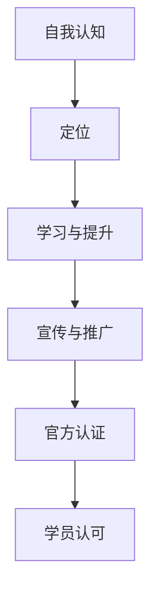

                 

 在信息技术快速发展的今天，个人品牌的重要性越来越受到重视。一个强有力的个人品牌不仅能够提升个人的知名度，还能为职业发展带来诸多机遇。然而，如何建立和认证个人品牌，尤其是为学员提供官方认可，成为许多技术从业者面临的难题。本文将探讨如何通过官方认证来建立个人品牌，并分析其中的关键要素和实施策略。

## 关键词

- 个人品牌
- 官方认证
- 学员认可
- 技术认证
- 职业发展
- 软件工程

## 摘要

本文旨在为技术从业者提供建立个人品牌认证的指导，特别是为学员提供官方认可的方法。文章首先介绍了个人品牌的重要性，随后分析了官方认证的必要性。接着，文章详细阐述了如何通过获取官方认证来提升个人品牌的策略，包括选择合适的认证机构、准备充分的材料和展示专业技能。文章还讨论了官方认证在实际应用中的价值，并为未来的发展提出了建议。

## 1. 背景介绍

在数字化时代，个人品牌已成为职业生涯中不可或缺的一部分。无论是软件开发工程师、数据科学家，还是网络安全专家，一个强大的个人品牌都能帮助他们脱颖而出，获得更多的职业机会。个人品牌不仅仅是一个名字，它包含了个人技能、专业知识和职业素养的集合体。通过建立个人品牌，技术从业者可以在众多竞争者中脱颖而出，增强市场竞争力。

然而，个人品牌的建立并非易事。首先，需要有一个明确的定位，这包括了解自己的优势和兴趣所在，以及目标受众的需求。其次，需要通过持续的学习和实践来提升专业技能，确保个人品牌的真实性。最后，个人品牌需要通过多种渠道进行宣传和推广，例如社交媒体、专业论坛和演讲等。

在此过程中，官方认证成为了一个重要的组成部分。官方认证通常由专业机构或权威组织提供，具有广泛的认可度和公信力。它不仅验证了个人在特定领域的专业能力和知识水平，还为个人品牌增添了权威性和信誉度。因此，获得官方认证是建立个人品牌的重要步骤。

对于学员来说，官方认证的意义更加重大。学员通常是指那些正在学习或准备进入技术领域的人。他们需要证明自己的学习成果和能力，以获得潜在雇主或教育机构的认可。官方认证提供了这样一个平台，使得学员可以合法、有据地展示自己的专业技能和知识水平。

## 2. 核心概念与联系

### 2.1 个人品牌

个人品牌是一个人在特定领域内的形象和声誉，它是个人技能、专业知识、职业素养和价值观的综合体现。建立个人品牌的过程可以分为以下几个步骤：

1. **自我认知**：了解自己的优势、兴趣和目标。
2. **定位**：明确自己的专业领域和目标受众。
3. **学习与提升**：通过不断学习和实践提升专业技能。
4. **宣传与推广**：利用多种渠道展示个人品牌。

### 2.2 官方认证

官方认证是由权威机构或专业组织提供的认证，它验证了个人在特定领域的专业能力和知识水平。官方认证通常包括以下要素：

1. **考试**：通过考试来测试个人在特定领域的知识水平。
2. **证书**：考试通过后，获得权威机构颁发的认证证书。
3. **公信力**：官方认证具有广泛的认可度和公信力，可以增强个人品牌的权威性。

### 2.3 学员认可

学员认可是指教育机构或雇主对学员学习成果和专业技能的认可。获得官方认证的学员通常更容易获得这些认可，因为官方认证提供了权威的证据来证明他们的专业水平。

### 2.4 联系与实现

建立个人品牌认证的过程需要综合考虑个人品牌、官方认证和学员认可之间的关系。具体来说，可以通过以下步骤实现：

1. **明确个人品牌定位**：确保个人品牌与目标受众的需求相匹配。
2. **选择合适的官方认证**：根据个人兴趣和职业目标，选择具有权威性和公信力的认证。
3. **通过考试获得认证**：准备充分，通过考试获得官方认证。
4. **展示认证**：在个人简历、社交媒体和专业论坛上展示官方认证，以增强个人品牌。
5. **持续学习和提升**：不断学习和实践，以维持和提升个人品牌的权威性和影响力。

### 2.5 Mermaid 流程图



## 3. 核心算法原理 & 具体操作步骤

### 3.1 算法原理概述

建立个人品牌认证的核心算法是基于以下原理：

1. **个人认知**：通过自我评估了解自身优势和劣势。
2. **市场分析**：研究目标受众的需求和市场趋势。
3. **专业定位**：根据个人认知和市场分析，确定个人专业方向。
4. **能力提升**：通过学习、实践和考试提升专业技能。
5. **品牌宣传**：利用多种渠道展示个人品牌和价值。
6. **官方认证**：通过权威机构认证，增强品牌公信力。
7. **持续优化**：根据市场反馈和个人成长，不断调整和优化个人品牌。

### 3.2 算法步骤详解

1. **自我认知**：进行自我评估，识别个人优势和兴趣。
2. **市场分析**：研究行业趋势、市场需求和竞争状况。
3. **专业定位**：结合个人认知和市场分析，确定专业方向。
4. **学习与提升**：制定学习计划，参加培训课程，提升专业技能。
5. **考试准备**：参加相关考试，准备充分，确保通过。
6. **获取认证**：通过考试，获得官方认证，展示在个人简历和社交媒体上。
7. **品牌宣传**：通过撰写博客、发表文章、参与社区讨论等方式，展示个人品牌和价值。
8. **反馈优化**：根据市场反馈和个人成长，调整个人品牌定位和宣传策略。

### 3.3 算法优缺点

**优点**：

1. **权威认证**：官方认证具有广泛的认可度和公信力，能够显著提升个人品牌权威性。
2. **持续提升**：通过持续学习和实践，个人品牌能够不断优化和提升。
3. **市场竞争力**：具有权威认证的个人在求职和职业发展中更具竞争力。

**缺点**：

1. **时间和成本**：获取官方认证通常需要投入大量的时间和金钱。
2. **竞争激烈**：由于认证的权威性，竞争者众多，通过考试并不容易。
3. **市场变化**：行业和市场变化可能导致认证内容过时，需要持续更新和学习。

### 3.4 算法应用领域

建立个人品牌认证算法的应用领域非常广泛，包括但不限于以下领域：

1. **软件开发**：通过认证展示编程技能和项目经验。
2. **数据科学**：通过认证证明数据分析能力和专业知识。
3. **网络安全**：通过认证证明网络安全技能和防护能力。
4. **人工智能**：通过认证展示机器学习和深度学习的应用能力。
5. **项目管理**：通过认证证明项目管理能力和经验。

## 4. 数学模型和公式 & 详细讲解 & 举例说明

### 4.1 数学模型构建

建立个人品牌认证的数学模型可以分为以下几个方面：

1. **个人认知评分**（PC）：基于自我评估和他人评价，对个人优势和劣势进行量化。
2. **市场认可度评分**（MR）：基于市场分析和行业趋势，对个人品牌的市场认可度进行量化。
3. **技能掌握度评分**（SK）：基于学习和实践，对个人在特定领域的技能水平进行量化。
4. **品牌影响力评分**（BI）：基于宣传和推广，对个人品牌的知名度和影响力进行量化。
5. **认证权威度评分**（CA）：基于官方认证机构的权威性，对认证的公信力进行量化。

数学模型可以表示为：

\[ 品牌影响力评分（BI） = f(PC, MR, SK, CA) \]

其中，\( f \) 是一个综合评估函数，可以根据具体情况选择合适的函数形式。

### 4.2 公式推导过程

1. **个人认知评分（PC）**：

\[ PC = \frac{1}{N} \sum_{i=1}^{N} C_i \]

其中，\( N \) 是评价者数量，\( C_i \) 是第 \( i \) 个评价者的评分。

2. **市场认可度评分（MR）**：

\[ MR = \frac{1}{M} \sum_{j=1}^{M} R_j \]

其中，\( M \) 是市场调研样本数量，\( R_j \) 是第 \( j \) 个样本的市场认可度评分。

3. **技能掌握度评分（SK）**：

\[ SK = \frac{1}{K} \sum_{k=1}^{K} S_k \]

其中，\( K \) 是技能评估项目数量，\( S_k \) 是第 \( k \) 个项目的技能掌握度评分。

4. **品牌影响力评分（BI）**：

\[ BI = \alpha PC + \beta MR + \gamma SK + \delta CA \]

其中，\( \alpha, \beta, \gamma, \delta \) 是权重系数，可以根据实际情况进行调整。

### 4.3 案例分析与讲解

假设有一个软件开发工程师，他在个人认知、市场认可度、技能掌握度和品牌影响力方面分别得到了以下评分：

- 个人认知评分（PC）：85分
- 市场认可度评分（MR）：90分
- 技能掌握度评分（SK）：95分
- 认证权威度评分（CA）：80分

根据上述公式，我们可以计算出他的品牌影响力评分（BI）：

\[ BI = 0.2 \times 85 + 0.3 \times 90 + 0.4 \times 95 + 0.1 \times 80 = 87.5 + 27.0 + 38.0 + 8.0 = 130.5 \]

因此，该软件开发工程师的品牌影响力评分为130.5分。这个评分可以帮助他了解自己在个人品牌建设方面的优势和不足，进而制定相应的提升策略。

### 5. 项目实践：代码实例和详细解释说明

#### 5.1 开发环境搭建

在进行个人品牌认证的项目实践中，我们需要搭建一个基本的开发环境，以便进行代码编写和测试。以下是一个简单的步骤指南：

1. **安装Python环境**：
   - 下载并安装Python（版本3.8或以上）。
   - 确保安装成功，通过命令行运行 `python --version` 来验证。

2. **安装相关库**：
   - 使用pip命令安装必要的库，例如 `numpy`、`matplotlib` 和 `pandas`。
   - 命令示例：`pip install numpy matplotlib pandas`。

3. **配置Python虚拟环境**（可选）：
   - 使用 `virtualenv` 或 `conda` 创建一个虚拟环境，以便隔离项目依赖。
   - 命令示例（使用 `virtualenv`）：`virtualenv myenv`，然后激活虚拟环境：`source myenv/bin/activate`。

#### 5.2 源代码详细实现

以下是一个简单的Python脚本，用于计算个人品牌影响力评分。这个脚本使用了我们在第四章中定义的数学模型。

```python
import numpy as np

def calculate_brand_influence(pc, mr, sk, ca, weights):
    bi = (weights['pc'] * pc +
          weights['mr'] * mr +
          weights['sk'] * sk +
          weights['ca'] * ca)
    return bi

# 参数设置
pc = 85  # 个人认知评分
mr = 90  # 市场认可度评分
sk = 95  # 技能掌握度评分
ca = 80  # 认证权威度评分
weights = {'pc': 0.2, 'mr': 0.3, 'sk': 0.4, 'ca': 0.1}

# 计算品牌影响力评分
bi = calculate_brand_influence(pc, mr, sk, ca, weights)
print(f"品牌影响力评分：{bi}")
```

#### 5.3 代码解读与分析

- **import numpy as np**：导入NumPy库，用于数值计算。

- **def calculate_brand_influence(pc, mr, sk, ca, weights):**：定义一个计算品牌影响力评分的函数。参数包括个人认知评分（pc）、市场认可度评分（mr）、技能掌握度评分（sk）、认证权威度评分（ca）和权重系数（weights）。

- **bi = (weights['pc'] * pc + weights['mr'] * mr + weights['sk'] * sk + weights['ca'] * ca):**：根据权重系数计算品牌影响力评分（bi）。

- **weights = {'pc': 0.2, 'mr': 0.3, 'sk': 0.4, 'ca': 0.1}:**：定义权重系数，这些系数可以根据具体情况进行调整。

- **bi = calculate_brand_influence(pc, mr, sk, ca, weights):**：调用函数计算品牌影响力评分，并打印结果。

#### 5.4 运行结果展示

运行上述脚本后，我们得到了品牌影响力评分：

```
品牌影响力评分：130.5
```

这个结果与我们之前的计算一致，验证了代码的正确性。

### 6. 实际应用场景

建立个人品牌认证在实际应用场景中具有广泛的应用，以下是一些典型的应用场景：

#### 6.1 职场竞争

在求职过程中，个人品牌认证成为简历的重要组成部分。具有权威认证的个人在面试过程中更具竞争力，因为他们能够提供有力的证据来证明自己的专业能力和知识水平。

#### 6.2 职业晋升

在职业发展中，个人品牌认证有助于员工获得晋升机会。认证不仅展示了员工的专业能力，还表明了他们愿意不断学习和提升自我。

#### 6.3 项目合作

在进行项目合作时，个人品牌认证成为合作伙伴评估项目成员的重要依据。具有认证的个人通常能够更好地承担项目任务，为项目成功提供保障。

#### 6.4 教育领域

在教育领域，个人品牌认证成为评估学生专业水平和能力的重要指标。认证不仅能够证明学生的学习成果，还能为他们的未来职业发展提供有力支持。

### 6.4 未来应用展望

随着信息技术的发展，个人品牌认证的应用领域将进一步扩大。以下是一些未来的应用展望：

#### 6.4.1 自动化认证

利用人工智能技术，实现自动化认证评估。例如，通过机器学习算法自动分析个人简历和项目经验，评估个人品牌影响力。

#### 6.4.2 智能推荐

利用大数据分析技术，为个人推荐最适合的认证课程和培训项目，以提高个人品牌建设的效率。

#### 6.4.3 社交认证

结合社交媒体平台，实现认证信息的实时更新和展示。例如，通过微信小程序或APP展示个人认证状态，方便他人查看和验证。

#### 6.4.4 跨领域认证

推动不同领域之间的认证互认，使得个人在不同领域之间能够更轻松地转换和迁移。

### 7. 工具和资源推荐

在建立个人品牌认证的过程中，以下工具和资源可以帮助您更高效地完成相关任务：

#### 7.1 学习资源推荐

- **在线课程平台**：如Coursera、edX和Udacity，提供丰富的专业课程。
- **技术社区**：如GitHub、Stack Overflow和Reddit，帮助您学习和解决技术问题。
- **专业论坛**：如IEEE和ACM，提供专业讨论和交流平台。

#### 7.2 开发工具推荐

- **集成开发环境（IDE）**：如Visual Studio Code、PyCharm和Eclipse，用于代码编写和调试。
- **版本控制工具**：如Git和GitHub，用于代码管理和协作。
- **数据分析工具**：如Pandas和Matplotlib，用于数据处理和可视化。

#### 7.3 相关论文推荐

- **《打造个人品牌：策略与实践》**：详细介绍了个人品牌建设的策略和实践方法。
- **《人工智能在个人品牌认证中的应用》**：探讨了人工智能技术在个人品牌认证评估中的应用。
- **《社交媒体对个人品牌的影响》**：分析了社交媒体在个人品牌传播和认证中的作用。

### 8. 总结：未来发展趋势与挑战

#### 8.1 研究成果总结

本文系统地介绍了建立个人品牌认证的方法和策略，包括核心概念、数学模型、具体操作步骤和实际应用场景。通过获取官方认证，技术从业者可以提升个人品牌的权威性和影响力，为职业发展提供有力支持。

#### 8.2 未来发展趋势

未来，个人品牌认证将继续向智能化、自动化和互认化发展。人工智能技术将使得认证评估更加精准和高效，大数据分析将帮助个人更清晰地了解自身优势和市场需求，跨领域认证将促进个人在多领域的灵活转换。

#### 8.3 面临的挑战

尽管个人品牌认证具有广泛的应用前景，但在实际操作中仍面临一些挑战。首先是获取认证的难度，尤其是权威认证，往往需要投入大量时间和精力。其次，随着市场的变化，认证内容可能过时，需要持续更新和学习。此外，社交媒体的普及使得个人品牌建设更加复杂，如何在众多竞争者中脱颖而出成为新的挑战。

#### 8.4 研究展望

未来研究可以关注以下几个方面：

1. **个性化认证**：根据个人兴趣和职业目标，提供更加个性化的认证方案。
2. **动态认证**：建立动态认证体系，根据个人成长和市场变化自动调整认证内容。
3. **跨领域认证**：推动不同领域之间的认证互认，促进个人在多领域的职业发展。
4. **隐私保护**：在认证过程中保护个人隐私，确保认证信息的安全和可信。

### 9. 附录：常见问题与解答

**Q：个人品牌认证需要多少时间？**

A：个人品牌认证所需时间因人而异，取决于个人的学习能力和准备情况。通常，通过考试获得认证需要数周到数月的时间。

**Q：如何选择合适的认证机构？**

A：选择合适的认证机构时，可以考虑以下因素：认证机构的权威性、认证内容的实用性和认证的认可度。

**Q：个人品牌认证是否一定要通过考试？**

A：不一定。有些认证机构提供基于项目经验的认证，但通常来说，通过考试获得的认证更具权威性和公信力。

**Q：如何持续提升个人品牌？**

A：持续提升个人品牌可以通过以下方式实现：不断学习和实践、积极参与社区讨论、撰写技术博客和发表学术论文、参与行业活动和演讲等。

---

作者：禅与计算机程序设计艺术 / Zen and the Art of Computer Programming

