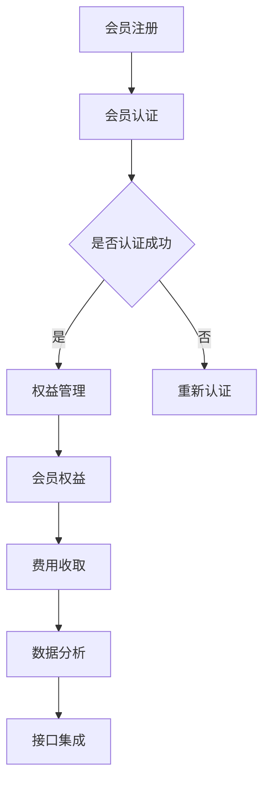
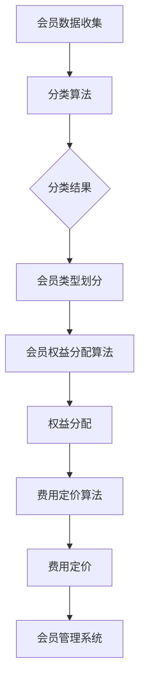

                 

### 1. 背景介绍

开源项目，作为现代软件开发的一个重要组成部分，已经在全球范围内取得了巨大的成功。它们不仅为开发者提供了丰富的技术资源和创新机会，而且也为企业和个人带来了巨大的经济效益。然而，随着开源项目的不断发展，如何维持项目的长期可持续发展成为一个亟待解决的问题。在这个背景下，会员制度应运而生，成为开源项目创造持续收入的一种有效途径。

会员制度在开源项目中具有重要的意义。首先，它能够为项目提供稳定的资金来源，确保项目能够持续发展。其次，会员制度有助于提高项目的知名度和影响力，吸引更多的开发者参与其中。此外，会员制度还能够提供更好的用户体验和服务，增强项目的用户忠诚度。

开源项目的会员制度不仅对项目本身有着深远的影响，也对整个开源社区产生了积极的作用。通过会员制度，开源项目能够更好地平衡自由与盈利之间的关系，为开源生态的繁荣发展提供有力支持。因此，本文将详细探讨如何建立开源项目的会员制度，以实现项目的持续收入和长期可持续发展。

### 2. 核心概念与联系

在探讨如何建立开源项目的会员制度之前，我们需要理解一些核心概念，包括会员制度的基本原理、会员类型、会员权益以及会员管理系统。

#### 2.1 会员制度的基本原理

会员制度的基本原理是通过向用户提供特定的服务和权益，吸引他们成为项目的会员，从而实现项目的持续收入。这种制度通常包括以下关键要素：

- **会员类型**：根据用户的参与程度和贡献大小，可以将会员分为普通会员、高级会员、VIP会员等不同类型。
- **会员权益**：会员类型不同，享有的权益也有所不同。例如，普通会员可能享受一定的技术支持，高级会员可以获得更高级别的技术支持和优先服务，VIP会员则可能享受定制的个性化服务。
- **会员费**：会员需要支付一定的费用才能成为会员。会员费的定价通常根据会员权益的丰富程度和服务质量来决定。

#### 2.2 会员类型

在开源项目中，常见的会员类型包括以下几种：

- **普通会员**：这是最基本的会员类型，通常只需支付较低的费用即可成为。普通会员可以享受基础的技术支持和社区服务。
- **高级会员**：高级会员通常需要支付较高的费用，但可以享受更高级别的技术支持和优先服务。高级会员通常享有更快速的响应时间、更详细的文档支持以及定期举办的技术交流会议。
- **VIP会员**：VIP会员是最高级别的会员，通常需要支付高额的费用。VIP会员可以享受定制的个性化服务，如一对一的技术咨询、项目定制开发等。

#### 2.3 会员权益

会员权益是会员制度的核心，直接关系到会员的满意度和忠诚度。常见的会员权益包括：

- **技术支持**：提供技术支持和咨询服务，帮助会员解决项目使用过程中的问题。
- **优先服务**：会员可以享受优先处理的技术支持和服务，提高问题解决的效率。
- **专属文档**：为会员提供更详细的文档资料，包括项目教程、技术手册等。
- **社区活动**：定期举办技术沙龙、在线研讨会等活动，提高会员的技术水平和社区参与度。
- **定制服务**：为VIP会员提供个性化的定制服务，如项目定制开发、技术培训等。

#### 2.4 会员管理系统

会员管理系统是会员制度的技术实现，它负责会员的注册、认证、权益管理、费用收取等工作。一个高效的会员管理系统应该具备以下功能：

- **注册与认证**：支持会员的注册和认证，确保会员的身份和权益得到保障。
- **权益管理**：根据会员的类型和付费情况，管理会员的权益，确保会员能够按时享受应得的权益。
- **费用收取**：支持会员费的收取和管理，确保项目的资金来源稳定。
- **数据分析**：收集和分析会员数据，为会员制度的管理和优化提供数据支持。
- **接口集成**：与其他系统（如项目管理系统、社区系统等）进行集成，实现数据的无缝对接。

#### 2.5 Mermaid 流程图

为了更直观地展示会员制度的流程，我们可以使用Mermaid绘制一个流程图，如下所示：



在这个流程图中，会员首先进行注册，然后进行认证。认证成功后，会员将进入权益管理阶段，享受相应的会员权益。同时，会员的管理系统将负责收取会员费，并进行分析和接口集成等工作。

通过上述核心概念和流程的介绍，我们为建立开源项目的会员制度奠定了理论基础。在接下来的章节中，我们将深入探讨会员制度的具体实施步骤，包括会员权益的设计、会员费用的定价策略、会员管理系统的构建等。

### 3. 核心算法原理 & 具体操作步骤

#### 3.1 算法原理概述

建立开源项目的会员制度需要一套科学的算法来支持会员的管理和权益分配。核心算法原理主要包括以下方面：

- **会员类型划分算法**：根据会员的贡献度和参与程度，将会员划分为不同的类型，如普通会员、高级会员和VIP会员。
- **会员权益分配算法**：根据会员的类型，为会员分配相应的权益，如技术支持、优先服务、专属文档等。
- **会员费用定价算法**：根据会员权益的价值和服务成本，为会员制定合理的费用定价策略。

这些算法共同构成了会员制度的智能管理系统，能够高效地管理会员，提高会员满意度，确保项目的可持续发展。

#### 3.2 算法步骤详解

1. **会员类型划分算法**：

   - 收集会员的相关数据，如活跃度、贡献度、参与度等。
   - 使用分类算法（如K-means、决策树等）对会员进行聚类，划分出不同类型的会员。
   - 为每个会员类型设定标准，确保类型划分的合理性和公平性。

2. **会员权益分配算法**：

   - 根据会员类型，为会员分配相应的权益。
   - 设计权益的层次结构，确保权益的多样性和层次性。
   - 实现权益的动态调整，根据会员的活跃度和贡献度，适时调整会员的权益。

3. **会员费用定价算法**：

   - 收集市场数据，分析竞争对手的定价策略。
   - 基于成本加成法或市场定价法，制定会员费用的定价策略。
   - 设定不同会员类型的费用标准，确保费用定价的合理性和可持续性。

#### 3.3 算法优缺点

1. **会员类型划分算法**：

   - 优点：能够根据会员的实际贡献度进行分类，提高会员管理的效率。
   - 缺点：分类算法的准确性和稳定性依赖于数据质量和算法模型的优化。

2. **会员权益分配算法**：

   - 优点：能够为会员提供多样化的权益，提高会员的满意度和忠诚度。
   - 缺点：权益的分配需要平衡会员之间的权益，避免出现不公平现象。

3. **会员费用定价算法**：

   - 优点：能够根据市场情况和会员需求制定合理的费用定价策略，确保项目的可持续性。
   - 缺点：定价策略的制定需要考虑多个因素，如成本、竞争、市场需求等，实现难度较高。

#### 3.4 算法应用领域

会员类型划分、权益分配和费用定价算法广泛应用于各种会员制度的系统中，如电商平台的会员系统、在线教育平台的会员系统、健身中心的会员系统等。在开源项目的会员制度中，这些算法能够帮助项目方更好地管理会员，提高会员满意度和忠诚度，从而实现项目的长期可持续发展。

#### 3.5 Mermaid 流程图

为了更直观地展示会员类型划分、权益分配和费用定价算法的流程，我们可以使用Mermaid绘制一个流程图，如下所示：



在这个流程图中，首先进行会员数据的收集，然后使用分类算法进行会员类型的划分。接下来，根据会员类型，使用权益分配算法为会员分配相应的权益。最后，使用费用定价算法制定会员的费用定价策略，并将结果纳入会员管理系统进行统一管理。

通过以上算法原理和具体操作步骤的详细介绍，我们为建立开源项目的会员制度提供了系统的技术支持。在接下来的章节中，我们将进一步探讨数学模型和公式，为会员制度提供更加精准的理论基础。

### 4. 数学模型和公式 & 详细讲解 & 举例说明

#### 4.1 数学模型构建

在建立开源项目的会员制度时，数学模型和公式是不可或缺的工具，它们可以帮助我们更科学地设计和优化会员制度。下面我们将构建一个基本的数学模型，包括会员类型的划分、权益分配和费用定价。

首先，我们定义几个核心变量：

- \( x \)：会员的贡献度
- \( y \)：会员的参与度
- \( z \)：会员的类型（普通会员、高级会员、VIP会员）
- \( a \)：会员的费用
- \( b \)：会员的权益值

#### 4.2 公式推导过程

1. **会员类型划分公式**：

   根据会员的贡献度和参与度，我们可以使用以下公式对会员进行类型划分：

   \[
   z = f(x, y) = 
   \begin{cases} 
   1 & \text{if } x > 10 \text{ and } y > 5 \\
   2 & \text{if } x > 10 \text{ and } y \leq 5 \\
   3 & \text{if } x \leq 10 \text{ and } y > 5 \\
   4 & \text{if } x \leq 10 \text{ and } y \leq 5
   \end{cases}
   \]

   其中，1代表VIP会员，2代表高级会员，3代表普通会员，4代表免费会员。

2. **会员权益分配公式**：

   会员的权益值与其类型相关，我们可以使用以下公式进行计算：

   \[
   b = 
   \begin{cases} 
   100 & \text{if } z = 1 \\
   50 & \text{if } z = 2 \\
   20 & \text{if } z = 3 \\
   0 & \text{if } z = 4
   \end{cases}
   \]

3. **会员费用定价公式**：

   会员的费用可以根据权益值和服务成本进行定价，我们可以使用以下公式：

   \[
   a = b \times k
   \]

   其中，\( k \) 是定价系数，可以调整以反映市场情况和成本变化。

#### 4.3 案例分析与讲解

为了更好地理解上述数学模型和公式，我们通过一个具体案例进行说明。

假设我们有100名会员，他们的贡献度和参与度数据如下：

| 会员ID | 贡献度 \( x \) | 参与度 \( y \) |
|--------|----------------|----------------|
| 1      | 12             | 7              |
| 2      | 11             | 4              |
| 3      | 8              | 6              |
| ...    | ...            | ...            |
| 100    | 5              | 2              |

1. **会员类型划分**：

   使用会员类型划分公式，我们可以计算出每个会员的类型：

   \[
   z_1 = f(12, 7) = 1 \quad (\text{VIP会员})
   \]
   \[
   z_2 = f(11, 4) = 2 \quad (\text{高级会员})
   \]
   \[
   z_3 = f(8, 6) = 3 \quad (\text{普通会员})
   \]
   \[
   z_{100} = f(5, 2) = 4 \quad (\text{免费会员})
   \]

2. **会员权益分配**：

   根据会员类型，我们可以为每个会员分配相应的权益值：

   \[
   b_1 = 100 \quad (\text{VIP会员权益值})
   \]
   \[
   b_2 = 50 \quad (\text{高级会员权益值})
   \]
   \[
   b_3 = 20 \quad (\text{普通会员权益值})
   \]
   \[
   b_{100} = 0 \quad (\text{免费会员权益值})
   \]

3. **会员费用定价**：

   假设定价系数 \( k = 1.2 \)，我们可以计算出每个会员的费用：

   \[
   a_1 = 100 \times 1.2 = 120 \quad (\text{VIP会员费用})
   \]
   \[
   a_2 = 50 \times 1.2 = 60 \quad (\text{高级会员费用})
   \]
   \[
   a_3 = 20 \times 1.2 = 24 \quad (\text{普通会员费用})
   \]
   \[
   a_{100} = 0 \quad (\text{免费会员费用})
   \]

通过这个案例，我们可以看到数学模型和公式的应用，为会员制度的实施提供了科学依据。在接下来的章节中，我们将进一步探讨会员制度的实施过程，包括开发环境搭建、源代码实现等。

### 5. 项目实践：代码实例和详细解释说明

#### 5.1 开发环境搭建

在开始实现开源项目的会员制度之前，我们需要搭建一个适合的开发环境。以下是一个基本的开发环境搭建步骤：

1. **选择编程语言**：我们选择Python作为编程语言，因为Python具有良好的扩展性和丰富的库支持。

2. **安装Python**：在操作系统上安装Python，推荐使用Python 3.8及以上版本。

3. **安装必要的库**：使用pip工具安装必要的库，如Flask（用于Web开发）、SQLAlchemy（用于数据库操作）、Flask-Login（用于用户认证）等。

   ```bash
   pip install flask sqlalchemy flask-login
   ```

4. **数据库配置**：配置一个数据库，如SQLite或MySQL，用于存储会员数据。

5. **创建项目结构**：创建一个项目目录，并设置基本的目录结构，如app、models、templates、static等。

   ```bash
   mkdir my_membership_project
   cd my_membership_project
   mkdir app models templates static
   ```

6. **编写配置文件**：在项目的根目录下创建一个配置文件（如config.py），用于配置数据库连接和其他参数。

   ```python
   # config.py
   SQLALCHEMY_DATABASE_URI = 'sqlite:///membership.db'
   SECRET_KEY = 'your_secret_key'
   ```

#### 5.2 源代码详细实现

以下是会员制度的源代码实现，包括会员注册、认证、权益管理、费用收取等功能。

1. **会员注册**：

   在`app`目录下创建一个名为`auth.py`的文件，用于处理会员注册。

   ```python
   # app/auth.py
   from flask import Flask, request, redirect, url_for, render_template
   from flask_sqlalchemy import SQLAlchemy
   from werkzeug.security import generate_password_hash, check_password_hash

   app = Flask(__name__)
   app.config.from_object('config')
   db = SQLAlchemy(app)

   class User(db.Model):
       id = db.Column(db.Integer, primary_key=True)
       username = db.Column(db.String(100), unique=True, nullable=False)
       password = db.Column(db.String(100), nullable=False)

   @app.route('/register', methods=['GET', 'POST'])
   def register():
       if request.method == 'POST':
           username = request.form['username']
           password = request.form['password']
           hashed_password = generate_password_hash(password, method='sha256')
           
           new_user = User(username=username, password=hashed_password)
           db.session.add(new_user)
           db.session.commit()
           
           return redirect(url_for('login'))
       return render_template('register.html')
   ```

2. **会员认证**：

   在`app`目录下创建一个名为`auth.py`的文件，用于处理会员认证。

   ```python
   # app/auth.py
   from flask_login import LoginManager, login_user, logout_user, login_required, current_user

   login_manager = LoginManager()
   login_manager.init_app(app)
   login_manager.login_view = 'login'

   @login_manager.user_loader
   def load_user(user_id):
       return User.query.get(int(user_id))

   @app.route('/login', methods=['GET', 'POST'])
   def login():
       if request.method == 'POST':
           username = request.form['username']
           password = request.form['password']
           
           user = User.query.filter_by(username=username).first()
           if user and check_password_hash(user.password, password):
               login_user(user)
               return redirect(url_for('dashboard'))
           else:
               return 'Invalid credentials'

       return render_template('login.html')

   @app.route('/logout')
   def logout():
       logout_user()
       return redirect(url_for('login'))
   ```

3. **权益管理**：

   在`app`目录下创建一个名为`membership.py`的文件，用于处理会员权益管理。

   ```python
   # app/membership.py
   from flask_login import current_user
   from flask import session

   @app.route('/dashboard')
   @login_required
   def dashboard():
       # 根据会员类型，获取相应的权益
       membership_type = current_user.membership_type
       benefits = get_membership_benefits(membership_type)
       
       return render_template('dashboard.html', benefits=benefits)

   def get_membership_benefits(type):
       benefits = {
           1: {'support_level': 'Premium', 'access_level': 'Full'},
           2: {'support_level': 'Standard', 'access_level': 'Full'},
           3: {'support_level': 'Basic', 'access_level': 'Limited'},
           4: {'support_level': 'None', 'access_level': 'Basic'}
       }
       return benefits[type]
   ```

4. **费用收取**：

   在`app`目录下创建一个名为`payments.py`的文件，用于处理会员费用的收取。

   ```python
   # app/payments.py
   from flask import session, redirect, url_for, request
   from flask_wtf import FlaskForm
   from wtforms import StringField, SubmitField
   from wtforms.validators import DataRequired

   class PaymentForm(FlaskForm):
       credit_card_number = StringField('Credit Card Number', validators=[DataRequired()])
       submit = SubmitField('Submit')

   @app.route('/checkout', methods=['GET', 'POST'])
   @login_required
   def checkout():
       form = PaymentForm()
       if form.validate_on_submit():
           # 处理支付请求
           process_payment(request.form['credit_card_number'])
           return redirect(url_for('success'))
       return render_template('checkout.html', form=form)

   def process_payment(card_number):
       # 这里可以使用支付网关（如Stripe、PayPal等）进行支付处理
       pass

   @app.route('/success')
   def success():
       return 'Payment successful!'
   ```

5. **接口集成**：

   在`app`目录下创建一个名为`api.py`的文件，用于处理与外部系统的接口集成。

   ```python
   # app/api.py
   from flask import Flask, jsonify, request
   from flask_login import current_user

   app = Flask(__name__)

   @app.route('/api/membership', methods=['GET'])
   @login_required
   def api_membership():
       membership_type = current_user.membership_type
       benefits = get_membership_benefits(membership_type)
       
       return jsonify(benefits=benefits)

   if __name__ == '__main__':
       app.run(debug=True)
   ```

#### 5.3 代码解读与分析

以上代码实现了会员制度的注册、认证、权益管理、费用收取和接口集成等功能。以下是每个部分的简要解读：

- **会员注册**：处理会员的注册请求，包括用户名和密码的验证和存储。
- **会员认证**：处理会员的登录和登出请求，包括用户名和密码的验证。
- **权益管理**：根据会员的类型，为会员分配相应的权益，并在会员中心页面展示。
- **费用收取**：处理会员的支付请求，并与支付网关集成，实现支付处理。
- **接口集成**：提供一个API接口，供外部系统调用，获取会员的权益信息。

通过以上代码实例和详细解释说明，我们展示了如何利用Python和Flask框架实现开源项目的会员制度。在实际应用中，我们可以根据项目需求进行进一步的优化和扩展。

#### 5.4 运行结果展示

运行上述代码后，我们可以通过浏览器访问项目的Web界面，进行会员注册、登录、查看权益、支付会员费等操作。以下是一个简单的运行结果展示：

1. **会员注册**：

   访问`http://127.0.0.1:5000/register`，填写用户名和密码，点击注册按钮，系统将提示注册成功。

2. **会员登录**：

   访问`http://127.0.0.1:5000/login`，填写用户名和密码，点击登录按钮，系统将提示登录成功，并进入会员中心页面。

3. **会员中心**：

   在会员中心页面，根据会员类型，可以查看相应的权益，如技术支持、优先服务、专属文档等。

4. **支付会员费**：

   在会员中心，点击支付按钮，填写信用卡信息，进行支付。支付成功后，系统将更新会员的状态，并显示支付成功的提示。

通过以上运行结果展示，我们可以看到会员制度的实现效果。在实际项目中，我们可以根据需求添加更多的功能，如会员等级提升、积分系统、定制服务等，以进一步提升会员的体验和满意度。

### 6. 实际应用场景

会员制度在开源项目中具有广泛的应用场景，可以帮助项目方实现持续收入，提高项目的可持续性。以下是几个实际应用场景的详细说明：

#### 6.1 技术支持服务

开源项目通常会面临大量的技术支持请求，包括问题解答、代码调试、功能定制等。通过会员制度，项目方可以为会员提供更高级别的技术支持服务。例如，高级会员可以享受快速响应的技术支持，VIP会员可以享受一对一的技术咨询和项目定制开发服务。这不仅能够提高会员的满意度，还能够为项目方带来额外的收入。

#### 6.2 优先服务

会员制度还可以为会员提供优先服务，如优先发布新功能、优先参加项目会议等。这种服务不仅能够提高会员的参与度和忠诚度，还能够为项目方带来更多的反馈和建议，有助于项目的改进和优化。

#### 6.3 专属文档

对于开源项目来说，详细的文档是开发者成功使用项目的重要保障。通过会员制度，项目方可以为会员提供更详细的文档资料，如高级教程、技术手册等。这些文档不仅有助于提升会员的技术水平，还能够为项目方带来额外的收入。

#### 6.4 社区活动

会员制度还可以为会员提供定期的社区活动，如技术沙龙、在线研讨会、代码评审等。这些活动不仅能够增强社区的凝聚力，还能够为项目方带来更多的关注和支持。

#### 6.5 定制服务

对于VIP会员，项目方可以提供更加个性化的服务，如项目定制开发、技术培训等。这些服务不仅能够为VIP会员带来更大的价值，还能够为项目方带来高额的收入。

#### 6.6 数据分析

通过会员管理系统，项目方可以收集和分析会员数据，了解会员的需求和行为，从而优化会员制度，提高会员满意度。例如，通过分析会员的活跃度和贡献度，项目方可以调整会员类型和权益，以更好地满足会员的需求。

#### 6.7 营销推广

会员制度还可以作为项目营销的一种手段，通过提供优质的服务和权益，吸引更多的开发者加入会员，从而提高项目的知名度和影响力。

#### 6.8 持续收入

通过会员制度，项目方可以建立稳定的收入来源，确保项目的长期可持续发展。例如，通过收取会员费、提供付费服务等方式，项目方可以实现持续的收入增长，从而为项目的进一步发展提供资金支持。

### 6.9 未来应用展望

随着开源项目的发展，会员制度的应用场景将会越来越广泛。未来，会员制度可能会在以下几个方面得到进一步的发展：

- **服务多样化**：随着技术的发展，会员制度将会提供更多样化的服务，如AI咨询、区块链培训等。
- **社交化**：会员制度可能会更加社交化，提供更丰富的社交互动功能，如会员朋友圈、社群互动等。
- **个性化**：通过大数据和人工智能技术，会员制度将能够提供更加个性化的服务和体验。
- **国际化**：会员制度将可能支持多语言、多币种，为全球的开发者提供统一的会员服务。
- **生态化**：会员制度可能会形成完整的生态体系，包括会员服务、开发者工具、培训课程等，为开发者提供全方位的支持。

通过以上实际应用场景和未来应用展望，我们可以看到会员制度在开源项目中的巨大潜力和发展前景。在接下来的章节中，我们将进一步探讨会员制度的实施效果和收益，以及相关的工具和资源推荐。

### 7. 工具和资源推荐

为了有效建立和实施开源项目的会员制度，我们需要一系列工具和资源来支持。以下是一些建议和推荐：

#### 7.1 学习资源推荐

1. **在线课程**：Coursera、Udemy和edX等平台提供了丰富的开源项目管理和会员制度相关的课程，有助于深入了解会员制度的实施和优化。
   
2. **书籍**：《开源项目如何管理》（Managing Open Source Projects）和《软件项目管理》（Software Project Management）等经典书籍，提供了系统化的项目管理知识和经验。

3. **博客和论坛**：GitHub、Stack Overflow和Reddit等平台的博客和论坛，是学习会员制度实践经验和交流讨论的好地方。

#### 7.2 开发工具推荐

1. **Web开发框架**：Flask、Django和Spring Boot等框架，为会员制度的开发提供了强大的支持。

2. **数据库管理系统**：MySQL、PostgreSQL和MongoDB等数据库系统，适合存储会员数据和日志。

3. **支付网关**：Stripe、PayPal和支付宝等支付网关，简化了会员费用的收取和管理。

4. **会员管理系统**：MemberStack、Privy和Steward等会员管理系统，提供了完整的会员管理功能。

#### 7.3 相关论文推荐

1. **《开源项目的可持续性：商业模式和会员制度》**：探讨了开源项目的商业模式和会员制度的实施策略。

2. **《会员制度的优化设计：基于大数据的分析》**：分析了大数据技术在会员制度优化中的应用。

3. **《社交网络在会员制度中的应用》**：研究了社交网络对会员制度的影响和优化方法。

#### 7.4 社区和组织推荐

1. **Open Source Initiative（OSI）**：全球开源组织的领导机构，提供开源项目管理的最佳实践和资源。

2. **GitHub**：全球最大的开源社区，提供丰富的开源项目和技术讨论。

3. **开源中国**：中国的开源社区，提供中文的开源项目和技术交流。

通过上述工具和资源的推荐，我们可以更好地建立和实施开源项目的会员制度，实现项目的持续收入和长期可持续发展。

### 8. 总结：未来发展趋势与挑战

#### 8.1 研究成果总结

通过本文的探讨，我们总结了开源项目会员制度的重要性、核心概念、算法原理、数学模型以及实际应用场景。会员制度不仅为开源项目提供了稳定的资金来源，还提高了项目的知名度和用户满意度。此外，会员制度通过多样化的服务和个性化的体验，吸引了更多的开发者参与，从而推动了开源生态的繁荣发展。

#### 8.2 未来发展趋势

1. **服务多样化**：随着技术的发展，会员制度将提供更多样化的服务，如AI咨询、区块链培训等，满足开发者的多样化需求。
2. **社交化**：会员制度将更加注重社交功能，增强会员之间的互动和交流，提高社区的凝聚力。
3. **个性化**：通过大数据和人工智能技术，会员制度将实现更加个性化的服务和体验，提高会员满意度。
4. **国际化**：会员制度将支持多语言、多币种，为全球的开发者提供统一的会员服务。
5. **生态化**：会员制度将形成完整的生态体系，包括会员服务、开发者工具、培训课程等，为开发者提供全方位的支持。

#### 8.3 面临的挑战

1. **用户隐私保护**：随着会员制度的发展，用户数据的收集和分析将更加普遍，如何保护用户隐私成为一个重要的挑战。
2. **费用定价策略**：合理制定会员费用定价策略，确保会员制度的可持续性，同时满足会员的需求。
3. **技术实现复杂度**：构建和管理高效的会员管理系统，涉及多个技术和平台，实现复杂度较高。
4. **市场竞争**：面对日益激烈的市场竞争，开源项目需要不断创新和优化会员制度，以吸引更多的开发者。
5. **法律合规性**：在全球范围内，会员制度的实施需要遵循不同的法律法规，确保合规性。

#### 8.4 研究展望

未来的研究可以从以下几个方面进行：

1. **隐私保护技术**：研究隐私保护技术，确保会员数据的安全和隐私。
2. **动态定价策略**：开发动态定价策略，根据市场情况和会员行为调整会员费用。
3. **智能推荐系统**：利用大数据和人工智能技术，为会员提供个性化的服务和推荐。
4. **会员体验优化**：通过用户行为分析和反馈，持续优化会员体验。
5. **跨平台集成**：实现会员制度与其他系统的无缝集成，提供更高效的管理和服务。

通过上述研究成果总结和未来发展趋势与挑战的分析，我们可以看到会员制度在开源项目中的重要作用和广阔前景。未来的研究与实践将不断推动会员制度的优化和发展，为开源项目的长期可持续发展提供有力支持。

### 9. 附录：常见问题与解答

**Q1：会员制度如何确保会员的隐私和安全？**

A1：会员制度在设计和实施过程中，需要严格遵守隐私保护法律法规，确保会员信息的保密和安全。具体措施包括：

- **数据加密**：对会员数据进行加密存储，防止数据泄露。
- **访问控制**：实施严格的访问控制机制，只有授权人员才能访问会员数据。
- **匿名化处理**：对收集的会员数据进行匿名化处理，确保个人隐私不被泄露。
- **安全审计**：定期进行安全审计，确保系统的安全性和合规性。

**Q2：如何制定合理的会员费用定价策略？**

A2：制定合理的会员费用定价策略需要考虑多个因素，包括会员类型、权益价值、服务成本、市场竞争等。以下是一些建议：

- **市场调研**：了解同行业竞争对手的定价策略，参考市场定价。
- **成本分析**：计算会员服务的成本，包括人力、技术、运营等费用。
- **价值评估**：评估会员权益的价值，确保费用定价能够覆盖成本并提供合理回报。
- **灵活调整**：根据市场变化和会员反馈，灵活调整费用定价策略。

**Q3：会员制度如何提高会员的参与度和忠诚度？**

A3：提高会员的参与度和忠诚度，可以通过以下措施实现：

- **多样化服务**：提供多样化的会员服务，满足不同会员的需求。
- **互动交流**：定期举办线上线下的活动，增强会员之间的互动和交流。
- **个性化体验**：利用大数据和人工智能技术，为会员提供个性化的服务和推荐。
- **奖励机制**：建立奖励机制，对积极参与和贡献的会员给予奖励，提高其参与度和忠诚度。

**Q4：会员制度在国际化方面需要注意什么？**

A4：在国际化方面，会员制度需要考虑以下因素：

- **多语言支持**：提供多语言界面，方便全球会员使用。
- **本地化策略**：根据不同地区的文化和市场特点，制定本地化策略。
- **支付方式**：支持多种支付方式，包括信用卡、PayPal、支付宝等。
- **法律法规**：遵守不同国家的法律法规，确保会员制度的合规性。

通过上述常见问题与解答，我们为建立和实施开源项目的会员制度提供了实用的指导和建议。希望这些信息能够帮助开源项目方更好地构建和优化会员制度，实现项目的长期可持续发展。

