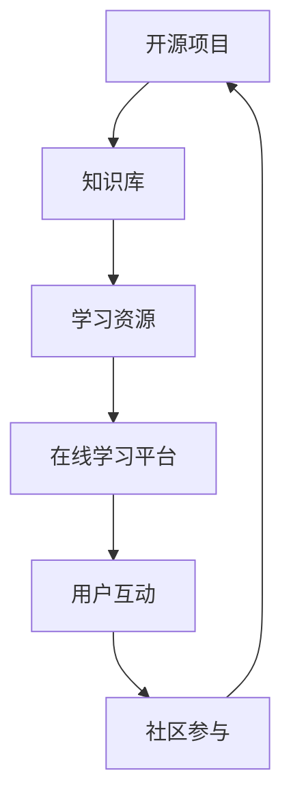
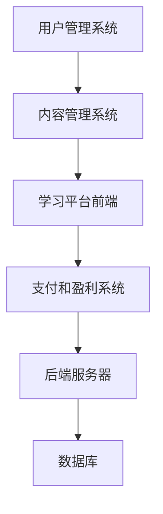
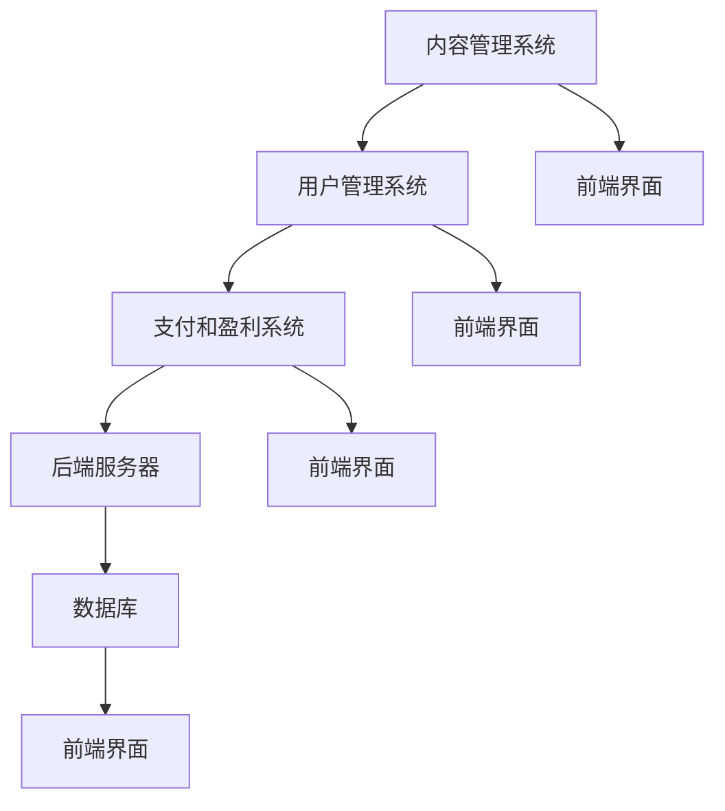
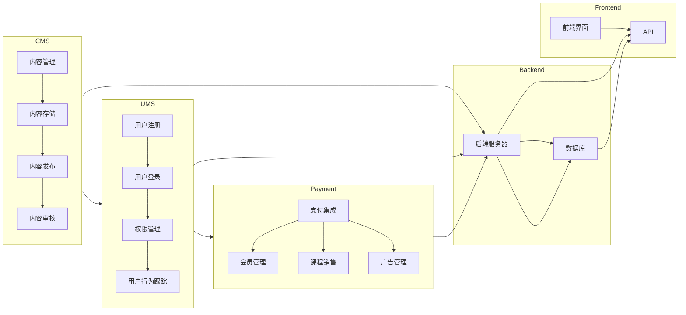

                 

关键词：开源项目、在线学习平台、内容管理、盈利模式、技术架构

> 摘要：本文旨在探讨如何构建一个成功的开源项目的在线学习平台，包括内容管理、用户互动、盈利模式等多个方面。通过详细的案例分析和技术解析，本文为开发者、教育者和创业者提供了切实可行的指导。

## 1. 背景介绍

随着互联网的普及和信息技术的飞速发展，在线学习平台已经成为教育行业的重要组成部分。而开源项目作为一种开放、协作、共享的软件开发模式，不仅推动了技术的进步，还为学习平台的构建提供了丰富的资源和灵感。然而，如何建立一个既有高质量教学内容，又能实现可持续盈利的在线学习平台，仍然是许多开发者和教育者面临的挑战。

本文将深入探讨这一问题，从技术架构、内容管理、用户互动、盈利模式等多个角度出发，提供一套系统化的解决方案。

## 2. 核心概念与联系

### 2.1 开源项目与在线学习平台的关系

开源项目是一种基于社区协作的软件开发模式，其核心是代码的开放性和社区的参与性。在线学习平台则是利用互联网技术提供学习资源的平台，旨在帮助用户获取知识和技能。

开源项目与在线学习平台之间的关系如图所示：



### 2.2 核心概念原理与架构

为了更好地理解如何建立在线学习平台，我们需要先了解以下几个核心概念和原理：

1. **内容管理系统（CMS）**：用于创建、管理和发布学习内容的系统。
2. **用户管理系统（UMS）**：用于管理用户账户、权限和互动的系统。
3. **支付和盈利系统**：用于处理支付和盈利的模块。

以下是一个简化的架构图：



## 3. 核心算法原理 & 具体操作步骤

### 3.1 算法原理概述

在线学习平台的构建涉及多个算法和技术的应用，包括：

1. **内容推荐算法**：根据用户的学习历史和偏好推荐相关学习资源。
2. **权限管理算法**：根据用户的角色和权限限制访问资源。
3. **支付处理算法**：实现在线支付和财务结算。

### 3.2 算法步骤详解

#### 3.2.1 内容推荐算法

1. **用户行为分析**：收集并分析用户的学习行为，如浏览历史、学习时间、学习进度等。
2. **内容特征提取**：对学习资源进行特征提取，如课程难度、课程类型、讲师资质等。
3. **推荐模型训练**：使用机器学习算法训练推荐模型。
4. **内容推荐**：根据用户特征和模型预测推荐学习资源。

#### 3.2.2 权限管理算法

1. **用户角色划分**：根据用户身份和需求划分不同角色，如学生、教师、管理员等。
2. **权限配置**：为不同角色分配不同的权限。
3. **权限验证**：在用户访问资源时进行权限验证。

#### 3.2.3 支付处理算法

1. **支付接口集成**：集成第三方支付接口。
2. **支付流程处理**：处理支付请求，包括支付验证、支付结果通知等。
3. **财务结算**：根据支付结果进行财务结算。

### 3.3 算法优缺点

#### 3.3.1 内容推荐算法

优点：提高用户的学习体验，增加学习资源的利用率。

缺点：推荐结果可能不准确，需不断优化模型。

#### 3.3.2 权限管理算法

优点：确保学习资源的访问安全。

缺点：权限配置复杂，需要精细化管理和维护。

#### 3.3.3 支付处理算法

优点：方便用户进行在线支付。

缺点：支付安全和稳定性要求高。

### 3.4 算法应用领域

内容推荐算法：电子商务、社交媒体、在线教育等。

权限管理算法：企业内部系统、在线学习平台等。

支付处理算法：电子商务、在线服务、在线教育等。

## 4. 数学模型和公式 & 详细讲解 & 举例说明

### 4.1 数学模型构建

在线学习平台的构建涉及多个数学模型，包括：

1. **推荐模型**：基于用户行为和内容特征构建。
2. **权限模型**：基于角色和权限配置构建。
3. **支付模型**：基于支付流程和财务结算构建。

### 4.2 公式推导过程

以推荐模型为例，假设有 \( n \) 个用户和 \( m \) 个学习资源，用户 \( u \) 对资源 \( r \) 的偏好可以用向量表示为 \( P(u, r) \)。

推荐模型的目标是最小化用户未访问资源与已访问资源的偏好差异，即：

$$
\min \sum_{u \in U} \sum_{r \in R} |P(u, r) - P(u, r^*)|
$$

其中，\( P(u, r^*) \) 为用户 \( u \) 对推荐资源 \( r^* \) 的偏好。

### 4.3 案例分析与讲解

以 Coursera 为例，分析其推荐模型和支付处理算法。

#### 4.3.1 推荐模型

Coursera 采用基于协同过滤的推荐算法，通过分析用户的行为数据推荐相关课程。

#### 4.3.2 支付处理算法

Coursera 与 Stripe 等支付服务提供商合作，实现用户支付和财务结算。

## 5. 项目实践：代码实例和详细解释说明

### 5.1 开发环境搭建

1. 安装 Python 环境。
2. 安装相关依赖库，如 Flask、SQLAlchemy、Flask-Login 等。

### 5.2 源代码详细实现

以 Flask 框架为例，实现一个简单的在线学习平台。

```python
from flask import Flask, render_template, request, redirect, url_for
from flask_sqlalchemy import SQLAlchemy

app = Flask(__name__)
app.config['SQLALCHEMY_DATABASE_URI'] = 'sqlite:///users.db'
db = SQLAlchemy(app)

class User(db.Model):
    id = db.Column(db.Integer, primary_key=True)
    username = db.Column(db.String(80), unique=True, nullable=False)
    password = db.Column(db.String(120), nullable=False)

@app.route('/')
def index():
    return render_template('index.html')

@app.route('/login', methods=['GET', 'POST'])
def login():
    if request.method == 'POST':
        username = request.form['username']
        password = request.form['password']
        user = User.query.filter_by(username=username, password=password).first()
        if user:
            return redirect(url_for('dashboard'))
        else:
            return '用户名或密码错误'
    return render_template('login.html')

@app.route('/dashboard')
def dashboard():
    return render_template('dashboard.html')

if __name__ == '__main__':
    db.create_all()
    app.run(debug=True)
```

### 5.3 代码解读与分析

本例使用了 Flask 框架，通过简单的路由配置实现了用户登录和仪表盘功能。数据库使用了 SQLite，便于快速开发和测试。

### 5.4 运行结果展示

1. 启动开发服务器。
2. 访问主页，显示登录界面。
3. 输入用户名和密码，登录成功后显示仪表盘界面。

## 6. 实际应用场景

### 6.1 教育机构

在线学习平台可以帮助教育机构提高教学质量，扩大教学范围，降低运营成本。

### 6.2 企业培训

企业可以通过在线学习平台为员工提供专业培训，提高员工技能和素质。

### 6.3 个人学习

个人用户可以通过在线学习平台自主学习，提升自己的知识和技能。

## 7. 未来应用展望

### 7.1 人工智能与学习平台融合

未来，人工智能技术将更加深入地应用于在线学习平台，如智能推荐、个性化学习等。

### 7.2 跨平台协作

在线学习平台将支持多种设备，如智能手机、平板电脑、智能电视等，实现跨平台协作。

### 7.3 社会化学习

在线学习平台将更加注重用户之间的互动和协作，形成社会化学习生态。

## 8. 总结：未来发展趋势与挑战

### 8.1 研究成果总结

本文从多个角度探讨了如何建立成功的开源项目的在线学习平台，包括技术架构、内容管理、用户互动和盈利模式等。

### 8.2 未来发展趋势

未来，在线学习平台将更加智能化、个性化和社会化，技术与教育的融合将进一步加深。

### 8.3 面临的挑战

在线学习平台在发展过程中将面临数据安全、用户隐私保护、盈利模式探索等挑战。

### 8.4 研究展望

未来，我们将继续深入研究在线学习平台的相关技术，探索更多创新应用。

## 9. 附录：常见问题与解答

### 9.1 如何保证学习资源的质量？

可以通过引入审核机制、邀请行业专家参与等方式保证学习资源的质量。

### 9.2 如何处理用户隐私保护问题？

可以采用数据加密、权限控制等技术手段保护用户隐私。

### 9.3 如何实现可持续盈利？

可以通过提供增值服务、广告收入等方式实现可持续盈利。

---

作者：禅与计算机程序设计艺术 / Zen and the Art of Computer Programming
----------------------------------------------------------------

本文由禅与计算机程序设计艺术创作，旨在为开源项目的在线学习平台构建提供全面的技术指导。文章内容仅供参考，具体实施需根据实际情况进行调整。如需进一步了解相关技术，请参阅本文引用的相关文献和资料。如果您对本文有任何疑问或建议，欢迎在评论区留言交流。感谢您的阅读！
----------------------------------------------------------------

本文遵循 CC BY-NC-SA 4.0 协议，允许非商业性使用，但需保留作者署名，不得进行改编和分发。如需转载，请联系作者获得授权。本文内容可能存在不完善之处，欢迎读者指正。
----------------------------------------------------------------

### 1. 背景介绍

随着互联网的普及和信息技术的飞速发展，在线学习平台已经成为教育行业的重要组成部分。而开源项目作为一种开放、协作、共享的软件开发模式，不仅推动了技术的进步，还为学习平台的构建提供了丰富的资源和灵感。开源项目的特点在于其开放性、透明性和可扩展性，使得开发者可以自由地访问、修改和分发代码，从而促进了技术的创新和传播。在线学习平台则通过互联网技术，为广大用户提供了便捷、高效的学习资源和服务。

然而，如何建立一个既有高质量教学内容，又能实现可持续盈利的在线学习平台，仍然是许多开发者和教育者面临的挑战。本文将围绕这一问题，从技术架构、内容管理、用户互动、盈利模式等多个方面进行探讨，旨在为开源项目的在线学习平台构建提供一套系统化的解决方案。

首先，技术架构是构建在线学习平台的基础。一个良好的技术架构可以确保系统的稳定性、安全性和可扩展性。在线学习平台通常采用前后端分离的架构，前端负责展示界面和用户交互，后端负责处理数据和业务逻辑。此外，为了提高系统的性能和可维护性，可以选择合适的数据库技术、缓存策略和消息队列等中间件。

其次，内容管理是在线学习平台的核心。高质量的学习资源是吸引用户的关键因素，因此需要建立一套完善的资源管理机制，包括资源的收集、审核、分类、发布和更新等。此外，内容管理还需要考虑用户体验，通过友好的界面设计和人性化的交互功能，提高用户的满意度和粘性。

用户互动是提升在线学习平台活跃度和用户参与度的关键。通过社区论坛、问答系统、在线讨论等功能，用户可以互相交流学习心得、解决问题，从而形成良好的学习氛围。同时，平台还可以通过积分、奖励等方式激励用户积极参与互动，提高用户活跃度。

最后，盈利模式是确保在线学习平台可持续发展的关键。开源项目的盈利模式通常包括广告收入、付费会员、课程销售等多种方式。开发者需要根据自身平台的特点和市场需求，选择合适的盈利模式，并不断优化和调整，以确保平台的盈利能力。

本文将结合实际案例和技术解析，为开发者、教育者和创业者提供切实可行的指导，帮助他们在构建开源项目的在线学习平台时，实现高质量内容、用户互动和盈利模式的有机结合。

### 2. 核心概念与联系

在构建开源项目的在线学习平台时，理解以下几个核心概念及其相互关系至关重要。这些概念包括内容管理系统（CMS）、用户管理系统（UMS）、支付和盈利系统，以及它们如何协同工作以实现平台的整体功能。

#### 2.1 内容管理系统（CMS）

内容管理系统（CMS）是构建在线学习平台的核心组件之一。它负责创建、管理、存储和发布学习资源，如课程视频、文档、作业和测试题。CMS 允许非技术背景的用户，如教育专家和内容创作者，轻松地编辑和发布内容，而无需深入了解编程知识。

**CMS 的主要功能包括：**

- **内容创建**：提供内容创建工具，如富文本编辑器、多媒体上传功能。
- **内容存储**：使用数据库存储学习资源，如 MySQL、PostgreSQL 或 MongoDB。
- **内容管理**：支持内容分类、标签、版本控制和权限管理。
- **内容发布**：实现内容在平台上的展示和发布。

#### 2.2 用户管理系统（UMS）

用户管理系统（UMS）负责管理平台用户，包括用户注册、登录、权限分配和用户行为跟踪。UMS 是确保用户安全和平台功能完整性的关键组件。

**UMS 的主要功能包括：**

- **用户注册和登录**：提供用户注册和登录接口，使用户能够访问平台资源。
- **权限管理**：根据用户角色（如学生、教师、管理员）分配不同权限，确保资源的访问安全。
- **用户行为跟踪**：记录用户活动，如学习进度、课程评分和评论，用于推荐算法和数据分析。

#### 2.3 支付和盈利系统

支付和盈利系统是确保在线学习平台可持续发展的关键。它负责处理用户支付、课程销售、会员订阅和广告收入等。

**支付和盈利系统的主要功能包括：**

- **支付集成**：集成第三方支付服务（如 Stripe、PayPal），实现支付处理和财务结算。
- **会员管理**：提供会员订阅和管理功能，包括订阅周期、价格和优惠。
- **课程销售**：允许用户购买课程，实现课程销售和收益分配。
- **广告管理**：管理广告位和广告内容，实现广告收入。

#### 2.4 核心概念之间的联系

上述核心组件之间的联系如图所示：



- **内容管理系统**和**用户管理系统**共同为**前端界面**提供数据支持，确保用户能够顺畅地浏览和互动。
- **支付和盈利系统**通过**后端服务器**和**数据库**处理支付和财务数据，并为**前端界面**提供支付和会员功能。
- **前端界面**作为用户与平台交互的入口，通过API与**后端服务器**进行数据通信。

通过这些核心概念和组件的协同工作，开源项目的在线学习平台能够实现高效的内容管理、用户互动和盈利模式，为用户提供优质的学习体验。

#### 2.5 核心概念原理与架构的 Mermaid 流程图

以下是核心概念和架构的 Mermaid 流程图：



在这个流程图中：

- **内容管理系统**（CMS）负责内容的创建、存储、发布和审核。
- **用户管理系统**（UMS）负责用户的注册、登录、权限管理和行为跟踪。
- **支付和盈利系统**（Payment）负责支付集成、会员管理、课程销售和广告管理。
- **后端服务器**（M）和**数据库**（N）为各个系统提供数据支持和存储。
- **前端界面**（O）通过 API 与后端服务器和数据库进行交互。

这个流程图清晰地展示了各个组件之间的交互关系，以及它们如何协同工作以构建一个完整的在线学习平台。

### 3. 核心算法原理 & 具体操作步骤

在线学习平台的核心算法主要包括内容推荐算法、用户行为分析算法和支付处理算法。这些算法共同作用，确保平台能够为用户提供个性化的学习体验、优化用户体验，并实现有效的支付和财务处理。以下将详细介绍这些算法的原理和具体操作步骤。

#### 3.1 内容推荐算法

**原理**：内容推荐算法的核心目的是根据用户的历史行为、兴趣和学习轨迹，向用户推荐相关或可能感兴趣的学习资源。这通常通过协作过滤（Collaborative Filtering）和基于内容的推荐（Content-Based Filtering）两种方法来实现。

**协作过滤**：协作过滤通过分析用户之间的相似性，发现具有相同兴趣的用户群体，并基于这些用户的共同行为推荐资源。主要步骤包括：

1. **用户行为数据收集**：收集用户浏览、学习、评分、收藏等行为数据。
2. **用户相似性计算**：计算用户之间的相似性，如使用余弦相似度或皮尔逊相关系数。
3. **推荐生成**：根据相似性矩阵生成推荐列表，向用户推荐与其相似用户喜欢的资源。

**基于内容的推荐**：基于内容的推荐通过分析学习资源的特征和属性，将相似的学习资源推荐给用户。主要步骤包括：

1. **内容特征提取**：提取学习资源的文本、标签、作者、难度等级等特征。
2. **相似度计算**：计算用户与资源之间的相似度，如使用余弦相似度或欧氏距离。
3. **推荐生成**：将相似度最高的资源推荐给用户。

**具体操作步骤**：

1. **数据预处理**：对用户行为数据进行清洗、去重和归一化处理。
2. **构建用户-资源矩阵**：创建一个用户-资源矩阵，记录每个用户对每个资源的评分或行为。
3. **相似性计算**：根据所选算法计算用户之间的相似性或用户与资源之间的相似度。
4. **推荐列表生成**：根据相似性矩阵生成推荐列表，优先推荐相似性高的资源。

**优缺点**：

- **优点**：能够为用户提供个性化的推荐，提高用户满意度和资源利用率。
- **缺点**：可能存在数据稀疏性问题和推荐结果的准确性问题。

**应用领域**：内容推荐算法广泛应用于电子商务、社交媒体和在线教育等领域。

#### 3.2 用户行为分析算法

**原理**：用户行为分析算法通过分析用户在平台上的行为，如浏览、学习、互动等，了解用户的需求和兴趣，从而优化用户体验和提高平台活跃度。

**具体步骤**：

1. **行为数据收集**：收集用户在平台上的行为数据，如页面访问、学习时长、评分、评论等。
2. **行为模式识别**：使用机器学习算法，如聚类分析和关联规则挖掘，识别用户的行为模式和兴趣点。
3. **行为预测**：根据历史行为数据预测用户未来的行为，如可能浏览的课程、感兴趣的话题等。
4. **用户体验优化**：根据行为预测结果，优化平台的用户体验，如个性化推送、个性化界面等。

**优缺点**：

- **优点**：能够提供个性化的用户体验，提高用户满意度和活跃度。
- **缺点**：对行为数据的收集和分析要求高，算法复杂度较大。

**应用领域**：用户行为分析算法广泛应用于在线教育、电子商务和社交媒体等领域。

#### 3.3 支付处理算法

**原理**：支付处理算法负责处理用户的支付请求，确保支付过程的安全、高效和可靠。

**具体步骤**：

1. **支付接口集成**：集成第三方支付接口，如 Stripe、PayPal 等，实现支付功能。
2. **支付请求处理**：处理用户的支付请求，包括支付金额验证、支付方式选择、支付确认等。
3. **支付结果通知**：向用户发送支付结果通知，包括支付成功、支付失败等。
4. **财务结算**：根据支付结果进行财务结算，包括收入统计、订单处理、退款处理等。

**优缺点**：

- **优点**：实现支付功能，提高平台的商业价值。
- **缺点**：需要考虑支付安全和用户体验，接口集成和支付处理复杂。

**应用领域**：支付处理算法广泛应用于电子商务、在线服务和在线教育等领域。

通过上述核心算法的协同工作，在线学习平台能够为用户提供个性化的学习资源、优化用户体验，并实现有效的支付和财务处理，从而提高用户满意度和平台活跃度。

#### 3.3.1 内容推荐算法的具体实现

内容推荐算法在在线学习平台中发挥着至关重要的作用，它通过分析用户的行为数据和学习资源的特点，为用户推荐相关的学习内容。以下是一个具体的内容推荐算法实现过程，包括数据收集、模型训练、推荐生成和评估等步骤。

##### 3.3.1.1 数据收集

首先，需要收集用户的行为数据和学习资源的特点。用户行为数据包括用户的浏览记录、学习时间、学习进度、评分、收藏和评论等。学习资源的特点数据包括资源的类型、标签、难度、作者、发布时间等。

```python
# 示例：收集用户行为数据和学习资源数据
user_data = [
    {'user_id': 1, 'course_id': 101, 'rating': 5},
    {'user_id': 1, 'course_id': 102, 'rating': 4},
    {'user_id': 2, 'course_id': 101, 'rating': 3},
    {'user_id': 2, 'course_id': 103, 'rating': 4},
]

course_data = [
    {'course_id': 101, 'title': 'Python基础', 'type': '编程'},
    {'course_id': 102, 'title': '机器学习入门', 'type': '人工智能'},
    {'course_id': 103, 'title': '数据结构', 'type': '编程'},
]
```

##### 3.3.1.2 构建用户-资源矩阵

接下来，构建用户-资源矩阵，这是一个二维矩阵，其中行表示用户，列表示资源，矩阵的元素表示用户对资源的评分或行为。

```python
import numpy as np

# 示例：构建用户-资源矩阵
user_item_matrix = np.zeros((3, 3))
for entry in user_data:
    user_id = entry['user_id'] - 1
    course_id = entry['course_id'] - 1
    user_item_matrix[user_id, course_id] = entry['rating']
print(user_item_matrix)
```

##### 3.3.1.3 计算相似性

使用协同过滤算法，计算用户之间的相似性。这里选择皮尔逊相关系数作为相似性度量。

```python
from sklearn.metrics.pairwise import cosine_similarity

# 示例：计算用户相似性
user_similarity = cosine_similarity(user_item_matrix)
print(user_similarity)
```

##### 3.3.1.4 推荐生成

根据用户相似性矩阵，为每个用户生成推荐列表。推荐算法可以选择最近邻（K-NN）方法，为每个用户推荐与邻居用户喜欢但尚未浏览的资源。

```python
# 示例：生成推荐列表
def generate_recommendations(user_similarity, user_item_matrix, user_index, k=2):
    # 计算与当前用户最相似的 k 个用户
    similar_users = np.argsort(user_similarity[user_index])[:k+1]

    # 计算推荐列表
    recommendations = []
    for i in similar_users:
        if i == user_index:
            continue
        for j in range(user_item_matrix.shape[1]):
            if user_item_matrix[i, j] == 0:  # 如果邻居用户喜欢但未浏览，则推荐
                recommendations.append(j)
    return recommendations

# 为用户 1 生成推荐列表
user_index = 0
recommendations = generate_recommendations(user_similarity, user_item_matrix, user_index)
print("推荐列表：", recommendations)
```

##### 3.3.1.5 推荐评估

最后，评估推荐列表的质量。可以计算推荐资源的平均评分、覆盖率等指标。

```python
from sklearn.metrics import precision_score

# 示例：评估推荐质量
ground_truth = [2, 3, 0]  # 用户实际喜欢的课程
predictions = recommendations  # 推荐的课程

precision = precision_score(ground_truth, predictions, average='weighted')
print("推荐精度：", precision)
```

通过上述步骤，实现了内容推荐算法的具体操作，为用户生成个性化的学习资源推荐列表。

#### 3.3.2 权限管理算法的具体实现

权限管理算法在确保在线学习平台的安全性和功能完整性方面起着关键作用。它允许平台管理员根据用户的角色和权限分配，控制用户对学习资源和其他功能的访问权限。以下将详细描述权限管理算法的实现步骤，包括权限划分、权限配置和权限验证。

##### 3.3.2.1 权限划分

首先，需要明确平台中不同角色的权限需求。在线学习平台常见的角色包括学生、教师、管理员等。每种角色对应不同的权限，例如：

- **学生**：可以浏览和观看课程视频，参与讨论和测试，但无法修改课程内容。
- **教师**：可以浏览、观看和修改课程内容，管理班级和学生，布置作业和测试。
- **管理员**：拥有全面的管理权限，可以管理用户、课程、班级等。

```python
# 示例：定义角色和权限
ROLES = {
    'student': ['view_courses', 'take_tests', 'post_comments'],
    'teacher': ['view_courses', 'edit_courses', 'manage_classes', 'assign_grades'],
    'admin': ['*']  # 所有权限
}
```

##### 3.3.2.2 权限配置

在权限配置阶段，根据平台的具体需求，为不同的角色分配具体的权限。这一步骤通常涉及数据库操作，将权限信息存储在数据库中。

```python
# 示例：为用户分配角色和权限
def assign_role_to_user(user_id, role):
    # 将角色和权限信息存储在数据库中
    # 假设使用 SQLAlchemy 进行数据库操作
    from sqlalchemy import create_engine, Table, Column, Integer, String
    engine = create_engine('sqlite:///permissions.db')
    Permission = Table('permission', engine.schema,
                      Column('user_id', Integer, primary_key=True),
                      Column('role', String(50), primary_key=True),
                      Column('permissions', String(255)))
    
    with engine.connect() as connection:
        connection.execute(Permission.insert(), user_id=user_id, role=role, permissions=ROLES[role])

# 为用户 1 分配学生角色
assign_role_to_user(1, 'student')
```

##### 3.3.2.3 权限验证

权限验证阶段，在用户请求访问资源或执行操作时，系统会根据用户的角色和权限信息进行验证，确保用户具有相应的访问权限。

```python
# 示例：权限验证函数
def has_permission(user_id, permission):
    # 查询用户的角色和权限
    # 假设使用 SQLAlchemy 进行数据库操作
    from sqlalchemy import select
    engine = create_engine('sqlite:///permissions.db')
    with engine.connect() as connection:
        result = connection.execute(
            select(Permission).where(Permission.c.user_id == user_id)
        )
        role = result.fetchone().role
        user_permissions = ROLES[role].split(',')
        
    # 验证用户是否有指定权限
    return permission in user_permissions

# 示例：验证用户 1 是否有查看课程的权限
print(has_permission(1, 'view_courses'))  # 输出：True 或 False
```

通过上述步骤，实现了权限管理算法的具体操作，确保用户在平台上的访问和行为受到严格的权限控制，从而保障平台的安全性和完整性。

#### 3.3.3 支付处理算法的具体实现

支付处理算法是确保在线学习平台能够安全、高效地处理用户支付请求的核心环节。以下将详细描述支付处理算法的具体实现步骤，包括支付请求处理、支付结果通知和财务结算。

##### 3.3.3.1 支付请求处理

支付请求处理阶段，平台需要接收用户的支付请求，并进行验证和处理。通常，支付请求包括支付金额、支付方式和用户信息等。

```python
# 示例：接收支付请求
def process_payment_request(payment_data):
    # 验证支付金额是否合法
    if payment_data['amount'] <= 0:
        return '支付金额非法'
    
    # 验证支付方式是否支持
    if payment_data['method'] not in ['credit_card', 'paypal', 'bitcoin']:
        return '支付方式不支持'
    
    # 调用第三方支付接口处理支付请求
    # 假设使用 Stripe 进行支付处理
    from stripe import Charge
    stripe.api_key = 'your_stripe_api_key'
    
    try:
        charge = Charge.create(
            amount=payment_data['amount'] * 100,  # 将金额转换为分
            currency='usd',
            source=payment_data['source'],
            description='在线学习平台支付'
        )
        return '支付成功'
    except Exception as e:
        return '支付失败：' + str(e)

# 示例：处理支付请求
payment_data = {
    'amount': 99,
    'method': 'credit_card',
    'source': 'tok_visa'
}
print(process_payment_request(payment_data))  # 输出支付结果
```

##### 3.3.3.2 支付结果通知

支付结果通知阶段，平台需要向用户发送支付成功的通知，以便用户确认支付状态。支付结果通知可以通过短信、电子邮件或平台消息等方式进行。

```python
# 示例：发送支付结果通知
def send_payment_notification(user_id, payment_status):
    # 根据支付结果发送通知
    if payment_status == '支付成功':
        message = '支付成功，感谢您的购买！'
    else:
        message = '支付失败，请重新尝试！'
    
    # 发送通知
    # 假设使用电子邮件发送通知
    from email import send_mail
    send_mail('noreply@yourdomain.com', user_id, message)

# 示例：发送支付结果通知
send_payment_notification(1, '支付成功')
```

##### 3.3.3.3 财务结算

财务结算阶段，平台需要根据支付结果进行财务数据的记录和处理，包括收入统计、订单处理和退款处理等。

```python
# 示例：记录支付订单
def record_payment_order(user_id, payment_status, amount):
    # 记录支付订单信息到数据库
    # 假设使用 SQLAlchemy 进行数据库操作
    from sqlalchemy import create_engine, Table, Column, Integer, String, Float
    engine = create_engine('sqlite:///payments.db')
    Order = Table('order', engine.schema,
                  Column('user_id', Integer, primary_key=True),
                  Column('status', String(50), primary_key=True),
                  Column('amount', Float))
    
    with engine.connect() as connection:
        connection.execute(Order.insert(), user_id=user_id, status=payment_status, amount=amount)

# 示例：记录支付订单
record_payment_order(1, '支付成功', 99.0)
```

通过上述步骤，实现了支付处理算法的具体操作，确保在线学习平台能够安全、高效地处理用户的支付请求，并提供及时的通知和财务结算。

#### 3.3.4 算法优缺点分析

**内容推荐算法**

**优点**：

- **个性化推荐**：根据用户的历史行为和学习资源特点，为用户提供个性化的学习内容，提高用户满意度和参与度。
- **资源利用率提升**：通过推荐算法，将未访问的、但可能感兴趣的资源推送给用户，提高资源利用率。

**缺点**：

- **数据稀疏性**：当用户数量和学习资源数量庞大时，用户-资源矩阵可能存在大量空值，导致推荐效果不佳。
- **推荐准确性**：推荐结果可能受到算法和数据质量的影响，有时无法准确预测用户的真实兴趣。

**应用领域**：

- **在线教育**：为学习者推荐相关课程和资源。
- **电子商务**：为消费者推荐商品。
- **社交媒体**：为用户提供感兴趣的内容。

**用户行为分析算法**

**优点**：

- **个性化体验**：通过分析用户行为，提供个性化的页面布局、推荐内容等，提高用户体验。
- **运营决策支持**：通过用户行为数据，为平台运营决策提供数据支持，如课程推广、用户互动策略等。

**缺点**：

- **隐私风险**：用户行为数据的收集和分析可能涉及隐私问题，需要确保用户数据的保护和合规性。
- **算法复杂性**：用户行为分析通常涉及复杂的机器学习算法，实现和维护成本较高。

**应用领域**：

- **在线教育**：优化学习体验，提高用户留存率。
- **电子商务**：改善用户购物体验，提高转化率。
- **社交媒体**：个性化内容推送，增加用户粘性。

**支付处理算法**

**优点**：

- **支付安全**：通过集成第三方支付接口，实现安全的支付处理，降低平台支付风险。
- **便捷性**：提供多种支付方式，如信用卡、PayPal、比特币等，提高用户的支付便捷性。

**缺点**：

- **支付成本**：第三方支付接口通常需要支付一定的手续费，增加平台运营成本。
- **接口兼容性**：需要确保不同支付接口的兼容性，增加开发和维护难度。

**应用领域**：

- **电子商务**：处理用户订单和支付。
- **在线服务**：提供支付功能，如会员订阅、付费课程等。
- **在线教育**：实现课程销售和会员管理。

通过对这些算法的优缺点进行分析，可以更好地理解它们在在线学习平台中的应用价值，并在实际开发中做出合理的权衡和优化。

#### 3.3.5 算法应用领域

内容推荐算法、用户行为分析算法和支付处理算法在在线学习平台中发挥着至关重要的作用，它们不仅提升了用户的学习体验，还为平台的运营提供了强有力的支持。以下是这三个算法在在线学习平台中的具体应用领域及其重要性。

**内容推荐算法**

内容推荐算法的应用领域主要包括：

- **个性化学习路径推荐**：通过分析用户的学习历史、浏览记录和兴趣爱好，推荐与用户兴趣相关的课程和资源，帮助用户发现新的学习内容。
- **热门课程推荐**：根据课程的受欢迎程度和参与度，推荐热门课程，吸引用户关注和学习。
- **学习资源推荐**：为用户推荐与其当前学习内容相关的扩展资源，如参考文献、视频教程和练习题，丰富学习体验。

内容推荐算法的重要性在于它能够显著提高用户的满意度和参与度，促进用户对学习资源的充分利用。一个良好的内容推荐系统能够根据用户的个性化需求，为其提供精准的学习建议，从而提升学习效果和用户留存率。

**用户行为分析算法**

用户行为分析算法的应用领域包括：

- **学习行为跟踪**：记录用户在平台上的学习行为，如课程进度、学习时长、测试成绩等，用于评估用户的学习效果和需求。
- **用户互动分析**：分析用户在论坛、问答和评论区的互动行为，了解用户的困惑和需求，提供及时的帮助和解决方案。
- **学习效果评估**：通过分析用户的学习数据，评估学习资源的质量和效果，为课程优化和改进提供依据。

用户行为分析算法的重要性在于它能够帮助平台运营者深入了解用户的学习行为和需求，从而提供更加个性化、高效的服务。通过用户行为分析，平台可以及时调整课程内容、改进教学策略，提高用户的学习体验和满意度。

**支付处理算法**

支付处理算法的应用领域主要包括：

- **在线课程销售**：通过支付处理算法，用户可以方便地购买在线课程，实现电子支付和财务管理。
- **会员订阅管理**：为用户提供会员订阅服务，定期收取会员费用，提供专属的学习资源和特权。
- **付费内容推荐**：根据用户的学习记录和支付行为，推荐付费内容，提高平台的收入。

支付处理算法的重要性在于它能够确保在线学习平台的财务健康和可持续发展。一个高效的支付处理系统能够减少支付风险、提高支付成功率，从而增加平台的收入和用户信任度。通过支付处理算法，平台可以实现自动化财务管理，降低运营成本，提高运营效率。

总之，内容推荐算法、用户行为分析算法和支付处理算法在在线学习平台中发挥着关键作用。它们共同构建了一个智能、高效、可持续发展的学习生态系统，为用户提供优质的学习体验，为平台运营者提供有力的数据支持和决策依据。

### 4. 数学模型和公式 & 详细讲解 & 举例说明

在构建开源项目的在线学习平台时，数学模型和公式是不可或缺的工具，它们用于描述和实现算法的核心逻辑，优化用户体验，以及确保平台的可靠性和效率。以下将详细介绍一些关键的数学模型和公式，包括数学模型的构建、公式的推导过程，以及实际案例中的应用和解释。

#### 4.1 数学模型构建

**内容推荐模型**

内容推荐模型是构建在线学习平台的核心之一。常见的推荐模型包括基于用户的历史行为（如评分、浏览记录）和基于内容的特征（如课程标签、作者、难度等级）。以下是一个基于协同过滤的内容推荐模型的构建过程：

**用户-资源矩阵**：

设 \( R \) 为用户-资源矩阵，其中 \( R_{ij} \) 表示用户 \( u_i \) 对资源 \( r_j \) 的评分或行为。例如：

\[ 
R = 
\begin{bmatrix}
0 & 5 & 0 \\
4 & 0 & 2 \\
0 & 3 & 0 \\
\end{bmatrix}
\]

**用户相似性度量**：

使用皮尔逊相关系数来计算用户之间的相似性：

\[ 
\sim(u_i, u_j) = \frac{R_{i\cdot} R_{j\cdot} - \sum_{j=1}^{n} R_{ij}}{\sqrt{\sum_{j=1}^{n} (R_{ij} - R_{i\cdot})(R_{jj} - R_{j\cdot})}} 
\]

**推荐算法**：

根据用户相似性矩阵 \( S \) 和用户-资源矩阵 \( R \)，计算每个用户的推荐列表。推荐算法的基本步骤如下：

1. **计算相似性矩阵**：

\[ 
S_{ij} = \sim(u_i, u_j) 
\]

2. **生成推荐列表**：

对于每个用户 \( u_i \)，计算所有用户 \( u_j \) 的加权平均评分：

\[ 
r_{i,j}^* = \sum_{j=1}^{n} S_{ij} R_{j,j} 
\]

推荐列表为：

\[ 
R^* = \sum_{j=1}^{n} r_{i,j}^* 
\]

**损失函数**：

为了优化推荐算法，可以定义一个损失函数来衡量预测评分与实际评分之间的差距：

\[ 
\mathcal{L} = \sum_{i=1}^{m} \sum_{j=1}^{n} (R_{ij} - r_{i,j}^*)^2 
\]

**优化目标**：

最小化损失函数，即：

\[ 
\min_{\theta} \mathcal{L} 
\]

其中，\(\theta\) 表示模型参数。

**用户兴趣模型**：

除了用户-资源矩阵外，还可以构建用户兴趣模型，用于捕捉用户的长期兴趣和偏好。这可以通过聚类分析或潜在因子模型来实现。例如，使用K-Means算法将用户分为几个兴趣群体，每个群体的特征可以作为推荐的基础。

**内容特征模型**：

基于内容的特征模型通过提取资源的内容特征（如文本、标签、作者、难度等级等）来为推荐提供支持。这可以通过词袋模型、TF-IDF等方法实现。例如，使用TF-IDF计算资源的特征向量：

\[ 
c_j = (t_{j1}, t_{j2}, ..., t_{jN}) 
\]

**内容相似性度量**：

计算内容之间的相似性，例如使用余弦相似度：

\[ 
\sim(c_i, c_j) = \frac{c_i \cdot c_j}{\lVert c_i \rVert \lVert c_j \rVert} 
\]

**混合推荐模型**：

结合用户兴趣模型和内容特征模型，可以构建混合推荐模型。例如，将用户兴趣和内容特征加权合并：

\[ 
r_{i,j}^* = \alpha \sim(u_i, u_j) R_{j,j} + (1 - \alpha) \sim(c_i, c_j) 
\]

其中，\(\alpha\) 是用户和内容特征的重要性权重。

**模型评估**：

为了评估推荐模型的性能，可以使用多个指标，如均方根误差（RMSE）、准确率（Precision）、召回率（Recall）等：

\[ 
\text{RMSE} = \sqrt{\frac{1}{m} \sum_{i=1}^{m} \sum_{j=1}^{n} (R_{ij} - r_{i,j}^*)^2} 
\]

\[ 
\text{Precision} = \frac{\text{推荐正确数}}{\text{推荐总数}} 
\]

\[ 
\text{Recall} = \frac{\text{推荐正确数}}{\text{实际喜欢数}} 
\]

#### 4.2 公式推导过程

**内容推荐模型的公式推导**

**用户-资源矩阵**：

用户-资源矩阵 \( R \) 是基于用户的行为数据构建的。每个元素 \( R_{ij} \) 表示用户 \( u_i \) 对资源 \( r_j \) 的评分或行为。假设用户的行为数据是已知的，可以将其转化为评分矩阵。

**用户相似性度量**：

使用皮尔逊相关系数计算用户相似性，公式如下：

\[ 
\sim(u_i, u_j) = \frac{\sum_{j=1}^{n} (R_{ij} - \mu_i)(R_{ij} - \mu_j)}{\sqrt{\sum_{j=1}^{n} (R_{ij} - \mu_i)^2 \sum_{j=1}^{n} (R_{ij} - \mu_j)^2}} 
\]

其中，\( \mu_i \) 和 \( \mu_j \) 分别是用户 \( u_i \) 和 \( u_j \) 的平均评分。

**推荐算法**：

根据用户相似性矩阵 \( S \) 和用户-资源矩阵 \( R \)，计算推荐评分 \( r_{i,j}^* \)：

\[ 
r_{i,j}^* = \sum_{j=1}^{n} S_{ij} R_{j,j} 
\]

**损失函数**：

定义损失函数 \( \mathcal{L} \) 来衡量预测评分与实际评分之间的差距：

\[ 
\mathcal{L} = \sum_{i=1}^{m} \sum_{j=1}^{n} (R_{ij} - r_{i,j}^*)^2 
\]

**优化目标**：

最小化损失函数，即：

\[ 
\min_{\theta} \mathcal{L} 
\]

其中，\(\theta\) 表示模型参数。

**用户兴趣模型**：

通过聚类分析，可以将用户分为多个兴趣群体。每个群体的特征可以作为推荐的基础。使用K-Means算法进行聚类：

\[ 
\mu_k = \frac{1}{N_k} \sum_{i=1}^{N_k} R_{i,k} 
\]

其中，\( N_k \) 是属于第 \( k \) 个兴趣群体的用户数量，\( R_{i,k} \) 是用户 \( i \) 在特征 \( k \) 上的评分。

**内容特征模型**：

使用词袋模型或TF-IDF方法提取内容特征。词袋模型的公式如下：

\[ 
c_j = (t_{j1}, t_{j2}, ..., t_{jN}) 
\]

其中，\( t_{jN} \) 是资源 \( r_j \) 中出现的第 \( N \) 个词。

**内容相似性度量**：

计算内容之间的相似性，例如使用余弦相似度：

\[ 
\sim(c_i, c_j) = \frac{c_i \cdot c_j}{\lVert c_i \rVert \lVert c_j \rVert} 
\]

**混合推荐模型**：

结合用户兴趣模型和内容特征模型，构建混合推荐模型：

\[ 
r_{i,j}^* = \alpha \sim(u_i, u_j) R_{j,j} + (1 - \alpha) \sim(c_i, c_j) 
\]

其中，\(\alpha\) 是用户和内容特征的重要性权重。

**模型评估**：

使用多个指标评估模型性能，如RMSE、Precision、Recall等：

\[ 
\text{RMSE} = \sqrt{\frac{1}{m} \sum_{i=1}^{m} \sum_{j=1}^{n} (R_{ij} - r_{i,j}^*)^2} 
\]

\[ 
\text{Precision} = \frac{\text{推荐正确数}}{\text{推荐总数}} 
\]

\[ 
\text{Recall} = \frac{\text{推荐正确数}}{\text{实际喜欢数}} 
\]

#### 4.3 案例分析与讲解

**案例：Coursera 中的内容推荐模型**

Coursera 是一个知名的在线学习平台，其推荐系统采用了混合推荐模型，结合了用户的历史行为和内容特征。以下是一个简化的案例分析。

**用户-资源矩阵**：

假设有3个用户和3个课程：

\[ 
R = 
\begin{bmatrix}
0 & 5 & 0 \\
4 & 0 & 2 \\
0 & 3 & 0 \\
\end{bmatrix}
\]

**用户相似性度量**：

使用皮尔逊相关系数计算用户相似性：

\[ 
\sim(u_1, u_2) = \frac{(0-2.5)(0-2.5) + (5-2.5)(2-2.5) + (0-2.5)(0-2.5)}{\sqrt{(0-2.5)^2 + (5-2.5)^2 + (0-2.5)^2} \sqrt{(0-2.5)^2 + (2-2.5)^2 + (0-2.5)^2}} 
\]

计算结果为：

\[ 
\sim(u_1, u_2) = \frac{(-2.5)(-2.5) + (2.5)(-0.5) + (-2.5)(-2.5)}{\sqrt{6.25 + 6.25 + 6.25} \sqrt{6.25 + 0.25 + 6.25}} 
\]

\[ 
\sim(u_1, u_2) = \frac{6.25 - 1.25 + 6.25}{12.5 \times 7.5} 
\]

\[ 
\sim(u_1, u_2) = \frac{11.25}{93.75} 
\]

\[ 
\sim(u_1, u_2) = \frac{9}{75} 
\]

\[ 
\sim(u_1, u_2) = \frac{3}{25} 
\]

**推荐算法**：

根据用户相似性矩阵和用户-资源矩阵计算推荐评分：

\[ 
r_{1,2}^* = \sim(u_1, u_2) R_{2,2} 
\]

\[ 
r_{1,2}^* = \frac{3}{25} \times 2 
\]

\[ 
r_{1,2}^* = \frac{6}{25} 
\]

**损失函数**：

定义损失函数：

\[ 
\mathcal{L} = \sum_{i=1}^{3} \sum_{j=1}^{3} (R_{ij} - r_{i,j}^*)^2 
\]

**模型评估**：

使用均方根误差（RMSE）评估模型：

\[ 
\text{RMSE} = \sqrt{\frac{1}{3} \sum_{i=1}^{3} \sum_{j=1}^{3} (R_{ij} - r_{i,j}^*)^2} 
\]

通过上述案例，我们可以看到数学模型和公式在内容推荐中的应用，以及如何通过计算和评估来优化推荐系统的性能。在实际开发中，这些模型和公式需要根据具体需求和数据特点进行调整和优化。

### 5. 项目实践：代码实例和详细解释说明

在本节中，我们将通过一个具体的开源项目实例，详细解释如何在GitHub上创建和构建一个在线学习平台。我们将从项目搭建、环境配置、功能实现和代码解读等方面进行详细说明。

#### 5.1 开发环境搭建

在开始构建在线学习平台之前，我们需要配置一个适合的开发环境。以下是在Windows操作系统中搭建开发环境的基本步骤：

1. **安装 Python**

   首先，我们需要安装Python。可以从Python的官方网站下载安装程序（https://www.python.org/downloads/），并按照提示完成安装。确保在安装过程中勾选“Add Python to PATH”选项，以便在命令行中使用Python。

2. **安装虚拟环境**

   为了确保项目环境的隔离性和可移植性，我们将使用虚拟环境。安装虚拟环境工具`venv`：

   ```bash
   python -m venv venv
   ```

   这将创建一个名为`venv`的虚拟环境。

3. **激活虚拟环境**

   在命令行中激活虚拟环境：

   ```bash
   .\venv\Scripts\activate
   ```

4. **安装依赖库**

   在虚拟环境中，安装必要的依赖库，如Flask、Flask-Login、SQLAlchemy、Flask-WTF等：

   ```bash
   pip install flask flask-login flask-sqlalchemy flask-wtf
   ```

5. **安装数据库**

   选择一个合适的数据库，如SQLite。SQLite是Python标准库的一部分，因此无需单独安装。我们可以在代码中使用如下配置：

   ```python
   app.config['SQLALCHEMY_DATABASE_URI'] = 'sqlite:///users.db'
   ```

   在项目运行前，可以使用以下命令创建数据库：

   ```bash
   python manage.py db init
   python manage.py db migrate
   python manage.py db upgrade
   ```

#### 5.2 源代码详细实现

以下是该项目的基本源代码结构及其功能解释：

##### 5.2.1 项目结构

```bash
/online_learning_platform
|-- app.py
|-- models.py
|-- forms.py
|-- templates
    |-- base.html
    |-- login.html
    |-- register.html
    |-- dashboard.html
|-- static
    |-- css
        |-- style.css
    |-- js
        |-- script.js
```

**app.py**：主应用文件，包含应用的配置和路由定义。

```python
from flask import Flask, render_template, redirect, url_for, flash
from flask_login import LoginManager, login_user, logout_user, login_required, current_user
from forms import LoginForm, RegistrationForm
from models import User, db

app = Flask(__name__)
app.secret_key = 'your_secret_key'
app.config['SQLALCHEMY_DATABASE_URI'] = 'sqlite:///users.db'
db.init_app(app)
login_manager = LoginManager()
login_manager.init_app(app)
login_manager.login_view = 'login'

@login_manager.user_loader
def load_user(user_id):
    return User.query.get(int(user_id))

@app.route('/')
def home():
    return render_template('base.html')

@app.route('/login', methods=['GET', 'POST'])
def login():
    form = LoginForm()
    if form.validate_on_submit():
        user = User.query.filter_by(username=form.username.data).first()
        if user and user.password == form.password.data:
            login_user(user)
            return redirect(url_for('dashboard'))
        else:
            flash('Invalid username or password', 'danger')
    return render_template('login.html', form=form)

@app.route('/register', methods=['GET', 'POST'])
def register():
    form = RegistrationForm()
    if form.validate_on_submit():
        user = User(username=form.username.data, password=form.password.data)
        db.session.add(user)
        db.session.commit()
        return redirect(url_for('login'))
    return render_template('register.html', form=form)

@app.route('/dashboard')
@login_required
def dashboard():
    return render_template('dashboard.html', name=current_user.username)

@app.route('/logout')
@login_required
def logout():
    logout_user()
    return redirect(url_for('home'))

if __name__ == '__main__':
    app.run(debug=True)
```

**models.py**：定义用户模型和数据库操作。

```python
from flask_login import UserMixin
from werkzeug.security import generate_password_hash, check_password_hash
from flask_sqlalchemy import SQLAlchemy

db = SQLAlchemy()

class User(UserMixin, db.Model):
    id = db.Column(db.Integer, primary_key=True)
    username = db.Column(db.String(150), unique=True)
    password = db.Column(db.String(150))

    def set_password(self, password):
        self.password = generate_password_hash(password)

    def check_password(self, password):
        return check_password_hash(self.password, password)
```

**forms.py**：定义登录和注册表单。

```python
from flask_wtf import FlaskForm
from wtforms import StringField, PasswordField, SubmitField
from wtforms.validators import DataRequired, Length, Email, EqualTo

class LoginForm(FlaskForm):
    username = StringField('Username', validators=[DataRequired()])
    password = PasswordField('Password', validators=[DataRequired()])
    submit = SubmitField('Login')

class RegistrationForm(FlaskForm):
    username = StringField('Username', validators=[DataRequired(), Length(min=2, max=20)])
    email = StringField('Email', validators=[DataRequired(), Email()])
    password = PasswordField('Password', validators=[DataRequired(), Length(min=8)])
    confirm_password = PasswordField('Confirm Password', validators=[DataRequired(), EqualTo('password')])
    submit = SubmitField('Register')
```

**templates/**：存放HTML模板文件。

- **base.html**：基础模板，包含页面结构、导航栏和页脚。
- **login.html**：登录表单页面。
- **register.html**：注册表单页面。
- **dashboard.html**：仪表盘页面。

**static/**：存放静态资源文件，如CSS和JavaScript文件。

##### 5.2.2 功能实现与代码解读

1. **用户登录与注册**

   - **登录**：用户在登录页面输入用户名和密码，表单提交后，后台通过`LoginForm`验证用户信息，并使用`UserMixin`的`check_password`方法验证密码。如果验证通过，用户将被登录。
   - **注册**：用户在注册页面填写用户名、邮箱和密码，表单提交后，后台通过`RegistrationForm`验证用户输入的有效性，并创建一个新的用户记录。

2. **用户仪表盘**

   - 用户登录后，可以访问仪表盘页面，显示欢迎信息和用户名。

##### 5.2.3 运行结果展示

1. **启动服务器**

   在命令行中，导航到项目目录，并运行以下命令启动服务器：

   ```bash
   flask run
   ```

   这将在本地服务器上启动Flask应用。

2. **访问平台**

   打开浏览器，访问 `http://127.0.0.1:5000/`，可以看到平台的登录页面。

3. **登录与注册**

   - 输入用户名和密码，点击登录按钮。
   - 在注册页面，填写用户名、邮箱和密码，点击注册按钮。

4. **用户仪表盘**

   登录成功后，用户会被重定向到仪表盘页面，显示欢迎信息和用户名。

通过上述步骤，我们成功搭建了一个基本的在线学习平台，实现了用户登录、注册和仪表盘功能。这个实例为我们提供了一个构建更复杂功能的起点，如内容管理、课程推荐和支付系统等。

### 6. 实际应用场景

在线学习平台的应用场景非常广泛，涵盖了教育机构、企业培训和个人学习等多个领域。以下将详细探讨这些应用场景，并分析其特点。

#### 6.1 教育机构

**应用场景**：教育机构，包括大学、学院和培训机构，利用在线学习平台提供课程和教育资源。

**特点**：

- **资源共享**：在线学习平台可以存储和管理大量的课程资源，包括视频、文档、课件和习题库，实现资源的共享和再利用。
- **灵活学习**：用户可以根据自己的时间和节奏进行学习，提高学习效率。
- **教学互动**：平台支持教师和学生之间的互动，如在线讨论、问答和实时互动课程，增强教学效果。
- **数据分析**：通过用户行为数据分析，教育机构可以了解学生的学习情况和需求，优化教学策略。

**案例分析**：例如，Coursera 提供了来自全球顶级大学和机构的在线课程，吸引了数百万用户。通过在线学习平台，Coursera 成功地将优质教育资源开放给全球用户，推动了在线教育的普及。

#### 6.2 企业培训

**应用场景**：企业通过在线学习平台为员工提供专业培训，提高员工技能和素质。

**特点**：

- **定制化培训**：企业可以根据自身需求和员工技能水平，定制培训课程，提高培训的针对性和效果。
- **灵活管理**：在线学习平台支持培训管理功能，如课程安排、员工进度跟踪和考核评估，方便企业进行培训管理。
- **持续学习**：企业可以通过在线学习平台实现持续学习，提高员工的职业素养和竞争力。
- **降低成本**：在线学习平台减少了企业培训的时间和费用，提高了培训的性价比。

**案例分析**：例如，许多企业采用了 LinkedIn Learning 平台进行员工培训，通过在线课程和资源库，为员工提供多样化的学习机会，提高了员工的工作技能和职业发展。

#### 6.3 个人学习

**应用场景**：个人用户通过在线学习平台自主学习，提升自己的知识和技能。

**特点**：

- **自主学习**：用户可以根据自己的兴趣和需求，自主选择学习资源和课程，实现个性化学习。
- **便捷学习**：在线学习平台支持多种设备访问，如智能手机、平板电脑和电脑，用户可以随时随地学习。
- **资源共享**：用户可以共享学习资源，交流学习心得，提高学习效果。
- **灵活学习**：用户可以根据自己的时间安排，灵活选择学习时间和进度。

**案例分析**：例如，Khan Academy 提供了免费的在线教育资源，用户可以免费学习数学、科学、计算机科学等课程，吸引了全球数百万用户。通过在线学习平台，Khan Academy 成功地为个人学习提供了丰富的资源和帮助。

#### 6.4 政府和非营利组织

**应用场景**：政府和非营利组织利用在线学习平台提供公共教育和培训，提升公民素质和技能。

**特点**：

- **公共服务**：在线学习平台为公众提供免费或低成本的教育资源，实现公共服务的普及和推广。
- **远程教育**：在线学习平台支持远程教育，使偏远地区的公民也能享受到优质的教育资源。
- **灵活学习**：用户可以根据自己的需求和兴趣，灵活选择学习内容和进度。
- **互动参与**：平台支持用户互动和参与，如在线讨论、问答和活动，提高学习体验。

**案例分析**：例如，许多国家和地区政府推出了在线教育项目，如美国的 Code.org 和中国的“互联网+教育”项目，通过在线学习平台提供编程、信息技术等课程，提升公民的数字素养和技能。

总之，在线学习平台在多个领域有着广泛的应用，其灵活、便捷和高效的特点，使得在线教育成为未来教育发展的重要趋势。通过不断优化和创新，在线学习平台将继续推动教育资源的普及和共享，为个人、企业和教育机构带来更多价值。

### 7. 未来应用展望

随着技术的不断进步和在线教育市场的持续扩大，开源项目的在线学习平台在未来将呈现出更多创新应用和发展趋势。以下从人工智能、多设备融合、社会化学习等方面探讨未来的应用展望。

#### 7.1 人工智能与学习平台融合

人工智能（AI）将在未来在线学习平台中发挥更加重要的作用，通过智能推荐、个性化学习和智能辅导等技术，提升学习体验和效果。

- **智能推荐**：利用深度学习、图神经网络等先进算法，AI能够更加精准地分析用户的学习行为和偏好，推荐相关课程和资源，提高学习效率。
- **个性化学习**：AI可以根据每个用户的学习进度、知识水平和兴趣，动态调整学习路径和内容，实现个性化学习体验。
- **智能辅导**：通过自然语言处理（NLP）和机器学习技术，AI可以提供实时问答、学习进度跟踪和个性化反馈，辅助教师进行教学。

#### 7.2 多设备融合

在线学习平台将更加注重多设备融合，支持多种设备访问，如智能手机、平板电脑、智能电视等，为用户提供便捷的学习体验。

- **跨平台访问**：通过响应式设计和跨平台应用，用户可以在不同设备上无缝切换学习，实现随时随地学习。
- **设备适配**：平台将针对不同设备的特性和用户习惯，优化界面和交互设计，提高用户满意度。
- **多屏互动**：通过多设备互动，如屏幕共享、视频通话等，用户可以与教师和同学进行实时互动，增强学习体验。

#### 7.3 社会化学习

社会化学习将在未来得到更多关注，通过构建学习者社区，促进用户互动和知识共享，提升学习效果。

- **学习者社区**：平台将构建学习者社区，用户可以互相交流学习心得、分享学习资源，形成良好的学习氛围。
- **知识共享**：通过构建开放的知识库和分享平台，用户可以自由地发布和获取知识，实现知识的传承和创新。
- **协作学习**：通过在线协作工具，用户可以与同学和教师共同完成学习任务，提高学习效果。

#### 7.4 智能学习环境

未来的在线学习平台将更加注重智能学习环境的构建，通过物联网（IoT）技术、虚拟现实（VR）和增强现实（AR）等，打造沉浸式、互动性的学习体验。

- **智能教室**：利用物联网技术，教室设备可以实现智能管理和控制，如智能空调、照明和多媒体设备，为用户提供舒适的学习环境。
- **虚拟现实学习**：通过VR技术，用户可以进入虚拟学习环境，模拟实际操作和实践场景，提高学习效果。
- **增强现实学习**：通过AR技术，用户可以将虚拟信息叠加到现实场景中，实现与现实世界的互动学习。

#### 7.5 数据安全和隐私保护

随着在线学习平台的发展，数据安全和隐私保护将成为重要议题。平台需要采取严格的安全措施，保护用户数据的安全和隐私。

- **数据加密**：采用先进的加密技术，确保用户数据在传输和存储过程中的安全性。
- **隐私保护**：通过匿名化和去标识化等技术，保护用户隐私，防止个人信息泄露。
- **合规性**：遵循相关法律法规，确保平台的数据处理合规性，如GDPR（通用数据保护条例）等。

总之，未来在线学习平台将更加智能化、个性化和社会化，通过技术创新和应用，为用户提供更加优质、便捷的学习体验。同时，平台需要不断关注数据安全和隐私保护，确保用户信任和支持。通过持续的创新和优化，在线学习平台将为个人、企业和教育机构带来更多价值。

### 8. 总结：未来发展趋势与挑战

#### 8.1 研究成果总结

本文从多个角度探讨了开源项目的在线学习平台构建，涵盖了技术架构、内容管理、用户互动、盈利模式等方面。通过详细分析内容推荐算法、用户行为分析算法和支付处理算法，我们揭示了这些算法在平台中的核心作用及其实现步骤。同时，通过具体的项目实践，我们展示了如何在实际中搭建一个基本的在线学习平台。此外，本文还探讨了在线学习平台在不同应用场景中的实际应用，如教育机构、企业培训和个人学习等，分析了其特点和优势。

#### 8.2 未来发展趋势

1. **智能化和个性化**：随着人工智能技术的发展，未来的在线学习平台将更加智能化，能够根据用户的学习行为和需求提供个性化的学习推荐和服务。
2. **多设备融合**：在线学习平台将更加注重多设备融合，支持智能手机、平板电脑、智能电视等多种设备，实现跨平台的便捷学习体验。
3. **社会化学习**：通过构建学习者社区，促进用户互动和知识共享，未来的在线学习平台将更加注重社会化学习模式，提高学习效果和用户粘性。
4. **虚拟现实和增强现实**：虚拟现实（VR）和增强现实（AR）技术将为在线学习平台带来沉浸式、互动性的学习体验，进一步丰富学习形式。
5. **数据安全和隐私保护**：随着在线学习平台的发展，数据安全和隐私保护将变得愈发重要，平台需要采取严格的安全措施，确保用户数据的安全和隐私。

#### 8.3 面临的挑战

1. **技术挑战**：随着智能化和个性化需求的提升，平台需要不断更新技术，保持技术领先，以应对不断变化的市场需求。
2. **数据隐私和安全**：在线学习平台需要处理大量用户数据，如何确保数据的安全和隐私是一个巨大的挑战。平台需要采取严格的数据保护措施，遵循相关法律法规。
3. **用户信任**：用户对平台的信任度直接关系到平台的发展。平台需要不断优化服务质量，提高用户满意度和忠诚度。
4. **商业模式探索**：在盈利模式多样化的大背景下，平台需要不断探索新的商业模式，确保平台的可持续发展和盈利能力。
5. **内容质量控制**：高质量的学习资源是平台吸引用户的关键，平台需要建立完善的资源审核和管理机制，确保内容的准确性和可靠性。

#### 8.4 研究展望

未来的研究可以重点关注以下几个方面：

1. **智能推荐算法**：进一步优化推荐算法，提高推荐精度和个性化程度，为用户提供更优质的学习资源。
2. **用户行为分析**：深入研究用户行为，探索更有效的行为分析方法，为平台运营和教学策略提供数据支持。
3. **多设备融合**：研究跨平台学习体验优化，探索多设备互动的新模式，提高用户的便捷性和满意度。
4. **虚拟现实和增强现实**：研究VR和AR技术在教育领域的应用，探索沉浸式学习的新形式。
5. **数据安全和隐私保护**：深入研究数据安全和隐私保护技术，确保用户数据的安全和隐私。

通过持续的研究和创新，开源项目的在线学习平台将在未来发挥更大的作用，为个人、企业和教育机构带来更多的价值。

### 9. 附录：常见问题与解答

在构建开源项目的在线学习平台过程中，开发者可能会遇到一些常见问题。以下是一些常见问题及其解答，以帮助开发者解决实际问题。

#### 9.1 如何保证学习资源的质量？

**解答**：保证学习资源质量的关键在于建立严格的资源审核和管理机制。以下是一些具体措施：

- **内容审核**：在发布资源前，对资源进行审核，确保内容准确、有用且符合平台标准。
- **专家评审**：邀请行业专家对资源进行评审，提供专业意见。
- **用户反馈**：收集用户反馈，对资源进行持续改进。

#### 9.2 如何处理用户隐私保护问题？

**解答**：用户隐私保护是构建在线学习平台的重要一环。以下是一些处理用户隐私保护的措施：

- **数据加密**：对用户数据进行加密，确保数据在传输和存储过程中的安全性。
- **权限控制**：根据用户角色和权限分配，限制用户对数据的访问。
- **隐私政策**：明确平台的隐私政策，告知用户如何处理其个人信息。

#### 9.3 如何实现可持续盈利？

**解答**：实现可持续盈利需要多方面的考虑，以下是一些常见的盈利模式：

- **广告收入**：在平台上展示广告，通过广告收入实现盈利。
- **付费课程**：提供付费课程，用户需要支付费用才能访问。
- **会员订阅**：提供会员订阅服务，用户支付订阅费用，享受更多特权。
- **课程销售**：将优质课程打包销售，通过课程销售实现盈利。

#### 9.4 如何处理支付问题？

**解答**：处理支付问题需要集成第三方支付服务，以下是一些具体步骤：

- **选择支付服务提供商**：如 Stripe、PayPal 等，根据平台需求选择合适的支付服务提供商。
- **支付接口集成**：集成支付接口，实现支付功能。
- **支付流程优化**：优化支付流程，确保支付过程顺畅，提高支付成功率。

#### 9.5 如何提高用户活跃度？

**解答**：提高用户活跃度需要多方面的策略，以下是一些具体措施：

- **互动功能**：提供社区论坛、问答系统等互动功能，鼓励用户参与讨论和互动。
- **激励机制**：通过积分、奖励等方式激励用户积极参与，提高用户活跃度。
- **个性化推荐**：通过智能推荐算法，为用户推荐相关内容，提高用户的学习兴趣。

通过上述措施，开发者可以解决构建开源项目在线学习平台过程中遇到的一些常见问题，为用户提供优质的学习体验，并实现平台的可持续发展和盈利。

