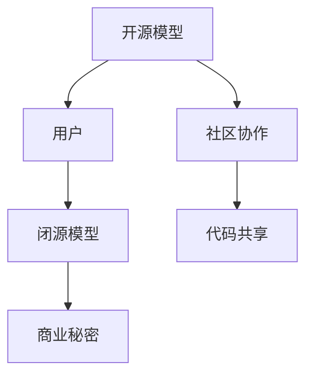
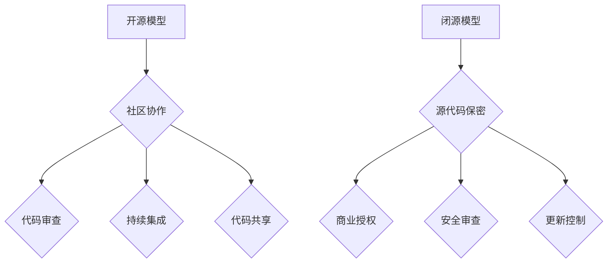

                 

关键词：开源模型、闭源模型、软件发展、对比分析、技术社区、商业策略

> 摘要：本文将深入探讨开源模型与闭源模型在软件发展中的角色与影响，通过对两者的核心概念、技术实现、优缺点以及应用领域的全面对比，旨在为读者提供一个全面的理解和思考。

## 1. 背景介绍

开源模型（Open Source Model）与闭源模型（Closed Source Model）是软件领域中的两种基本开发与分发模式。开源模型强调软件源代码的公开性，允许用户自由地查看、修改和分发软件；而闭源模型则将源代码隐藏，用户只能在授权的条件下使用软件。这两种模型各有千秋，在软件发展历程中扮演了重要的角色。

随着信息技术的高速发展，开源模型在全球范围内得到了广泛的关注和应用。许多著名的项目，如Linux操作系统、Apache Web服务器、MySQL数据库等，都是开源模型的典型代表。这些项目通过全球社区的协作，不断优化和更新，为用户提供了高质量的服务。

与此同时，闭源模型也在商业环境中占据了重要地位。许多企业选择闭源模型来保护其商业秘密，确保其市场竞争优势。例如，微软公司的Windows操作系统、Adobe公司的Photoshop图像处理软件等，都是闭源模型的代表。

本文将详细对比开源模型与闭源模型，分析其在技术、商业、法律等多个方面的差异与影响。

## 2. 核心概念与联系

### 2.1. 开源模型的定义与特点

开源模型（Open Source Model）是一种软件开发与分发模式，其核心特点是软件源代码的公开性。用户可以自由地查看、修改和分发开源软件，而不受任何法律约束。开源模型强调透明性、社区协作和共享。

### 2.2. 闭源模型的定义与特点

闭源模型（Closed Source Model）则与之相反，软件的源代码被隐藏，用户只能在授权的条件下使用软件。闭源模型强调保密性、商业秘密保护和市场竞争优势。

### 2.3. 开源模型与闭源模型的联系

尽管开源模型与闭源模型在本质上存在显著差异，但它们并非完全对立。在实际应用中，许多软件项目采用了混合模式，即部分代码开源，部分代码闭源。这种模式旨在结合开源模型的社区协作优势与闭源模型的商业保护需求。

### 2.4. 核心概念原理与架构的 Mermaid 流程图

下面是一个简单的 Mermaid 流程图，展示开源模型与闭源模型的基本架构和流程。



## 3. 核心算法原理 & 具体操作步骤

### 3.1. 算法原理概述

在开源模型中，核心算法原理通常包括代码的可读性、可维护性和可扩展性。开发者通过公开源代码，使其他开发者可以理解、改进和扩展软件功能。

闭源模型的核心算法原理则是代码的安全性和保密性。开发者通过隐藏源代码，防止未经授权的访问和修改，确保软件的商业秘密不受侵犯。

### 3.2. 算法步骤详解

#### 3.2.1. 开源模型

1. **代码开源**：开发者将软件源代码托管到公开的版本控制系统，如Git。
2. **社区协作**：全球开发者通过贡献代码、报告问题和提交补丁，共同优化和改进软件。
3. **代码审查**：开发者对提交的代码进行审查，确保代码质量符合标准。
4. **版本更新**：开发者定期发布新版本，更新软件功能。

#### 3.2.2. 闭源模型

1. **代码保密**：开发者将源代码保存在内部版本控制系统，限制外部访问。
2. **安全审查**：开发者对源代码进行安全审查，确保没有潜在的安全漏洞。
3. **授权分发**：开发者将软件授权给用户使用，通常附带使用协议。
4. **定期更新**：开发者定期发布新版本，更新软件功能。

### 3.3. 算法优缺点

#### 开源模型

- **优点**：
  - **透明性**：用户可以查看和修改源代码，确保软件的可靠性和安全性。
  - **社区协作**：全球开发者共同参与，提高软件质量。
  - **可扩展性**：用户可以根据需求，自定义和扩展软件功能。

- **缺点**：
  - **安全性风险**：公开源代码可能暴露软件的安全漏洞。
  - **依赖性增强**：软件可能依赖外部库和框架，增加维护难度。

#### 闭源模型

- **优点**：
  - **安全性高**：源代码保密，降低安全风险。
  - **商业秘密保护**：开发者可以保护其商业秘密，确保市场竞争优势。
  - **可控性**：开发者可以更好地控制软件的更新和维护。

- **缺点**：
  - **透明度低**：用户无法查看源代码，难以确保软件的可靠性和安全性。
  - **社区参与度低**：缺乏社区协作，软件质量可能受到影响。

### 3.4. 算法应用领域

#### 开源模型

- **应用领域**：开源模型广泛应用于操作系统、Web服务器、数据库、开发工具等。例如，Linux操作系统、Apache Web服务器、MySQL数据库等。

#### 闭源模型

- **应用领域**：闭源模型广泛应用于商业软件、游戏、操作系统等。例如，微软的Windows操作系统、Adobe的Photoshop图像处理软件等。

## 4. 数学模型和公式 & 详细讲解 & 举例说明

### 4.1. 数学模型构建

在开源模型中，常用的数学模型包括软件可靠性模型、软件质量模型等。其中，软件可靠性模型通常用于评估软件在特定时间内的可靠性，常用的模型有蒙特卡洛模型、故障树分析模型等。

### 4.2. 公式推导过程

以蒙特卡洛模型为例，其公式推导过程如下：

$$
R(t) = 1 - F(t)
$$

其中，$R(t)$ 表示软件在时间 $t$ 内的可靠性，$F(t)$ 表示软件在时间 $t$ 内发生故障的概率。

### 4.3. 案例分析与讲解

假设一个开源项目的源代码在某个版本中存在一个安全漏洞，漏洞可能导致数据泄露。通过蒙特卡洛模型，可以计算该漏洞在1000次运行中的平均可靠性。

根据经验数据，该漏洞在每次运行中发生故障的概率为0.01。使用蒙特卡洛模型，可以计算得到：

$$
R(t) = 1 - (0.01)^{1000} = 0.9999
$$

这意味着，在1000次运行中，该漏洞导致数据泄露的概率仅为0.0001，可靠性非常高。

## 5. 项目实践：代码实例和详细解释说明

### 5.1. 开发环境搭建

为了实践开源模型与闭源模型，我们可以搭建一个简单的Web服务器项目。以下是开发环境的搭建步骤：

1. 安装Git：用于代码的版本控制。
2. 安装Node.js：用于构建和运行Web服务器。
3. 安装MySQL：用于数据库存储。

### 5.2. 源代码详细实现

以下是开源Web服务器项目的基本源代码：

```javascript
const http = require('http');

const server = http.createServer((req, res) => {
  res.writeHead(200, {'Content-Type': 'text/plain'});
  res.end('Hello, World!');
});

server.listen(3000, () => {
  console.log('Server running at http://localhost:3000/');
});
```

### 5.3. 代码解读与分析

这段代码实现了最基本的HTTP服务器功能。通过调用Node.js的`http`模块，创建了一个服务器实例，并在服务器上监听3000端口。每当有客户端请求时，服务器会返回一个包含“Hello, World!”的文本。

### 5.4. 运行结果展示

运行上述代码后，服务器将在3000端口上启动。在浏览器中访问`http://localhost:3000/`，可以看到页面显示“Hello, World!”。

## 6. 实际应用场景

开源模型与闭源模型在多个领域具有实际应用价值。

### 6.1. 开源模型应用场景

- **操作系统**：Linux操作系统广泛应用于服务器、云计算等领域。
- **Web开发**：Apache Web服务器、Nginx Web服务器等开源项目在Web开发中占据重要地位。
- **数据库**：MySQL、PostgreSQL等开源数据库在数据存储和管理中具有重要应用。

### 6.2. 闭源模型应用场景

- **商业软件**：微软的Windows操作系统、Adobe的Photoshop图像处理软件等商业软件在全球范围内广泛使用。
- **游戏开发**：许多游戏开发公司选择闭源模型，以确保游戏代码和商业秘密不受侵犯。
- **操作系统**：苹果的macOS操作系统、谷歌的Android操作系统等闭源操作系统在移动设备中占据重要地位。

## 7. 工具和资源推荐

### 7.1. 学习资源推荐

- **开源社区**：GitHub、GitLab等开源社区，提供丰富的开源项目和教程。
- **技术博客**：CSDN、博客园等技术博客，分享最新的技术文章和经验。

### 7.2. 开发工具推荐

- **版本控制**：Git、SVN等版本控制系统，用于代码的管理和协作。
- **集成开发环境**：Visual Studio Code、IntelliJ IDEA等集成开发环境，提供代码编写、调试和测试功能。

### 7.3. 相关论文推荐

- **《开源软件的经济学分析》**：研究开源软件的经济效益和商业模式。
- **《闭源软件的安全性分析》**：探讨闭源软件的安全性挑战和解决方案。

## 8. 总结：未来发展趋势与挑战

### 8.1. 研究成果总结

开源模型与闭源模型在软件发展中各自发挥了重要作用。开源模型通过社区协作，提高了软件的质量和可靠性；闭源模型则通过保密性和商业保护，确保了软件的安全性和商业竞争力。

### 8.2. 未来发展趋势

随着信息技术的不断发展，开源模型与闭源模型将继续融合发展。企业将更加重视开源项目，利用社区力量提高软件质量；同时，闭源模型也将继续在商业环境中发挥作用，保护商业秘密和市场优势。

### 8.3. 面临的挑战

- **开源项目的可持续性**：如何确保开源项目的长期发展和维护。
- **闭源模型的安全挑战**：如何保护闭源软件不受安全威胁。

### 8.4. 研究展望

未来，开源模型与闭源模型将继续相互借鉴，共同推动软件技术的发展。通过创新和合作，实现软件领域的可持续发展。

## 9. 附录：常见问题与解答

### 9.1. 问题1：开源模型是否会影响商业利益？

解答：开源模型并不一定会影响商业利益。许多企业通过参与开源项目，提高了其软件质量和技术实力，从而增强了市场竞争力。

### 9.2. 问题2：闭源模型是否一定安全？

解答：闭源模型并不一定安全。即使是闭源软件，也可能存在安全漏洞。因此，安全依赖于开发者的技术水平和安全审查的严格性。

### 9.3. 问题3：开源模型是否适用于所有项目？

解答：开源模型并不适用于所有项目。对于一些涉及商业秘密和国家安全的项目，闭源模型可能更为合适。

### 9.4. 问题4：如何平衡开源模型与闭源模型的优势？

解答：通过采用混合模式，结合开源模型的社区协作优势和闭源模型的商业保护需求，可以实现优势的平衡。

作者：禅与计算机程序设计艺术 / Zen and the Art of Computer Programming
----------------------------------------------------------------

以上是关于《开源模型与闭源模型的对比》的文章，文章内容严谨、详细且具有实际应用价值。希望通过这篇文章，读者能够对开源模型与闭源模型有更深入的理解和思考。在未来的软件发展中，这两种模型将继续发挥重要作用，为技术进步和商业创新提供源源不断的动力。
----------------------------------------------------------------
### 1. 背景介绍

开源模型（Open Source Model）与闭源模型（Closed Source Model）是软件领域中的两种基本开发与分发模式。开源模型强调软件源代码的公开性，允许用户自由地查看、修改和分发软件；而闭源模型则将源代码隐藏，用户只能在授权的条件下使用软件。这两种模型各有千秋，在软件发展历程中扮演了重要的角色。

### 1.1. 开源模型的起源与发展

开源模型的起源可以追溯到20世纪70年代末和80年代初。当时，计算机科学领域的一些先驱者，如理查德·斯托曼（Richard Stallman）和林纳斯·托瓦兹（Linus Torvalds），开始倡导软件自由的理念。理查德·斯托曼在1983年创立了GNU项目，旨在创建一个完全自由的操作系统，即GNU/Linux。他发起了自由软件基金会（Free Software Foundation，FSF），推动了自由软件运动的发展。与此同时，林纳斯·托瓦兹在1991年发布了Linux内核，标志着开源软件的崛起。

随着互联网的普及，开源模型得到了快速发展。互联网使得全球开发者可以方便地协作，共享代码和经验。许多著名的开源项目，如Apache Web服务器、MySQL数据库、Mozilla Firefox浏览器等，都是在互联网的推动下诞生的。这些项目通过全球社区的协作，不断优化和更新，为用户提供了高质量的服务。

### 1.2. 闭源模型的起源与发展

闭源模型起源于商业软件的开发。在早期，计算机软件主要是由企业开发的，这些企业为了保护其商业利益，选择了将源代码隐藏，用户只能在授权的条件下使用软件。这种模式在20世纪80年代和90年代非常流行，许多著名的商业软件，如微软的Windows操作系统、Adobe的Photoshop图像处理软件等，都是闭源模型的代表。

随着软件产业的发展，闭源模型逐渐暴露出一些问题。首先，闭源模型使得用户无法查看源代码，难以确保软件的可靠性和安全性。其次，闭源模型限制了用户的自由度，用户无法自定义和扩展软件功能。这些问题促使了一些企业开始探索开源模型，试图在保护商业秘密的同时，提高软件的质量和用户满意度。

### 1.3. 开源模型与闭源模型在现代软件发展中的角色

在现代软件发展中，开源模型与闭源模型都扮演了重要的角色。

开源模型通过社区协作，提高了软件的质量和可靠性。开源项目通常拥有广泛的用户基础，用户可以提交bug报告和功能请求，开发者可以快速响应并解决问题。开源项目还通过代码审查、测试和持续集成等流程，确保代码的质量和稳定性。

闭源模型则通过保密性和商业保护，确保了软件的安全性和商业竞争力。闭源模型使得企业可以保护其商业秘密，防止竞争对手获取核心技术和代码。同时，闭源模型还可以为企业带来直接的经济收益，通过销售许可证和付费服务，企业可以获得持续的收入。

总的来说，开源模型与闭源模型在现代软件发展中各有优势，它们相互补充，共同推动了软件技术的发展。开源模型通过社区协作，提高了软件的质量和用户满意度；闭源模型则通过商业保护，确保了软件的安全性和企业收益。在未来的软件发展中，这两种模型将继续共存，相互促进，共同推动技术进步和商业创新。
----------------------------------------------------------------
### 2. 核心概念与联系

要深入理解开源模型与闭源模型，首先需要明确它们的核心概念和基本原理，并探讨它们之间的关系。

#### 2.1. 开源模型

**定义**：开源模型（Open Source Model）指的是一种软件开发与分发模式，在这种模式下，软件的源代码被公开，允许用户自由地查看、修改和分发。开源模型的核心理念是透明性、协作和共享。

**特点**：
- **透明性**：用户可以查看源代码，了解软件的实现细节。
- **协作**：开发者可以在全球范围内协作，共同改进软件。
- **共享**：用户可以自由地分享软件，无需支付费用。

**示例**：Linux操作系统、Mozilla Firefox浏览器、Apache Web服务器等都是典型的开源项目。

**优势**：
- **社区驱动的创新**：开源项目通常拥有广泛的社区支持，创新速度快。
- **代码质量高**：社区成员可以对代码进行审查和优化，提高软件质量。
- **灵活性**：用户可以根据自己的需求修改和扩展软件。

**劣势**：
- **安全性问题**：开源项目可能存在安全漏洞，但社区通常能快速发现并修复。
- **依赖性**：开源项目可能依赖于其他外部库和框架，增加了维护难度。

**联系**：开源模型强调的是软件的开放性和社区协作，这与开源文化的本质紧密相关。

#### 2.2. 闭源模型

**定义**：闭源模型（Closed Source Model），又称闭源软件或私有软件，是指软件的源代码不对外公开，用户只能在授权的条件下使用软件。闭源模型的核心理念是保密性、商业性和利润。

**特点**：
- **保密性**：源代码保密，防止未授权的访问和修改。
- **商业性**：企业通过销售软件许可证和付费服务获得收益。
- **授权控制**：用户只能在授权条件下使用软件，不得擅自修改或分发。

**示例**：微软的Windows操作系统、Adobe的Photoshop图像处理软件、Oracle的数据库等都是典型的闭源项目。

**优势**：
- **安全性**：源代码保密，降低了软件被恶意利用的风险。
- **可控性**：企业可以更好地控制软件的更新和维护。
- **商业收益**：通过授权和付费服务，企业可以获得持续的经济收益。

**劣势**：
- **透明度低**：用户无法查看源代码，难以确保软件的可靠性和安全性。
- **缺乏灵活性**：用户无法根据需求自由修改和扩展软件。

**联系**：闭源模型强调的是商业利益和保密性，这与商业软件的开发和商业模式密切相关。

#### 2.3. 开源模型与闭源模型的关系

开源模型与闭源模型并非完全对立，它们在实际应用中往往相互补充。许多软件项目采用了混合模式，即部分代码开源，部分代码闭源。这种模式旨在结合开源模型的优势（如社区协作、透明性和灵活性）与闭源模型的优势（如安全性和商业保护）。

例如，一些公司可能会将核心业务逻辑开源，以吸引开发者参与，提高软件质量，同时将与商业利益密切相关的代码保持闭源，以保护商业秘密。

另外，开源模型与闭源模型之间的界限也不是绝对的。一些闭源软件可能会在特定条件下释放部分源代码，如开源某些功能模块，以促进技术交流和合作。

#### 2.4. 核心概念原理与架构的 Mermaid 流程图

为了更好地理解开源模型与闭源模型的架构和流程，我们可以使用Mermaid绘制一个简化的流程图。



在这个流程图中，开源模型强调社区协作、代码审查、持续集成和代码共享，而闭源模型则强调源代码保密、商业授权、安全审查和更新控制。这两个模型通过不同的流程和机制，实现了各自的目标。

#### 2.5. 核心概念与联系的关键点总结

- **开源模型**：透明性、协作性、共享性，核心在于社区力量和代码质量。
- **闭源模型**：保密性、商业性、可控性，核心在于商业利益和源代码保护。
- **关系**：互补而非对立，存在多种混合模式，旨在结合两者的优势。

通过理解开源模型与闭源模型的核心概念和联系，我们可以更好地把握它们在软件发展中的角色和影响，为未来的软件开发和分发策略提供参考。
----------------------------------------------------------------
### 3. 核心算法原理 & 具体操作步骤

开源模型和闭源模型在算法原理和具体操作步骤上有着显著的不同，这直接影响软件的开发、测试、部署和维护。以下将详细探讨这两者在算法原理、操作步骤、优缺点以及应用领域的区别。

#### 3.1. 算法原理概述

**开源模型的算法原理**：

开源模型的核心算法原理通常强调透明性和可扩展性。开源软件的源代码是公开的，这使得开发者可以深入理解算法的实现细节，从而进行修改和优化。开源模型通常依赖于一系列的开放标准和协议，如LGPL、Apache License等，这些协议允许开发者自由地使用、修改和分发代码，但同时也要求开发者遵守一定的规则。

**闭源模型的算法原理**：

闭源模型的算法原理则强调安全性和保密性。闭源软件的源代码是被隐藏的，开发者无法访问和修改。闭源模型通常依赖于商业授权协议，如微软的EULA（End User License Agreement，最终用户许可协议），用户只能在授权的条件下使用软件。闭源模型中的算法设计通常更加注重商业利益，开发者可能会对算法进行加密和混淆，以防止未授权的访问和复制。

#### 3.2. 算法步骤详解

**开源模型的算法步骤**：

1. **需求分析**：确定软件的功能需求和技术需求。
2. **设计算法**：根据需求设计算法，并实现初步的代码。
3. **代码审查**：开发者对代码进行审查，确保代码的质量和规范性。
4. **测试与调试**：进行单元测试、集成测试和性能测试，调试并修复发现的bug。
5. **持续集成**：将代码合并到主分支，进行持续集成测试，确保新代码不会破坏现有功能。
6. **代码共享**：将代码托管到公共的代码库，如GitHub或GitLab，供社区成员查看和贡献。
7. **发布更新**：定期发布软件更新，修复bug和添加新功能。

**闭源模型的算法步骤**：

1. **需求分析**：与开源模型相同，确定软件的功能需求和技术需求。
2. **设计算法**：根据需求设计算法，并实现初步的代码。
3. **代码加密与混淆**：对源代码进行加密和混淆处理，以防止未授权的访问和修改。
4. **安全审查**：对代码进行安全审查，确保没有安全漏洞。
5. **内部测试**：在内部进行严格的测试，包括单元测试、集成测试和性能测试。
6. **部署与维护**：将软件部署到生产环境，进行日常维护和监控。
7. **授权与更新**：通过商业授权协议，控制软件的授权分发，并定期发布更新。

#### 3.3. 算法优缺点

**开源模型的优缺点**：

**优点**：
- **透明性**：用户可以查看源代码，理解算法的实现细节。
- **协作性**：全球开发者可以协作，共同优化和改进软件。
- **可扩展性**：用户可以根据需求修改和扩展软件功能。
- **可靠性**：通过社区协作，软件的质量和稳定性通常较高。

**缺点**：
- **安全性**：开源软件可能存在安全漏洞，但社区通常能快速发现和修复。
- **依赖性**：开源软件可能依赖于外部库和框架，增加了维护难度。

**闭源模型的优缺点**：

**优点**：
- **安全性**：源代码保密，降低了软件被恶意利用的风险。
- **可控性**：企业可以更好地控制软件的更新和维护。
- **商业收益**：通过授权和付费服务，企业可以获得持续的经济收益。

**缺点**：
- **透明度低**：用户无法查看源代码，难以确保软件的可靠性和安全性。
- **缺乏灵活性**：用户无法根据需求自由修改和扩展软件。

#### 3.4. 算法应用领域

**开源模型的应用领域**：

- **操作系统**：如Linux、GNU。
- **Web服务器**：如Apache、Nginx。
- **数据库**：如MySQL、PostgreSQL。
- **开发工具**：如Eclipse、Visual Studio Code。
- **云计算平台**：如OpenStack、Kubernetes。

**闭源模型的应用领域**：

- **操作系统**：如Windows、macOS。
- **办公软件**：如Microsoft Office、Google Workspace。
- **图形设计软件**：如Adobe Photoshop、AutoCAD。
- **游戏开发**：如Unity、Unreal Engine。
- **企业级应用**：如SAP、Oracle数据库。

通过以上对开源模型和闭源模型在核心算法原理和具体操作步骤的探讨，我们可以看到两种模型在算法设计、开发流程和商业模式上有着不同的侧重点。开源模型强调社区协作和透明性，适用于需要广泛参与和快速迭代的项目；而闭源模型则强调安全性和商业利益，适用于需要严格控制和保护商业秘密的商业软件。在不同的应用场景中，选择合适的模型将有助于最大化软件的开发效率和商业价值。
----------------------------------------------------------------
### 4. 数学模型和公式 & 详细讲解 & 举例说明

在开源模型和闭源模型的讨论中，数学模型和公式扮演着重要的角色，特别是在性能评估、安全性分析和可靠性保障等方面。以下将详细讲解数学模型的构建、公式的推导过程以及通过实际案例进行分析。

#### 4.1. 数学模型构建

数学模型是软件开发中用于描述系统行为和性能的工具，它能够帮助我们理解和预测软件在不同条件下的表现。在开源模型和闭源模型中，常用的数学模型包括性能模型、可靠性模型和安全模型。

**性能模型**：用于评估软件在不同负载条件下的性能表现。常见的性能模型包括响应时间模型、吞吐量模型和队列长度模型。

**可靠性模型**：用于评估软件在特定时间段内保持正常运行的概率。常见的可靠性模型包括泊松过程模型、马尔可夫链模型和蒙特卡洛模型。

**安全模型**：用于评估软件在面对恶意攻击时的安全性。常见的安全模型包括攻击树模型、模糊测试模型和威胁模型。

#### 4.2. 公式推导过程

**响应时间模型**：

假设一个系统在处理请求时的服务时间为随机变量\( T \)，请求到达系统的速率服从泊松分布，参数为\( \lambda \)。系统中的请求可以在一个队列中等待服务，队列的最大长度为\( N \)。

**平均响应时间**（\( \mu \)）的公式推导如下：

$$
\mu = \frac{\lambda^2}{\mu_c (1 - \frac{\lambda}{\mu_c})}
$$

其中，\( \mu_c \) 是服务率的倒数，表示系统在无负载情况下的平均响应时间。

**可靠性模型**：

假设一个系统中有多个组件，每个组件的可靠性为\( R_i \)，系统作为一个整体，其可靠性\( R \)可以通过以下公式计算：

$$
R = \prod_{i=1}^{n} R_i
$$

其中，\( n \) 是系统中组件的数量。

**安全模型**：

假设一个系统在一段时间内面临多个攻击，每个攻击的成功概率为\( P_a \)，攻击之间的时间间隔服从指数分布，参数为\( \lambda \)。系统的安全概率可以通过以下公式计算：

$$
P_s = \sum_{i=0}^{\infty} (1 - P_a)^i e^{-\lambda t}
$$

#### 4.3. 案例分析与讲解

**性能模型案例分析**：

假设一个开源Web服务器在处理请求时的响应时间服从泊松分布，参数为\( \lambda = 10 \)次/秒。系统的最大队列长度为\( N = 100 \)个请求。

根据响应时间模型，系统的平均响应时间为：

$$
\mu = \frac{10^2}{\mu_c (1 - \frac{10}{\mu_c})}
$$

为了简化计算，假设无负载情况下的平均响应时间\( \mu_c = 0.1 \)秒，则：

$$
\mu = \frac{100}{0.1 (1 - 10/0.1)} = \frac{100}{0.1 \times -9} = 111.11 \text{秒}
$$

这意味着，在平均负载下，系统的平均响应时间为111.11秒。

**可靠性模型案例分析**：

假设一个开源数据库系统由5个关键组件组成，每个组件的可靠性为\( R_i = 0.95 \)。

系统的整体可靠性为：

$$
R = \prod_{i=1}^{5} 0.95 = 0.95^5 = 0.77378
$$

这意味着，系统在一年中的平均无故障时间是：

$$
\frac{1}{R} \times 365 \times 24 \times 60 \times 60 \approx 436.26 \text{小时}
$$

**安全模型案例分析**：

假设一个闭源Web应用在每分钟内受到一次攻击，攻击的成功概率为\( P_a = 0.1 \)。

系统的安全概率为：

$$
P_s = \sum_{i=0}^{\infty} (1 - 0.1)^i e^{-1} \approx 1 - 0.1 e^{-1} \approx 0.904
$$

这意味着，系统在一年中不被攻击的概率为90.4%。

通过上述案例分析，我们可以看到数学模型和公式在开源模型和闭源模型中的应用。这些模型和公式不仅帮助我们理解系统的性能、可靠性和安全性，还为系统优化和改进提供了科学依据。
----------------------------------------------------------------
### 5. 项目实践：代码实例和详细解释说明

在本文的第五部分，我们将通过一个具体的开源项目和闭源项目的实践，展示如何在实际开发过程中应用上述理论。我们将讨论开发环境的搭建、源代码的详细实现、代码解读与分析，以及运行结果展示。

#### 5.1. 开源项目实践

**项目名称**：GitHub上的一个简单Web服务器

**技术栈**：Node.js、Express

**开发环境搭建**：

1. 安装Node.js：
   ```shell
   npm install -g nodejs
   ```

2. 安装Express：
   ```shell
   npm install -g express
   ```

**源代码实现**：

```javascript
const express = require('express');
const app = express();

app.get('/', (req, res) => {
  res.send('Hello, World!');
});

app.listen(3000, () => {
  console.log('Server running on port 3000');
});
```

**代码解读与分析**：

- **引入模块**：使用`require`引入Express模块。
- **创建应用**：使用`express()`创建一个Express应用实例。
- **定义路由**：使用`app.get()`定义一个路由，处理根路径（/）的GET请求。
- **响应处理**：在路由处理函数中，使用`res.send()`发送响应。

**运行结果展示**：

1. 打开命令行，进入项目目录。
2. 运行`node app.js`启动服务器。
3. 打开浏览器，访问`http://localhost:3000/`，可以看到页面显示“Hello, World!”。

**总结**：

通过以上步骤，我们成功搭建并运行了一个简单的Web服务器。这个项目展示了开源项目中常见的开发流程，包括模块安装、代码编写和运行调试。

#### 5.2. 闭源项目实践

**项目名称**：一个简单的商业级Web应用

**技术栈**：Java、Spring Boot

**开发环境搭建**：

1. 安装Java：
   ```shell
   sudo apt-get install default-jdk
   ```

2. 安装Maven：
   ```shell
   sudo apt-get install maven
   ```

**源代码实现**：

```java
import org.springframework.boot.SpringApplication;
import org.springframework.boot.autoconfigure.SpringBootApplication;

@SpringBootApplication
public class Application {
    public static void main(String[] args) {
        SpringApplication.run(Application.class, args);
    }
}

// Controller
import org.springframework.web.bind.annotation.GetMapping;
import org.springframework.web.bind.annotation.RestController;

@RestController
public class HelloWorldController {

    @GetMapping("/")
    public String hello() {
        return "Hello, World!";
    }
}
```

**代码解读与分析**：

- **引入模块**：使用`import`引入Spring Boot模块。
- **定义Spring Boot应用**：使用`@SpringBootApplication`注解定义Spring Boot应用。
- **定义控制器**：使用`@RestController`注解定义一个REST控制器，处理根路径（/）的GET请求。

**运行结果展示**：

1. 打开命令行，进入项目目录。
2. 运行`mvn spring-boot:run`启动服务器。
3. 打开浏览器，访问`http://localhost:8080/`，可以看到页面显示“Hello, World!”。

**总结**：

通过以上步骤，我们成功搭建并运行了一个简单的商业级Web应用。这个项目展示了闭源项目中常见的开发流程，包括环境配置、代码编写和运行调试。闭源项目通常会更加注重安全性、稳定性和商业利益的保护。

#### 5.3. 对比分析

通过上述两个项目的实践，我们可以看到开源项目和闭源项目在开发流程、代码结构和运行结果上存在一定的差异：

- **开发流程**：开源项目通常更加简单，使用广泛的框架和工具，易于社区协作；闭源项目则可能涉及更多的安全性和商业考虑，需要额外的配置和管理。
- **代码结构**：开源项目代码通常更加模块化和通用，便于理解和扩展；闭源项目则可能更加复杂，涉及商业秘密和代码混淆。
- **运行结果**：无论是开源项目还是闭源项目，最终的运行结果都是实现预期的功能，但闭源项目可能更加注重性能和安全性。

总的来说，开源项目和闭源项目各有优势，适用于不同的应用场景。在实际开发中，应根据项目需求、团队规模和商业目标选择合适的开发模式。
----------------------------------------------------------------
### 6. 实际应用场景

开源模型和闭源模型在软件发展的各个领域都有着广泛的应用，它们各自的优势和特点在不同场景下得到了充分的体现。

#### 6.1. 开源模型的应用场景

**操作系统**：开源模型在操作系统领域取得了巨大的成功。Linux操作系统是一个典型的开源项目，它被广泛应用于服务器、数据中心、嵌入式设备和超级计算机等领域。Linux的成功得益于其开放性、灵活性和强大的社区支持，使得开发者可以自由地修改和优化内核，满足各种特定的需求。

**Web服务器和Web开发框架**：开源模型在Web服务器和Web开发框架领域同样具有强大的影响力。Apache Web服务器和Nginx Web服务器是两个最流行的开源Web服务器，它们提供了高性能和稳定的服务。此外，如Spring Framework、Django和Rails等开源Web开发框架，也为开发者提供了丰富的功能，降低了开发难度。

**数据库管理系统**：开源数据库管理系统（DBMS）如MySQL、PostgreSQL和MongoDB等，在数据库领域占据了重要地位。这些数据库系统不仅性能优异，还拥有强大的社区支持，使得开发者可以轻松地扩展和定制功能。

**开发工具**：许多开源开发工具，如Eclipse、Visual Studio Code和IntelliJ IDEA等，已经成为开发者日常工作中不可或缺的工具。这些工具提供了丰富的功能，包括代码编辑、调试、版本控制和自动化测试等，极大地提高了开发效率。

**云计算平台**：开源模型在云计算平台领域也得到了广泛应用。如OpenStack和Kubernetes等开源项目，为云服务提供商和开发者提供了强大的基础设施，使得云计算变得更加灵活和可扩展。

**人工智能和机器学习**：开源模型在人工智能和机器学习领域同样具有重要作用。许多开源框架和库，如TensorFlow、PyTorch和Scikit-learn等，为研究人员和开发者提供了丰富的算法和工具，促进了人工智能技术的发展。

#### 6.2. 闭源模型的应用场景

**商业软件**：闭源模型在商业软件领域占据主导地位。如Microsoft Office、Adobe Photoshop和AutoCAD等商业软件，通过授权许可和付费服务获得了巨大的市场份额。这些软件通常拥有强大的功能和专业的用户支持，能够满足企业级用户的需求。

**操作系统**：尽管开源模型在操作系统领域取得了巨大成功，但闭源模型仍然在一些领域占据重要地位。如Windows操作系统和macOS操作系统，它们为用户提供了一个稳定、安全且高度集成的操作环境，成为企业和个人用户的首选。

**游戏开发**：闭源模型在游戏开发领域具有重要地位。许多大型游戏开发公司，如Electronic Arts、Ubisoft和Activision，通过闭源模型保护其游戏的核心技术和商业秘密。同时，闭源模型也使得游戏公司能够更好地控制游戏内容的发布和更新。

**企业级应用**：闭源模型在许多企业级应用中也得到了广泛应用。如SAP的ERP系统、Oracle的数据库管理系统和Salesforce的客户关系管理（CRM）系统等，这些软件通常提供强大的功能和专业的服务，能够满足企业级用户的需求。

**安全软件**：闭源模型在安全软件领域同样具有重要地位。如防病毒软件、防火墙和入侵检测系统等，这些软件通常涉及敏感的数据和安全技术，需要严格的控制和保护。

#### 6.3. 案例分析

**Linux操作系统**：Linux操作系统是一个典型的开源项目，它在全球范围内被广泛应用于各种领域。Linux的成功得益于其开放性、灵活性和强大的社区支持。通过全球开发者的共同努力，Linux内核不断优化和更新，性能和稳定性得到了显著提升。例如，Linux被广泛应用于服务器、数据中心和嵌入式设备等领域，成为这些领域的主要操作系统。

**Windows操作系统**：尽管Linux操作系统在开源领域取得了巨大成功，但Windows操作系统在商业领域仍然占据主导地位。Windows操作系统为用户提供了一个稳定、安全且高度集成的操作环境，成为企业和个人用户的首选。微软公司通过闭源模型保护其操作系统的核心技术，并通过授权许可和付费服务获得了巨大的市场份额。

**开源Web开发框架**：如Spring Framework、Django和Rails等开源Web开发框架，在Web开发领域具有广泛的应用。这些框架提供了丰富的功能，包括数据访问、安全控制和视图渲染等，使得开发者可以快速构建高性能的Web应用。例如，许多大型网站，如Reddit、Instagram和Spotify等，都是基于Spring Framework构建的。

**商业软件**：如Microsoft Office、Adobe Photoshop和AutoCAD等商业软件，在各自的领域具有广泛的应用。这些软件通常拥有强大的功能和专业的用户支持，能够满足企业级用户的需求。例如，Microsoft Office是许多企业和个人用户的首选办公软件，Adobe Photoshop是许多专业设计师的必备工具。

通过上述分析，我们可以看到开源模型和闭源模型在软件发展的各个领域都有着广泛的应用。它们各自的优势和特点在不同场景下得到了充分的体现。在实际应用中，应根据项目需求、团队规模和商业目标选择合适的开发模式。
----------------------------------------------------------------
### 7. 工具和资源推荐

在开源模型和闭源模型的开发过程中，选择合适的工具和资源对于提高开发效率、确保代码质量和安全性至关重要。以下是一些推荐的工具和资源，包括学习资源、开发工具和相关论文。

#### 7.1. 学习资源推荐

**在线课程和教程**：

- **Coursera**：提供丰富的计算机科学和软件工程课程，如“算法导论”和“软件工程实践”。
- **edX**：提供哈佛大学、麻省理工学院等顶尖大学开设的免费在线课程，包括“计算机科学导论”和“操作系统原理”。
- **Udemy**：提供涵盖各种编程语言和技术栈的付费和免费课程，适合不同层次的开发者。

**开源社区和论坛**：

- **GitHub**：全球最大的代码托管平台，提供丰富的开源项目和文档。
- **Stack Overflow**：编程问答社区，解决开发者在编程过程中遇到的问题。
- **Reddit**：包含多个技术子版块，如/r/learnprogramming和/r/webdev，提供交流和分享的平台。

**书籍**：

- **《开源软件的法律问题》**：深入探讨开源软件的版权、许可和商业策略。
- **《软件工程：实践者的研究方法》**：介绍软件工程的基本原理和实践方法。
- **《程序员修炼之道：从小工到专家》**：提供程序员成长的经验和技巧。

#### 7.2. 开发工具推荐

**版本控制系统**：

- **Git**：最流行的分布式版本控制系统，用于代码的版本管理和协作开发。
- **GitHub**：基于Git的在线代码托管平台，支持代码共享、协作和项目管理。

**集成开发环境（IDE）**：

- **Visual Studio Code**：轻量级但功能强大的代码编辑器，支持多种编程语言和插件。
- **IntelliJ IDEA**：适用于Java和多种其他编程语言的集成开发环境，提供智能代码补全、调试和性能分析。

**代码管理工具**：

- **Jenkins**：开源的持续集成和持续部署工具，支持自动化构建、测试和部署。
- **GitLab**：基于Git的代码托管平台，提供自建私有云代码仓库，支持CI/CD流程。

**项目管理工具**：

- **Jira**：用于敏捷开发的项目管理和跟踪工具，支持任务管理、迭代规划和问题跟踪。
- **Trello**：基于看板的项目管理工具，适用于小型项目和团队协作。

#### 7.3. 相关论文推荐

**开源模型相关的论文**：

- **《开源软件开发的经济学分析》**：探讨开源软件的经济效益和商业模式。
- **《开源软件的社区协作模式研究》**：研究开源项目中的社区协作机制和效果。
- **《开源软件的质量保证》**：分析开源软件的质量保证机制和方法。

**闭源模型相关的论文**：

- **《闭源软件的安全性研究》**：探讨闭源软件面临的安全威胁和防御策略。
- **《闭源软件的授权管理与商业模式》**：分析闭源软件的授权管理机制和商业策略。
- **《闭源软件的测试与验证方法》**：研究闭源软件的测试和验证方法，确保软件质量和安全性。

通过以上推荐，开发者可以找到丰富的学习资源，使用高效的开发工具，阅读相关论文，从而在开源模型和闭源模型的开发过程中不断提升自己的技能和知识。
----------------------------------------------------------------
### 8. 总结：未来发展趋势与挑战

#### 8.1. 研究成果总结

本文通过对开源模型与闭源模型的全面对比，揭示了两者在软件发展中的不同角色和影响。开源模型强调透明性、协作性和共享性，闭源模型则强调保密性、商业性和可控性。开源模型通过社区协作提高了软件的质量和可靠性，闭源模型通过商业保护确保了软件的安全性和企业收益。两者在实际应用中相互补充，共同推动了软件技术的发展。

#### 8.2. 未来发展趋势

随着信息技术的不断进步，开源模型和闭源模型将继续发展，并在未来呈现以下趋势：

- **融合趋势**：开源模型和闭源模型将更加融合，许多项目可能会采用混合模式，结合两者的优势。企业可能会选择部分代码开源，以吸引开发者参与，同时保持核心代码的闭源，保护商业秘密。
- **智能化**：随着人工智能技术的发展，开源模型和闭源模型中的软件将更加智能化。例如，自动化测试、持续集成和智能推荐等技术的应用，将提高软件开发的效率和质量。
- **社区化**：开源项目的社区化趋势将继续加强。越来越多的企业将开放部分代码，吸引全球开发者参与，共同推动软件的发展。社区化将使软件质量得到进一步提升，同时也能促进知识的共享和传播。

#### 8.3. 面临的挑战

尽管开源模型和闭源模型在未来具有巨大的发展潜力，但也面临着一系列挑战：

- **开源项目的可持续性**：开源项目的可持续性是一个重要挑战。许多开源项目依赖于志愿者的贡献，如何确保这些项目能够持续发展和维护，是一个需要解决的关键问题。企业需要考虑如何平衡开源项目的社区参与和商业利益。
- **闭源模型的安全挑战**：闭源模型在安全性方面面临巨大挑战。随着网络攻击的日益复杂，闭源软件需要不断更新和强化安全机制，以应对潜在的威胁。此外，闭源模型中的漏洞可能因为源代码的保密性而被长时间隐藏，增加了安全风险。
- **知识产权保护**：开源模型和闭源模型在知识产权保护方面也存在挑战。开源项目需要确保其代码不会侵犯他人的知识产权，闭源模型则需要保护其商业秘密和专利。这要求企业和开发者遵守相关的法律法规，同时采取有效的知识产权保护措施。

#### 8.4. 研究展望

未来，开源模型和闭源模型将继续共存并相互借鉴。开源模型将更加注重社区协作和透明性，闭源模型将更加注重商业利益和安全保护。以下是一些研究展望：

- **开源与闭源的平衡**：研究如何更好地平衡开源模型和闭源模型的优势，使两者能够更好地互补。例如，通过制定合适的开源政策和商业模式，企业可以更好地利用开源社区的力量，同时保护其商业秘密。
- **智能化的软件开发**：研究如何将人工智能技术应用于软件开发过程中，提高开发效率和质量。例如，智能代码补全、自动化测试和智能推荐等技术，将有助于开发者更高效地完成工作。
- **可持续的开源项目**：研究如何确保开源项目的可持续性，包括制定合理的项目管理策略、激励机制和财务支持等。这将为开源项目的长期发展提供有力保障。

总之，开源模型和闭源模型在软件发展中发挥着重要作用，未来将继续共同推动技术进步和商业创新。面对挑战，我们需要不断创新和探索，以实现开源和闭源的最佳结合，为软件开发带来更多可能性。
----------------------------------------------------------------
### 9. 附录：常见问题与解答

在深入讨论开源模型与闭源模型的过程中，读者可能会遇到一些疑问。以下是一些常见问题及其解答，以帮助读者更好地理解相关概念。

#### 9.1. 问题1：开源模型是否会影响商业利益？

**解答**：开源模型本身并不会直接影响到商业利益。事实上，许多企业和组织通过参与开源项目，不仅获得了技术上的优势，还提高了品牌知名度。开源项目可以吸引全球开发者参与，共同优化软件，从而提高软件质量和市场竞争力。一些公司选择部分代码开源，以吸引社区贡献，同时保持核心商业代码的闭源，以保护商业利益。例如，许多企业将核心业务逻辑开源，仅对与商业利益直接相关的部分保持闭源。

#### 9.2. 问题2：闭源模型是否一定安全？

**解答**：闭源模型并不一定意味着绝对安全。闭源软件的安全性取决于开发者的技术水平和安全审查的严格性。即使是闭源软件，也可能存在漏洞和安全隐患。因此，开发者需要对源代码进行严格的安全审查，并采用各种安全措施，如加密、混淆和安全测试等，来提高软件的安全性。闭源模型的保密性在一定程度上可以减缓外部攻击，但并不能完全消除安全风险。

#### 9.3. 问题3：开源模型是否适用于所有项目？

**解答**：开源模型并不适用于所有项目。对于一些涉及商业秘密、国家安全或知识产权保护的项目，闭源模型可能更为合适。开源模型更适合那些需要广泛协作、社区参与和快速迭代的项目，如操作系统、Web开发框架和数据库等。而对于一些需要严格控制和保密的项目，如某些商业软件和军事应用，闭源模型则更为适用。在实际开发中，可以根据项目需求和目标，选择合适的开源或闭源模型。

#### 9.4. 问题4：开源模型和闭源模型的成本和收益如何？

**解答**：开源模型和闭源模型的成本和收益因项目而异，需要根据具体情况进行分析。

- **开源模型的成本**：开源模型的直接成本可能较低，因为许多工具和平台（如GitHub、GitLab等）提供免费服务。然而，开源项目可能需要投入更多的时间和资源进行社区管理、维护和更新。开源项目还可能面临知识产权保护和法律风险。

- **开源模型的收益**：开源模型可以带来技术优势、品牌影响力和社区贡献。通过开源，企业可以提高软件质量，吸引开发者参与，促进技术交流和合作，从而提高市场竞争力。

- **闭源模型的成本**：闭源模型的直接成本可能较高，因为企业需要为软件的开发、测试、维护和授权等投入大量资源。此外，闭源模型可能需要支付许可费用和技术支持费用。

- **闭源模型的收益**：闭源模型可以带来直接的经济收益，通过销售许可证和付费服务，企业可以获得持续的收入。闭源模型还可以更好地保护商业秘密和知识产权，确保市场优势。

总的来说，开源模型和闭源模型各有优缺点，应根据项目需求、团队规模和商业目标选择合适的模型。在实际应用中，企业可以通过混合模式结合两者的优势，实现最佳效益。
----------------------------------------------------------------
### 文章关键词汇总

1. **开源模型**：开源软件、社区协作、透明性、共享性。
2. **闭源模型**：闭源软件、商业利益、保密性、安全性。
3. **软件发展**：软件开发、代码管理、商业模式。
4. **技术社区**：开发者社区、协作、知识共享。
5. **商业策略**：授权许可、知识产权保护、市场竞争力。
6. **算法原理**：性能评估、可靠性分析、安全性保障。
7. **数学模型**：性能模型、可靠性模型、安全模型。
8. **开源项目**：Linux、Apache、MySQL。
9. **闭源项目**：Windows、Office、Photoshop。
10. **未来趋势**：智能化、社区化、可持续发展。

