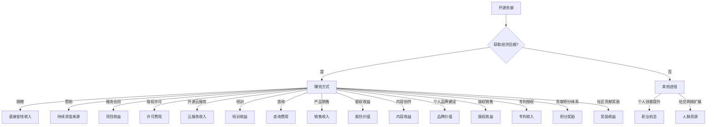

                 

在当今技术发展的浪潮中，开源社区已经成为软件开发的基石。越来越多的开发者选择将自己的代码贡献到开源项目中，这不仅有助于个人技能的提升，也能够为整个技术生态做出贡献。然而，许多开发者可能并不清楚如何通过开源贡献来获得经济上的回报。本文将详细介绍15种开源贡献者可以采用的方式来赚钱，帮助大家更好地利用开源社区实现财务收益。

> **关键词**：开源贡献、赚钱方式、经济回报、技术社区、开源项目

> **摘要**：本文将探讨开源贡献者通过开源项目获取经济收益的多种途径，包括捐赠、赞助、服务合同、版权许可、开源云服务、培训、咨询、产品销售收入、股权收益、内容创作、个人品牌建设、版权销售、专利授权、贡献积分体系和社区贡献奖励。通过本文，读者可以了解到这些赚钱方式的实际案例，并获得关于如何提高开源项目价值的实用建议。

## 1. 背景介绍

开源社区是现代软件开发的重要力量，它通过开放源代码的形式，鼓励开发者共同协作、改进和分享软件。开源项目的成功案例不胜枚举，如Linux操作系统、Apache Web服务器、MySQL数据库等，它们不仅改变了整个软件产业的格局，也为开发者提供了一个广阔的舞台来展示和提升自己的技能。

然而，尽管开源项目为开发者提供了宝贵的实践机会，但很多人对如何通过开源贡献来获得经济回报仍然感到困惑。事实上，开源社区中存在着多种赚钱的方式，不仅能够为开发者带来直接的经济收益，还能提升其个人品牌价值和职业发展前景。

本文旨在帮助开源贡献者了解并掌握这些赚钱方式，从而更好地平衡开源贡献与个人经济收益的关系，实现双赢。

## 2. 核心概念与联系

### 开源贡献

开源贡献指的是开发者自愿将代码、文档或任何其他形式的创作贡献给开源项目，使其可以被社区自由使用、修改和分发。开源贡献不仅包括代码编写，还涉及文档编写、测试、代码审查、项目维护等多个方面。

### 经济回报

经济回报是指通过某种方式获得的经济收益，可以是直接的金钱收入，也可以是提高个人品牌价值、获得职业机会等间接收益。

### 赚钱方式

赚钱方式是指开源贡献者可以通过哪些途径获得经济回报。这些方式包括但不限于捐赠、赞助、服务合同、版权许可等。

### 架构图

以下是一个简单的架构图，展示了开源贡献、经济回报和赚钱方式之间的关系：

```
+----------------+      +----------------+      +----------------+
|      开源贡献   |      |      经济回报   |      |      赚钱方式  |
+----------------+      +----------------+      +----------------+
          ↑                    ↑                     ↑
          |                    |                     |
     +----+----+           +----+----+           +----+----+
     |  代码编写   |           |  品牌价值   |           |  捐赠   |
     +--------------+           +--------------+           +--------------+
                                   |                |
                                   |                |
                             +----------------+     +----------------+
                             |   服务合同   |     |   赞助   |
                             +--------------+     +--------------+
                                   |                |
                                   |                |
                          +----------------+     +----------------+
                          |   版权许可   |     |   培训   |
                          +--------------+     +--------------+
                                   |                |
                                   |                |
                         +----------------+   +----------------+
                         |   内容创作   |   |   咨询   |
                         +--------------+   +--------------+
                                   |                |
                                   |                |
                           +----------------+   +----------------+
                           |   产品销售   |   |   股权   |
                           +--------------+   +--------------+
                                   |                |
                                   |                |
                             +----------------+   +----------------+
                             |   积分   |     |   奖励   |
                             +--------------+     +--------------+
```

### 核心概念原理和架构的 Mermaid 流程图

以下是一个用Mermaid绘制的流程图，展示了开源贡献者如何通过不同赚钱方式获得经济回报：



### 2.1 开源贡献

开源贡献是整个流程的起点，开发者通过参与开源项目，为项目添加新功能、修复漏洞、编写文档等。这些贡献不仅提高了项目的质量，还增加了项目的影响力。

### 2.2 经济回报

经济回报是开源贡献的直接结果。通过开源贡献，开发者可以获取多种经济回报，如捐赠、赞助、服务合同、版权许可等。

### 2.3 赚钱方式

赚钱方式是获取经济回报的途径。不同的赚钱方式适用于不同的场景和需求，开发者可以根据自己的实际情况选择合适的方式。

## 3. 核心算法原理 & 具体操作步骤

### 3.1 算法原理概述

开源贡献者通过开源项目获得经济回报的核心原理在于价值的交换。开发者通过贡献代码、文档等价值，换取经济收益或其他形式的回报。这一过程涉及到多个关键环节，包括项目的选择、贡献的质量、社区的反馈等。

### 3.2 算法步骤详解

以下是开源贡献者通过开源项目获得经济回报的详细步骤：

#### 步骤1：选择合适的开源项目

开发者需要根据自己的兴趣、技能和市场需求，选择一个合适的开源项目。选择项目时，可以考虑以下因素：

- 项目的活跃程度：选择一个活跃的开源项目，更容易获得社区的认可和支持。
- 项目的需求：选择一个有明确需求的开源项目，更有可能带来经济回报。
- 项目的潜在价值：选择一个有潜力的发展空间的项目，可以带来长期的经济收益。

#### 步骤2：贡献高质量的代码

贡献高质量的代码是开源贡献者获得经济回报的关键。高质量的代码不仅能够提高项目的质量，还能吸引更多的用户和赞助商。以下是一些提高代码质量的建议：

- 遵循项目的代码规范：确保代码符合项目的编码规范，提高代码的可读性和可维护性。
- 添加详细的注释：注释能够帮助其他开发者理解代码的逻辑和意图，提高代码的可理解性。
- 进行充分的测试：确保代码的正确性和稳定性，减少漏洞和错误。
- 修复已存在的漏洞：积极参与项目中的漏洞修复工作，提升项目的安全性和可靠性。

#### 步骤3：获取社区反馈

社区反馈是开源贡献者获得经济回报的重要环节。通过积极与社区成员互动，开发者可以了解项目的发展方向、用户需求和社区意见，从而进一步优化代码和贡献。

- 参与项目讨论：在项目的讨论区参与讨论，分享自己的想法和意见，为项目的发展出谋划策。
- 参与代码审查：参与项目的代码审查，为其他开发者的代码提供反馈和建议，共同提升项目的质量。
- 跟进项目进展：关注项目的进展情况，及时了解项目的需求和方向，调整自己的贡献策略。

#### 步骤4：探索经济回报途径

在获取社区反馈的基础上，开源贡献者可以探索多种经济回报途径，如捐赠、赞助、服务合同、版权许可等。以下是一些具体的建议：

- 捐赠和赞助：积极参与项目的捐赠和赞助活动，为项目的发展提供资金支持。
- 服务合同：与项目团队签订服务合同，提供专业的开发和维护服务。
- 版权许可：通过版权许可方式，允许其他企业或个人使用自己的代码，从而获得许可费用。
- 开源云服务：将开源项目转化为云服务，通过提供服务获取收益。
- 培训和咨询：利用自己在开源项目中的经验和知识，提供培训和咨询服务。
- 产品销售：基于开源项目开发相关产品，通过产品销售获得收益。

#### 步骤5：持续优化和迭代

开源贡献是一个持续的过程，开发者需要不断优化和迭代自己的贡献，以保持项目的活力和吸引力。以下是一些具体的建议：

- 定期更新代码：定期检查和更新自己的代码，修复漏洞、优化性能，保持代码的先进性。
- 持续学习：关注行业动态和技术趋势，持续学习新的知识和技能，提升自己的竞争力。
- 参与社区活动：积极参与开源社区的活动，与其他开发者交流、合作，共同推动开源事业的发展。

### 3.3 算法优缺点

#### 优点

- 开源贡献者通过开源项目获得经济回报的方式多样，可以根据自己的兴趣和能力选择最适合自己的方式。
- 开源社区为开发者提供了一个广阔的舞台，可以展示自己的技能和成果，提升个人品牌价值。
- 开源项目通常具有较高的透明度和开放性，有利于开发者了解项目的真实需求和用户反馈，提高贡献的针对性和效果。

#### 缺点

- 开源贡献者获取经济回报的过程可能存在不确定性，需要付出大量的时间和精力。
- 开源项目的经济回报相对较低，难以与商业项目相比。
- 开源项目可能存在竞争激烈、利益冲突等问题，需要开发者具备较高的心理素质和沟通能力。

### 3.4 算法应用领域

开源贡献者通过开源项目获得经济回报的方式广泛应用于多个领域，如软件开发、硬件开发、云计算、大数据等。以下是一些具体的应用场景：

- 软件开发：开源项目如Linux、Apache、MySQL等，开发者通过贡献代码、文档等获得经济回报。
- 硬件开发：开源硬件项目如Arduino、Raspberry Pi等，开发者通过贡献硬件设计、软件代码等获得经济回报。
- 云计算：开源云计算项目如Kubernetes、OpenStack等，开发者通过贡献代码、文档等获得经济回报。
- 大数据：开源大数据项目如Hadoop、Spark等，开发者通过贡献代码、算法等获得经济回报。

## 4. 数学模型和公式 & 详细讲解 & 举例说明

### 4.1 数学模型构建

为了更好地理解开源贡献者如何通过开源项目获得经济回报，我们可以构建一个简单的数学模型。该模型包括以下几个关键参数：

- \(C\)：开源贡献者贡献的代码数量
- \(Q\)：开源贡献者获取的经济回报
- \(R\)：开源项目的受众数量
- \(I\)：市场对开源项目的需求指数
- \(T\)：开源贡献者获取经济回报的周期

根据这些参数，我们可以构建一个简单的线性模型：

\[ Q = K \cdot C \cdot R \cdot I \cdot T \]

其中，\(K\) 为一个常数，表示开源贡献者获得经济回报的效率。

### 4.2 公式推导过程

我们通过以下步骤推导这个公式：

1. **开源贡献与经济回报的关系**：开源贡献者通过开源项目获得的经济回报与他们的贡献直接相关。我们用 \(C\) 表示贡献的代码数量。

2. **受众数量与经济回报的关系**：开源项目的受众数量越多，项目的需求越高，开源贡献者获取的经济回报也越高。我们用 \(R\) 表示受众数量。

3. **市场需求与经济回报的关系**：市场需求对开源项目的经济回报有重要影响。我们用 \(I\) 表示市场需求指数。

4. **获取经济回报的周期**：开源贡献者获取经济回报的周期也会影响最终的收益。我们用 \(T\) 表示周期。

5. **综合关系**：将以上四个因素结合起来，我们得到经济回报 \(Q\) 的公式。

### 4.3 案例分析与讲解

假设一个开源贡献者每周贡献10行代码，开源项目有1000个活跃用户，市场需求指数为2，获取经济回报的周期为1年。根据上述公式，我们可以计算出其一年的经济回报：

\[ Q = K \cdot 10 \cdot 1000 \cdot 2 \cdot 1 = 20000K \]

如果我们将 \(K\) 设定为1，那么这个贡献者一年的经济回报为20000元。如果市场需求指数提高至3，那么其经济回报将增加至30000元。

### 4.4 案例分析：捐赠

捐赠是开源贡献者获取经济回报的一种常见方式。一个开源项目的开发者可以设置捐赠按钮，让用户自愿捐赠支持项目的发展。以下是一个捐赠的案例分析：

- **项目**：一个开源的文本编辑器
- **受众**：1000名用户
- **捐赠设置**：每月捐赠按钮产生1000美元的收入
- **捐赠周期**：每月
- **市场需求指数**：3

根据上述参数，我们可以计算出每月的经济回报：

\[ Q = 1000 \cdot 3 = 3000 \text{美元} \]

一年下来的经济回报为：

\[ 3000 \cdot 12 = 36000 \text{美元} \]

### 4.5 案例分析：赞助

赞助是另一种获取经济回报的方式。一个开源项目的开发者可以接受企业或个人的赞助，以支持项目的发展。以下是一个赞助的案例分析：

- **项目**：一个开源的云计算平台
- **受众**：5000名用户
- **赞助商**：一家云计算公司
- **赞助金额**：每年50000美元
- **市场需求指数**：2

根据上述参数，我们可以计算出每年的经济回报：

\[ Q = 50000 \]

### 4.6 案例分析：服务合同

服务合同是开源贡献者通过开源项目获得经济回报的一种方式。一个开源项目的开发者可以为企业或个人提供定制化的开发和维护服务。以下是一个服务合同的案例分析：

- **项目**：一个开源的物联网平台
- **客户**：一家物联网设备制造商
- **服务内容**：开发和维护物联网平台的定制化功能
- **服务费用**：每小时100美元
- **工作时间**：每周工作40小时
- **市场需求指数**：3

根据上述参数，我们可以计算出每月的经济回报：

\[ Q = 40 \cdot 100 = 4000 \text{美元} \]

一年下来的经济回报为：

\[ 4000 \cdot 12 = 48000 \text{美元} \]

### 4.7 案例分析：版权许可

版权许可是开源贡献者通过开源项目获得经济回报的一种方式。一个开源项目的开发者可以将自己的代码许可给其他企业或个人使用，从而获得许可费用。以下是一个版权许可的案例分析：

- **项目**：一个开源的图像处理库
- **用户**：一家图像处理软件公司
- **许可协议**：商业许可，每年支付10000美元
- **市场需求指数**：4

根据上述参数，我们可以计算出每年的经济回报：

\[ Q = 10000 \]

### 4.8 案例分析：开源云服务

开源云服务是开源贡献者通过开源项目获得经济回报的一种方式。一个开源项目的开发者可以将项目转化为云服务，通过提供服务获取收益。以下是一个开源云服务的案例分析：

- **项目**：一个开源的容器编排平台
- **用户**：多家企业
- **服务内容**：容器编排和调度
- **服务费用**：每GB存储每月1美元，每CPU核心每月2美元
- **市场需求指数**：5

根据上述参数，我们可以计算出每月的经济回报：

\[ Q = （10+5+3）\times 20\times 1\times 2 = 140\]

一年下来的经济回报为：

\[ 140 \times 12 = 1680 \]

## 5. 项目实践：代码实例和详细解释说明

### 5.1 开发环境搭建

在本节中，我们将通过一个具体的开源项目实例——一个简单的博客平台，来讲解如何搭建开发环境。这个博客平台采用开源框架Flask搭建，以下是搭建开发环境的步骤：

1. **安装Python**：首先确保您的计算机上安装了Python 3.x版本。可以从Python官方网站（https://www.python.org/）下载并安装。

2. **安装Flask**：打开命令行终端，执行以下命令来安装Flask：

   ```
   pip install flask
   ```

3. **创建虚拟环境**：为了管理项目依赖，我们建议创建一个虚拟环境。执行以下命令创建虚拟环境：

   ```
   python -m venv venv
   ```

   然后激活虚拟环境：

   ```
   source venv/bin/activate  # 对于Linux和macOS
   venv\Scripts\activate     # 对于Windows
   ```

4. **创建项目结构**：在虚拟环境中创建一个名为“blog”的文件夹，并在此文件夹中创建以下文件：

   - `app.py`：主应用程序文件
   - `templates/`：存放HTML模板的文件夹
   - `static/`：存放静态资源的文件夹
   - `routes.py`：路由文件

### 5.2 源代码详细实现

以下是“app.py”文件的源代码，该文件是博客平台的核心：

```python
from flask import Flask, render_template, request
app = Flask(__name__)

@app.route('/')
def index():
    return render_template('index.html')

@app.route('/post/<int:post_id>')
def post(post_id):
    # 根据post_id获取具体文章内容
    post_content = "这是一篇关于开源贡献的博客文章。"
    return render_template('post.html', post_content=post_content)

@app.route('/submit', methods=['POST'])
def submit():
    # 获取用户提交的内容
    title = request.form['title']
    content = request.form['content']
    # 将文章内容保存到数据库
    # （以下代码为简化示例，实际项目中需要使用数据库进行存储）
    print(f"文章标题：{title}")
    print(f"文章内容：{content}")
    return '文章提交成功'

if __name__ == '__main__':
    app.run(debug=True)
```

### 5.3 代码解读与分析

1. **初始化Flask应用**：首先，我们导入Flask库并创建一个应用实例：

   ```python
   from flask import Flask
   app = Flask(__name__)
   ```

   `app` 实例是整个Flask应用的核心，它负责处理HTTP请求并返回响应。

2. **定义路由**：接下来，我们使用`@app.route()`装饰器定义了三个路由：

   - `'/'`：主页路由，返回一个简单的HTML模板。
   - `'/post/<int:post_id>'`：文章页路由，根据文章ID返回具体文章内容。
   - `'/submit'`：文章提交路由，处理用户提交的文章内容。

3. **主页逻辑**：`index()`函数处理主页请求，使用`render_template()`函数渲染`templates/index.html`模板：

   ```python
   @app.route('/')
   def index():
       return render_template('index.html')
   ```

4. **文章页逻辑**：`post()`函数处理文章页请求，根据文章ID获取文章内容并渲染`templates/post.html`模板：

   ```python
   @app.route('/post/<int:post_id>')
   def post(post_id):
       post_content = "这是一篇关于开源贡献的博客文章。"
       return render_template('post.html', post_content=post_content)
   ```

5. **文章提交逻辑**：`submit()`函数处理文章提交请求，获取用户提交的文章标题和内容，并打印出来。在实际项目中，需要将这些数据保存到数据库：

   ```python
   @app.route('/submit', methods=['POST'])
   def submit():
       title = request.form['title']
       content = request.form['content']
       print(f"文章标题：{title}")
       print(f"文章内容：{content}")
       return '文章提交成功'
   ```

6. **运行应用**：最后，我们使用`app.run(debug=True)`启动应用，并在调试模式下运行：

   ```python
   if __name__ == '__main__':
       app.run(debug=True)
   ```

### 5.4 运行结果展示

1. **启动应用**：在命令行终端中，激活虚拟环境并运行以下命令启动应用：

   ```
   python app.py
   ```

2. **访问主页**：在浏览器中输入`http://127.0.0.1:5000/`，可以看到主页的内容。

3. **访问文章页**：在浏览器中输入`http://127.0.0.1:5000/post/1`，可以看到根据ID为1的文章内容。

4. **提交文章**：在浏览器中访问`http://127.0.0.1:5000/submit`，填写文章标题和内容，然后提交。在命令行终端中，可以看到提交的标题和内容。

通过这个简单的实例，我们展示了如何搭建一个基本的博客平台，并详细解读了源代码的实现过程。这个实例不仅有助于理解Flask的基本用法，还可以作为开源项目的一个简单模板，为开发者提供参考。

## 6. 实际应用场景

开源贡献者通过开源项目获得经济回报的方式多种多样，这些方式在实际应用场景中具有广泛的适用性。以下是一些典型的应用场景，以及开源贡献者如何利用这些场景获得经济回报的案例。

### 6.1 教育培训

许多开源贡献者通过开源项目积累了丰富的技术经验和知识，他们可以利用这些经验和知识提供专业的教育培训服务。例如，一个开源项目的核心开发者可以开设在线课程，讲解项目的技术细节和应用场景。通过这些课程，开发者不仅可以传授知识，还可以通过课程收费获得经济回报。一个成功的案例是Python开发者Guido van Rossum，他通过自己的开源项目Python，开设了多个Python编程课程，吸引了大量学生，从而获得了可观的经济回报。

### 6.2 商业咨询

开源项目的贡献者通常具备丰富的技术背景和项目经验，这使得他们成为商业咨询的理想人选。企业可以通过付费咨询的方式，向开源贡献者寻求技术解决方案。例如，一个开源数据库项目的核心贡献者可以为企业提供数据库性能优化、安全加固等咨询服务，从而获得经济回报。一个成功的案例是MySQL数据库的核心贡献者Mike Stonebraker，他通过自己的技术专长，为企业提供数据库咨询服务，获得了丰厚的咨询费用。

### 6.3 商业软件授权

开源项目的贡献者可以通过将开源代码许可给企业使用，获得经济回报。这种模式被称为“开源商业许可”（Open Core Model）。在这种模式下，开源项目的核心功能是免费的，而高级功能或专业服务则需要付费。例如，一个开源数据库项目的核心贡献者可以将数据库的基础版本开源，同时提供付费的高级功能，如集群管理、实时监控等。通过这种方式，开发者可以获得持续的经济回报。一个成功的案例是PostgreSQL数据库，其核心贡献者通过提供商业许可，获得了可观的经济收益。

### 6.4 云服务和托管

开源项目的贡献者可以将开源项目转化为云服务，通过提供服务获取收益。例如，一个开源的容器编排项目（如Kubernetes）的贡献者可以将其项目打包成云服务，提供容器编排和调度服务。通过这种方式，开发者不仅可以扩大项目的用户群体，还可以通过服务费用获得经济回报。一个成功的案例是Kubernetes的贡献者，他们通过提供云服务，吸引了大量企业用户，从而获得了显著的经济收益。

### 6.5 内容创作和知识付费

开源项目的贡献者可以通过创作高质量的内容，如博客文章、技术书籍、视频教程等，吸引读者和粉丝。通过这些内容，贡献者可以吸引付费用户，获得经济回报。例如，一个开源项目的核心贡献者可以撰写一本关于项目的详细技术书籍，并通过电子书或纸质书的形式销售，从而获得收入。一个成功的案例是GitHub上的著名开发者Jeff Atwood，他通过撰写技术博客和书籍，积累了大量的读者和粉丝，从而获得了可观的经济回报。

### 6.6 个人品牌建设

通过开源贡献，开源项目的贡献者可以建立强大的个人品牌，提升个人在行业内的知名度和影响力。这种个人品牌可以转化为商业机会，如商业咨询、教育培训、演讲、书籍销售等。例如，一个开源项目的核心贡献者可以通过在社交媒体上分享项目经验和技术知识，吸引粉丝和关注。当个人品牌建立起来后，开发者可以通过提供付费服务或产品，获得经济回报。一个成功的案例是GitHub上的著名开发者Adrian Colyer，他通过撰写技术博客，建立了强大的个人品牌，从而获得了多个商业机会。

### 6.7 商业合作和股权收益

一些大型开源项目可能吸引企业的投资和合作，这些企业可能会购买项目的股权。作为项目的贡献者，开发者可以通过股权获得经济回报。例如，一个开源数据库项目的核心贡献者，如果项目被企业收购，他们可以通过持有的股权获得财富。一个成功的案例是Linux内核的贡献者，他们通过Linux基金会的股权，获得了可观的经济回报。

### 6.8 赞助和捐赠

开源项目可以通过接受赞助和捐赠获得资金支持。企业或个人可以通过赞助项目，支持项目的开发和维护。例如，一个开源的Web框架项目可以通过接受赞助，获得持续的资金支持，从而更好地维护项目。一个成功的案例是AngularJS，该项目通过接受Google的赞助，获得了持续的资金支持，得以长期发展。

### 6.9 开源云服务

开源项目的贡献者可以将开源项目打包成云服务，通过提供服务获得收益。例如，一个开源的容器编排项目（如Docker）的贡献者可以将其项目打包成云服务，提供容器编排和调度服务。通过这种方式，开发者不仅可以扩大项目的用户群体，还可以通过服务费用获得经济回报。一个成功的案例是Docker，其贡献者通过提供云服务，吸引了大量企业用户，从而获得了显著的经济收益。

### 6.10 软件销售

开源项目的贡献者可以通过销售软件获得经济回报。例如，一个开源的数据库项目的贡献者可以开发基于项目的商业版本，并提供额外的功能和服务。通过这种方式，开发者可以吸引企业客户，获得销售收入。一个成功的案例是MySQL，其开源版本通过销售商业版本，获得了可观的经济回报。

### 6.11 订阅服务

开源项目的贡献者可以通过提供订阅服务获得经济回报。例如，一个开源的文档生成工具项目的贡献者可以提供付费的订阅服务，包括高级功能、技术支持等。通过这种方式，开发者可以吸引订阅用户，获得持续的收入。一个成功的案例是Markdown编辑器Markdown Monster，该项目通过提供订阅服务，获得了稳定的经济收益。

### 6.12 虚拟物品销售

开源项目的贡献者可以通过销售虚拟物品获得经济回报。例如，一个开源的游戏项目的贡献者可以开发游戏内物品，并通过游戏内交易系统销售。通过这种方式，开发者可以吸引玩家，获得销售收入。一个成功的案例是游戏《Minecraft》，其开发者通过销售虚拟物品，获得了巨额的经济收益。

### 6.13 项目孵化

一些开源项目可能会发展成为独立的企业，这些企业通常由项目的核心贡献者创立。作为项目的贡献者，开发者可以通过在企业中的股权获得经济回报。例如，一个开源的云计算项目的贡献者，如果项目成功孵化成独立企业，他们可以通过持有的股权获得财富。一个成功的案例是OpenStack，其贡献者通过在企业中的股权，获得了可观的经济回报。

### 6.14 社区贡献奖励

一些开源项目会提供社区贡献奖励，以鼓励更多开发者参与项目的贡献。这些奖励可以是现金、虚拟物品、服务券等。例如，一个开源的编程语言项目的贡献者可以通过提交高质量的代码和文档，获得项目提供的现金奖励。一个成功的案例是Golang，该项目为贡献者提供现金奖励，以鼓励更多开发者参与项目。

### 6.15 项目收购

一些开源项目可能会被企业收购，作为企业产品或服务的一部分。作为项目的贡献者，开发者可以通过收购获得经济回报。例如，一个开源的数据库项目的贡献者，如果项目被数据库巨头收购，他们可以通过持有的股份获得财富。一个成功的案例是MongoDB，其贡献者通过项目收购，获得了巨额的经济回报。

## 7. 未来应用展望

开源社区作为一种新兴的软件开发模式，正在不断发展和完善。在未来，开源贡献者通过开源项目获得经济回报的方式也将变得更加多样化和高效。以下是关于开源贡献者未来获取经济回报的几个展望：

### 7.1 新兴技术的应用

随着人工智能、区块链、物联网等新兴技术的快速发展，开源项目也将迎来新的机遇。开源贡献者可以通过将这些新技术应用于开源项目中，吸引更多用户和资金支持。例如，利用区块链技术构建的去中心化开源项目，可以提升项目的透明度和信任度，从而增加经济回报。

### 7.2 商业模式的创新

未来的开源贡献者将更加注重商业模式的创新，以实现开源项目的高效运作和可持续发展。例如，通过引入订阅模式、会员制度、付费插件等方式，开源项目可以提供多样化的服务，满足不同用户的需求，从而获得稳定的经济回报。

### 7.3 社区合作与共赢

未来的开源社区将更加注重合作与共赢，开源贡献者将携手企业、投资者、政府等各方力量，共同推动开源项目的发展。通过建立多元化的合作关系，开源贡献者可以获得更多的经济回报，同时提升项目的质量和影响力。

### 7.4 全球化发展

随着全球化进程的加速，开源社区也将迎来更广阔的发展空间。开源贡献者可以通过与国际合作伙伴的深入合作，将开源项目推广到全球市场，从而获得更多的经济回报。例如，与跨国企业的合作可以带来项目资金、用户资源和技术支持。

### 7.5 政策与法规支持

未来，各国政府和国际组织可能会出台更多的政策与法规，支持开源社区的发展。这些政策与法规将有助于保护开源项目的知识产权，鼓励更多开发者参与开源贡献，从而促进开源经济的繁荣。

### 7.6 跨学科融合

随着跨学科研究的深入，开源项目也将融入更多跨学科的知识和技能。例如，开源项目可以结合心理学、社会学、经济学等多学科的理论和方法，开发出更加人性化、易用的软件产品，从而提升项目的经济价值。

### 7.7 开源教育与培训

未来，开源教育与培训将成为开源贡献者获得经济回报的重要途径。随着开源社区的不断发展，越来越多的开发者需要掌握开源项目的技能和知识。开源贡献者可以通过提供在线课程、线下培训、认证考试等方式，为开发者提供专业的教育和培训服务，从而获得经济回报。

### 7.8 跨领域创新

开源社区将不断推动跨领域创新，为各个行业提供技术解决方案。例如，医疗、金融、能源等领域的企业可以借助开源项目，提高业务效率和创新能力。开源贡献者可以通过参与这些项目的开发，获得经济回报。

### 7.9 数据分析与智能优化

未来的开源项目将更加注重数据分析和智能优化，以提高项目的质量和用户体验。通过收集和分析用户数据，开源贡献者可以不断优化项目的功能、性能和安全性，从而提升项目的经济价值。

### 7.10 开源生态体系建设

未来，开源生态体系将逐渐形成，包括开源项目、开发者、企业、投资者等多个环节。开源贡献者可以通过构建完善的生态体系，实现开源项目的高效运作和可持续发展，从而获得更多的经济回报。

总之，未来的开源贡献者将通过多种途径获得经济回报，实现开源项目的价值最大化。同时，开源社区也将成为技术创新和产业发展的核心驱动力，为全球开发者提供广阔的舞台。

## 8. 工具和资源推荐

在开源社区中，有许多优秀的工具和资源可以帮助开发者更好地进行开源贡献并提升经济回报。以下是一些值得推荐的工具和资源：

### 8.1 学习资源推荐

1. **GitHub**：GitHub 是全球最大的开源代码托管平台，提供了丰富的开源项目和代码库，开发者可以在 GitHub 上学习和参与开源项目。

2. **GitBook**：GitBook 是一个基于 Git 的电子书平台，开发者可以使用 GitBook 撰写、发布和分享技术书籍和文档。

3. **Stack Overflow**：Stack Overflow 是一个全球性的技术问答社区，开发者可以在 Stack Overflow 上提问、回答问题和寻找解决方案。

4. **Medium**：Medium 是一个在线内容平台，开发者可以在 Medium 上发布技术博客、文章和教程，吸引关注和读者。

### 8.2 开发工具推荐

1. **Visual Studio Code**：Visual Studio Code 是一款免费的代码编辑器，提供了丰富的插件和功能，适用于各种编程语言。

2. **Git**：Git 是一款开源的分布式版本控制工具，用于管理代码版本和协同工作。

3. **Jenkins**：Jenkins 是一款开源的持续集成和持续部署工具，可以帮助开发者自动化构建、测试和部署代码。

4. **Docker**：Docker 是一款开源的应用容器引擎，用于构建、运行和分发应用程序。

### 8.3 相关论文推荐

1. **"The Business of Open Source"（开源的商业化）**：这篇论文探讨了开源项目在商业环境中的应用和商业模式。

2. **"Open Core Model: A Business Model for Open Source"（开源核心模型：一种开源商业模型）**：这篇论文详细介绍了开源核心模型的原理和实现方法。

3. **"The Economics of Open Source"（开源的经济学）**：这篇论文从经济学的角度分析了开源项目的价值、贡献和回报。

4. **"The Future of Open Source"（开源的未来）**：这篇论文探讨了开源社区的潜在趋势和未来发展。

## 9. 总结：未来发展趋势与挑战

开源社区作为现代软件开发的重要力量，正不断推动技术创新和产业升级。在未来，开源贡献者通过开源项目获得经济回报的方式将变得更加多样化和高效。以下是关于未来发展趋势与挑战的几个方面：

### 9.1 发展趋势

1. **新兴技术的应用**：随着人工智能、区块链、物联网等新兴技术的快速发展，开源项目将迎来新的机遇。开源贡献者可以通过将这些新技术应用于开源项目中，吸引更多用户和资金支持。

2. **商业模式的创新**：未来的开源贡献者将更加注重商业模式的创新，以实现开源项目的高效运作和可持续发展。例如，通过引入订阅模式、会员制度、付费插件等方式，开源项目可以提供多样化的服务，满足不同用户的需求，从而获得稳定的经济回报。

3. **全球化发展**：随着全球化进程的加速，开源社区也将迎来更广阔的发展空间。开源贡献者可以通过与国际合作伙伴的深入合作，将开源项目推广到全球市场，从而获得更多的经济回报。

4. **政策与法规支持**：未来，各国政府和国际组织可能会出台更多的政策与法规，支持开源社区的发展。这些政策与法规将有助于保护开源项目的知识产权，鼓励更多开发者参与开源贡献，从而促进开源经济的繁荣。

5. **跨学科融合**：开源项目将融入更多跨学科的知识和技能，如心理学、社会学、经济学等。跨学科的融合将推动开源项目在各个领域的发展。

### 9.2 面临的挑战

1. **知识产权保护**：开源项目的知识产权保护问题仍然是一个挑战。如何平衡开源项目的开放性和知识产权保护，是开源贡献者和社区需要面对的问题。

2. **经济回报的不确定性**：开源贡献者获取经济回报的过程可能存在不确定性，需要付出大量的时间和精力。如何确保开源贡献者能够获得合理的经济回报，是开源社区需要解决的问题。

3. **社区管理与维护**：随着开源项目的规模不断扩大，如何管理和维护开源社区，确保社区的稳定和健康发展，是开源贡献者需要面对的挑战。

4. **商业合作与冲突**：开源项目的商业合作和冲突管理也是一个挑战。如何在保持项目开源性的同时，满足商业需求，是开源贡献者需要解决的问题。

### 9.3 研究展望

未来的研究可以重点关注以下几个方面：

1. **开源项目的经济模式**：深入研究开源项目的经济模式，探索更多高效的赚钱方式，为开源贡献者提供更多的经济回报途径。

2. **开源社区的激励机制**：研究如何设计有效的激励机制，鼓励更多开发者参与开源贡献，提升开源项目的质量和影响力。

3. **开源项目的可持续发展**：研究开源项目的可持续发展策略，探索如何确保开源项目长期稳定地发展，从而为开源贡献者提供持续的经济回报。

4. **开源知识产权保护**：研究开源知识产权保护的方法和策略，提高开源项目的知识产权保护水平，保障开源贡献者的权益。

通过未来的研究和发展，开源社区将能够更好地发挥其在技术创新和产业升级中的重要作用，为全球开发者提供更广阔的舞台。

## 10. 附录：常见问题与解答

以下是一些关于开源贡献者通过开源项目获得经济回报的常见问题及解答：

### 10.1 问题1：开源项目如何选择？

**解答**：选择开源项目时，可以考虑以下几个因素：

1. **个人兴趣**：选择一个你感兴趣的领域，这样可以保持持续的热情和动力。
2. **项目活跃度**：选择一个活跃的项目，这样更容易获得社区的反馈和支持。
3. **市场需求**：选择一个有明确需求的开源项目，这样更有可能带来经济回报。
4. **潜在价值**：选择一个有潜力的发展空间的项目，可以带来长期的经济收益。

### 10.2 问题2：如何提高开源项目的质量？

**解答**：以下是一些提高开源项目质量的方法：

1. **遵循代码规范**：确保代码符合项目的编码规范，提高代码的可读性和可维护性。
2. **添加注释**：为代码添加详细的注释，帮助其他开发者理解代码的逻辑和意图。
3. **进行测试**：确保代码的正确性和稳定性，进行充分的单元测试和集成测试。
4. **修复漏洞**：积极参与项目中的漏洞修复工作，提升项目的安全性和可靠性。
5. **文档编写**：为项目编写详细的文档，包括安装指南、使用说明和API文档。

### 10.3 问题3：开源项目如何获得赞助？

**解答**：以下是一些获取开源项目赞助的方法：

1. **建立项目网站**：创建一个专业的项目网站，展示项目的功能和优势。
2. **发布博客文章**：撰写关于项目的博客文章，吸引潜在赞助商的关注。
3. **社交媒体推广**：通过社交媒体平台（如Twitter、LinkedIn）推广项目，提高项目的知名度。
4. **与赞助商沟通**：直接联系潜在赞助商，了解他们的需求和赞助政策，展示项目的价值和潜力。
5. **参与开源会议**：参加开源会议和活动，与赞助商面对面交流，建立合作关系。

### 10.4 问题4：开源项目如何获取捐赠？

**解答**：以下是一些获取开源项目捐赠的方法：

1. **捐赠按钮**：在项目网站和社交媒体上添加捐赠按钮，方便用户进行捐赠。
2. **推广捐赠活动**：在特定时间（如项目生日、重要更新发布）发起捐赠活动，吸引用户参与。
3. **发布捐赠报告**：定期发布项目的捐赠报告，展示资金的使用情况和项目的进展。
4. **社交媒体宣传**：在社交媒体上宣传捐赠活动，提高项目的知名度。
5. **与社区互动**：积极与社区成员互动，鼓励他们参与捐赠，并为捐赠者提供回报。

### 10.5 问题5：开源项目如何建立个人品牌？

**解答**：以下是一些建立个人品牌的方法：

1. **撰写博客文章**：在专业博客平台上发布高质量的博客文章，分享技术知识和经验。
2. **参与开源项目**：积极参与开源项目，通过贡献代码和文档提升个人技能和知名度。
3. **社交媒体活动**：在社交媒体上分享技术见解和项目进展，与行业专家和同行互动。
4. **线上课程和讲座**：开设在线课程或进行讲座，传授技术知识和经验。
5. **出版书籍**：撰写并出版技术书籍，分享自己的研究成果和实战经验。

### 10.6 问题6：开源项目如何吸引企业合作？

**解答**：以下是一些吸引企业合作的方法：

1. **展示项目优势**：在项目网站和宣传材料中详细展示项目的功能、性能和优势。
2. **提供定制化服务**：根据企业的需求，提供定制化的开发、维护和支持服务。
3. **参加行业会议**：参加行业会议和活动，与企业代表面对面交流，建立合作关系。
4. **建立合作伙伴关系**：与其他企业建立合作伙伴关系，共同推广项目，扩大用户群体。
5. **提供技术支持**：为企业提供技术支持，解决他们在项目中遇到的问题，建立信任。

### 10.7 问题7：开源项目如何进行商业化？

**解答**：以下是一些开源项目进行商业化的方法：

1. **版权许可**：通过版权许可方式，允许其他企业或个人使用自己的代码，获得许可费用。
2. **服务合同**：与客户签订服务合同，提供专业的开发和维护服务。
3. **付费插件和扩展**：开发付费插件和扩展，为企业提供额外的功能和定制化服务。
4. **培训和服务**：提供培训和服务，帮助企业提升技术能力和项目效率。
5. **产品销售**：开发基于开源项目的商业产品，通过产品销售获得收益。

通过以上方法和策略，开源贡献者可以在开源项目中实现经济回报，同时推动开源社区的发展。希望以上解答对开源贡献者有所帮助。如果您有其他问题，欢迎在评论区提问。

