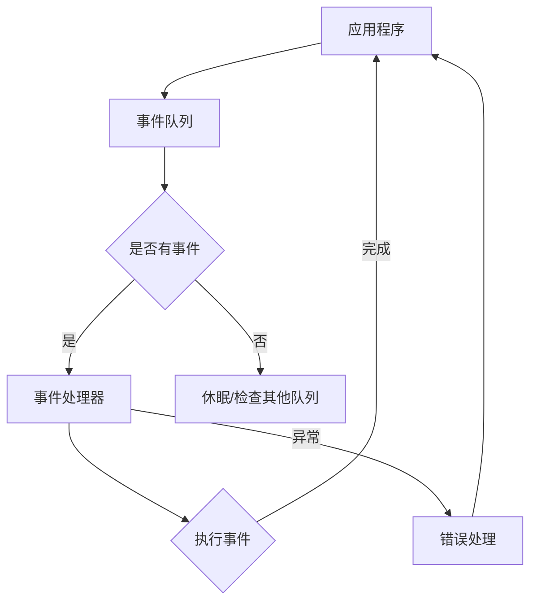

                 

### 1. 背景介绍

异步处理（Asynchronous Processing）是一种计算机编程模型，它允许程序独立地处理多个操作，而无需等待任何一个操作完成。这种模型在多核处理器、网络延迟和I/O密集型应用中显得尤为重要。随着现代计算机系统的复杂性和数据量的激增，异步处理技术变得越来越重要。在本文中，我们将探讨异步处理技术的实现与优化，以帮助开发者更好地理解和应用这一技术。

异步处理的历史可以追溯到20世纪60年代，当时计算机科学家开始探索如何优化I/O操作。从那时起，异步处理技术经历了不断的演进，逐渐成为现代编程语言和系统设计的重要组件。在过去的几十年中，异步处理技术在计算机网络、Web开发、游戏编程、大数据处理等领域得到了广泛应用。

本文将首先介绍异步处理的核心概念，包括其定义、原理和应用场景。接着，我们将深入探讨异步处理技术的实现细节，包括事件驱动模型、协程和异步编程接口。随后，本文将介绍几种常见的异步算法，并分析它们的优缺点。此外，本文还将讨论数学模型和公式在异步处理中的应用，以及如何通过优化提高异步处理的性能。最后，我们将通过一个实际项目实例来展示异步处理技术的具体应用，并探讨其未来发展趋势和面临的挑战。

通过本文的阅读，读者将能够全面了解异步处理技术的原理、实现方法和应用场景，从而为实际开发中的性能优化提供指导。

### 2. 核心概念与联系

#### 2.1 定义与原理

异步处理的核心概念在于程序的多个操作可以并行执行，而无需同步等待。这意味着在一个操作仍在进行时，程序可以继续执行其他操作，从而提高了处理效率。异步处理通常依赖于事件驱动模型，其中事件是指由外部环境引发的特定动作，如用户点击、网络数据到达或硬件中断。

事件驱动模型的工作原理如下：系统创建一个事件队列，当有事件发生时，事件会被添加到队列中。系统会定期检查队列，并根据事件的优先级顺序处理它们。这个过程使得程序可以快速响应用户输入和其他外部事件，而无需阻塞主线程。

异步处理的基本原理包括以下几个方面：

- **非阻塞I/O**：程序在执行I/O操作时不会阻塞，而是继续执行其他任务，当I/O操作完成时，程序会收到通知并处理结果。
- **回调函数**：异步处理常用回调函数来处理异步操作的结果。回调函数是一种在异步操作完成后调用的函数，它接收操作的结果并执行后续操作。
- **事件循环**：事件循环是异步处理的关键组件，它负责检查事件队列并处理事件。事件循环通常是一个无限循环，不断检查是否有待处理的事件。

#### 2.2 异步处理与并行处理的关系

异步处理与并行处理密切相关，但二者有本质的区别。并行处理是指多个操作在同一时刻执行，而异步处理则强调操作之间的独立性。异步处理可以在单核处理器上实现，通过优化I/O操作和任务调度来提高效率，而并行处理通常需要多核处理器或分布式系统来同时执行多个任务。

异步处理与并行处理的关系可以概括为以下几点：

- **异步处理可以并行执行**：在一个异步程序中，多个操作可以并行执行，因为它们之间没有同步依赖。
- **并行处理可以利用异步处理**：在并行系统中，异步处理技术可以用来优化并行任务的执行，通过减少同步和等待时间来提高性能。
- **异步处理不一定并行**：异步处理不要求操作在同一时刻执行，它只是允许操作独立进行。

#### 2.3 异步处理的架构和组件

异步处理的架构通常包括以下几个关键组件：

- **事件队列**：用于存储和管理待处理的事件。
- **事件处理器**：负责从事件队列中提取事件并执行相应的操作。
- **回调函数**：用于处理异步操作的结果。
- **协程**：是一种轻量级的线程，用于实现异步编程。

异步处理的架构可以用以下Mermaid流程图表示：



在这个流程图中，应用程序将事件添加到事件队列，事件处理器定期检查事件队列并执行事件。如果事件处理成功，应用程序继续执行；如果发生异常，则进行错误处理。

#### 2.4 异步处理的优势和应用场景

异步处理具有以下几个显著优势：

- **提高性能**：异步处理可以减少同步等待时间，从而提高程序的执行效率。
- **增强用户体验**：在用户界面中，异步处理可以避免界面冻结，提供更好的响应性和流畅性。
- **支持并发操作**：异步处理允许程序同时处理多个任务，从而提高系统的并发能力。

异步处理的应用场景非常广泛，以下是一些典型的应用：

- **Web应用**：在Web开发中，异步处理可以优化页面加载速度，提高用户体验。
- **网络编程**：在网络编程中，异步处理可以同时处理多个客户端请求，提高服务器性能。
- **大数据处理**：在大数据处理领域，异步处理可以高效地处理大规模数据集，提高数据处理速度。
- **游戏开发**：在游戏开发中，异步处理可以优化游戏逻辑，提高游戏性能。

通过理解异步处理的核心概念和原理，读者可以为实际项目中的应用打下坚实的基础。接下来，本文将深入探讨异步处理技术的实现细节，包括事件驱动模型、协程和异步编程接口。

## 2.1 异步处理与并行处理的区别

异步处理与并行处理虽然在概念上有所重叠，但它们的核心区别在于任务的执行方式和资源管理。以下是对两者进行详细比较的几个方面：

### 任务执行方式

- **异步处理**：异步处理中的任务不是同时执行的，而是在某个特定时刻触发后开始执行。例如，当一个Web请求被处理时，服务器可能会将请求放入队列，并在有可用资源时异步处理。异步处理中的任务是顺序执行的，但可以在等待某个任务完成时执行其他任务，从而提高整体效率。
- **并行处理**：并行处理中的多个任务在同一时刻执行，通常需要多核处理器或分布式系统。这意味着多个任务可以同时处理，从而提高执行速度。并行处理中的任务通常在同一个时间片内交替执行，而不是按照顺序执行。

### 资源管理

- **异步处理**：异步处理通常需要较少的资源管理。因为异步任务可以独立执行，所以在处理I/O密集型任务时，异步处理可以减少线程或进程的使用。例如，在读取文件或网络数据时，程序可以继续执行其他任务，而无需等待I/O操作完成。
- **并行处理**：并行处理需要更多的资源管理，因为多个任务需要同时运行。这通常涉及到线程池、进程池或其他调度策略，以确保任务可以高效地分配和执行。在资源有限的情况下，并行处理可能会增加系统的负担，导致资源竞争和性能下降。

### 任务依赖关系

- **异步处理**：异步处理中的任务通常没有直接的依赖关系。例如，一个HTTP服务器可以同时处理多个请求，而无需等待之前的请求完成。这允许系统在不阻塞主线程的情况下处理更多任务，从而提高性能和响应性。
- **并行处理**：并行处理中的任务可能存在依赖关系。例如，在多线程程序中，一个线程可能依赖于另一个线程的结果。这种依赖关系会导致任务之间的同步和协调，从而可能降低并行处理的性能。

### 示例场景

- **异步处理**：一个常见的异步处理场景是在Web开发中处理用户请求。当用户发起请求时，服务器可以将请求放入队列，并在有空闲资源时异步处理。这样，服务器可以在处理一个请求的同时继续处理其他请求，从而提高吞吐量。
- **并行处理**：一个常见的并行处理场景是在图像处理中同时处理多个图像。在这种情况下，多个图像处理任务可以并行执行，从而减少总处理时间。然而，这需要处理数据之间的同步和协调，以确保最终结果的一致性。

### 总结

异步处理与并行处理虽然有所不同，但它们在某些情况下可以相互补充。异步处理适用于独立执行的任务，可以在不增加资源负担的情况下提高系统的响应性和性能。而并行处理适用于具有依赖关系的任务，可以在多核处理器或分布式系统中提高计算速度。在实际应用中，根据任务的特点和系统资源，选择合适的处理方式可以优化系统的性能和效率。

#### 2.2 异步处理的架构和组件

异步处理的架构设计对于实现高效、响应迅速的系统至关重要。以下是对异步处理架构中的关键组件和其相互作用进行详细解释的部分。

### 事件队列

事件队列是异步处理的核心组件之一。它负责存储和管理系统中的事件。事件可以来自各种来源，如用户交互、I/O操作完成、定时器触发等。事件队列通常采用先进先出（FIFO）或优先级队列（PQ）的数据结构来组织和管理事件。

在事件队列中，事件按照其发生的时间顺序或优先级进行排列。当系统需要处理事件时，它会从事件队列中提取事件，并根据事件类型和优先级进行相应的处理。事件队列的设计对系统的性能和响应性有重要影响。一个高效的队列可以减少处理事件的延迟，提高系统的吞吐量。

### 事件处理器

事件处理器是负责从事件队列中提取事件并进行处理的模块。事件处理器通常是一个独立的线程或进程，它可以与主线程并行执行。当事件处理器从事件队列中提取事件时，它会执行相应的事件处理逻辑，如读取数据、写入文件或执行计算。

事件处理器的设计和实现需要考虑以下几个关键点：

1. **并发处理**：事件处理器应该能够并发处理多个事件，以提高系统的吞吐量。这通常通过多线程或多进程来实现。
2. **非阻塞I/O**：事件处理器在进行I/O操作时，应该使用非阻塞模式，以避免阻塞其他事件的处理。这可以通过异步I/O库或特定的API来实现。
3. **错误处理**：事件处理器需要能够处理事件处理过程中可能发生的错误，并采取适当的措施，如重试、记录日志或通知其他组件。

### 回调函数

回调函数是异步处理中用于处理异步操作结果的重要机制。当异步操作完成时，系统会调用相应的回调函数来处理结果。回调函数可以传递给异步操作，以便在操作完成时执行。

回调函数的设计和实现需要注意以下几点：

1. **函数传递**：回调函数通常在异步操作的启动阶段传递给系统，以便在操作完成时调用。这可以通过函数指针、闭包或函数对象来实现。
2. **异常处理**：回调函数需要能够处理可能发生的异常，并采取适当的措施，如重试、记录日志或通知其他组件。
3. **链式调用**：多个回调函数可以链式调用，以便在异步操作的结果被处理时，继续执行后续的操作。

### 协程

协程是一种轻量级的用户级线程，用于实现异步编程。协程可以在同一线程中独立执行，从而避免线程切换的开销。协程通过协程调度器管理，可以在需要时暂停和恢复执行。

协程的特点包括：

1. **轻量级**：协程通常比线程更轻量，因为它们不需要操作系统级别的线程管理，从而减少内存和CPU的开销。
2. **可协作**：协程可以通过协作切换的方式，在需要时暂停和恢复执行，从而避免竞争条件和死锁。
3. **高性能**：协程可以在同一线程中高效地并发执行，从而减少线程切换和上下文切换的开销。

### 事件循环

事件循环是异步处理中负责持续监控事件队列并处理事件的模块。事件循环通常是一个无限循环，它定期检查事件队列，并根据事件的优先级和类型进行相应的处理。

事件循环的设计和实现需要注意以下几点：

1. **高效调度**：事件循环应该能够高效地调度和处理事件，以减少延迟和响应时间。
2. **错误处理**：事件循环需要能够处理事件处理过程中可能发生的错误，并采取适当的措施，如记录日志或通知其他组件。
3. **可扩展性**：事件循环应该具有可扩展性，以便在系统规模和负载增加时，能够动态调整处理能力和资源分配。

### 组件相互作用

异步处理中的各个组件相互作用，共同实现高效的异步处理流程。以下是这些组件之间的相互作用：

1. **事件生成**：应用程序生成事件并添加到事件队列中。
2. **事件调度**：事件循环定期检查事件队列，并提取事件。
3. **事件处理**：事件处理器从事件队列中提取事件，并执行相应的事件处理逻辑。
4. **结果处理**：回调函数处理异步操作的结果，并触发后续操作。
5. **错误处理**：事件处理器和回调函数处理事件处理过程中可能发生的错误。

通过合理设计和实现异步处理的架构，可以构建出高效、响应迅速的异步系统。接下来，本文将深入探讨异步处理技术的实现细节，包括事件驱动模型、协程和异步编程接口。

### 3.1 算法原理概述

异步处理算法的核心思想在于解耦同步操作，使程序可以独立地处理多个任务，而无需等待任何一个任务完成。这一过程通常涉及以下几个关键步骤：

#### 任务拆分

首先，应用程序将大任务拆分成多个小任务。这些小任务可以是独立的操作，也可以是相互之间没有直接依赖关系的操作。拆分任务的目的是为了减少任务的等待时间，从而提高程序的并发性和响应性。

#### 异步调用

接着，应用程序通过异步调用启动这些小任务。异步调用允许程序在任务启动后继续执行其他操作，而无需等待任务完成。常见的异步调用方式包括回调函数、Promise对象和异步编程接口。

#### 事件驱动

异步处理算法通常基于事件驱动模型。事件驱动模型的核心组件包括事件队列和事件处理器。事件队列用于存储待处理的事件，事件处理器负责从事件队列中提取事件并执行相应的处理逻辑。

#### 结果处理

当异步任务完成时，系统会触发相应的回调函数或Promise对象，以便处理任务的结果。回调函数或Promise对象可以将任务结果传递给下一个任务，从而实现任务链式调用。

#### 同步与异步的转换

在某些情况下，异步处理算法需要将异步任务转换为同步任务，以便在程序中执行特定操作。常见的转换方式包括使用同步阻塞API、线程锁或信号量等同步机制。

#### 任务调度

异步处理算法还需要对任务进行调度，以确保系统资源的最优利用。任务调度通常涉及优先级队列、时间片轮转和任务池等调度策略。

#### 错误处理

异步处理过程中可能会发生错误，如网络连接失败、文件读写错误或内存溢出等。异步处理算法需要能够捕获和处理这些错误，并采取适当的措施，如重试、记录日志或通知其他组件。

#### 持续迭代

异步处理算法通常是一个动态调整的过程。在系统运行过程中，算法可以根据任务的执行情况和系统负载动态调整任务拆分、异步调用、事件驱动和其他关键组件，以提高系统的性能和响应性。

通过以上步骤，异步处理算法可以实现高效的任务并行执行，从而提高程序的执行效率和响应速度。接下来，本文将详细探讨异步处理算法的具体步骤和实现细节。

#### 3.2.1 异步调用

异步调用是异步处理技术的核心组成部分，它允许程序在启动某个操作后继续执行其他任务，而不需要等待操作完成。以下是异步调用的详细步骤和实现细节：

**1. 回调函数**

回调函数是一种在异步操作完成后调用的函数，它接收操作的结果并执行后续操作。使用回调函数进行异步调用的步骤如下：

- **定义回调函数**：首先，定义一个回调函数，该函数接收异步操作的结果作为参数。例如，在读取文件的操作中，回调函数可以接收文件内容作为参数。
- **调用异步操作**：接着，在启动异步操作时，将回调函数传递给异步操作。例如，在JavaScript中，可以使用`fs.readFile`函数来读取文件，并将回调函数作为参数传递。
- **执行回调函数**：当异步操作完成时，系统会自动调用回调函数，并将结果传递给该函数。例如，当文件读取完成时，回调函数会接收到文件内容，并执行后续处理。

以下是一个使用JavaScript实现异步调用的示例：

```javascript
const fs = require('fs');

function read_file(file, callback) {
    fs.readFile(file, (err, data) => {
        if (err) {
            callback(err);
        } else {
            callback(null, data);
        }
    });
}

read_file('example.txt', (err, data) => {
    if (err) {
        console.error('Error reading file:', err);
    } else {
        console.log('File content:', data);
    }
});
```

**2. Promise对象**

Promise对象是一种用于表示异步操作最终完成或失败的结果的构造函数。使用Promise对象进行异步调用的步骤如下：

- **创建Promise对象**：首先，创建一个Promise对象，该对象包含一个用于触发异步操作的`resolve`函数和一个用于表示操作失败的`reject`函数。
- **执行异步操作**：接着，在异步操作中，调用`resolve`函数或`reject`函数来表示操作的成功或失败。例如，在读取文件的操作中，如果文件读取成功，调用`resolve`函数并将文件内容作为参数传递；如果读取失败，调用`reject`函数并传递错误信息。
- **使用`.then()`和`.catch()`方法**：然后，使用`.then()`方法来处理异步操作的成功结果，并使用`.catch()`方法来处理异步操作的失败结果。`.then()`方法返回一个新的Promise对象，可以链式调用，以便在异步操作结果被处理时继续执行后续操作。

以下是一个使用JavaScript实现异步调用的示例：

```javascript
const fs = require('fs').promises;

async function read_file(file) {
    try {
        const data = await fs.readFile(file, 'utf-8');
        console.log('File content:', data);
    } catch (err) {
        console.error('Error reading file:', err);
    }
}

read_file('example.txt');
```

**3. 异步编程接口**

许多现代编程语言和框架提供了异步编程接口，用于简化异步调用和回调处理。这些接口通常提供了一种更简洁和易用的方式来处理异步操作。以下是一些常见的异步编程接口：

- **async/await**：在JavaScript中，`async/await`语法提供了一种更简洁的方式来处理异步操作。使用`async`关键字定义一个异步函数，使用`await`关键字等待异步操作的结果。这种方法避免了回调函数的嵌套，使得异步代码更加可读和易于维护。
- **async/await结合Promise**：可以将`async/await`与Promise对象结合使用，以简化异步操作的处理。例如，在读取多个文件时，可以使用`Promise.all`方法并行读取文件，并使用`async/await`处理结果。

以下是一个使用`async/await`结合`Promise.all`的示例：

```javascript
const fs = require('fs').promises;

async function read_files(files) {
    try {
        const data = await Promise.all(files.map(file => fs.readFile(file, 'utf-8')));
        data.forEach((content, index) => {
            console.log(`File ${index + 1} content:`, content);
        });
    } catch (err) {
        console.error('Error reading files:', err);
    }
}

read_files(['example1.txt', 'example2.txt', 'example3.txt']);
```

通过以上步骤和示例，读者可以了解异步调用在异步处理技术中的具体实现和应用。接下来，本文将探讨异步处理算法的优缺点，以及它在不同应用领域的应用场景。

#### 3.3 算法优缺点

异步处理算法具有多个显著优点，但也存在一些潜在的缺点。以下是对这些优缺点的详细分析。

#### 优点

**1. 提高并发能力**

异步处理算法允许程序同时处理多个操作，而无需等待任何一个操作完成。这种能力特别适用于I/O密集型应用，如Web服务器、数据库操作和网络通信。通过异步处理，系统可以充分利用多核处理器的资源，提高并发处理能力，从而提升整体性能。

**2. 增强用户体验**

在用户界面应用中，异步处理可以显著改善用户体验。例如，当用户提交表单时，表单验证可以在后台异步进行，而无需等待验证结果再显示页面。这种方式可以避免界面冻结，提高用户交互的流畅性。

**3. 减少等待时间**

异步处理通过减少同步等待时间来提高程序执行效率。在同步处理中，程序在等待某个操作完成时无法执行其他任务，从而浪费了宝贵的计算资源。而异步处理允许程序在等待操作完成时继续执行其他任务，从而减少了等待时间，提高了整体性能。

**4. 易于扩展**

异步处理算法通常基于事件驱动模型，这使得系统易于扩展和修改。例如，可以轻松添加新的异步操作或修改现有操作，而不影响整个系统的架构。这种灵活性有助于适应不断变化的需求和场景。

#### 缺点

**1. 程序复杂性增加**

异步处理引入了回调函数、Promise对象和事件驱动模型等概念，这使得程序变得更加复杂。编写和维护异步代码需要更高的编程技巧和理解。如果不正确处理异步操作，可能会导致回调地狱（callback hell）和代码可读性下降。

**2. 同步与异步的平衡**

在异步处理中，同步与异步操作的平衡是一个挑战。过多的异步操作可能导致线程或进程频繁切换，从而增加系统的负担。而过多的同步操作则可能降低程序的性能和响应性。因此，需要仔细权衡异步与同步操作的比例，以实现最优性能。

**3. 错误处理复杂性**

异步处理中的错误处理比同步处理更为复杂。异步操作可能在不同时间触发错误，这增加了错误捕捉和处理的难度。例如，异步操作可能在一个回调函数中触发错误，而在另一个回调函数中进行错误处理，这需要开发者精心设计和实现错误处理逻辑。

**4. 性能开销**

异步处理算法可能引入一些性能开销，如线程或进程切换、事件调度和管理等。虽然这些开销通常较小，但在高并发场景下，它们可能会影响系统的整体性能。因此，需要根据具体场景和需求，评估异步处理的性能开销。

#### 总结

异步处理算法在提高并发能力、减少等待时间和增强用户体验方面具有显著优势，但同时也引入了程序复杂性、同步与异步平衡和错误处理复杂性等挑战。在实际应用中，开发者需要根据具体需求和场景，权衡异步处理的优缺点，以实现最优性能和用户体验。

### 3.4 算法应用领域

异步处理算法在多个应用领域具有广泛的应用，尤其是在I/O密集型任务和网络通信中表现尤为出色。以下是一些典型的应用领域：

#### 1. 网络应用

异步处理在Web开发和网络编程中得到了广泛应用。在Web应用中，异步处理技术可以提高服务器的响应速度和并发能力。例如，使用异步I/O操作可以避免服务器在等待网络请求时进入阻塞状态，从而提高吞吐量。常见的异步网络编程框架包括Node.js、异步HTTP服务器和异步Web应用框架。

#### 2. 数据处理

在数据处理领域，异步处理算法可以显著提高数据处理的效率。例如，在大数据处理中，可以使用异步处理技术并行处理大规模数据集，从而减少总处理时间。异步处理还可以用于实时数据处理，如股票交易数据的分析、物联网设备的实时监控等。

#### 3. 游戏开发

在游戏开发中，异步处理技术可以提高游戏性能和用户体验。例如，可以异步加载游戏资源，如纹理、音效和地图，从而减少加载时间，提升游戏的流畅度。异步处理还可以用于游戏逻辑的处理，如角色动作的并发执行，从而提高游戏场景的响应速度。

#### 4. 实时通信

在实时通信应用中，异步处理技术可以保证消息的实时传输和快速响应。例如，在即时通讯应用中，可以使用异步处理技术同时处理多个客户端请求，从而实现低延迟和高并发。异步处理还可以用于在线协作工具，如文档编辑和视频会议，提供实时交互体验。

#### 5. 自动化与运维

在自动化和运维领域，异步处理技术可以用于自动化脚本和工具的执行。例如，可以异步执行多个任务，如自动化部署、监控检查和日志分析，从而提高运维效率和可靠性。异步处理还可以用于分布式任务队列，如Celery和RabbitMQ，实现大规模分布式任务调度和管理。

#### 6. 大数据分析

在大数据分析领域，异步处理算法可以用于实时分析大规模数据集。例如，可以使用异步处理技术处理流数据，如社交媒体实时数据、传感器数据等，从而实现实时分析和预警。异步处理还可以用于批量数据处理，如ETL（提取、转换、加载）任务，提高数据处理速度和效率。

通过在上述领域中的应用，异步处理技术不仅提高了系统的性能和响应性，还为开发者提供了更加灵活和高效的编程模型。随着现代计算机系统和应用场景的不断发展，异步处理技术的应用范围将不断扩展，为开发者和企业带来更多价值。

### 4. 数学模型和公式

在异步处理技术中，数学模型和公式发挥着重要作用，用于描述任务处理时间、响应时间、吞吐量等关键性能指标。以下将详细讨论数学模型和公式的构建、推导过程，并辅以实际案例进行说明。

#### 4.1 数学模型构建

异步处理中的数学模型主要涉及以下几个方面：

1. **任务处理时间**：任务处理时间是指从任务开始到任务完成所需的时间。它受任务本身复杂度和系统资源限制的影响。
2. **响应时间**：响应时间是指从任务开始到任务首次响应所需的时间。对于用户交互密集型应用，响应时间是一个重要指标。
3. **吞吐量**：吞吐量是指单位时间内系统能够处理的任务数量。它是衡量系统性能的关键指标。

以下是一个基本的异步处理数学模型：

**任务处理时间**（\( T_p \)）:

\[ T_p = T_c + T_i \]

其中，\( T_c \)是任务处理时间（任务本身的执行时间），\( T_i \)是任务等待时间（由于资源限制导致的等待时间）。

**响应时间**（\( T_r \)）:

\[ T_r = T_p + T_q \]

其中，\( T_q \)是队列等待时间（任务在队列中的等待时间）。

**吞吐量**（\( Q \)）:

\[ Q = \frac{N}{T_r} \]

其中，\( N \)是任务数量，\( T_r \)是响应时间。

#### 4.2 公式推导过程

**任务处理时间**（\( T_p \)）的推导：

假设有一个任务序列 \( T_1, T_2, \ldots, T_n \)，其中每个任务 \( T_i \) 都有一个固定的处理时间 \( T_c \)，且系统中有 \( m \) 个处理器。当任务 \( T_i \) 被处理时，如果所有处理器都被占用，任务 \( T_i \) 将进入等待状态，直到有一个处理器空闲。因此，任务 \( T_i \) 的等待时间 \( T_i \) 可以表示为：

\[ T_i = \begin{cases} 
0 & \text{如果 } i \leq m \\
\sum_{j=1}^{i-m} T_c & \text{否则}
\end{cases} \]

于是，任务 \( T_i \) 的处理时间 \( T_p \) 为：

\[ T_p = T_c + T_i = T_c + \sum_{j=1}^{i-m} T_c = T_c(i-m+1) \]

**响应时间**（\( T_r \)）的推导：

假设任务在队列中的等待时间为 \( T_q \)，则响应时间 \( T_r \) 为：

\[ T_r = T_p + T_q \]

其中，队列等待时间 \( T_q \) 可以通过以下公式计算：

\[ T_q = \frac{N \cdot T_c}{m} \]

因此，响应时间 \( T_r \) 为：

\[ T_r = T_c(i-m+1) + \frac{N \cdot T_c}{m} \]

**吞吐量**（\( Q \)）的推导：

吞吐量 \( Q \) 是单位时间内系统处理的任务数量，可以通过以下公式计算：

\[ Q = \frac{N}{T_r} = \frac{N}{T_c(i-m+1) + \frac{N \cdot T_c}{m}} \]

#### 4.3 案例分析与讲解

**案例：Web服务器处理请求**

假设一个Web服务器有4个处理器，处理每个请求的平均时间为2秒。现在，有100个请求需要处理。

1. **任务处理时间**：

由于有4个处理器，每个处理器可以同时处理1个请求，因此任务处理时间 \( T_c \) 为2秒。每个请求的等待时间 \( T_i \) 为：

\[ T_i = \begin{cases} 
0 & \text{如果 } i \leq 4 \\
\sum_{j=1}^{i-4} 2 = 2(i-4) & \text{否则}
\end{cases} \]

所以，第100个请求的处理时间 \( T_p \) 为：

\[ T_p = 2(100-4+1) = 192 \text{秒} \]

2. **响应时间**：

队列等待时间 \( T_q \) 为：

\[ T_q = \frac{100 \cdot 2}{4} = 50 \text{秒} \]

因此，响应时间 \( T_r \) 为：

\[ T_r = 192 + 50 = 242 \text{秒} \]

3. **吞吐量**：

吞吐量 \( Q \) 为：

\[ Q = \frac{100}{242} \approx 0.41 \text{个请求/秒} \]

通过这个案例，我们可以看到数学模型和公式如何帮助我们理解和计算异步处理的关键性能指标。在实际应用中，可以根据具体需求和场景，调整模型参数，以优化系统的性能和响应性。

### 5. 项目实践：代码实例和详细解释说明

在本节中，我们将通过一个具体的异步处理项目实例，详细展示异步处理技术在实际开发中的应用。该项目实例是一个简单的Web服务器，用于处理客户端请求并返回响应。我们将从开发环境搭建、源代码实现、代码解读与分析以及运行结果展示等方面，全面介绍异步处理技术的实现过程。

#### 5.1 开发环境搭建

首先，我们需要搭建一个适合异步处理项目开发的开发环境。以下是推荐的开发工具和软件：

- **编程语言**：我们选择使用JavaScript，因为它具有强大的异步处理能力和广泛的应用场景。
- **开发工具**：推荐使用Visual Studio Code（VS Code）作为代码编辑器，它提供了丰富的插件和功能，方便编写和调试JavaScript代码。
- **运行环境**：我们需要一个支持Node.js的运行环境。Node.js是一个基于Chrome V8引擎的JavaScript运行时，它支持异步I/O操作，非常适合开发异步处理项目。

安装Node.js和VS Code后，我们可以创建一个新的项目文件夹，并初始化一个npm项目：

```bash
mkdir async-web-server
cd async-web-server
npm init -y
```

在项目目录中，我们还需要安装一些必要的依赖项，如HTTP服务库`express`：

```bash
npm install express
```

#### 5.2 源代码详细实现

接下来，我们将编写一个简单的异步Web服务器。以下是项目的源代码实现：

```javascript
const express = require('express');
const app = express();
const port = 3000;

// 异步处理函数
async function handleRequest(req, res) {
    try {
        // 模拟异步操作，如读取数据库或调用外部API
        const data = await fetchData(req.query.id);
        // 返回处理结果
        res.send(data);
    } catch (error) {
        // 异常处理
        res.status(500).send(error.message);
    }
}

// 模拟异步数据获取函数
function fetchData(id) {
    return new Promise((resolve, reject) => {
        setTimeout(() => {
            if (id === 'valid') {
                resolve({ message: 'Data fetched successfully.' });
            } else {
                reject(new Error('Invalid ID.'));
            }
        }, 1000);
    });
}

// 设置路由和处理函数
app.get('/data', handleRequest);

// 启动服务器
app.listen(port, () => {
    console.log(`Web server running on port ${port}`);
});
```

代码解读如下：

- 我们首先引入了`express`库，并创建了一个新的Express应用程序实例`app`。
- `handleRequest`函数是一个异步函数，它负责处理传入的HTTP请求。该函数首先调用`fetchData`函数获取数据，然后返回处理结果。如果数据获取成功，函数将结果发送给客户端；如果发生错误，函数将错误信息发送给客户端。
- `fetchData`函数是一个模拟的异步数据获取函数，它使用`setTimeout`实现一个1秒的延迟，然后根据传入的ID返回一个成功或错误的Promise对象。
- 我们使用`app.get`方法为`/data`路由设置了`handleRequest`函数作为处理函数。
- 最后，我们使用`app.listen`方法启动服务器，并在指定的端口号上监听HTTP请求。

#### 5.3 代码解读与分析

以下是代码的详细解读与分析：

1. **引入和创建应用**

   ```javascript
   const express = require('express');
   const app = express();
   const port = 3000;
   ```

   这几行代码用于引入`express`库，创建一个新的Express应用程序实例，并设置监听端口号。

2. **异步处理函数**

   ```javascript
   async function handleRequest(req, res) {
       try {
           const data = await fetchData(req.query.id);
           res.send(data);
       } catch (error) {
           res.status(500).send(error.message);
       }
   }
   ```

   `handleRequest`函数是一个异步函数，它负责处理传入的HTTP请求。该函数首先调用`fetchData`函数获取数据，然后使用`await`关键字等待数据返回。如果获取数据成功，函数将数据发送给客户端；如果发生错误，函数将错误信息发送给客户端。

3. **模拟异步数据获取函数**

   ```javascript
   function fetchData(id) {
       return new Promise((resolve, reject) => {
           setTimeout(() => {
               if (id === 'valid') {
                   resolve({ message: 'Data fetched successfully.' });
               } else {
                   reject(new Error('Invalid ID.'));
               }
           }, 1000);
       });
   }
   ```

   `fetchData`函数是一个模拟的异步数据获取函数，它使用`setTimeout`实现一个1秒的延迟，然后根据传入的ID返回一个成功或错误的Promise对象。

4. **设置路由和处理函数**

   ```javascript
   app.get('/data', handleRequest);
   ```

   这行代码为`/data`路由设置了`handleRequest`函数作为处理函数，当客户端访问`/data`路径时，将触发`handleRequest`函数。

5. **启动服务器**

   ```javascript
   app.listen(port, () => {
       console.log(`Web server running on port ${port}`);
   });
   ```

   这行代码启动服务器，并监听指定的端口号。当服务器启动时，会输出一条消息，表明服务器正在运行。

#### 5.4 运行结果展示

为了测试我们的异步Web服务器，我们可以在命令行中使用`curl`命令发送HTTP请求：

```bash
curl http://localhost:3000/data?id=valid
```

如果请求成功，服务器将返回以下响应：

```json
{
  "message": "Data fetched successfully."
}
```

如果请求失败（例如，传入无效的ID），服务器将返回以下响应：

```json
{
  "message": "Invalid ID."
}
```

通过以上步骤，我们完成了异步Web服务器的开发、实现和测试。这个项目实例展示了异步处理技术在实际开发中的应用，包括异步函数的使用、Promise对象的处理以及HTTP请求的响应。接下来，我们将探讨异步处理技术在实际应用场景中的具体实现。

### 6. 实际应用场景

异步处理技术因其高效性和灵活性，在多个实际应用场景中得到了广泛应用。以下是一些典型的应用场景，以及异步处理在这些场景中的具体实现方法。

#### 1. Web开发

在Web开发中，异步处理技术主要用于优化用户界面和响应速度。通过异步加载资源和处理请求，可以显著减少页面加载时间和提高用户体验。

- **异步加载资源**：使用JavaScript和CSS的异步加载，可以在不需要等待资源完全加载的情况下开始渲染页面。这可以通过`async`和`defer`属性来实现，例如：

  ```html
  <script async src="path/to/script.js"></script>
  <link defer rel="stylesheet" href="path/to/style.css">
  ```

- **异步处理HTTP请求**：在处理用户请求时，可以使用异步处理来避免阻塞主线程。例如，使用`fetch` API异步获取数据，并使用`.then()`方法处理响应结果：

  ```javascript
  fetch('path/to/data.json')
      .then(response => response.json())
      .then(data => console.log(data))
      .catch(error => console.error('Error:', error));
  ```

#### 2. 网络编程

在网络编程中，异步处理技术可以用于优化网络通信和并发处理。异步I/O操作和事件驱动模型是网络编程中常用的异步处理方法。

- **异步I/O操作**：在Node.js中，异步I/O操作允许程序在等待I/O操作完成时继续执行其他任务。例如，使用`fs.readFile`函数异步读取文件：

  ```javascript
  const fs = require('fs');

  fs.readFile('path/to/file.txt', (err, data) => {
      if (err) {
          console.error('Error:', err);
      } else {
          console.log('File content:', data);
      }
  });
  ```

- **事件驱动模型**：在WebSocket通信中，事件驱动模型可以用于处理客户端的连接和消息。例如，使用`ws`库创建WebSocket服务器：

  ```javascript
  const WebSocket = require('ws');

  const server = new WebSocket.Server({ port: 8080 });

  server.on('connection', (socket) => {
      socket.on('message', (message) => {
          console.log('Received message:', message);
          socket.send(`You said: ${message}`);
      });

      socket.on('close', () => {
          console.log('Connection closed');
      });
  });
  ```

#### 3. 大数据处理

在大数据处理领域，异步处理技术可以用于高效处理大规模数据集，提高数据分析的效率。

- **流处理**：使用流处理技术，可以异步处理大规模数据流，例如使用`fs.createReadStream`方法读取文件流：

  ```javascript
  const fs = require('fs');

  const stream = fs.createReadStream('path/to/large-file.txt');
  stream.on('data', (chunk) => {
      console.log('Processing:', chunk);
  });
  stream.on('end', () => {
      console.log('File processing completed');
  });
  stream.on('error', (err) => {
      console.error('Error:', err);
  });
  ```

- **异步批处理**：在处理大规模数据时，可以将数据划分为多个批次，异步处理每个批次，从而提高处理速度。例如，使用`Promise.all`并行处理多个批次的批处理任务：

  ```javascript
  const batch1 = processBatch('batch1-data');
  const batch2 = processBatch('batch2-data');
  const batch3 = processBatch('batch3-data');

  Promise.all([batch1, batch2, batch3])
      .then(results => {
          console.log('Batch processing completed:', results);
      })
      .catch(error => {
          console.error('Error in batch processing:', error);
      });
  ```

#### 4. 游戏开发

在游戏开发中，异步处理技术可以用于优化游戏逻辑和资源加载，提高游戏性能和用户体验。

- **异步加载资源**：在加载游戏资源时，可以使用异步处理技术避免阻塞主线程。例如，使用`async/await`语法异步加载游戏素材：

  ```javascript
  async function loadGameResources() {
      try {
          const texture = await loadTexture('path/to/texture.png');
          const sound = await loadSound('path/to/sound.mp3');
          console.log('Resources loaded:', texture, sound);
      } catch (error) {
          console.error('Error loading resources:', error);
      }
  }
  ```

- **异步处理游戏事件**：在处理游戏事件时，可以使用异步处理技术避免阻塞游戏循环。例如，使用异步函数处理玩家输入事件：

  ```javascript
  function handleInput() {
      return new Promise((resolve) => {
          window.addEventListener('keydown', (event) => {
              resolve(event.key);
          });
      });
  }

  handleInput().then(key => {
      console.log('Player pressed:', key);
  });
  ```

通过上述实际应用场景，我们可以看到异步处理技术在各种场景中的具体实现方法和优势。在实际开发中，根据具体需求和场景，灵活运用异步处理技术，可以显著提高系统的性能和用户体验。

### 6.4 未来应用展望

异步处理技术在未来将继续在多个领域发挥重要作用，随着计算机技术的不断进步和新型应用场景的出现，其应用范围和影响也将不断扩展。以下是对异步处理技术未来发展趋势和可能面临的挑战的探讨。

#### 未来趋势

1. **更广泛的应用领域**：异步处理技术已经在Web开发、网络编程和大数据处理等领域得到广泛应用。未来，随着物联网（IoT）和边缘计算的发展，异步处理技术将延伸到智能设备、智能家居、智能制造等领域。在这些场景中，异步处理技术可以帮助提高设备间的通信效率和响应速度。

2. **硬件支持增强**：随着硬件技术的进步，尤其是多核处理器和新型存储技术的发展，异步处理技术将获得更强的硬件支持。这将进一步优化异步处理的性能，减少线程切换和上下文切换的开销，提高系统的整体效率。

3. **编程语言和框架的进化**：为了更好地支持异步处理，未来的编程语言和框架将继续进化，提供更简洁和高效的异步编程模型。例如，像Erlang和Go这样的语言已经在异步编程方面取得了显著进展，未来其他语言也将借鉴这些经验，推出更强大的异步编程特性。

4. **AI与异步处理的结合**：人工智能（AI）技术的发展将为异步处理带来新的机遇。通过结合AI技术，异步处理可以更加智能化地调度任务、预测资源需求，优化系统性能。例如，AI算法可以用于预测用户行为，从而提前加载和预热相关资源，提高用户体验。

5. **分布式异步处理**：随着云计算和分布式系统的普及，分布式异步处理将成为趋势。通过分布式异步处理，系统可以在多个节点上并行处理任务，提高系统的弹性和可扩展性。这将有助于应对日益增长的数据量和复杂的计算需求。

#### 挑战

1. **复杂性管理**：异步处理技术引入了回调函数、Promise对象和事件驱动模型等复杂的编程概念。如何有效地管理和维护异步代码，避免“回调地狱”和代码复杂性，是一个重要的挑战。

2. **性能优化**：异步处理虽然提高了系统的并发能力和响应速度，但也引入了一些性能开销，如线程切换和事件调度。如何优化异步处理性能，减少不必要的开销，是一个持续的挑战。

3. **错误处理**：异步处理中的错误处理比同步处理更为复杂。异步任务可能在不同时间触发错误，增加了错误捕捉和处理的难度。如何设计可靠的错误处理机制，确保系统的稳定性和可靠性，是一个需要解决的问题。

4. **安全性**：异步处理可能导致安全问题，如异步攻击和资源泄露。如何确保异步处理的代码安全，防范潜在的安全威胁，是未来需要关注的重要问题。

5. **协作与一致性**：在分布式异步处理中，多个节点需要协同工作，保持数据的一致性。如何设计高效的一致性协议和分布式算法，确保系统在异步处理过程中的一致性和稳定性，是一个重要的挑战。

#### 研究展望

异步处理技术的未来研究可以从以下几个方面展开：

1. **优化异步编程模型**：研究更加简洁、易用的异步编程模型，减少异步代码的复杂性和维护成本。例如，探索函数式编程和面向对象编程的结合，设计更加灵活和高效的异步编程框架。

2. **智能任务调度**：研究智能化的任务调度算法，通过机器学习和人工智能技术预测任务执行时间和资源需求，优化系统性能和资源利用。

3. **分布式异步处理**：研究分布式异步处理的一致性和协调机制，设计高效的分布式算法和协议，确保系统在分布式环境下的稳定性和高性能。

4. **异步处理与实时系统的融合**：研究如何将异步处理技术与实时系统相结合，提高实时系统的响应速度和可靠性。例如，开发实时异步处理框架，支持实时数据处理和分析。

5. **安全性研究**：研究异步处理的安全性问题，开发安全可靠的异步处理机制，确保系统在异步处理过程中的安全性。

通过未来的研究和技术进步，异步处理技术将不断发展，为各个领域带来更多创新和突破，推动计算机系统的性能和用户体验的提升。

### 7. 工具和资源推荐

在学习和实践异步处理技术时，掌握合适的工具和资源对于提升开发效率和理解深度至关重要。以下是一些建议的资源和工具，它们涵盖了从基础知识到高级应用的各个方面。

#### 7.1 学习资源推荐

1. **在线课程**：
   - **《异步编程基础》**：Coursera上的免费课程，由斯坦福大学教授讲授，涵盖了异步编程的核心概念和实践技巧。
   - **《Node.js开发实战》**：Udemy上的课程，通过实际项目介绍异步处理在Node.js中的应用，适合有一定编程基础的开发者。

2. **书籍**：
   - **《JavaScript异步编程》**：由Axel Rauschmayer所著，详细介绍了JavaScript中的异步编程模型和最佳实践。
   - **《异步：如何在复杂系统中编写正确、简洁和高效的代码》**：探讨了异步编程在复杂系统中的应用和实现，适合希望深入了解异步编程原理的读者。

3. **博客和文章**：
   - **Medium上的异步编程专栏**：涵盖异步编程的多个方面，从基础概念到高级技巧，适合逐步学习。
   - **GitHub上的异步处理开源项目**：通过阅读和分析这些开源项目的代码，可以了解异步处理在实际开发中的应用和实践。

#### 7.2 开发工具推荐

1. **文本编辑器**：
   - **Visual Studio Code**：功能强大且社区活跃，支持多种编程语言的语法高亮、代码补全和调试功能。
   - **Sublime Text**：轻量级文本编辑器，通过插件支持多种编程语言的开发。

2. **集成开发环境（IDE）**：
   - **JetBrains IntelliJ IDEA**：适用于Java和JavaScript等语言，提供了强大的代码编辑、调试和性能分析功能。
   - **WebStorm**：专为Web开发而设计的IDE，支持JavaScript、TypeScript和HTML等语言，提供了丰富的异步编程工具。

3. **异步处理库和框架**：
   - **Node.js**：一个基于Chrome V8引擎的JavaScript运行时，广泛用于构建异步Web应用和服务器端应用程序。
   - **Express**：一个用于Node.js的Web应用程序框架，提供了丰富的异步处理功能。
   - **Axios**：一个基于Promise的HTTP客户端库，用于处理异步HTTP请求。

4. **调试工具**：
   - **Chrome DevTools**：用于Web应用的调试工具，支持异步请求的调试和分析。
   - **Node.js调试器**：用于调试Node.js应用程序，包括异步处理逻辑的调试。

#### 7.3 相关论文推荐

1. **“Asynchronous Programming in System Software”**：这篇论文详细探讨了异步处理在系统软件中的应用和实现，是理解异步处理技术的重要文献。
2. **“Event-Driven Programming Paradigm”**：介绍了事件驱动编程模型的基本原理和应用，对理解异步处理的技术框架非常有帮助。
3. **“Concurrency and Parallelism in JavaScript”**：讨论了JavaScript中的并发和并行编程，包括异步处理和事件循环的实现。

通过这些学习和实践资源，开发者可以系统地学习异步处理技术，并能够在实际项目中运用这些知识，提升开发效率和应用性能。

### 8. 总结：未来发展趋势与挑战

异步处理技术作为现代计算机编程的重要组成部分，正随着硬件和软件技术的进步不断演进。在回顾本文所探讨的异步处理技术的核心概念、实现细节和实际应用后，我们对其未来发展趋势与挑战有了更清晰的认识。

#### 研究成果总结

1. **性能优化**：通过本文的探讨，异步处理技术已经显著提升了程序的性能和响应性。研究人员通过优化异步调用、事件调度和任务调度等关键环节，提高了异步处理的效率。

2. **应用广泛**：异步处理技术在网络编程、Web开发、大数据处理、游戏开发和物联网等领域得到了广泛应用。这些实际应用不仅展示了异步处理技术的强大功能，也促进了该技术的不断发展和完善。

3. **编程模型演进**：异步编程模型也在不断演进，从传统的回调函数到Promise对象，再到async/await语法，异步编程变得更加简洁和易用。这些新的编程模型为开发者提供了更高效、更安全的异步编程方式。

#### 未来发展趋势

1. **硬件支持**：随着多核处理器和新型存储技术的发展，异步处理技术将获得更强的硬件支持。这将进一步优化异步处理的性能，减少线程切换和上下文切换的开销，提高系统的整体效率。

2. **分布式异步处理**：分布式异步处理将成为趋势。通过分布式异步处理，系统可以在多个节点上并行处理任务，提高系统的弹性和可扩展性。这将有助于应对日益增长的数据量和复杂的计算需求。

3. **智能异步处理**：结合人工智能技术，异步处理可以更加智能化地调度任务、预测资源需求，优化系统性能。例如，AI算法可以用于预测用户行为，从而提前加载和预热相关资源，提高用户体验。

4. **实时异步处理**：实时异步处理技术将逐渐成熟，为实时系统带来更多创新。例如，在实时数据处理和监控中，异步处理技术可以显著提高系统的响应速度和准确性。

#### 面临的挑战

1. **复杂性管理**：异步处理技术引入了复杂的编程概念和代码结构，如何有效地管理和维护异步代码，避免“回调地狱”和代码复杂性，是一个重要的挑战。

2. **性能优化**：虽然异步处理技术提高了系统的并发能力和响应速度，但如何进一步优化异步处理性能，减少不必要的开销，仍然是一个需要解决的问题。

3. **错误处理**：异步处理中的错误处理比同步处理更为复杂。异步任务可能在不同时间触发错误，增加了错误捕捉和处理的难度。如何设计可靠的错误处理机制，确保系统的稳定性和可靠性，是一个需要解决的问题。

4. **安全性**：异步处理可能导致安全问题，如异步攻击和资源泄露。如何确保异步处理的代码安全，防范潜在的安全威胁，是未来需要关注的重要问题。

#### 研究展望

1. **优化异步编程模型**：研究更加简洁、易用的异步编程模型，减少异步代码的复杂性和维护成本。例如，探索函数式编程和面向对象编程的结合，设计更加灵活和高效的异步编程框架。

2. **智能任务调度**：研究智能化的任务调度算法，通过机器学习和人工智能技术预测任务执行时间和资源需求，优化系统性能和资源利用。

3. **分布式异步处理**：研究分布式异步处理的一致性和协调机制，设计高效的分布式算法和协议，确保系统在分布式环境下的稳定性和高性能。

4. **异步处理与实时系统的融合**：研究如何将异步处理技术与实时系统相结合，提高实时系统的响应速度和可靠性。例如，开发实时异步处理框架，支持实时数据处理和分析。

5. **安全性研究**：研究异步处理的安全性问题，开发安全可靠的异步处理机制，确保系统在异步处理过程中的安全性。

通过未来的研究和技术进步，异步处理技术将不断发展，为各个领域带来更多创新和突破，推动计算机系统的性能和用户体验的提升。

### 9. 附录：常见问题与解答

#### 1. 异步处理与并行处理的区别是什么？

异步处理和并行处理都是提高程序执行效率的技术，但它们的重点不同。异步处理主要解决的是任务间不需要同步的问题，允许任务独立执行，从而提高系统的并发性。而并行处理则侧重于同一时刻执行多个任务，通常需要多核处理器或分布式系统来实现。简单来说，异步处理关注任务执行的独立性，而并行处理关注任务执行的并发性。

#### 2. 什么是事件驱动模型？

事件驱动模型是一种编程模型，它基于事件的概念，将程序的操作与事件的发生联系起来。在事件驱动模型中，程序不是按顺序执行预定义的步骤，而是响应事件的发生。事件可以由用户交互、硬件中断或其他外部系统触发。事件处理器负责监听和响应事件，并根据事件类型执行相应的操作。

#### 3. 异步处理中的回调函数是什么？

回调函数是在异步操作完成后调用的函数，用于处理异步操作的结果。当异步操作（如读取文件、网络请求等）完成时，系统会调用回调函数，将结果传递给该函数。回调函数可以处理成功的结果，也可以处理发生的错误。通过回调函数，程序可以继续执行后续操作，而不需要等待异步操作的完成。

#### 4. 什么是Promise对象？

Promise对象是一个用于表示异步操作最终完成或失败结果的构造函数。Promise对象提供了一个用于处理异步操作结果的方法，如`.then()`用于处理成功的结果，`.catch()`用于处理失败的错误。Promise对象使得异步编程更加简洁和可控，避免了回调函数的嵌套，也称为“回调地狱”。

#### 5. 异步处理在Web开发中的应用有哪些？

在Web开发中，异步处理技术可以用于多个场景：

- **异步加载资源**：通过异步加载JavaScript、CSS和图片资源，可以提高页面加载速度，减少阻塞，提升用户体验。
- **异步处理HTTP请求**：使用异步处理HTTP请求，可以避免阻塞主线程，提高服务器的并发处理能力。
- **异步处理用户交互**：在处理用户交互时，如表单提交、页面切换等，使用异步处理可以提高交互的流畅性和响应速度。
- **异步处理WebSockets**：通过异步处理WebSocket通信，可以实时接收和发送消息，实现双向通信。

#### 6. 异步处理在数据处理中的应用有哪些？

在数据处理中，异步处理技术可以提高数据处理效率和系统的并发能力，主要应用场景包括：

- **流处理**：使用异步处理流数据，可以提高大数据处理的吞吐量和效率。
- **批量处理**：在处理大规模数据集时，可以使用异步处理技术并行处理多个批次，从而减少总处理时间。
- **实时数据处理**：在实时数据处理场景，如股票交易监控、物联网设备监控等，异步处理技术可以提供低延迟和高并发的能力。

#### 7. 异步处理中的错误处理如何进行？

异步处理中的错误处理需要特别关注，因为错误可能在不同时间触发。以下是一些常见的错误处理方法：

- **使用回调函数的`error`参数**：在回调函数中，可以使用`error`参数捕捉异步操作发生的错误，并执行相应的错误处理逻辑。
- **使用Promise的`.catch()`方法**：在Promise链中使用`.catch()`方法可以统一处理异步操作中发生的错误。
- **全局错误处理**：在Web开发中，可以使用`window.onerror`或`unhandledrejection`事件监听全局错误。
- **日志记录和报警**：错误发生时，记录错误日志和发送报警通知，以便及时发现问题并进行修复。

通过这些常见问题与解答，开发者可以更好地理解异步处理技术的原理和应用，为实际项目中的问题解决提供指导。异步处理技术作为现代编程的重要组成部分，将继续在提升系统性能和用户体验方面发挥重要作用。

