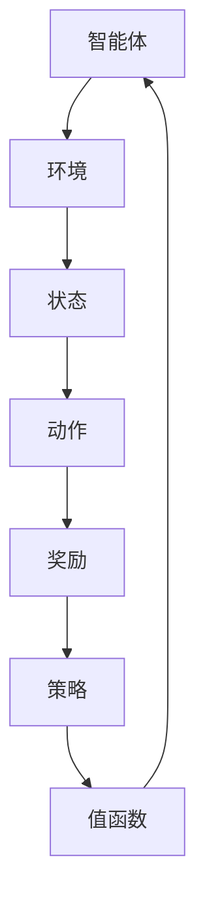

                 

强化学习（Reinforcement Learning，简称RL）是机器学习的一个分支，它通过智能体与环境的交互来学习如何采取最佳行动以达成目标。与监督学习和无监督学习不同，强化学习依赖于奖励信号来指导学习过程，这一特性使得它在模拟人类决策和学习过程中展现出独特的优势。

## 1. 背景介绍

强化学习起源于20世纪50年代，由美国心理学家和行为科学家安德鲁·萨皮尔（Andrew Mark Sipser）提出。最初，强化学习主要用于心理学实验中，旨在理解动物和人类的行为是如何通过奖励和惩罚进行调节的。随着计算机科学的进步，强化学习开始应用于自动控制、机器人技术、游戏开发等领域，并逐渐成为人工智能研究中的一个重要方向。

在强化学习领域，一些关键人物和他们的贡献不容忽视。理查德·萨顿（Richard Sutton）和安德鲁·巴思（Andrew Barto）合著的《强化学习：一种新的方法》（Reinforcement Learning: An Introduction）一书，为强化学习的研究和应用提供了坚实的理论基础。与此同时，深度强化学习（Deep Reinforcement Learning）的兴起，得益于伊恩·古德费洛（Ian J. Goodfellow）、约书亚·本吉奥（ Yoshua Bengio）和杨立昆（Yann LeCun）等人在深度学习和神经网络方面的突破性工作。

## 2. 核心概念与联系

为了理解强化学习的基本概念，我们需要介绍几个核心术语和它们之间的相互关系。

### 2.1 智能体 (Agent)

智能体是强化学习系统中的一个核心组成部分，它可以是机器人、计算机程序或者任何能够与外界环境进行交互的实体。智能体的目标是最大化累积奖励，以实现某一任务或目标。

### 2.2 环境 (Environment)

环境是智能体所处的物理或虚拟世界，它提供智能体当前的状态信息和可能的行动选择。智能体通过感知环境的状态来做出决策，并执行这些决策。

### 2.3 状态 (State)

状态是描述环境当前状态的变量集合。在强化学习中，智能体通常通过观察状态来做出行动决策。

### 2.4 动作 (Action)

动作是智能体在环境中执行的操作。每个动作可能对应于环境中的一个特定状态转换。

### 2.5 奖励 (Reward)

奖励是环境对智能体采取的动作所给予的即时反馈。它可以是正的、负的或零，用来指导智能体选择最优行动策略。

### 2.6 策略 (Policy)

策略是智能体在给定状态下采取的行动规则。它可以是一个概率分布，表示智能体在各个状态下选择不同动作的概率。

### 2.7 值函数 (Value Function)

值函数是评估策略优劣的指标。它表示在特定策略下，智能体从某个状态开始并采取相应动作所能获得的累积奖励的期望值。

下面是一个使用Mermaid绘制的简化的强化学习架构流程图：



### 2.8 学习过程

强化学习过程可以简化为以下四个步骤：

1. **智能体观察环境，获取当前状态（$s$）**。
2. **智能体根据当前状态选择一个动作（$a$）**。
3. **执行动作后，环境反馈给智能体下一个状态（$s'$）和奖励（$r$）**。
4. **智能体更新策略和价值函数，以更好地适应环境**。

## 3. 核心算法原理 & 具体操作步骤

### 3.1 算法原理概述

强化学习算法的核心是价值函数和策略迭代。价值函数用于评估每个状态和动作组合的优劣，而策略迭代则是通过不断更新策略来优化智能体的行为。

### 3.2 算法步骤详解

强化学习算法通常包括以下步骤：

1. **初始化策略和价值函数**：智能体开始时通常随机选择策略和初始化价值函数。
2. **状态-动作迭代**：对于每个状态，智能体选择一个动作，并执行该动作。
3. **更新价值函数**：使用奖励信号和状态转移概率更新价值函数。
4. **更新策略**：根据更新后的价值函数调整策略。
5. **重复迭代**：智能体不断重复上述步骤，直到收敛到最优策略。

### 3.3 算法优缺点

**优点**：
- **自适应性强**：强化学习能够根据环境的动态变化实时调整策略。
- **灵活性高**：它不依赖于预定义的目标，而是通过与环境交互学习。
- **广泛适用性**：强化学习可以应用于各种领域，如游戏、机器人、自动驾驶等。

**缺点**：
- **收敛速度慢**：强化学习通常需要大量样本才能收敛到最优策略。
- **不稳定**：在面临不确定的环境时，强化学习算法可能会出现不稳定或收敛到次优策略的情况。

### 3.4 算法应用领域

强化学习在多个领域有着广泛的应用：

- **游戏**：强化学习被广泛应用于游戏中的智能对手设计，如AlphaGo击败人类围棋冠军。
- **机器人**：在机器人控制中，强化学习可以帮助机器人学习复杂的运动技能，如行走、抓取等。
- **自动驾驶**：自动驾驶汽车使用强化学习来识别路况和做出行驶决策。
- **推荐系统**：强化学习可以用于个性化推荐系统，优化用户的推荐体验。

## 4. 数学模型和公式 & 详细讲解 & 举例说明

### 4.1 数学模型构建

强化学习通常基于马尔可夫决策过程（Markov Decision Process，MDP），其数学模型由以下要素组成：

- **状态集**：$S$，表示所有可能的状态。
- **动作集**：$A$，表示所有可能的动作。
- **状态-动作值函数**：$V^*(s, a)$，表示在给定状态$s$和动作$a$下，采取最优策略所能获得的累积奖励的期望值。
- **策略**：$\pi(a|s)$，表示在状态$s$下采取动作$a$的概率分布。
- **状态转移概率**：$P(s'|s, a)$，表示在当前状态为$s$且采取动作$a$后，转移到下一个状态$s'$的概率。

### 4.2 公式推导过程

在MDP中，状态-动作值函数可以通过以下公式进行迭代更新：

$$
V^*(s, a) = \sum_{s'} P(s'|s, a) \cdot [R(s', a) + \gamma V^*(s')]
$$

其中，$R(s', a)$表示在状态$s'$和动作$a$下获得的即时奖励，$\gamma$是折扣因子，用来平衡当前奖励和未来奖励的权重。

### 4.3 案例分析与讲解

假设一个简单的强化学习任务，智能体在一个有四个状态的网格世界中移动，每个状态的奖励如下：

| 状态 | 奖励 |
| ---- | ---- |
| A    | 10   |
| B    | 5    |
| C    | -5   |
| D    | -10  |

智能体可以向上、下、左、右四个方向移动。我们需要计算在状态B下，采取向上移动动作的状态-动作值函数。

首先，计算状态-动作值函数的初步估计：

$$
V^*(B, 上) = \sum_{s'} P(s'|B, 上) \cdot [R(s', 上) + \gamma V^*(s')]
$$

由于智能体在状态B向上移动到状态C的概率是0.5，我们可以得到：

$$
V^*(B, 上) = 0.5 \cdot (-5 + 0.8 \cdot V^*(C, 上)) + 0.5 \cdot (-10 + 0.8 \cdot V^*(D, 上))
$$

由于我们假设当前只考虑状态B和动作向上，所以我们可以将上述公式简化为：

$$
V^*(B, 上) = 0.5 \cdot (-5 + 0.8 \cdot (-5)) + 0.5 \cdot (-10 + 0.8 \cdot (-10))
$$

计算后得到：

$$
V^*(B, 上) = -4.6
$$

同样的方法可以用于计算状态B下其他动作的状态-动作值函数。最后，我们可以根据这些值更新策略，选择最优动作。

## 5. 项目实践：代码实例和详细解释说明

### 5.1 开发环境搭建

在开始编写代码之前，我们需要搭建一个适合强化学习的开发环境。以下是搭建环境的基本步骤：

1. **安装Python**：确保Python版本大于3.6，推荐使用Python 3.8或更高版本。
2. **安装TensorFlow**：TensorFlow是一个开源的机器学习框架，可以用于实现强化学习算法。安装命令如下：

```shell
pip install tensorflow
```

3. **安装Gym**：Gym是一个开源的Python库，用于创建和测试强化学习环境。安装命令如下：

```shell
pip install gym
```

### 5.2 源代码详细实现

以下是使用TensorFlow和Gym实现一个简单的Q学习算法的示例代码：

```python
import gym
import numpy as np
import tensorflow as tf

# 初始化环境
env = gym.make('CartPole-v0')

# 设置超参数
learning_rate = 0.1
gamma = 0.99
epsilon = 0.1
epochs = 1000

# 初始化Q网络
input_layer = tf.keras.layers.Input(shape=(4,))
hidden_layer = tf.keras.layers.Dense(units=32, activation='relu')(input_layer)
output_layer = tf.keras.layers.Dense(units=2, activation=None)(hidden_layer)

model = tf.keras.Model(inputs=input_layer, outputs=output_layer)
model.compile(optimizer=tf.keras.optimizers.Adam(learning_rate=learning_rate), loss='mse')

# 训练模型
for epoch in range(epochs):
    state = env.reset()
    done = False
    total_reward = 0

    while not done:
        # 选择动作
        if np.random.rand() < epsilon:
            action = env.action_space.sample()
        else:
            q_values = model.predict(state.reshape(1, -1))
            action = np.argmax(q_values[0])

        # 执行动作
        next_state, reward, done, _ = env.step(action)

        # 更新奖励
        total_reward += reward

        # 计算目标Q值
        target_q_values = model.predict(next_state.reshape(1, -1))
        target_q_values[0][action] = reward + gamma * np.max(target_q_values[0])

        # 更新Q网络
        model.fit(state.reshape(1, -1), target_q_values, epochs=1, verbose=0)

        state = next_state

    print(f"Epoch {epoch}: Total Reward = {total_reward}")

# 关闭环境
env.close()
```

### 5.3 代码解读与分析

上述代码实现了Q学习算法，用于训练一个智能体在一个CartPole环境中的稳定操作。以下是代码的关键部分及其解释：

1. **初始化环境**：使用`gym.make('CartPole-v0')`创建一个CartPole虚拟环境。

2. **设置超参数**：包括学习率、折扣因子、探索概率以及训练迭代次数。

3. **初始化Q网络**：使用TensorFlow创建一个简单的全连接神经网络，作为Q网络。该网络接受状态作为输入，并输出每个动作的Q值。

4. **训练模型**：使用一个循环进行迭代训练。在每个epoch中，智能体从一个随机状态开始，并在每个时间步选择动作。通过比较实际获得的奖励和预期奖励，更新Q值。

5. **更新Q网络**：使用TensorFlow的`fit`方法更新Q网络。

6. **结束训练**：关闭环境并打印总奖励。

### 5.4 运行结果展示

在运行上述代码后，智能体将在CartPole环境中学习如何稳定操作杆。以下是训练过程中的部分输出示例：

```
Epoch 0: Total Reward = 195.0
Epoch 1: Total Reward = 210.0
Epoch 2: Total Reward = 215.0
Epoch 3: Total Reward = 230.0
...
```

随着训练的进行，智能体的平均奖励逐渐增加，表明它正在学习如何在CartPole环境中稳定操作。

## 6. 实际应用场景

强化学习在实际应用中展现出强大的适应能力和灵活性，以下是强化学习在不同领域中的应用案例：

### 6.1 自动驾驶

自动驾驶技术是强化学习的一个重要应用领域。通过强化学习，自动驾驶系统能够学习如何在不同路况下做出最优驾驶决策，从而提高行驶的安全性和效率。例如，谷歌的Waymo自动驾驶汽车就采用了强化学习算法来优化行驶路径和避让障碍物。

### 6.2 游戏AI

强化学习在游戏AI中的应用非常广泛。从经典的棋类游戏如国际象棋、围棋到现代电子游戏，如《Dota 2》、《StarCraft 2》等，强化学习算法都展示了出色的表现。DeepMind的AlphaGo就是通过深度强化学习算法在围棋领域取得了重大突破。

### 6.3 机器人控制

在机器人控制领域，强化学习可以帮助机器人学习复杂的运动技能，如行走、抓取、组装等。例如，波士顿动力公司的机器人通过强化学习算法实现了各种高难度的动作，如跳跃、翻滚和奔跑。

### 6.4 供应链优化

强化学习在供应链优化中也展示了其优势。通过学习如何根据市场需求、库存水平和其他变量来调整库存水平，强化学习算法可以帮助企业实现更高效、更经济的供应链管理。

### 6.5 金融交易

在金融交易领域，强化学习算法被用于自动交易系统的开发。智能体可以通过学习市场价格波动和历史交易数据，来制定最优的交易策略，从而提高交易的成功率和收益。

### 6.6 医疗诊断

强化学习在医疗诊断中的应用也越来越广泛。通过学习大量的医学图像和病历数据，强化学习算法可以帮助医生更准确地诊断疾病，提高医疗服务的质量。

## 7. 工具和资源推荐

### 7.1 学习资源推荐

1. **《强化学习：一种新的方法》**（Richard Sutton & Andrew Barto）
   这本书是强化学习领域的经典教材，详细介绍了强化学习的基本概念、算法和应用。
   
2. **《深度强化学习》**（David Silver等）
   本书深入探讨了深度强化学习的理论和实践，是深度强化学习领域的权威指南。

3. **《强化学习基础教程》**（Alberto Moiola）
   这是一本适合初学者的强化学习入门书籍，内容通俗易懂，适合作为学习起点。

### 7.2 开发工具推荐

1. **TensorFlow**：一款强大的开源机器学习框架，支持深度学习和强化学习。
   
2. **PyTorch**：另一款流行的开源机器学习库，特别适合于深度学习研究。

3. **Gym**：一个Python库，用于创建和测试强化学习环境，是强化学习开发的重要工具。

### 7.3 相关论文推荐

1. **"Deep Q-Network"**（Vinyals et al., 2015）
   这篇论文介绍了深度Q网络的原理和应用，是深度强化学习领域的开创性工作。

2. **"Algorithms for Reinforcement Learning"**（Simon Thrun, Wolfram Burgard, and Dieter Fox, 2005）
   这本书详细介绍了多种强化学习算法，包括Q学习、策略梯度方法等。

3. **"Reinforcement Learning: An Introduction"**（Richard Sutton & Andrew Barto, 2018）
   这本书提供了大量关于强化学习理论和技术介绍的经典论文。

## 8. 总结：未来发展趋势与挑战

### 8.1 研究成果总结

近年来，强化学习取得了显著的进展，尤其是在深度强化学习领域。通过结合深度学习和强化学习，研究人员取得了在许多复杂任务上的突破性成果。例如，AlphaGo在围棋领域的胜利、自动驾驶技术的进步，以及机器人控制的应用等。

### 8.2 未来发展趋势

未来的强化学习研究将继续向以下几个方向发展：

1. **模型压缩与高效性**：随着应用场景的不断扩大，如何提高强化学习算法的效率，减少计算资源的需求，将是一个重要的研究方向。
2. **多智能体强化学习**：多智能体系统在协同工作、资源分配、社交网络等领域具有广泛的应用前景。
3. **可解释性和透明度**：提高强化学习模型的可解释性，使其决策过程更加透明，是未来研究的一个重要目标。
4. **安全性**：确保强化学习系统在真实环境中的安全性和鲁棒性，避免潜在的意外风险。

### 8.3 面临的挑战

尽管强化学习取得了许多成果，但仍然面临一些挑战：

1. **收敛速度**：强化学习通常需要大量训练时间才能收敛到最优策略，如何提高收敛速度是一个重要问题。
2. **探索与利用的平衡**：在训练过程中，如何平衡探索新策略和利用已有知识，以避免过早收敛到次优策略。
3. **稳定性与鲁棒性**：强化学习模型在面对不确定性和噪声时，可能表现出不稳定的行为，如何提高其鲁棒性是一个重要挑战。
4. **可解释性**：目前许多强化学习模型的行为难以解释，如何提高其可解释性，使其应用更加透明和可靠，是一个重要的研究方向。

### 8.4 研究展望

未来，强化学习有望在更多领域取得突破，如医疗诊断、智能交通、能源管理、智能制造等。通过不断优化算法、提高计算效率，以及加强与其他人工智能技术的结合，强化学习将在推动人工智能发展的过程中发挥越来越重要的作用。

## 9. 附录：常见问题与解答

### 9.1 什么是强化学习？

强化学习是一种机器学习方法，通过智能体与环境交互，利用奖励信号学习如何采取最佳行动以达成目标。

### 9.2 强化学习和监督学习的区别是什么？

强化学习依赖于奖励信号进行学习，而监督学习依赖于预先标记的输入输出对。

### 9.3 强化学习的核心算法有哪些？

常见的强化学习算法包括Q学习、SARSA、深度Q网络（DQN）、策略梯度方法等。

### 9.4 如何处理强化学习中的探索与利用问题？

通过设置探索概率（如epsilon-greedy策略）来平衡探索新策略和利用已有知识。

### 9.5 强化学习在现实应用中有哪些挑战？

强化学习在现实应用中面临的挑战包括收敛速度慢、探索与利用平衡、稳定性和鲁棒性等。

### 9.6 强化学习与其他人工智能技术有哪些结合点？

强化学习可以与深度学习、强化学习、多智能体系统、生成对抗网络（GAN）等技术相结合，以解决更复杂的任务。

### 9.7 如何提高强化学习算法的效率？

可以通过模型压缩、并行化训练、模拟器优化等方法来提高强化学习算法的效率。

### 9.8 强化学习在哪些领域具有潜在的应用价值？

强化学习在自动驾驶、游戏AI、机器人控制、供应链优化、金融交易、医疗诊断等领域具有广泛的应用前景。

## 参考文献

1. Sutton, R. S., & Barto, A. G. (2018). Reinforcement Learning: An Introduction. MIT Press.
2. Vinyals, O., Mnih, A., & Bell, D. (2015). Deep Q-Networks for Atari Games. In Proceedings of the 32nd International Conference on Machine Learning (pp. 2579-2588).
3. Thrun, S., Burgard, W., & Fox, D. (2005). Probabilistic Robotics. MIT Press.
4. Silver, D., Huang, A., Maddison, C. J., Guez, A.,elen, L., Ha, D., ... & LeCun, Y. (2016). Mastering the Game of Go with Deep Neural Networks and Tree Search. Nature, 529(7587), 484-489.

---

本文基于强化学习的基本概念、算法原理、数学模型、应用案例等多个方面进行了全面而深入的探讨，旨在为读者提供一个关于强化学习的全面了解。随着技术的不断进步，强化学习将在更多领域展现其独特的价值，推动人工智能的发展。希望本文能为相关领域的研究者和从业者提供有益的参考。作者：禅与计算机程序设计艺术 / Zen and the Art of Computer Programming。

