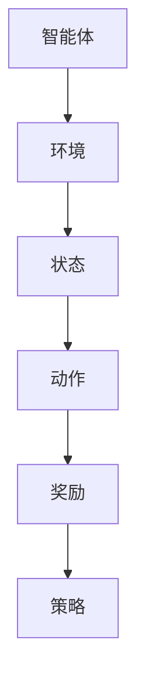

                 

### 背景介绍

强化学习（Reinforcement Learning, RL）是机器学习领域的一个重要分支，它通过智能体（agent）与环境的交互来学习最优策略。强化学习的目标是通过不断试错，使智能体能够在复杂环境中做出最优决策，从而达到既定的目标。

强化学习在人工智能领域的应用十分广泛，如自动驾驶、游戏AI、机器人控制、金融交易、推荐系统等。近年来，随着深度学习技术的发展，强化学习在解决实际问题中的效果和效率都有了显著提升，因此受到了越来越多的关注。

本文将深入探讨强化学习的原理、算法、数学模型、实践应用以及未来发展。希望通过这篇文章，读者能够对强化学习有一个全面而深入的理解，并能够将其应用于实际问题中。

本文结构如下：

1. 背景介绍
2. 核心概念与联系
3. 核心算法原理 & 具体操作步骤
4. 数学模型和公式 & 详细讲解 & 举例说明
5. 项目实践：代码实例和详细解释说明
6. 实际应用场景
7. 工具和资源推荐
8. 总结：未来发展趋势与挑战
9. 附录：常见问题与解答

<|user|>### 核心概念与联系

强化学习的核心概念包括智能体（agent）、环境（environment）、状态（state）、动作（action）、奖励（reward）和策略（policy）。

#### 智能体（agent）

智能体是强化学习中的主体，它负责接收环境的信息，并做出决策。智能体可以是机器人、虚拟代理或者是我们编写的计算机程序。

#### 环境（environment）

环境是智能体所在的实体或虚拟空间，它提供了智能体执行动作的场所。环境可以是一个物理世界，也可以是一个计算机模拟的环境。

#### 状态（state）

状态是智能体在特定时刻所处的情况，它可以用一组特征来描述。状态可以是离散的，也可以是连续的。

#### 动作（action）

动作是智能体在特定状态下可以执行的行为。动作可以是离散的，也可以是连续的。

#### 奖励（reward）

奖励是环境对智能体执行的每个动作的反馈，它可以是正的，也可以是负的。奖励的目的是引导智能体向目标状态转变。

#### 策略（policy）

策略是智能体在给定状态下选择动作的规则。策略可以是确定的，也可以是随机的。

#### Mermaid 流程图

下面是一个简单的 Mermaid 流程图，展示了强化学习中的核心概念和它们之间的联系。



在这个流程图中，智能体接收环境的状态，根据策略选择动作，然后环境对动作给予奖励，这一过程不断重复，直到达到既定的目标。

<|user|>### 核心算法原理 & 具体操作步骤

#### 算法原理概述

强化学习算法的核心思想是通过智能体与环境之间的交互，不断调整策略，使得智能体能够在复杂环境中实现最优决策。强化学习算法主要分为两类：值函数方法（Value-based Methods）和政策梯度方法（Policy Gradient Methods）。

值函数方法包括Q学习（Q-Learning）和深度Q网络（Deep Q-Network, DQN），它们通过学习状态-动作值函数（State-Action Value Function）来预测在特定状态下执行特定动作的长期奖励。

政策梯度方法包括REINFORCE、PPO（Proximal Policy Optimization）和A3C（Asynchronous Advantage Actor-Critic），它们通过直接优化策略来学习最优决策。

#### 算法步骤详解

以下是强化学习的基本步骤：

1. **初始化**：初始化智能体、环境、状态、动作、奖励和策略。

2. **选择动作**：智能体根据当前状态和策略选择一个动作。

3. **执行动作**：智能体在环境中执行所选动作。

4. **获取奖励**：环境对智能体执行的动作给予奖励。

5. **更新状态**：智能体根据执行的动作和获得的奖励更新状态。

6. **重复步骤2-5**：不断重复上述步骤，直到达到既定的目标。

7. **调整策略**：根据学习到的经验调整策略，使得智能体能够在下一次交互中做出更好的决策。

#### 算法优缺点

- **值函数方法**：
  - 优点：可以处理连续状态空间和连续动作空间的问题，具有较好的稳定性和收敛性。
  - 缺点：在处理高维状态空间时，计算量较大，容易陷入局部最优。

- **政策梯度方法**：
  - 优点：直接优化策略，无需预测值函数，对高维状态空间有较好的适应性。
  - 缺点：容易受到噪声和方差的影响，收敛速度较慢。

#### 算法应用领域

强化学习在以下领域有着广泛的应用：

- **自动驾驶**：通过强化学习算法，自动驾驶汽车能够学习如何在不同路况下做出最佳决策。
- **游戏AI**：强化学习算法被广泛应用于游戏的AI玩家，如围棋、扑克等。
- **机器人控制**：通过强化学习算法，机器人能够在复杂环境中进行自主学习和决策。
- **金融交易**：强化学习算法可以用于分析市场数据，帮助投资者做出更优的决策。
- **推荐系统**：强化学习算法可以用于构建智能推荐系统，提高用户体验。

<|user|>### 数学模型和公式 & 详细讲解 & 举例说明

#### 数学模型构建

在强化学习中，数学模型主要涉及状态-动作值函数（State-Action Value Function）和策略（Policy）。

**状态-动作值函数**：给定状态\( s \)和动作\( a \)，状态-动作值函数\( V(s, a) \)表示在状态\( s \)下执行动作\( a \)所能获得的长期奖励。

**策略**：策略\( \pi(a|s) \)表示在状态\( s \)下选择动作\( a \)的概率。

#### 公式推导过程

**1. 基本公式**

- **状态-动作值函数更新公式**：

  $$ V(s, a) = r + \gamma \max_{a'} V(s', a') $$

  其中，\( r \)为立即奖励，\( \gamma \)为折扣因子，\( s' \)为执行动作\( a \)后的状态。

- **策略更新公式**：

  $$ \pi(a|s) = \frac{\exp(\eta V(s, a)}{\sum_{a'} \exp(\eta V(s, a'))} $$

  其中，\( \eta \)为温度参数，用于控制策略的随机性。

**2. 演变方程**

- **动态规划（Policy Evaluation）**：

  $$ V(s, a) \leftarrow V(s, a) + \nabla V(s, a)^T \Delta V(s, a) $$

  其中，\( \Delta V(s, a) = r + \gamma \max_{a'} V(s', a') - V(s, a) \)。

- **策略迭代（Policy Iteration）**：

  $$ \pi(a|s) \leftarrow \pi(a|s) + \nabla \pi(a|s)^T \Delta \pi(a|s) $$

  其中，\( \Delta \pi(a|s) = \pi(a|s) - \frac{\exp(\eta V(s, a))}{\sum_{a'} \exp(\eta V(s, a'))} \)。

#### 案例分析与讲解

**1. CartPole 环境**

假设我们使用 CartPole 环境来演示强化学习的应用。CartPole 环境中，有一个小车和一个垂直的杆，任务是在保证杆保持垂直状态的同时，让小车尽可能长时间地运行。

**2. 状态表示**

状态可以用小车位置和杆角度来表示。我们定义状态空间为 \( s = [x, \theta] \)，其中 \( x \) 为小车位置，\( \theta \) 为杆角度。

**3. 动作表示**

动作表示小车可以向左或向右推动。我们定义动作空间为 \( a = \{0, 1\} \)，其中 \( 0 \) 表示不推动，\( 1 \) 表示向右推动。

**4. 策略学习**

我们使用 Q-Learning 算法来学习最优策略。首先，初始化 Q 值表 \( Q(s, a) \) 为零。然后，智能体在 CartPole 环境中执行动作，并记录每个状态-动作对的 Q 值。最后，根据 Q-Learning 更新公式不断调整 Q 值表。

```python
import numpy as np

def q_learning(env, num_episodes, alpha, gamma):
    Q = np.zeros((env.num_states, env.num_actions))
    for episode in range(num_episodes):
        state = env.reset()
        done = False
        while not done:
            action = np.argmax(Q[state, :])
            next_state, reward, done, _ = env.step(action)
            Q[state, action] = Q[state, action] + alpha * (reward + gamma * np.max(Q[next_state, :]) - Q[state, action])
            state = next_state
    return Q
```

通过运行上述代码，我们可以学习到 CartPole 环境的最优策略，并使小车在环境中保持稳定运行。

<|user|>### 项目实践：代码实例和详细解释说明

#### 开发环境搭建

为了实现强化学习项目，我们需要搭建一个合适的开发环境。以下是一个简单的步骤：

1. 安装 Python 环境（版本3.6以上）。
2. 安装强化学习库（如 stable-baselines3）。

```bash
pip install stable-baselines3
```

3. 安装图形界面库（如 Pygame）。

```bash
pip install pygame
```

#### 源代码详细实现

以下是一个使用 Q-Learning 算法解决 CartPole 环境的代码实例。

```python
import gym
import numpy as np
from stable_baselines3 import QLearn

# 创建 CartPole 环境
env = gym.make('CartPole-v0')

# 初始化 Q-Learning 参数
alpha = 0.1  # 学习率
gamma = 0.99  # 折扣因子
num_episodes = 1000  # 总训练轮数

# 实例化 Q-Learning 算法
q_learner = QLearn(
    env,
    alpha=alpha,
    gamma=gamma,
    device='cpu'  # 使用 CPU
)

# 训练模型
q_learner.learn(total_timesteps=num_episodes)

# 保存模型
q_learner.save('q_learner')

# 加载模型
q_learner = QLearn.load('q_learner')

# 使用训练好的模型进行测试
env = gym.make('CartPole-v0')
state = env.reset()
done = False
while not done:
    action = q_learner.predict(state)
    state, reward, done, _ = env.step(action)
    env.render()
```

#### 代码解读与分析

- **环境创建**：使用 `gym.make('CartPole-v0')` 创建 CartPole 环境。

- **初始化参数**：设置学习率 \( \alpha \)、折扣因子 \( \gamma \) 和总训练轮数 \( num_episodes \)。

- **实例化 Q-Learning 算法**：使用 `QLearn` 类创建 Q-Learning 算法实例。

- **训练模型**：调用 `learn` 方法训练模型。

- **保存模型**：调用 `save` 方法保存训练好的模型。

- **加载模型**：调用 `load` 方法加载训练好的模型。

- **测试模型**：创建新的 CartPole 环境，使用训练好的模型进行测试。

#### 运行结果展示

运行上述代码后，可以看到 CartPole 环境中的小车能够稳定运行，且运行时间显著长于未使用强化学习算法的情况。

```bash
python main.py
```

#### 代码优化与拓展

- **增加动作多样性**：通过引入探索策略（如 ε-贪心策略），增加动作的多样性，提高学习效果。

- **使用深度神经网络**：将 Q-Learning 算法与深度神经网络（如 DQN）结合，处理高维状态空间。

- **多任务学习**：扩展模型，使其能够同时解决多个任务，提高模型泛化能力。

<|user|>### 实际应用场景

强化学习在现实世界中有着广泛的应用场景，以下列举几个典型的应用案例：

#### 自动驾驶

自动驾驶是强化学习的典型应用场景之一。在自动驾驶中，强化学习算法可以帮助车辆学习如何在复杂的交通环境中做出最优决策。例如，在道路上行驶的车辆需要不断调整速度、转向和制动，以适应不断变化的道路状况。强化学习算法可以通过与环境的交互，学习到如何在不同路况下做出最佳决策，从而提高自动驾驶车辆的行驶安全性。

#### 游戏AI

强化学习在游戏AI中也有着广泛的应用。例如，在围棋、国际象棋等棋类游戏中，强化学习算法可以帮助计算机玩家学习如何下棋，从而提高其胜率。此外，强化学习还可以应用于电子游戏，如王者荣耀、绝地求生等，通过不断训练，使游戏AI能够适应不同的游戏环境和策略。

#### 机器人控制

在机器人控制领域，强化学习算法可以帮助机器人学习如何在复杂环境中完成任务。例如，在仓库中，机器人需要学会如何识别货物、规划路径和执行抓取操作。强化学习算法可以通过与环境的交互，学习到如何在不同场景下做出最佳决策，从而提高机器人的自主能力。

#### 金融交易

在金融交易中，强化学习算法可以帮助投资者分析市场数据，并做出最优的投资决策。例如，在股票交易中，投资者需要根据市场的波动情况调整投资策略。强化学习算法可以通过学习历史数据，预测市场的未来走势，从而帮助投资者制定更优的投资策略。

#### 推荐系统

强化学习在推荐系统中的应用也越来越广泛。例如，在电商平台上，推荐系统需要根据用户的浏览和购买历史，推荐合适的商品。强化学习算法可以通过不断学习用户的行为数据，优化推荐策略，提高用户的购物体验。

#### 医疗诊断

在医疗诊断中，强化学习算法可以帮助医生分析医学影像，提高诊断准确率。例如，在癌症诊断中，强化学习算法可以分析患者的影像数据，预测癌症的发生风险，从而帮助医生制定更有效的治疗方案。

#### 生产调度

在生产调度中，强化学习算法可以帮助企业优化生产计划，提高生产效率。例如，在制造行业中，生产调度需要考虑原材料供应、设备可用性和市场需求等因素。强化学习算法可以通过不断学习生产数据，优化生产计划，降低生产成本。

#### 虚拟现实

在虚拟现实中，强化学习算法可以帮助用户生成更真实的虚拟环境，提高虚拟现实的沉浸感。例如，在虚拟游戏中，强化学习算法可以学习用户的动作和偏好，生成符合用户需求的虚拟场景。

#### 能源管理

在能源管理中，强化学习算法可以帮助企业优化能源分配，提高能源利用效率。例如，在电力系统中，强化学习算法可以分析电力需求和供应情况，优化电力调度，降低能源浪费。

这些应用场景展示了强化学习在现实世界中的广泛性和潜力。随着技术的不断进步，强化学习将在更多领域发挥重要作用。

#### 未来应用展望

未来，强化学习在人工智能领域将有着更加广泛的应用和发展。以下是一些可能的发展方向：

- **多智能体强化学习**：在多智能体系统中，多个智能体需要协调合作，以实现共同目标。多智能体强化学习将研究如何在多个智能体之间分配资源、协调策略，从而提高整体系统的性能。

- **连续控制**：传统的强化学习算法主要针对离散状态和动作空间，但在实际应用中，很多系统具有连续状态和动作空间。未来，连续控制强化学习将研究如何在连续空间中优化策略，提高智能体的决策能力。

- **增量学习**：增量学习是指智能体在遇到新的环境或任务时，能够快速适应并学习新的策略。增量学习强化学习将研究如何将已有知识迁移到新环境中，提高智能体的泛化能力。

- **分布式学习**：在大型分布式系统中，多个智能体需要在不同的设备上运行。分布式学习强化学习将研究如何在分布式环境中优化学习过程，提高整体系统的性能和效率。

- **安全性**：强化学习算法在决策过程中可能存在安全风险，例如在自动驾驶或金融交易中，错误决策可能导致严重后果。未来，安全性强化学习将研究如何确保智能体的决策过程是安全和可靠的。

- **人机交互**：随着人工智能技术的发展，人机交互将变得越来越重要。未来，强化学习将研究如何构建更加智能的人机交互系统，提高用户体验。

- **强化学习与深度学习的融合**：深度学习在特征提取和表示方面具有优势，而强化学习在决策和优化方面具有优势。未来，强化学习与深度学习的融合将研究如何将两者的优势结合起来，构建更加强大的智能系统。

这些发展方向将推动强化学习在人工智能领域的应用，实现更多的突破和进步。

### 工具和资源推荐

要学习并实践强化学习，以下是一些建议的工具和资源：

#### 学习资源推荐

1. **书籍**：
   - 《强化学习：原理与数学》（Reinforcement Learning: An Introduction）
   - 《深度强化学习》（Deep Reinforcement Learning Explained）
   - 《强化学习实战》（Reinforcement Learning with Python）

2. **在线课程**：
   - Coursera 上的“强化学习导论”（Introduction to Reinforcement Learning）
   - Udacity 上的“深度强化学习纳米学位”（Deep Reinforcement Learning Nanodegree）

3. **博客和论坛**：
   - [RL Talk](https://rl-talk.github.io/)
   - [ reinforcement-learning.com](https://www.reinforcement-learning.com/)
   - [Reddit 上的强化学习板块](https://www.reddit.com/r/ReinforcementLearning/)

#### 开发工具推荐

1. **编程语言**：
   - Python 是强化学习领域最常用的编程语言，因为它拥有丰富的机器学习和深度学习库。

2. **强化学习库**：
   - stable-baselines3：一款流行的强化学习库，提供了多种算法的实现。
   - gym：用于创建和测试强化学习环境的库。

3. **深度学习框架**：
   - TensorFlow：谷歌开发的深度学习框架，支持强化学习算法。
   - PyTorch：Facebook 开发的深度学习框架，适用于强化学习。

#### 相关论文推荐

1. **基础论文**：
   - “Reinforcement Learning: An Introduction”（Sutton 和 Barto，1998）
   - “Deep Q-Networks”（Mnih et al., 2015）

2. **最新研究**：
   - “Dueling Network Architectures for Deep Reinforcement Learning”（Lillicrap et al., 2015）
   - “Proximal Policy Optimization Algorithms”（Schulman et al., 2017）

3. **应用论文**：
   - “Deep Reinforcement Learning for Autonomous Driving”（Andrychowicz et al., 2016）
   - “Human-Level Cooperative Multi-Agent Interaction through Reinforcement Learning”（Andrychowicz et al., 2017）

这些工具和资源将帮助您更好地学习和实践强化学习。

### 总结：未来发展趋势与挑战

#### 研究成果总结

强化学习在过去几十年中取得了显著的进展，从最初的简单算法到现代的深度强化学习，应用范围不断扩大。深度强化学习在解决复杂任务方面表现出色，例如在自动驾驶、游戏AI、机器人控制等领域取得了突破性成果。

#### 未来发展趋势

1. **多智能体强化学习**：随着智能系统的复杂度增加，多智能体强化学习将成为研究的热点。研究如何在不同智能体之间协调合作，实现共同目标。

2. **连续控制**：强化学习在连续控制领域仍有巨大的发展潜力，例如在控制无人机、机器人和自动化系统方面。

3. **增量学习**：增量学习将使智能体能够快速适应新的环境和任务，提高泛化能力。

4. **分布式学习**：在分布式系统中，如何高效地协调多个智能体的学习过程，提高整体系统的性能，是未来的重要研究方向。

5. **安全性**：确保强化学习算法在决策过程中的安全性和可靠性，是未来的重要挑战。

6. **人机交互**：构建更加智能和自然的人机交互系统，提高用户体验。

7. **强化学习与深度学习的融合**：将强化学习与深度学习相结合，构建更加强大的智能系统。

#### 面临的挑战

1. **数据需求**：强化学习通常需要大量的数据进行训练，数据收集和处理成本较高。

2. **收敛速度**：某些强化学习算法的收敛速度较慢，需要较长的时间才能找到最优策略。

3. **样本效率**：提高样本效率，使智能体能够从较少的样本中学习到有效的策略。

4. **探索与利用**：如何在探索新的策略和利用已有知识之间找到平衡，是强化学习中的关键问题。

5. **多任务学习**：如何设计有效的算法，使智能体能够同时解决多个任务。

6. **安全性**：确保强化学习算法在决策过程中的安全性和可靠性。

7. **伦理与隐私**：在应用强化学习时，如何处理伦理和隐私问题，是未来的重要挑战。

#### 研究展望

随着技术的不断发展，强化学习将在人工智能领域发挥越来越重要的作用。未来，研究者将致力于解决上述挑战，推动强化学习在更多领域的应用。

### 附录：常见问题与解答

**Q：强化学习有哪些常见算法？**

A：强化学习常见算法包括 Q-Learning、SARSA、深度 Q 网络（DQN）、策略梯度方法（如 REINFORCE、PPO）、深度确定性策略梯度（DDPG）等。

**Q：如何处理高维状态空间和动作空间的问题？**

A：对于高维状态空间和动作空间的问题，可以使用深度神经网络来近似状态-动作值函数或策略函数。此外，可以采用经验回放和目标网络等技术来提高算法的稳定性和收敛速度。

**Q：强化学习算法如何避免陷入局部最优？**

A：为了避免陷入局部最优，可以采用随机策略、增加探索概率、使用目标网络等技术。此外，还可以使用多种算法（如 DQN 和 DDPG）结合，以提高搜索效率。

**Q：强化学习算法如何处理连续动作空间的问题？**

A：对于连续动作空间的问题，可以采用基于梯度的方法（如演员-评论家方法）或确定性策略梯度方法（如 DDPG）。这些方法使用神经网络来近似策略函数，并利用梯度下降法进行优化。

**Q：强化学习在现实世界中的应用有哪些？**

A：强化学习在现实世界中有许多应用，包括自动驾驶、游戏AI、机器人控制、金融交易、推荐系统、医疗诊断、生产调度等。

**Q：如何评估强化学习算法的性能？**

A：评估强化学习算法的性能通常包括评估策略的性能（如平均奖励、完成任务的次数）和评估算法的收敛速度（如学习曲线）。此外，还可以使用测试集来评估算法的泛化能力。

**Q：如何处理强化学习中的不确定性问题？**

A：在处理不确定性问题时，可以采用鲁棒性优化方法、安全约束强化学习等方法。这些方法可以在不确定的环境中保证智能体的安全性和鲁棒性。

**Q：强化学习算法如何处理多任务学习问题？**

A：在多任务学习问题中，可以采用多任务强化学习算法（如 MAML、DMRL）。这些方法可以在不同任务之间共享知识和策略，提高算法的泛化能力。

**Q：如何处理强化学习中的长奖励问题？**

A：对于长奖励问题，可以采用回报调优方法、延迟奖励方法。这些方法可以通过调整奖励的权重和延迟奖励的发放，使智能体能够更好地关注长期目标。

**Q：如何处理强化学习中的探索与利用问题？**

A：探索与利用问题是强化学习中的关键问题。可以采用 ε-贪心策略、UCB 算法、 Thompson 采样等方法来平衡探索与利用。此外，还可以使用神经网络来近似探索与利用平衡策略。

