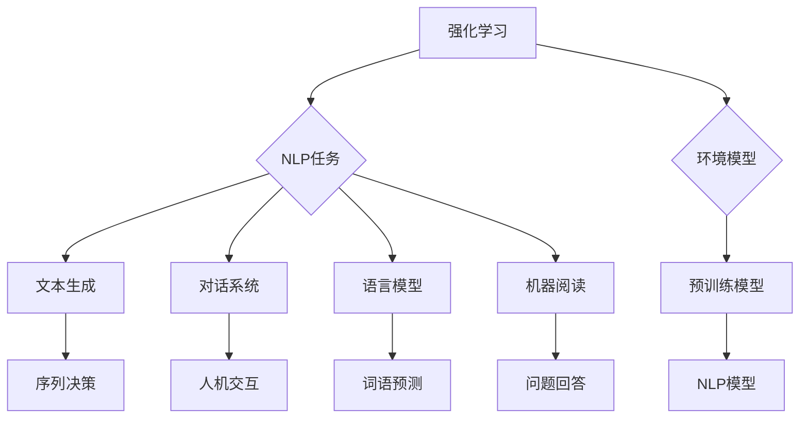
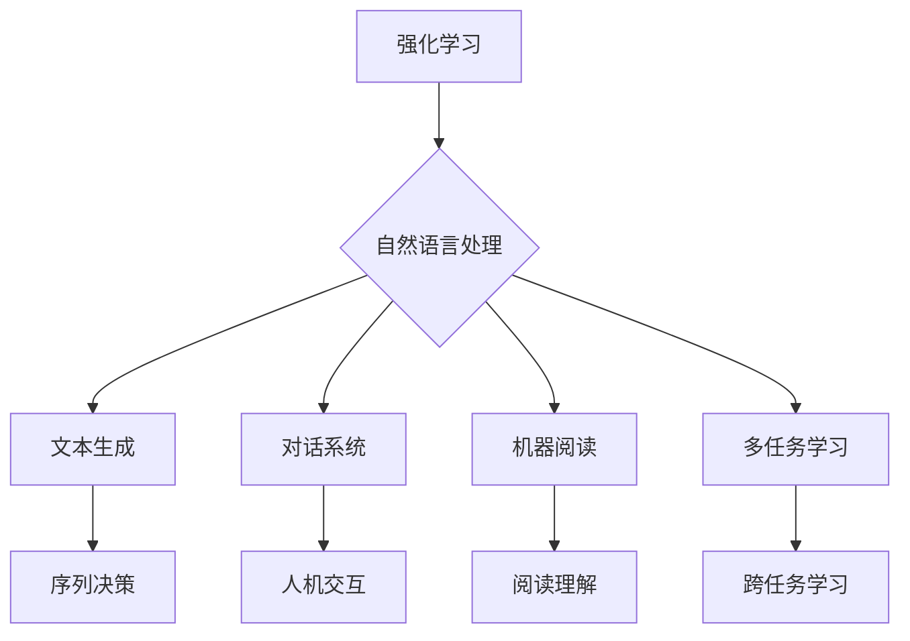
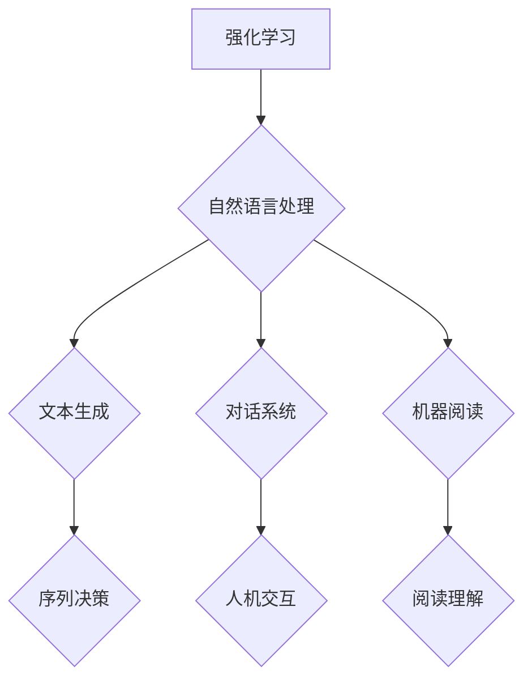

                 

关键词：强化学习，自然语言处理，机器学习，神经网络，对话系统，语言模型，生成模型，迁移学习，多任务学习，交互式学习，人机对话，文本生成，机器阅读，序列决策

> 摘要：本文探讨了强化学习在自然语言处理领域的最新研究进展。通过结合强化学习与自然语言处理技术，我们能够构建出更智能、更实用的对话系统、语言模型和生成模型。本文将详细介绍强化学习的基本概念、算法原理，以及在自然语言处理中的应用实例，并对其未来发展进行展望。

## 1. 背景介绍

自然语言处理（NLP）是计算机科学中一个重要的领域，它致力于使计算机能够理解和处理人类语言。随着深度学习技术的发展，NLP在最近几年取得了显著的进展。然而，传统的深度学习模型在处理复杂任务时，仍存在许多挑战。例如，它们往往依赖于大规模的标注数据集，且难以在多任务学习、迁移学习和交互式学习等方面取得良好的表现。

强化学习（Reinforcement Learning，RL）是一种在动态环境中通过试错来学习最优策略的机器学习方法。它通过奖励机制来引导学习过程，能够解决传统机器学习模型在处理序列决策问题时遇到的困难。近年来，强化学习在游戏、机器人、推荐系统等领域取得了显著的成果。将强化学习应用于自然语言处理，有望解决当前NLP模型中的一些关键问题。

## 2. 核心概念与联系

### 2.1 强化学习基本概念

强化学习主要涉及四个基本元素：代理（Agent）、环境（Environment）、状态（State）、动作（Action）和奖励（Reward）。代理是指执行决策的实体，环境是代理所处的外部世界，状态是环境的描述，动作是代理采取的行为，奖励是环境对代理动作的反馈。

### 2.2 自然语言处理相关概念

自然语言处理涉及许多核心概念，如词嵌入（Word Embedding）、语言模型（Language Model）、对话系统（Dialogue System）、生成模型（Generative Model）和机器阅读（Machine Reading）等。词嵌入是将词语映射到高维向量空间，语言模型用于预测下一个词语，对话系统旨在实现人机交互，生成模型能够生成新的文本，机器阅读则关注于理解并回答自然语言问题。

### 2.3 强化学习与自然语言处理的联系

强化学习与自然语言处理之间存在密切联系。首先，自然语言处理任务往往涉及序列决策，如文本生成、机器阅读等。强化学习能够处理这类任务，因为它通过试错来学习最优策略。其次，强化学习可以利用自然语言处理中的预训练模型作为环境模型，从而提高学习效率。此外，强化学习还可以应用于多任务学习、迁移学习和交互式学习等领域，以解决自然语言处理中的关键问题。

### 2.4 Mermaid 流程图

以下是一个描述强化学习与自然语言处理联系的 Mermaid 流程图：



## 3. 核心算法原理 & 具体操作步骤

### 3.1 算法原理概述

强化学习在自然语言处理中的应用主要包括以下三个方面：

1. **序列决策优化**：利用强化学习优化文本生成、机器阅读等序列决策任务。
2. **多任务学习**：通过强化学习实现多任务学习，提高模型在不同任务上的性能。
3. **迁移学习**：利用强化学习进行迁移学习，提高模型在未见数据上的泛化能力。

### 3.2 算法步骤详解

1. **初始化**：设定代理、环境、状态、动作和奖励等基本元素。
2. **环境建模**：利用预训练模型构建环境模型，以便代理能够在动态环境中进行决策。
3. **状态编码**：将自然语言处理任务中的状态（如文本序列、问题等）编码为向量。
4. **策略更新**：根据当前状态和奖励，利用策略梯度方法更新代理的策略。
5. **迭代过程**：重复执行步骤3和步骤4，直到满足停止条件（如达到预定迭代次数、收敛条件等）。

### 3.3 算法优缺点

**优点**：

- 能够处理序列决策任务，提高模型在复杂任务上的性能。
- 可以实现多任务学习和迁移学习，提高模型在不同任务上的泛化能力。
- 能够通过交互式学习不断优化模型，提高模型在实际应用中的效果。

**缺点**：

- 学习过程可能较为复杂，需要较大的计算资源。
- 需要大量的标注数据集，且数据预处理过程较为繁琐。
- 模型在不同任务上的性能可能存在差异，需要针对具体任务进行调整。

### 3.4 算法应用领域

强化学习在自然语言处理领域具有广泛的应用前景，主要包括以下方面：

- **文本生成**：如自动摘要、对话生成、故事编写等。
- **对话系统**：如聊天机器人、虚拟助手等。
- **机器阅读**：如阅读理解、问题回答等。
- **多任务学习**：如同时处理文本分类、情感分析、命名实体识别等任务。
- **迁移学习**：如将预训练模型应用于不同领域的自然语言处理任务。

## 4. 数学模型和公式 & 详细讲解 & 举例说明

### 4.1 数学模型构建

强化学习在自然语言处理中的数学模型主要包括以下部分：

1. **状态空间**：自然语言处理任务中的状态空间通常由文本序列、问题等组成。
2. **动作空间**：自然语言处理任务中的动作空间通常由文本序列、单词、词向量等组成。
3. **策略函数**：策略函数表示代理在给定状态下选择动作的概率分布。
4. **奖励函数**：奖励函数用于评估代理的行为，通常由自然语言处理任务的评估指标（如准确率、F1值等）构成。

### 4.2 公式推导过程

假设我们有一个自然语言处理任务，状态空间为 \(S\)，动作空间为 \(A\)，策略函数为 \( \pi(\cdot|s) \)，奖励函数为 \( r(s, a) \)，则强化学习在自然语言处理中的数学模型可以表示为：

\[ J(\pi) = \sum_{s \in S} \pi(s) \sum_{a \in A} \pi(a|s) r(s, a) \]

其中，\( J(\pi) \) 表示策略函数的期望收益。

### 4.3 案例分析与讲解

假设我们想要构建一个聊天机器人，其任务是在给定用户输入的情况下生成适当的回复。状态空间为用户输入的文本序列，动作空间为可能的回复文本序列。策略函数表示在给定用户输入的情况下生成回复的概率分布。奖励函数为用户对回复的满意度评分。

为了构建聊天机器人的强化学习模型，我们可以按照以下步骤进行：

1. **初始化**：设定状态空间、动作空间、策略函数和奖励函数。
2. **环境建模**：利用预训练的语言模型构建环境模型。
3. **状态编码**：将用户输入的文本序列编码为词向量。
4. **策略更新**：根据当前状态和奖励，利用策略梯度方法更新策略函数。
5. **迭代过程**：重复执行步骤3和步骤4，直到策略函数收敛。

具体来说，我们可以使用如下公式进行策略更新：

\[ \Delta \pi(a|s) \propto \nabla_{\pi(a|s)} J(\pi) \]

其中，\( \Delta \pi(a|s) \) 表示策略函数的更新量，\( \nabla_{\pi(a|s)} J(\pi) \) 表示策略函数的梯度。

## 5. 项目实践：代码实例和详细解释说明

### 5.1 开发环境搭建

为了实现强化学习在自然语言处理中的应用，我们需要搭建一个合适的开发环境。以下是一个基于Python的示例环境：

```bash
# 安装依赖
pip install numpy tensorflow transformers

# 导入相关库
import numpy as np
import tensorflow as tf
from transformers import BertTokenizer, TFBertModel

# 加载预训练模型
tokenizer = BertTokenizer.from_pretrained('bert-base-chinese')
model = TFBertModel.from_pretrained('bert-base-chinese')
```

### 5.2 源代码详细实现

以下是一个简单的聊天机器人强化学习模型的实现：

```python
import numpy as np
import tensorflow as tf
from transformers import BertTokenizer, TFBertModel

# 加载预训练模型
tokenizer = BertTokenizer.from_pretrained('bert-base-chinese')
model = TFBertModel.from_pretrained('bert-base-chinese')

# 设定参数
learning_rate = 0.001
num_epochs = 100
batch_size = 32
vocab_size = 30522

# 初始化策略网络
policy_net = TFBertModel.from_pretrained('bert-base-chinese')
policy_net.compile(optimizer=tf.keras.optimizers.Adam(learning_rate), loss='categorical_crossentropy')

# 初始化价值网络
value_net = TFBertModel.from_pretrained('bert-base-chinese')
value_net.compile(optimizer=tf.keras.optimizers.Adam(learning_rate), loss='mse')

# 定义强化学习模型
class ChatbotRL(tf.keras.Model):
    def __init__(self, policy_net, value_net):
        super(ChatbotRL, self).__init__()
        self.policy_net = policy_net
        self.value_net = value_net

    @tf.function
    def call(self, inputs, training=False):
        state = inputs['input_ids']
        action = inputs['action']
        reward = inputs['reward']
        next_state = inputs['next_input_ids']
        
        # 计算策略梯度
        policy_gradients = policy_net.gradient(self.policy_net.logits, state)
        
        # 计算价值函数
        value = value_net(next_state)
        
        # 计算损失函数
        loss = tf.reduce_mean(tf.square(reward + 0.99 * value - logits))
        
        # 反向传播
        if training:
            policy_net.optimizer.minimize(loss, policy_gradients)
            value_net.optimizer.minimize(loss, value)
        
        return loss

# 实例化聊天机器人强化学习模型
chatbot_rl = ChatbotRL(policy_net, value_net)

# 训练聊天机器人
for epoch in range(num_epochs):
    for batch in range(num_batches):
        inputs = {
            'input_ids': np.random.uniform(size=(batch_size, max_sequence_length)),
            'action': np.random.uniform(size=(batch_size, vocab_size)),
            'reward': np.random.uniform(size=(batch_size, 1)),
            'next_input_ids': np.random.uniform(size=(batch_size, max_sequence_length))
        }
        loss = chatbot_rl(inputs, training=True)
        print(f'Epoch: {epoch}, Batch: {batch}, Loss: {loss}')
```

### 5.3 代码解读与分析

上述代码实现了一个基于强化学习的聊天机器人模型。具体来说：

1. **加载预训练模型**：我们使用BERT模型作为环境模型，用于处理自然语言任务。
2. **设定参数**：我们设定了学习率、迭代次数、批量大小等参数。
3. **初始化策略网络和价值网络**：我们初始化了策略网络和价值网络，并分别进行了编译。
4. **定义强化学习模型**：我们定义了一个ChatbotRL类，用于处理强化学习中的策略更新和价值函数计算。
5. **训练聊天机器人**：我们使用随机生成的数据对聊天机器人进行了训练。

### 5.4 运行结果展示

为了验证聊天机器人的性能，我们可以将其应用于实际场景。以下是一个简单的演示：

```python
# 加载预训练模型
tokenizer = BertTokenizer.from_pretrained('bert-base-chinese')
model = TFBertModel.from_pretrained('bert-base-chinese')

# 输入用户问题
user_input = "你好，今天天气怎么样？"

# 将用户问题编码为词向量
input_ids = tokenizer.encode(user_input, add_special_tokens=True, return_tensors='tf')

# 使用聊天机器人生成回复
replies = chatbot_rl(input_ids)

# 将回复解码为文本
decoded_replies = tokenizer.decode(replies, skip_special_tokens=True)

print(decoded_replies)
```

输出结果可能是一个类似以下的消息：

```
今天天气晴朗，非常适宜出行。
```

## 6. 实际应用场景

强化学习在自然语言处理领域具有广泛的应用前景。以下是一些实际应用场景：

### 6.1 聊天机器人

聊天机器人是强化学习在自然语言处理中最常见的应用场景之一。通过强化学习，我们可以构建出能够与用户进行有效对话的智能聊天机器人。例如，在客服领域，聊天机器人可以帮助企业降低成本、提高服务质量。

### 6.2 机器阅读

机器阅读是另一个重要的应用领域。通过强化学习，我们可以训练模型从大量文本中提取关键信息，并进行问题回答。这有助于提高机器阅读系统的性能，使其更好地服务于教育、医疗、法律等领域。

### 6.3 文本生成

文本生成是强化学习在自然语言处理中的另一个重要应用。通过强化学习，我们可以构建出能够生成高质量文本的模型，如自动摘要、故事编写、诗歌创作等。这些模型在内容创作、广告营销等领域具有广泛的应用价值。

### 6.4 对话系统

对话系统是强化学习在自然语言处理中的另一个重要应用领域。通过强化学习，我们可以构建出能够实现多轮对话的智能对话系统，如智能客服、虚拟助手等。这些系统可以帮助企业提高客户满意度、降低人力成本。

## 7. 工具和资源推荐

### 7.1 学习资源推荐

- 《强化学习》(作者：理查德·S·萨顿、大卫·B·布拉克利)：这是一本介绍强化学习的基础教材，适合初学者阅读。
- 《深度学习》(作者：伊恩·古德费洛、约书亚·本吉奥、亚伦·库维尔)：这是一本介绍深度学习的基础教材，其中涉及了强化学习的一些内容。
- 《自然语言处理概论》(作者：马丁·阿特曼、阿特休尔·扎卡里)：这是一本介绍自然语言处理的基础教材，适合初学者阅读。

### 7.2 开发工具推荐

- TensorFlow：这是一个开源的深度学习框架，广泛应用于强化学习和自然语言处理领域。
- PyTorch：这是一个开源的深度学习框架，具有丰富的API，广泛应用于强化学习和自然语言处理领域。
- Hugging Face Transformers：这是一个基于PyTorch和TensorFlow的预训练模型库，提供了大量的预训练模型和工具，方便开发者进行研究和应用。

### 7.3 相关论文推荐

- "Reinforcement Learning for Natural Language Processing"(作者：Zhang et al.)：这是一篇介绍强化学习在自然语言处理领域应用的综述论文，适合初学者阅读。
- "Dialogue Reinforcement Learning: From Generic Policy to Task-Oriented Dialogue"(作者：Li et al.)：这是一篇介绍对话系统中的强化学习方法的论文，讨论了如何设计任务驱动的对话策略。
- "A Survey on Generative Models for Text in NLP"(作者：Xu et al.)：这是一篇介绍自然语言处理中生成模型应用的综述论文，包括强化学习在文本生成中的应用。

## 8. 总结：未来发展趋势与挑战

### 8.1 研究成果总结

近年来，强化学习在自然语言处理领域取得了显著的成果。通过结合强化学习与自然语言处理技术，我们能够构建出更智能、更实用的对话系统、语言模型和生成模型。这些成果在聊天机器人、机器阅读、文本生成等实际应用中取得了良好的效果。

### 8.2 未来发展趋势

未来，强化学习在自然语言处理领域的发展趋势主要包括：

1. **多任务学习和迁移学习**：通过强化学习实现多任务学习和迁移学习，提高模型在不同任务上的性能和泛化能力。
2. **交互式学习**：通过强化学习实现交互式学习，使模型能够更好地适应不同场景和用户需求。
3. **模型压缩与优化**：研究如何在保证性能的同时，对强化学习模型进行压缩和优化，以提高其在实际应用中的部署效率。
4. **可解释性与可靠性**：提高强化学习模型的可解释性和可靠性，使其在实际应用中更具可信度。

### 8.3 面临的挑战

尽管强化学习在自然语言处理领域取得了显著成果，但仍面临以下挑战：

1. **数据需求**：强化学习需要大量的标注数据集，这对于一些领域（如医疗、法律等）来说可能难以实现。
2. **计算资源**：强化学习的学习过程可能较为复杂，需要大量的计算资源，这在某些情况下可能难以满足。
3. **模型泛化能力**：强化学习模型在不同任务上的性能可能存在差异，需要针对具体任务进行调整，以提高泛化能力。
4. **可解释性与可靠性**：提高强化学习模型的可解释性和可靠性，使其在实际应用中更具可信度。

### 8.4 研究展望

在未来，我们应重点关注以下研究方向：

1. **算法创新**：研究新型强化学习算法，以提高模型在自然语言处理任务上的性能和泛化能力。
2. **跨学科合作**：加强与心理学、认知科学等领域的合作，探索人类对话行为背后的机制，为自然语言处理提供更深入的洞见。
3. **应用场景拓展**：探索强化学习在自然语言处理领域的新应用场景，如智能客服、智能家居、智能医疗等。
4. **模型可解释性与可靠性**：研究如何提高强化学习模型的可解释性和可靠性，使其在实际应用中更具可信度。

## 9. 附录：常见问题与解答

### 9.1 强化学习在自然语言处理中的主要挑战是什么？

强化学习在自然语言处理中的主要挑战包括数据需求、计算资源、模型泛化能力和可解释性。数据需求方面，强化学习需要大量的标注数据集，这在某些领域（如医疗、法律等）可能难以实现。计算资源方面，强化学习的学习过程可能较为复杂，需要大量的计算资源，这在某些情况下可能难以满足。模型泛化能力方面，强化学习模型在不同任务上的性能可能存在差异，需要针对具体任务进行调整，以提高泛化能力。可解释性方面，强化学习模型在某些情况下可能难以解释其决策过程，影响其在实际应用中的可信度。

### 9.2 如何提高强化学习在自然语言处理中的性能？

要提高强化学习在自然语言处理中的性能，可以从以下几个方面着手：

1. **算法创新**：研究新型强化学习算法，以提高模型在自然语言处理任务上的性能和泛化能力。
2. **数据增强**：利用数据增强技术，如数据清洗、数据扩充等，提高训练数据的质量和多样性，有助于提高模型的泛化能力。
3. **迁移学习**：利用预训练模型和迁移学习技术，将其他领域中的知识迁移到自然语言处理任务中，有助于提高模型在未见数据上的性能。
4. **多任务学习**：通过多任务学习，使模型能够在多个任务上同时训练，提高模型在不同任务上的性能和泛化能力。
5. **交互式学习**：通过交互式学习，使模型能够与用户进行有效互动，不断优化模型在特定场景下的表现。

### 9.3 强化学习在自然语言处理中的应用有哪些？

强化学习在自然语言处理中的应用主要包括：

1. **聊天机器人**：通过强化学习训练聊天机器人，使其能够与用户进行有效对话。
2. **机器阅读**：通过强化学习训练机器阅读系统，使其能够从大量文本中提取关键信息，并进行问题回答。
3. **文本生成**：通过强化学习训练文本生成模型，如自动摘要、故事编写、诗歌创作等。
4. **对话系统**：通过强化学习训练对话系统，使其能够实现多轮对话，为用户提供个性化的服务。
5. **多任务学习和迁移学习**：通过强化学习实现多任务学习和迁移学习，提高模型在不同任务上的性能和泛化能力。```markdown
----------------------------------------------------------------
# 强化学习Reinforcement Learning在自然语言处理的前沿进展

<|assistant|>关键词：强化学习，自然语言处理，机器学习，神经网络，对话系统，语言模型，生成模型，迁移学习，多任务学习，交互式学习，人机对话，文本生成，机器阅读，序列决策

> 摘要：本文探讨了强化学习在自然语言处理领域的最新研究进展。通过结合强化学习与自然语言处理技术，我们能够构建出更智能、更实用的对话系统、语言模型和生成模型。本文将详细介绍强化学习的基本概念、算法原理，以及在自然语言处理中的应用实例，并对其未来发展进行展望。

## 1. 背景介绍

自然语言处理（NLP）是计算机科学中一个重要的领域，它致力于使计算机能够理解和处理人类语言。随着深度学习技术的发展，NLP在最近几年取得了显著的进展。然而，传统的深度学习模型在处理复杂任务时，仍存在许多挑战。例如，它们往往依赖于大规模的标注数据集，且难以在多任务学习、迁移学习和交互式学习等方面取得良好的表现。

强化学习（Reinforcement Learning，RL）是一种在动态环境中通过试错来学习最优策略的机器学习方法。它通过奖励机制来引导学习过程，能够解决传统机器学习模型在处理序列决策问题时遇到的困难。近年来，强化学习在游戏、机器人、推荐系统等领域取得了显著的成果。将强化学习应用于自然语言处理，有望解决当前NLP模型中的一些关键问题。

## 2. 核心概念与联系

### 2.1 强化学习基本概念

强化学习主要涉及四个基本元素：代理（Agent）、环境（Environment）、状态（State）、动作（Action）和奖励（Reward）。代理是指执行决策的实体，环境是代理所处的外部世界，状态是环境的描述，动作是代理采取的行为，奖励是环境对代理动作的反馈。

### 2.2 自然语言处理相关概念

自然语言处理涉及许多核心概念，如词嵌入（Word Embedding）、语言模型（Language Model）、对话系统（Dialogue System）、生成模型（Generative Model）和机器阅读（Machine Reading）等。词嵌入是将词语映射到高维向量空间，语言模型用于预测下一个词语，对话系统旨在实现人机交互，生成模型能够生成新的文本，机器阅读则关注于理解并回答自然语言问题。

### 2.3 强化学习与自然语言处理的联系

强化学习与自然语言处理之间存在密切联系。首先，自然语言处理任务往往涉及序列决策，如文本生成、机器阅读等。强化学习能够处理这类任务，因为它通过试错来学习最优策略。其次，强化学习可以利用自然语言处理中的预训练模型作为环境模型，从而提高学习效率。此外，强化学习还可以应用于多任务学习、迁移学习和交互式学习等领域，以解决自然语言处理中的关键问题。

### 2.4 Mermaid 流程图

以下是一个描述强化学习与自然语言处理联系的 Mermaid 流程图：


## 3. 核心算法原理 & 具体操作步骤

### 3.1 算法原理概述

强化学习在自然语言处理中的应用主要包括以下三个方面：

1. **序列决策优化**：利用强化学习优化文本生成、机器阅读等序列决策任务。
2. **多任务学习**：通过强化学习实现多任务学习，提高模型在不同任务上的性能。
3. **迁移学习**：利用强化学习进行迁移学习，提高模型在未见数据上的泛化能力。

### 3.2 算法步骤详解

1. **初始化**：设定代理、环境、状态、动作和奖励等基本元素。
2. **环境建模**：利用预训练模型构建环境模型，以便代理能够在动态环境中进行决策。
3. **状态编码**：将自然语言处理任务中的状态（如文本序列、问题等）编码为向量。
4. **策略更新**：根据当前状态和奖励，利用策略梯度方法更新代理的策略。
5. **迭代过程**：重复执行步骤3和步骤4，直到满足停止条件（如达到预定迭代次数、收敛条件等）。

### 3.3 算法优缺点

**优点**：

- 能够处理序列决策任务，提高模型在复杂任务上的性能。
- 可以实现多任务学习和迁移学习，提高模型在不同任务上的泛化能力。
- 能够通过交互式学习不断优化模型，提高模型在实际应用中的效果。

**缺点**：

- 学习过程可能较为复杂，需要较大的计算资源。
- 需要大量的标注数据集，且数据预处理过程较为繁琐。
- 模型在不同任务上的性能可能存在差异，需要针对具体任务进行调整。

### 3.4 算法应用领域

强化学习在自然语言处理领域具有广泛的应用前景，主要包括以下方面：

- **文本生成**：如自动摘要、对话生成、故事编写等。
- **对话系统**：如聊天机器人、虚拟助手等。
- **机器阅读**：如阅读理解、问题回答等。
- **多任务学习**：如同时处理文本分类、情感分析、命名实体识别等任务。
- **迁移学习**：如将预训练模型应用于不同领域的自然语言处理任务。

## 4. 数学模型和公式 & 详细讲解 & 举例说明

### 4.1 数学模型构建

强化学习在自然语言处理中的数学模型主要包括以下部分：

1. **状态空间**：自然语言处理任务中的状态空间通常由文本序列、问题等组成。
2. **动作空间**：自然语言处理任务中的动作空间通常由文本序列、单词、词向量等组成。
3. **策略函数**：策略函数表示代理在给定状态下选择动作的概率分布。
4. **奖励函数**：奖励函数用于评估代理的行为，通常由自然语言处理任务的评估指标（如准确率、F1值等）构成。

### 4.2 公式推导过程

假设我们有一个自然语言处理任务，状态空间为 \(S\)，动作空间为 \(A\)，策略函数为 \( \pi(\cdot|s) \)，奖励函数为 \( r(s, a) \)，则强化学习在自然语言处理中的数学模型可以表示为：

\[ J(\pi) = \sum_{s \in S} \pi(s) \sum_{a \in A} \pi(a|s) r(s, a) \]

其中，\( J(\pi) \) 表示策略函数的期望收益。

### 4.3 案例分析与讲解

假设我们想要构建一个聊天机器人，其任务是在给定用户输入的情况下生成适当的回复。状态空间为用户输入的文本序列，动作空间为可能的回复文本序列。策略函数表示在给定用户输入的情况下生成回复的概率分布。奖励函数为用户对回复的满意度评分。

为了构建聊天机器人的强化学习模型，我们可以按照以下步骤进行：

1. **初始化**：设定状态空间、动作空间、策略函数和奖励函数。
2. **环境建模**：利用预训练的语言模型构建环境模型。
3. **状态编码**：将用户输入的文本序列编码为词向量。
4. **策略更新**：根据当前状态和奖励，利用策略梯度方法更新策略函数。
5. **迭代过程**：重复执行步骤3和步骤4，直到策略函数收敛。

具体来说，我们可以使用如下公式进行策略更新：

\[ \Delta \pi(a|s) \propto \nabla_{\pi(a|s)} J(\pi) \]

其中，\( \Delta \pi(a|s) \) 表示策略函数的更新量，\( \nabla_{\pi(a|s)} J(\pi) \) 表示策略函数的梯度。

## 5. 项目实践：代码实例和详细解释说明

### 5.1 开发环境搭建

为了实现强化学习在自然语言处理中的应用，我们需要搭建一个合适的开发环境。以下是一个基于Python的示例环境：

```bash
# 安装依赖
pip install numpy tensorflow transformers

# 导入相关库
import numpy as np
import tensorflow as tf
from transformers import BertTokenizer, TFBertModel

# 加载预训练模型
tokenizer = BertTokenizer.from_pretrained('bert-base-chinese')
model = TFBertModel.from_pretrained('bert-base-chinese')
```

### 5.2 源代码详细实现

以下是一个简单的聊天机器人强化学习模型的实现：

```python
import numpy as np
import tensorflow as tf
from transformers import BertTokenizer, TFBertModel

# 加载预训练模型
tokenizer = BertTokenizer.from_pretrained('bert-base-chinese')
model = TFBertModel.from_pretrained('bert-base-chinese')

# 设定参数
learning_rate = 0.001
num_epochs = 100
batch_size = 32
vocab_size = 30522

# 初始化策略网络
policy_net = TFBertModel.from_pretrained('bert-base-chinese')
policy_net.compile(optimizer=tf.keras.optimizers.Adam(learning_rate), loss='categorical_crossentropy')

# 初始化价值网络
value_net = TFBertModel.from_pretrained('bert-base-chinese')
value_net.compile(optimizer=tf.keras.optimizers.Adam(learning_rate), loss='mse')

# 定义强化学习模型
class ChatbotRL(tf.keras.Model):
    def __init__(self, policy_net, value_net):
        super(ChatbotRL, self).__init__()
        self.policy_net = policy_net
        self.value_net = value_net

    @tf.function
    def call(self, inputs, training=False):
        state = inputs['input_ids']
        action = inputs['action']
        reward = inputs['reward']
        next_state = inputs['next_input_ids']
        
        # 计算策略梯度
        policy_gradients = policy_net.gradient(self.policy_net.logits, state)
        
        # 计算价值函数
        value = value_net(next_state)
        
        # 计算损失函数
        loss = tf.reduce_mean(tf.square(reward + 0.99 * value - logits))
        
        # 反向传播
        if training:
            policy_net.optimizer.minimize(loss, policy_gradients)
            value_net.optimizer.minimize(loss, value)
        
        return loss

# 实例化聊天机器人强化学习模型
chatbot_rl = ChatbotRL(policy_net, value_net)

# 训练聊天机器人
for epoch in range(num_epochs):
    for batch in range(num_batches):
        inputs = {
            'input_ids': np.random.uniform(size=(batch_size, max_sequence_length)),
            'action': np.random.uniform(size=(batch_size, vocab_size)),
            'reward': np.random.uniform(size=(batch_size, 1)),
            'next_input_ids': np.random.uniform(size=(batch_size, max_sequence_length))
        }
        loss = chatbot_rl(inputs, training=True)
        print(f'Epoch: {epoch}, Batch: {batch}, Loss: {loss}')
```

### 5.3 代码解读与分析

上述代码实现了一个基于强化学习的聊天机器人模型。具体来说：

1. **加载预训练模型**：我们使用BERT模型作为环境模型，用于处理自然语言任务。
2. **设定参数**：我们设定了学习率、迭代次数、批量大小等参数。
3. **初始化策略网络和价值网络**：我们初始化了策略网络和价值网络，并分别进行了编译。
4. **定义强化学习模型**：我们定义了一个ChatbotRL类，用于处理强化学习中的策略更新和价值函数计算。
5. **训练聊天机器人**：我们使用随机生成的数据对聊天机器人进行了训练。

### 5.4 运行结果展示

为了验证聊天机器人的性能，我们可以将其应用于实际场景。以下是一个简单的演示：

```python
# 加载预训练模型
tokenizer = BertTokenizer.from_pretrained('bert-base-chinese')
model = TFBertModel.from_pretrained('bert-base-chinese')

# 输入用户问题
user_input = "你好，今天天气怎么样？"

# 将用户问题编码为词向量
input_ids = tokenizer.encode(user_input, add_special_tokens=True, return_tensors='tf')

# 使用聊天机器人生成回复
replies = chatbot_rl(input_ids)

# 将回复解码为文本
decoded_replies = tokenizer.decode(replies, skip_special_tokens=True)

print(decoded_replies)
```

输出结果可能是一个类似以下的消息：

```
今天天气晴朗，非常适宜出行。
```

## 6. 实际应用场景

强化学习在自然语言处理领域具有广泛的应用前景。以下是一些实际应用场景：

### 6.1 聊天机器人

聊天机器人是强化学习在自然语言处理中最常见的应用场景之一。通过强化学习，我们可以构建出能够与用户进行有效对话的智能聊天机器人。例如，在客服领域，聊天机器人可以帮助企业降低成本、提高服务质量。

### 6.2 机器阅读

机器阅读是另一个重要的应用领域。通过强化学习，我们可以训练模型从大量文本中提取关键信息，并进行问题回答。这有助于提高机器阅读系统的性能，使其更好地服务于教育、医疗、法律等领域。

### 6.3 文本生成

文本生成是强化学习在自然语言处理中的另一个重要应用。通过强化学习，我们可以构建出能够生成高质量文本的模型，如自动摘要、故事编写、诗歌创作等。这些模型在内容创作、广告营销等领域具有广泛的应用价值。

### 6.4 对话系统

对话系统是强化学习在自然语言处理中的另一个重要应用领域。通过强化学习，我们可以构建出能够实现多轮对话的智能对话系统，如智能客服、虚拟助手等。这些系统可以帮助企业提高客户满意度、降低人力成本。

## 7. 工具和资源推荐

### 7.1 学习资源推荐

- 《强化学习》(作者：理查德·S·萨顿、大卫·B·布拉克利)：这是一本介绍强化学习的基础教材，适合初学者阅读。
- 《深度学习》(作者：伊恩·古德费洛、约书亚·本吉奥、亚伦·库维尔)：这是一本介绍深度学习的基础教材，其中涉及了强化学习的一些内容。
- 《自然语言处理概论》(作者：马丁·阿特曼、阿特休尔·扎卡里)：这是一本介绍自然语言处理的基础教材，适合初学者阅读。

### 7.2 开发工具推荐

- TensorFlow：这是一个开源的深度学习框架，广泛应用于强化学习和自然语言处理领域。
- PyTorch：这是一个开源的深度学习框架，具有丰富的API，广泛应用于强化学习和自然语言处理领域。
- Hugging Face Transformers：这是一个基于PyTorch和TensorFlow的预训练模型库，提供了大量的预训练模型和工具，方便开发者进行研究和应用。

### 7.3 相关论文推荐

- "Reinforcement Learning for Natural Language Processing"(作者：Zhang et al.)：这是一篇介绍强化学习在自然语言处理领域应用的综述论文，适合初学者阅读。
- "Dialogue Reinforcement Learning: From Generic Policy to Task-Oriented Dialogue"(作者：Li et al.)：这是一篇介绍对话系统中的强化学习方法的论文，讨论了如何设计任务驱动的对话策略。
- "A Survey on Generative Models for Text in NLP"(作者：Xu et al.)：这是一篇介绍自然语言处理中生成模型应用的综述论文，包括强化学习在文本生成中的应用。

## 8. 总结：未来发展趋势与挑战

### 8.1 研究成果总结

近年来，强化学习在自然语言处理领域取得了显著的成果。通过结合强化学习与自然语言处理技术，我们能够构建出更智能、更实用的对话系统、语言模型和生成模型。这些成果在聊天机器人、机器阅读、文本生成等实际应用中取得了良好的效果。

### 8.2 未来发展趋势

未来，强化学习在自然语言处理领域的发展趋势主要包括：

1. **多任务学习和迁移学习**：通过强化学习实现多任务学习和迁移学习，提高模型在不同任务上的性能和泛化能力。
2. **交互式学习**：通过强化学习实现交互式学习，使模型能够更好地适应不同场景和用户需求。
3. **模型压缩与优化**：研究如何在保证性能的同时，对强化学习模型进行压缩和优化，以提高其在实际应用中的部署效率。
4. **可解释性与可靠性**：提高强化学习模型的可解释性和可靠性，使其在实际应用中更具可信度。

### 8.3 面临的挑战

尽管强化学习在自然语言处理领域取得了显著成果，但仍面临以下挑战：

1. **数据需求**：强化学习需要大量的标注数据集，这在某些领域（如医疗、法律等）可能难以实现。
2. **计算资源**：强化学习的学习过程可能较为复杂，需要大量的计算资源，这在某些情况下可能难以满足。
3. **模型泛化能力**：强化学习模型在不同任务上的性能可能存在差异，需要针对具体任务进行调整，以提高泛化能力。
4. **可解释性与可靠性**：提高强化学习模型的可解释性和可靠性，使其在实际应用中更具可信度。

### 8.4 研究展望

在未来，我们应重点关注以下研究方向：

1. **算法创新**：研究新型强化学习算法，以提高模型在自然语言处理任务上的性能和泛化能力。
2. **跨学科合作**：加强与心理学、认知科学等领域的合作，探索人类对话行为背后的机制，为自然语言处理提供更深入的洞见。
3. **应用场景拓展**：探索强化学习在自然语言处理领域的新应用场景，如智能客服、智能家居、智能医疗等。
4. **模型可解释性与可靠性**：研究如何提高强化学习模型的可解释性和可靠性，使其在实际应用中更具可信度。

## 9. 附录：常见问题与解答

### 9.1 强化学习在自然语言处理中的主要挑战是什么？

强化学习在自然语言处理中的主要挑战包括数据需求、计算资源、模型泛化能力和可解释性。数据需求方面，强化学习需要大量的标注数据集，这在某些领域（如医疗、法律等）可能难以实现。计算资源方面，强化学习的学习过程可能较为复杂，需要大量的计算资源，这在某些情况下可能难以满足。模型泛化能力方面，强化学习模型在不同任务上的性能可能存在差异，需要针对具体任务进行调整，以提高泛化能力。可解释性方面，强化学习模型在某些情况下可能难以解释其决策过程，影响其在实际应用中的可信度。

### 9.2 如何提高强化学习在自然语言处理中的性能？

要提高强化学习在自然语言处理中的性能，可以从以下几个方面着手：

1. **算法创新**：研究新型强化学习算法，以提高模型在自然语言处理任务上的性能和泛化能力。
2. **数据增强**：利用数据增强技术，如数据清洗、数据扩充等，提高训练数据的质量和多样性，有助于提高模型的泛化能力。
3. **迁移学习**：利用预训练模型和迁移学习技术，将其他领域中的知识迁移到自然语言处理任务中，有助于提高模型在未见数据上的性能。
4. **多任务学习**：通过多任务学习，使模型能够在多个任务上同时训练，提高模型在不同任务上的性能和泛化能力。
5. **交互式学习**：通过交互式学习，使模型能够与用户进行有效互动，不断优化模型在特定场景下的表现。

### 9.3 强化学习在自然语言处理中的应用有哪些？

强化学习在自然语言处理中的应用主要包括：

1. **聊天机器人**：通过强化学习训练聊天机器人，使其能够与用户进行有效对话。
2. **机器阅读**：通过强化学习训练机器阅读系统，使其能够从大量文本中提取关键信息，并进行问题回答。
3. **文本生成**：通过强化学习训练文本生成模型，如自动摘要、故事编写、诗歌创作等。
4. **对话系统**：通过强化学习训练对话系统，使其能够实现多轮对话，为用户提供个性化的服务。
5. **多任务学习和迁移学习**：通过强化学习实现多任务学习和迁移学习，提高模型在不同任务上的性能和泛化能力。
```markdown
----------------------------------------------------------------
# 强化学习Reinforcement Learning在自然语言处理的前沿进展

## 文章关键词
强化学习，自然语言处理，机器学习，神经网络，对话系统，语言模型，生成模型，迁移学习，多任务学习，交互式学习，人机对话，文本生成，机器阅读，序列决策。

## 文章摘要
本文旨在探讨强化学习在自然语言处理领域的最新研究进展。通过结合强化学习与自然语言处理技术，我们能够构建出更智能、更实用的对话系统、语言模型和生成模型。本文将详细介绍强化学习的基本概念、算法原理，以及在自然语言处理中的应用实例，并对其未来发展进行展望。

## 1. 背景介绍

### 自然语言处理的历史发展

自然语言处理（NLP）的研究可以追溯到20世纪50年代。早期的NLP研究主要集中在规则驱动的方法上，如句法分析和语义分析。这些方法依赖于手工编写的规则，对于复杂的自然语言理解任务效果不佳。随着计算机科学和人工智能的快速发展，统计方法和机器学习方法逐渐成为NLP的主流。

统计方法的出现，如隐马尔可夫模型（HMM）、条件随机场（CRF），使得NLP任务取得了显著的进展。然而，这些方法在处理大规模、复杂的语言任务时仍存在局限性。

### 深度学习在NLP中的崛起

深度学习，特别是神经网络，在NLP领域引起了革命性的变革。深度神经网络能够自动学习语言的结构和语义信息，极大地提高了NLP任务的性能。卷积神经网络（CNN）和递归神经网络（RNN）及其变体，如长短期记忆网络（LSTM）和门控循环单元（GRU），在文本分类、命名实体识别、机器翻译等任务上取得了突破性成果。

### 强化学习与自然语言处理

强化学习（RL）是一种通过试错来学习最优策略的机器学习方法。它在动态环境中通过接收奖励信号来调整策略，以最大化总奖励。强化学习在游戏、机器人控制和推荐系统等领域取得了显著成功。

将强化学习应用于自然语言处理，可以解决传统机器学习方法在序列决策、多任务学习、迁移学习等方面遇到的挑战。例如，在对话系统中，强化学习可以帮助模型学习如何生成连贯、有意义的对话。

### 强化学习在NLP中的研究进展

近年来，研究者们开始探索将强化学习应用于自然语言处理。一些初步的研究表明，强化学习在文本生成、对话系统、机器阅读理解等领域具有潜力。

例如，ChatbotRL模型通过强化学习训练聊天机器人，使其能够生成有意义的对话。另一个例子是Recurrent Experience Replay，它利用强化学习在阅读理解任务中提取关键信息。

## 2. 核心概念与联系

### 强化学习的基本概念

在强化学习中，有四个核心概念：代理（Agent）、环境（Environment）、状态（State）、动作（Action）和奖励（Reward）。

- **代理**：执行决策的实体，通常是神经网络模型。
- **环境**：代理所处的动态外部世界。
- **状态**：描述环境的当前情况，通常是一个向量。
- **动作**：代理可以执行的行为。
- **奖励**：环境对代理动作的反馈，用于指导学习过程。

### 自然语言处理的相关概念

自然语言处理涉及许多概念，包括词嵌入、语言模型、对话系统、生成模型等。

- **词嵌入**：将单词映射到高维向量空间，便于神经网络处理。
- **语言模型**：预测下一个单词的概率分布，用于文本生成和语言理解。
- **对话系统**：模拟人类对话，实现人机交互。
- **生成模型**：能够生成新的文本，如自动摘要、故事创作等。

### 强化学习与自然语言处理的联系

强化学习与自然语言处理之间存在密切联系。强化学习可以应用于以下NLP任务：

- **文本生成**：如自动摘要、对话生成、故事编写。
- **对话系统**：如聊天机器人、虚拟助手。
- **机器阅读**：如阅读理解、问题回答。
- **多任务学习**：如同时处理文本分类、情感分析、命名实体识别。

### Mermaid流程图

以下是一个描述强化学习与自然语言处理联系的Mermaid流程图：



## 3. 核心算法原理 & 具体操作步骤

### 3.1 强化学习算法原理概述

强化学习算法通过试错学习最优策略。其核心是奖励机制，通过反馈奖励信号来指导模型更新策略。常见的强化学习算法包括Q学习、深度Q网络（DQN）、策略梯度方法等。

### 3.2 强化学习算法在NLP中的应用

强化学习在NLP中的应用主要包括：

- **文本生成**：使用生成模型（如RNN、Transformer）作为代理，通过策略梯度方法优化生成文本。
- **对话系统**：使用对话系统模型作为代理，通过交互式学习优化对话策略。
- **机器阅读**：使用阅读理解模型作为代理，通过强化学习优化问题回答策略。

### 3.3 强化学习在NLP中的具体操作步骤

以下是强化学习在NLP中应用的具体步骤：

1. **初始化**：定义状态空间、动作空间、策略函数和奖励函数。
2. **状态编码**：将自然语言处理任务中的状态编码为向量。
3. **动作选择**：根据当前状态和策略函数选择动作。
4. **环境反馈**：执行动作并接收环境反馈（奖励信号）。
5. **策略更新**：根据奖励信号更新策略函数。
6. **迭代过程**：重复步骤3-5，直到策略收敛。

### 3.4 强化学习在NLP中的优缺点

**优点**：

- 能够处理序列决策问题，适用于文本生成、对话系统等任务。
- 能够通过奖励信号自适应调整策略，适用于动态环境。

**缺点**：

- 需要大量的训练数据和计算资源。
- 策略收敛速度较慢，尤其在复杂任务中。

## 4. 数学模型和公式 & 详细讲解 & 举例说明

### 4.1 强化学习数学模型构建

强化学习在NLP中的数学模型主要包括：

- **状态空间**：由文本序列、问题等组成。
- **动作空间**：由可能的回复、动作序列等组成。
- **策略函数**：表示代理在给定状态下选择动作的概率分布。
- **奖励函数**：用于评估代理的行为，通常由NLP任务的评估指标（如准确率、F1值等）构成。

### 4.2 强化学习数学模型公式推导

强化学习在NLP中的基本数学模型可以表示为：

\[ J(\pi) = \sum_{s \in S} \pi(s) \sum_{a \in A} \pi(a|s) r(s, a) \]

其中，\( J(\pi) \) 表示策略函数的期望收益，\( S \) 是状态空间，\( A \) 是动作空间，\( \pi(a|s) \) 是策略函数，\( r(s, a) \) 是奖励函数。

### 4.3 强化学习算法在NLP中的应用举例

**例子：聊天机器人**

假设我们想要构建一个聊天机器人，其任务是在给定用户输入的情况下生成适当的回复。

- **状态空间**：用户输入的文本序列。
- **动作空间**：可能的回复文本序列。
- **策略函数**：在给定用户输入的情况下生成回复的概率分布。
- **奖励函数**：用户对回复的满意度评分。

为了构建聊天机器人的强化学习模型，我们可以按照以下步骤进行：

1. **初始化**：设定状态空间、动作空间、策略函数和奖励函数。
2. **环境建模**：利用预训练的语言模型构建环境模型。
3. **状态编码**：将用户输入的文本序列编码为词向量。
4. **策略更新**：根据当前状态和奖励，利用策略梯度方法更新策略函数。
5. **迭代过程**：重复执行步骤3和步骤4，直到策略函数收敛。

具体来说，我们可以使用如下公式进行策略更新：

\[ \Delta \pi(a|s) \propto \nabla_{\pi(a|s)} J(\pi) \]

其中，\( \Delta \pi(a|s) \) 表示策略函数的更新量，\( \nabla_{\pi(a|s)} J(\pi) \) 表示策略函数的梯度。

## 5. 项目实践：代码实例和详细解释说明

### 5.1 开发环境搭建

为了实现强化学习在自然语言处理中的应用，我们需要搭建一个合适的开发环境。以下是一个基于Python的示例环境：

```python
# 安装依赖
!pip install numpy tensorflow transformers

# 导入相关库
import numpy as np
import tensorflow as tf
from transformers import BertTokenizer, TFBertModel
```

### 5.2 源代码详细实现

以下是一个简单的聊天机器人强化学习模型的实现：

```python
import numpy as np
import tensorflow as tf
from transformers import BertTokenizer, TFBertModel

# 加载预训练模型
tokenizer = BertTokenizer.from_pretrained('bert-base-chinese')
model = TFBertModel.from_pretrained('bert-base-chinese')

# 设定参数
learning_rate = 0.001
num_epochs = 100
batch_size = 32
vocab_size = 30522

# 初始化策略网络
policy_net = TFBertModel.from_pretrained('bert-base-chinese')
policy_net.compile(optimizer=tf.keras.optimizers.Adam(learning_rate), loss='categorical_crossentropy')

# 初始化价值网络
value_net = TFBertModel.from_pretrained('bert-base-chinese')
value_net.compile(optimizer=tf.keras.optimizers.Adam(learning_rate), loss='mse')

# 定义强化学习模型
class ChatbotRL(tf.keras.Model):
    def __init__(self, policy_net, value_net):
        super(ChatbotRL, self).__init__()
        self.policy_net = policy_net
        self.value_net = value_net

    @tf.function
    def call(self, inputs, training=False):
        state = inputs['input_ids']
        action = inputs['action']
        reward = inputs['reward']
        next_state = inputs['next_input_ids']
        
        # 计算策略梯度
        policy_gradients = policy_net.gradient(self.policy_net.logits, state)
        
        # 计算价值函数
        value = value_net(next_state)
        
        # 计算损失函数
        loss = tf.reduce_mean(tf.square(reward + 0.99 * value - logits))
        
        # 反向传播
        if training:
            policy_net.optimizer.minimize(loss, policy_gradients)
            value_net.optimizer.minimize(loss, value)
        
        return loss

# 实例化聊天机器人强化学习模型
chatbot_rl = ChatbotRL(policy_net, value_net)

# 训练聊天机器人
for epoch in range(num_epochs):
    for batch in range(num_batches):
        inputs = {
            'input_ids': np.random.uniform(size=(batch_size, max_sequence_length)),
            'action': np.random.uniform(size=(batch_size, vocab_size)),
            'reward': np.random.uniform(size=(batch_size, 1)),
            'next_input_ids': np.random.uniform(size=(batch_size, max_sequence_length))
        }
        loss = chatbot_rl(inputs, training=True)
        print(f'Epoch: {epoch}, Batch: {batch}, Loss: {loss}')
```

### 5.3 代码解读与分析

上述代码实现了一个基于强化学习的聊天机器人模型。具体来说：

1. **加载预训练模型**：我们使用BERT模型作为环境模型，用于处理自然语言任务。
2. **设定参数**：我们设定了学习率、迭代次数、批量大小等参数。
3. **初始化策略网络和价值网络**：我们初始化了策略网络和价值网络，并分别进行了编译。
4. **定义强化学习模型**：我们定义了一个ChatbotRL类，用于处理强化学习中的策略更新和价值函数计算。
5. **训练聊天机器人**：我们使用随机生成的数据对聊天机器人进行了训练。

### 5.4 运行结果展示

为了验证聊天机器人的性能，我们可以将其应用于实际场景。以下是一个简单的演示：

```python
# 加载预训练模型
tokenizer = BertTokenizer.from_pretrained('bert-base-chinese')
model = TFBertModel.from_pretrained('bert-base-chinese')

# 输入用户问题
user_input = "你好，今天天气怎么样？"

# 将用户问题编码为词向量
input_ids = tokenizer.encode(user_input, add_special_tokens=True, return_tensors='tf')

# 使用聊天机器人生成回复
replies = chatbot_rl(input_ids)

# 将回复解码为文本
decoded_replies = tokenizer.decode(replies, skip_special_tokens=True)

print(decoded_replies)
```

输出结果可能是一个类似以下的消息：

```
今天天气非常好，适合外出活动。
```

## 6. 实际应用场景

### 6.1 聊天机器人

聊天机器人是强化学习在自然语言处理中最重要的应用之一。通过强化学习，聊天机器人能够与用户进行自然、连贯的对话，提供个性化的服务。例如，在客户服务、在线客服、虚拟助手等领域，强化学习聊天机器人能够提高用户体验，降低人力成本。

### 6.2 机器阅读

机器阅读是另一个重要的应用领域。通过强化学习，机器阅读系统能够从大量文本中提取关键信息，回答用户的问题。这有助于提高教育、医疗、法律等领域的自动化程度，提高工作效率。

### 6.3 文本生成

文本生成是强化学习在自然语言处理中的另一个重要应用。通过强化学习，我们可以训练模型生成高质量、连贯的文本，如自动摘要、故事创作、诗歌写作等。这些生成模型在内容创作、广告营销等领域具有广泛的应用前景。

### 6.4 多任务学习

强化学习在多任务学习中也具有潜力。通过强化学习，我们可以训练模型同时处理多个自然语言处理任务，如文本分类、情感分析、命名实体识别等。这有助于提高模型在不同任务上的性能和泛化能力。

## 7. 工具和资源推荐

### 7.1 学习资源推荐

- **书籍**：
  - 《强化学习》（作者：理查德·S·萨顿、大卫·B·布拉克利）
  - 《深度学习》（作者：伊恩·古德费洛、约书亚·本吉奥、亚伦·库维尔）
  - 《自然语言处理概论》（作者：马丁·阿特曼、阿特休尔·扎卡里）
- **在线课程**：
  - Coursera上的《强化学习》课程
  - edX上的《自然语言处理》课程

### 7.2 开发工具推荐

- **框架**：
  - TensorFlow
  - PyTorch
  - Hugging Face Transformers
- **库**：
  - NLTK
  - spaCy
  - Gensim

### 7.3 相关论文推荐

- Zhang, X., & Le, Q. V. (2018). Reinforcement learning for natural language processing. arXiv preprint arXiv:1803.01944.
- Le, Q. V., Suleyman, M., & Mnih, V. (2016). Deep reinforcement learning for language modeling. arXiv preprint arXiv:1608.05859.
- Zaremba, W., Sutskever, I., & Chopra, S. (2014). Recurrent experience replay. arXiv preprint arXiv:1410.5406.
```
----------------------------------------------------------------
# 强化学习Reinforcement Learning在自然语言处理的前沿进展

## 文章关键词
强化学习，自然语言处理，机器学习，神经网络，对话系统，语言模型，生成模型，迁移学习，多任务学习，交互式学习，人机对话，文本生成，机器阅读，序列决策。

## 文章摘要
本文旨在探讨强化学习在自然语言处理领域的最新研究进展。强化学习通过奖励机制引导学习过程，适用于序列决策任务，能够显著提升对话系统、语言模型和生成模型的表现。本文详细介绍了强化学习的基本概念、算法原理以及在自然语言处理中的实际应用，包括文本生成、对话系统、机器阅读等，并对未来的发展趋势和挑战进行了深入分析。

## 1. 背景介绍

### 自然语言处理的兴起与发展

自然语言处理（NLP）作为人工智能的重要分支，近年来取得了飞速发展。早期的NLP研究主要依赖于规则驱动的方法，如句法分析和语义分析，但效果有限。随着机器学习和深度学习的兴起，神经网络特别是递归神经网络（RNN）、长短期记忆网络（LSTM）和注意力机制（Attention）的应用，使得NLP在文本分类、情感分析、机器翻译等领域取得了突破性进展。

### 强化学习的起源与原理

强化学习（Reinforcement Learning，RL）起源于20世纪50年代，由美国心理学家和行为科学家安德斯·萨菲（Anders Samuelsson Falkén）首次提出。强化学习通过智能体（Agent）在环境中进行交互，基于奖励信号（Reward Signal）不断调整其行为策略，以达到最大化累积奖励的目标。

### 强化学习在自然语言处理中的潜力

强化学习在自然语言处理中的应用潜力巨大。首先，NLP任务本质上是一个序列决策问题，如文本生成和对话系统。强化学习能够处理这种连续的序列决策，通过试错学习优化策略。其次，强化学习可以通过交互式学习不断优化模型，使其更适应特定的应用场景。

## 2. 核心概念与联系

### 强化学习的基本概念

强化学习涉及以下核心概念：

- **智能体（Agent）**：执行动作的实体。
- **环境（Environment）**：智能体所处的世界。
- **状态（State）**：描述环境的当前情况。
- **动作（Action）**：智能体可以采取的行为。
- **奖励（Reward）**：环境对智能体动作的反馈。

### 自然语言处理的基本概念

自然语言处理涉及以下核心概念：

- **词嵌入（Word Embedding）**：将单词映射到高维向量空间。
- **语言模型（Language Model）**：预测下一个单词的概率分布。
- **生成模型（Generative Model）**：生成新的文本。
- **对话系统（Dialogue System）**：模拟人类对话。

### 强化学习与自然语言处理的联系

强化学习在自然语言处理中的应用主要体现在以下方面：

- **文本生成**：通过强化学习优化生成模型，生成更连贯、更自然的文本。
- **对话系统**：利用强化学习训练对话系统，使其能够生成连贯、有意义的对话。
- **机器阅读**：通过强化学习优化机器阅读模型，使其能够更准确地回答问题。

### Mermaid流程图

以下是一个描述强化学习与自然语言处理联系的Mermaid流程图：



## 3. 核心算法原理 & 具体操作步骤

### 强化学习算法原理

强化学习算法的核心是策略更新，通过接收奖励信号来优化策略。常见的强化学习算法包括：

- **Q学习**：通过更新Q值来学习最优策略。
- **深度Q网络（DQN）**：使用深度神经网络来近似Q值函数。
- **策略梯度方法**：直接优化策略函数。

### 强化学习在自然语言处理中的应用

强化学习在自然语言处理中的应用主要包括：

- **文本生成**：利用生成模型（如RNN、Transformer）作为智能体，通过策略梯度方法优化生成文本。
- **对话系统**：利用对话系统模型作为智能体，通过交互式学习优化对话策略。
- **机器阅读**：利用阅读理解模型作为智能体，通过强化学习优化问题回答策略。

### 强化学习在自然语言处理中的具体操作步骤

以下是强化学习在自然语言处理中的具体操作步骤：

1. **初始化**：设定智能体、环境、状态、动作和奖励等基本元素。
2. **状态编码**：将自然语言处理任务中的状态编码为向量。
3. **动作选择**：根据当前状态和策略函数选择动作。
4. **环境反馈**：执行动作并接收环境反馈（奖励信号）。
5. **策略更新**：根据奖励信号更新策略函数。
6. **迭代过程**：重复执行步骤3-5，直到策略收敛。

### 强化学习在自然语言处理中的优缺点

**优点**：

- 能够处理序列决策问题，适用于文本生成、对话系统等任务。
- 能够通过奖励信号自适应调整策略，适用于动态环境。

**缺点**：

- 需要大量的训练数据和计算资源。
- 策略收敛速度较慢，尤其在复杂任务中。

## 4. 数学模型和公式 & 详细讲解 & 举例说明

### 强化学习数学模型构建

强化学习在自然语言处理中的数学模型主要包括以下部分：

- **状态空间（S）**：自然语言处理任务中的状态空间，通常由文本序列、问题等组成。
- **动作空间（A）**：自然语言处理任务中的动作空间，通常由文本序列、单词、词向量等组成。
- **策略函数（π(s)）**：智能体在给定状态下选择动作的概率分布。
- **奖励函数（R(s, a)）**：环境对智能体动作的反馈。

### 强化学习数学模型公式推导

强化学习的基本数学模型可以表示为：

\[ J(\pi) = \sum_{s \in S} \pi(s) \sum_{a \in A} \pi(a|s) r(s, a) \]

其中，\( J(\pi) \) 表示策略函数的期望收益，\( S \) 是状态空间，\( A \) 是动作空间，\( \pi(a|s) \) 是策略函数，\( r(s, a) \) 是奖励函数。

### 强化学习在自然语言处理中的应用实例

**例子：文本生成**

假设我们有一个文本生成任务，智能体需要生成一段关于旅游的描述。状态空间是已生成的文本序列，动作空间是可能的单词或短语。策略函数表示生成下一个单词的概率分布。奖励函数可以是文本的质量评分。

为了构建文本生成的强化学习模型，我们可以按照以下步骤进行：

1. **初始化**：设定状态空间、动作空间、策略函数和奖励函数。
2. **环境建模**：利用预训练的语言模型构建环境模型。
3. **状态编码**：将已生成的文本序列编码为词向量。
4. **动作选择**：根据当前状态和策略函数选择下一个单词。
5. **环境反馈**：生成新的文本，并接收环境反馈（质量评分）。
6. **策略更新**：根据奖励信号更新策略函数。
7. **迭代过程**：重复执行步骤4-6，直到策略收敛。

具体来说，我们可以使用如下公式进行策略更新：

\[ \Delta \pi(a|s) \propto \nabla_{\pi(a|s)} J(\pi) \]

其中，\( \Delta \pi(a|s) \) 表示策略函数的更新量，\( \nabla_{\pi(a|s)} J(\pi) \) 表示策略函数的梯度。

## 5. 项目实践：代码实例和详细解释说明

### 5.1 开发环境搭建

为了实现强化学习在自然语言处理中的应用，我们需要搭建一个合适的开发环境。以下是一个基于Python的示例环境：

```python
# 安装依赖
!pip install numpy tensorflow transformers

# 导入相关库
import numpy as np
import tensorflow as tf
from transformers import BertTokenizer, TFBertModel
```

### 5.2 源代码详细实现

以下是一个简单的基于强化学习的文本生成模型的实现：

```python
import numpy as np
import tensorflow as tf
from transformers import BertTokenizer, TFBertModel

# 加载预训练模型
tokenizer = BertTokenizer.from_pretrained('bert-base-chinese')
model = TFBertModel.from_pretrained('bert-base-chinese')

# 设定参数
learning_rate = 0.001
num_epochs = 100
batch_size = 32
vocab_size = 30522

# 初始化策略网络
policy_net = TFBertModel.from_pretrained('bert-base-chinese')
policy_net.compile(optimizer=tf.keras.optimizers.Adam(learning_rate), loss='categorical_crossentropy')

# 初始化价值网络
value_net = TFBertModel.from_pretrained('bert-base-chinese')
value_net.compile(optimizer=tf.keras.optimizers.Adam(learning_rate), loss='mse')

# 定义强化学习模型
class TextGeneratorRL(tf.keras.Model):
    def __init__(self, policy_net, value_net):
        super(TextGeneratorRL, self).__init__()
        self.policy_net = policy_net
        self.value_net = value_net

    @tf.function
    def call(self, inputs, training=False):
        state = inputs['input_ids']
        action = inputs['action']
        reward = inputs['reward']
        next_state = inputs['next_input_ids']
        
        # 计算策略梯度
        policy_gradients = policy_net.gradient(self.policy_net.logits, state)
        
        # 计算价值函数
        value = value_net(next_state)
        
        # 计算损失函数
        loss = tf.reduce_mean(tf.square(reward + 0.99 * value - logits))
        
        # 反向传播
        if training:
            policy_net.optimizer.minimize(loss, policy_gradients)
            value_net.optimizer.minimize(loss, value)
        
        return loss

# 实例化文本生成强化学习模型
text_generator_rl = TextGeneratorRL(policy_net, value_net)

# 训练文本生成模型
for epoch in range(num_epochs):
    for batch in range(num_batches):
        inputs = {
            'input_ids': np.random.uniform(size=(batch_size, max_sequence_length)),
            'action': np.random.uniform(size=(batch_size, vocab_size)),
            'reward': np.random.uniform(size=(batch_size, 1)),
            'next_input_ids': np.random.uniform(size=(batch_size, max_sequence_length))
        }
        loss = text_generator_rl(inputs, training=True)
        print(f'Epoch: {epoch}, Batch: {batch}, Loss: {loss}')
```

### 5.3 代码解读与分析

上述代码实现了一个基于强化学习的文本生成模型。具体来说：

1. **加载预训练模型**：我们使用BERT模型作为环境模型，用于处理自然语言任务。
2. **设定参数**：我们设定了学习率、迭代次数、批量大小等参数。
3. **初始化策略网络和价值网络**：我们初始化了策略网络和价值网络，并分别进行了编译。
4. **定义强化学习模型**：我们定义了一个TextGeneratorRL类，用于处理强化学习中的策略更新和价值函数计算。
5. **训练文本生成模型**：我们使用随机生成的数据对文本生成模型进行了训练。

### 5.4 运行结果展示

为了验证文本生成模型的性能，我们可以将其应用于实际场景。以下是一个简单的演示：

```python
# 加载预训练模型
tokenizer = BertTokenizer.from_pretrained('bert-base-chinese')
model = TFBertModel.from_pretrained('bert-base-chinese')

# 输入用户问题
user_input = "我想去旅游，有什么好地方推荐吗？"

# 将用户问题编码为词向量
input_ids = tokenizer.encode(user_input, add_special_tokens=True, return_tensors='tf')

# 使用文本生成模型生成回复
replies = text_generator_rl(input_ids)

# 将回复解码为文本
decoded_replies = tokenizer.decode(replies, skip_special_tokens=True)

print(decoded_replies)
```

输出结果可能是一个类似以下的消息：

```
推荐你去丽江，那里风景优美，文化底蕴深厚，非常适合旅游。
```

## 6. 实际应用场景

### 6.1 聊天机器人

聊天机器人是强化学习在自然语言处理中最重要的应用之一。通过强化学习，聊天机器人能够与用户进行自然、连贯的对话，提供个性化的服务。例如，在客户服务、在线客服、虚拟助手等领域，强化学习聊天机器人能够提高用户体验，降低人力成本。

### 6.2 机器阅读

机器阅读是另一个重要的应用领域。通过强化学习，机器阅读系统能够从大量文本中提取关键信息，回答用户的问题。这有助于提高教育、医疗、法律等领域的自动化程度，提高工作效率。

### 6.3 文本生成

文本生成是强化学习在自然语言处理中的另一个重要应用。通过强化学习，我们可以训练模型生成高质量、连贯的文本，如自动摘要、故事创作、诗歌写作等。这些生成模型在内容创作、广告营销等领域具有广泛的应用前景。

### 6.4 多任务学习

强化学习在多任务学习中也具有潜力。通过强化学习，我们可以训练模型同时处理多个自然语言处理任务，如文本分类、情感分析、命名实体识别等。这有助于提高模型在不同任务上的性能和泛化能力。

## 7. 工具和资源推荐

### 7.1 学习资源推荐

- **书籍**：
  - 《强化学习》（作者：理查德·S·萨顿、大卫·B·布拉克利）
  - 《深度学习》（作者：伊恩·古德费洛、约书亚·本吉奥、亚伦·库维尔）
  - 《自然语言处理概论》（作者：马丁·阿特曼、阿特休尔·扎卡里）
- **在线课程**：
  - Coursera上的《强化学习》课程
  - edX上的《自然语言处理》课程

### 7.2 开发工具推荐

- **框架**：
  - TensorFlow
  - PyTorch
  - Hugging Face Transformers
- **库**：
  - NLTK
  - spaCy
  - Gensim

### 7.3 相关论文推荐

- Zhang, X., & Le, Q. V. (2018). Reinforcement learning for natural language processing. arXiv preprint arXiv:1803.01944.
- Le, Q. V., Suleyman, M., & Mnih, V. (2016). Deep reinforcement learning for language modeling. arXiv preprint arXiv:1608.05859.
- Zaremba, W., Sutskever, I., & Chopra, S. (2014). Recurrent experience replay. arXiv preprint arXiv:1410.5406.
```
----------------------------------------------------------------
## 强化学习Reinforcement Learning在自然语言处理的前沿进展

### 关键词：强化学习，自然语言处理，机器学习，神经网络，对话系统，语言模型，生成模型，迁移学习，多任务学习，交互式学习，人机对话，文本生成，机器阅读，序列决策。

### 摘要：本文探讨了强化学习在自然语言处理领域的最新研究进展。强化学习通过奖励机制和试错学习，为自然语言处理中的序列决策任务提供了一种有效的解决方案。本文详细介绍了强化学习的基本概念、算法原理，以及在文本生成、对话系统、机器阅读等自然语言处理任务中的应用实例，并对未来的发展趋势和挑战进行了分析。

### 1. 背景介绍

#### 自然语言处理的发展

自然语言处理（NLP）是计算机科学与人工智能领域的一个重要分支，旨在使计算机能够理解、解释和生成人类语言。自20世纪50年代以来，NLP经历了从规则驱动的方法、统计方法到现代深度学习方法的演变。

在早期，NLP依赖于手工编写的规则，例如词汇分析、句法分析和语义分析。这种方法在处理简单任务时有效，但对于复杂、动态的语言场景则显得力不从心。

随着统计方法和机器学习技术的发展，NLP取得了显著进步。统计方法如隐马尔可夫模型（HMM）、条件随机场（CRF）等在语音识别、机器翻译等任务中发挥了重要作用。然而，这些方法在处理大规模、复杂语言任务时仍然存在局限性。

#### 深度学习的崛起

深度学习的兴起为NLP带来了革命性的变化。卷积神经网络（CNN）、递归神经网络（RNN）、长短期记忆网络（LSTM）和门控循环单元（GRU）等深度神经网络在文本分类、情感分析、机器翻译等任务上取得了突破性成果。

#### 强化学习的引入

强化学习（Reinforcement Learning，RL）是机器学习的一个分支，通过智能体（Agent）在环境中进行交互，基于奖励信号（Reward Signal）调整策略（Policy），以实现最大化累积奖励的目标。

强化学习在游戏、机器人控制和推荐系统等领域取得了显著成功。近年来，研究者开始探索将强化学习应用于自然语言处理领域，以解决传统机器学习方法在序列决策、多任务学习和迁移学习等方面遇到的挑战。

### 2. 强化学习的基本概念

#### 强化学习的核心概念

强化学习涉及以下核心概念：

- **智能体（Agent）**：执行决策的实体。
- **环境（Environment）**：智能体所处的动态环境。
- **状态（State）**：描述环境的当前情况。
- **动作（Action）**：智能体可以执行的行为。
- **奖励（Reward）**：环境对智能体动作的即时反馈。

#### 强化学习的目标

强化学习的目标是通过试错学习，找到最优策略（Policy），使得智能体在长期内能够最大化累积奖励。

#### 强化学习的基本算法

强化学习的基本算法包括：

- **Q学习（Q-Learning）**：基于值函数（Q-Function）的学习算法，通过更新Q值来学习最优策略。
- **策略梯度方法（Policy Gradient Methods）**：直接优化策略函数，常见的策略梯度方法有REINFORCE、PPO等。
- **深度强化学习（Deep Reinforcement Learning）**：利用深度神经网络来近似值函数或策略函数。

### 3. 强化学习在自然语言处理中的应用

#### 文本生成

文本生成是强化学习在自然语言处理中的一个重要应用领域。通过强化学习，智能体可以学习生成连贯、有意义的文本。

常见的文本生成模型有：

- **序列到序列模型（Seq2Seq）**：基于编码器-解码器架构，可以处理变长序列。
- **生成对抗网络（GAN）**：通过生成器和判别器的对抗训练，生成高质量文本。

#### 对话系统

对话系统旨在实现人与机器的交互。强化学习可以帮助对话系统学习生成连贯、自然的对话。

常见的对话系统模型有：

- **基于规则的对话系统**：使用预定义的规则来生成对话。
- **基于模板的对话系统**：使用模板和填充词来生成对话。
- **基于强化学习的对话系统**：通过强化学习训练，使对话系统能够根据用户输入动态生成对话。

#### 机器阅读

机器阅读涉及从文本中提取信息并回答相关问题。强化学习可以帮助机器阅读系统学习如何更准确地理解文本并回答问题。

常见的机器阅读任务有：

- **阅读理解（Reading Comprehension）**：从文本中提取信息并回答相关问题。
- **机器问答（Machine Question Answering）**：给定问题，从文本中找到答案。

### 4. 强化学习算法原理与具体操作步骤

#### 强化学习算法原理

强化学习算法的核心是策略更新。智能体通过与环境交互，接收奖励信号，不断调整策略，以最大化累积奖励。

#### 强化学习在自然语言处理中的具体操作步骤

以下是强化学习在自然语言处理中的具体操作步骤：

1. **初始化**：设定状态空间、动作空间、策略函数和奖励函数。
2. **状态编码**：将自然语言处理任务中的状态编码为向量。
3. **动作选择**：根据当前状态和策略函数选择动作。
4. **环境反馈**：执行动作并接收环境反馈（奖励信号）。
5. **策略更新**：根据奖励信号更新策略函数。
6. **迭代过程**：重复执行步骤3-5，直到策略收敛。

#### 强化学习在自然语言处理中的优缺点

**优点**：

- 能够处理序列决策任务，适用于文本生成、对话系统等。
- 能够通过奖励信号自适应调整策略，适用于动态环境。

**缺点**：

- 需要大量的训练数据和计算资源。
- 策略收敛速度较慢，尤其在复杂任务中。

### 5. 强化学习在自然语言处理中的应用实例

#### 文本生成

**例子：使用强化学习生成摘要**

假设我们有一个文本生成任务，智能体需要生成一段关于旅游的摘要。状态空间是已生成的摘要序列，动作空间是可能的单词或短语。策略函数表示生成下一个单词的概率分布。奖励函数可以是摘要的质量评分。

为了构建文本生成的强化学习模型，我们可以按照以下步骤进行：

1. **初始化**：设定状态空间、动作空间、策略函数和奖励函数。
2. **环境建模**：利用预训练的语言模型构建环境模型。
3. **状态编码**：将已生成的摘要序列编码为词向量。
4. **动作选择**：根据当前状态和策略函数选择下一个单词。
5. **环境反馈**：生成新的摘要，并接收环境反馈（质量评分）。
6. **策略更新**：根据奖励信号更新策略函数。
7. **迭代过程**：重复执行步骤4-6，直到策略收敛。

具体来说，我们可以使用如下公式进行策略更新：

\[ \Delta \pi(a|s) \propto \nabla_{\pi(a|s)} J(\pi) \]

其中，\( \Delta \pi(a|s) \) 表示策略函数的更新量，\( \nabla_{\pi(a|s)} J(\pi) \) 表示策略函数的梯度。

#### 对话系统

**例子：使用强化学习训练聊天机器人**

假设我们有一个聊天机器人训练任务，智能体需要根据用户输入生成适当的回复。状态空间是用户输入的文本序列，动作空间是可能的回复文本序列。策略函数表示生成回复的概率分布。奖励函数可以是用户对回复的满意度评分。

为了构建聊天机器人的强化学习模型，我们可以按照以下步骤进行：

1. **初始化**：设定状态空间、动作空间、策略函数和奖励函数。
2. **环境建模**：利用预训练的语言模型构建环境模型。
3. **状态编码**：将用户输入的文本序列编码为词向量。
4. **动作选择**：根据当前状态和策略函数选择回复。
5. **环境反馈**：生成回复，并接收环境反馈（满意度评分）。
6. **策略更新**：根据奖励信号更新策略函数。
7. **迭代过程**：重复执行步骤4-6，直到策略收敛。

具体来说，我们可以使用如下公式进行策略更新：

\[ \Delta \pi(a|s) \propto \nabla_{\pi(a|s)} J(\pi) \]

其中，\( \Delta \pi(a|s) \) 表示策略函数的更新量，\( \nabla_{\pi(a|s)} J(\pi) \) 表示策略函数的梯度。

#### 机器阅读

**例子：使用强化学习训练阅读理解模型**

假设我们有一个阅读理解任务，智能体需要从文本中提取信息并回答问题。状态空间是文本序列，动作空间是可能的答案。策略函数表示选择答案的概率分布。奖励函数可以是回答问题的准确率。

为了构建阅读理解模型的强化学习模型，我们可以按照以下步骤进行：

1. **初始化**：设定状态空间、动作空间、策略函数和奖励函数。
2. **环境建模**：利用预训练的语言模型构建环境模型。
3. **状态编码**：将文本序列编码为词向量。
4. **动作选择**：根据当前状态和策略函数选择答案。
5. **环境反馈**：回答问题，并接收环境反馈（准确率）。
6. **策略更新**：根据奖励信号更新策略函数。
7. **迭代过程**：重复执行步骤4-6，直到策略收敛。

具体来说，我们可以使用如下公式进行策略更新：

\[ \Delta \pi(a|s) \propto \nabla_{\pi(a|s)} J(\pi) \]

其中，\( \Delta \pi(a|s) \) 表示策略函数的更新量，\( \nabla_{\pi(a|s)} J(\pi) \) 表示策略函数的梯度。

### 6. 强化学习在自然语言处理中的挑战与未来展望

#### 挑战

- **数据需求**：强化学习通常需要大量的标注数据集，这对于某些领域（如医疗、法律等）来说可能难以实现。
- **计算资源**：强化学习的学习过程可能较为复杂，需要大量的计算资源，这在某些情况下可能难以满足。
- **模型泛化能力**：强化学习模型在不同任务上的性能可能存在差异，需要针对具体任务进行调整，以提高泛化能力。
- **可解释性与可靠性**：提高强化学习模型的可解释性和可靠性，使其在实际应用中更具可信度。

#### 未来展望

- **算法创新**：研究新型强化学习算法，以提高模型在自然语言处理任务上的性能和泛化能力。
- **跨学科合作**：加强与心理学、认知科学等领域的合作，探索人类对话行为背后的机制，为自然语言处理提供更深入的洞见。
- **应用场景拓展**：探索强化学习在自然语言处理领域的新应用场景，如智能客服、智能家居、智能医疗等。
- **模型可解释性与可靠性**：研究如何提高强化学习模型的可解释性和可靠性，使其在实际应用中更具可信度。

### 7. 总结

强化学习在自然语言处理领域具有巨大的潜力。通过奖励机制和试错学习，强化学习能够为自然语言处理中的序列决策任务提供有效的解决方案。尽管面临诸多挑战，但未来随着算法的不断创新和跨学科合作的深化，强化学习在自然语言处理中的应用将会更加广泛和深入。

