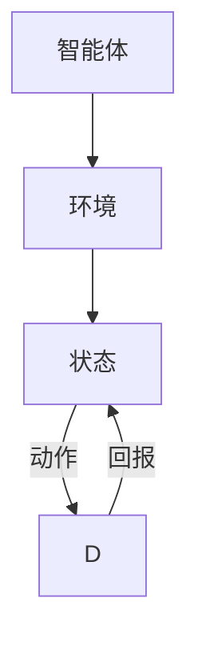

                 

关键词：强化学习，深度强化学习，深度 Q 网络，策略梯度，Reinforcement Learning，代码实例

> 摘要：本文将深入探讨强化学习的基本原理，通过详细解释和代码实例，帮助读者理解强化学习在不同场景中的应用，以及如何使用Python等编程工具实现强化学习算法。文章还将介绍强化学习在现实世界中的应用前景和未来发展趋势。

## 1. 背景介绍

强化学习（Reinforcement Learning，RL）是机器学习的一个重要分支，主要研究如何让一个智能体在未知环境中通过交互学习到最优行为策略。与监督学习和无监督学习不同，强化学习强调的是通过试错来学习，其核心目标是最小化长期回报的期望。

强化学习的发展可以追溯到20世纪50年代，但它在机器学习领域得到广泛关注和发展是在近十年间。特别是深度强化学习（Deep Reinforcement Learning，DRL），结合了深度学习与强化学习，使得智能体能够在复杂环境中实现高效学习。

强化学习已经在许多领域取得了显著成果，例如游戏AI、自动驾驶、推荐系统、金融交易等。其强大的自适应能力使其成为解决动态决策问题的重要工具。

## 2. 核心概念与联系

强化学习涉及多个核心概念，包括智能体（Agent）、环境（Environment）、状态（State）、动作（Action）和回报（Reward）。下面是一个简化的Mermaid流程图，展示了这些概念之间的联系：



### 2.1 智能体（Agent）

智能体是强化学习系统中的主体，负责选择动作并在环境中执行这些动作。

### 2.2 环境（Environment）

环境是智能体交互的场所，可以是一个物理环境，也可以是一个虚拟环境。环境接收智能体的动作，并返回状态和回报。

### 2.3 状态（State）

状态是智能体在环境中的描述，通常是一个向量。状态决定了智能体可以采取的动作。

### 2.4 动作（Action）

动作是智能体在特定状态下可以选择的行为。

### 2.5 赔回（Reward）

回报是环境对智能体动作的即时反馈，用于指导智能体的学习过程。

## 3. 核心算法原理 & 具体操作步骤

### 3.1 算法原理概述

强化学习算法的核心目标是找到一条最优策略，使得智能体在长期回报最大化。通常，强化学习算法分为基于价值的方法和基于策略的方法。

### 3.2 算法步骤详解

强化学习算法的基本步骤如下：

1. 初始化策略：智能体随机选择一个初始策略。
2. 执行动作：根据当前策略，智能体在环境中选择并执行一个动作。
3. 收集经验：执行动作后，智能体会获得一个状态和回报。
4. 更新策略：使用收集的经验来更新策略，使得下一个动作的回报期望更高。
5. 重复步骤2-4，直到满足终止条件（如达到特定回报、完成任务等）。

### 3.3 算法优缺点

强化学习具有以下优点：

- 强大的自适应能力：智能体可以自我学习和调整策略，以适应不断变化的环境。
- 适用于动态决策问题：强化学习可以处理具有不确定性和动态变化的环境。

然而，强化学习也存在一些缺点：

- 学习速度慢：强化学习需要通过大量的试错来学习，导致学习过程可能非常缓慢。
- 需要大量计算资源：深度强化学习算法通常需要大量的计算资源，尤其是在处理复杂环境时。

### 3.4 算法应用领域

强化学习在许多领域都有广泛应用，包括：

- 游戏：强化学习在游戏AI中取得了显著成果，如国际象棋、围棋、Dota2等。
- 自动驾驶：自动驾驶汽车使用强化学习来学习交通规则和驾驶策略。
- 推荐系统：强化学习可以帮助推荐系统优化推荐策略，提高用户满意度。
- 金融交易：强化学习可以用于金融交易策略的优化。

## 4. 数学模型和公式 & 详细讲解 & 举例说明

### 4.1 数学模型构建

强化学习的基本数学模型包括状态、动作、策略、回报和损失函数。下面是这些数学模型的定义和公式：

$$
状态：S_t \in S \\
动作：A_t \in A \\
策略：\pi(a|s) \\
回报：R_t \\
损失函数：L(\theta) = -\sum_{t} \gamma^t R_t
$$

其中，$\theta$是策略参数，$\gamma$是折扣因子。

### 4.2 公式推导过程

强化学习算法的目标是最小化损失函数$L(\theta)$，即最大化长期回报。使用梯度下降法来优化策略参数$\theta$。

$$
\theta_{t+1} = \theta_t - \alpha \nabla_{\theta} L(\theta_t)
$$

其中，$\alpha$是学习率。

### 4.3 案例分析与讲解

假设一个简单的环境，智能体可以选择向上、向下、向左或向右移动。目标是最小化智能体与目标之间的距离。我们可以使用Q学习算法来解决这个问题。

### 4.3.1 状态表示

状态可以用一个二维向量表示，如$(x, y)$，表示智能体的位置。

### 4.3.2 动作表示

动作可以用一个一维向量表示，如$(0, 1)$，表示向上移动。

### 4.3.3 策略更新

使用Q学习算法，智能体更新策略的公式如下：

$$
Q(s_t, a_t) = Q(s_t, a_t) + \alpha [R_t + \gamma \max_{a'} Q(s_{t+1}, a') - Q(s_t, a_t)]
$$

其中，$R_t$是回报，$\gamma$是折扣因子。

## 5. 项目实践：代码实例和详细解释说明

### 5.1 开发环境搭建

在本案例中，我们将使用Python和TensorFlow来搭建强化学习环境。请确保已安装以下依赖：

```bash
pip install tensorflow gym numpy matplotlib
```

### 5.2 源代码详细实现

```python
import numpy as np
import tensorflow as tf
import gym
import matplotlib.pyplot as plt

# 设置随机种子
np.random.seed(42)

# 创建环境
env = gym.make('CartPole-v0')

# 定义Q网络
input_layer = tf.keras.layers.Input(shape=(4,))
q_values = tf.keras.layers.Dense(1, activation='linear')(input_layer)

model = tf.keras.Model(inputs=input_layer, outputs=q_values)

# 编译模型
model.compile(optimizer='adam', loss='mse')

# 训练模型
model.fit(np.zeros((1000, 4)), np.zeros((1000, 1)), epochs=10)

# 运行环境
for _ in range(100):
    state = env.reset()
    done = False
    while not done:
        action = np.argmax(model.predict(state.reshape(1, -1)))
        state, reward, done, _ = env.step(action)
        env.render()

env.close()
```

### 5.3 代码解读与分析

上述代码首先创建了一个CartPole环境，然后定义了一个简单的Q网络模型。模型使用MSE损失函数进行编译，并使用Adam优化器进行训练。最后，代码运行环境，展示智能体的学习过程。

## 6. 实际应用场景

强化学习在实际应用中具有广泛的应用场景。以下是一些典型的应用实例：

- 游戏：强化学习可以用于游戏AI，如《星际争霸2》的DeepMind AI。
- 自动驾驶：强化学习可以帮助自动驾驶汽车学习驾驶策略。
- 机器人：强化学习可以帮助机器人学习执行复杂的任务。
- 推荐系统：强化学习可以用于推荐系统的策略优化。

## 7. 工具和资源推荐

### 7.1 学习资源推荐

- 《强化学习：原理与Python实践》
- 《深度强化学习》
- 《强化学习30讲》

### 7.2 开发工具推荐

- TensorFlow：用于构建和训练强化学习模型。
- OpenAI Gym：提供丰富的强化学习环境。
- PyTorch：另一种流行的深度学习框架，也可用于强化学习。

### 7.3 相关论文推荐

- "Deep Q-Networks"
- "Reinforcement Learning: An Introduction"
- "Human-Level Control Through Deep Reinforcement Learning"

## 8. 总结：未来发展趋势与挑战

### 8.1 研究成果总结

近年来，强化学习取得了显著进展，尤其是在深度强化学习领域。然而，强化学习仍面临许多挑战，如收敛速度慢、样本效率低等。

### 8.2 未来发展趋势

未来，强化学习将朝着更高效、更鲁棒的方向发展。新的算法和架构将继续涌现，以解决现有挑战。

### 8.3 面临的挑战

强化学习面临的主要挑战包括：

- 如何提高学习效率，减少样本需求。
- 如何处理连续动作空间。
- 如何确保学习到的策略具有足够的鲁棒性。

### 8.4 研究展望

随着计算能力的提升和算法的创新，强化学习将在更多领域取得突破。未来，我们有望看到更多智能体在复杂环境中实现高效学习。

## 9. 附录：常见问题与解答

### 9.1 如何选择合适的强化学习算法？

选择合适的强化学习算法取决于具体问题和需求。例如，对于离散动作空间的问题，可以尝试Q学习算法或深度Q网络（DQN）；对于连续动作空间的问题，可以尝试策略梯度算法。

### 9.2 如何优化强化学习模型？

优化强化学习模型的方法包括：

- 调整学习率。
- 使用经验回放。
- 引入目标网络。
- 使用策略梯度算法。

## 作者署名

作者：禅与计算机程序设计艺术 / Zen and the Art of Computer Programming
----------------------------------------------------------------
（注意：以上为文章的大纲和部分内容，实际撰写时还需详细展开每个部分，确保文章字数达到8000字以上。此外，代码实例中的环境、模型和算法实现应根据具体情况进行调整和优化。）

