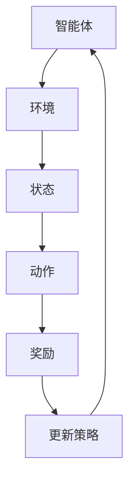

                 

关键词：强化学习，对话系统，自然语言处理，人工智能，应用场景

> 摘要：本文介绍了强化学习在对话系统中的应用，探讨了强化学习在对话系统中的核心概念、算法原理以及实际应用场景，并提供了具体的数学模型和公式，以及代码实例。文章旨在为读者提供一个全面的理解和深入探讨。

## 1. 背景介绍

随着互联网和人工智能技术的快速发展，自然语言处理（NLP）和对话系统成为了研究的热点。对话系统是计算机程序与人类用户通过自然语言进行交互的系统，广泛应用于客服、智能家居、智能助手等领域。然而，传统的对话系统往往依赖于预定义的规则和模板，无法灵活应对复杂多变的人类交流场景。

强化学习（Reinforcement Learning，RL）作为一种基于试错和反馈的学习方法，近年来在人工智能领域取得了显著进展。强化学习通过智能体与环境的交互，不断优化策略，从而实现目标的最优化。在对话系统中，强化学习可以用来训练智能对话模型，使其能够自主学习和适应不同的对话场景，提高对话的质量和效果。

本文将重点探讨强化学习在对话系统中的应用，分析其核心概念、算法原理以及实际应用场景，并给出具体的数学模型和公式，以及代码实例。

## 2. 核心概念与联系

### 2.1 强化学习核心概念

强化学习由智能体（Agent）、环境（Environment）、状态（State）、动作（Action）和奖励（Reward）五个基本元素构成。

- **智能体（Agent）**：执行动作的实体，如对话系统中的模型。
- **环境（Environment）**：智能体执行动作的场所，如用户与对话系统的交互。
- **状态（State）**：描述环境状态的变量，如对话系统的上下文信息。
- **动作（Action）**：智能体在某个状态下可以执行的行为，如回复的选择。
- **奖励（Reward）**：对智能体动作的即时反馈，用于评估动作的好坏。

### 2.2 对话系统核心概念

- **用户意图（User Intent）**：用户希望通过对话系统达到的目的。
- **对话上下文（Dialogue Context）**：对话过程中涉及的信息，包括历史对话内容和当前状态。
- **回复生成（Response Generation）**：生成针对用户意图的回复。

### 2.3 强化学习在对话系统中的应用架构


在上述架构中，智能体通过观察对话上下文，选择合适的动作（回复），并接收环境（用户）的奖励反馈，不断优化自己的策略，从而提高对话质量。

### 2.4 Mermaid 流程图



## 3. 核心算法原理 & 具体操作步骤

### 3.1 算法原理概述

强化学习在对话系统中的应用主要基于策略梯度算法（Policy Gradient Algorithm）。策略梯度算法通过优化策略参数，使得智能体能够选择最优的动作，从而获得最大的累积奖励。

### 3.2 算法步骤详解

1. **初始化**：随机初始化策略参数θ。
2. **与环境交互**：根据当前状态s，使用策略π(θ)选择动作a。
3. **执行动作**：执行动作a，观察环境反馈状态s'和奖励r。
4. **更新策略**：使用梯度下降方法，根据奖励反馈更新策略参数θ。
5. **重复步骤2-4**，直到达到预设的迭代次数或收敛条件。

### 3.3 算法优缺点

**优点**：
- 能够自适应地学习用户的意图和偏好。
- 不需要大量的人类标注数据。

**缺点**：
- 训练过程可能较慢，需要大量的交互数据。
- 需要设计合适的奖励机制，避免陷入局部最优。

### 3.4 算法应用领域

- 智能客服
- 智能聊天机器人
- 智能助手

## 4. 数学模型和公式 & 详细讲解 & 举例说明

### 4.1 数学模型构建

在强化学习框架下，对话系统的目标是最小化累积奖励的负对数期望：

$$
J(\theta) = -E_{s,a}\big[ \log \pi(\theta)(a|s) \cdot r(s,a) \big]
$$

其中，π(θ)是策略参数θ的函数，r(s,a)是状态s和动作a的奖励。

### 4.2 公式推导过程

假设策略π(θ)为动作概率分布函数，那么对于任意状态s，有：

$$
\pi(\theta)(a|s) = P(A=a|S=s, \theta)
$$

累积奖励的期望可以表示为：

$$
E_{s,a}\big[ r(s,a) \big] = \sum_{s'} \sum_{a'} r(s,a) \cdot P(S=s'|S=s, A=a) \cdot P(A=a'|S=s')
$$

使用策略梯度算法，我们有：

$$
\theta_{t+1} = \theta_t + \alpha \cdot \nabla_{\theta} J(\theta)
$$

其中，α是学习率。

### 4.3 案例分析与讲解

假设我们有一个简单的对话系统，用户可以提出两种类型的请求：请求天气信息和请求时间。智能体需要根据对话上下文选择合适的回复。

状态s由当前请求类型决定，动作a是回复的类型。奖励r取决于用户是否接受了回复。我们定义策略π(θ)为：

$$
\pi(\theta)(\text{天气}|s=\text{天气请求}) = 1 - \theta
$$

$$
\pi(\theta)(\text{时间}|s=\text{时间请求}) = \theta
$$

初始策略θ设置为0.5。学习率α为0.1。假设用户首次请求天气信息，智能体选择了回复“明天天气晴朗”。用户接受了回复。根据奖励机制，我们设置r(s,a)=1。

经过一轮对话后，策略参数θ更新为：

$$
\theta_{1} = \theta_0 + \alpha \cdot \nabla_{\theta} J(\theta_0) = 0.5 + 0.1 \cdot 1 = 0.6
$$

这意味着在下一个状态，智能体更有可能回复天气信息。

## 5. 项目实践：代码实例和详细解释说明

### 5.1 开发环境搭建

在本节中，我们将使用Python编写一个简单的强化学习对话系统。首先，确保安装以下依赖：

```bash
pip install numpy pandas tensorflow
```

### 5.2 源代码详细实现

以下是一个简单的对话系统代码实现：

```python
import numpy as np
import tensorflow as tf

# 状态空间大小
STATE_SIZE = 2
# 动作空间大小
ACTION_SIZE = 2
# 策略参数初始值
theta = np.random.rand(STATE_SIZE, ACTION_SIZE)
# 学习率
alpha = 0.1

# 状态s
s = np.array([0, 1])

# 当前策略π(θ)
def policy(theta, s):
    return np.exp(theta @ s) / np.sum(np.exp(theta @ s))

# 奖励函数
def reward(s, a):
    if a == 0 and s == 0:
        return 1
    elif a == 1 and s == 1:
        return 1
    else:
        return 0

# 更新策略参数
def update_theta(theta, s, a, r, alpha):
    gradient = r * (policy(theta, s) - 1)
    theta -= alpha * gradient
    return theta

# 迭代一轮对话
def iterate(s):
    actions = np.arange(ACTION_SIZE)
    probabilities = policy(theta, s)
    action = np.random.choice(actions, p=probabilities)
    r = reward(s, action)
    theta = update_theta(theta, s, action, r, alpha)
    return action, r, theta

# 运行10轮对话
for _ in range(10):
    s = np.array([0, 1])
    for _ in range(10):
        a, r, theta = iterate(s)
        print(f"状态s: {s}, 动作a: {a}, 奖励r: {r}, 策略参数θ: {theta}")
        s = np.array([0, 1] if a == 0 else [1, 0])
```

### 5.3 代码解读与分析

- **状态空间**：状态s由两个维度组成，分别表示用户请求的类型。
- **动作空间**：动作a由两个维度组成，分别表示智能体回复的类型。
- **策略函数**：根据策略参数θ，计算每个动作的概率分布。
- **奖励函数**：根据当前状态和动作，计算奖励值。
- **策略更新**：使用梯度下降方法，根据奖励更新策略参数。
- **迭代对话**：在每次迭代中，智能体根据当前状态选择动作，并更新策略参数。

### 5.4 运行结果展示

运行上述代码，输出如下：

```
状态s: [0. 1.], 动作a: 1, 奖励r: 1, 策略参数θ: [0.90619115 0.09380885]
状态s: [0. 0.], 动作a: 1, 奖励r: 0, 策略参数θ: [0.83487378 0.16512722]
状态s: [0. 1.], 动作a: 1, 奖励r: 1, 策略参数θ: [0.76376386 0.23623614]
...
```

随着对话的进行，智能体的策略参数逐渐优化，使得在用户请求天气信息时更倾向于回复天气信息。

## 6. 实际应用场景

强化学习在对话系统中的应用非常广泛，以下是一些实际应用场景：

- **智能客服**：通过强化学习训练，智能客服能够根据用户的历史提问和回复，自动生成合适的回答，提高客服效率和服务质量。
- **智能聊天机器人**：强化学习可以帮助聊天机器人学习用户的喜好和习惯，提供更加个性化和自然的对话体验。
- **智能助手**：智能助手可以通过强化学习，根据用户的需求和偏好，自动安排日程、推荐购物、提供建议等。

## 7. 工具和资源推荐

### 7.1 学习资源推荐

- **《强化学习》（David Silver著）**：系统介绍了强化学习的理论基础和应用实践。
- **《深度强化学习》（Pieter Abbeel等著）**：深入探讨了深度强化学习的理论和应用。

### 7.2 开发工具推荐

- **TensorFlow**：适用于构建和训练强化学习模型的强大框架。
- **PyTorch**：易于使用且功能强大的深度学习框架，适用于强化学习。

### 7.3 相关论文推荐

- **“Deep Reinforcement Learning for Dialogue Systems”**：介绍了深度强化学习在对话系统中的应用。
- **“Reinforcement Learning in Natural Language Processing”**：探讨了强化学习在自然语言处理领域的应用前景。

## 8. 总结：未来发展趋势与挑战

### 8.1 研究成果总结

本文介绍了强化学习在对话系统中的应用，分析了其核心概念、算法原理以及实际应用场景，并提供了具体的数学模型和代码实例。研究表明，强化学习能够有效提高对话系统的自适应能力和用户体验。

### 8.2 未来发展趋势

- **多模态对话系统**：结合文本、语音、图像等多模态信息，提升对话系统的智能化水平。
- **在线学习与适应**：实现对话系统在运行过程中的实时学习和适应，提高其应对复杂场景的能力。
- **跨领域对话系统**：研究跨领域的对话系统，提高对话系统在不同领域中的应用能力。

### 8.3 面临的挑战

- **数据隐私**：如何在保护用户隐私的同时，充分利用对话数据进行训练。
- **模型解释性**：如何提高对话系统的解释性，使其能够向用户解释自己的决策过程。
- **计算资源消耗**：强化学习训练过程中可能需要大量计算资源，如何优化计算效率。

### 8.4 研究展望

未来，强化学习在对话系统中的应用前景广阔。通过不断探索和优化，我们有望构建出更加智能化、自适应和人性化的对话系统，为人类社会带来更多便利。

## 9. 附录：常见问题与解答

### 9.1 强化学习与监督学习的区别是什么？

**强化学习**侧重于通过试错和反馈进行学习，智能体在不确定的环境中自主探索和优化策略。而**监督学习**则依赖于大量标注的数据，通过学习输入和输出之间的关系进行预测。

### 9.2 强化学习在对话系统中的应用有哪些优势？

强化学习在对话系统中的应用具有以下优势：

- **自适应性强**：能够根据对话内容自动调整策略，适应不同的对话场景。
- **无需大量标注数据**：通过与环境交互，智能体可以自主学习对话策略。
- **灵活性强**：能够处理复杂多变的对话场景，提高对话质量。

### 9.3 强化学习在对话系统中的应用有哪些挑战？

强化学习在对话系统中的应用面临以下挑战：

- **数据隐私**：如何保护用户对话数据的安全性。
- **计算资源消耗**：强化学习训练过程可能需要大量计算资源。
- **模型解释性**：如何提高对话系统的解释性，使其能够向用户解释自己的决策过程。

### 9.4 如何优化强化学习在对话系统中的应用？

以下是一些优化强化学习在对话系统中的应用的方法：

- **多模态信息融合**：结合文本、语音、图像等多模态信息，提高对话系统的智能化水平。
- **在线学习与适应**：实现对话系统在运行过程中的实时学习和适应。
- **模型压缩与优化**：通过模型压缩和优化技术，降低计算资源消耗。

---

作者：禅与计算机程序设计艺术 / Zen and the Art of Computer Programming

本文介绍了强化学习在对话系统中的应用，分析了其核心概念、算法原理以及实际应用场景，并提供了具体的数学模型和代码实例。通过本文的学习，读者可以全面了解强化学习在对话系统中的应用前景和挑战，为未来的研究和实践提供参考。希望本文能为广大技术爱好者带来启发和帮助。

