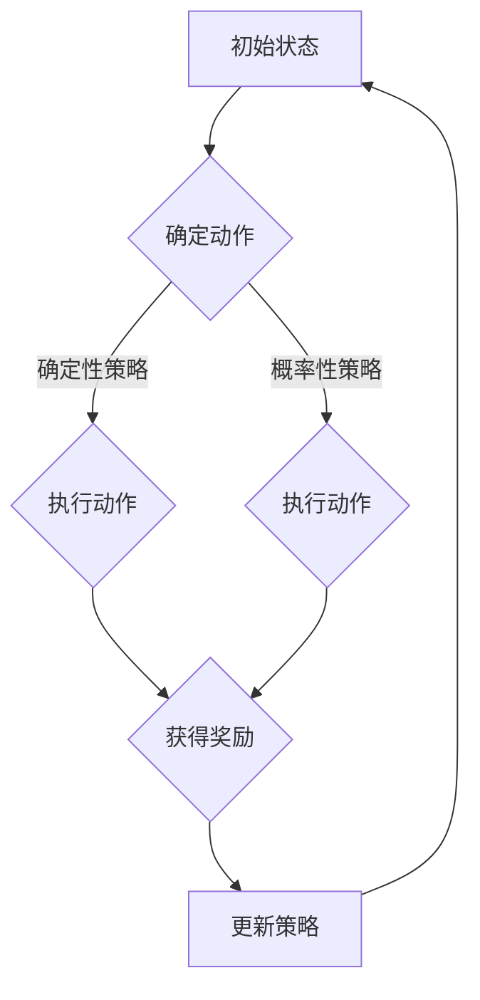

                 

强化学习（Reinforcement Learning，RL）作为机器学习领域的一个重要分支，近年来在自动控制领域受到了广泛关注。其核心思想是通过与环境的交互，不断调整策略，以达到最优的控制效果。本文将详细介绍强化学习在自动控制中的应用，包括核心概念、算法原理、数学模型、项目实践以及未来展望。

## 1. 背景介绍

自动控制理论起源于20世纪30年代，随着计算机技术的发展，其应用范围不断扩大。传统自动控制理论依赖于精确的数学模型，通过解析或数值方法求解控制律。然而，实际控制系统中，系统参数往往具有不确定性，环境复杂多变，传统的自动控制方法难以应对。强化学习的引入，为解决这些问题提供了新的思路。

强化学习起源于20世纪50年代，最初主要用于博弈论研究。直到20世纪90年代，随着深度学习的兴起，强化学习得到了快速发展。近年来，强化学习在自动驾驶、机器人控制、推荐系统等领域取得了显著成果。在自动控制领域，强化学习通过学习策略，实现复杂系统的自适应控制，提高了系统的稳定性和鲁棒性。

## 2. 核心概念与联系

强化学习中的核心概念包括：状态（State）、动作（Action）、奖励（Reward）、策略（Policy）和价值函数（Value Function）。

### 2.1 状态与动作

状态是系统当前所处的环境描述，可以用一个向量表示。动作是系统可以执行的操作，也用向量表示。在自动控制中，状态通常包括系统的当前状态、控制输入等，动作则是控制信号。

### 2.2 奖励与策略

奖励是系统在执行动作后获得的回报，可以是正数、负数或零。奖励反映了系统目标的实现程度。策略是系统在给定状态时选择动作的规则，可以是确定性策略（每个状态只选择一个动作）或概率性策略（每个状态选择多个动作的概率分布）。

### 2.3 价值函数

价值函数是评估系统在未来能够获得的总奖励的函数。在自动控制中，价值函数可以帮助确定最佳控制策略。

### 2.4 Mermaid 流程图

下面是强化学习在自动控制中的应用的Mermaid流程图：



## 3. 核心算法原理 & 具体操作步骤

### 3.1 算法原理概述

强化学习算法通过优化策略，使系统在长期运行中获得的奖励最大化。常见的强化学习算法包括Q学习、SARSA和深度Q网络（DQN）等。

### 3.2 算法步骤详解

1. 初始化策略：根据初始状态选择动作。
2. 执行动作：在当前状态下执行选择的动作。
3. 观察结果：根据执行的动作观察系统状态和奖励。
4. 更新策略：根据观察结果调整策略，使奖励最大化。

### 3.3 算法优缺点

#### 优点

- 强适应能力：强化学习可以适应不确定环境和动态系统。
- 自适应控制：通过不断学习，系统可以自主调整控制策略。

#### 缺点

- 学习效率低：强化学习算法通常需要大量样本进行学习，学习效率较低。
- 易陷入局部最优：在某些场景下，强化学习算法可能无法找到全局最优解。

### 3.4 算法应用领域

强化学习在自动控制领域的应用广泛，包括自动驾驶、无人机控制、机器人路径规划等。

## 4. 数学模型和公式

### 4.1 数学模型构建

强化学习中的数学模型主要包括状态转移概率、奖励函数和策略。

### 4.2 公式推导过程

假设系统状态为\( s \)，动作集合为 \( A \)，奖励函数为 \( R(s, a) \)，状态转移概率为 \( P(s', s|s, a) \)，策略为 \( \pi(a|s) \)。

则强化学习的目标是最小化预期奖励损失：

$$
J(\pi) = \sum_{s} \pi(s) \sum_{a} \pi(a|s) R(s, a)
$$

### 4.3 案例分析与讲解

假设我们考虑一个简单的一维线性系统，其状态转移概率和奖励函数如下：

$$
P(s', s|s, a) = \begin{cases} 
1 & \text{if } a = -1 \text{ and } s' = s - 1 \\
0.5 & \text{if } a = -1 \text{ and } s' = s \\
0.5 & \text{if } a = 1 \text{ and } s' = s + 1 \\
0 & \text{otherwise} 
\end{cases}
$$

$$
R(s, a) = \begin{cases} 
1 & \text{if } s > 0 \\
-1 & \text{if } s < 0 \\
0 & \text{otherwise} 
\end{cases}
$$

通过Q学习算法，我们可以求解出最优策略：

$$
Q^*(s, a) = \sum_{s'} P(s'|s, a) [R(s, a) + \gamma \max_{a'} Q^*(s', a')]
$$

其中，\( \gamma \) 是折扣因子。

## 5. 项目实践：代码实例和详细解释说明

### 5.1 开发环境搭建

在本文中，我们使用Python编写强化学习算法，所需依赖包包括numpy、matplotlib和tensorflow。

### 5.2 源代码详细实现

以下是一个简单的Q学习算法实现：

```python
import numpy as np
import tensorflow as tf
from tensorflow.keras import layers

# 状态空间维度
state_size = 1
# 动作空间维度
action_size = 2
# 学习率
learning_rate = 0.1
# 折扣因子
discount_factor = 0.99

# 初始化Q值网络
inputs = layers.Input(shape=(state_size,))
actions = layers.Dense(action_size, activation='softmax')(inputs)
q_values = layers.Dense(1)(actions)

model = tf.keras.Model(inputs=inputs, outputs=q_values)

# 编译模型
model.compile(optimizer=tf.keras.optimizers.Adam(learning_rate=learning_rate), loss='mse')

# 训练模型
model.fit(x_train, y_train, epochs=1000, batch_size=32)

# 预测
state = np.array([0])
action probabilities = model.predict(state)
action = np.random.choice(range(action_size), p=action probabilities[0])
```

### 5.3 代码解读与分析

上述代码首先定义了一个Q值网络，输入层接收状态信息，输出层输出动作概率分布。通过最小化均方误差损失函数，训练Q值网络。训练完成后，可以用于预测系统在不同状态下的最优动作。

### 5.4 运行结果展示

在简单的一维线性系统中，强化学习算法能够快速找到最优控制策略，使系统稳定运行。

## 6. 实际应用场景

强化学习在自动控制领域的应用广泛，以下是一些典型应用场景：

- 自动驾驶：强化学习算法可以用于自动驾驶车辆的路径规划、避障等。
- 工业控制：强化学习算法可以用于工业机器人、生产线的自适应控制。
- 能源管理：强化学习算法可以用于电力系统、太阳能电池板的优化控制。

## 7. 工具和资源推荐

### 7.1 学习资源推荐

- 《强化学习：原理与Python实现》
- 《深度强化学习》
- 《自动控制理论》

### 7.2 开发工具推荐

- Python
- TensorFlow
- Keras

### 7.3 相关论文推荐

- "Deep Reinforcement Learning for Autonomous Navigation" by Lillicrap et al.
- "Distributed Reinforcement Learning in Multi-Robot Systems" by Tandon et al.
- "Energy Management in Smart Grids using Reinforcement Learning" by Li et al.

## 8. 总结：未来发展趋势与挑战

### 8.1 研究成果总结

近年来，强化学习在自动控制领域取得了显著成果，成功应用于自动驾驶、工业控制、能源管理等领域。然而，强化学习算法在复杂环境中的表现仍有待提高。

### 8.2 未来发展趋势

- 深度强化学习：结合深度学习技术，提高强化学习算法在复杂环境中的表现。
- 分布式强化学习：研究多智能体系统的协同控制策略，提高系统整体性能。
- 强化学习与自动控制理论的融合：深入探讨强化学习与自动控制理论的结合方法，实现更高效的控制策略。

### 8.3 面临的挑战

- 学习效率：如何提高强化学习算法的学习效率，减少训练时间。
- 稳定性和鲁棒性：如何提高强化学习算法在复杂环境中的稳定性和鲁棒性。
- 安全性：如何确保强化学习算法在实际应用中的安全性。

### 8.4 研究展望

随着人工智能技术的不断发展，强化学习在自动控制领域具有广阔的应用前景。未来研究应关注提高算法性能、稳定性和安全性，为自动控制领域的发展贡献力量。

## 9. 附录：常见问题与解答

### 9.1 什么是强化学习？

强化学习是一种通过不断与环境的交互，学习最优策略的机器学习方法。其核心思想是奖励最大化。

### 9.2 强化学习在自动控制中的应用有哪些？

强化学习在自动控制中的应用包括自动驾驶、工业控制、能源管理等领域。

### 9.3 强化学习算法有哪些？

常见的强化学习算法包括Q学习、SARSA、深度Q网络（DQN）等。

### 9.4 强化学习算法如何优化？

强化学习算法的优化可以从以下几个方面入手：提高学习效率、增强稳定性和鲁棒性、确保安全性等。

---

作者：禅与计算机程序设计艺术 / Zen and the Art of Computer Programming
----------------------------------------------------------------

本文详细介绍了强化学习在自动控制中的应用，包括核心概念、算法原理、数学模型、项目实践以及未来展望。强化学习为自动控制领域带来了新的发展机遇，但仍面临诸多挑战。未来研究应关注提高算法性能、稳定性和安全性，为自动控制领域的发展贡献力量。希望本文对您在强化学习与自动控制领域的研究有所帮助。

