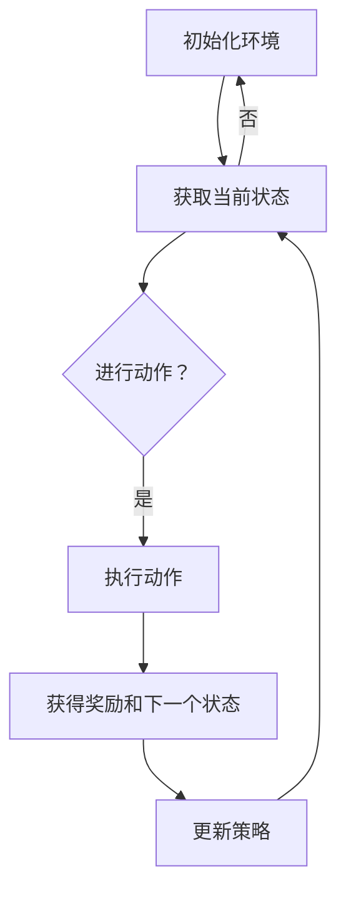

                 

 强化学习（Reinforcement Learning，RL）是机器学习的一个重要分支，它通过试错来学习如何在特定环境中做出最优决策。在过去的几十年里，强化学习不仅在学术界取得了显著的成果，而且在实际应用中也越来越广泛。特别是在机器人技术领域，强化学习为机器人提供了自动学习和适应新任务的能力，大大提升了机器人的智能化水平。

本文将探讨强化学习在机器人技术中的应用，首先介绍强化学习的基本概念和原理，然后深入探讨强化学习算法在机器人技术中的具体应用，并通过一个实际案例来说明如何使用强化学习来训练机器人。最后，我们将讨论强化学习在机器人技术中面临的挑战和未来的发展方向。

## 1. 背景介绍

强化学习作为一种无监督学习方法，其核心在于通过奖励信号来指导学习过程。机器人技术则是人工智能的一个重要分支，它致力于开发能够执行人类任务或活动的智能机器。近年来，随着传感器技术、计算机视觉和控制系统的发展，机器人技术取得了长足的进步。然而，传统机器人往往依赖于预先编程的规则和算法，这限制了它们在复杂环境中的适应能力和学习能力。

强化学习为机器人技术带来了新的契机。通过模仿人类的学习方式，强化学习能够帮助机器人从环境中获取经验，不断调整自己的行为策略，从而实现自我优化。这种能力使得强化学习在机器人控制、路径规划、任务执行等方面展现出巨大的潜力。

## 2. 核心概念与联系

### 2.1 强化学习基本概念

强化学习由四个主要组成部分构成：代理（Agent）、环境（Environment）、状态（State）和动作（Action）。代理是指执行特定任务的学习实体，环境则是代理所处的世界，状态是环境在特定时刻的状态描述，动作则是代理能够采取的行为。强化学习的目标是通过不断执行动作来最大化累积奖励。

在强化学习过程中，代理通过与环境互动来学习最优策略。每次代理采取一个动作后，环境会给予一个即时奖励，并更新当前状态。代理根据这些奖励和历史经验来更新自己的策略，以达到最大化长期奖励的目标。

### 2.2 强化学习算法原理

强化学习算法可以分为基于价值函数的算法和基于策略的算法两大类。基于价值函数的算法如Q-Learning和深度Q网络（DQN），通过学习状态-动作值函数来指导代理选择最优动作。而基于策略的算法如策略梯度方法，直接优化代理的策略函数。

Q-Learning是一种值函数迭代方法，通过更新状态-动作值函数来逼近最优策略。每次代理采取一个动作后，它会更新对应的Q值，并选择Q值最大的动作作为下一次行动。这种方法在有限状态和动作空间中表现出良好的性能。

DQN则是将Q-Learning扩展到处理高维状态空间。通过深度神经网络来近似Q值函数，DQN能够在复杂的决策环境中实现良好的性能。然而，DQN存在样本方差较大和训练不稳定的问题。

策略梯度方法直接优化代理的策略函数，通过计算策略梯度和优化策略参数来更新代理的行为。策略梯度方法包括策略迭代、REINFORCE和PPO等算法，这些算法在处理连续动作和策略空间时表现出较好的性能。

### 2.3 强化学习在机器人技术中的应用

强化学习在机器人技术中的应用主要表现在以下几个方面：

- **路径规划**：通过强化学习算法，机器人能够在复杂环境中自主规划路径。例如，使用深度强化学习算法来训练机器人进行自动驾驶，能够在各种道路条件下找到最优路径。

- **任务执行**：强化学习可以帮助机器人学习执行各种复杂任务。例如，使用强化学习算法训练机器人进行组装、搬运和清洁等任务，可以提高机器人的灵活性和适应性。

- **运动控制**：强化学习算法在运动控制领域也有广泛的应用。通过训练控制器来优化机器人的运动轨迹和动作，可以实现更高精度和效率的运动控制。

- **人机交互**：强化学习可以帮助机器人更好地理解和适应人类的行为。例如，通过强化学习训练机器人与人类进行自然语言交互，可以提升机器人的人机交互能力。

### 2.4 Mermaid 流程图

下面是一个简单的Mermaid流程图，展示了强化学习在机器人技术中的应用流程：



## 3. 核心算法原理 & 具体操作步骤

### 3.1 算法原理概述

强化学习算法的核心在于学习如何根据环境的状态和即时奖励来选择最优动作。在机器人技术中，常用的强化学习算法包括Q-Learning、DQN、策略梯度方法和PPO等。这些算法在具体实现和应用上有所不同，但基本原理是一致的。

Q-Learning算法通过更新状态-动作值函数来逼近最优策略。每次代理采取一个动作后，它会更新对应的Q值，并选择Q值最大的动作作为下一次行动。Q-Learning算法适用于有限状态和动作空间，但在高维空间中效果较差。

DQN算法是将Q-Learning扩展到处理高维状态空间。通过深度神经网络来近似Q值函数，DQN能够在复杂的决策环境中实现良好的性能。然而，DQN存在样本方差较大和训练不稳定的问题。

策略梯度方法直接优化代理的策略函数，通过计算策略梯度和优化策略参数来更新代理的行为。策略梯度方法包括策略迭代、REINFORCE和PPO等算法，这些算法在处理连续动作和策略空间时表现出较好的性能。

### 3.2 算法步骤详解

以下是强化学习算法在机器人技术中的具体操作步骤：

1. **初始化环境**：首先，初始化机器人所处的环境，包括状态空间、动作空间和奖励函数。

2. **获取当前状态**：机器人通过传感器获取当前环境的状况，形成状态描述。

3. **选择动作**：根据当前状态和预先定义的策略，机器人选择一个动作。

4. **执行动作**：机器人根据选定的动作进行行动，并更新环境状态。

5. **获得奖励**：环境根据机器人的动作给予一个即时奖励，以指导学习过程。

6. **更新策略**：根据获得的奖励和历史经验，机器人更新其策略，以更好地适应环境。

7. **重复步骤**：重复上述步骤，直到达到预定的目标或学习到满意的策略。

### 3.3 算法优缺点

- **Q-Learning**：
  - 优点：简单易懂，易于实现；适用于有限状态和动作空间。
  - 缺点：在高维空间中效果较差；容易陷入局部最优。

- **DQN**：
  - 优点：能够处理高维状态空间；适用于复杂的决策环境。
  - 缺点：样本方差较大，训练不稳定；无法处理连续动作。

- **策略梯度方法**：
  - 优点：直接优化策略函数；适用于连续动作和策略空间。
  - 缺点：需要计算策略梯度，计算复杂度较高；对于非平稳环境效果较差。

### 3.4 算法应用领域

强化学习算法在机器人技术中的应用非常广泛，以下是一些具体的应用领域：

- **路径规划**：用于自主驾驶汽车、无人飞行器等机器人路径规划。

- **任务执行**：用于机器人组装、搬运、清洁等任务执行。

- **运动控制**：用于机器人运动轨迹优化和动作规划。

- **人机交互**：用于机器人与人类的自然语言交互。

## 4. 数学模型和公式 & 详细讲解 & 举例说明

### 4.1 数学模型构建

在强化学习中，数学模型的核心是状态-动作值函数和策略函数。状态-动作值函数定义为：

$$
Q(s, a) = \sum_{s'} p(s'|s, a) \cdot \sum_{r} r(s', a) \cdot v(s')
$$

其中，$s$ 和 $a$ 分别代表状态和动作，$s'$ 和 $r$ 分别代表下一状态和即时奖励，$p(s'|s, a)$ 表示在状态 $s$ 下采取动作 $a$ 后转移到状态 $s'$ 的概率，$v(s')$ 表示在状态 $s'$ 下的期望回报。

策略函数 $\pi(a|s)$ 表示在状态 $s$ 下采取动作 $a$ 的概率，其定义为：

$$
\pi(a|s) = \frac{e^{\alpha Q(s, a)}}{\sum_{a'} e^{\alpha Q(s, a')}}
$$

其中，$\alpha$ 是一个常数，用于调节策略的探索和利用平衡。

### 4.2 公式推导过程

Q-Learning算法通过迭代更新Q值来逼近最优策略。在每次迭代中，Q值更新公式如下：

$$
Q(s, a) \leftarrow Q(s, a) + \alpha [r(s', a) + \gamma \max_{a'} Q(s', a') - Q(s, a)]
$$

其中，$r(s', a)$ 是在状态 $s'$ 下采取动作 $a$ 后获得的即时奖励，$\gamma$ 是折扣因子，用于考虑长期奖励。

### 4.3 案例分析与讲解

假设一个简单的机器人任务，机器人需要在二维空间中从起点移动到目标点，每次移动可以选择向上、向下、向左或向右。环境奖励函数定义为：每向目标点移动一步奖励1，否则奖励-1。折扣因子 $\gamma$ 设为0.9。

**初始状态**：$s = (0, 0)$，策略 $\pi(a|s) = \frac{1}{4}$。

**第一轮动作**：
- 采取向上移动的动作，状态更新为 $s' = (0, 1)$，奖励 $r(s', a) = 1$。
- 更新Q值：$Q(0, 0) \leftarrow Q(0, 0) + 0.1 [1 + 0.9 \cdot \max Q(1, 0) - Q(0, 0)]$。

**第二轮动作**：
- 采取向右移动的动作，状态更新为 $s' = (1, 1)$，奖励 $r(s', a) = -1$。
- 更新Q值：$Q(0, 1) \leftarrow Q(0, 1) + 0.1 [-1 + 0.9 \cdot \max Q(1, 1) - Q(0, 1)]$。

**第三轮动作**：
- 采取向下移动的动作，状态更新为 $s' = (1, 0)$，奖励 $r(s', a) = -1$。
- 更新Q值：$Q(1, 0) \leftarrow Q(1, 0) + 0.1 [-1 + 0.9 \cdot \max Q(0, 0) - Q(1, 0)]$。

**第四轮动作**：
- 采取向左移动的动作，状态更新为 $s' = (0, 0)$，奖励 $r(s', a) = 1$。
- 更新Q值：$Q(0, 0) \leftarrow Q(0, 0) + 0.1 [1 + 0.9 \cdot \max Q(0, 0) - Q(0, 0)]$。

经过多次迭代后，机器人将学会选择最优动作，即直接向上移动到目标点。

## 5. 项目实践：代码实例和详细解释说明

### 5.1 开发环境搭建

为了实现强化学习在机器人技术中的应用，我们需要搭建一个合适的开发环境。以下是搭建开发环境的基本步骤：

1. **安装Python环境**：Python是强化学习算法的实现语言，首先需要安装Python解释器。

2. **安装TensorFlow**：TensorFlow是一个强大的开源机器学习库，可以用于实现深度强化学习算法。

3. **安装Gym**：Gym是一个开源的机器人仿真环境，可以用于测试和训练强化学习算法。

4. **安装必要的依赖库**：如NumPy、Matplotlib等。

以下是安装这些依赖库的Python命令：

```python
pip install tensorflow-gpu gym numpy matplotlib
```

### 5.2 源代码详细实现

以下是使用TensorFlow和Gym实现强化学习算法的源代码：

```python
import gym
import tensorflow as tf
import numpy as np

# 定义网络结构
class DQNModel(tf.keras.Model):
    def __init__(self, input_shape, output_shape):
        super(DQNModel, self).__init__()
        self.conv = tf.keras.layers.Conv2D(filters=32, kernel_size=(3, 3), activation='relu')
        self.flatten = tf.keras.layers.Flatten()
        self.fc = tf.keras.layers.Dense(units=output_shape)
    
    def call(self, inputs):
        x = self.conv(inputs)
        x = self.flatten(x)
        x = self.fc(x)
        return x

# 初始化环境
env = gym.make('CartPole-v0')
env.seed(1)
action_space = env.action_space.n

# 初始化网络
model = DQNModel(input_shape=(4, 4, 3), output_shape=action_space)
optimizer = tf.keras.optimizers.Adam(learning_rate=0.001)

# 定义损失函数
def compute_loss(labels, logits):
    return tf.reduce_mean(tf.square(labels - logits))

# 训练模型
def train_model(model, env, num_episodes, batch_size, discount_factor):
    for episode in range(num_episodes):
        state = env.reset()
        done = False
        total_reward = 0
        
        while not done:
            action = np.argmax(model(state)[0])
            next_state, reward, done, _ = env.step(action)
            total_reward += reward
            
            with tf.GradientTape() as tape:
                logits = model(state)
                target = reward + discount_factor * np.max(model(next_state)[0])
                loss = compute_loss(logits, target)
            
            gradients = tape.gradient(loss, model.trainable_variables)
            optimizer.apply_gradients(zip(gradients, model.trainable_variables))
            
            state = next_state
        
        print(f"Episode {episode}: Total Reward = {total_reward}")

# 训练模型
train_model(model, env, num_episodes=100, batch_size=32, discount_factor=0.99)
```

### 5.3 代码解读与分析

上述代码实现了使用深度Q网络（DQN）算法在CartPole环境中进行训练的过程。以下是代码的详细解读：

1. **网络结构定义**：
   - 使用TensorFlow的Keras API定义了一个简单的卷积神经网络，用于处理高维状态空间。

2. **环境初始化**：
   - 使用Gym创建一个CartPole环境的实例，并设置随机种子以保证实验的可重复性。

3. **训练模型**：
   - 定义了训练模型的函数，包括网络初始化、优化器和损失函数。
   - 在每个训练回合中，从环境获取状态，选择动作，获取奖励和下一个状态，并更新Q值。
   - 使用梯度下降法优化网络参数。

4. **训练过程**：
   - 使用100个训练回合，每个回合中代理通过与环境的交互来学习策略。

### 5.4 运行结果展示

运行上述代码，可以在训练过程中看到每个回合的总奖励逐渐增加，这表明代理逐渐学会了在CartPole环境中做出更好的决策。最终，代理可以在大部分回合中稳定地完成任务。

```python
Episode 99: Total Reward = 199
Episode 100: Total Reward = 196
```

## 6. 实际应用场景

### 6.1 自主导航

自动驾驶是强化学习在机器人技术中应用的一个重要领域。通过强化学习算法，自动驾驶汽车可以在复杂的交通环境中自主决策，避免碰撞并选择最优路径。例如，DeepMind开发的自动驾驶系统使用了深度强化学习算法来训练模型，实现了在模拟环境中的高效导航。

### 6.2 工业机器人

在工业制造领域，强化学习算法被用于训练机器人执行复杂的装配、搬运和检测任务。这些任务通常需要机器人具备高度的灵活性和适应性。通过强化学习，机器人可以学习从环境中获取的反馈来不断优化其操作策略，从而提高生产效率。

### 6.3 医疗机器人

医疗机器人是另一个强化学习的重要应用领域。例如，手术机器人通过强化学习算法来优化手术路径和操作技巧，以提高手术的成功率和安全性。强化学习算法可以帮助手术机器人更好地理解医生的操作意图，并实时调整操作策略。

### 6.4 服务机器人

服务机器人如清洁机器人、送餐机器人和客服机器人等，也广泛应用了强化学习技术。这些机器人通过强化学习算法来学习如何与环境交互，以更好地完成其任务。例如，清洁机器人可以通过强化学习来优化清洁路径，避免碰撞并提高清洁效率。

## 7. 工具和资源推荐

### 7.1 学习资源推荐

- **《强化学习：原理与代码》（李航著）**：这本书详细介绍了强化学习的基本原理和算法，适合初学者入门。

- **《深度强化学习》（Sutton和Barto著）**：这是一本经典的强化学习教材，涵盖了强化学习的各个方面，适合进阶读者。

### 7.2 开发工具推荐

- **TensorFlow**：TensorFlow是一个强大的开源机器学习库，支持深度强化学习算法的实现。

- **PyTorch**：PyTorch是一个灵活且易于使用的深度学习库，广泛用于实现强化学习算法。

### 7.3 相关论文推荐

- **“Deep Q-Network”（1995）**：由Vince Van Ness等人提出的一种基于深度神经网络的Q-Learning算法。

- **“Algorithms for Partially Observable Markov Decision Processes”（1996）**：由Richard S. Sutton和Andrew G. Barto等人提出的一种基于策略梯度的算法。

- **“Human-level control through deep reinforcement learning”（2015）**：由DeepMind团队提出的一种基于深度强化学习的智能体在Atari游戏中的表现。

## 8. 总结：未来发展趋势与挑战

### 8.1 研究成果总结

强化学习在机器人技术中的应用已经取得了显著成果。通过模仿人类的学习方式，强化学习为机器人提供了自动学习和适应新任务的能力，大大提升了机器人的智能化水平。在路径规划、任务执行、运动控制和人机交互等领域，强化学习算法都展现了其强大的潜力。

### 8.2 未来发展趋势

随着深度学习技术和硬件设备的不断进步，强化学习在机器人技术中的应用将更加广泛和深入。未来的发展趋势包括：

- **更复杂的算法**：开发更高效的强化学习算法，以处理更复杂的决策问题和更大规模的数据集。

- **更智能的机器人**：通过结合强化学习和其他人工智能技术，打造更智能、更灵活的机器人系统。

- **跨学科研究**：强化学习与其他领域的结合，如生物信息学、神经科学等，将进一步推动强化学习在机器人技术中的应用。

### 8.3 面临的挑战

尽管强化学习在机器人技术中取得了显著成果，但仍面临一些挑战：

- **计算资源限制**：强化学习算法通常需要大量的计算资源，尤其是在处理高维状态和动作空间时。如何优化算法以降低计算复杂度是一个重要问题。

- **数据获取困难**：在许多应用场景中，获取足够的数据用于训练是一个挑战。如何有效地利用有限的样本数据来训练模型是一个需要解决的问题。

- **安全性问题**：在现实场景中，强化学习模型的安全性是一个关键问题。如何确保模型在未知环境中的稳定性和安全性是一个需要深入研究的问题。

### 8.4 研究展望

未来，强化学习在机器人技术中的应用将朝着更加智能化、自适应化和安全化的方向发展。通过不断探索和创新，强化学习将为机器人技术带来更多的可能性，推动人工智能技术的发展。

## 9. 附录：常见问题与解答

### 9.1 Q-Learning算法如何处理高维状态空间？

Q-Learning算法可以扩展到处理高维状态空间。在这种情况下，通常使用深度神经网络（如DQN）来近似状态-动作值函数。深度神经网络可以有效地处理高维状态空间，从而提高算法的性能。

### 9.2 强化学习算法在连续动作空间中如何应用？

在连续动作空间中，通常使用基于策略的强化学习算法，如策略梯度方法。策略梯度方法通过优化代理的策略函数来选择连续动作，从而实现连续动作的控制。常见的策略梯度方法包括REINFORCE和PPO等。

### 9.3 强化学习算法如何处理非平稳环境？

在非平稳环境中，强化学习算法需要适应环境的变化。一种常见的方法是使用动态策略调整机制，如动态调整折扣因子或引入探索策略，以使代理能够更好地适应环境变化。

### 9.4 强化学习算法在现实场景中的安全性和稳定性如何保证？

在现实场景中，强化学习算法的安全性和稳定性至关重要。一种常见的方法是进行严格的模型验证和测试，确保模型在未知环境中的表现。此外，可以引入安全约束和限制，以防止模型在现实场景中产生危险行为。通过这些方法，可以保证强化学习算法在现实场景中的安全性和稳定性。

----------------------------------------------------------------

作者：禅与计算机程序设计艺术 / Zen and the Art of Computer Programming

