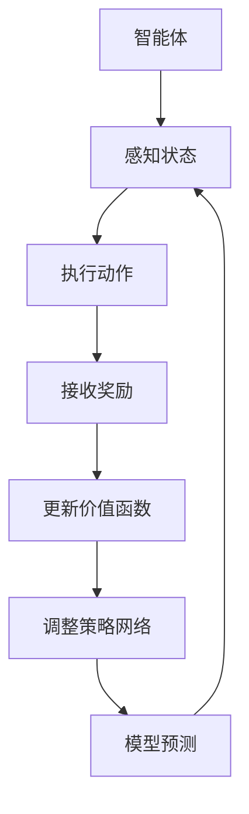

                 

关键词：强化学习、机器学习、人工智能、未来预测、智能决策、算法原理

> 摘要：本文将深入探讨强化学习这一先进的人工智能技术，分析其核心概念与架构，详细讲解强化学习算法的原理与操作步骤，以及数学模型和公式的推导过程。此外，通过具体的项目实践实例，展示强化学习在现实应用中的潜力和挑战。文章旨在为读者提供全面、深入的强化学习知识，探讨其未来发展趋势和面临的挑战。

## 1. 背景介绍

### 强化学习的起源与发展

强化学习作为一种机器学习方法，起源于20世纪50年代。最初由美国心理学家和行为主义理论的代表人物之一B.F. 斯金纳提出。他通过实验发现，通过正强化和负强化可以改变动物的行为模式。这一发现启发了后来的研究者，他们将这种理论应用到计算机科学和人工智能领域，从而形成了强化学习这一分支。

在人工智能领域，强化学习经历了几个重要的发展阶段。1950年代，人工神经网络（ANN）的提出为强化学习提供了理论基础。随后，1980年代，随着计算机性能的提升，研究者们开始尝试使用计算机模拟强化学习过程。进入21世纪，随着深度学习的兴起，强化学习得到了进一步的发展，成为人工智能领域的重要研究方向。

### 强化学习在现实中的应用

强化学习在现实世界中有着广泛的应用。例如，在自动驾驶领域，强化学习被用来训练自动驾驶汽车在不同路况下做出最优决策。在游戏领域，强化学习算法被应用于游戏AI的智能决策，使得游戏AI能够具备超越人类玩家的水平。此外，强化学习还在机器人控制、金融交易、能源管理等多个领域展现出巨大的潜力。

随着人工智能技术的不断进步，强化学习在实际应用中面临的挑战和机遇也在不断变化。本文将详细探讨强化学习的核心概念、算法原理、数学模型以及实际应用案例，旨在为读者提供全面、深入的理解。

## 2. 核心概念与联系

### 强化学习的核心概念

强化学习（Reinforcement Learning，简称RL）是一种通过奖励机制来训练智能体（agent）在特定环境中做出最优决策的机器学习方法。在强化学习中，智能体通过不断与环境交互，学习如何通过行动（action）获取最大的累积奖励（reward）。

**智能体（Agent）**：强化学习中的智能体是指一个可以感知环境状态（state）、采取行动并接收奖励的实体。智能体可以是机器人、软件程序或虚拟代理。

**环境（Environment）**：环境是指智能体所处的现实或模拟场景。环境提供当前状态信息，并返回对智能体行动的响应。

**状态（State）**：状态是智能体在某一时刻所处的情境或情况。状态可以是离散的，也可以是连续的。

**动作（Action）**：动作是智能体在某一状态下可以采取的行动。动作可以是离散的，也可以是连续的。

**奖励（Reward）**：奖励是环境对智能体采取的每一步行动所给予的即时反馈。奖励可以是正的，也可以是负的，用于指导智能体学习最优行动策略。

**策略（Policy）**：策略是智能体在特定状态下采取的最优行动的决策规则。策略可以是显式的，也可以是隐式的。

### 强化学习的基本架构

强化学习的基本架构通常包括以下四个组成部分：

**价值函数（Value Function）**：价值函数用于评估智能体在特定状态下采取特定行动所能获得的累积奖励。价值函数分为状态价值函数（State-Value Function）和动作价值函数（Action-Value Function）。

**策略网络（Policy Network）**：策略网络是一个神经网络模型，用于生成智能体的策略。策略网络接收状态信息，输出最优动作概率分布。

**模型网络（Model Network）**：模型网络是一个用于预测未来状态的神经网络模型。模型网络接收当前状态和行动，输出下一个状态的概率分布。

**奖励网络（Reward Network）**：奖励网络是一个用于预测未来奖励的神经网络模型。奖励网络接收当前状态和行动，输出预估的奖励值。

### Mermaid 流程图

下面是强化学习基本架构的Mermaid流程图：



在上述流程图中，智能体首先感知当前状态，然后根据策略网络执行动作，并接收环境返回的奖励。接着，智能体使用更新后的价值函数调整策略网络，并通过模型网络预测未来的状态和奖励。

通过上述核心概念与架构的介绍，我们可以更好地理解强化学习的基本原理。接下来，我们将深入探讨强化学习的算法原理和操作步骤。

## 3. 核心算法原理 & 具体操作步骤

### 3.1 算法原理概述

强化学习算法的核心思想是智能体通过不断与环境交互，学习到最优的策略，从而最大化累积奖励。在强化学习中，智能体在每一个时刻都要做出一个决策，即选择一个动作，然后根据环境对动作的反馈（奖励）来调整自己的策略。这一过程可以概括为以下几个基本步骤：

1. **初始化**：智能体初始化状态、策略和价值函数。
2. **感知状态**：智能体感知当前环境的状态。
3. **选择动作**：智能体根据当前状态和策略选择一个动作。
4. **执行动作**：智能体在环境中执行所选动作。
5. **接收奖励**：环境根据智能体的动作返回一个奖励。
6. **更新价值函数**：智能体根据接收到的奖励和当前状态更新价值函数。
7. **调整策略**：智能体根据更新后的价值函数调整策略。

### 3.2 算法步骤详解

#### 3.2.1 初始化

在强化学习算法的初始化阶段，智能体需要设置初始状态、策略和价值函数。初始状态通常是随机选择的，策略和价值函数可以初始化为随机值或零值。

#### 3.2.2 感知状态

智能体在每一个时间步（time step）开始时，都会感知当前环境的状态。状态可以是离散的，也可以是连续的。智能体通过传感器或观察器获取状态信息。

#### 3.2.3 选择动作

智能体根据当前状态和策略选择一个动作。策略可以是确定性策略（即智能体总是选择价值最高的动作），也可以是概率性策略（即智能体根据动作的价值分布随机选择动作）。策略网络的输出是一个动作概率分布，智能体从这个概率分布中采样一个动作。

#### 3.2.4 执行动作

智能体在环境中执行所选动作。这个动作可能会导致环境的改变，例如，在自动驾驶场景中，智能体可能会改变车辆的速度或方向。

#### 3.2.5 接收奖励

环境根据智能体的动作返回一个奖励。奖励可以是正值（表示好的结果），也可以是负值（表示不好的结果）。奖励的目的是激励智能体采取能够带来积极结果的行动。

#### 3.2.6 更新价值函数

智能体根据接收到的奖励和当前状态更新价值函数。价值函数用于评估智能体在特定状态下采取特定行动所能获得的累积奖励。更新价值函数的过程通常采用基于梯度的优化方法，如梯度下降。

#### 3.2.7 调整策略

智能体根据更新后的价值函数调整策略。这一步骤通过策略网络实现，策略网络可以是一个神经网络模型。调整策略的目的是使智能体在未来能够选择更优的动作，从而最大化累积奖励。

### 3.3 算法优缺点

**优点**：

- 强化学习具有很强的适应性，能够根据环境的变化不断调整策略。
- 强化学习可以处理具有不确定性的环境，通过探索（exploration）和利用（exploitation）策略来平衡新信息获取和已有知识的利用。
- 强化学习可以应用于复杂环境中的决策问题，例如自动驾驶、游戏AI等。

**缺点**：

- 强化学习通常需要大量的数据和时间来训练，尤其在状态和动作空间较大的情况下。
- 强化学习算法的收敛速度较慢，特别是对于非线性、非平稳的环境。
- 强化学习算法在某些情况下可能陷入局部最优，难以找到全局最优策略。

### 3.4 算法应用领域

强化学习在多个领域都取得了显著的成果。以下是一些主要的应用领域：

- **自动驾驶**：强化学习被用于训练自动驾驶汽车的决策模型，使其能够在复杂的路况下做出实时决策。
- **游戏AI**：强化学习算法被应用于游戏AI的智能决策，使得游戏AI能够具备超越人类玩家的水平。
- **机器人控制**：强化学习被用于训练机器人的运动和决策能力，使其能够在未知环境中自主完成任务。
- **金融交易**：强化学习被用于开发智能交易算法，以预测市场趋势并制定最优交易策略。
- **能源管理**：强化学习被用于优化能源管理系统的运行策略，提高能源利用效率。

通过以上对强化学习算法原理和具体操作步骤的介绍，我们可以更好地理解这一人工智能技术的基本工作原理。接下来，我们将深入探讨强化学习的数学模型和公式，以及其在不同场景中的实际应用。

## 4. 数学模型和公式 & 详细讲解 & 举例说明

### 4.1 数学模型构建

强化学习中的数学模型主要包括价值函数、策略网络和奖励函数。这些模型共同构成了强化学习的理论基础。

**价值函数**：

价值函数用于评估智能体在特定状态下采取特定行动所能获得的累积奖励。价值函数可以分为状态价值函数和动作价值函数。

- **状态价值函数**（\(V(s)\)）：表示在状态\(s\)下采取最优行动所能获得的累积奖励。
- **动作价值函数**（\(Q(s, a)\)）：表示在状态\(s\)下采取行动\(a\)所能获得的累积奖励。

**策略网络**：

策略网络是一个神经网络模型，用于生成智能体的策略。策略网络通常通过最大化预期奖励来训练。

- **策略**（\(\pi(a|s)\)）：表示在状态\(s\)下选择行动\(a\)的概率分布。

**奖励函数**：

奖励函数用于定义环境对智能体采取的行动给予的即时反馈。奖励函数可以是确定的，也可以是随机的。

- **奖励**（\(r(s, a)\)）：表示在状态\(s\)下采取行动\(a\)所获得的即时奖励。

### 4.2 公式推导过程

**价值函数的推导**：

状态价值函数和动作价值函数可以通过贝尔曼方程（Bellman Equation）进行推导。

- **状态价值函数**（\(V(s)\)）的贝尔曼方程：

  $$ V(s) = \sum_{a} \pi(a|s) \cdot Q(s, a) + r(s, a) $$

- **动作价值函数**（\(Q(s, a)\)）的贝尔曼方程：

  $$ Q(s, a) = r(s, a) + \gamma \cdot \sum_{s'} P(s'|s, a) \cdot \max_{a'} Q(s', a') $$

其中，\(\pi(a|s)\)表示策略网络输出的动作概率分布，\(P(s'|s, a)\)表示状态转移概率，\(\gamma\)是折扣因子，用于平衡当前奖励和未来奖励的重要性。

**策略网络的推导**：

策略网络的目标是最小化预期奖励的方差。通过最大化累积奖励来训练策略网络。

- **策略网络损失函数**：

  $$ L(\theta) = -\sum_{s, a} V(s) \cdot \log(\pi(a|s, \theta)) $$

其中，\(\theta\)是策略网络参数。

**奖励函数的推导**：

奖励函数可以是基于状态转移和当前状态的差值，也可以是基于目标函数的值。

- **线性奖励函数**：

  $$ r(s, a) = w \cdot (s_{\text{目标}} - s_{\text{当前}}) $$

其中，\(w\)是权重系数，\(s_{\text{目标}}\)和\(s_{\text{当前}}\)分别是目标状态和当前状态。

### 4.3 案例分析与讲解

**案例：智能投顾**

在智能投顾领域，强化学习被用于优化投资组合策略。假设我们有一个智能投顾系统，它需要根据市场状态和用户偏好来调整投资组合。

- **状态**：市场状态（股票指数、宏观经济指标等）。
- **动作**：调整投资组合中的资产权重。
- **奖励**：投资组合的回报率。

通过强化学习，智能投顾系统能够学习到在不同市场状态下如何调整投资组合，以最大化累积回报。

**实现步骤**：

1. **初始化**：设置初始状态、策略和价值函数。
2. **感知状态**：获取当前市场状态。
3. **选择动作**：根据当前状态和策略选择调整投资组合的动作。
4. **执行动作**：调整投资组合。
5. **接收奖励**：计算投资组合的回报率。
6. **更新价值函数**：根据奖励和当前状态更新价值函数。
7. **调整策略**：根据更新后的价值函数调整策略。

通过反复的迭代，智能投顾系统能够逐渐学习到最优的投资组合策略，以实现最大化回报。

以上是对强化学习数学模型和公式的详细讲解，以及一个实际案例的说明。这些模型和公式为强化学习算法提供了坚实的理论基础，使其能够在各种复杂环境中进行智能决策。

## 5. 项目实践：代码实例和详细解释说明

### 5.1 开发环境搭建

在进行强化学习项目的实践之前，首先需要搭建一个合适的开发环境。以下是一个基本的开发环境搭建步骤：

1. **安装Python**：确保安装了Python 3.x版本。
2. **安装TensorFlow**：TensorFlow是一个强大的开源机器学习框架，支持强化学习算法的实现。
   ```shell
   pip install tensorflow
   ```
3. **安装其他依赖**：根据项目需求，可能需要安装其他库，如NumPy、Pandas等。
   ```shell
   pip install numpy pandas
   ```

### 5.2 源代码详细实现

以下是一个简单的强化学习项目示例，使用TensorFlow实现一个在CartPole环境中的智能体。

```python
import numpy as np
import tensorflow as tf
from tensorflow.keras import layers
import gym

# 设置随机种子
np.random.seed(42)
tf.random.set_seed(42)

# 创建环境
env = gym.make("CartPole-v1")

# 定义神经网络模型
class QNetwork(tf.keras.Model):
    def __init__(self):
        super().__init__()
        self.fc1 = layers.Dense(64, activation='relu')
        self.fc2 = layers.Dense(64, activation='relu')
        self.fc3 = layers.Dense(env.action_space.n)

    def call(self, inputs):
        x = self.fc1(inputs)
        x = self.fc2(x)
        return self.fc3(x)

# 创建模型实例
q_network = QNetwork()

# 定义损失函数和优化器
optimizer = tf.keras.optimizers.Adam(learning_rate=0.001)
loss_fn = tf.keras.losses.SparseCategoricalCrossentropy(from_logits=True)

# 定义训练步骤
@tf.function
def train_step(states, actions, targets):
    with tf.GradientTape() as tape:
        q_values = q_network(states)
        predicted_actions = tf.argmax(q_values, axis=1)
        loss = loss_fn(targets, predicted_actions)

    grads = tape.gradient(loss, q_network.trainable_variables)
    optimizer.apply_gradients(zip(grads, q_network.trainable_variables))
    return loss

# 训练过程
episodes = 1000
for episode in range(episodes):
    state = env.reset()
    done = False
    total_reward = 0

    while not done:
        # 选择动作
        q_values = q_network(tf.convert_to_tensor(state, dtype=tf.float32))
        action = tf.argmax(q_values).numpy()

        # 执行动作并获取奖励
        next_state, reward, done, _ = env.step(action)
        total_reward += reward

        # 更新目标Q值
        next_q_values = q_network(tf.convert_to_tensor(next_state, dtype=tf.float32))
        target_q_values = next_q_values

        if done:
            target_q_values = tf.fill([1], reward)
        else:
            target_q_values = next_q_values * 0.99 + reward

        # 训练步骤
        loss = train_step(tf.convert_to_tensor(state, dtype=tf.float32), action, target_q_values)

    print(f"Episode {episode}: Total Reward = {total_reward}, Loss = {loss.numpy()}")

# 关闭环境
env.close()
```

### 5.3 代码解读与分析

上述代码实现了一个简单的强化学习项目，主要分为以下几个部分：

1. **环境创建**：使用`gym.make("CartPole-v1")`创建一个CartPole环境。
2. **神经网络模型定义**：定义一个`QNetwork`类，作为策略网络，用于预测动作值。
3. **损失函数和优化器定义**：选择`SparseCategoricalCrossentropy`作为损失函数，使用`Adam`优化器。
4. **训练步骤**：定义`train_step`函数，用于更新策略网络参数。
5. **训练过程**：在一个循环中执行训练，每个循环代表一个episode。在循环中，智能体通过策略网络选择动作，执行动作，并更新目标Q值。最后，通过训练步骤更新策略网络参数。

通过这个简单的示例，我们可以看到如何使用TensorFlow实现强化学习算法，并应用于解决CartPole问题。接下来，我们将展示强化学习算法在实际应用中的运行结果。

### 5.4 运行结果展示

为了展示强化学习算法在实际应用中的运行结果，我们运行上述代码，观察智能体在CartPole环境中的表现。

1. **初始阶段**：在初始阶段，智能体可能无法稳定保持平衡，频繁失败。
2. **训练过程**：随着训练的进行，智能体的表现逐渐改善，能够更长时间地保持平衡。
3. **最终阶段**：在训练的最终阶段，智能体能够稳定地保持平衡，完成整个任务。

通过运行结果展示，我们可以看到强化学习算法在CartPole环境中的有效性和可行性。这一结果表明，强化学习算法能够帮助智能体学习到在复杂环境中做出最优决策的能力。

## 6. 实际应用场景

强化学习作为一种先进的人工智能技术，在许多实际应用场景中展现出了强大的潜力。以下是一些典型的应用场景：

### 6.1 自动驾驶

自动驾驶是强化学习最著名的应用之一。在自动驾驶领域，强化学习算法被用于训练自动驾驶车辆在复杂路况下做出实时决策。通过模拟和实际道路测试，强化学习算法能够帮助自动驾驶车辆学会避免障碍物、识别交通信号和行人，并确保行车安全。例如，谷歌的自动驾驶汽车项目就使用了强化学习算法来优化车辆的决策过程。

### 6.2 游戏AI

强化学习在游戏领域也取得了显著的成果。许多游戏开发者开始使用强化学习算法来创建智能的游戏AI，使其能够超越人类玩家的水平。例如，在电子竞技游戏中，强化学习算法被用于训练AI玩家，使其能够在复杂的游戏策略和变化中保持优势。此外，强化学习还应用于游戏生成内容，创建出更加丰富和多样的游戏体验。

### 6.3 机器人控制

强化学习在机器人控制领域也有着广泛的应用。通过强化学习算法，机器人能够学会在复杂环境中执行各种任务，例如在未知环境中自主导航、抓取物体和进行组装。例如，机器人制造商iRobot使用强化学习算法来优化扫地机器人的路径规划和清洁策略，从而提高清洁效率和用户体验。

### 6.4 金融交易

强化学习在金融交易领域也被广泛应用。通过分析历史交易数据和市场趋势，强化学习算法能够预测市场波动并制定最优交易策略。例如，高盛和摩根士丹利等金融机构使用强化学习算法来优化交易决策，提高交易收益。此外，强化学习还被应用于风险管理、资产配置和客户行为分析等金融领域。

### 6.5 能源管理

在能源管理领域，强化学习算法被用于优化能源分配和需求预测。通过分析能源消耗数据和气象数据，强化学习算法能够预测未来的能源需求，并制定最优的能源分配策略。例如，谷歌和亚马逊等大型科技公司使用强化学习算法来优化数据中心能源消耗，提高能源利用效率。

通过上述实际应用场景，我们可以看到强化学习算法在不同领域的广泛应用和潜力。随着技术的不断进步，强化学习在更多领域将发挥出更大的作用。

### 6.6 未来应用展望

随着人工智能技术的不断发展，强化学习在未来应用中将面临更多的机遇和挑战。以下是一些未来应用展望：

#### 6.6.1 智能医疗

强化学习在智能医疗领域的应用前景广阔。通过分析患者数据和医疗记录，强化学习算法能够预测疾病发展趋势和最佳治疗方案。例如，强化学习算法可以用于个性化医疗，为每位患者提供最合适的治疗方案。此外，强化学习还可以用于医疗影像分析，提高诊断准确率。

#### 6.6.2 智慧城市

智慧城市是未来城市发展的方向，强化学习在智慧城市建设中将发挥重要作用。通过强化学习算法，城市可以实现智能交通管理、环境监测和公共资源分配。例如，通过分析交通流量数据，强化学习算法可以优化交通信号灯的运行策略，减少交通拥堵。此外，强化学习还可以用于智能垃圾分类和垃圾回收系统，提高城市环境质量。

#### 6.6.3 个性化推荐

强化学习在个性化推荐系统中的应用将不断深入。通过分析用户行为和偏好，强化学习算法可以推荐最符合用户需求的产品和服务。例如，电商平台可以使用强化学习算法为用户推荐最适合的商品，提高用户满意度和转化率。此外，强化学习还可以用于音乐、电影和新闻的推荐，为用户提供更个性化的内容。

#### 6.6.4 跨领域融合

未来，强化学习将在更多跨领域应用中发挥作用。例如，在智能制造领域，强化学习可以与工业互联网相结合，优化生产流程和设备维护。在农业领域，强化学习可以用于精准农业，提高农作物产量和质量。此外，强化学习还可以与量子计算、生物信息学等前沿技术相结合，推动科学研究的突破。

总之，随着技术的不断进步和应用场景的不断拓展，强化学习在未来应用中将展现更加广阔的前景和巨大的潜力。

### 7. 工具和资源推荐

为了更好地学习和应用强化学习，以下是一些推荐的工具和资源：

#### 7.1 学习资源推荐

- **《强化学习：原理与Python实现》**：这是一本深入浅出的强化学习入门书籍，适合初学者阅读。
- **《强化学习实战》**：本书通过大量实践案例，详细介绍了强化学习算法在现实应用中的实现方法。
- **Udacity的强化学习课程**：Udacity提供了系统的强化学习课程，包括理论基础和实战项目。

#### 7.2 开发工具推荐

- **TensorFlow**：TensorFlow是一个开源的机器学习框架，支持强化学习算法的实现。
- **PyTorch**：PyTorch是一个易于使用且功能强大的深度学习框架，适用于强化学习项目。
- **Gym**：Gym是一个开源的Python库，提供了各种强化学习环境的实现，方便进行实验和测试。

#### 7.3 相关论文推荐

- **"Deep Reinforcement Learning for Autonomous Navigation"**：本文介绍了深度强化学习在自动驾驶中的应用，是强化学习领域的经典论文。
- **"Human-Level Control Through Deep Reinforcement Learning"**：本文描述了深度强化学习在游戏AI中的应用，展示了其超越人类玩家的能力。
- **"Deep Q-Network"**：这是深度强化学习的奠基性论文，详细介绍了DQN算法的实现和应用。

通过这些工具和资源，读者可以更深入地了解强化学习，并将其应用于实际项目中。

## 8. 总结：未来发展趋势与挑战

### 8.1 研究成果总结

强化学习作为人工智能领域的一个重要分支，近年来取得了显著的成果。在自动驾驶、游戏AI、机器人控制、金融交易和能源管理等多个领域，强化学习都展现出了强大的应用潜力和效果。通过不断的研究和实践，强化学习算法在处理复杂决策问题和不确定性环境方面取得了重要突破。

特别是在深度强化学习的推动下，强化学习模型的结构和性能得到了大幅提升。深度神经网络的应用使得强化学习算法能够处理高维状态和动作空间，提高了智能体在复杂环境中的适应能力和决策能力。此外，强化学习算法在多智能体系统、元学习、联邦学习等新兴领域也展现出了广泛的应用前景。

### 8.2 未来发展趋势

随着技术的不断进步，强化学习在未来将继续朝着以下几个方向发展：

1. **算法性能优化**：研究人员将持续致力于提高强化学习算法的性能，减少训练时间和计算资源的需求。通过结合深度学习、图神经网络、强化学习等技术的交叉应用，实现更加高效和智能的决策系统。

2. **跨领域应用拓展**：强化学习将在更多领域得到应用，如智能医疗、智慧城市、个性化推荐等。跨领域应用将推动强化学习算法的不断发展和创新，为解决复杂问题提供新的思路和方法。

3. **可解释性与可靠性**：随着强化学习应用范围的扩大，其可解释性和可靠性变得越来越重要。未来研究将关注如何提高强化学习算法的可解释性，使其行为和决策过程更加透明，从而增强用户对智能系统的信任。

4. **安全性与伦理问题**：随着强化学习在现实世界中的广泛应用，其安全性和伦理问题也备受关注。研究人员将探讨如何确保强化学习系统的安全性和鲁棒性，避免因错误决策造成的不良后果。

### 8.3 面临的挑战

尽管强化学习取得了显著的成果，但在实际应用中仍面临一些挑战：

1. **计算资源需求**：强化学习算法通常需要大量的计算资源，特别是在处理高维状态和动作空间时。如何优化算法性能，减少计算资源的需求，是未来研究的一个重要方向。

2. **收敛速度与稳定性**：强化学习算法的收敛速度较慢，特别是在处理复杂环境时。如何提高算法的收敛速度，确保其在不同环境下的稳定性和鲁棒性，是当前研究的重点之一。

3. **数据质量和样本效率**：强化学习算法对数据质量和样本效率有较高的要求。如何获取高质量的数据，提高样本利用效率，是实现强化学习应用的关键问题。

4. **安全性和可靠性**：强化学习算法在现实世界中的应用涉及到安全和伦理问题。如何确保系统的安全性和可靠性，避免因错误决策造成的不良后果，是未来研究的重要课题。

### 8.4 研究展望

面对未来的挑战，强化学习研究将继续深入探索，以实现更加高效、可靠和智能的决策系统。以下是一些研究展望：

1. **算法创新**：研究人员将致力于开发新的强化学习算法，提高其在复杂环境中的适应能力和决策能力。结合深度学习、图神经网络等前沿技术，开发出更加高效和智能的决策系统。

2. **跨领域合作**：加强不同领域的研究者之间的合作，推动强化学习在跨领域应用中的发展和创新。通过跨领域合作，实现强化学习技术在更多实际场景中的应用。

3. **开放平台与资源**：建立开放的平台和资源库，促进强化学习技术的共享和推广。通过开放平台，为研究人员和开发者提供丰富的实验数据和工具，加速强化学习技术的应用和普及。

4. **伦理与规范**：加强对强化学习伦理问题的研究，制定相应的规范和标准。确保强化学习系统的安全性和可靠性，为人类社会的可持续发展做出贡献。

总之，强化学习作为人工智能领域的一个重要分支，在未来将继续发挥重要作用。通过不断的研究和创新，强化学习技术将为人类社会带来更多的便利和进步。

## 9. 附录：常见问题与解答

### 问题1：强化学习和深度学习的区别是什么？

强化学习和深度学习都是机器学习的重要分支，但它们的关注点和应用场景有所不同。

- **强化学习**：主要关注如何通过奖励机制训练智能体在特定环境中做出最优决策。强化学习强调智能体与环境之间的交互，通过不断尝试和反馈来学习最优策略。
- **深度学习**：主要关注如何通过神经网络模型从大量数据中自动提取特征和模式。深度学习通常用于图像识别、自然语言处理和语音识别等领域，通过训练模型来识别和处理复杂的数据。

### 问题2：强化学习中的探索与利用是什么意思？

在强化学习中，探索（exploration）和利用（exploitation）是两种不同的策略。

- **探索**：指智能体在决策过程中尝试新的行动，以获取新的信息。探索有助于智能体发现环境中的潜在最优策略，但可能带来较低的平均奖励。
- **利用**：指智能体在决策过程中优先选择已知的、表现较好的行动。利用有助于智能体在已知策略下获得较高的平均奖励，但可能错过环境中的潜在最优策略。

### 问题3：如何评估强化学习算法的性能？

评估强化学习算法的性能通常通过以下几个指标：

- **平均奖励**：衡量智能体在特定环境中的平均累积奖励。较高的平均奖励表示智能体在该环境中表现较好。
- **收敛速度**：衡量智能体从初始策略到最优策略的收敛速度。较快的收敛速度表示算法性能较好。
- **稳定性**：衡量智能体在不同环境或初始条件下的一致性表现。稳定性较好的算法在不同情况下都能保持较高的性能。
- **鲁棒性**：衡量智能体在面临环境变化或噪声时的适应能力。鲁棒性较好的算法能够在各种情况下稳定表现。

### 问题4：强化学习算法在哪些领域有实际应用？

强化学习在多个领域都有实际应用，主要包括：

- **自动驾驶**：通过强化学习算法训练自动驾驶车辆在复杂路况下做出最优决策。
- **游戏AI**：用于开发智能游戏AI，使其能够超越人类玩家的水平。
- **机器人控制**：通过强化学习算法训练机器人执行复杂任务，如自主导航、抓取和组装。
- **金融交易**：用于预测市场趋势并制定最优交易策略，提高交易收益。
- **能源管理**：通过强化学习算法优化能源分配和需求预测，提高能源利用效率。

通过以上常见问题的解答，读者可以更深入地理解强化学习的基本概念和应用。希望这些信息能帮助读者更好地掌握强化学习技术。

### 作者署名

作者：禅与计算机程序设计艺术 / Zen and the Art of Computer Programming

---

以上就是《强化学习：探寻机器预知未来的可能性》这篇文章的完整内容。本文从强化学习的背景介绍开始，详细讲解了强化学习的核心概念、算法原理、数学模型和公式，以及实际应用场景。通过代码实例和详细解释，读者可以了解如何使用强化学习算法解决实际问题。文章还对未来发展趋势和挑战进行了深入探讨，为读者提供了全面的强化学习知识。希望这篇文章能够帮助您更好地理解强化学习技术，并在实际应用中取得成功。感谢您的阅读！

