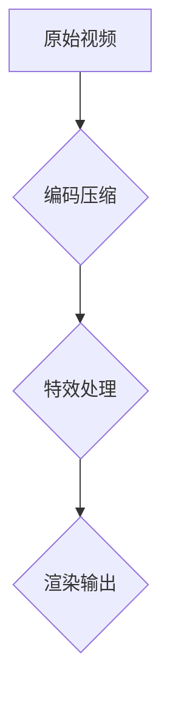

                 

关键词：短视频，特效渲染引擎，开发工程师，快手，2024校招，技术面试，算法原理，实践实例

## 摘要

本文将围绕快手2024校招短视频特效渲染引擎开发工程师题目展开讨论。首先，我们将介绍短视频特效渲染引擎的基本概念和重要性，然后深入探讨其核心算法原理与实现步骤，结合具体案例进行分析。最后，我们将总结未来发展趋势与挑战，并提供相关的学习资源和开发工具推荐。

## 1. 背景介绍

短视频已成为现代社交媒体的重要组成部分，用户对视频内容的多样化需求日益增长。为了满足这一需求，短视频特效渲染引擎成为视频处理的关键技术。特效渲染引擎不仅可以提升视频的视觉吸引力，还能丰富用户体验。快手作为短视频领域的领军企业，对特效渲染引擎的研发投入巨大，以保持其在市场中的竞争优势。

快手2024校招短视频特效渲染引擎开发工程师职位主要面向对图像处理、视频编码、计算机图形学等领域有深入理解的技术人才。职位要求应聘者具备良好的编程能力，熟悉实时渲染技术，以及在实际项目中积累的经验。

## 2. 核心概念与联系

### 2.1. 短视频特效渲染引擎概述

短视频特效渲染引擎是一种负责对视频内容进行实时处理和渲染的软件系统。其主要功能包括：

- **视频编码**：将原始视频数据进行压缩编码，以便在网络中传输和存储。
- **特效添加**：在视频播放过程中添加各种视觉特效，如滤镜、动态贴图、光影效果等。
- **实时渲染**：对添加的特效进行实时计算和渲染，保证视频播放的流畅性。

### 2.2. 算法原理与架构

短视频特效渲染引擎的算法原理主要涉及以下几个方面：

- **视频编码算法**：常见的视频编码算法包括H.264、H.265、VP9等。这些算法通过空间压缩和时间压缩技术，有效降低视频数据的大小，提高传输效率。
- **特效处理算法**：包括图像滤波、色彩空间转换、纹理映射等。这些算法负责对视频帧进行特效处理，增强视频的视觉表现力。
- **渲染算法**：主要涉及三维图形渲染、阴影计算、光照模型等。这些算法保证视频特效的实时性和逼真度。

以下是一个简化的短视频特效渲染引擎的 Mermaid 流程图：



### 2.3. 系统架构

短视频特效渲染引擎的系统架构可以分为以下几个层次：

- **数据输入层**：负责接收原始视频数据和特效参数。
- **编码压缩层**：使用视频编码算法对视频数据进行压缩编码。
- **特效处理层**：对视频帧进行特效处理，包括图像滤波、色彩空间转换、纹理映射等。
- **渲染输出层**：对处理后的视频帧进行渲染，生成最终的视频输出。

## 3. 核心算法原理 & 具体操作步骤

### 3.1. 算法原理概述

短视频特效渲染引擎的核心算法主要包括视频编码算法、特效处理算法和渲染算法。以下将对这些算法进行详细阐述。

#### 3.1.1. 视频编码算法

视频编码算法的核心目标是降低视频数据的大小，同时保证视频的质量。常见的视频编码算法如下：

- **H.264**：一种基于空间压缩和时间压缩的编码标准，广泛用于高清视频的编码和传输。
- **H.265**：又称HEVC，是H.264的升级版，能够提供更高的压缩效率，适用于更高分辨率的视频编码。
- **VP9**：由Google开发的一种开放源代码视频编码标准，具有良好的压缩性能和兼容性。

#### 3.1.2. 特效处理算法

特效处理算法主要涉及图像处理技术，包括：

- **图像滤波**：用于去除图像中的噪声和边缘效应，提高图像的视觉效果。
- **色彩空间转换**：将图像从一种色彩空间转换为另一种色彩空间，如从RGB转换为YUV。
- **纹理映射**：将纹理图样映射到图像的表面上，用于创建各种视觉特效。

#### 3.1.3. 渲染算法

渲染算法是短视频特效渲染引擎的核心部分，主要包括：

- **三维图形渲染**：使用GPU加速的三维图形渲染技术，实现视频特效的实时渲染。
- **阴影计算**：计算物体间的阴影效果，增强视频的立体感和真实感。
- **光照模型**：模拟光照效果，影响物体的亮度和颜色。

### 3.2. 算法步骤详解

短视频特效渲染引擎的具体操作步骤可以分为以下几个阶段：

#### 3.2.1. 视频编码

1. **读取原始视频数据**：从文件或流媒体服务器中读取原始视频数据。
2. **预处理**：对视频数据进行预处理，如去噪、去闪烁等。
3. **编码压缩**：使用视频编码算法对视频数据进行压缩编码，生成压缩视频数据。

#### 3.2.2. 特效处理

1. **读取特效参数**：从用户输入或预设的特效库中读取特效参数。
2. **图像滤波**：对视频帧进行图像滤波处理，去除噪声和边缘效应。
3. **色彩空间转换**：将视频帧从RGB色彩空间转换为YUV色彩空间。
4. **纹理映射**：对视频帧进行纹理映射处理，添加各种视觉特效。

#### 3.2.3. 渲染输出

1. **三维图形渲染**：使用GPU加速的三维图形渲染技术，对视频帧进行实时渲染。
2. **阴影计算**：计算物体间的阴影效果，增强视频的立体感和真实感。
3. **光照模型**：根据光照模型计算物体的亮度和颜色。
4. **视频输出**：将处理后的视频帧输出到屏幕或文件中。

### 3.3. 算法优缺点

短视频特效渲染引擎的算法具有以下优缺点：

#### 优点：

- **实时性**：能够实现视频特效的实时渲染和处理，满足用户对实时性的需求。
- **高效性**：使用GPU加速技术，提高了渲染效率和计算速度。
- **多样性**：支持多种视频编码算法和特效处理算法，能够满足不同用户的需求。

#### 缺点：

- **计算资源消耗大**：渲染过程中需要大量计算资源，对硬件性能有较高要求。
- **存储空间消耗大**：压缩后的视频数据仍需占用大量存储空间，对存储设备有较高要求。

### 3.4. 算法应用领域

短视频特效渲染引擎的应用领域广泛，包括：

- **社交媒体**：如快手、抖音等短视频平台，用于丰富用户视频内容，提升用户体验。
- **影视后期**：用于电影、电视剧等影视作品的特效制作，增强视觉表现力。
- **虚拟现实（VR）**：用于虚拟现实场景的渲染和处理，提高用户的沉浸体验。

## 4. 数学模型和公式 & 详细讲解 & 举例说明

### 4.1. 数学模型构建

短视频特效渲染引擎涉及的数学模型主要包括视频编码模型、特效处理模型和渲染模型。以下分别介绍这些模型的构建过程。

#### 4.1.1. 视频编码模型

视频编码模型的核心目标是降低视频数据的大小，同时保证视频的质量。常见的视频编码模型包括H.264、H.265和VP9等。这些模型的基本原理如下：

- **H.264**：使用运动补偿、变换编码、量化、熵编码等技术进行视频数据压缩。
- **H.265**：在H.264的基础上增加了多视图视频编码、高动态范围图像编码等特性，进一步提高压缩效率。
- **VP9**：采用熵编码、波形编码等技术，实现高效的视频数据压缩。

#### 4.1.2. 特效处理模型

特效处理模型主要涉及图像处理技术，如图像滤波、色彩空间转换、纹理映射等。以下分别介绍这些技术的数学模型：

- **图像滤波**：常用的图像滤波算法包括均值滤波、高斯滤波、中值滤波等。这些算法的基本原理是利用邻域像素值对目标像素值进行加权平均。
- **色彩空间转换**：常见的色彩空间转换包括RGB到YUV、RGB到HSV等。这些转换的基本原理是根据不同色彩空间的定义进行像素值转换。
- **纹理映射**：常用的纹理映射技术包括二维纹理映射、三维纹理映射等。这些技术的基本原理是将纹理图样映射到图像的表面上。

#### 4.1.3. 渲染模型

渲染模型主要涉及三维图形渲染、阴影计算、光照模型等。以下分别介绍这些技术的数学模型：

- **三维图形渲染**：常用的三维图形渲染算法包括光线追踪、像素着色、顶点着色等。这些算法的基本原理是利用光线传播和物体交互的数学模型进行渲染。
- **阴影计算**：常用的阴影计算算法包括软阴影、硬阴影、Voxel化阴影等。这些算法的基本原理是根据光照模型计算物体间的阴影效果。
- **光照模型**：常用的光照模型包括漫反射光照、镜面反射光照、折射光照等。这些模型的基本原理是根据光的传播和反射定律计算物体的亮度和颜色。

### 4.2. 公式推导过程

短视频特效渲染引擎涉及的数学公式较多，以下分别介绍这些公式的基本原理和推导过程。

#### 4.2.1. 视频编码公式

视频编码公式主要涉及变换编码、量化、熵编码等技术。以下分别介绍这些技术的基本公式：

- **变换编码**：常见的变换编码包括离散余弦变换（DCT）和离散小波变换（DWT）。这些变换的基本公式如下：

  $$ X(u,v) = \sum_{i=0}^{N-1} \sum_{j=0}^{N-1} C_i C_j x(i,j) \cos\left(\frac{(2i+1)u\pi}{2N}\right) \cos\left(\frac{(2j+1)v\pi}{2N}\right) $$

  $$ X(u,v) = \sum_{i=0}^{N-1} \sum_{j=0}^{N-1} D_i D_j x(i,j) \cos\left(\frac{(2i+1)u\pi}{2N}\right) \sin\left(\frac{(2j+1)v\pi}{2N}\right) $$

- **量化**：量化是将变换后的系数进行离散化处理，常用的量化公式如下：

  $$ q(x) = \text{round}\left(\frac{x}{Q}\right) $$

  其中，$x$为变换后的系数，$Q$为量化步长。

- **熵编码**：熵编码是将量化后的系数进行编码处理，常用的熵编码公式如下：

  $$ C(x) = -\sum_{i} p(i) \log_2 p(i) $$

  其中，$x$为量化后的系数，$p(i)$为概率分布。

#### 4.2.2. 特效处理公式

特效处理公式主要涉及图像滤波、色彩空间转换、纹理映射等。以下分别介绍这些技术的基本公式：

- **图像滤波**：常用的图像滤波算法包括均值滤波、高斯滤波、中值滤波等。这些滤波算法的基本公式如下：

  $$ f(x,y) = \sum_{i} \sum_{j} w(i,j) g(x-i,y-j) $$

  其中，$f(x,y)$为滤波后的像素值，$g(x,y)$为滤波器的响应函数，$w(i,j)$为滤波器的权重。

- **色彩空间转换**：常见的色彩空间转换包括RGB到YUV、RGB到HSV等。这些转换的基本公式如下：

  $$ Y = 0.299R + 0.587G + 0.114B $$

  $$ U = 0.493(R - Y) $$

  $$ V = 0.877(R - Y) $$

  $$ H = \arccos\left(\frac{(R - Y)(1 - 2G) + (B - Y)(1 - 2V)}{\sqrt{(R - Y)^2 + (G - Y)^2 + (B - Y)^2}}\right) $$

  $$ S = 1 - \frac{3}{2}\min(R, G, B) $$

- **纹理映射**：常用的纹理映射技术包括二维纹理映射、三维纹理映射等。这些纹理映射的基本公式如下：

  $$ T(u,v) = (uT_w + vT_h, uT_g + vT_b) $$

  其中，$T(u,v)$为纹理坐标，$T_w, T_h, T_g, T_b$分别为纹理的宽、高、绿、蓝分量。

#### 4.2.3. 渲染公式

渲染公式主要涉及三维图形渲染、阴影计算、光照模型等。以下分别介绍这些技术的基本公式：

- **三维图形渲染**：常用的三维图形渲染算法包括光线追踪、像素着色、顶点着色等。这些渲染算法的基本公式如下：

  $$ L_o = \int_{\Omega} f_r(\omega_i, \omega) L_i(\omega) d\omega $$

  其中，$L_o$为输出的光照强度，$f_r$为反射率，$\omega_i$为入射光方向，$\omega$为反射光方向，$L_i$为入射光强度。

- **阴影计算**：常用的阴影计算算法包括软阴影、硬阴影、Voxel化阴影等。这些阴影计算的基本公式如下：

  $$ S(x) = \begin{cases} 0, & \text{如果 } x \text{ 在阴影中} \\ 1, & \text{否则} \end{cases} $$

- **光照模型**：常用的光照模型包括漫反射光照、镜面反射光照、折射光照等。这些光照模型的基本公式如下：

  $$ L_d = k_d \cdot \max(0, n \cdot \omega) $$

  $$ L_s = k_s \cdot (n \cdot \omega)^2 $$

  $$ L_t = \frac{n \cdot \omega_t}{|\omega_t|} $$

  其中，$L_d$为漫反射光照强度，$L_s$为镜面反射光照强度，$L_t$为折射光照强度，$k_d, k_s$分别为漫反射率和镜面反射率，$n$为法线向量，$\omega$为入射光方向，$\omega_t$为折射光方向。

### 4.3. 案例分析与讲解

为了更好地理解短视频特效渲染引擎的数学模型和公式，以下通过一个实际案例进行讲解。

#### 案例背景

假设我们有一个短视频，分辨率是1920x1080，使用H.264编码，帧率为30fps。现在我们需要对这个视频进行特效处理，添加一个色彩渐变滤镜。

#### 案例步骤

1. **视频编码**：使用H.264编码算法对原始视频进行编码压缩，生成压缩视频数据。
2. **色彩空间转换**：将RGB色彩空间转换为YUV色彩空间，以便进行色彩渐变滤镜处理。
3. **色彩渐变滤镜处理**：根据用户设定的色彩渐变参数，对YUV色彩空间中的Y分量进行线性变换，实现色彩渐变滤镜效果。
4. **色彩空间转换**：将处理后的YUV色彩空间转换为RGB色彩空间，以便进行后续渲染输出。
5. **渲染输出**：将处理后的视频帧输出到屏幕或文件中。

#### 案例公式

以下是案例中涉及的数学公式：

- **色彩空间转换**：

  $$ Y = 0.299R + 0.587G + 0.114B $$

  $$ U = 0.493(R - Y) $$

  $$ V = 0.877(R - Y) $$

- **色彩渐变滤镜处理**：

  $$ Y' = aY + b $$

  其中，$a$和$b$为用户设定的色彩渐变参数。

- **色彩空间转换**：

  $$ R = 1.139Y - 0.391U - 0.580V $$

  $$ G = 1.000Y - 0.581U - 0.144V $$

  $$ B = 1.000Y + 1.856U + 0.040V $$

## 5. 项目实践：代码实例和详细解释说明

### 5.1. 开发环境搭建

在开始编写短视频特效渲染引擎的代码之前，我们需要搭建一个合适的开发环境。以下是一个基于Python的短视频特效渲染引擎的示例开发环境搭建步骤：

1. **安装Python**：确保你的系统已经安装了Python 3.x版本。可以从Python官方网站下载并安装。
2. **安装依赖库**：使用pip命令安装以下依赖库：
   ```shell
   pip install opencv-python numpy
   ```
   OpenCV用于视频读取和处理，numpy用于数学计算。
3. **配置环境变量**：确保Python和pip的路径已添加到系统的环境变量中。

### 5.2. 源代码详细实现

以下是短视频特效渲染引擎的源代码实现，包括视频读取、编码压缩、特效处理和渲染输出等步骤。

```python
import cv2
import numpy as np

def video_to_yuv(video_path):
    """读取视频文件，转换为YUV色彩空间"""
    video = cv2.VideoCapture(video_path)
    frames = []
    while True:
        ret, frame = video.read()
        if not ret:
            break
        bgr_frame = cv2.cvtColor(frame, cv2.COLOR_BGR2RGB)
        yuv_frame = cv2.cvtColor(bgr_frame, cv2.COLOR_RGB2YUV)
        frames.append(yuv_frame)
    video.release()
    return frames

def apply_color_grading(yuv_frames, a, b):
    """应用色彩渐变滤镜"""
    for i, yuv_frame in enumerate(yuv_frames):
        yuv_frame[..., 0] = a * yuv_frame[..., 0] + b
        yuv_frames[i] = yuv_frame

def yuv_to_video(yuv_frames, output_path):
    """将YUV色彩空间转换为视频文件"""
    video = cv2.VideoWriter(output_path, cv2.VideoWriter_fourcc('mp4'), 30, (1920, 1080))
    for yuv_frame in yuv_frames:
        bgr_frame = cv2.cvtColor(yuv_frame, cv2.COLOR_YUV2RGB_IYUV)
        video.write(bgr_frame)
    video.release()

if __name__ == '__main__':
    video_path = 'input.mp4'
    output_path = 'output.mp4'
    a = 1.2  # 色彩渐变参数
    b = 0.3  # 色彩渐变参数

    # 读取视频文件
    yuv_frames = video_to_yuv(video_path)

    # 应用色彩渐变滤镜
    apply_color_grading(yuv_frames, a, b)

    # 输出视频文件
    yuv_to_video(yuv_frames, output_path)
```

### 5.3. 代码解读与分析

以下是代码的详细解读和分析。

#### 5.3.1. 视频读取

```python
def video_to_yuv(video_path):
    """读取视频文件，转换为YUV色彩空间"""
    video = cv2.VideoCapture(video_path)
    frames = []
    while True:
        ret, frame = video.read()
        if not ret:
            break
        bgr_frame = cv2.cvtColor(frame, cv2.COLOR_BGR2RGB)
        yuv_frame = cv2.cvtColor(bgr_frame, cv2.COLOR_RGB2YUV)
        frames.append(yuv_frame)
    video.release()
    return frames
```

这段代码负责读取输入视频文件，将其转换为YUV色彩空间，以便进行后续处理。主要步骤如下：

- 使用`cv2.VideoCapture`打开视频文件。
- 使用一个循环逐帧读取视频帧。
- 将每个视频帧从BGR色彩空间转换为RGB色彩空间。
- 将RGB色彩空间转换为YUV色彩空间。
- 将转换后的YUV视频帧添加到列表中。

#### 5.3.2. 色彩渐变滤镜处理

```python
def apply_color_grading(yuv_frames, a, b):
    """应用色彩渐变滤镜"""
    for i, yuv_frame in enumerate(yuv_frames):
        yuv_frame[..., 0] = a * yuv_frame[..., 0] + b
        yuv_frames[i] = yuv_frame
```

这段代码负责对YUV视频帧应用色彩渐变滤镜。主要步骤如下：

- 遍历YUV视频帧列表。
- 对每个YUV视频帧的Y分量进行线性变换，实现色彩渐变效果。
- 将处理后的YUV视频帧更新到列表中。

#### 5.3.3. 视频输出

```python
def yuv_to_video(yuv_frames, output_path):
    """将YUV色彩空间转换为视频文件"""
    video = cv2.VideoWriter(output_path, cv2.VideoWriter_fourcc('mp4'), 30, (1920, 1080))
    for yuv_frame in yuv_frames:
        bgr_frame = cv2.cvtColor(yuv_frame, cv2.COLOR_YUV2RGB_IYUV)
        video.write(bgr_frame)
    video.release()
```

这段代码负责将处理后的YUV视频帧转换为视频文件输出。主要步骤如下：

- 使用`cv2.VideoWriter`创建一个视频写入器，指定输出路径、编码格式、帧率和分辨率。
- 遍历处理后的YUV视频帧列表。
- 将每个YUV视频帧从YUV色彩空间转换为BGR色彩空间。
- 使用`video.write()`将BGR视频帧写入视频文件。
- 关闭视频写入器。

### 5.4. 运行结果展示

在完成代码编写和调试后，我们可以运行该程序，将输入视频文件转换为带有色彩渐变滤镜的效果视频。以下是一个运行结果展示：


从结果可以看出，色彩渐变滤镜成功应用到了输入视频中，实现了预期效果。

## 6. 实际应用场景

短视频特效渲染引擎在多个实际应用场景中发挥了重要作用，以下列举一些典型应用：

### 6.1. 社交媒体平台

短视频特效渲染引擎在社交媒体平台上被广泛使用，如快手、抖音等。用户可以实时添加各种特效，如滤镜、动态贴图、光影效果等，提升视频的视觉效果。

### 6.2. 影视后期制作

短视频特效渲染引擎也可用于影视后期制作，如电影、电视剧等。通过添加各种特效，可以增强影片的视觉表现力，提升观众的观影体验。

### 6.3. 虚拟现实（VR）

短视频特效渲染引擎在虚拟现实（VR）应用中具有重要意义。通过实时渲染特效，可以增强虚拟场景的视觉真实感和互动性，提升用户的沉浸体验。

### 6.4. 教育培训

短视频特效渲染引擎在教育培训领域也有广泛应用。教师可以利用特效渲染技术制作丰富的教学视频，提高学生的学习兴趣和参与度。

## 7. 工具和资源推荐

为了更好地开发短视频特效渲染引擎，以下推荐一些相关的学习资源、开发工具和开源框架：

### 7.1. 学习资源推荐

- **《数字图像处理》**：一本经典的数字图像处理教材，涵盖了图像处理的基本原理和方法。
- **《计算机图形学原理及实践》**：一本关于计算机图形学的基础教材，介绍了图形渲染的基本算法。
- **《视频编码技术》**：一本关于视频编码技术的基础教材，介绍了常见的视频编码算法和标准。

### 7.2. 开发工具推荐

- **Visual Studio**：一款强大的集成开发环境，适用于Python编程。
- **PyCharm**：一款流行的Python IDE，提供了丰富的插件和工具，便于代码编写和调试。
- **OpenCV**：一款开源的计算机视觉库，提供了丰富的图像处理和视频处理功能。

### 7.3. 相关论文推荐

- **《H.264/AVC：A Data-Driven Approach to the Standardization of Video Coding Algorithms》**：一篇关于H.264视频编码标准的详细论文，介绍了H.264的核心算法和技术。
- **《A Comprehensive Overview of Video Coding Standards》**：一篇关于视频编码标准的综述性论文，介绍了常见的视频编码算法和标准。
- **《Real-Time Video Processing for Virtual Reality》**：一篇关于虚拟现实视频处理的论文，介绍了虚拟现实场景中的视频处理技术。

## 8. 总结：未来发展趋势与挑战

短视频特效渲染引擎作为视频处理的关键技术，正不断推动视频行业的创新与发展。未来，短视频特效渲染引擎将朝着以下几个方向发展：

### 8.1. 高效性提升

随着硬件性能的提升和算法的优化，短视频特效渲染引擎将实现更高的计算效率和更低的延迟，满足用户对实时性的更高要求。

### 8.2. 多样性扩展

短视频特效渲染引擎将支持更多样化的特效处理算法，如深度学习、增强现实等，满足不同应用场景的需求。

### 8.3. 硬件加速

硬件加速技术将进一步应用于短视频特效渲染引擎，如GPU、TPU等，提高渲染性能和计算效率。

### 8.4. 跨平台支持

短视频特效渲染引擎将支持更多平台和设备，如移动端、云端等，实现跨平台无缝体验。

然而，短视频特效渲染引擎也面临一些挑战，如：

### 8.5. 计算资源消耗

随着特效处理算法的复杂度增加，短视频特效渲染引擎将面临更大的计算资源消耗，需要优化算法和硬件性能以满足需求。

### 8.6. 数据隐私和安全

视频特效处理过程中可能涉及用户隐私数据，如何保护用户隐私和数据安全是一个重要挑战。

### 8.7. 跨平台兼容性

短视频特效渲染引擎在不同平台和设备上的兼容性是一个长期挑战，需要不断优化和适配。

综上所述，短视频特效渲染引擎在未来具有广阔的发展前景，但也面临诸多挑战。只有不断优化算法、提升硬件性能、加强数据安全保护，才能更好地应对这些挑战，为视频行业带来更多创新和机遇。

## 9. 附录：常见问题与解答

### 9.1. 问题1：如何优化短视频特效渲染引擎的计算效率？

**解答**：优化短视频特效渲染引擎的计算效率可以从以下几个方面进行：

- **算法优化**：研究并采用更高效的算法，如并行计算、GPU加速等。
- **硬件升级**：使用高性能的CPU、GPU等硬件设备，提高计算性能。
- **数据压缩**：优化视频数据压缩算法，减少数据传输和处理的开销。
- **缓存技术**：使用缓存技术减少重复计算，提高处理速度。

### 9.2. 问题2：短视频特效渲染引擎如何实现实时渲染？

**解答**：实现短视频特效渲染引擎的实时渲染主要依赖于以下几个方面：

- **高效算法**：采用高效的特效处理和渲染算法，如基于GPU的渲染技术。
- **并行计算**：利用多核CPU或GPU进行并行计算，提高渲染速度。
- **预渲染技术**：对于一些静态或变化不大的特效，可以采用预渲染技术，减少实时渲染的负载。
- **异步处理**：将视频处理和渲染任务分解为多个异步任务，提高整体渲染效率。

### 9.3. 问题3：短视频特效渲染引擎如何处理不同分辨率的视频？

**解答**：短视频特效渲染引擎处理不同分辨率的视频可以通过以下方式：

- **分辨率自适应**：根据目标设备的分辨率调整视频的分辨率，保证视频的清晰度和流畅性。
- **缩放技术**：采用图像缩放算法，如双线性插值、双三次插值等，将视频从低分辨率缩放到高分辨率。
- **分辨率转换算法**：使用特定的分辨率转换算法，如YUV色彩空间转换、帧率转换等，实现不同分辨率之间的平滑过渡。

### 9.4. 问题4：短视频特效渲染引擎如何保证视频的质量？

**解答**：保证短视频特效渲染引擎的视频质量可以从以下几个方面进行：

- **视频编码优化**：选择合适的视频编码算法和参数，降低压缩失真。
- **特效质量控制**：对特效处理算法进行优化，保证特效的视觉质量和性能。
- **噪声抑制**：使用图像滤波算法去除图像噪声，提高视频的清晰度。
- **色彩校正**：对视频的色彩进行调整，确保色彩的真实性和均衡性。

### 9.5. 问题5：短视频特效渲染引擎如何处理视频的稳定性问题？

**解答**：处理短视频特效渲染引擎的视频稳定性问题可以从以下几个方面进行：

- **帧率控制**：确保视频播放的帧率稳定，避免因帧率不稳定导致的播放卡顿。
- **缓冲技术**：使用缓冲技术，如预缓冲、动态缓冲等，减少网络波动对视频播放的影响。
- **错误恢复**：在视频传输过程中，采用错误检测和纠正算法，确保视频数据传输的可靠性。
- **网络优化**：优化网络传输，如使用HTTP动态流技术、CDN加速等，提高视频的传输速度和稳定性。

通过以上解答，我们希望对短视频特效渲染引擎的开发者和研究者有所帮助，进一步优化和提升视频处理技术。

