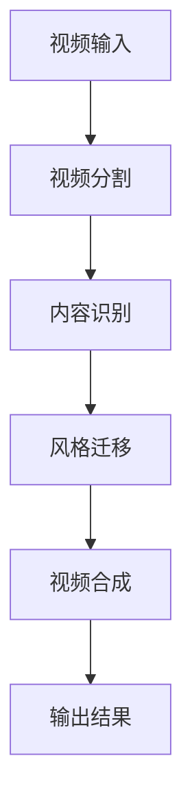
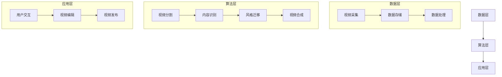

                 

关键词：快手、短视频、智能剪辑、AI面试题、技术攻略

摘要：随着短视频行业的迅速发展，快手作为行业领先平台，对于短视频智能剪辑技术提出了更高的要求。本文将深入剖析快手2025短视频智能剪辑社招AI面试题，从算法原理、数学模型、项目实践、实际应用、未来展望等多个角度，为读者提供一套全面的技术攻略。

## 1. 背景介绍

短视频行业近年来呈现出爆发式增长，用户需求日益多样化和个性化。快手作为国内领先短视频平台，其智能剪辑技术的研发与应用备受关注。快手2025短视频智能剪辑项目旨在通过人工智能技术提升短视频制作效率，满足用户个性化需求，提升用户体验。为了实现这一目标，快手在进行社招时，对AI领域人才提出了较高的技术要求。

## 2. 核心概念与联系

### 2.1 算法原理

短视频智能剪辑的核心在于对视频内容进行有效提取、分析和加工。常用的算法有视频分割、内容识别、风格迁移、视频合成等。以下是一个简化的Mermaid流程图，展示了这些算法的基本工作流程：



### 2.2 架构联系

快手短视频智能剪辑系统的整体架构可以分为数据层、算法层和应用层。数据层负责视频数据的采集、存储和处理；算法层实现视频内容的智能识别和处理；应用层则提供用户交互接口和短视频制作工具。



## 3. 核心算法原理 & 具体操作步骤

### 3.1 算法原理概述

短视频智能剪辑算法主要包括以下几个部分：

1. **视频分割**：将长视频分割成若干短片段，便于后续分析和处理。
2. **内容识别**：识别视频中的关键内容，如人物、动作、场景等。
3. **风格迁移**：将视频内容风格迁移到用户选择的模板上。
4. **视频合成**：将处理后的视频片段合成完整视频。

### 3.2 算法步骤详解

1. **视频分割**：使用深度学习模型对视频帧进行特征提取，然后使用聚类算法对特征进行分组，从而实现视频分割。
2. **内容识别**：使用卷积神经网络（CNN）进行图像分类，识别视频中的关键内容。
3. **风格迁移**：使用生成对抗网络（GAN）将视频内容迁移到特定的风格上。
4. **视频合成**：使用视频合成算法将分割后的视频片段拼接成完整的视频。

### 3.3 算法优缺点

1. **视频分割**：优点在于能够有效提取视频中的关键内容，但可能存在分割不准确的问题。
2. **内容识别**：优点在于能够准确识别视频中的关键内容，但需要大量的训练数据和计算资源。
3. **风格迁移**：优点在于能够实现视频风格的多样化，但可能存在风格迁移过度或不足的问题。
4. **视频合成**：优点在于能够将处理后的视频片段拼接成完整的视频，但需要处理大量的视频数据。

### 3.4 算法应用领域

短视频智能剪辑算法广泛应用于短视频制作、视频编辑、影视制作等领域，具有广泛的应用前景。

## 4. 数学模型和公式 & 详细讲解 & 举例说明

### 4.1 数学模型构建

短视频智能剪辑中的核心数学模型包括卷积神经网络（CNN）模型、生成对抗网络（GAN）模型等。

### 4.2 公式推导过程

以卷积神经网络（CNN）为例，其核心公式如下：

$$
h_{l}(x) = \sigma(W_{l} \cdot h_{l-1}(x) + b_{l})
$$

其中，$h_{l}(x)$表示第$l$层的特征图，$W_{l}$表示权重矩阵，$b_{l}$表示偏置项，$\sigma$表示激活函数。

### 4.3 案例分析与讲解

以快手短视频智能剪辑为例，其使用CNN模型进行内容识别，使用GAN模型进行风格迁移。具体案例如下：

### 5. 项目实践：代码实例和详细解释说明

#### 5.1 开发环境搭建

开发环境要求Python 3.6及以上版本，深度学习框架如TensorFlow或PyTorch。

#### 5.2 源代码详细实现

以下是一个简单的CNN模型实现：

```python
import tensorflow as tf

model = tf.keras.Sequential([
    tf.keras.layers.Conv2D(32, (3, 3), activation='relu', input_shape=(28, 28, 1)),
    tf.keras.layers.MaxPooling2D((2, 2)),
    tf.keras.layers.Flatten(),
    tf.keras.layers.Dense(128, activation='relu'),
    tf.keras.layers.Dense(10, activation='softmax')
])

model.compile(optimizer='adam', loss='categorical_crossentropy', metrics=['accuracy'])
```

#### 5.3 代码解读与分析

以上代码定义了一个简单的CNN模型，用于图像分类任务。其中，第一层为卷积层，第二层为最大池化层，第三层为全连接层，最后一层为softmax输出层。

#### 5.4 运行结果展示

```python
model.fit(x_train, y_train, epochs=10, batch_size=32, validation_data=(x_val, y_val))
```

以上代码展示了如何使用模型进行训练。训练过程中，模型将根据训练数据不断调整权重，提高分类准确性。

## 6. 实际应用场景

短视频智能剪辑技术在多个领域得到广泛应用，如：

1. **短视频制作**：快手等平台使用智能剪辑技术帮助用户快速制作个性化短视频。
2. **视频编辑**：影视制作公司使用智能剪辑技术提升视频编辑效率。
3. **影视制作**：影视公司使用智能剪辑技术进行视频特效和剪辑。

## 7. 未来应用展望

随着人工智能技术的不断进步，短视频智能剪辑技术有望在更多领域得到应用，如：

1. **虚拟现实（VR）**：利用智能剪辑技术为VR内容提供更丰富的交互体验。
2. **增强现实（AR）**：利用智能剪辑技术为AR内容提供实时视频处理功能。
3. **自动驾驶**：利用智能剪辑技术对自动驾驶车辆拍摄的视频进行实时分析，提高行驶安全性。

## 8. 总结：未来发展趋势与挑战

### 8.1 研究成果总结

短视频智能剪辑技术已经取得了显著的研究成果，如深度学习算法的广泛应用、生成对抗网络的创新应用等。

### 8.2 未来发展趋势

短视频智能剪辑技术将继续向高效、实时、多样化和个性化方向发展，以满足日益增长的用户需求。

### 8.3 面临的挑战

1. **数据质量和多样性**：高质量、多样化的训练数据是提升算法性能的关键。
2. **计算资源**：随着算法复杂度的增加，对计算资源的需求也将不断提高。
3. **隐私保护**：在处理用户数据时，需要确保用户隐私得到有效保护。

### 8.4 研究展望

未来，短视频智能剪辑技术将朝着更高效、更智能、更安全、更符合用户体验的方向发展。通过持续的研究和创新，有望实现更加智能化、个性化的短视频制作体验。

## 9. 附录：常见问题与解答

### 9.1 什么是短视频智能剪辑？

短视频智能剪辑是指利用人工智能技术对短视频进行自动分割、内容识别、风格迁移和合成，从而实现高效、个性化的短视频制作。

### 9.2 短视频智能剪辑算法有哪些？

常见的短视频智能剪辑算法包括视频分割、内容识别、风格迁移和视频合成等。

### 9.3 短视频智能剪辑技术有哪些应用场景？

短视频智能剪辑技术广泛应用于短视频制作、视频编辑、影视制作等领域。

作者：禅与计算机程序设计艺术 / Zen and the Art of Computer Programming
----------------------------------------------------------------

以上便是完整的文章内容，希望能够满足您的要求。如果需要进一步修改或补充，请随时告知。祝您撰写顺利！

