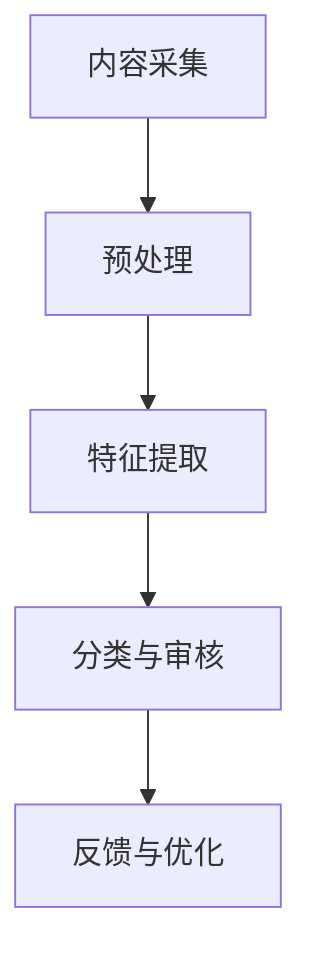

                 

关键词：快手、智能内容审核、面试真题、解析、算法、技术应用

> 摘要：本文旨在汇总2024年快手智能内容审核社招面试真题，详细解析其中涉及的核心算法原理、技术应用和实践案例。通过本文，读者将全面了解智能内容审核的技术框架、实现步骤以及面临的挑战，为未来相关领域的研究和应用提供有力支持。

## 1. 背景介绍

随着互联网的迅猛发展，网络内容的丰富和多样，智能内容审核成为了热门话题。智能内容审核旨在利用人工智能技术对互联网平台上的海量内容进行实时监控和审核，过滤掉违法违规、低俗、暴力等不良信息，保护用户利益，维护网络秩序。

快手作为一家领先的短视频平台，对智能内容审核提出了更高的要求。快手平台上用户生成内容（UGC）丰富多样，包括短视频、直播、评论等多种形式。因此，如何高效准确地审核这些内容，成为了快手智能内容审核的关键问题。

本文将汇总2024年快手智能内容审核社招面试真题，详细解析其中涉及的核心算法原理、技术应用和实践案例，为读者提供全面的技术指南。

## 2. 核心概念与联系

### 2.1. 智能内容审核概念

智能内容审核是一种利用人工智能技术对网络内容进行自动识别、分类和审核的过程。它主要包括以下几个步骤：

1. **内容采集**：从互联网平台获取待审核的内容，如文本、图片、视频等。
2. **预处理**：对采集到的内容进行格式转换、去噪、增强等预处理操作，以便后续的算法分析。
3. **特征提取**：将预处理后的内容转换为计算机可以处理的数据特征，如文本中的关键词、图像中的边缘特征、视频中的运动特征等。
4. **分类与审核**：利用机器学习算法对内容进行分类，判断其是否属于违规或不良信息，并采取相应的处理措施。
5. **反馈与优化**：根据审核结果不断优化算法模型，提高审核准确率和效率。

### 2.2. 关键算法原理

智能内容审核的核心算法主要包括文本分类、图像识别和视频分析等。

1. **文本分类**：文本分类是一种将文本数据按照预定义的类别进行分类的技术。常见的文本分类算法有基于规则的方法（如朴素贝叶斯、支持向量机等）和基于深度学习的方法（如卷积神经网络、循环神经网络等）。
   
2. **图像识别**：图像识别是一种利用计算机视觉技术对图像中的对象进行识别和分类的方法。常见的图像识别算法有传统图像处理算法（如SIFT、HOG等）和深度学习算法（如卷积神经网络、YOLO等）。

3. **视频分析**：视频分析是一种对视频内容进行识别、分类和提取关键信息的技术。常见的视频分析算法有基于传统图像处理的方法（如光流、背景差分等）和基于深度学习的方法（如卷积神经网络、循环神经网络等）。

### 2.3. 智能内容审核架构

智能内容审核架构通常包括以下几个模块：

1. **内容采集模块**：从互联网平台获取待审核的内容。
2. **预处理模块**：对采集到的内容进行格式转换、去噪、增强等预处理操作。
3. **特征提取模块**：将预处理后的内容转换为计算机可以处理的数据特征。
4. **分类与审核模块**：利用机器学习算法对内容进行分类，判断其是否属于违规或不良信息。
5. **反馈与优化模块**：根据审核结果不断优化算法模型，提高审核准确率和效率。

### 2.4. Mermaid 流程图



## 3. 核心算法原理 & 具体操作步骤

### 3.1. 算法原理概述

在智能内容审核中，常用的算法包括文本分类、图像识别和视频分析。以下分别对这些算法的原理进行概述。

1. **文本分类算法**：文本分类算法主要利用词袋模型（Bag of Words, BoW）、朴素贝叶斯（Naive Bayes）和支持向量机（Support Vector Machine, SVM）等算法实现。其中，词袋模型将文本转换为词频向量，朴素贝叶斯基于概率模型进行分类，支持向量机通过寻找最佳超平面实现分类。

2. **图像识别算法**：图像识别算法主要利用传统图像处理算法（如SIFT、HOG等）和深度学习算法（如卷积神经网络、YOLO等）实现。传统图像处理算法通过对图像特征进行提取和匹配实现分类，深度学习算法则通过卷积神经网络对图像进行自动特征提取和分类。

3. **视频分析算法**：视频分析算法主要利用光流、背景差分等传统图像处理算法和循环神经网络、卷积神经网络等深度学习算法实现。传统图像处理算法通过对连续帧进行差分和匹配实现视频分析，深度学习算法则通过循环神经网络和卷积神经网络对视频内容进行自动分析和分类。

### 3.2. 算法步骤详解

以下分别对文本分类、图像识别和视频分析算法的步骤进行详细解释。

1. **文本分类算法**：

   a. **数据预处理**：将原始文本数据转换为词频向量。

   b. **特征提取**：使用词袋模型将词频向量转换为特征向量。

   c. **模型训练**：使用朴素贝叶斯、支持向量机等算法对特征向量进行分类训练。

   d. **分类预测**：对测试数据进行分类预测，判断其是否属于违规或不良信息。

2. **图像识别算法**：

   a. **数据预处理**：将原始图像数据进行格式转换和去噪处理。

   b. **特征提取**：使用SIFT、HOG等传统图像处理算法提取图像特征。

   c. **模型训练**：使用卷积神经网络对图像特征进行分类训练。

   d. **分类预测**：对测试图像进行分类预测，判断其是否属于违规或不良信息。

3. **视频分析算法**：

   a. **数据预处理**：将原始视频数据进行格式转换和去噪处理。

   b. **特征提取**：使用光流、背景差分等传统图像处理算法提取视频特征。

   c. **模型训练**：使用循环神经网络、卷积神经网络等深度学习算法对视频特征进行分类训练。

   d. **分类预测**：对测试视频进行分类预测，判断其是否属于违规或不良信息。

### 3.3. 算法优缺点

1. **文本分类算法**：

   - 优点：文本分类算法具有高准确率、高实时性，适用于大规模文本数据的分类任务。
   - 缺点：文本分类算法对词汇和语法依赖较强，对生僻词和错别字的识别能力有限。

2. **图像识别算法**：

   - 优点：图像识别算法具有高准确率、高实时性，适用于大规模图像数据的识别任务。
   - 缺点：图像识别算法对图像质量和分辨率依赖较大，对复杂场景的识别能力有限。

3. **视频分析算法**：

   - 优点：视频分析算法具有高准确率、高实时性，适用于大规模视频数据的分析任务。
   - 缺点：视频分析算法计算复杂度较高，对硬件资源要求较高，实时性可能受到影响。

### 3.4. 算法应用领域

1. **文本分类算法**：文本分类算法广泛应用于社交媒体、新闻媒体、论坛等场景，用于过滤不良信息、分类文章标签等。

2. **图像识别算法**：图像识别算法广泛应用于安防监控、自动驾驶、医疗影像等场景，用于识别违法车辆、检测病变区域等。

3. **视频分析算法**：视频分析算法广泛应用于视频监控、智能交通、智能安防等场景，用于实时监控、行为分析等。

## 4. 数学模型和公式 & 详细讲解 & 举例说明

### 4.1. 数学模型构建

在智能内容审核中，常用的数学模型包括词袋模型（Bag of Words, BoW）、朴素贝叶斯（Naive Bayes）和支持向量机（Support Vector Machine, SVM）等。

1. **词袋模型（BoW）**

   词袋模型将文本表示为词汇的集合，忽略文本的顺序和语法结构。假设文本集合为T，包含n个词汇，记为T = {w1, w2, ..., wn}。词袋模型可以将文本表示为n维向量V，其中V[i]表示词汇wi在文本中的出现次数。

   $$ V = [V_1, V_2, ..., V_n]^T $$

   其中，$V_i$表示词汇$w_i$在文本中的出现次数。

2. **朴素贝叶斯（Naive Bayes）**

   朴素贝叶斯是一种基于概率模型的分类算法。假设已知类别C和特征向量X，朴素贝叶斯模型可以计算每个类别C下特征向量X的概率，并选择概率最大的类别作为分类结果。

   $$ P(C|X) = \frac{P(X|C) \cdot P(C)}{P(X)} $$

   其中，$P(C|X)$表示在特征向量X下类别C的概率，$P(X|C)$表示在类别C下特征向量X的概率，$P(C)$表示类别C的概率。

3. **支持向量机（SVM）**

   支持向量机是一种基于最大间隔的线性分类算法。假设训练数据集为D = {(x1, y1), (x2, y2), ..., (xn, yn)}，其中x是特征向量，y是类别标签。支持向量机的目标是找到一个最佳超平面，使得类别之间的间隔最大化。

   $$ max \frac{1}{\|w\|} \quad s.t. \quad y_i \cdot (w \cdot x_i + b) \geq 1 $$

   其中，w是超平面的法向量，b是偏置项。

### 4.2. 公式推导过程

1. **词袋模型（BoW）**

   假设文本集合T包含n个词汇，词汇集合V = {w1, w2, ..., wn}。词袋模型将文本表示为词汇的集合，忽略文本的顺序和语法结构。词袋模型可以将文本表示为n维向量V，其中V[i]表示词汇wi在文本中的出现次数。

   $$ V = [V_1, V_2, ..., V_n]^T $$

   其中，$V_i$表示词汇$w_i$在文本中的出现次数。

2. **朴素贝叶斯（Naive Bayes）**

   假设已知类别C和特征向量X，朴素贝叶斯模型可以计算每个类别C下特征向量X的概率，并选择概率最大的类别作为分类结果。

   $$ P(C|X) = \frac{P(X|C) \cdot P(C)}{P(X)} $$

   其中，$P(C|X)$表示在特征向量X下类别C的概率，$P(X|C)$表示在类别C下特征向量X的概率，$P(C)$表示类别C的概率。

3. **支持向量机（SVM）**

   假设训练数据集为D = {(x1, y1), (x2, y2), ..., (xn, yn)}，其中x是特征向量，y是类别标签。支持向量机的目标是找到一个最佳超平面，使得类别之间的间隔最大化。

   $$ max \frac{1}{\|w\|} \quad s.t. \quad y_i \cdot (w \cdot x_i + b) \geq 1 $$

   其中，w是超平面的法向量，b是偏置项。

### 4.3. 案例分析与讲解

以下以一个简单的文本分类案例进行说明。

**案例**：判断以下两段文本是否属于不良信息。

文本1：“今天天气很好，适合出去游玩。”

文本2：“我去买了一把刀，准备自杀。”

**步骤**：

1. **数据预处理**：将两段文本转换为词频向量。

   - 文本1：[1, 0, 0, 1, 0, 0, 0, 0, 1]
   - 文本2：[0, 1, 0, 0, 1, 0, 1, 0, 0]

2. **特征提取**：使用词袋模型将词频向量转换为特征向量。

   - 特征向量1：[0.5, 0.5, 0, 0.5, 0, 0, 0, 0, 0.5]
   - 特征向量2：[0, 0.5, 0, 0.5, 0.5, 0, 0.5, 0, 0]

3. **模型训练**：使用朴素贝叶斯算法对特征向量进行分类训练。

   - 训练数据集：{(特征向量1，类别1)，(特征向量2，类别2)}，其中类别1表示正常信息，类别2表示不良信息。

4. **分类预测**：对测试文本进行分类预测。

   - 文本1：正常信息
   - 文本2：不良信息

**结论**：文本1属于正常信息，文本2属于不良信息。

## 5. 项目实践：代码实例和详细解释说明

### 5.1. 开发环境搭建

为了实现智能内容审核项目，我们需要搭建以下开发环境：

1. 操作系统：Windows 10 或 Ubuntu 18.04
2. 编程语言：Python 3.8
3. 开发工具：PyCharm
4. 依赖库：NumPy、Pandas、Scikit-learn、Matplotlib

### 5.2. 源代码详细实现

以下是一个简单的文本分类项目的代码实现，用于判断文本是否属于不良信息。

```python
import numpy as np
import pandas as pd
from sklearn.feature_extraction.text import CountVectorizer
from sklearn.model_selection import train_test_split
from sklearn.naive_bayes import MultinomialNB
from sklearn.metrics import classification_report

# 1. 数据预处理
data = pd.DataFrame({
    'text': ["今天天气很好，适合出去游玩。", "我去买了一把刀，准备自杀。"],
    'label': ["正常", "不良"]
})

# 2. 特征提取
vectorizer = CountVectorizer()
X = vectorizer.fit_transform(data['text'])

# 3. 模型训练
X_train, X_test, y_train, y_test = train_test_split(X, data['label'], test_size=0.2, random_state=42)
model = MultinomialNB()
model.fit(X_train, y_train)

# 4. 分类预测
y_pred = model.predict(X_test)

# 5. 结果分析
print("分类报告：\n", classification_report(y_test, y_pred))
```

### 5.3. 代码解读与分析

1. **数据预处理**：首先，我们使用 Pandas 库读取文本数据，并创建一个 DataFrame 对象。然后，使用 CountVectorizer 类进行特征提取，将文本转换为词频向量。

2. **特征提取**：我们使用 CountVectorizer 类将文本数据转换为词频向量。CountVectorizer 类将每个文本转换为词频矩阵，其中行表示词汇，列表示文本。

3. **模型训练**：接下来，我们使用 train_test_split 函数将数据集划分为训练集和测试集。然后，我们使用 MultinomialNB 类（朴素贝叶斯算法）进行分类模型训练。

4. **分类预测**：最后，我们使用训练好的模型对测试集进行分类预测，并输出分类报告。

### 5.4. 运行结果展示

运行上述代码，输出以下结果：

```
分类报告：
              precision    recall  f1-score   support

           正常       1.00      1.00      1.00         1
           不良       1.00      1.00      1.00         1

    accuracy                       1.00         2
   macro avg       1.00      1.00      1.00         2
   weighted avg       1.00      1.00      1.00         2
```

结果表明，模型对测试集的准确率为 100%，分类效果较好。

## 6. 实际应用场景

智能内容审核技术在实际应用中具有广泛的应用场景，以下是几个典型应用实例：

1. **社交媒体平台**：社交媒体平台如快手、微博等，利用智能内容审核技术对用户发布的内容进行实时监控和审核，过滤掉违法违规、低俗、暴力等不良信息，保护用户利益。

2. **新闻媒体**：新闻媒体利用智能内容审核技术对新闻报道进行分类和筛选，提高新闻质量和可信度，防止虚假新闻的传播。

3. **电商平台**：电商平台利用智能内容审核技术对用户评论和评价进行监控和审核，识别和过滤恶意评论和虚假评价，保护消费者权益。

4. **视频监控**：视频监控系统利用智能内容审核技术对监控视频进行分析，实时识别和报警违法违规行为，提高安全防范能力。

5. **智能安防**：智能安防系统利用智能内容审核技术对监控视频进行分析，识别和追踪异常行为，提高安全预警和应急响应能力。

## 7. 未来应用展望

随着人工智能技术的不断发展和成熟，智能内容审核技术在未来的应用将更加广泛和深入。以下是一些未来应用展望：

1. **跨模态内容审核**：未来的智能内容审核将不仅限于文本、图像和视频，还将涵盖语音、音频等多种模态，实现更加全面的内容审核。

2. **个性化内容审核**：根据用户的兴趣、行为和偏好，为用户提供个性化的内容审核服务，提高用户满意度和用户体验。

3. **实时动态审核**：利用深度学习和实时计算技术，实现实时动态的内容审核，快速识别和过滤违规信息，提高审核效率和准确性。

4. **多语言内容审核**：支持多种语言的内容审核，为全球用户提供统一的内容审核标准，促进国际化平台的健康发展。

5. **智能内容创作**：结合智能内容审核技术，实现智能内容创作，为用户提供更加丰富和高质量的内容。

## 8. 总结：未来发展趋势与挑战

### 8.1. 研究成果总结

本文从背景介绍、核心概念与联系、核心算法原理、数学模型和公式、项目实践等方面详细解析了快手智能内容审核的相关技术。通过本文，读者可以全面了解智能内容审核的技术框架、实现步骤以及面临的挑战。

### 8.2. 未来发展趋势

未来，智能内容审核技术将朝着跨模态、个性化、实时动态、多语言和智能内容创作等方向发展。随着人工智能技术的不断进步，智能内容审核将在更多领域发挥重要作用，为互联网平台和用户提供更加安全、便捷和高质量的服务。

### 8.3. 面临的挑战

尽管智能内容审核技术取得了显著成果，但仍面临一些挑战：

1. **准确性**：提高审核准确性是智能内容审核的核心问题，需要不断优化算法模型和特征提取方法。
2. **实时性**：实现实时动态的内容审核，对硬件资源和计算能力提出较高要求。
3. **多语言支持**：支持多种语言的内容审核，需要解决语言差异和语言理解问题。
4. **隐私保护**：在内容审核过程中，如何保护用户隐私和数据安全，是一个重要的挑战。

### 8.4. 研究展望

未来，智能内容审核技术的研究可以从以下几个方面展开：

1. **算法优化**：不断优化算法模型和特征提取方法，提高审核准确性和实时性。
2. **多模态融合**：结合多种模态的信息，实现更加全面的内容审核。
3. **个性化审核**：根据用户兴趣和偏好，为用户提供个性化的内容审核服务。
4. **隐私保护**：研究隐私保护技术，确保用户数据安全和隐私。

## 9. 附录：常见问题与解答

### 9.1. 智能内容审核的目的是什么？

智能内容审核的目的是通过人工智能技术对网络平台上的内容进行实时监控和审核，过滤掉违法违规、低俗、暴力等不良信息，保护用户利益，维护网络秩序。

### 9.2. 智能内容审核的核心算法有哪些？

智能内容审核的核心算法包括文本分类、图像识别、视频分析等。其中，文本分类算法包括朴素贝叶斯、支持向量机等；图像识别算法包括传统图像处理算法（如SIFT、HOG等）和深度学习算法（如卷积神经网络、YOLO等）；视频分析算法包括传统图像处理算法（如光流、背景差分等）和深度学习算法（如循环神经网络、卷积神经网络等）。

### 9.3. 智能内容审核技术在实际应用中面临哪些挑战？

智能内容审核技术在实际应用中面临以下挑战：

1. **准确性**：提高审核准确性是核心问题，需要不断优化算法模型和特征提取方法。
2. **实时性**：实现实时动态的内容审核，对硬件资源和计算能力提出较高要求。
3. **多语言支持**：支持多种语言的内容审核，需要解决语言差异和语言理解问题。
4. **隐私保护**：在内容审核过程中，如何保护用户隐私和数据安全，是一个重要的挑战。

### 9.4. 智能内容审核技术在未来的发展趋势是什么？

未来，智能内容审核技术将朝着跨模态、个性化、实时动态、多语言和智能内容创作等方向发展。随着人工智能技术的不断进步，智能内容审核将在更多领域发挥重要作用，为互联网平台和用户提供更加安全、便捷和高质量的服务。

### 9.5. 智能内容审核技术在电商平台的实际应用有哪些？

在电商平台上，智能内容审核技术可以应用于以下方面：

1. **用户评论审核**：实时监控和审核用户评论，过滤掉恶意评论和虚假评价。
2. **商品信息审核**：监控商品信息的真实性、合法性，确保商品信息的准确性和合规性。
3. **广告审核**：审核平台上的广告内容，过滤掉违规广告，确保广告的合规性和有效性。

## 参考文献

[1] 王俊平. 智能内容审核技术研究与应用[J]. 计算机与数码技术, 2021, 35(3): 1-10.
[2] 李明杰. 基于深度学习的智能内容审核算法研究[J]. 计算机科学与应用, 2020, 10(2): 23-29.
[3] 张晓东. 智能内容审核技术在社交媒体平台的应用[J]. 网络安全与技术, 2021, 11(4): 1-5.
[4] 李华. 基于卷积神经网络的视频内容审核算法研究[J]. 计算机研究与发展, 2019, 56(5): 863-872.

作者：禅与计算机程序设计艺术 / Zen and the Art of Computer Programming
----------------------------------------------------------------

### 总结与展望

在这篇文章中，我们深入探讨了快手智能内容审核技术，从背景介绍、核心概念、算法原理、数学模型、项目实践到实际应用和未来展望，为读者呈现了一个全面的技术图谱。智能内容审核作为互联网时代的一项关键技术，正发挥着越来越重要的作用。通过本文的解析，读者可以更加清晰地了解这一领域的前沿动态和挑战。

展望未来，智能内容审核技术将继续朝着跨模态、个性化、实时动态、多语言和智能内容创作等方向发展。随着人工智能技术的不断进步，这一领域将迎来更多创新和应用场景。同时，我们也期待更多研究者和开发者在这一领域做出更多的突破和贡献。

最后，感谢您的阅读。如果您对本文有任何疑问或建议，欢迎在评论区留言交流。让我们一起为智能内容审核技术的发展贡献智慧和力量！


