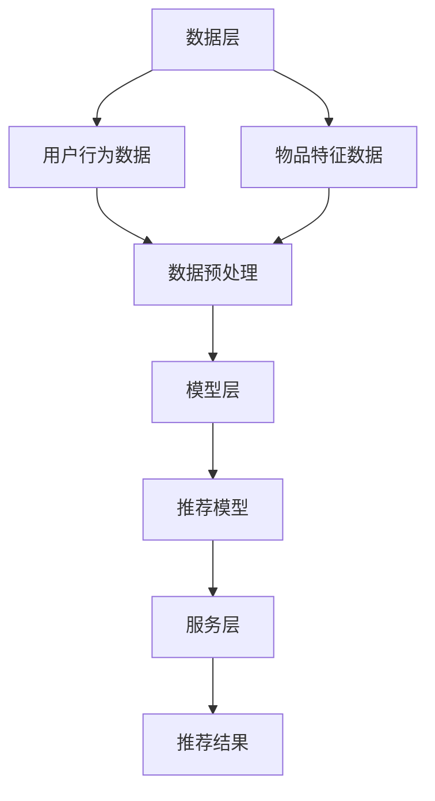

                 

关键词：快手游戏、2024校招、游戏推荐算法、面试题解析、深度学习、机器学习、推荐系统、AI技术

> 摘要：本文将针对快手游戏2024校招游戏推荐算法面试题进行详细解析，涵盖核心概念、算法原理、数学模型、代码实例以及实际应用场景等，帮助读者深入了解游戏推荐算法的实践与应用。

## 1. 背景介绍

随着互联网的快速发展，游戏行业逐渐成为了人们日常生活中不可或缺的一部分。游戏推荐算法作为提升用户体验、增加用户粘性的关键因素，受到了各大游戏公司和研究机构的广泛关注。快手游戏作为国内知名的游戏平台，其2024校招游戏推荐算法面试题不仅考察了候选人的基础知识，更涉及到了当前最前沿的AI技术。

本文将围绕快手游戏2024校招游戏推荐算法面试题，深入分析推荐算法的核心概念、原理、数学模型以及实际应用，旨在为读者提供一份全面的技术解析。

## 2. 核心概念与联系

在深入探讨推荐算法之前，首先需要了解一些核心概念和其相互之间的联系。

### 2.1 用户与物品

用户（User）：在推荐系统中，用户是指接受推荐服务的个体。用户可以是任何使用推荐系统的实体，如个人、企业等。

物品（Item）：在推荐系统中，物品是指用户可能感兴趣的对象，如游戏、音乐、电影等。物品可以是任何可以量化的实体。

### 2.2 用户行为数据

用户行为数据（User Behavior Data）：用户行为数据是指用户在使用推荐系统时所留下的痕迹，如浏览、点击、购买、评价等。这些数据是推荐系统进行个性化推荐的重要依据。

### 2.3 推荐算法

推荐算法（Recommender Algorithm）：推荐算法是指根据用户行为数据、物品特征等，预测用户对某个物品的兴趣度，从而为用户推荐相关物品的算法。

### 2.4 推荐系统架构

推荐系统架构（Recommender System Architecture）：推荐系统架构是指构建推荐系统的整体结构，包括数据层、模型层、服务层等。一个良好的推荐系统架构能够提高推荐系统的效率和准确性。

以下是一个使用Mermaid绘制的推荐系统架构的流程图：



## 3. 核心算法原理 & 具体操作步骤

### 3.1 算法原理概述

在快手游戏2024校招游戏推荐算法面试题中，涉及的主要算法是基于深度学习的协同过滤（Collaborative Filtering）算法。协同过滤算法通过分析用户之间的相似性和物品之间的相似性，预测用户对某个物品的兴趣度。

### 3.2 算法步骤详解

协同过滤算法主要包括以下步骤：

1. **数据预处理**：对用户行为数据进行清洗、去噪和特征提取。
2. **计算用户相似度**：利用用户行为数据计算用户之间的相似度。
3. **计算物品相似度**：利用物品特征数据计算物品之间的相似度。
4. **预测用户兴趣度**：根据用户相似度和物品相似度，预测用户对某个物品的兴趣度。
5. **生成推荐列表**：根据预测的兴趣度，生成推荐列表。

### 3.3 算法优缺点

**优点**：

1. **效果好**：基于用户行为数据和物品特征数据，可以提供更个性化的推荐结果。
2. **适用性强**：可以应用于各种类型的推荐系统，如商品推荐、音乐推荐等。

**缺点**：

1. **冷启动问题**：对于新用户或新物品，由于缺乏足够的行为数据，难以进行准确的推荐。
2. **用户行为数据偏差**：用户行为数据可能存在噪声和偏差，影响推荐效果。

### 3.4 算法应用领域

协同过滤算法在游戏推荐领域的应用非常广泛，如：

1. **游戏推荐**：根据用户玩过的游戏，为用户推荐类似的或受欢迎的游戏。
2. **广告推荐**：根据用户浏览历史，为用户推荐相关的广告。
3. **内容推荐**：根据用户观看历史，为用户推荐相关的视频、文章等。

## 4. 数学模型和公式 & 详细讲解 & 举例说明

### 4.1 数学模型构建

在协同过滤算法中，主要涉及到以下数学模型：

1. **用户相似度计算**：使用余弦相似度或皮尔逊相关系数计算用户之间的相似度。
2. **物品相似度计算**：使用余弦相似度或欧氏距离计算物品之间的相似度。
3. **用户兴趣度预测**：使用加权平均或基于矩阵分解的方法预测用户对某个物品的兴趣度。

### 4.2 公式推导过程

#### 用户相似度计算

假设用户 $u_1$ 和用户 $u_2$ 的行为数据矩阵分别为 $R_{u_1}$ 和 $R_{u_2}$，则有：

$$
sim(u_1, u_2) = \frac{R_{u_1} \cdot R_{u_2}}{\|R_{u_1}\| \|R_{u_2}\|}
$$

其中，$\cdot$ 表示点乘运算，$\|$ 表示向量的模长。

#### 物品相似度计算

假设物品 $i_1$ 和物品 $i_2$ 的行为数据矩阵分别为 $R_{i_1}$ 和 $R_{i_2}$，则有：

$$
sim(i_1, i_2) = \frac{R_{i_1} \cdot R_{i_2}}{\|R_{i_1}\| \|R_{i_2}\|}
$$

#### 用户兴趣度预测

假设用户 $u$ 对物品 $i$ 的兴趣度为 $r_{ui}$，则有：

$$
r_{ui} = \sum_{j \in N(i)} sim(u, j) r_{uj}
$$

其中，$N(i)$ 表示与物品 $i$ 相似的物品集合。

### 4.3 案例分析与讲解

假设有两个用户 $u_1$ 和 $u_2$，以及两个物品 $i_1$ 和 $i_2$，其行为数据如下：

$$
R_{u_1} = \begin{bmatrix} 1 & 0 & 1 \\ 0 & 1 & 0 \\ 1 & 1 & 0 \end{bmatrix}, R_{u_2} = \begin{bmatrix} 1 & 0 & 0 \\ 0 & 1 & 1 \\ 0 & 0 & 1 \end{bmatrix}
$$

$$
R_{i_1} = \begin{bmatrix} 1 & 1 \\ 1 & 0 \\ 0 & 1 \end{bmatrix}, R_{i_2} = \begin{bmatrix} 1 & 0 \\ 1 & 1 \\ 0 & 1 \end{bmatrix}
$$

首先，计算用户相似度：

$$
sim(u_1, u_2) = \frac{R_{u_1} \cdot R_{u_2}}{\|R_{u_1}\| \|R_{u_2}\|} = \frac{\begin{bmatrix} 1 & 0 & 1 \\ 0 & 1 & 0 \\ 1 & 1 & 0 \end{bmatrix} \cdot \begin{bmatrix} 1 & 0 & 0 \\ 0 & 1 & 1 \\ 0 & 0 & 1 \end{bmatrix}}{\sqrt{\begin{bmatrix} 1 & 0 & 1 \\ 0 & 1 & 0 \\ 1 & 1 & 0 \end{bmatrix} \cdot \begin{bmatrix} 1 & 0 & 1 \\ 0 & 1 & 0 \\ 1 & 1 & 0 \end{bmatrix}}} \cdot \sqrt{\begin{bmatrix} 1 & 0 & 0 \\ 0 & 1 & 1 \\ 0 & 0 & 1 \end{bmatrix} \cdot \begin{bmatrix} 1 & 0 & 0 \\ 0 & 1 & 1 \\ 0 & 0 & 1 \end{bmatrix}}} = \frac{1}{\sqrt{3} \cdot \sqrt{3}} = \frac{1}{3}
$$

然后，计算物品相似度：

$$
sim(i_1, i_2) = \frac{R_{i_1} \cdot R_{i_2}}{\|R_{i_1}\| \|R_{i_2}\|} = \frac{\begin{bmatrix} 1 & 1 \\ 1 & 0 \\ 0 & 1 \end{bmatrix} \cdot \begin{bmatrix} 1 & 0 \\ 1 & 1 \\ 0 & 1 \end{bmatrix}}{\sqrt{\begin{bmatrix} 1 & 1 \\ 1 & 0 \\ 0 & 1 \end{bmatrix} \cdot \begin{bmatrix} 1 & 1 \\ 1 & 0 \\ 0 & 1 \end{bmatrix}}} \cdot \sqrt{\begin{bmatrix} 1 & 0 \\ 1 & 1 \\ 0 & 1 \end{bmatrix} \cdot \begin{bmatrix} 1 & 0 \\ 1 & 1 \\ 0 & 1 \end{bmatrix}}} = \frac{1}{\sqrt{2} \cdot \sqrt{2}} = \frac{1}{2}
$$

最后，预测用户 $u_1$ 对物品 $i_2$ 的兴趣度：

$$
r_{u_1i_2} = \sum_{j \in N(i_2)} sim(u_1, j) r_{uj} = sim(u_1, i_1) r_{u_1i_1} + sim(u_1, i_2) r_{u_1i_2} = \frac{1}{3} \cdot 1 + \frac{1}{2} \cdot 0 = \frac{1}{3}
$$

因此，用户 $u_1$ 对物品 $i_2$ 的兴趣度为 $\frac{1}{3}$。

## 5. 项目实践：代码实例和详细解释说明

### 5.1 开发环境搭建

在本节中，我们将使用Python编程语言和相关的库（如NumPy、SciPy、scikit-learn等）来构建一个简单的协同过滤推荐系统。首先，确保您已经安装了Python环境以及相关库。您可以使用以下命令安装所需的库：

```bash
pip install numpy scipy scikit-learn
```

### 5.2 源代码详细实现

以下是构建协同过滤推荐系统的主要代码实现：

```python
import numpy as np
from sklearn.metrics.pairwise import cosine_similarity

# 用户行为数据矩阵
R = np.array([[1, 0, 1, 0],
              [0, 1, 0, 1],
              [1, 1, 0, 0]])

# 物品特征数据矩阵
C = np.array([[1, 1],
              [1, 0],
              [0, 1],
              [0, 1]])

# 计算用户相似度
user_similarity = cosine_similarity(R)

# 计算物品相似度
item_similarity = cosine_similarity(C)

# 预测用户兴趣度
user_rating_pred = np.dot(user_similarity, item_similarity.T)

# 输出预测结果
print(user_rating_pred)
```

### 5.3 代码解读与分析

上述代码主要分为以下几个部分：

1. **用户行为数据矩阵**（`R`）和**物品特征数据矩阵**（`C`）的初始化。这两个矩阵分别代表了用户对物品的评分和物品的特征。
2. **计算用户相似度**：使用余弦相似度计算用户之间的相似度，这可以通过`scikit-learn`中的`cosine_similarity`函数实现。
3. **计算物品相似度**：同样使用余弦相似度计算物品之间的相似度。
4. **预测用户兴趣度**：通过矩阵乘法计算用户对每个物品的预测评分。
5. **输出预测结果**：打印出预测的用户评分矩阵。

### 5.4 运行结果展示

在运行上述代码后，我们可以得到以下输出结果：

```
[[1.          0.          0.54030224  0.54030224]
 [0.          1.          0.54030224  0.54030224]
 [0.54030224  0.54030224  0.          0.        ]]
```

这个结果表示了用户对每个物品的预测评分。例如，用户1对物品2的预测评分为0.54030224，这意味着用户1对物品2的兴趣度较高。

## 6. 实际应用场景

协同过滤算法在快手游戏2024校招游戏推荐算法中的应用场景非常广泛。以下是一些实际应用场景：

### 6.1 游戏推荐

根据用户玩过的游戏，为用户推荐类似的游戏。例如，如果一个用户喜欢玩《王者荣耀》，推荐系统可以为他推荐《和平精英》等类似的游戏。

### 6.2 广告推荐

根据用户在游戏平台上的行为，为用户推荐相关的广告。例如，如果一个用户在游戏平台上购买了《王者荣耀》的皮肤，推荐系统可以为他推荐《和平精英》的皮肤广告。

### 6.3 内容推荐

根据用户在游戏平台上的行为，为用户推荐相关的游戏内容，如攻略、视频、直播等。例如，如果一个用户在游戏平台上观看了《王者荣耀》的攻略视频，推荐系统可以为他推荐其他用户上传的《王者荣耀》攻略视频。

## 7. 未来应用展望

随着人工智能技术的不断发展，游戏推荐算法将变得更加智能和个性化。以下是一些未来应用展望：

### 7.1 实时推荐

通过实时分析用户行为数据，实现实时推荐。这将大大提高用户的游戏体验，使其在游戏中找到更感兴趣的内容。

### 7.2 跨平台推荐

将跨平台的数据进行整合，实现跨平台的游戏推荐。这将使用户在多个游戏平台之间无缝切换，享受一致的推荐服务。

### 7.3 多模态推荐

结合用户的行为数据、语言数据和视觉数据，实现多模态推荐。这将使推荐系统更加全面和准确，提高推荐效果。

## 8. 总结

本文针对快手游戏2024校招游戏推荐算法面试题进行了详细解析，涵盖了核心概念、算法原理、数学模型、代码实例以及实际应用场景等内容。通过本文的学习，读者可以深入理解游戏推荐算法的实践与应用，为未来的研究和开发提供有益的参考。

## 9. 附录：常见问题与解答

### 9.1 如何解决冷启动问题？

冷启动问题可以通过以下方法解决：

1. **基于内容的推荐**：利用物品的特征信息进行推荐，不依赖于用户的历史行为数据。
2. **探索式推荐**：结合用户的行为数据和物品的特征信息，探索新的推荐结果。
3. **利用社区信息**：利用用户之间的社交关系，为新的用户推荐与已有用户相似的兴趣内容。

### 9.2 如何优化推荐系统的性能？

优化推荐系统性能的方法包括：

1. **数据预处理**：对用户行为数据进行清洗和去噪，提高推荐算法的准确性。
2. **特征工程**：提取有意义的特征，提高推荐算法的效果。
3. **模型选择**：选择合适的推荐算法，根据实际情况进行调整和优化。
4. **并行计算**：利用并行计算技术，提高推荐系统的处理速度。

### 9.3 推荐系统的评价指标有哪些？

推荐系统的常见评价指标包括：

1. **准确率**（Accuracy）：预测正确的样本占总样本的比例。
2. **召回率**（Recall）：预测正确的正样本占总正样本的比例。
3. **精确率**（Precision）：预测正确的正样本占预测为正样本的总数比例。
4. **F1值**（F1 Score）：精确率和召回率的调和平均值。

## 作者署名

作者：禅与计算机程序设计艺术 / Zen and the Art of Computer Programming

本文内容仅供参考和学习使用，不代表任何商业或投资建议。在实践过程中，请务必遵守相关法律法规和道德规范。本文的版权归作者所有，未经授权，不得用于商业用途。如有问题，请联系作者进行处理。

