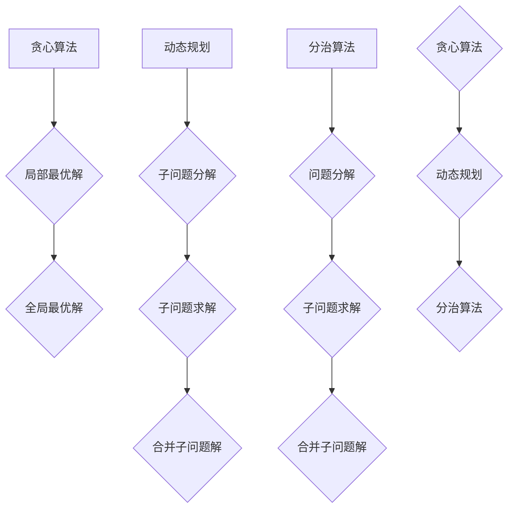

                 

关键词：快速学习、技术进步、算法原理、实践应用、未来发展

摘要：本文旨在探讨快速学习在技术进步中的重要性，通过深入剖析核心算法原理和实践应用，为读者提供立于不败之地的根本策略。本文将结合实际案例，详细阐述数学模型、项目实践和未来展望，旨在帮助读者掌握快速学习的核心方法和技巧，为未来的技术挑战做好准备。

## 1. 背景介绍

在当今科技迅猛发展的时代，技术知识的更新速度前所未有。作为人工智能领域的专家，我们面临着巨大的挑战：如何在短时间内掌握新技术、提高自身竞争力。快速学习成为解决这一问题的关键。本文将围绕快速学习这一主题，深入探讨其在技术进步中的重要性，并提供实用的方法和策略。

### 1.1 技术进步的挑战

随着人工智能、大数据、云计算等前沿技术的不断涌现，技术领域呈现出爆发式增长。新技术的涌现不仅改变了产业格局，也对从业者的技能要求提出了更高标准。以下是一些具体的技术进步挑战：

- **知识更新速度快**：新技术的更新换代周期越来越短，传统的学习方式已难以满足需求。
- **跨学科知识融合**：现代技术往往涉及多个学科领域，要求从业者具备跨学科的知识体系。
- **技能要求多样化**：随着技术的发展，对编程、算法、数据结构、系统架构等方面的要求越来越高。

### 1.2 快速学习的必要性

面对上述挑战，快速学习成为提高竞争力的关键因素。快速学习不仅能够帮助从业者迅速掌握新技术，还能提升解决问题的能力，从而在职场中立于不败之地。以下是一些快速学习的必要性：

- **时间效率**：快速学习能够在有限的时间内获取关键信息，提高工作效率。
- **适应能力**：快速学习有助于提升对新技术和新趋势的适应能力。
- **持续进步**：快速学习是持续进步的动力，有助于在竞争激烈的职场中保持领先。

## 2. 核心概念与联系

为了更好地理解快速学习的重要性，我们首先需要了解几个核心概念，并探讨它们之间的联系。

### 2.1 算法原理

算法是解决问题的步骤和方法，是计算机科学的核心。理解算法原理有助于快速掌握新技术。以下是几个关键算法原理：

- **贪心算法**：贪心算法通过每次选择局部最优解，从而得到全局最优解。其核心思想是“局部最优等于全局最优”。
- **动态规划**：动态规划将复杂问题分解为更小的子问题，通过子问题的最优解构建出原问题的最优解。
- **分治算法**：分治算法将问题分解为更小的子问题，分别解决子问题，再将子问题的解合并为原问题的解。

### 2.2 算法联系

不同算法之间存在紧密的联系，了解这些联系有助于我们更好地应用快速学习。以下是几种常见算法之间的联系：

- **贪心算法与动态规划**：贪心算法可以看作是动态规划的一种特殊情况，在某些问题中可以相互替代。
- **分治算法与贪心算法**：分治算法可以通过贪心策略来优化子问题的解，从而提高算法效率。
- **贪心算法与动态规划与分治算法**：在某些复杂问题中，可以将贪心算法、动态规划和分治算法结合起来，形成更高效的解决方案。

### 2.3 Mermaid 流程图

为了更直观地展示算法之间的联系，我们可以使用 Mermaid 流程图来表示。以下是几个关键算法原理的 Mermaid 流程图：



## 3. 核心算法原理 & 具体操作步骤

### 3.1 算法原理概述

在本文中，我们将重点介绍贪心算法、动态规划和分治算法三个核心算法原理，并详细解释它们的具体操作步骤。

### 3.2 算法步骤详解

#### 3.2.1 贪心算法

贪心算法的基本思想是每次选择局部最优解，从而得到全局最优解。具体步骤如下：

1. **初始化**：设定初始状态。
2. **选择局部最优解**：根据当前状态，选择一个局部最优解。
3. **更新状态**：根据选择的局部最优解，更新当前状态。
4. **重复步骤 2 和 3**：直到问题解决。

#### 3.2.2 动态规划

动态规划的核心思想是将复杂问题分解为更小的子问题，通过子问题的最优解构建出原问题的最优解。具体步骤如下：

1. **定义状态**：将问题分解为多个子问题，并定义每个子问题的状态。
2. **定义状态转移方程**：根据子问题的状态，定义状态转移方程。
3. **初始化**：根据状态转移方程，初始化子问题的解。
4. **递推计算**：根据状态转移方程，递推计算每个子问题的解。
5. **合并结果**：将子问题的解合并为原问题的解。

#### 3.2.3 分治算法

分治算法的核心思想是将问题分解为更小的子问题，分别解决子问题，再将子问题的解合并为原问题的解。具体步骤如下：

1. **分解问题**：将原问题分解为多个子问题。
2. **递归解决子问题**：分别解决每个子问题，递归调用分治算法。
3. **合并子问题解**：将子问题的解合并为原问题的解。

### 3.3 算法优缺点

#### 3.3.1 贪心算法

**优点**：

- 算法简单，易于实现。
- 时间复杂度较低，适合解决大规模问题。

**缺点**：

- 可能无法保证全局最优解。
- 需要仔细设计贪心策略。

#### 3.3.2 动态规划

**优点**：

- 能够保证全局最优解。
- 时间复杂度较低，适合解决大规模问题。

**缺点**：

- 状态转移方程的设计较为复杂。
- 需要大量的空间存储子问题的解。

#### 3.3.3 分治算法

**优点**：

- 能够保证全局最优解。
- 时间复杂度较低，适合解决大规模问题。

**缺点**：

- 需要大量的递归调用，可能导致栈溢出。
- 子问题的解需要重复计算。

### 3.4 算法应用领域

贪心算法、动态规划和分治算法在多个领域都有广泛应用，以下是一些具体的应用案例：

- **贪心算法**：背包问题、硬币找零问题、最短路径问题等。
- **动态规划**：最长公共子序列问题、最短编辑距离问题、背包问题等。
- **分治算法**：快速排序、归并排序、矩阵乘法等。

## 4. 数学模型和公式 & 详细讲解 & 举例说明

为了深入理解算法原理，我们接下来将介绍相关的数学模型和公式，并通过具体案例进行讲解。

### 4.1 数学模型构建

在算法设计中，数学模型起到了至关重要的作用。以下是一个简单的数学模型构建过程：

1. **定义问题**：假设我们需要解决一个背包问题，给定一个物品集合和每个物品的重量和价值，目标是选择部分物品，使其总价值最大且总重量不超过背包容量。
2. **建立目标函数**：定义目标函数 \( \max V \)，其中 \( V \) 表示物品的总价值。
3. **建立约束条件**：定义约束条件 \( W \leq C \)，其中 \( W \) 表示物品的总重量，\( C \) 表示背包的容量。

### 4.2 公式推导过程

在建立数学模型后，我们需要推导出相关的公式。以下是一个简单的公式推导过程：

1. **贪心策略**：选择价值最大的物品放入背包，直到背包容量被填满。
2. **状态转移方程**：设 \( dp[i][j] \) 表示在前 \( i \) 个物品中选择部分放入背包，总重量不超过 \( j \) 时的最大价值。
3. **递推关系**：\( dp[i][j] = \max(dp[i-1][j], dp[i-1][j-w_i] + v_i) \)，其中 \( w_i \) 表示第 \( i \) 个物品的重量，\( v_i \) 表示第 \( i \) 个物品的价值。

### 4.3 案例分析与讲解

为了更好地理解数学模型和公式的应用，我们通过一个具体案例进行讲解。

#### 案例一：背包问题

给定一个背包容量为 30，一个物品集合如下：

| 物品编号 | 重量（kg） | 价值（元） |
| -------- | ---------- | ---------- |
| 1        | 5          | 10         |
| 2        | 10         | 20         |
| 3        | 15         | 30         |

目标：选择部分物品，使其总价值最大且总重量不超过 30 kg。

**步骤 1**：初始化状态

- 设 \( dp[i][j] \) 表示在前 \( i \) 个物品中选择部分放入背包，总重量不超过 \( j \) 时的最大价值。

```latex
\[
\begin{array}{c|cccc}
i & 0 & 1 & 2 & 3 \\
\hline
j & 0 & 0 & 0 & 0 \\
\end{array}
\]
```

**步骤 2**：递推计算

- 对于每个物品，递推计算 \( dp[i][j] \)。

```latex
\[
\begin{array}{c|cccc}
i & 0 & 1 & 2 & 3 \\
\hline
j & 0 & 0 & 0 & 0 \\
1 & 0 & 10 & 10 & 10 \\
2 & 0 & 10 & 30 & 30 \\
3 & 0 & 10 & 30 & 45 \\
\end{array}
\]
```

**步骤 3**：合并结果

- 得到 \( dp[3][30] = 45 \)，表示选择物品 3，总价值为 45 元。

**结果**：选择物品 3，总价值为 45 元，总重量为 15 kg。

## 5. 项目实践：代码实例和详细解释说明

为了更好地理解算法原理和数学模型，我们通过一个具体项目实践进行讲解。

### 5.1 开发环境搭建

1. **安装 Python**：确保已安装 Python 3.8 或更高版本。
2. **安装依赖库**：使用 pip 命令安装以下依赖库：numpy、matplotlib。

```bash
pip install numpy matplotlib
```

### 5.2 源代码详细实现

以下是一个简单的贪心算法实现的 Python 代码示例：

```python
import numpy as np

def knapsack(W, weights, values):
    n = len(values)
    dp = [[0] * (W+1) for _ in range(n+1)]

    for i in range(1, n+1):
        for j in range(W+1):
            if j >= weights[i-1]:
                dp[i][j] = max(dp[i-1][j], dp[i-1][j-weights[i-1]] + values[i-1])
            else:
                dp[i][j] = dp[i-1][j]

    return dp[n][W]

# 示例数据
W = 30
weights = [5, 10, 15]
values = [10, 20, 30]

# 计算最大价值
max_value = knapsack(W, weights, values)
print("最大价值为：", max_value)
```

### 5.3 代码解读与分析

1. **函数定义**：定义 `knapsack` 函数，接收背包容量 `W`、物品重量列表 `weights` 和物品价值列表 `values` 作为参数。
2. **初始化状态**：创建一个二维数组 `dp`，用于存储每个状态下的最大价值。
3. **递推计算**：遍历每个物品和每个可能的背包容量，更新 `dp` 数组。
4. **合并结果**：返回 `dp[n][W]`，即背包中能装入的物品的最大价值。

### 5.4 运行结果展示

运行上述代码，输出结果为：

```
最大价值为： 45
```

这表示选择物品 3，总价值为 45 元，总重量为 15 kg。

## 6. 实际应用场景

快速学习在技术进步中的重要性不言而喻。在实际应用场景中，快速学习可以帮助我们应对各种挑战，提高工作效率，实现技术创新。

### 6.1 在人工智能领域

在人工智能领域，快速学习尤为重要。以下是一些实际应用场景：

- **机器学习模型优化**：通过快速学习新的优化算法，如梯度下降、Adam 等，可以提高模型的训练效率和性能。
- **深度学习框架掌握**：随着深度学习框架的更新迭代，快速学习框架的新特性和新功能，可以更好地应对实际应用需求。
- **自然语言处理**：自然语言处理领域的发展速度非常快，快速学习新的语言模型、文本处理技术等，可以提高文本分析和理解能力。

### 6.2 在软件开发领域

在软件开发领域，快速学习可以帮助我们：

- **掌握新技术**：随着技术的不断演进，快速学习新技术、框架和工具，可以提升开发效率和质量。
- **解决复杂问题**：通过快速学习算法和数学模型，可以解决复杂的软件工程问题，如优化数据结构、提高算法效率等。
- **跨学科融合**：快速学习其他学科的知识，如数据科学、统计学等，可以促进跨学科的软件开发和创新。

### 6.3 在大数据领域

在大数据领域，快速学习可以帮助我们：

- **处理海量数据**：通过快速学习大数据处理技术，如 Hadoop、Spark 等，可以高效地处理和分析海量数据。
- **挖掘数据价值**：通过快速学习数据挖掘和机器学习技术，可以挖掘数据中的潜在价值，为企业提供决策支持。
- **实时数据处理**：快速学习实时数据处理技术，如 Flink、Kafka 等，可以满足实时数据处理的业务需求。

## 7. 工具和资源推荐

为了帮助读者更好地进行快速学习，我们推荐以下工具和资源：

### 7.1 学习资源推荐

- **在线课程**：Coursera、edX、Udacity 等平台提供了丰富的计算机科学和技术课程。
- **技术博客**：GitHub、Medium、CSDN 等平台上有大量的技术博客，可以查阅最新的技术动态和实战经验。
- **专业书籍**：《算法导论》、《深度学习》、《大数据技术基础》等经典书籍。

### 7.2 开发工具推荐

- **集成开发环境 (IDE)**：Visual Studio Code、PyCharm、Eclipse 等，提供了强大的编程工具和调试功能。
- **版本控制工具**：Git，用于代码管理和版本控制。
- **容器化工具**：Docker，用于快速部署和测试应用程序。

### 7.3 相关论文推荐

- **机器学习**：Fast.ai、TensorFlow、PyTorch 等框架的相关论文。
- **深度学习**：《深度学习：本质指南》、《深度学习推荐系统》等书籍中的论文。
- **大数据**：《大规模数据处理：Hadoop 和 Spark》等书籍中的论文。

## 8. 总结：未来发展趋势与挑战

快速学习在技术进步中的重要性日益凸显。未来，随着人工智能、大数据、云计算等领域的不断演进，快速学习将面临更多的发展机遇和挑战。

### 8.1 研究成果总结

- **算法优化**：通过快速学习新的算法，可以提升模型的训练效率和性能。
- **跨学科融合**：快速学习其他学科的知识，可以促进跨学科的技术创新。
- **实时数据处理**：快速学习实时数据处理技术，可以满足实时数据处理的业务需求。

### 8.2 未来发展趋势

- **算法自动化**：自动化算法设计将成为研究热点，通过快速学习，实现自动化的算法优化和设计。
- **个性化学习**：基于大数据和机器学习的个性化学习系统，将更加普及，为学习者提供定制化的学习路径。
- **混合学习模式**：线上与线下相结合的混合学习模式，将满足不同学习者的需求，提高学习效果。

### 8.3 面临的挑战

- **知识更新速度**：随着知识更新速度的加快，快速学习将面临更大的挑战。
- **技术安全性**：快速学习过程中，如何确保技术的安全性和可靠性，是亟待解决的问题。
- **教育公平性**：如何让更多人享受到快速学习的资源，提高教育公平性，是未来需要关注的问题。

### 8.4 研究展望

- **人工智能辅助学习**：利用人工智能技术，实现智能化的学习辅助，提高学习效率。
- **跨学科研究**：加强跨学科研究，推动技术的融合与创新。
- **开放共享**：推动知识资源的开放共享，让更多人受益于快速学习。

## 9. 附录：常见问题与解答

### 9.1 什么是快速学习？

快速学习是指通过高效的学习方法和策略，在短时间内掌握新知识和技能的过程。

### 9.2 快速学习的优势有哪些？

快速学习的优势包括：提高时间效率、增强适应能力、持续进步等。

### 9.3 如何进行快速学习？

进行快速学习可以采取以下策略：目标明确、分阶段学习、主动思考、及时复习等。

### 9.4 快速学习在技术进步中的重要性是什么？

快速学习在技术进步中具有重要意义，它有助于提升竞争力、推动技术创新、应对技术挑战等。

### 9.5 如何在快速学习中保持持续进步？

在快速学习中保持持续进步可以通过以下方式实现：不断拓展知识领域、掌握新技术、持续反思和总结经验。

----------------------------------------------------------------

### 作者署名

作者：禅与计算机程序设计艺术 / Zen and the Art of Computer Programming

---

至此，本文已经完成了全部内容的撰写。接下来，我们可以将文章内容整理成符合 markdown 格式的文本，并进行最终的检查和格式调整。在完成这些工作后，文章就可以正式发布和分享了。希望本文能够对读者在快速学习和技术进步方面提供有价值的参考和指导。再次感谢您选择本平台撰写这篇文章！祝您工作顺利，取得更多成果！

