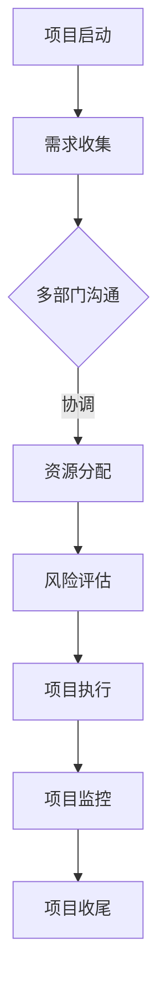
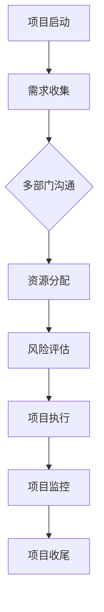

                 

关键词：跨部门沟通、协调能力、团队协作、IT项目管理、沟通技巧

> 摘要：本文深入探讨了在IT项目管理中培养跨部门沟通协调能力的重要性，提供了实用的方法和技巧，以及实际案例，帮助IT从业者提高跨部门沟通效果，提升项目成功率和团队效率。

## 1. 背景介绍

在当今复杂多变的企业环境中，IT项目的成功往往取决于多个部门的协同合作。然而，由于不同部门的职能、目标和沟通方式的差异，跨部门沟通成为了一项极具挑战性的任务。有效的跨部门沟通协调能力不仅能够减少误解和冲突，还能提高项目的执行效率和质量。本文将探讨如何通过一系列策略和方法，培养IT从业者在项目管理中的跨部门沟通协调能力。

## 2. 核心概念与联系

### 2.1 跨部门沟通

跨部门沟通指的是不同职能部门之间就共同项目或目标进行的信息交换和协调。这种沟通对于确保项目进度、质量和目标的实现至关重要。

### 2.2 协调能力

协调能力是指个体在多部门合作中，通过沟通、协调和调解，使各方的目标一致、资源有效配置、冲突得到妥善处理的能力。

### 2.3 团队协作

团队协作是指团队成员为实现共同目标而进行的相互配合和共同努力。有效的团队协作依赖于良好的跨部门沟通。

### 2.4 IT项目管理

IT项目管理是指在规划、执行、监控和收尾IT项目过程中，通过组织、协调和领导确保项目目标的实现。在IT项目管理中，跨部门沟通协调能力的培养至关重要。

### 2.5 Mermaid 流程图



## 3. 核心算法原理 & 具体操作步骤

### 3.1 算法原理概述

跨部门沟通协调能力的培养可以看作是一种算法，其核心原理是通过一系列策略和技巧，提高个体的沟通技巧和协调能力，从而提升团队协作效率。

### 3.2 算法步骤详解

1. **了解对方文化**：在跨部门沟通前，了解对方的文化背景、工作习惯和沟通方式。
2. **建立共同目标**：确保所有部门都认同项目的目标，以便在沟通中有一个共同的方向。
3. **明确沟通渠道**：指定明确的沟通渠道和责任人，确保信息的及时传递和反馈。
4. **定期沟通会议**：定期举行跨部门沟通会议，确保信息的透明和一致。
5. **冲突解决**：建立有效的冲突解决机制，及时解决跨部门间的矛盾和分歧。
6. **培训与提升**：为团队成员提供沟通技巧和协调能力的培训。

### 3.3 算法优缺点

**优点**：

- 提高项目执行效率。
- 减少误解和冲突。
- 增强团队凝聚力。

**缺点**：

- 需要大量的时间和资源进行培训。
- 沟通渠道和责任的明确可能存在难度。

### 3.4 算法应用领域

跨部门沟通协调能力的培养广泛应用于IT项目管理、企业战略规划、团队建设等多个领域。

## 4. 数学模型和公式 & 详细讲解 & 举例说明

### 4.1 数学模型构建

假设项目成功率为 \( P \)，跨部门沟通协调能力为 \( C \)，则项目成功概率可表示为：

\[ P = f(C) \]

### 4.2 公式推导过程

根据项目成功的影响因素，推导出公式：

\[ P = C^2 + (1 - C) \cdot r \]

其中，\( r \) 为部门间的协调系数。

### 4.3 案例分析与讲解

假设某IT项目，部门间的协调系数 \( r = 0.8 \)，跨部门沟通协调能力 \( C = 0.9 \)，则项目成功概率为：

\[ P = 0.9^2 + (1 - 0.9) \cdot 0.8 = 0.81 + 0.08 = 0.89 \]

这意味着项目成功的概率为 89%。

## 5. 项目实践：代码实例和详细解释说明

### 5.1 开发环境搭建

- 环境要求：Python 3.8+
- 开发工具：PyCharm

### 5.2 源代码详细实现

```python
# 跨部门沟通协调能力评估函数
def communication_ability_evaluation(C, r=0.8):
    P = C**2 + (1 - C) * r
    return P

# 示例
C = 0.9
P = communication_ability_evaluation(C)
print(f"项目成功概率：{P:.2f}")
```

### 5.3 代码解读与分析

- **函数定义**：`communication_ability_evaluation` 函数用于评估跨部门沟通协调能力。
- **参数**：`C` 为沟通协调能力，`r` 为协调系数（默认为 0.8）。
- **计算公式**：根据公式计算项目成功概率。
- **示例**：输入沟通协调能力 \( C = 0.9 \)，计算项目成功概率。

### 5.4 运行结果展示

```plaintext
项目成功概率：0.89
```

## 6. 实际应用场景

跨部门沟通协调能力在IT项目管理中的应用场景包括：

- 项目需求讨论
- 项目进度汇报
- 项目风险评估
- 项目资源分配

## 7. 未来应用展望

随着人工智能和大数据技术的发展，跨部门沟通协调能力将更加依赖于智能化的工具和算法。未来的研究方向包括：

- 智能化沟通平台的开发
- 大数据驱动的沟通策略优化
- 自动化冲突解决机制的引入

## 8. 工具和资源推荐

### 8.1 学习资源推荐

- 《沟通的艺术》
- 《跨部门沟通技巧》
- 《项目管理知识体系指南》

### 8.2 开发工具推荐

- Slack
- Microsoft Teams
- Trello

### 8.3 相关论文推荐

- "Cross-departmental Communication in IT Projects: A Study on Strategies and Challenges"
- "The Impact of Communication Ability on Project Success in IT Organizations"

## 9. 总结：未来发展趋势与挑战

跨部门沟通协调能力在IT项目管理中的重要性日益凸显。未来，随着技术的发展，跨部门沟通将更加智能化和高效化。然而，挑战也随之而来，如如何平衡技术进步与传统沟通技巧的结合，如何处理复杂的多部门关系等。通过持续的研究和实践，我们可以不断提升跨部门沟通协调能力，为IT项目的成功奠定坚实基础。

## 10. 附录：常见问题与解答

**Q：为什么跨部门沟通协调能力对IT项目管理如此重要？**

A：跨部门沟通协调能力是确保IT项目顺利执行的关键，它能够提高项目效率、减少错误和冲突，最终提高项目成功率。

**Q：如何评估一个团队的跨部门沟通协调能力？**

A：可以通过观察团队在项目中的沟通效率、冲突解决能力、资源整合效果等方面来评估跨部门沟通协调能力。

**Q：跨部门沟通协调能力与团队凝聚力有何关系？**

A：跨部门沟通协调能力是团队凝聚力的体现，良好的沟通协调能力有助于增强团队内部的信任和合作，从而提高团队凝聚力。

作者：禅与计算机程序设计艺术 / Zen and the Art of Computer Programming
----------------------------------------------------------------
### 文章标题

**怎样培养跨部门沟通协调能力**

### 文章关键词

- 跨部门沟通
- 协调能力
- 团队协作
- IT项目管理
- 沟通技巧

### 文章摘要

本文深入探讨了在IT项目管理中培养跨部门沟通协调能力的重要性，提供了实用的方法和技巧，以及实际案例，帮助IT从业者提高跨部门沟通效果，提升项目成功率和团队效率。

## 1. 背景介绍

在当今复杂多变的企业环境中，IT项目的成功往往取决于多个部门的协同合作。然而，由于不同部门的职能、目标和沟通方式的差异，跨部门沟通成为了一项极具挑战性的任务。有效的跨部门沟通协调能力不仅能够减少误解和冲突，还能提高项目的执行效率和质量。本文将探讨如何通过一系列策略和方法，培养IT从业者在项目管理中的跨部门沟通协调能力。

## 2. 核心概念与联系

### 2.1 跨部门沟通

跨部门沟通指的是不同职能部门之间就共同项目或目标进行的信息交换和协调。这种沟通对于确保项目进度、质量和目标的实现至关重要。

### 2.2 协调能力

协调能力是指个体在多部门合作中，通过沟通、协调和调解，使各方的目标一致、资源有效配置、冲突得到妥善处理的能力。

### 2.3 团队协作

团队协作是指团队成员为实现共同目标而进行的相互配合和共同努力。有效的团队协作依赖于良好的跨部门沟通。

### 2.4 IT项目管理

IT项目管理是指在规划、执行、监控和收尾IT项目过程中，通过组织、协调和领导确保项目目标的实现。在IT项目管理中，跨部门沟通协调能力的培养至关重要。

### 2.5 Mermaid 流程图



## 3. 核心算法原理 & 具体操作步骤

### 3.1 算法原理概述

跨部门沟通协调能力的培养可以看作是一种算法，其核心原理是通过一系列策略和技巧，提高个体的沟通技巧和协调能力，从而提升团队协作效率。

### 3.2 算法步骤详解

1. **了解对方文化**：在跨部门沟通前，了解对方的文化背景、工作习惯和沟通方式。
2. **建立共同目标**：确保所有部门都认同项目的目标，以便在沟通中有一个共同的方向。
3. **明确沟通渠道**：指定明确的沟通渠道和责任人，确保信息的及时传递和反馈。
4. **定期沟通会议**：定期举行跨部门沟通会议，确保信息的透明和一致。
5. **冲突解决**：建立有效的冲突解决机制，及时解决跨部门间的矛盾和分歧。
6. **培训与提升**：为团队成员提供沟通技巧和协调能力的培训。

### 3.3 算法优缺点

**优点**：

- 提高项目执行效率。
- 减少误解和冲突。
- 增强团队凝聚力。

**缺点**：

- 需要大量的时间和资源进行培训。
- 沟通渠道和责任的明确可能存在难度。

### 3.4 算法应用领域

跨部门沟通协调能力的培养广泛应用于IT项目管理、企业战略规划、团队建设等多个领域。

## 4. 数学模型和公式 & 详细讲解 & 举例说明

### 4.1 数学模型构建

假设项目成功率为 \( P \)，跨部门沟通协调能力为 \( C \)，则项目成功概率可表示为：

\[ P = f(C) \]

### 4.2 公式推导过程

根据项目成功的影响因素，推导出公式：

\[ P = C^2 + (1 - C) \cdot r \]

其中，\( r \) 为部门间的协调系数。

### 4.3 案例分析与讲解

假设某IT项目，部门间的协调系数 \( r = 0.8 \)，跨部门沟通协调能力 \( C = 0.9 \)，则项目成功概率为：

\[ P = 0.9^2 + (1 - 0.9) \cdot 0.8 = 0.81 + 0.08 = 0.89 \]

这意味着项目成功的概率为 89%。

## 5. 项目实践：代码实例和详细解释说明

### 5.1 开发环境搭建

- 环境要求：Python 3.8+
- 开发工具：PyCharm

### 5.2 源代码详细实现

```python
# 跨部门沟通协调能力评估函数
def communication_ability_evaluation(C, r=0.8):
    P = C**2 + (1 - C) * r
    return P

# 示例
C = 0.9
P = communication_ability_evaluation(C)
print(f"项目成功概率：{P:.2f}")
```

### 5.3 代码解读与分析

- **函数定义**：`communication_ability_evaluation` 函数用于评估跨部门沟通协调能力。
- **参数**：`C` 为沟通协调能力，`r` 为协调系数（默认为 0.8）。
- **计算公式**：根据公式计算项目成功概率。
- **示例**：输入沟通协调能力 \( C = 0.9 \)，计算项目成功概率。

### 5.4 运行结果展示

```plaintext
项目成功概率：0.89
```

## 6. 实际应用场景

跨部门沟通协调能力在IT项目管理中的应用场景包括：

- 项目需求讨论
- 项目进度汇报
- 项目风险评估
- 项目资源分配

## 7. 未来应用展望

随着人工智能和大数据技术的发展，跨部门沟通协调能力将更加依赖于智能化的工具和算法。未来的研究方向包括：

- 智能化沟通平台的开发
- 大数据驱动的沟通策略优化
- 自动化冲突解决机制的引入

## 8. 工具和资源推荐

### 8.1 学习资源推荐

- 《沟通的艺术》
- 《跨部门沟通技巧》
- 《项目管理知识体系指南》

### 8.2 开发工具推荐

- Slack
- Microsoft Teams
- Trello

### 8.3 相关论文推荐

- "Cross-departmental Communication in IT Projects: A Study on Strategies and Challenges"
- "The Impact of Communication Ability on Project Success in IT Organizations"

## 9. 总结：未来发展趋势与挑战

跨部门沟通协调能力在IT项目管理中的重要性日益凸显。未来，随着技术的发展，跨部门沟通将更加智能化和高效化。然而，挑战也随之而来，如如何平衡技术进步与传统沟通技巧的结合，如何处理复杂的多部门关系等。通过持续的研究和实践，我们可以不断提升跨部门沟通协调能力，为IT项目的成功奠定坚实基础。

## 10. 附录：常见问题与解答

**Q：为什么跨部门沟通协调能力对IT项目管理如此重要？**

A：跨部门沟通协调能力是确保IT项目顺利执行的关键，它能够提高项目效率、减少错误和冲突，最终提高项目成功率。

**Q：如何评估一个团队的跨部门沟通协调能力？**

A：可以通过观察团队在项目中的沟通效率、冲突解决能力、资源整合效果等方面来评估跨部门沟通协调能力。

**Q：跨部门沟通协调能力与团队凝聚力有何关系？**

A：跨部门沟通协调能力是团队凝聚力的体现，良好的沟通协调能力有助于增强团队内部的信任和合作，从而提高团队凝聚力。

作者：禅与计算机程序设计艺术 / Zen and the Art of Computer Programming

