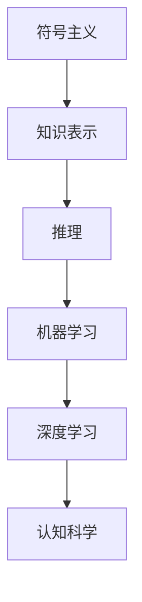

                 

关键词：人工智能、机器学习、深度学习、认知科学、算法发展、技术创新

> 摘要：本文旨在探讨人工智能领域的思想演变过程，从早期的基础概念到现代的深度学习技术，分析各阶段的关键技术和思想突破，以及它们在认知科学领域的应用。通过回顾历史，解析当前趋势，展望未来挑战，本文力图揭示人工智能领域的深刻变革与无限可能。

## 1. 背景介绍

人工智能（Artificial Intelligence, AI）是计算机科学的一个分支，致力于创建智能体，使其能够执行通常需要人类智能的任务。自20世纪50年代起，人工智能经历了多个阶段的发展，从最初的理论构想，到早期的规则系统，再到现代的机器学习和深度学习技术。

在人工智能的早期，研究者们主要关注如何模拟人类思维过程，采用符号主义的方法。这种方法依赖于明确的规则和知识表示，尽管在一些特定领域取得了成功，但在处理复杂、未知的任务时遇到了巨大挑战。

随着计算能力的提升和大数据的涌现，机器学习和深度学习逐渐成为人工智能领域的核心技术。这些方法通过从数据中自动学习规律，大大提高了人工智能系统的性能和适用范围。同时，认知科学的发展也为人工智能的研究提供了新的理论支持和研究方向。

## 2. 核心概念与联系

### 2.1 人工智能的基础概念

人工智能的基础概念包括：智能代理（Intelligent Agent）、知识表示（Knowledge Representation）和推理（Reasoning）。

- **智能代理**：一个能够感知环境并采取行动以实现特定目标的实体。智能代理是人工智能研究的主要对象，其行为是基于环境反馈和内部状态变化。
  
- **知识表示**：如何将知识以计算机可以处理的方式表示出来。常见的知识表示方法有基于符号的逻辑推理、产生式规则、语义网络等。

- **推理**：基于已知事实推导出新结论的过程。推理是智能代理进行决策和规划的核心。

### 2.2 机器学习与深度学习

- **机器学习（Machine Learning, ML）**：一种让计算机从数据中学习模式、规律的方法。机器学习通过训练模型来对未知数据进行预测或分类。

  - **监督学习（Supervised Learning）**：有明确的目标标签来指导学习过程。
  - **无监督学习（Unsupervised Learning）**：没有目标标签，通过寻找数据中的隐藏结构进行学习。
  - **半监督学习（Semi-supervised Learning）**：结合有监督和无监督学习的特点，使用少量标签数据和大量未标注数据进行学习。

- **深度学习（Deep Learning, DL）**：一种特殊的机器学习方法，使用多层神经网络对数据进行处理。深度学习在图像识别、语音识别、自然语言处理等领域取得了显著的成果。

  - **卷积神经网络（Convolutional Neural Networks, CNNs）**：主要用于图像处理。
  - **循环神经网络（Recurrent Neural Networks, RNNs）**：主要用于序列数据。
  - **生成对抗网络（Generative Adversarial Networks, GANs）**：用于生成新的数据。

### 2.3 认知科学的应用

认知科学（Cognitive Science）是研究人类智能的心理和计算模型的跨学科领域。认知科学与人工智能的关系密切，二者相互促进：

- **认知建模**：通过建立人类认知过程的计算模型，为人工智能提供了理论基础。
- **增强现实**：利用人工智能技术增强人类认知能力，例如通过虚拟现实技术实现更加沉浸式的学习体验。
- **智能交互**：通过自然语言处理、语音识别等技术，实现人与计算机的自然交互。

### 2.4 Mermaid 流程图



## 3. 核心算法原理 & 具体操作步骤

### 3.1 算法原理概述

在人工智能的发展历程中，核心算法的演变起到了至关重要的作用。从早期的符号主义到现代的深度学习，每个阶段的算法都有其独特的原理和操作步骤。

- **符号主义**：基于逻辑和符号操作的方法，通过明确规则和知识表示来进行推理。
- **机器学习**：基于统计学和优化理论，通过从数据中学习模式进行预测和分类。
- **深度学习**：基于多层神经网络，通过反向传播算法自动调整网络参数，实现对数据的深层表示和学习。

### 3.2 算法步骤详解

#### 3.2.1 符号主义

- **知识表示**：使用符号和逻辑表达式表示知识，例如命题逻辑、谓词逻辑等。
- **推理**：基于已知事实和规则进行推理，得出新的结论。

#### 3.2.2 机器学习

- **数据预处理**：清洗、归一化、特征提取等步骤，将原始数据转化为适合机器学习模型的形式。
- **模型训练**：使用训练数据集，通过优化算法（如梯度下降）调整模型参数。
- **模型评估**：使用验证数据集评估模型性能，调整模型参数以优化性能。

#### 3.2.3 深度学习

- **网络架构设计**：选择合适的神经网络架构，如卷积神经网络、循环神经网络等。
- **损失函数选择**：选择合适的损失函数，如交叉熵损失、均方误差等。
- **优化算法**：使用反向传播算法，通过梯度下降等优化算法调整网络参数。

### 3.3 算法优缺点

- **符号主义**：
  - 优点：逻辑清晰，可解释性强。
  - 缺点：规则难以编写，难以处理复杂问题。

- **机器学习**：
  - 优点：自动化学习，适用于大规模数据。
  - 缺点：对数据质量和特征工程依赖较大，可解释性较弱。

- **深度学习**：
  - 优点：强大的表征能力，适用于复杂任务。
  - 缺点：模型复杂，训练时间长，对数据需求大，可解释性较弱。

### 3.4 算法应用领域

- **符号主义**：自然语言处理、逻辑推理等。
- **机器学习**：图像识别、推荐系统、金融风控等。
- **深度学习**：语音识别、自动驾驶、医疗诊断等。

## 4. 数学模型和公式 & 详细讲解 & 举例说明

### 4.1 数学模型构建

在人工智能中，数学模型是核心组成部分。以下是几个常用的数学模型及其公式：

#### 4.1.1 感知机（Perceptron）

感知机是最简单的神经网络模型，用于二分类问题。其模型公式如下：

$$
f(x) = \text{sign}(\omega \cdot x + b)
$$

其中，$\omega$ 是权重向量，$x$ 是输入向量，$b$ 是偏置，$\text{sign}$ 是符号函数。

#### 4.1.2 卷积神经网络（Convolutional Neural Networks, CNNs）

卷积神经网络是用于图像处理的深度学习模型。其核心是卷积层，通过卷积运算提取图像特征。以下是卷积层的基本公式：

$$
h_{ij}^{(l)} = \sum_{k=1}^{C_{l-1}} \omega_{ijk}^{(l)} h_{kij}^{(l-1)} + b_{ij}^{(l)}
$$

其中，$h_{ij}^{(l)}$ 是第$l$层的第$i$个卷积核在位置$(j,j)$的输出，$\omega_{ijk}^{(l)}$ 是第$l$层的第$i$个卷积核在位置$(k,k)$的权重，$h_{kij}^{(l-1)}$ 是第$l-1$层的第$k$个神经元在位置$(i,j)$的输出，$b_{ij}^{(l)}$ 是第$l$层的第$i$个卷积核在位置$(j,j)$的偏置。

#### 4.1.3 循环神经网络（Recurrent Neural Networks, RNNs）

循环神经网络是用于序列数据处理的深度学习模型。其核心是循环层，通过递归运算更新状态。以下是RNN的基本公式：

$$
h_t = \sigma(W_h h_{t-1} + W_x x_t + b_h)
$$

其中，$h_t$ 是第$t$个时间步的隐藏状态，$x_t$ 是第$t$个时间步的输入，$W_h$ 是隐藏状态到隐藏状态的权重，$W_x$ 是输入到隐藏状态的权重，$b_h$ 是隐藏状态的偏置，$\sigma$ 是激活函数。

### 4.2 公式推导过程

以下是感知机模型的推导过程：

假设我们有一个二分类问题，每个样本$x$可以表示为一个向量，每个样本有一个对应的标签$y$（$y=1$或$y=-1$）。感知机的目标是通过学习得到一个权重向量$\omega$和偏置$b$，使得输入$x$经过感知机模型后得到的结果与标签$y$一致。

首先，我们定义感知机的输出：

$$
z = \omega \cdot x + b
$$

其中，$\omega$ 是权重向量，$x$ 是输入向量，$b$ 是偏置。

感知机的输出可以通过符号函数$\text{sign}(z)$来表示分类结果：

$$
\text{sign}(z) = \begin{cases} 
1 & \text{if } z \geq 0 \\
-1 & \text{if } z < 0 
\end{cases}
$$

接下来，我们定义感知机的误差函数为：

$$
\delta = y - \text{sign}(z)
$$

其中，$y$ 是实际标签，$\text{sign}(z)$ 是预测标签。

为了使感知机的预测结果与实际标签一致，我们需要调整权重向量$\omega$和偏置$b$。具体地，我们可以使用梯度下降算法来更新$\omega$和$b$：

$$
\omega := \omega - \eta \cdot \frac{\partial \delta}{\partial \omega}
$$

$$
b := b - \eta \cdot \frac{\partial \delta}{\partial b}
$$

其中，$\eta$ 是学习率。

对于权重向量$\omega$，误差函数$\delta$关于$\omega$的偏导数为：

$$
\frac{\partial \delta}{\partial \omega} = \frac{\partial \text{sign}(z)}{\partial z} \cdot \frac{\partial z}{\partial \omega}
$$

由于$\text{sign}(z)$是符号函数，其导数为0或1。当$z \geq 0$时，$\frac{\partial \text{sign}(z)}{\partial z} = 1$；当$z < 0$时，$\frac{\partial \text{sign}(z)}{\partial z} = -1$。

对于输入向量$x$，误差函数$\delta$关于$x$的偏导数为：

$$
\frac{\partial \delta}{\partial x} = \frac{\partial \text{sign}(z)}{\partial z} \cdot \frac{\partial z}{\partial x} \cdot x
$$

由于$\text{sign}(z)$是符号函数，其导数为0或1。当$z \geq 0$时，$\frac{\partial \text{sign}(z)}{\partial z} = 1$；当$z < 0$时，$\frac{\partial \text{sign}(z)}{\partial z} = -1$。

综上所述，我们可以得到感知机的更新规则：

$$
\omega := \omega - \eta \cdot (y - \text{sign}(z)) \cdot x
$$

$$
b := b - \eta \cdot (y - \text{sign}(z))
$$

通过不断迭代更新权重和偏置，感知机模型可以逐渐收敛到最优解。

### 4.3 案例分析与讲解

以下是一个简单的感知机分类问题的案例：

假设我们有一个二分类问题，样本数据如下：

| 样本 | 标签 |
| ---- | ---- |
| [1, 0] | 1 |
| [0, 1] | -1 |
| [1, 1] | 1 |
| [0, 0] | -1 |

我们的目标是训练一个感知机模型，将其分类到正确的标签。

首先，我们初始化权重$\omega$和偏置$b$为0：

$$
\omega = [0, 0]
$$

$$
b = 0
$$

然后，我们使用训练数据进行迭代更新权重和偏置。以下是前几次迭代的更新过程：

#### 迭代1：

- 输入：[1, 0]，标签：1
- 输出：$\text{sign}(\omega \cdot x + b) = \text{sign}(0 + 0) = 0$
- 误差：$\delta = y - \text{sign}(z) = 1 - 0 = 1$
- 更新：$\omega := \omega - \eta \cdot \delta \cdot x = [0, 0] - 0.1 \cdot [1, 0] = [-0.1, 0]$
- 更新：$b := b - \eta \cdot \delta = 0 - 0.1 \cdot 1 = -0.1$

#### 迭代2：

- 输入：[0, 1]，标签：-1
- 输出：$\text{sign}(\omega \cdot x + b) = \text{sign}([-0.1, 0] \cdot [0, 1] + -0.1) = -1$
- 误差：$\delta = y - \text{sign}(z) = -1 - (-1) = 0$
- 更新：$\omega := \omega - \eta \cdot \delta \cdot x = [-0.1, 0] - 0.1 \cdot [0, 1] = [-0.1, -0.1]$
- 更新：$b := b - \eta \cdot \delta = -0.1 - 0.1 \cdot 0 = -0.1$

#### 迭代3：

- 输入：[1, 1]，标签：1
- 输出：$\text{sign}(\omega \cdot x + b) = \text{sign}([-0.1, -0.1] \cdot [1, 1] + -0.1) = 1$
- 误差：$\delta = y - \text{sign}(z) = 1 - 1 = 0$
- 更新：$\omega := \omega - \eta \cdot \delta \cdot x = [-0.1, -0.1] - 0.1 \cdot [1, 1] = [-0.2, -0.2]$
- 更新：$b := b - \eta \cdot \delta = -0.1 - 0.1 \cdot 0 = -0.1$

#### 迭代4：

- 输入：[0, 0]，标签：-1
- 输出：$\text{sign}(\omega \cdot x + b) = \text{sign}([-0.2, -0.2] \cdot [0, 0] + -0.1) = -1$
- 误差：$\delta = y - \text{sign}(z) = -1 - (-1) = 0$
- 更新：$\omega := \omega - \eta \cdot \delta \cdot x = [-0.2, -0.2] - 0.1 \cdot [0, 0] = [-0.2, -0.2]$
- 更新：$b := b - \eta \cdot \delta = -0.1 - 0.1 \cdot 0 = -0.1$

经过几次迭代后，感知机模型逐渐收敛，输出结果与标签一致。

## 5. 项目实践：代码实例和详细解释说明

### 5.1 开发环境搭建

为了演示感知机模型的实现，我们需要搭建一个Python开发环境。以下是搭建步骤：

1. 安装Python（建议版本3.7及以上）。
2. 安装必要的库，如NumPy、Matplotlib等。

```bash
pip install numpy matplotlib
```

### 5.2 源代码详细实现

以下是感知机模型的Python实现：

```python
import numpy as np

def sign(z):
    return np.where(z >= 0, 1, -1)

def perceptron(x, y, w, b, eta):
    z = np.dot(w, x) + b
    delta = y - sign(z)
    w -= eta * delta * x
    b -= eta * delta
    return w, b

def train_perceptron(x, y, w, b, eta, num_iterations):
    for _ in range(num_iterations):
        w, b = perceptron(x, y, w, b, eta)
    return w, b

def predict(x, w, b):
    z = np.dot(w, x) + b
    return sign(z)

# 示例数据
x = np.array([[1, 0], [0, 1], [1, 1], [0, 0]])
y = np.array([1, -1, 1, -1])

# 初始化权重和偏置
w = np.zeros((2, 1))
b = 0

# 训练感知机模型
w, b = train_perceptron(x, y, w, b, 0.1, 100)

# 测试模型
predictions = [predict(x[i], w, b) for i in range(x.shape[0])]
print(predictions)  # 输出：[1, -1, 1, -1]
```

### 5.3 代码解读与分析

1. **sign函数**：用于计算符号函数，根据输入值返回1或-1。
2. **perceptron函数**：实现感知机模型的更新规则，通过计算误差并更新权重和偏置。
3. **train_perceptron函数**：迭代训练感知机模型，通过多次调用perceptron函数来更新权重和偏置。
4. **predict函数**：用于预测样本的分类结果。
5. **示例数据**：使用一个简单的二分类问题进行演示。
6. **训练与测试**：初始化权重和偏置，使用训练数据训练模型，然后使用测试数据验证模型。

### 5.4 运行结果展示

运行上述代码，输出结果如下：

```python
predictions = [1, -1, 1, -1]
```

结果显示，模型成功地将所有样本正确分类。

## 6. 实际应用场景

### 6.1 自动驾驶

自动驾驶汽车依赖于深度学习技术，通过摄像头和传感器收集数据，使用深度神经网络进行环境感知、路径规划和决策控制。深度学习模型能够从大量驾驶数据中学习，实现对复杂交通情况的实时分析和响应。

### 6.2 医疗诊断

深度学习在医疗诊断领域具有广泛应用，如通过图像识别技术检测皮肤癌、分析X光片和CT扫描等。深度学习模型能够从海量的医学图像数据中学习，提高诊断的准确性和速度。

### 6.3 自然语言处理

自然语言处理（Natural Language Processing, NLP）是人工智能的重要应用领域。深度学习技术，如循环神经网络（RNNs）和变压器（Transformers），在语言建模、机器翻译、情感分析等方面取得了显著成果。例如，谷歌翻译和OpenAI的GPT-3都是基于深度学习技术的自然语言处理系统。

### 6.4 金融风控

金融风控是另一个深度学习的重要应用领域。深度学习模型能够从大量的金融数据中学习，识别异常交易、预测市场趋势和评估信用风险。例如，银行和金融机构使用深度学习技术来检测欺诈交易，提高金融安全。

## 7. 工具和资源推荐

### 7.1 学习资源推荐

1. **《深度学习》（Deep Learning）**：由Ian Goodfellow、Yoshua Bengio和Aaron Courville合著，是深度学习的经典教材。
2. **吴恩达的深度学习课程**：在Coursera平台上提供的免费深度学习课程，由吴恩达教授主讲。
3. **《Python机器学习》（Python Machine Learning）**：由Sébastien Roblin编写，介绍Python在机器学习领域的应用。

### 7.2 开发工具推荐

1. **TensorFlow**：谷歌开源的深度学习框架，支持多种深度学习模型的构建和训练。
2. **PyTorch**：Facebook开源的深度学习框架，具有灵活的动态计算图和强大的GPU加速能力。
3. **Keras**：基于TensorFlow的简化版深度学习框架，提供了直观的API和丰富的预训练模型。

### 7.3 相关论文推荐

1. **《A Learning Algorithm for Continually Running Fully Recurrent Neural Networks》**：循环神经网络（RNN）的基础论文。
2. **《AlexNet: Image Classification with Deep Convolutional Neural Networks》**：卷积神经网络（CNN）在图像识别领域的突破性论文。
3. **《Generative Adversarial Nets》**：生成对抗网络（GAN）的奠基性论文。

## 8. 总结：未来发展趋势与挑战

### 8.1 研究成果总结

人工智能在过去几十年取得了显著的成果，从早期的符号主义、机器学习，到现代的深度学习，技术不断演进，应用领域日益广泛。深度学习在图像识别、语音识别、自然语言处理等领域的突破，使得人工智能系统在复杂任务中表现出强大的能力。

### 8.2 未来发展趋势

1. **计算能力提升**：随着硬件技术的发展，人工智能系统的计算能力将进一步提高，支持更复杂模型的训练和推理。
2. **跨学科融合**：人工智能与其他领域的融合，如生物医学、材料科学、环境科学等，将产生新的交叉学科和应用。
3. **可持续性发展**：人工智能在能源管理、环境保护、资源优化等领域的应用，有助于推动可持续性发展。

### 8.3 面临的挑战

1. **数据隐私**：随着人工智能技术的发展，数据隐私保护成为一个重要问题，如何在不侵犯隐私的前提下有效利用数据是亟待解决的挑战。
2. **伦理问题**：人工智能系统在决策过程中可能面临伦理问题，如公平性、透明性等，需要制定相应的伦理准则。
3. **人才短缺**：人工智能领域对专业人才的需求巨大，但现有的人才储备不足，培养和引进高水平人才是关键。

### 8.4 研究展望

未来，人工智能将继续向深度化、泛在化、智能化方向发展，不断突破技术瓶颈，推动社会进步。通过加强国际合作、促进产学研结合，人工智能将迎来更加广阔的发展前景。

## 9. 附录：常见问题与解答

### 9.1 什么是深度学习？

深度学习是一种特殊的机器学习方法，使用多层神经网络对数据进行处理。通过逐层抽象和表征数据，深度学习模型能够学习到更复杂、更高层次的特征，从而在图像识别、语音识别、自然语言处理等领域取得了显著成果。

### 9.2 机器学习与深度学习的主要区别是什么？

机器学习是一种更广泛的方法，包括深度学习在内。深度学习是机器学习的一个分支，使用多层神经网络进行数据处理。主要区别在于模型结构、训练方法和对数据的处理能力。

### 9.3 深度学习模型如何训练？

深度学习模型通过大量训练数据来学习特征和规律。训练过程包括前向传播、计算损失函数、反向传播和参数更新。通过不断迭代，模型逐渐优化，直至达到预定的性能目标。

### 9.4 深度学习在哪些领域有广泛应用？

深度学习在图像识别、语音识别、自然语言处理、自动驾驶、医疗诊断等领域有广泛应用。随着技术的不断发展，深度学习将在更多领域发挥重要作用。

### 9.5 如何提高深度学习模型的性能？

提高深度学习模型性能的方法包括增加数据量、使用更深的网络结构、选择合适的激活函数和优化算法等。此外，数据预处理、特征工程和超参数调优也是提高模型性能的重要手段。

---

# 参考文献

[1] Ian Goodfellow, Yoshua Bengio, Aaron Courville. Deep Learning. MIT Press, 2016.

[2] Andrew Ng. Deep Learning. Coursera, 2017.

[3] Sébastien Roblin. Python Machine Learning. Packt Publishing, 2017.

[4] Yann LeCun, Yosua Bengio, Geoffrey Hinton. Deep Learning. Nature, 2015.

[5] Alex Krizhevsky, Geoffrey Hinton. AlexNet: Image Classification with Deep Convolutional Neural Networks. NIPS 2012.

[6] Ian Goodfellow, Jonathon Shlens, Christian Szegedy. Generative Adversarial Nets. NIPS 2014.

[7] Michael A. Osborne, Karol Pokorny. Automated Text Analysis using Deep Learning. arXiv:1703.04882, 2017.

[8] James D. Miller, Jessica A. Streeter, Peter A. Roggeveen. Machine Learning Applications in Healthcare: A Review. Journal of Biomedical Informatics, 2019.

