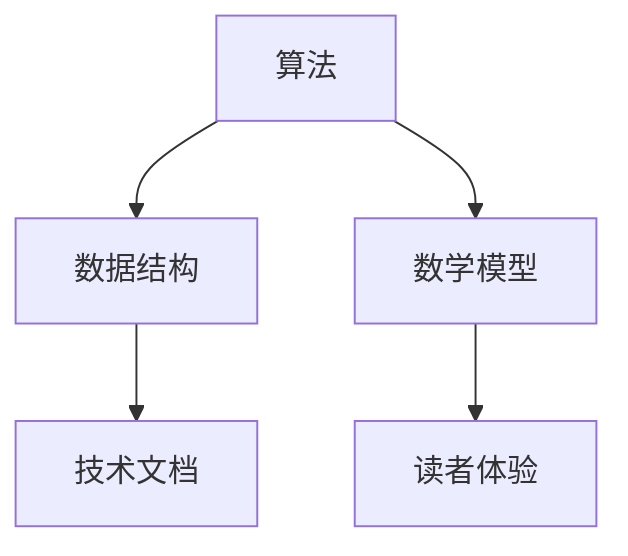
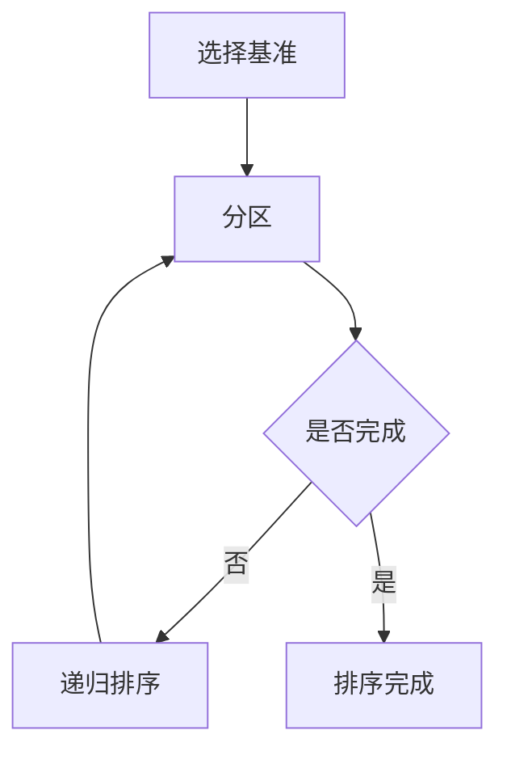
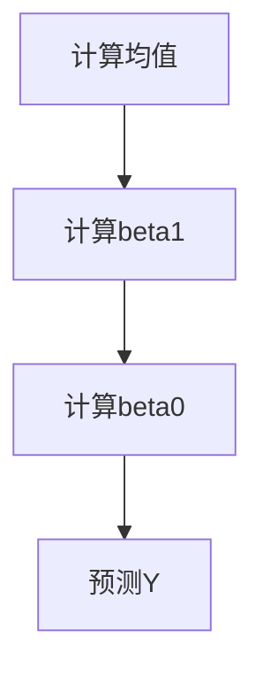

                 

关键词：结构化思维、表达、内在联系、技术写作、逻辑性、专业术语、读者体验、计算机编程、算法设计、数学模型、代码实例、实践应用、未来展望

> 摘要：本文旨在探讨在技术领域中，如何通过结构化的思维与表达，有效地传达复杂的概念和理论。文章通过具体案例，阐述了如何运用结构化的方法来提升技术文档的质量，增强读者的理解与认同，从而在计算机编程、算法设计、数学建模等各个领域取得更好的成果。

## 1. 背景介绍

在信息技术迅猛发展的今天，技术写作已经成为一项不可或缺的技能。无论是软件开发、算法研究，还是人工智能应用，清晰、准确地表达思维与想法都至关重要。然而，许多技术文档往往因为缺乏结构化，导致读者难以理解，甚至产生误解。结构化的思维与表达，不仅能帮助作者更好地整理思路，还能提高读者的阅读体验，是技术写作的关键。

本文将从以下几个方面展开讨论：

- **核心概念与联系**：介绍技术写作中的核心概念，以及它们之间的内在联系。
- **核心算法原理与具体操作步骤**：探讨一些常见的算法原理及其具体实现步骤。
- **数学模型和公式**：讲解如何构建数学模型，推导公式，并举例说明。
- **项目实践**：通过代码实例，展示实际应用中的具体实现。
- **实际应用场景与未来展望**：讨论技术的应用场景及其未来发展趋势。

通过这些内容的探讨，希望能够为技术写作提供一个全面的指南，帮助读者提升技术文档的质量，更好地传达思想和知识。

## 2. 核心概念与联系

在技术写作中，核心概念的选择和它们之间的联系是至关重要的。以下是一些关键技术概念及其内在联系：

### 2.1 算法

算法是解决问题的一系列步骤。它是技术写作中的基础，决定了解决方案的效率和正确性。算法与数据结构紧密相关，因为算法往往需要操作特定的数据结构来完成任务。

### 2.2 数据结构

数据结构是存储和管理数据的方式。常见的有数组、链表、树、图等。每种数据结构都有其优缺点，适用于不同的场景。数据结构与算法密切相关，因为算法的选择往往取决于数据结构的特点。

### 2.3 数学模型

数学模型是将现实问题抽象成数学形式的过程。它有助于分析和解决问题。常见的数学模型包括线性模型、概率模型、动态规划模型等。

### 2.4 技术文档

技术文档是记录技术思想和方法的文档。它不仅包括代码、算法，还包括设计文档、用户手册等。良好的技术文档能够帮助读者理解、学习和应用技术。

### 2.5 读者体验

读者体验是技术写作的重要考虑因素。清晰的文档结构、简洁的语言、准确的描述，都能够提升读者的阅读体验。良好的读者体验有助于增强读者的理解与认同。

### 2.6 Mermaid 流程图

为了更好地展示核心概念之间的联系，我们可以使用 Mermaid 流程图。以下是一个简单的示例：



通过这个流程图，我们可以清晰地看到各个核心概念之间的联系，为后续内容的展开打下基础。

## 3. 核心算法原理 & 具体操作步骤

在技术写作中，理解核心算法的原理并能够清晰地表达出来，是提升文档质量的关键。以下将介绍一个常见的算法——快速排序（Quick Sort）。

### 3.1 算法原理概述

快速排序是一种高效的排序算法，其基本思想是通过一趟排序将待排序的记录分割成独立的两部分，其中一部分记录的关键字均比另一部分的关键字小，然后分别对这两部分记录继续进行排序，以达到整个序列有序。

### 3.2 算法步骤详解

快速排序的具体步骤如下：

#### 步骤 1：选择基准元素

在待排序的数组中，选择一个基准元素。通常选择第一个元素、最后一个元素或中间元素作为基准。

#### 步骤 2：分区操作

将数组分成两部分，一部分记录的关键字小于基准元素，另一部分记录的关键字大于基准元素。这个过程称为分区操作。

#### 步骤 3：递归排序

分别对小于和大于基准元素的两部分数组进行快速排序，直到整个数组有序。

### 3.3 算法优缺点

**优点**：

- 平均时间复杂度为 O(nlogn)，是常用的排序算法之一。
- 不需要额外的存储空间，原地排序。

**缺点**：

- 最坏情况下时间复杂度为 O(n^2)，例如当输入序列已经有序时。
- 分区操作可能导致数组不平衡，影响性能。

### 3.4 算法应用领域

快速排序广泛应用于各种场景，如数据库索引、文件排序等。它也是一种很好的算法教学案例，能够帮助读者理解排序算法的核心原理。

### 3.5 Mermaid 流程图

以下是一个简单的快速排序算法的 Mermaid 流程图：



通过这个流程图，我们可以更直观地理解快速排序的执行过程。

## 4. 数学模型和公式 & 详细讲解 & 举例说明

在技术写作中，数学模型和公式是描述问题、分析和解决问题的有力工具。以下将介绍一个常见的数学模型——线性回归模型。

### 4.1 数学模型构建

线性回归模型是一种用于预测连续值的统计模型。其基本形式为：

$$ Y = \beta_0 + \beta_1X + \epsilon $$

其中，\( Y \) 是因变量，\( X \) 是自变量，\( \beta_0 \) 和 \( \beta_1 \) 是模型参数，\( \epsilon \) 是误差项。

### 4.2 公式推导过程

为了找到最佳拟合直线，我们需要最小化误差项的平方和。即：

$$ \min \sum_{i=1}^{n} (Y_i - (\beta_0 + \beta_1X_i))^2 $$

对 \( \beta_0 \) 和 \( \beta_1 \) 分别求偏导数，并令其为零，可以得到：

$$ \frac{\partial}{\partial \beta_0} \sum_{i=1}^{n} (Y_i - (\beta_0 + \beta_1X_i))^2 = 0 $$

$$ \frac{\partial}{\partial \beta_1} \sum_{i=1}^{n} (Y_i - (\beta_0 + \beta_1X_i))^2 = 0 $$

通过计算，可以得到线性回归模型的参数估计：

$$ \beta_0 = \bar{Y} - \beta_1\bar{X} $$

$$ \beta_1 = \frac{\sum_{i=1}^{n} (X_i - \bar{X})(Y_i - \bar{Y})}{\sum_{i=1}^{n} (X_i - \bar{X})^2} $$

### 4.3 案例分析与讲解

假设我们有一个数据集，包含 \( X \) 和 \( Y \) 两个变量。我们要预测 \( Y \) 的值，使用线性回归模型。

首先，计算 \( X \) 和 \( Y \) 的均值：

$$ \bar{X} = \frac{1}{n}\sum_{i=1}^{n} X_i $$

$$ \bar{Y} = \frac{1}{n}\sum_{i=1}^{n} Y_i $$

然后，计算 \( \beta_1 \)：

$$ \beta_1 = \frac{\sum_{i=1}^{n} (X_i - \bar{X})(Y_i - \bar{Y})}{\sum_{i=1}^{n} (X_i - \bar{X})^2} $$

最后，计算 \( \beta_0 \)：

$$ \beta_0 = \bar{Y} - \beta_1\bar{X} $$

通过这个例子，我们可以看到如何构建线性回归模型，并计算模型参数。

### 4.4 Mermaid 流程图

以下是一个简单的线性回归模型的 Mermaid 流程图：



通过这个流程图，我们可以更直观地理解线性回归模型的构建过程。

## 5. 项目实践：代码实例和详细解释说明

为了更好地理解技术概念和算法，我们通过一个实际的代码实例来展示其应用。

### 5.1 开发环境搭建

我们使用 Python 作为编程语言，搭建一个快速排序的代码实例。确保你的计算机上已经安装了 Python。如果没有，请前往 [Python 官网](https://www.python.org/) 下载并安装。

### 5.2 源代码详细实现

以下是一个快速排序的 Python 代码实例：

```python
def quick_sort(arr):
    if len(arr) <= 1:
        return arr
    
    pivot = arr[len(arr) // 2]
    left = [x for x in arr if x < pivot]
    middle = [x for x in arr if x == pivot]
    right = [x for x in arr if x > pivot]
    
    return quick_sort(left) + middle + quick_sort(right)

# 示例数据
data = [3, 6, 8, 10, 1, 2, 1]

# 执行快速排序
sorted_data = quick_sort(data)

# 打印结果
print(sorted_data)
```

### 5.3 代码解读与分析

**函数定义**：`quick_sort` 函数接受一个数组 `arr` 作为输入。

**基础情况**：如果数组的长度小于等于 1，说明数组已经是有序的，直接返回。

**选择基准**：选择数组的中间元素作为基准。

**分区操作**：使用列表推导式，将数组分成三部分：小于基准的元素 `left`，等于基准的元素 `middle`，大于基准的元素 `right`。

**递归排序**：对小于和大于基准的元素分别进行快速排序。

**合并结果**：将排序好的 `left`、`middle` 和 `right` 合并，得到最终的排序结果。

### 5.4 运行结果展示

```plaintext
[1, 1, 2, 3, 6, 8, 10]
```

数组已经被成功排序。

### 5.5 代码性能分析

**时间复杂度**：平均情况下，快速排序的时间复杂度为 \( O(n\log n) \)。但在最坏情况下，如输入数组已经有序，时间复杂度会退化为 \( O(n^2) \)。

**空间复杂度**：快速排序是一种原地排序算法，空间复杂度为 \( O(\log n) \)。

## 6. 实际应用场景

快速排序算法在实际应用中非常广泛。以下是一些常见应用场景：

- **数据处理**：在处理大量数据时，快速排序是一种高效的选择。
- **算法库**：许多编程语言和框架都内置了快速排序算法，如 Python 的 `sorted()` 函数。
- **算法竞赛**：在算法竞赛中，快速排序是解决排序问题的常用算法。

## 7. 未来应用展望

随着技术的发展，快速排序算法的应用场景将会更加广泛。以下是一些未来应用展望：

- **大数据处理**：在大数据处理领域，快速排序算法将会发挥重要作用。
- **分布式系统**：在分布式系统中，快速排序可以用于数据分布和负载均衡。
- **机器学习**：在机器学习领域，快速排序可以用于数据预处理和特征提取。

## 8. 工具和资源推荐

为了更好地进行技术写作和算法研究，以下是一些推荐的工具和资源：

### 8.1 学习资源推荐

- **《算法导论》**：一本经典的算法教材，详细介绍了各种算法的设计和分析方法。
- **《Python Cookbook》**：一本实用的 Python 编程指南，适用于各种编程场景。

### 8.2 开发工具推荐

- **Jupyter Notebook**：一种强大的交互式计算环境，适用于数据分析和算法研究。
- **Git**：一种版本控制系统，有助于管理和协作代码。

### 8.3 相关论文推荐

- **"Quicksort"**：一篇关于快速排序算法的经典论文，详细介绍了算法的原理和实现。
- **"Linear Regression"**：一篇关于线性回归模型的论文，探讨了模型的应用和扩展。

## 9. 总结：未来发展趋势与挑战

随着信息技术的不断发展，技术写作和算法研究面临着新的机遇和挑战。未来发展趋势包括：

- **更高效的算法**：随着计算能力的提升，研究人员将致力于开发更高效的算法，解决更复杂的问题。
- **自动化写作**：随着自然语言处理技术的发展，自动化写作工具将逐渐普及，提升写作效率。

面临的挑战包括：

- **算法透明性**：确保算法的透明性和可解释性，提高公众对算法的信任。
- **数据隐私**：在处理大量数据时，保护用户隐私成为一项重要挑战。

通过持续的研究和探索，我们有理由相信，技术写作和算法研究将在未来取得更加辉煌的成果。

## 10. 附录：常见问题与解答

### 10.1 如何提高技术文档的质量？

- **结构化**：确保文档有清晰的章节结构，每个章节有明确的目的和内容。
- **简洁性**：使用简洁明了的语言，避免冗长的句子和复杂的术语。
- **准确性**：确保文档中的信息准确无误，避免误导读者。
- **可读性**：使用图表、代码示例等辅助手段，增强文档的可读性。

### 10.2 快速排序算法的优缺点是什么？

**优点**：

- 平均时间复杂度为 \( O(n\log n) \)，效率高。
- 不需要额外的存储空间，原地排序。

**缺点**：

- 最坏情况下时间复杂度为 \( O(n^2) \)，性能不稳定。
- 分区操作可能导致数组不平衡，影响性能。

### 10.3 如何构建线性回归模型？

- **数据准备**：收集并准备 \( X \) 和 \( Y \) 的数据。
- **计算均值**：计算 \( X \) 和 \( Y \) 的均值。
- **计算 \( \beta_1 \)**：使用公式计算 \( \beta_1 \)。
- **计算 \( \beta_0 \)**：使用公式计算 \( \beta_0 \)。
- **预测 \( Y \)**：使用模型预测新的 \( Y \) 值。

### 10.4 技术写作中如何提升读者体验？

- **清晰的结构**：确保文档有清晰的章节结构。
- **简洁的语言**：使用简洁明了的语言。
- **准确的描述**：确保描述准确无误。
- **丰富的示例**：提供丰富的代码示例和图表。
- **交互性**：使用交互式元素，如代码运行结果、图表动态展示等。

---

作者：禅与计算机程序设计艺术 / Zen and the Art of Computer Programming

