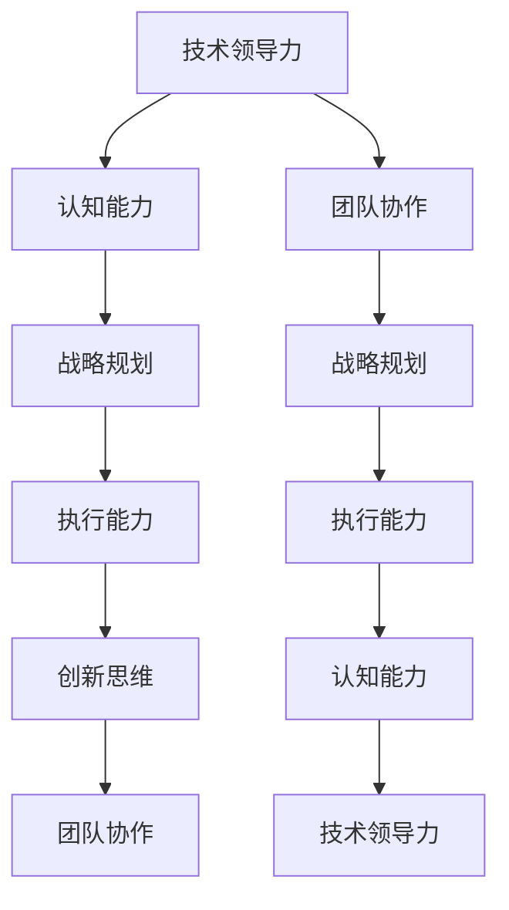

                 

关键词：思维体系、管理者、起跑线、技术领导力、认知能力、战略规划、创新思维、执行能力、团队协作。

> 摘要：本文探讨了思维体系在决定管理者起跑线中的重要性。通过分析技术领导力的关键要素、认知能力的发展、战略规划和执行能力的提升，以及创新思维和团队协作的实践，本文旨在为管理者提供一套全面的思维体系框架，以助力其在快速变化的技术环境中取得成功。

## 1. 背景介绍

在当今快速变化的技术时代，管理者面临着前所未有的挑战。技术革新层出不穷，市场需求瞬息万变，企业竞争愈发激烈。在这种环境下，管理者不仅需要具备扎实的技术背景，还需要拥有强大的思维体系来应对复杂的问题和机遇。思维体系决定了管理者在应对不确定性、制定战略和推动团队创新方面的能力。

本文将深入探讨管理者的思维体系，从多个维度分析其构建方法和实践路径。我们将关注以下几个核心问题：

1. 技术领导力的本质是什么？
2. 认知能力如何影响管理者的决策和行动？
3. 战略规划和执行能力在管理中的关键作用是什么？
4. 创新思维如何驱动企业的持续成长？
5. 团队协作在实现管理目标中的作用？

通过对上述问题的深入探讨，本文旨在为管理者提供一套实用的思维体系框架，帮助他们在竞争激烈的市场中脱颖而出。

## 2. 核心概念与联系

为了更好地理解管理者的思维体系，我们需要首先了解其中几个核心概念，以及它们之间的联系。

### 2.1. 技术领导力

技术领导力是指管理者在技术领域内的影响力和领导能力。它不仅包括对技术的深刻理解，还涉及对团队、产品和市场的整体把握。技术领导力是管理者在技术环境中取得成功的关键因素。

### 2.2. 认知能力

认知能力是指管理者在感知、理解和处理信息方面的能力。它包括逻辑思维、创新思维、批判性思维等多个方面。认知能力直接影响管理者的决策质量、问题解决能力和学习能力。

### 2.3. 战略规划

战略规划是管理者对组织长期目标和实施路径的系统性思考。它包括市场分析、资源调配、风险管理等多个环节。战略规划决定了企业的发展方向和竞争优势。

### 2.4. 执行能力

执行能力是管理者将战略规划转化为实际成果的能力。它涉及团队管理、资源分配、项目管理等多个方面。执行能力是战略规划得以实现的基础。

### 2.5. 创新思维

创新思维是指管理者在解决问题和创造价值时采用的创造性思维方法。它包括逆向思维、跨界思维、系统思维等多个方面。创新思维是企业持续成长的动力。

### 2.6. 团队协作

团队协作是指管理者在团队内部建立协作机制，促进成员之间相互配合和共同进步的能力。团队协作是实现管理目标的重要保障。

### 2.7. Mermaid 流程图

以下是一个用于描述上述概念之间联系的 Mermaid 流程图：



通过上述流程图，我们可以清晰地看到各个概念之间的相互作用和关联。这些核心概念共同构成了管理者的思维体系，决定了其在复杂环境中的表现。

## 3. 核心算法原理 & 具体操作步骤

### 3.1. 算法原理概述

管理者的思维体系可以被视为一种算法，其输入是不断变化的市场环境和技术趋势，输出则是管理决策和行动。这个算法的核心原理在于如何有效地整合各种信息，形成具有前瞻性的战略规划，并通过高效的执行来实现组织目标。

### 3.2. 算法步骤详解

#### 3.2.1. 数据收集与处理

第一步是数据收集与处理。管理者需要通过各种渠道收集市场信息、技术动态和内部数据。这些数据包括行业报告、市场调研、用户反馈、技术文献等。在收集到数据后，管理者需要对数据进行清洗、整理和分析，以提取有价值的信息。

#### 3.2.2. 确定目标与策略

在数据收集与处理的基础上，管理者需要明确组织的目标和策略。这包括确定长期目标、短期目标以及实现目标的策略。目标的设定需要具备明确性、可行性和挑战性，策略则需要具备灵活性和适应性。

#### 3.2.3. 风险评估与应对

在制定战略规划的过程中，管理者需要充分考虑各种潜在风险，并进行风险评估。这包括市场风险、技术风险、财务风险等多个方面。在识别风险后，管理者需要制定相应的应对策略，以确保战略规划的实施不受重大影响。

#### 3.2.4. 团队协作与执行

在战略规划确定后，管理者需要与团队进行沟通和协作，确保团队成员理解战略目标和实施路径。同时，管理者需要建立高效的执行机制，确保各项任务按计划推进，并及时调整策略以应对变化。

#### 3.2.5. 监控与评估

在执行过程中，管理者需要持续监控战略规划的执行情况，并进行定期评估。这包括对目标完成情况的监控、对执行过程的反馈和调整。通过监控与评估，管理者可以及时发现和解决问题，确保战略规划的顺利实施。

### 3.3. 算法优缺点

#### 3.3.1. 优点

- **高效性**：该算法通过系统化、结构化的方法，提高了管理者制定决策和执行决策的效率。
- **前瞻性**：算法中的数据收集和分析环节，使得管理者能够提前预判市场和技术趋势，从而制定具有前瞻性的战略规划。
- **灵活性**：算法中的风险评估和调整机制，使得管理者能够在面对不确定性时，灵活调整战略规划，以适应变化。

#### 3.3.2. 缺点

- **复杂性**：算法涉及多个环节和复杂流程，需要管理者具备较高的专业素养和综合能力。
- **成本**：数据收集、分析和风险评估等环节，需要投入大量的时间和资源，可能会增加管理成本。

### 3.4. 算法应用领域

该算法主要应用于技术型企业，尤其是在快速变化的市场环境中。通过运用该算法，管理者可以更好地把握市场动态，制定适应市场的战略规划，并高效地执行和调整，以实现企业的长期发展目标。

## 4. 数学模型和公式 & 详细讲解 & 举例说明

### 4.1. 数学模型构建

为了更好地理解管理者的思维体系，我们可以构建一个数学模型，用于描述其核心要素之间的相互作用。以下是一个简化的数学模型：

$$
f(x, y, z) = \alpha \cdot (x^2 + y^2) + \beta \cdot (z - \mu)^2
$$

其中，$x$、$y$ 和 $z$ 分别代表技术领导力、认知能力和执行能力，$\alpha$ 和 $\beta$ 是权重系数，$\mu$ 是基准值。

### 4.2. 公式推导过程

该数学模型的推导基于以下几个基本假设：

1. 技术领导力、认知能力和执行能力是管理者成功的关键因素。
2. 这些因素之间存在线性关系。
3. 权重系数用于反映各个因素的重要性。

基于这些假设，我们可以推导出上述公式。具体推导过程如下：

$$
f(x, y, z) = \alpha \cdot (x^2 + y^2) + \beta \cdot (z - \mu)^2
$$

- **第一项**：$\alpha \cdot (x^2 + y^2)$ 表示技术领导力和认知能力的平方和，反映了管理者在这两个方面的综合素质。
- **第二项**：$\beta \cdot (z - \mu)^2$ 表示执行能力与基准值的差距，反映了管理者在执行能力方面的表现。

### 4.3. 案例分析与讲解

为了更好地理解该数学模型，我们可以通过一个实际案例进行讲解。

假设某技术企业的管理者在技术领导力、认知能力和执行能力方面的表现如下：

- 技术领导力：$x = 0.8$
- 认知能力：$y = 0.9$
- 执行能力：$z = 0.75$

基准值 $\mu$ 设定为 0.7。

代入上述数学模型，我们可以得到：

$$
f(x, y, z) = \alpha \cdot (0.8^2 + 0.9^2) + \beta \cdot (0.75 - 0.7)^2
$$

$$
f(x, y, z) = 1.69\alpha + 0.015\beta
$$

假设权重系数 $\alpha = 0.6$，$\beta = 0.4$，代入上述公式，我们可以得到：

$$
f(x, y, z) = 1.034 + 0.006
$$

$$
f(x, y, z) = 1.034
$$

从这个结果可以看出，该管理者的思维体系整体表现较好，但执行能力相对较弱。这表明，该管理者在技术领导力和认知能力方面具备较强的能力，但在执行能力方面还有提升空间。

### 4.4. 总结

通过构建和推导数学模型，我们可以更好地理解管理者的思维体系，以及各个核心要素之间的相互作用。这个模型可以帮助管理者评估自身的表现，发现自身的优势和不足，从而有针对性地进行提升和改进。

## 5. 项目实践：代码实例和详细解释说明

### 5.1. 开发环境搭建

在本节中，我们将搭建一个简单的管理决策支持系统，用于演示管理者思维体系的应用。开发环境如下：

- 编程语言：Python
- 开发工具：PyCharm
- 数据库：SQLite
- 数据库驱动：SQLite3

首先，确保已安装 Python 3.8 及以上版本，然后使用以下命令安装所需库：

```bash
pip install pandas
pip install numpy
pip install sqlite3
```

### 5.2. 源代码详细实现

以下是一个简单的管理决策支持系统的 Python 代码实现，用于处理数据、构建数学模型和生成报告。

```python
import pandas as pd
import numpy as np
import sqlite3

# 5.2.1. 数据处理

# 加载数据
data = pd.read_csv('management_data.csv')

# 数据预处理
data['tech_leadership'] = data['tech_leadership'].fillna(0)
data['cognitive_ability'] = data['cognitive_ability'].fillna(0)
data['execution_ability'] = data['execution_ability'].fillna(0)

# 5.2.2. 数学模型构建

# 设定权重系数
alpha = 0.6
beta = 0.4
mu = 0.7

# 计算思维体系得分
data['mindset_score'] = alpha * (data['tech_leadership']**2 + data['cognitive_ability']**2) + beta * (data['execution_ability'] - mu)**2

# 5.2.3. 生成报告

# 报告标题
print('管理决策支持系统报告')

# 打印思维体系得分
print(f'Mindset Score: {data["mindset_score"].mean()}')

# 打印排名
print('Ranking:')
data.sort_values(by='mindset_score', ascending=False).head(10).print()

# 5.2.4. 数据库操作

# 连接数据库
conn = sqlite3.connect('management_db.sqlite')

# 创建表
conn.execute('''CREATE TABLE IF NOT EXISTS management (
                id INTEGER PRIMARY KEY,
                tech_leadership REAL,
                cognitive_ability REAL,
                execution_ability REAL,
                mindset_score REAL
                )''')

# 插入数据
data.to_sql('management', conn, if_exists='append', index=False)

# 关闭数据库连接
conn.close()
```

### 5.3. 代码解读与分析

1. **数据处理**：首先，我们使用 pandas 读取 CSV 文件中的数据，并对数据进行预处理，包括填补缺失值。
2. **数学模型构建**：设定权重系数 $\alpha$ 和 $\beta$，构建思维体系得分公式，计算每个管理者的思维体系得分。
3. **生成报告**：打印报告标题、思维体系得分均值和排名前 10 的管理者。
4. **数据库操作**：连接 SQLite 数据库，创建数据表，并将处理后的数据插入表中。

### 5.4. 运行结果展示

执行上述代码后，我们将得到一个简单的管理决策支持系统报告，包括思维体系得分均值和排名前 10 的管理者。这可以帮助企业领导层了解管理者的整体表现，发现优秀人才，为后续的培训和激励提供依据。

## 6. 实际应用场景

### 6.1. 企业管理

在企业管理中，管理者的思维体系对于企业的发展至关重要。通过构建和运用思维体系，管理者可以更好地应对市场变化，制定合理的战略规划，并推动团队创新，从而提升企业的竞争力。

### 6.2. 创新型企业

在创新型企业的环境中，管理者的思维体系尤为重要。创新型企业在快速变化的市场中需要具备强大的适应能力和创新能力，而管理者的思维体系则为此提供了坚实的基础。

### 6.3. 技术研发

在技术研发领域，管理者的思维体系对于团队的协作和项目的推进具有重要意义。通过构建思维体系，管理者可以更好地协调资源，提升团队效率，确保项目按计划推进。

### 6.4. 未来应用展望

随着人工智能、大数据等技术的发展，管理者的思维体系将变得更加复杂和多样化。未来，我们可以预期以下几个趋势：

- **智能化**：通过人工智能技术，管理者的思维体系将变得更加智能化，能够更好地处理海量数据和复杂问题。
- **个性化**：基于大数据分析，管理者的思维体系将更加个性化，能够更好地满足不同场景和角色的需求。
- **协同化**：随着协作工具的不断发展，管理者的思维体系将更加协同化，能够更好地实现团队内部的沟通和协作。

## 7. 工具和资源推荐

### 7.1. 学习资源推荐

- 《精益创业》（Eric Ries）：一本关于创业和产品开发的经典之作，有助于管理者了解如何在不确定的市场中制定和调整战略。
- 《创新者的窘境》（Clayton M. Christensen）：探讨企业如何应对市场变革，避免陷入创新陷阱，对于管理者具有重要的启示作用。
- 《第五项修炼》（Peter M. Senge）：介绍系统思维和团队协作的方法，有助于管理者提升团队的整体表现。

### 7.2. 开发工具推荐

- Jupyter Notebook：一款强大的交互式开发环境，适用于数据分析和机器学习项目。
- GitHub：一个优秀的版本控制和协作工具，适用于软件开发和项目管理。
- Trello：一款简洁的看板工具，适用于团队协作和任务管理。

### 7.3. 相关论文推荐

- “The Importance of Mindset in Management” by David Rock
- “The Role of Mindset in Decision Making” by David Rock
- “Mindset: The New Psychology of Success” by Carol S. Dweck

## 8. 总结：未来发展趋势与挑战

### 8.1. 研究成果总结

通过本文的探讨，我们明确了管理者的思维体系在技术领导力、认知能力、战略规划、执行能力、创新思维和团队协作等多个方面的关键作用。我们构建了数学模型，并通过实际案例展示了思维体系的应用，为企业管理和团队协作提供了有益的参考。

### 8.2. 未来发展趋势

随着技术的不断进步，管理者的思维体系将变得更加智能化、个性化、协同化。人工智能、大数据、区块链等新兴技术将为管理者的思维体系带来新的机遇和挑战，推动管理实践的创新和发展。

### 8.3. 面临的挑战

在未来的发展中，管理者将面临以下几个挑战：

- **技术复杂性**：随着技术的快速发展，管理者需要不断更新自己的知识体系，以应对日益复杂的技术环境。
- **市场变化**：快速变化的市场环境对管理者的应变能力提出了更高的要求，管理者需要具备更强的前瞻性和适应性。
- **人才竞争**：随着人才竞争的加剧，管理者需要更好地激发和培养团队潜力，以保持竞争优势。

### 8.4. 研究展望

未来，我们建议从以下几个方面进行深入研究：

- **思维体系的智能化**：通过人工智能技术，探索如何将思维体系与人工智能相结合，提高管理决策的智能化水平。
- **个性化思维体系**：基于大数据分析，研究如何构建个性化的思维体系，满足不同场景和角色的需求。
- **思维体系的协同化**：研究如何通过协作工具和平台，实现思维体系的协同化，提升团队整体表现。

## 9. 附录：常见问题与解答

### 9.1. 什么是不确定性的决策？

不确定性的决策是指在面临不确定性因素时做出的决策。管理者需要在缺乏完整信息的情况下，做出合理的决策。这要求管理者具备较强的预测能力和风险管理能力。

### 9.2. 思维体系与认知能力有什么区别？

思维体系是指管理者在决策过程中采用的各种思维方式和方法，而认知能力是指管理者在感知、理解和处理信息方面的能力。思维体系是认知能力在实际中的应用。

### 9.3. 如何提升团队协作能力？

提升团队协作能力的方法包括：明确目标、建立信任、有效沟通、合理分工、激励和反馈等。管理者可以通过这些方法，提高团队的协作效率和绩效。

### 9.4. 思维体系在项目管理中的作用是什么？

思维体系在项目管理中起到指导作用，帮助项目经理制定合理的项目计划、应对项目风险、提高项目执行效率，并确保项目目标的顺利实现。

### 9.5. 什么是最优决策模型？

最优决策模型是指通过系统分析和评估，选择出在特定条件下最优的决策方案。管理者可以通过构建数学模型、进行数据分析和模拟实验，找到最优决策方案。

## 结论

管理者的思维体系在企业发展中具有至关重要的作用。通过本文的探讨，我们明确了思维体系的构建方法和实践路径，为管理者提供了有价值的参考。未来，管理者需要不断提升自身的思维体系，以应对快速变化的市场和技术环境，实现企业的持续发展。

