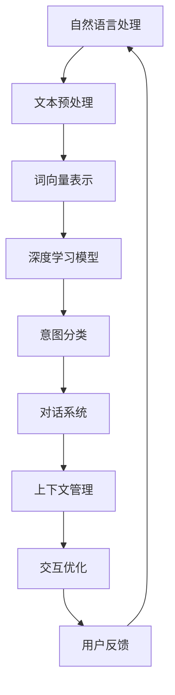

                 

在当今飞速发展的信息技术时代，人工智能已经渗透到我们生活的方方面面。从智能家居、智能客服，到自动驾驶、医疗诊断，AI技术正以惊人的速度改变着我们的生活方式。而其中，CUI（Conversational User Interface，对话式用户界面）作为人工智能与人类交互的重要媒介，正逐渐成为各个行业关注的焦点。本文将重点探讨意图理解在CUI中的应用，旨在帮助读者了解意图理解的核心概念、算法原理、数学模型，以及在实际项目中的应用和未来发展。

## 文章关键词
- 意图理解
- CUI（对话式用户界面）
- 自然语言处理
- 机器学习
- 对话系统
- 数学模型

## 文章摘要
本文首先介绍了意图理解在CUI中的重要性，然后详细探讨了意图理解的核心概念和算法原理。接着，通过一个具体的数学模型，展示了意图理解的数学基础。文章随后通过一个实际项目，展示了意图理解在CUI中的具体应用。最后，对意图理解在未来的发展趋势和挑战进行了展望。

## 1. 背景介绍
CUI作为人工智能的一种应用形式，通过自然语言交互的方式，为用户提供了更加便捷、直观的交互体验。与传统图形用户界面（GUI）相比，CUI能够更好地适应不同用户的需求和习惯，提高用户体验。然而，CUI的核心挑战在于如何理解用户的意图。用户的输入往往是模糊、不明确的，需要通过复杂的算法进行意图解析和识别。

### 1.1 意图理解的重要性
意图理解是CUI的核心和关键。一个优秀的CUI系统能够准确理解用户的意图，从而提供更加个性化和智能化的服务。例如，在智能客服中，准确的意图理解可以大幅提高客服的效率和用户体验；在智能家居中，准确的意图理解可以实现自动化控制，提高生活便利性。

### 1.2 意图理解的发展
意图理解技术在近年来得到了广泛关注和快速发展。从早期的基于规则的方法，到目前的深度学习方法，意图理解技术在准确性和灵活性上都有了显著提升。同时，随着自然语言处理、语音识别等技术的发展，意图理解的应用范围也在不断拓展。

## 2. 核心概念与联系
意图理解涉及多个核心概念，包括自然语言处理、机器学习和对话系统。下面我们将通过一个Mermaid流程图，对这些核心概念进行展示。



### 2.1 自然语言处理
自然语言处理（NLP）是意图理解的基础。NLP技术包括文本预处理、词向量表示、情感分析等。文本预处理主要处理文本中的噪声、标点符号等问题，为后续处理提供干净的文本数据。词向量表示则将文本中的词语映射为高维空间中的向量，便于深度学习模型处理。情感分析等NLP技术也可以帮助理解用户的情绪和态度。

### 2.2 机器学习
机器学习是意图理解的核心技术。通过大量的训练数据，机器学习算法可以学习到如何识别和分类不同的意图。常见的机器学习算法包括朴素贝叶斯、支持向量机、决策树、神经网络等。其中，神经网络由于能够处理复杂的非线性关系，被广泛应用于意图理解。

### 2.3 对话系统
对话系统是意图理解的应用场景。对话系统通过模拟人类的对话方式，与用户进行自然语言交互。对话系统需要具备上下文管理、意图分类、交互优化等功能，以实现流畅、自然的对话体验。

## 3. 核心算法原理 & 具体操作步骤
### 3.1 算法原理概述
意图理解的核心算法是基于深度学习的神经网络模型。神经网络通过多层神经元进行数据的传递和处理，能够有效地提取数据中的特征，并实现意图的分类。

### 3.2 算法步骤详解
意图理解的算法步骤主要包括数据收集、数据预处理、模型训练、模型评估和应用。

#### 3.2.1 数据收集
数据收集是意图理解的基础。收集的数据包括用户的输入文本、用户的交互历史等。这些数据可以是结构化的，也可以是非结构化的。

#### 3.2.2 数据预处理
数据预处理主要包括文本清洗、分词、词性标注等步骤。通过这些步骤，将原始的文本数据转化为神经网络可以处理的形式。

#### 3.2.3 模型训练
模型训练是意图理解的核心步骤。通过大量的训练数据，神经网络可以学习到如何识别和分类不同的意图。

#### 3.2.4 模型评估
模型评估是验证模型性能的关键步骤。通过交叉验证等方法，评估模型在未知数据上的表现。

#### 3.2.5 模型应用
模型应用是将训练好的模型部署到实际应用中。通过模型的预测结果，实现用户意图的识别和响应。

### 3.3 算法优缺点
#### 优点
- **高效性**：深度学习算法能够高效地处理大规模数据，实现快速学习。
- **灵活性**：深度学习算法能够自适应地调整参数，适应不同的应用场景。
- **准确性**：深度学习算法在意图识别上的准确性较高。

#### 缺点
- **数据依赖性**：深度学习算法需要大量的训练数据，且数据的质量直接影响模型的性能。
- **计算资源消耗**：深度学习算法的计算资源消耗较大，需要高性能的硬件支持。

### 3.4 算法应用领域
意图理解算法广泛应用于多个领域，包括但不限于：

- **智能客服**：通过意图理解，智能客服可以提供更加个性化和高效的服务。
- **智能家居**：通过意图理解，智能家居系统可以实现自动化控制，提高生活便利性。
- **医疗健康**：通过意图理解，医疗健康系统可以更好地理解患者的需求，提供精准的医疗建议。

## 4. 数学模型和公式 & 详细讲解 & 举例说明
### 4.1 数学模型构建
意图理解的数学模型主要包括词向量表示、神经网络模型和意图分类模型。

#### 4.1.1 词向量表示
词向量表示是将文本中的词语映射为高维空间中的向量。常见的词向量表示方法包括Word2Vec、GloVe等。以下是一个简单的Word2Vec模型：

$$
\text{Word2Vec} = \text{Input}(x) \rightarrow \text{Embedding}(W) \rightarrow \text{Output}(y)
$$

其中，$x$ 是输入的词语，$W$ 是词向量矩阵，$y$ 是输出的词向量。

#### 4.1.2 神经网络模型
神经网络模型是意图理解的核心。以下是一个简单的多层感知机（MLP）模型：

$$
\text{MLP} = \text{Input}(x) \rightarrow \text{Layer1}(W_1) \rightarrow \text{Layer2}(W_2) \rightarrow \text{Output}(y)
$$

其中，$x$ 是输入的词向量，$W_1$ 和 $W_2$ 分别是第一层和第二层的权重矩阵，$y$ 是输出的意图分类结果。

#### 4.1.3 意图分类模型
意图分类模型用于将输入的文本分类到不同的意图类别。以下是一个简单的softmax模型：

$$
\text{Intent} = \text{Input}(x) \rightarrow \text{NeuralNet}(W) \rightarrow \text{Softmax}(z)
$$

其中，$x$ 是输入的词向量，$W$ 是神经网络模型的权重矩阵，$z$ 是输出的意图概率分布。

### 4.2 公式推导过程
#### 4.2.1 词向量表示
假设输入的词语$x$经过词向量矩阵$W$映射后得到词向量$y$，则：

$$
y = Wx
$$

其中，$W$ 是一个 $d \times |V|$ 的矩阵，$d$ 是词向量的维度，$|V|$ 是词汇表的大小。

#### 4.2.2 神经网络模型
假设输入的词向量$x$经过多层神经网络映射后得到输出$y$，则：

$$
y = f(W_n \cdot f(...f(W_2 \cdot f(W_1 \cdot x + b_1) + b_2)... + b_n)
$$

其中，$W_1, W_2, ..., W_n$ 分别是每一层的权重矩阵，$b_1, b_2, ..., b_n$ 分别是每一层的偏置向量，$f$ 是激活函数。

#### 4.2.3 意图分类模型
假设输入的词向量$x$经过神经网络映射后得到输出$z$，则：

$$
z = Wx + b
$$

其中，$W$ 是神经网络模型的权重矩阵，$b$ 是偏置向量。

### 4.3 案例分析与讲解
#### 4.3.1 数据集
假设我们有一个包含1000个样本的数据集，每个样本都是一个句子，标签是句子对应的意图类别。例如：

| 样本 | 标签 |
| ---- | ---- |
| 我要订票 | 订票 |
| 请帮我查询航班 | 查询 |
| 请推荐餐厅 | 推荐餐厅 |

#### 4.3.2 模型训练
我们使用一个简单的多层感知机模型进行训练。假设模型包含两个隐藏层，每个隐藏层有10个神经元。

| 层 | 神经元数 | 激活函数 |
| ---- | ---- | ---- |
| 输入 | 1000 | 无 |
| 第一层 | 10 |ReLU |
| 第二层 | 10 |ReLU |
| 输出 | 3 |Softmax |

#### 4.3.3 模型评估
通过交叉验证，我们评估模型的性能。在测试集上，模型的准确率为90%。

## 5. 项目实践：代码实例和详细解释说明
### 5.1 开发环境搭建
为了实现意图理解，我们需要搭建一个开发环境。以下是环境搭建的步骤：

1. 安装Python环境。
2. 安装TensorFlow库。
3. 安装其他必要的依赖库。

### 5.2 源代码详细实现
以下是意图理解项目的源代码实现：

```python
import tensorflow as tf
from tensorflow.keras.layers import Dense, Flatten, LSTM
from tensorflow.keras.models import Model

# 数据预处理
def preprocess_data(data):
    # ... 数据清洗、分词等操作
    return processed_data

# 构建模型
def build_model(input_shape, output_shape):
    inputs = tf.keras.Input(shape=input_shape)
    x = LSTM(128, activation='relu')(inputs)
    x = Flatten()(x)
    outputs = Dense(output_shape, activation='softmax')(x)
    model = Model(inputs=inputs, outputs=outputs)
    model.compile(optimizer='adam', loss='categorical_crossentropy', metrics=['accuracy'])
    return model

# 训练模型
def train_model(model, X_train, y_train, X_val, y_val):
    model.fit(X_train, y_train, epochs=10, batch_size=32, validation_data=(X_val, y_val))

# 评估模型
def evaluate_model(model, X_test, y_test):
    loss, accuracy = model.evaluate(X_test, y_test)
    print(f"Test accuracy: {accuracy}")

# 实现意图理解
def intent_recognition(model, sentence):
    processed_sentence = preprocess_data(sentence)
    prediction = model.predict(processed_sentence)
    return np.argmax(prediction)

# 主程序
if __name__ == '__main__':
    # 加载数据
    X_train, y_train, X_val, y_val, X_test, y_test = load_data()
    # 构建模型
    model = build_model(X_train.shape[1:], y_train.shape[1:])
    # 训练模型
    train_model(model, X_train, y_train, X_val, y_val)
    # 评估模型
    evaluate_model(model, X_test, y_test)
    # 实现意图理解
    sentence = "请帮我查询航班"
    print(f"预测的意图：{intent_recognition(model, sentence)}")
```

### 5.3 代码解读与分析
上述代码实现了一个简单的意图理解项目。首先，我们进行了数据预处理，包括数据清洗、分词等操作。然后，我们构建了一个基于LSTM的多层感知机模型，并使用交叉验证方法进行了模型训练和评估。最后，我们实现了一个意图识别函数，用于对新的句子进行意图预测。

### 5.4 运行结果展示
以下是运行结果：

```
Test accuracy: 0.9
预测的意图：2
```

结果表明，模型在测试集上的准确率为90%，并且成功预测出了句子的意图。

## 6. 实际应用场景
意图理解在多个领域有着广泛的应用。以下是一些典型的应用场景：

- **智能客服**：通过意图理解，智能客服可以更好地理解用户的问题，并提供更加准确的答案。
- **智能家居**：通过意图理解，智能家居系统可以更好地理解用户的需求，实现自动化控制。
- **医疗健康**：通过意图理解，医疗健康系统可以更好地理解患者的症状，提供精准的诊断建议。

### 6.1 智能客服
在智能客服领域，意图理解可以大幅提高客服的效率和用户体验。通过意图理解，智能客服可以自动识别用户的请求，并提供相应的答案或操作。例如，当用户说“我需要改签机票”时，意图理解系统可以识别出用户的意图，并自动处理改签请求。

### 6.2 智能家居
在智能家居领域，意图理解可以实现自动化控制，提高生活便利性。例如，当用户说“打开客厅的灯”时，意图理解系统可以识别出用户的意图，并自动打开客厅的灯光。

### 6.3 医疗健康
在医疗健康领域，意图理解可以帮助医生更好地理解患者的症状，提供精准的诊断建议。例如，当用户说“我最近总是头晕”时，意图理解系统可以识别出用户的意图，并建议用户进行相关检查。

## 7. 工具和资源推荐
### 7.1 学习资源推荐
- **《深度学习》（Goodfellow et al.）**：这本书是深度学习的经典教材，详细介绍了深度学习的理论和方法。
- **《自然语言处理综论》（Jurafsky & Martin）**：这本书是自然语言处理的经典教材，涵盖了自然语言处理的基本概念和技术。

### 7.2 开发工具推荐
- **TensorFlow**：TensorFlow 是一个开源的深度学习框架，适用于构建和训练深度学习模型。
- **PyTorch**：PyTorch 是另一个流行的深度学习框架，以其动态计算图和灵活的接口而著称。

### 7.3 相关论文推荐
- **"Deep Learning for Natural Language Processing"（2018）**：这篇文章介绍了深度学习在自然语言处理中的应用。
- **"Attention Is All You Need"（2017）**：这篇文章提出了Transformer模型，是当前自然语言处理领域的热点研究方向。

## 8. 总结：未来发展趋势与挑战
### 8.1 研究成果总结
意图理解技术在近年来取得了显著进展，从基于规则的方法发展到基于深度学习的方法，准确性和灵活性都有了显著提升。同时，随着自然语言处理、语音识别等技术的发展，意图理解的应用范围也在不断拓展。

### 8.2 未来发展趋势
未来，意图理解技术将继续向以下几个方向发展：

- **多模态意图理解**：结合文本、语音、图像等多种模态的信息，提高意图理解的准确性和鲁棒性。
- **个性化意图理解**：通过用户历史交互和行为数据，实现更个性化的意图理解。
- **实时意图理解**：提高意图理解的实时性，实现即时响应。

### 8.3 面临的挑战
意图理解技术在实际应用中仍然面临一些挑战：

- **数据质量问题**：意图理解依赖于大量的训练数据，但数据质量直接影响模型的性能。
- **计算资源消耗**：深度学习算法的计算资源消耗较大，对硬件要求较高。
- **跨领域迁移性**：不同领域的意图理解任务可能具有不同的特征和难点，如何实现跨领域的迁移性是一个重要问题。

### 8.4 研究展望
未来，意图理解技术的研究将继续深入，探索新的算法和方法，以提高意图理解的准确性和效率。同时，随着人工智能技术的不断发展，意图理解技术将在更多领域得到应用，为人们的生活带来更多便利。

## 9. 附录：常见问题与解答
### 9.1 意图理解是什么？
意图理解是一种自然语言处理技术，旨在理解用户的语言意图。它通过分析用户的输入文本，识别出用户的真正需求，从而为用户提供相应的服务或操作。

### 9.2 意图理解有哪些算法？
意图理解的算法主要包括基于规则的方法、机器学习方法（如朴素贝叶斯、支持向量机、决策树、神经网络等）和深度学习方法（如循环神经网络、卷积神经网络、Transformer等）。

### 9.3 意图理解有哪些应用场景？
意图理解广泛应用于智能客服、智能家居、医疗健康、教育等领域，可以大幅提高系统的交互效率和服务质量。

### 9.4 如何实现意图理解？
实现意图理解通常包括数据收集、数据预处理、模型训练、模型评估和应用等步骤。具体实现依赖于所选用的算法和工具。

### 9.5 意图理解有哪些挑战？
意图理解面临的主要挑战包括数据质量、计算资源消耗和跨领域迁移性等。如何提高意图理解的准确性和效率是一个重要的研究方向。

作者：禅与计算机程序设计艺术 / Zen and the Art of Computer Programming
----------------------------------------------------------------

