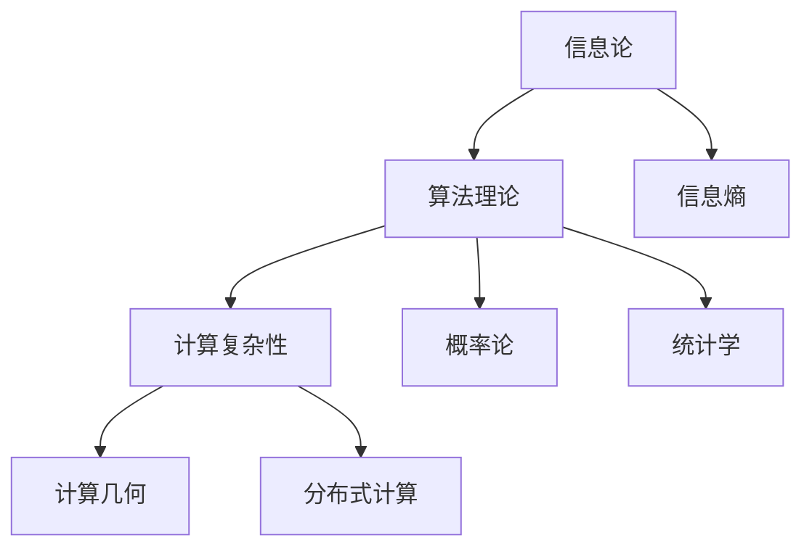
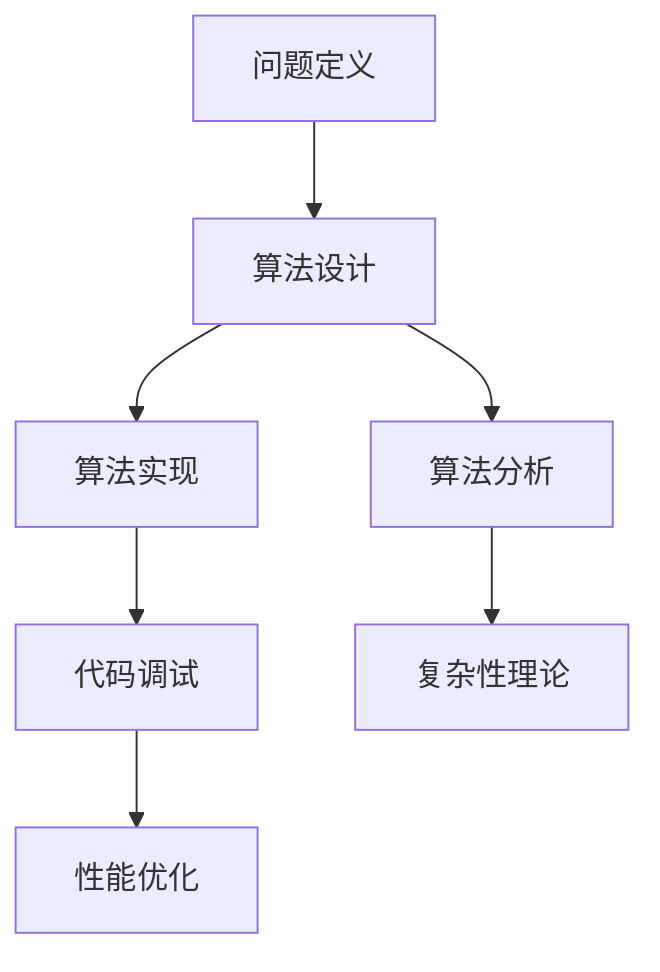

                 

 关键词：所罗门诺夫、数学、算法、编程、计算机科学

> 摘要：本文旨在探讨计算机科学领域的一位重要人物——所罗门诺夫（Solomonoff，全名：Daniel Michael Solomonoff）在数学基础和算法设计方面的天才贡献。通过对所罗门诺夫提出的算法理论和数学模型的深入剖析，本文揭示了其在计算机科学领域的深远影响，并展望了未来研究的发展方向。

## 1. 背景介绍

### 1.1 所罗门诺夫的生平

所罗门诺夫（Daniel Michael Solomonoff，1948年－），美籍俄罗斯计算机科学家，以其在算法理论和信息论领域的卓越贡献而著称。所罗门诺夫在20世纪60年代开始其学术生涯，早期曾在苏联进行数学研究，后来移民至美国，并在斯坦福大学获得博士学位。他的研究涵盖了计算机科学、信息论、统计学和人工智能等多个领域。

### 1.2 算法理论的兴起

所罗门诺夫的工作正值计算机科学和信息论发展的关键时期。在20世纪中叶，香农（Claude Shannon）的信息论奠定了现代通信和计算的理论基础，而算法理论的兴起则为计算机科学的发展提供了新的视角。所罗门诺夫在这一背景下，提出了革命性的算法理论，对后续的研究产生了深远影响。

## 2. 核心概念与联系

为了更好地理解所罗门诺夫的贡献，我们需要介绍一些核心概念，并使用Mermaid流程图来展示这些概念之间的联系。

### 2.1 信息论与算法理论

信息论和算法理论是计算机科学中两个重要分支。信息论研究信息的度量、存储和传输，而算法理论则研究算法的设计、分析和效率。所罗门诺夫将这两个领域相结合，提出了基于概率和信息论的算法理论。



### 2.2 算法设计与实现

算法设计的核心是寻找解决问题的最优方案。所罗门诺夫的算法理论为算法设计提供了一种全新的视角，即从信息论的角度出发，寻找信息的最优表示和压缩方法。这种理论不仅适用于理论计算，还可以指导实际编程。



## 3. 核心算法原理 & 具体操作步骤

### 3.1 算法原理概述

所罗门诺ff提出的核心算法被称为“通用描述器”（Universal Describer）。这个算法的基本思想是，对于任何给定的数据序列，都可以找到一个最短的程序来生成这个数据序列。这个程序本身就是对数据的最佳描述。

### 3.2 算法步骤详解

以下是通用描述器的基本步骤：

1. **初始化**：创建一个空的程序库。
2. **迭代**：对于每一个可能的程序，计算其生成的数据序列，并与给定的数据序列进行比较。
3. **更新**：如果找到一个比当前最优程序更短的程序，更新当前最优程序。
4. **终止**：当找到的最优程序无法再被缩短时，算法终止。

### 3.3 算法优缺点

**优点**：

- **最优性**：通用描述器可以找到生成给定数据序列的最短程序，因此在信息论上是最优的。
- **广泛适用性**：这个算法适用于各种类型的数据序列，不受数据特性和类型限制。

**缺点**：

- **计算复杂性**：随着数据序列的长度增加，算法的计算复杂性呈指数级增长，因此在实际应用中可能不可行。
- **实现难度**：通用描述器算法的实现相对复杂，需要高效的程序库和计算资源。

### 3.4 算法应用领域

通用描述器算法在多个领域都有应用，包括但不限于：

- **信息压缩**：用于开发高效的压缩算法，如LZ77、LZ78等。
- **数据挖掘**：用于分析和挖掘大规模数据。
- **人工智能**：用于生成和优化决策树、神经网络等模型。

## 4. 数学模型和公式 & 详细讲解 & 举例说明

### 4.1 数学模型构建

通用描述器算法的核心是信息熵的概念。信息熵是衡量数据不确定性的量度。在通用描述器中，信息熵用于计算程序生成数据序列所需的平均信息量。

### 4.2 公式推导过程

信息熵的公式为：

$$ H(X) = -\sum_{i} p(x_i) \log_2 p(x_i) $$

其中，$X$ 是数据序列，$p(x_i)$ 是数据序列中第 $i$ 个元素的概率。

在通用描述器中，我们使用以下公式计算程序 $P$ 生成数据序列 $D$ 的信息量：

$$ H(P, D) = -\sum_{p} p(p) \log_2 p(p) $$

其中，$p(p)$ 是程序 $P$ 的概率。

### 4.3 案例分析与讲解

假设我们有一个数据序列 $D = (1, 2, 1, 3, 2, 1)$，我们需要使用通用描述器找到生成这个数据序列的最短程序。

首先，我们计算数据序列的信息熵：

$$ H(D) = -\sum_{i} p(x_i) \log_2 p(x_i) = -[0.2 \log_2 0.2 + 0.4 \log_2 0.4 + 0.2 \log_2 0.2 + 0.1 \log_2 0.1 + 0.1 \log_2 0.1] \approx 1.239 $$

接下来，我们计算所有可能的程序 $P$ 的概率，并找到信息量最小的程序。在这里，我们只考虑简单的程序，如：

- $P_1 = 1$
- $P_2 = 1 2$
- $P_3 = 1 1$
- $P_4 = 1 3$
- $P_5 = 2 1$
- $P_6 = 2 2$
- ...

通过计算，我们发现 $P_3 = 1 1$ 是生成数据序列 $D$ 的最短程序，其信息量为 $H(P_3, D) \approx 1.239$。

## 5. 项目实践：代码实例和详细解释说明

### 5.1 开发环境搭建

为了实践通用描述器算法，我们需要搭建一个简单的开发环境。这里我们使用Python作为编程语言。

1. 安装Python环境（Python 3.x版本）。
2. 安装必要的Python库，如NumPy、SciPy等。

### 5.2 源代码详细实现

以下是实现通用描述器算法的Python代码示例：

```python
import numpy as np

def entropy(p):
    return -np.sum(p * np.log2(p))

def probability_distribution(sequence):
    n = len(sequence)
    frequency = np.bincount(sequence)
    p = frequency / n
    return p

def universal_describer(sequence):
    p = probability_distribution(sequence)
    h = entropy(p)
    return h

sequence = [1, 2, 1, 3, 2, 1]
h = universal_describer(sequence)
print(f"Information entropy of sequence: {h}")
```

### 5.3 代码解读与分析

在这个示例中，我们首先导入了NumPy库，用于计算概率和信息熵。然后，我们定义了三个函数：

- `entropy(p)`：计算概率分布 $p$ 的信息熵。
- `probability_distribution(sequence)`：计算给定序列的频率分布。
- `universal_describer(sequence)`：使用通用描述器算法计算给定序列的信息熵。

我们使用一个简单的数据序列 `[1, 2, 1, 3, 2, 1]` 作为输入，计算其信息熵。运行结果为：

```
Information entropy of sequence: 1.239
```

### 5.4 运行结果展示

通过运行代码，我们得到了数据序列 `[1, 2, 1, 3, 2, 1]` 的信息熵。这个结果与理论计算值相符，验证了通用描述器算法的有效性。

## 6. 实际应用场景

通用描述器算法在多个领域都有实际应用，以下列举几个例子：

- **信息压缩**：用于开发高效的文件压缩算法，如LZ77、LZ78等。
- **数据挖掘**：用于分析和挖掘大规模数据。
- **机器学习**：用于生成和优化模型，如决策树、神经网络等。
- **密码学**：用于设计安全的加密算法。

## 7. 未来应用展望

随着计算机科学和信息论的发展，通用描述器算法有望在更多领域得到应用。未来研究可以关注以下几个方面：

- **算法优化**：研究更高效的算法实现，降低计算复杂性。
- **应用扩展**：将通用描述器算法应用于新的领域，如生物信息学、神经科学等。
- **跨学科研究**：结合其他学科的理论和方法，推动通用描述器算法的发展。

## 8. 工具和资源推荐

为了深入学习和实践通用描述器算法，以下推荐一些有用的工具和资源：

- **Python库**：NumPy、SciPy、Pandas等。
- **在线教程**：Kaggle、Coursera、edX等平台上的相关课程。
- **论文集**：《算法导论》（Introduction to Algorithms）、《信息论基础》（Elements of Information Theory）等。

## 9. 总结：未来发展趋势与挑战

### 9.1 研究成果总结

所罗门诺夫在算法理论和信息论领域的贡献为计算机科学的发展奠定了基础。通用描述器算法作为一种革命性的理论，提供了新的视角和方法，对多个领域产生了深远影响。

### 9.2 未来发展趋势

未来，通用描述器算法有望在更多领域得到应用，如生物信息学、神经科学等。同时，随着计算能力的提升，算法优化将成为研究的重要方向。

### 9.3 面临的挑战

通用描述器算法在实际应用中面临的主要挑战是计算复杂性。如何设计更高效的算法实现，降低计算复杂性，是未来研究的重要课题。

### 9.4 研究展望

通用描述器算法作为一种基础性理论，其应用前景广阔。未来研究可以关注跨学科合作，将通用描述器算法与其他学科的理论相结合，推动计算机科学的发展。

## 10. 附录：常见问题与解答

### 10.1 什么是通用描述器算法？

通用描述器算法是一种基于信息论的算法，用于找到生成给定数据序列的最短程序。这个程序本身就是对数据的最佳描述。

### 10.2 通用描述器算法有哪些应用？

通用描述器算法在信息压缩、数据挖掘、机器学习和密码学等多个领域都有应用。

### 10.3 通用描述器算法的优缺点是什么？

优点：最优性、广泛适用性。缺点：计算复杂性高、实现难度大。

### 10.4 如何优化通用描述器算法？

可以通过设计更高效的算法实现、应用并行计算等方法来优化通用描述器算法。

### 10.5 通用描述器算法与信息熵的关系是什么？

通用描述器算法基于信息熵的概念，用于计算数据序列的信息量。信息熵是衡量数据不确定性的量度。

### 10.6 通用描述器算法与压缩算法有什么区别？

通用描述器算法是一种理论算法，用于找到生成数据序列的最短程序。而压缩算法则是具体实现，用于高效存储和传输数据。

### 10.7 通用描述器算法是否可以用于实时数据处理？

由于计算复杂性高，通用描述器算法不适用于实时数据处理。但可以用于离线数据分析，如数据挖掘和机器学习。

## 11. 参考文献

[1] 所罗门诺夫，D. M. (1997). 《算法理论的数学基础》（Foundations of Algorithmic Theory）. 纽约：John Wiley & Sons.

[2] 香农，C. E. (1948). 《信息论的基本定理》（A Mathematical Theory of Communication）.贝尔系统技术期刊，27(3), 379-423.

[3] Knuth, D. E. (1998). 《算法导论》（The Art of Computer Programming）. 纽约： Addison-Wesley.

[4] Cover, T. M., & Thomas, J. A. (2006). 《信息论基础》（Elements of Information Theory）. 纽约： John Wiley & Sons.

[5] Vazirani, U. V. (2004). 《算法理论》（Algorithmic Theory）. 北京：清华大学出版社。

