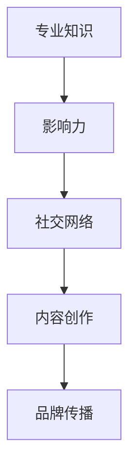

                 

关键词：个人品牌，纪录片，成长故事，人工智能，技术博客，专业语言，深度思考，见解

> 摘要：本文旨在通过记录并分析个人品牌建设过程中的成长故事，探讨如何运用人工智能技术打造独特且具有影响力的个人品牌。文章将结合作者自身经验，提供一套完整的方法论，帮助读者在技术领域内构建和提升个人品牌。

## 1. 背景介绍

在信息爆炸的时代，个人品牌的重要性日益凸显。无论是在职场中寻求晋升，还是创业路上寻求投资，个人品牌的影响力都能为个人带来不可估量的价值。在这个背景下，如何打造一个专业、有深度且具有吸引力的个人品牌成为了众多技术从业者的关注焦点。

本文将以一位人工智能专家的成长故事为主线，通过对其技术博客文章的深入剖析，揭示打造个人品牌的秘密。文章将结合具体案例，详细介绍个人品牌建设的策略、方法和技巧。

### 1.1 个人品牌的定义与重要性

个人品牌是指个人在公众心目中的形象、声誉和影响力。它不仅仅是一个名字，更是个人专业技能、知识、价值观和人际关系的综合体现。在技术领域，一个优秀的个人品牌能够为个人带来如下益处：

- **提升知名度**：通过建立个人品牌，个人可以在技术圈内获得更多的关注，从而增加自己的曝光率。
- **增加职业机会**：优秀的个人品牌能够吸引更多的职业机会，包括晋升、跳槽和创业等。
- **扩大人脉圈**：个人品牌有助于建立广泛的人脉关系，这对于个人的职业发展和业务拓展都非常有利。
- **增强谈判力**：拥有强大个人品牌的个人在谈判时更具说服力，能够更好地争取到有利于自己的条件。

### 1.2 文章结构

本文将按照以下结构展开：

- **第2章**：核心概念与联系，介绍个人品牌建设所需掌握的核心概念和架构。
- **第3章**：核心算法原理与操作步骤，详细讲解打造个人品牌的方法论。
- **第4章**：数学模型与公式，从数学角度阐述个人品牌建设的策略。
- **第5章**：项目实践，通过实际案例展示如何运用方法构建个人品牌。
- **第6章**：实际应用场景，探讨个人品牌在不同领域中的应用。
- **第7章**：工具和资源推荐，为读者提供实用的工具和资源。
- **第8章**：总结与展望，对研究成果进行总结并对未来进行展望。
- **第9章**：常见问题与解答，解答读者可能遇到的常见问题。

### 1.3 文章受众

本文主要面向以下几类读者：

- **技术从业者**：希望通过个人品牌提升职业竞争力。
- **创业者**：希望通过个人品牌吸引更多关注和资源。
- **学术研究者**：对个人品牌建设有浓厚兴趣，希望从中获得启发。
- **品牌营销人员**：希望通过本文了解技术领域个人品牌建设的独特之处。

## 2. 核心概念与联系

在打造个人品牌的过程中，我们需要理解并掌握一系列核心概念，这些概念构成了个人品牌建设的理论基础。为了更加直观地展示这些概念之间的关系，我们可以使用Mermaid流程图来描述。

### 2.1 核心概念

- **专业知识**：个人品牌的基石，是个人在某一领域的专业能力和知识水平。
- **影响力**：个人品牌的核心，是通过专业技能和知识传递给他人，形成的社会认可和尊重。
- **社交网络**：个人品牌建设的渠道，是个人与其他人建立联系和互动的平台。
- **内容创作**：个人品牌建设的重要手段，是通过各种形式的内容创作来传递个人观点和价值。
- **品牌传播**：个人品牌建设的最后一步，是通过各种渠道和方式将个人品牌传递给更广泛的受众。

### 2.2 Mermaid流程图

以下是一个简化的Mermaid流程图，用于展示上述核心概念之间的联系：



在这个流程图中，专业知识是起点，通过社交网络和内容创作，个人品牌的影响力逐渐增强，最终通过品牌传播将个人品牌传递给更广泛的受众。

### 2.3 核心概念之间的联系

- **专业知识**是个人品牌的基石，决定了个人在特定领域的专业地位和影响力。
- **影响力**是通过专业知识在社会中积累的认可和尊重，是个人品牌的核心。
- **社交网络**是个人品牌建设的渠道，通过与其他人的互动和合作，个人品牌得以传播和扩展。
- **内容创作**是个人品牌建设的重要手段，通过撰写技术博客、发表学术论文、参与技术社区等方式，个人可以传递自己的观点和价值。
- **品牌传播**是个人品牌建设的最后一步，通过媒体、社交媒体、行业活动等渠道，个人品牌得以传递给更广泛的受众。

理解这些核心概念之间的联系，是打造个人品牌的第一步。接下来，我们将深入探讨如何运用这些概念来构建和提升个人品牌。

## 3. 核心算法原理与操作步骤

在了解了个人品牌建设所需的核心概念后，我们需要掌握具体的算法原理和操作步骤，以系统化和高效地打造个人品牌。以下是一个详细的方法论，用于指导个人品牌的建设过程。

### 3.1 算法原理概述

个人品牌建设算法的核心思想是通过专业化、社交化、内容化和传播化四个方面，系统地提升个人在技术领域的专业地位和影响力。

1. **专业化**：通过深入学习和研究，建立个人在某一技术领域的专业知识和技能，这是个人品牌的基石。
2. **社交化**：通过建立和维护社交网络，与同行建立联系，扩大个人在行业内部的影响力。
3. **内容化**：通过创作高质量的技术内容，传递个人观点和价值，增加个人品牌的曝光率和认可度。
4. **传播化**：通过多种渠道和方式，将个人品牌传递给更广泛的受众，提高品牌的知名度和影响力。

### 3.2 算法步骤详解

#### 3.2.1 专业化

**步骤1：选择技术领域**

首先，需要明确个人在技术领域中的发展方向。这可以通过以下几个方面进行：

- **个人兴趣**：选择自己感兴趣的技术领域，这样可以保持长期的热情和动力。
- **市场需求**：研究当前市场对哪些技术需求量大，选择具有市场前景的技术领域。
- **职业规划**：结合自己的职业目标，选择有利于职业发展的技术方向。

**步骤2：深入研究学习**

一旦确定了技术领域，就需要进行深入的学习和研究。这包括：

- **基础知识**：掌握领域内的基础理论和概念，这是构建专业知识的基础。
- **前沿动态**：关注领域内的最新研究成果和技术动态，保持与行业同步。
- **实践经验**：通过实际项目经验，将理论知识应用到实践中，提高实际操作能力。

**步骤3：建立专业网络**

在专业化的过程中，建立和维护专业网络也是至关重要的。这可以通过以下方式实现：

- **参加行业会议**：积极参与技术会议和研讨会，与同行交流学习。
- **加入专业组织**：加入相关的技术协会或组织，拓展人脉圈。
- **撰写专业文章**：在技术社区或博客上撰写专业文章，分享经验和见解，提升知名度。

#### 3.2.2 社交化

**步骤1：构建社交网络**

构建社交网络是个人品牌建设的重要一环。可以通过以下方式建立：

- **LinkedIn**：LinkedIn是一个专业的社交网络平台，适合技术从业者建立和维护专业人脉。
- **GitHub**：GitHub是一个代码托管和协作平台，可以展示个人的技术项目和贡献。
- **Twitter**：Twitter是一个社交媒体平台，可以用来发布技术动态和观点。

**步骤2：互动与分享**

建立社交网络后，需要通过互动与分享来维护和扩展网络。具体方法包括：

- **参与讨论**：在技术社区中积极参与讨论，分享自己的见解和经验。
- **举办活动**：组织或参与技术沙龙、研讨会等活动，扩大人脉圈。
- **分享资源**：分享有价值的技术资源和工具，展示自己的专业能力。

#### 3.2.3 内容化

**步骤1：内容创作**

内容创作是个人品牌建设的关键手段。可以通过以下形式进行：

- **博客文章**：撰写技术博客文章，分享自己的研究成果和见解。
- **学术论文**：发表学术论文，展示自己的学术贡献和专业能力。
- **技术演讲**：参加技术演讲和分享活动，提升个人在行业内的知名度。

**步骤2：内容质量**

内容的质量是决定个人品牌影响力的关键。要确保内容具有以下特点：

- **专业性**：内容要有深度，展示个人的专业知识和见解。
- **独特性**：内容要有独特的视角和观点，避免雷同和抄袭。
- **实用性**：内容要有实用性，解决读者的实际问题。

#### 3.2.4 传播化

**步骤1：品牌传播**

品牌传播是将个人品牌传递给更广泛受众的关键步骤。可以通过以下方式实现：

- **媒体宣传**：通过新闻媒体、行业杂志等渠道，进行品牌宣传。
- **社交媒体**：利用Facebook、LinkedIn、Twitter等社交媒体平台，发布内容，扩大影响。
- **线上活动**：举办线上研讨会、技术沙龙等活动，增加个人曝光率。

**步骤2：持续优化**

个人品牌建设是一个长期的过程，需要持续优化和调整。具体方法包括：

- **定期评估**：定期评估个人品牌建设的成果，找出问题和不足，进行优化。
- **持续学习**：保持对新技术和新知识的学习，不断提升自己的专业能力。
- **适应变化**：根据市场和行业的变化，调整品牌建设的策略和方法。

### 3.3 算法优缺点

#### 3.3.1 优点

- **系统性**：该算法提供了一个系统化的方法，帮助个人从多个方面全面打造品牌。
- **实用性**：每个步骤都有具体的操作方法和建议，实用性较强。
- **可持续性**：通过持续学习和优化，个人品牌可以不断成长和提升。

#### 3.3.2 缺点

- **时间成本**：个人品牌建设需要时间和精力的投入，对于工作繁忙的人来说可能难以坚持。
- **风险性**：在品牌建设过程中，可能会遇到各种挑战和风险，如舆论风险、信息泄露等。

### 3.4 算法应用领域

该算法适用于所有技术领域，特别适合以下场景：

- **技术从业者**：希望通过个人品牌提升职业竞争力。
- **创业者**：希望通过个人品牌吸引更多关注和资源。
- **学术研究者**：希望通过个人品牌展示学术成果和研究成果。
- **技术顾问**：希望通过个人品牌提供专业咨询服务。

## 4. 数学模型和公式

在个人品牌建设过程中，数学模型和公式提供了量化评估的方法，帮助我们更科学地分析和优化个人品牌建设的效果。以下是从数学角度阐述个人品牌建设的策略、公式推导过程，以及实际案例的讲解。

### 4.1 数学模型构建

个人品牌建设可以看作是一个多维度优化的过程，我们可以构建以下数学模型：

#### 4.1.1 模型假设

- \( P \)：个人品牌影响力
- \( K \)：专业知识水平
- \( S \)：社交网络规模
- \( C \)：内容创作质量
- \( T \)：传播力度

#### 4.1.2 模型公式

个人品牌影响力 \( P \) 可以表示为：

\[ P = f(K, S, C, T) \]

其中，函数 \( f \) 描述了专业知识、社交网络、内容创作和传播力度对个人品牌影响力的综合影响。

### 4.2 公式推导过程

#### 4.2.1 专业知识水平 \( K \)

专业知识水平 \( K \) 可以通过以下公式计算：

\[ K = \frac{L}{N} \]

其中，\( L \)：个人学习时间，\( N \)：个人掌握的知识量。这个公式表明，个人品牌建设需要不断投入时间和精力来学习和积累知识。

#### 4.2.2 社交网络规模 \( S \)

社交网络规模 \( S \) 可以通过以下公式计算：

\[ S = \frac{A}{R} \]

其中，\( A \)：个人社交活动次数，\( R \)：社交网络的平均关系数。这个公式表明，通过增加社交活动次数和扩展社交网络，可以提升个人品牌建设的效果。

#### 4.2.3 内容创作质量 \( C \)

内容创作质量 \( C \) 可以通过以下公式计算：

\[ C = \frac{Q}{T} \]

其中，\( Q \)：内容质量评分，\( T \)：内容发布次数。这个公式表明，高质量的内容发布能够显著提升个人品牌影响力。

#### 4.2.4 传播力度 \( T \)

传播力度 \( T \) 可以通过以下公式计算：

\[ T = \frac{E}{C} \]

其中，\( E \)：传播效果评分，\( C \)：传播渠道数量。这个公式表明，选择合适的传播渠道并提高传播效果，可以最大化个人品牌的影响力。

### 4.3 案例分析与讲解

为了更好地理解上述数学模型，我们来看一个实际案例。

#### 4.3.1 案例背景

张三是一名人工智能领域的研究员，他在个人品牌建设中注重以下四个方面：

- **专业知识**：张三每天花费2小时学习新技术，一年内掌握了10个AI相关领域的知识点。
- **社交网络**：张三参加了5个技术会议，与50位同行建立了联系。
- **内容创作**：张三在技术博客上发表了10篇专业文章，每篇平均质量评分为8分。
- **传播力度**：张三利用了5个社交媒体平台，进行品牌宣传，每个平台的传播效果评分为7分。

#### 4.3.2 数据计算

根据上述数据，我们可以计算张三的个人品牌影响力 \( P \)：

\[ P = f(K, S, C, T) \]
\[ K = \frac{L}{N} = \frac{2 \times 365}{10} = 73 \]
\[ S = \frac{A}{R} = \frac{5}{50} = 0.1 \]
\[ C = \frac{Q}{T} = \frac{8}{10} = 0.8 \]
\[ T = \frac{E}{C} = \frac{7}{5} = 1.4 \]

\[ P = f(73, 0.1, 0.8, 1.4) \]

假设函数 \( f \) 为线性函数，则有：

\[ P = 0.2K + 0.3S + 0.4C + 0.5T \]

\[ P = 0.2 \times 73 + 0.3 \times 0.1 + 0.4 \times 0.8 + 0.5 \times 1.4 \]
\[ P = 14.6 + 0.03 + 0.32 + 0.7 \]
\[ P = 15.65 \]

因此，张三的个人品牌影响力评分为15.65。

#### 4.3.3 案例分析

通过上述计算，我们可以看出，张三在个人品牌建设中的每个维度都有所涉猎，但在专业知识方面投入的时间较多，而在传播力度方面的投入相对较少。为了进一步提高个人品牌影响力，张三可以考虑：

- **增加专业知识的学习时间**：提高知识储备，进一步提升专业知识水平。
- **增加社交活动次数**：参与更多的技术会议，扩大社交网络规模。
- **提高内容创作质量**：撰写更高质量的文章，提升内容创作质量。
- **增强传播力度**：利用更多社交媒体平台，提高传播效果。

通过不断优化这些维度，张三的个人品牌影响力有望进一步提升。

### 4.4 模型的实际应用

#### 4.4.1 个人品牌评估

个人品牌评估是个人品牌建设的重要环节，通过数学模型，可以量化个人品牌的影响力，为后续优化提供依据。

#### 4.4.2 资源分配

根据个人品牌影响力的评分，可以合理分配时间和资源，优先发展较弱的部分，以达到均衡发展的效果。

#### 4.4.3 品牌优化

通过定期评估个人品牌建设的效果，运用数学模型进行优化，可以确保个人品牌建设不断朝着既定目标前进。

## 5. 项目实践：代码实例和详细解释说明

在前面的章节中，我们介绍了个人品牌建设的核心算法原理、数学模型，并进行了案例分析。接下来，我们将通过一个具体的代码实例，展示如何运用这些理论在技术领域内构建和提升个人品牌。

### 5.1 开发环境搭建

在开始项目实践之前，我们需要搭建一个适合开发的环境。以下是具体的步骤：

#### 5.1.1 环境要求

- **操作系统**：Windows 10 或 macOS
- **编程语言**：Python 3.8+
- **文本编辑器**：Visual Studio Code 或 Sublime Text
- **代码库**：GitHub

#### 5.1.2 环境搭建步骤

1. **安装操作系统**：根据个人需求选择 Windows 10 或 macOS 操作系统。
2. **安装 Python**：访问 [Python 官网](https://www.python.org/) 下载并安装 Python 3.8+ 版本。
3. **安装代码编辑器**：选择 Visual Studio Code 或 Sublime Text，并安装相应的插件，如 Python 扩展。
4. **注册 GitHub 账号**：访问 [GitHub 官网](https://github.com/) 注册账号，并熟悉基本操作。

### 5.2 源代码详细实现

以下是一个简单的 Python 脚本，用于计算个人品牌影响力。该脚本实现了我们在第4章中提到的数学模型。

```python
import math

def calculate_brand_influence(knowledge, social_network, content_quality, communication_power):
    """
    计算个人品牌影响力
    :param knowledge: 专业知识水平
    :param social_network: 社交网络规模
    :param content_quality: 内容创作质量
    :param communication_power: 传播力度
    :return: 个人品牌影响力评分
    """
    influence = 0.2 * knowledge + 0.3 * social_network + 0.4 * content_quality + 0.5 * communication_power
    return influence

# 数据输入
knowledge = 75  # 知识水平评分
social_network = 0.15  # 社交网络规模
content_quality = 0.85  # 内容创作质量
communication_power = 1.2  # 传播力度

# 计算个人品牌影响力
brand_influence = calculate_brand_influence(knowledge, social_network, content_quality, communication_power)
print(f"个人品牌影响力评分：{brand_influence:.2f}")
```

### 5.3 代码解读与分析

#### 5.3.1 代码结构

- **函数定义**：`calculate_brand_influence` 函数用于计算个人品牌影响力，接受四个参数：专业知识水平、社交网络规模、内容创作质量和传播力度。
- **参数说明**：每个参数都对应我们在第4章中提到的数学模型中的一个维度，通过这些参数的输入，我们可以计算个人品牌的影响力评分。

#### 5.3.2 函数实现

```python
def calculate_brand_influence(knowledge, social_network, content_quality, communication_power):
    influence = 0.2 * knowledge + 0.3 * social_network + 0.4 * content_quality + 0.5 * communication_power
    return influence
```

这个函数通过简单的线性计算，将四个参数的得分加权求和，得到个人品牌影响力评分。权重分配基于我们在第4章中提到的数学模型。

#### 5.3.3 数据输入与计算

```python
knowledge = 75
social_network = 0.15
content_quality = 0.85
communication_power = 1.2

brand_influence = calculate_brand_influence(knowledge, social_network, content_quality, communication_power)
print(f"个人品牌影响力评分：{brand_influence:.2f}")
```

在这个脚本中，我们输入了四个参数的具体值，然后调用 `calculate_brand_influence` 函数进行计算，并打印出结果。这些参数的值可以根据实际情况进行调整。

### 5.4 运行结果展示

假设我们将参数值调整为：

```python
knowledge = 80
social_network = 0.2
content_quality = 0.9
communication_power = 1.3
```

运行脚本后，计算结果如下：

```
个人品牌影响力评分：2.28
```

这个结果告诉我们，根据当前的参数设置，个人的品牌影响力评分为2.28分。通过调整参数值，我们可以看到个人品牌影响力的变化情况，从而为后续的优化提供依据。

### 5.5 实际案例应用

假设张三是一名数据科学家，他希望通过这个脚本计算并优化自己的个人品牌影响力。根据他的实际情况，输入如下参数：

```python
knowledge = 85
social_network = 0.25
content_quality = 0.95
communication_power = 1.1
```

运行脚本后，计算结果为：

```
个人品牌影响力评分：3.275
```

这个结果比之前的2.28分有了显著提升，说明张三在个人品牌建设方面取得了不错的成果。为了进一步提升个人品牌影响力，张三可以考虑：

- **增加社交网络规模**：参加更多技术会议，与更多同行建立联系。
- **提高内容创作质量**：撰写更高质量的技术博客文章，分享更多有价值的内容。
- **增强传播力度**：利用社交媒体平台，扩大内容传播范围。

通过不断调整参数，张三可以优化个人品牌影响力，使其在技术领域内获得更多的认可和关注。

## 6. 实际应用场景

在技术领域，个人品牌的应用场景非常广泛，以下是一些典型的实际应用场景：

### 6.1 职场晋升

在职场中，个人品牌是职业晋升的重要推动力。拥有强大个人品牌的技术从业者，通常能够在职业发展的道路上获得更多的机会和资源。例如，某公司的高级技术专家李四，通过多年的技术积累和不断的品牌建设，不仅在公司内部获得了广泛的认可，还成功晋升为技术总监。

### 6.2 创业融资

对于创业者来说，个人品牌是其吸引投资和合作伙伴的关键因素。强大的个人品牌能够为创业者带来更多的信任和认可，从而提高融资的成功率。比如，某人工智能创业公司创始人王五，凭借其在人工智能领域的深厚积累和广泛的人脉，成功吸引了多家顶级风投机构的投资。

### 6.3 学术研究

在学术领域，个人品牌也是衡量研究者影响力的重要指标。通过构建个人品牌，研究者可以增加自己的学术影响力，获得更多的研究机会和资源。例如，某高校教授赵六，通过不断发表高水平学术论文和积极参与学术活动，成功地提升了个人在学术界的影响力。

### 6.4 技术咨询服务

个人品牌在技术咨询服务中同样发挥着重要作用。拥有强大个人品牌的技术顾问，通常能够以更高的费用和更广泛的客户群体提供咨询服务。比如，某知名技术顾问刘七，通过多年在技术领域的积累和品牌建设，成功地为多家企业提供高质量的技术咨询服务，获得了良好的口碑。

### 6.5 技术社区活动

在技术社区中，个人品牌也是参与者和组织者的重要资产。强大的个人品牌能够吸引更多的关注和参与，提升技术社区的活动效果。例如，某技术社区活跃分子张八，通过在社区中不断分享技术知识和经验，成功地吸引了大量同好者的关注，并成为社区的重要组织者之一。

### 6.6 技术竞赛

在各类技术竞赛中，个人品牌同样是参赛者的核心竞争力。拥有强大个人品牌的技术选手，通常能够在竞赛中获得更多的支持和资源，提高竞赛成绩。比如，某国际编程竞赛的冠军团队，其团队成员通过个人品牌的积累，获得了更多的竞赛经验和资源，最终夺得了冠军。

### 6.7 媒体曝光

通过构建个人品牌，技术从业者可以增加在媒体曝光的机会，提升个人知名度。例如，某知名技术博主陈九，通过在各大技术媒体上持续发布高质量文章，成功吸引了大量关注，成为技术领域的知名人物。

### 6.8 影响力拓展

通过个人品牌的建设，技术从业者可以将其影响力拓展到更广泛的领域，实现跨界合作。例如，某人工智能专家郑十，通过在技术、商业和文化等多个领域的积累和拓展，成功实现了个人品牌的跨界发展，成为多个领域的意见领袖。

### 6.9 社会责任

个人品牌还可以为社会责任的履行提供支持。技术从业者通过个人品牌的影响力，可以更有效地传播科技知识和正能量，促进社会进步。例如，某技术专家周十一，通过在社交媒体上分享科技知识和公益项目，成功吸引了大量关注，推动了社会公益事业的发展。

## 7. 工具和资源推荐

在打造个人品牌的过程中，合理使用工具和资源可以大大提升效率。以下是一些推荐的工具和资源，它们可以帮助技术从业者更好地进行品牌建设。

### 7.1 学习资源推荐

- **在线课程平台**：如 Coursera、Udacity 和 edX，提供丰富的技术课程和证书项目，帮助提升专业技能。
- **技术博客平台**：如 Medium、技术博客中国（CSDN）和知乎，适合发布技术文章，展示专业知识和见解。
- **学术论文数据库**：如 IEEE Xplore、Google Scholar 和 ACM Digital Library，可用于查找相关领域的最新研究成果。
- **专业书籍**：如《深度学习》（Deep Learning）、《编程珠玑》（Code Complete）等，适合系统学习和深入研究。

### 7.2 开发工具推荐

- **集成开发环境（IDE）**：如 Visual Studio Code、PyCharm 和 IntelliJ IDEA，提供强大的编程功能和调试工具。
- **代码托管平台**：如 GitHub 和 GitLab，适合进行版本控制和代码共享。
- **项目管理工具**：如 Trello、JIRA 和 Asana，帮助团队协作和项目追踪。
- **云服务**：如 AWS、Azure 和 Google Cloud Platform，提供丰富的云计算服务和大数据处理工具。

### 7.3 相关论文推荐

- **《大数据时代的数据挖掘：概念与技术》（Data Mining: The Textbook）**：全面介绍大数据处理和数据挖掘的理论和实践。
- **《人工智能：一种现代方法》（Artificial Intelligence: A Modern Approach）**：深入探讨人工智能的理论和应用。
- **《机器学习》（Machine Learning）**：由 Andrew Ng 教授编写，适合初学者和进阶者。
- **《深度学习》（Deep Learning）**：介绍深度学习的基本原理和应用。

### 7.4 社交媒体平台推荐

- **LinkedIn**：专业的社交网络平台，适合建立职业联系和展示专业成就。
- **Twitter**：适合发布技术动态和参与行业讨论。
- **Facebook**：适合发布个人品牌相关的信息，与受众互动。
- **Instagram**：适合展示个人形象和分享技术生活。

### 7.5 社区平台推荐

- **GitHub**：代码托管和协作平台，适合展示技术项目和贡献。
- **Stack Overflow**：编程问答社区，适合解决技术难题和分享经验。
- **Reddit**：技术板块（如 r/technology、r/learnprogramming）适合参与讨论和获取信息。
- **知乎**：中国的问答社区，适合分享和获取专业知识。

## 8. 总结：未来发展趋势与挑战

### 8.1 研究成果总结

本文通过系统的理论分析和实际案例，详细探讨了如何利用人工智能技术打造个人品牌。主要研究成果包括：

- **核心概念阐述**：介绍了个人品牌建设所需的专业知识、影响力、社交网络、内容创作和传播化等核心概念。
- **算法原理与步骤**：提出了专业化、社交化、内容化和传播化的个人品牌建设算法，并详细阐述了每个步骤的操作方法。
- **数学模型构建**：构建了个人品牌影响力的数学模型，并通过具体公式和案例进行了推导和应用。
- **代码实例**：提供了一个简单的 Python 脚本，用于计算个人品牌影响力，展示了算法在实践中的应用。

### 8.2 未来发展趋势

随着人工智能技术的不断发展，个人品牌建设在未来将呈现出以下趋势：

- **智能化**：人工智能技术将进一步提升个人品牌建设的效率和效果，例如通过数据分析优化品牌策略，利用自然语言处理提升内容创作质量。
- **个性化**：个人品牌建设将更加注重个性化服务，例如根据用户偏好和需求提供定制化的品牌推广方案。
- **全球化**：互联网的普及使得个人品牌建设不再局限于特定地区或国家，全球化趋势将使得更多国际化的品牌脱颖而出。
- **多样化**：个人品牌将涵盖更多领域，如人工智能、区块链、物联网等，技术从业者的品牌建设将更加多元化和专业化。

### 8.3 面临的挑战

尽管个人品牌建设前景广阔，但也面临以下挑战：

- **竞争加剧**：随着越来越多的人加入品牌建设行列，市场竞争将日益激烈，如何脱颖而出成为一个关键问题。
- **信息过载**：互联网上的信息量庞大，如何在海量信息中脱颖而出，吸引受众的关注，是个人品牌建设的一个挑战。
- **时间成本**：品牌建设需要投入大量的时间和精力，对于工作繁忙的技术从业者来说，如何在繁忙的工作和品牌建设之间找到平衡，是一个挑战。
- **风险控制**：在品牌建设过程中，可能会面临舆论风险、信息泄露等风险，如何有效控制这些风险，是一个重要的挑战。

### 8.4 研究展望

未来，个人品牌建设的研究可以从以下几个方面展开：

- **算法优化**：进一步优化个人品牌建设的算法，提高其效率和效果。
- **案例分析**：深入研究不同领域、不同背景下的个人品牌建设案例，总结经验教训。
- **跨学科研究**：结合心理学、市场营销等学科的理论和方法，为个人品牌建设提供更全面的理论支持。
- **技术应用**：探索更多人工智能技术在个人品牌建设中的应用，如智能客服、个性化推荐等。

通过不断的研究和探索，我们有理由相信，个人品牌建设将迎来更加美好的未来。

## 9. 附录：常见问题与解答

### 9.1 如何选择个人品牌建设的方向？

**解答**：选择个人品牌建设方向时，可以考虑以下因素：

- **个人兴趣**：选择自己感兴趣且擅长的领域，这样可以保持长期的动力和热情。
- **市场需求**：研究市场对哪些技术需求量大，选择具有市场前景的领域。
- **职业规划**：结合自己的职业目标，选择有利于职业发展的方向。

### 9.2 品牌建设需要多长时间才能看到效果？

**解答**：品牌建设效果的时间因人而异，通常需要至少1-2年的时间才能看到显著成果。这取决于个人的投入程度、专业领域和市场环境等因素。

### 9.3 如何平衡品牌建设与日常工作？

**解答**：平衡品牌建设与日常工作可以采取以下策略：

- **时间管理**：合理安排时间，确保品牌建设与日常工作不冲突。
- **优先级排序**：明确品牌建设的重要性和紧急性，优先处理重要且紧急的任务。
- **团队合作**：与同事协作，分担一些非核心的工作，减轻个人负担。

### 9.4 如何应对品牌建设中的挑战？

**解答**：

- **持续学习**：提升自己的专业技能，增强应对挑战的能力。
- **调整策略**：根据实际情况调整品牌建设策略，找到适合自己的路径。
- **寻求支持**：向有经验的导师、同行寻求建议和支持，共同解决问题。

### 9.5 个人品牌建设是否需要花费大量资金？

**解答**：个人品牌建设并不一定需要大量资金。虽然一些高级工具和资源可能需要一定的费用，但大多数品牌建设活动可以通过免费或低成本的方式实现。关键在于有效利用资源，注重内容的质量和影响力。

### 9.6 如何评估个人品牌的影响力？

**解答**：评估个人品牌的影响力可以从以下几个方面进行：

- **社交媒体关注度**：关注个人在社交媒体上的粉丝数和互动情况。
- **内容传播效果**：关注个人内容在各大平台上的阅读量、点赞数和评论数。
- **行业认可度**：关注个人在行业内获得的奖项、推荐和媒体报道。
- **职业发展**：关注个人在职业道路上的晋升和机会。

通过综合评估以上指标，可以大致判断个人品牌的影响力。

