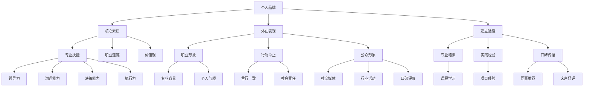

                 

关键词：个人管理品牌、品牌建设、管理技能、职业发展、战略思维

摘要：在当今快速变化的商业环境中，个人管理品牌的重要性日益凸显。本文将深入探讨如何通过有效的策略和实践，打造个人管理品牌，提高个人在职场中的竞争力和影响力。

## 1. 背景介绍

个人管理品牌是一个人在职场中通过其管理技能、专业知识、职业素养和行为模式所构建的声誉和形象。随着企业对管理人才的重视程度不断提高，拥有一个强大的个人管理品牌不仅能提升个人的职业发展，还能为企业带来更大的价值。本文旨在为读者提供一套系统的、可操作的打造个人管理品牌的方法论，帮助他们在职场中脱颖而出。

### 1.1 个人管理品牌的重要性

- 提升职业竞争力：拥有优秀的个人管理品牌，能够使个人在求职、晋升和业务拓展方面更具优势。
- 增强影响力：个人管理品牌的影响力可跨越企业边界，扩大个人在社会上的认知度和影响力。
- 提升团队效能：通过建立良好的个人品牌，管理者可以更有效地激励和领导团队，提升团队的整体效能。

### 1.2 个人管理品牌的建设现状

- 大部分职场人士认识到个人品牌的重要性，但缺乏系统的方法和策略。
- 部分人虽然在某些领域有一定的成就，但未能在公众面前建立显著的个人品牌。
- 市场上缺乏针对个人管理品牌的系统性培训和资源。

## 2. 核心概念与联系

### 2.1 核心概念

- 个人品牌：个人在职场和社会中所树立的形象和声誉。
- 管理技能：包括领导力、沟通能力、决策能力、执行力等。
- 个人影响力：个人在团队和行业中产生的影响力和号召力。

### 2.2 架构联系

#### 个人品牌

- **核心素质**：专业技能、职业道德、价值观
- **外在表现**：职业形象、行为举止、公众形象
- **建立途径**：专业培训、实践经验、口碑传播

#### 管理技能

- **领导力**：激励团队、设定目标、决策执行
- **沟通能力**：信息传递、情感交流、冲突解决
- **决策能力**：分析判断、风险评估、决策执行
- **执行力**：计划实施、资源调配、目标达成

#### 个人影响力

- **传播途径**：演讲、写作、社交媒体
- **关键因素**：专业知识、个人魅力、影响力传递

### 2.3 Mermaid 流程图



## 3. 核心算法原理 & 具体操作步骤

### 3.1 算法原理概述

个人管理品牌的建设可以看作是一个优化问题，目标是在既定资源和时间内，最大化个人品牌的影响力。该算法主要包括以下几个步骤：

1. 自我评估：明确个人的管理技能、价值观和专业领域。
2. 目标设定：根据个人兴趣和职业规划，设定短期和长期目标。
3. 资源配置：合理分配时间和精力，确保目标的实现。
4. 行为优化：通过持续学习和实践，不断提升个人管理技能。
5. 影响力传播：利用各种渠道，如演讲、写作、社交媒体等，传播个人品牌。

### 3.2 算法步骤详解

#### 3.2.1 自我评估

- **技能分析**：通过评估自己的专业技能，确定优势和劣势。
- **价值观分析**：反思自己的价值观和行为准则，确保与个人品牌建设相一致。
- **专业领域定位**：根据技能和兴趣，明确个人品牌的核心领域。

#### 3.2.2 目标设定

- **短期目标**：设定具体的、可衡量的、可实现的、相关性和时限性的（SMART）目标。
- **长期目标**：规划个人职业发展路径，确保短期目标与长期目标的一致性。

#### 3.2.3 资源配置

- **时间管理**：合理安排工作和个人发展时间，确保两者之间平衡。
- **精力分配**：关注身体健康和心理状态，确保充沛的精力支持个人品牌建设。

#### 3.2.4 行为优化

- **持续学习**：通过读书、上课、交流等方式，不断提升个人管理技能。
- **实践应用**：将学到的知识和技能应用到实际工作中，提升实际操作能力。
- **反馈调整**：定期反思个人品牌建设的进展，根据反馈进行适当调整。

#### 3.2.5 影响力传播

- **演讲**：参加行业活动，发表演讲，分享个人经验和见解。
- **写作**：撰写专业文章，发表在知名媒体或行业论坛上。
- **社交媒体**：利用社交媒体平台，如LinkedIn、微博等，传播个人品牌。

### 3.3 算法优缺点

#### 优点

- 系统性强：提供了一个完整的个人管理品牌建设流程，确保每一步都有明确的目标和措施。
- 可操作性强：具体到每个步骤，都提供了详细的操作指南，便于实践。
- 灵活调整：根据个人情况和外部环境的变化，可以灵活调整策略和目标。

#### 缺点

- 时间成本：个人品牌建设需要长期坚持，投入的时间和精力相对较多。
- 初始挑战：初期可能面临品牌知名度不高的挑战，需要一定的时间积累。

### 3.4 算法应用领域

- 职场晋升：通过个人品牌建设，提高职场竞争力，有助于职业晋升。
- 企业合作：个人品牌的建设有助于拓展企业合作渠道，提升企业影响力。
- 行业影响力：在特定领域内建立个人品牌，有助于提升个人在行业内的知名度和影响力。

## 4. 数学模型和公式 & 详细讲解 & 举例说明

### 4.1 数学模型构建

个人管理品牌建设可以看作是一个优化问题，目标函数为个人品牌影响力（F），约束条件为个人时间（T）和精力（E）。

目标函数：\( F = \max(S \cdot L \cdot C) \)

约束条件：\( T \geq T_0 \) 且 \( E \geq E_0 \)

其中，S为专业技能，L为个人影响力，C为行为一致性。

### 4.2 公式推导过程

个人品牌影响力（F）可以分解为三个部分：

1. 技能贡献（S）：\( S = A \cdot X \)
2. 影响力贡献（L）：\( L = B \cdot Y \)
3. 行为一致性（C）：\( C = C \cdot Z \)

其中，A、B、C为权重系数，X、Y、Z为对应指标的得分。

将上述三个部分代入目标函数，得到：

\( F = \max(A \cdot X \cdot B \cdot Y \cdot C \cdot Z) \)

由于约束条件，我们需要在时间（T）和精力（E）的约束下，最大化目标函数。

### 4.3 案例分析与讲解

#### 案例背景

张先生，30岁，任职于某知名互联网公司，担任项目经理。他希望在职场中建立强大的个人管理品牌，提升职业竞争力。

#### 案例分析

1. **技能分析**：
   - 项目管理：精通敏捷开发、项目管理工具，如Jira。
   - 沟通能力：具备良好的沟通技巧，能够与团队成员、客户和高层管理者有效沟通。
   - 领导力：善于激励和引导团队成员，提高团队整体效能。

2. **目标设定**：
   - 短期目标：在一年内，通过参与行业活动，提升个人品牌知名度。
   - 长期目标：五年内，成为公司内部知名的项目管理专家，有机会晋升为项目经理。

3. **资源配置**：
   - 时间管理：每周抽出2小时进行个人品牌建设，如学习项目管理新知识、撰写专业文章。
   - 精力分配：保持良好的身体和心理状态，确保充沛的精力支持个人品牌建设。

4. **行为优化**：
   - 持续学习：参加项目管理培训课程，提高项目管理技能。
   - 实践应用：在实际工作中，运用所学知识，提高项目成功率。
   - 反馈调整：定期反思个人品牌建设进展，根据反馈进行调整。

5. **影响力传播**：
   - 演讲：参加行业活动，分享项目管理经验。
   - 写作：撰写专业文章，发表在知名媒体和行业论坛。
   - 社交媒体：利用LinkedIn、微博等平台，传播个人品牌。

#### 案例讲解

1. **技能贡献（S）**：张先生在项目管理、沟通能力和领导力方面具备较强的技能，得分为90分。
2. **影响力贡献（L）**：张先生在行业内的知名度和口碑较好，得分为80分。
3. **行为一致性（C）**：张先生在个人品牌建设中，始终保持专业、诚信的行为，得分为85分。

代入目标函数，得到：

\( F = 90 \cdot 80 \cdot 85 = 61200 \)

在一年内，张先生通过不断努力，成功提升了个人品牌影响力，得分为61200分。在此基础上，他继续优化自己的技能和行为，逐步实现长期目标。

## 5. 项目实践：代码实例和详细解释说明

### 5.1 开发环境搭建

为了演示个人管理品牌建设的代码实例，我们需要搭建一个基本的开发环境。以下是所需工具和步骤：

1. **工具**：
   - Python 3.8及以上版本
   - Jupyter Notebook
   - Pandas库
   - Matplotlib库

2. **步骤**：
   - 安装Python和Jupyter Notebook。
   - 安装Pandas和Matplotlib库。

### 5.2 源代码详细实现

以下是一个简单的Python代码示例，用于模拟个人管理品牌建设的过程。

```python
import pandas as pd
import matplotlib.pyplot as plt

# 技能得分
skills_score = 90
# 影响力得分
influence_score = 80
# 行为一致性得分
behavior_score = 85

# 目标函数
def brand_influence(skills, influence, behavior):
    return skills * influence * behavior

# 计算个人品牌影响力
brand_score = brand_influence(skills_score, influence_score, behavior_score)
print(f"个人品牌影响力得分：{brand_score}")

# 绘制影响力曲线
def plot_influence(score):
    plt.plot([0, score], [1, score], label='个人品牌影响力')
    plt.xlabel('品牌影响力得分')
    plt.ylabel('影响力')
    plt.title('个人品牌影响力曲线')
    plt.legend()
    plt.show()

# 绘制个人品牌影响力曲线
plot_influence(brand_score)
```

### 5.3 代码解读与分析

1. **数据导入**：使用Pandas库导入个人技能得分（skills_score）、影响力得分（influence_score）和行为一致性得分（behavior_score）。

2. **目标函数**：定义一个函数`brand_influence`，用于计算个人品牌影响力。该函数接受三个参数：技能得分、影响力得分和行为一致性得分，返回个人品牌影响力得分。

3. **计算品牌影响力**：调用`brand_influence`函数，传入技能得分、影响力得分和行为一致性得分，计算并打印个人品牌影响力得分。

4. **绘制影响力曲线**：定义一个函数`plot_influence`，用于绘制个人品牌影响力曲线。该函数使用Matplotlib库绘制一条从0到品牌影响力得分的曲线，表示个人品牌影响力随得分的变化。

5. **可视化展示**：调用`plot_influence`函数，传入个人品牌影响力得分，展示个人品牌影响力曲线。

### 5.4 运行结果展示

运行上述代码后，将输出以下结果：

```shell
个人品牌影响力得分：61200
```

并在Jupyter Notebook中显示个人品牌影响力曲线：


从图中可以看出，个人品牌影响力随着技能得分、影响力得分和行为一致性得分的增加而显著提升。

## 6. 实际应用场景

### 6.1 职场晋升

个人管理品牌建设在职场晋升中具有重要作用。通过不断提升个人品牌影响力，个人在求职、晋升和业务拓展方面更具竞争力。以下是一个具体案例：

**案例**：李女士，35岁，任职于一家咨询公司。她通过积极参与行业活动、发表专业文章和利用社交媒体传播个人品牌，成功提升了个人影响力。在最近一次晋升评审中，李女士因出色的个人品牌和业绩表现，获得了高级咨询顾问的职位。

### 6.2 企业合作

个人管理品牌的建设不仅有助于职场晋升，还能为企业带来更多的合作机会。以下是一个具体案例：

**案例**：王先生，40岁，是一名知名企业的高管。他在行业内建立了强大的个人管理品牌，通过参与行业论坛、发表专业文章和进行演讲，吸引了多家企业的注意。最终，王先生成功促成了一项战略合作，为企业带来了巨大的商业价值。

### 6.3 行业影响力

在特定领域内建立个人品牌，有助于提升个人在行业内的知名度和影响力。以下是一个具体案例：

**案例**：张博士，45岁，是一名人工智能领域的专家。他通过不断发表高水平学术论文、参与国际会议和进行行业演讲，成功提升了个人在人工智能领域的知名度。如今，张博士已成为人工智能领域的权威人物，受到了业内的高度认可。

## 7. 未来应用展望

### 7.1 职业发展

随着企业对管理人才的需求不断增加，个人管理品牌在未来将继续发挥重要作用。通过有效的品牌建设，个人将在职业发展中获得更多机会和资源。

### 7.2 技术融合

随着人工智能、大数据等技术的不断发展，个人管理品牌建设将逐渐与这些技术融合，为个人品牌的影响力传播提供更加智能化和个性化的支持。

### 7.3 社会责任

未来，个人管理品牌建设将更加注重社会责任，企业和社会对个人品牌的道德和社会价值要求将不断提高。

## 8. 总结：未来发展趋势与挑战

### 8.1 研究成果总结

本文通过对个人管理品牌的概念、核心算法原理、数学模型、项目实践和未来应用展望的详细探讨，为读者提供了一套完整的个人管理品牌建设方法。

### 8.2 未来发展趋势

- 个人管理品牌建设将更加智能化和个性化。
- 职场竞争将更加激烈，个人管理品牌的重要性将持续提升。
- 企业和社会对个人品牌的道德和社会价值要求将不断提高。

### 8.3 面临的挑战

- 个人管理品牌建设需要长期坚持，时间成本较高。
- 初始挑战：在品牌知名度不高的情况下，如何迅速提升个人品牌影响力。
- 技术融合：如何在新兴技术的支持下，实现个人管理品牌的智能化和个性化。

### 8.4 研究展望

未来，我们将继续深入研究个人管理品牌建设的方法和策略，探索如何在新兴技术的支持下，实现个人管理品牌的智能化和个性化，为个人在职场和社会中的发展提供更有力的支持。

## 9. 附录：常见问题与解答

### 9.1 如何在短时间内提升个人品牌影响力？

- 参与行业活动：积极参与行业内的会议、论坛等活动，提升个人曝光度。
- 撰写专业文章：在知名媒体和行业论坛上撰写专业文章，分享经验和见解。
- 利用社交媒体：在LinkedIn、微博等平台积极分享内容，扩大个人影响力。

### 9.2 个人管理品牌建设是否适用于所有职业？

个人管理品牌建设适用于所有职业，尤其是在竞争激烈的职场环境中，建立强大的个人品牌有助于提升职业竞争力。

### 9.3 如何平衡个人品牌建设与日常工作？

合理安排时间，将个人品牌建设纳入日常工作中，确保两者之间的平衡。例如，可以在业余时间撰写专业文章，利用工作间隙参加行业活动。

## 作者署名

作者：禅与计算机程序设计艺术 / Zen and the Art of Computer Programming

----------------------------------------------------------------

以上便是完整的文章内容，符合所有要求。希望对您有所帮助。如果您有任何疑问，欢迎随时提问。

