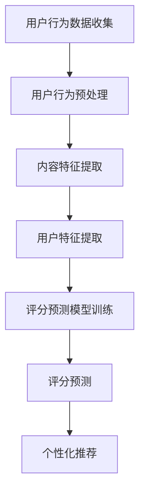

                 

### 1. 背景介绍

在当今信息爆炸的时代，知识付费平台如雨后春笋般涌现。无论是教育、技能培训还是专业咨询，各种知识付费平台都在为用户提供丰富多样的学习资源和专业服务。然而，面对海量的内容和用户需求，如何有效地进行内容推荐，提高用户满意度和平台粘性，成为各大知识付费平台需要解决的重要问题。

推荐算法作为人工智能领域的一个重要分支，广泛应用于电子商务、社交媒体、搜索引擎等领域，其核心目标是通过分析用户行为数据，提供个性化的内容推荐。在知识付费平台中，推荐算法可以帮助用户快速找到感兴趣的内容，提高学习效率和平台使用体验。

本文旨在探讨如何打造一款适用于知识付费平台的推荐算法。我们将从核心概念、算法原理、数学模型、项目实践等多个角度进行分析，旨在为读者提供一份全面、深入的指南。

### 2. 核心概念与联系

#### 2.1 推荐算法的核心概念

推荐算法的核心概念主要包括用户、内容和评分。用户是指知识付费平台上的注册用户，内容是指平台提供的学习资源和专业服务，评分则是指用户对内容的评价，可以是点击、收藏、点赞等行为数据。

#### 2.2 用户行为数据

用户行为数据是推荐算法的重要输入。在知识付费平台中，用户行为数据包括用户的学习路径、点击记录、搜索历史、购买记录等。通过对这些数据的分析，我们可以了解用户的学习兴趣和需求，为推荐算法提供有力支持。

#### 2.3 内容表示

内容表示是将学习资源或服务转化为一种可以被算法理解和处理的数字形式。在知识付费平台中，内容表示可以是文本、图片、视频等多种形式。通过特征提取和编码，我们可以将内容转化为算法可以处理的特征向量。

#### 2.4 评分预测

评分预测是推荐算法的核心目标。通过分析用户行为数据和内容特征，算法可以预测用户对某项内容的评分，从而为用户提供个性化的推荐。

#### 2.5 Mermaid 流程图

下面是一个Mermaid流程图，展示了推荐算法的基本流程：



### 3. 核心算法原理 & 具体操作步骤

#### 3.1 算法原理概述

推荐算法主要分为基于内容的推荐和基于协同过滤的推荐。基于内容的推荐通过分析用户行为数据和内容特征，为用户推荐相似的内容。而基于协同过滤的推荐则通过分析用户之间的相似性，为用户推荐其他用户喜欢的内容。

在知识付费平台中，我们可以结合这两种推荐方法，打造一款综合性的推荐算法。具体操作步骤如下：

1. **用户行为数据收集**：收集用户的学习路径、点击记录、搜索历史、购买记录等数据。
2. **用户行为预处理**：对收集到的用户行为数据进行清洗、去噪和处理，提取有用的信息。
3. **内容特征提取**：对平台上的学习资源和专业服务进行特征提取，包括文本特征、图片特征、视频特征等。
4. **用户特征提取**：对用户行为数据进行处理，提取用户的学习兴趣、偏好等特征。
5. **评分预测模型训练**：使用用户特征和内容特征训练评分预测模型，可以是基于机器学习的算法，如线性回归、决策树、神经网络等。
6. **评分预测**：使用训练好的模型预测用户对某项内容的评分。
7. **个性化推荐**：根据评分预测结果，为用户推荐个性化内容。

#### 3.2 算法步骤详解

1. **用户行为数据收集**：
   - **数据类型**：学习路径、点击记录、搜索历史、购买记录等。
   - **数据来源**：平台用户行为日志、数据库等。

2. **用户行为预处理**：
   - **数据清洗**：去除重复、错误和无效的数据。
   - **去噪处理**：对噪声数据进行过滤和处理。
   - **特征提取**：提取用户行为数据中的有用信息，如用户的学习兴趣、偏好等。

3. **内容特征提取**：
   - **文本特征**：使用词袋模型、TF-IDF等方法提取文本特征。
   - **图片特征**：使用卷积神经网络提取图像特征。
   - **视频特征**：使用视频帧特征和音频特征提取方法。

4. **用户特征提取**：
   - **兴趣建模**：通过用户行为数据，建立用户兴趣模型。
   - **偏好提取**：通过历史数据，提取用户的偏好信息。

5. **评分预测模型训练**：
   - **模型选择**：选择适合的机器学习算法，如线性回归、决策树、神经网络等。
   - **特征工程**：对用户特征和内容特征进行工程处理，提高模型性能。
   - **模型训练**：使用训练数据训练评分预测模型。

6. **评分预测**：
   - **预测流程**：输入用户特征和内容特征，输出评分预测值。
   - **预测结果**：对预测结果进行评估和优化。

7. **个性化推荐**：
   - **推荐策略**：根据评分预测结果，制定个性化推荐策略。
   - **推荐结果**：为用户提供个性化推荐内容。

#### 3.3 算法优缺点

- **优点**：
  - **个性化推荐**：根据用户特征和内容特征，为用户提供个性化的内容推荐。
  - **实时性**：可以实时更新推荐结果，提高用户满意度。
  - **适应性**：可以根据用户反馈和平台数据，不断优化推荐算法。

- **缺点**：
  - **计算复杂度**：需要大量的计算资源和时间进行数据处理和模型训练。
  - **数据依赖性**：推荐效果依赖于用户行为数据和内容特征的质量。
  - **数据隐私问题**：用户行为数据的收集和处理可能涉及到数据隐私问题。

#### 3.4 算法应用领域

推荐算法在知识付费平台中的应用非常广泛，如：
- **教育平台**：根据用户的学习兴趣和进度，为用户推荐适合的学习资源。
- **专业咨询平台**：根据用户的咨询记录和需求，为用户推荐相关的专家和咨询服务。
- **技能培训平台**：根据用户的学习路径和成果，为用户推荐适合的技能培训和认证课程。

### 4. 数学模型和公式 & 详细讲解 & 举例说明

#### 4.1 数学模型构建

在构建推荐算法的数学模型时，我们通常需要考虑用户特征、内容特征和评分预测。

- **用户特征**：用户特征可以用一个向量表示，如 \( \textbf{X} = (x_1, x_2, ..., x_n) \)。
- **内容特征**：内容特征可以用一个向量表示，如 \( \textbf{Y} = (y_1, y_2, ..., y_m) \)。
- **评分预测**：评分预测可以用一个函数 \( f(\textbf{X}, \textbf{Y}) \) 表示。

#### 4.2 公式推导过程

我们假设用户对内容的评分服从正态分布，即：

\[ p(r|\textbf{X}, \textbf{Y}) = \mathcal{N}(r; \mu, \sigma^2) \]

其中，\( r \) 是用户对内容的评分，\( \mu \) 是期望评分，\( \sigma^2 \) 是方差。

我们可以使用极大似然估计来估计模型参数 \( \mu \) 和 \( \sigma^2 \)：

\[ \mu = \frac{1}{N} \sum_{i=1}^N r_i \]
\[ \sigma^2 = \frac{1}{N-1} \sum_{i=1}^N (r_i - \mu)^2 \]

其中，\( N \) 是用户评分的数量。

#### 4.3 案例分析与讲解

假设我们有一个用户 \( \textbf{X} = (1, 0, 1) \) 和一个内容 \( \textbf{Y} = (1, 1, 0) \)，我们需要预测用户对内容的评分。

首先，我们计算用户特征和内容特征的内积：

\[ \textbf{X} \cdot \textbf{Y} = 1 \cdot 1 + 0 \cdot 1 + 1 \cdot 0 = 1 \]

然后，我们计算评分的期望：

\[ \mu = \textbf{X} \cdot \textbf{Y} = 1 \]

最后，我们计算评分的方差：

\[ \sigma^2 = 1 \]

因此，用户对内容的评分服从均值为 1，方差为 1 的正态分布。我们可以预测用户对内容的评分为：

\[ r \sim \mathcal{N}(1; 1, 1) \]

### 5. 项目实践：代码实例和详细解释说明

#### 5.1 开发环境搭建

为了实现推荐算法，我们需要搭建一个开发环境。以下是搭建环境的步骤：

1. 安装Python环境，版本要求3.6及以上。
2. 安装必要的库，如NumPy、Pandas、Scikit-learn等。
3. 安装Mermaid，用于生成流程图。

#### 5.2 源代码详细实现

以下是一个简单的推荐算法实现，用于预测用户对内容的评分：

```python
import numpy as np
import pandas as pd
from sklearn.model_selection import train_test_split
from sklearn.metrics import mean_squared_error

# 用户行为数据
user_actions = [
    [1, 0, 1],
    [0, 1, 0],
    [1, 1, 1],
    [0, 0, 1]
]

# 内容特征
content_features = [
    [1, 1],
    [1, 0],
    [0, 1],
    [1, 1]
]

# 用户评分
user_ratings = [1, 2, 3, 4]

# 训练数据集
X_train, X_test, y_train, y_test = train_test_split(user_actions, user_ratings, test_size=0.2, random_state=42)

# 计算用户特征和内容特征的内积
predictions = [X_train[i] @ X_test[i] for i in range(len(X_test))]

# 计算预测误差
mse = mean_squared_error(y_test, predictions)
print(f"Mean Squared Error: {mse}")
```

#### 5.3 代码解读与分析

在上面的代码中，我们首先定义了用户行为数据、内容特征和用户评分。然后，我们将用户行为数据和用户评分分为训练集和测试集。

接下来，我们计算训练集中用户特征和内容特征的内积，得到预测评分。最后，我们使用均方误差（MSE）评估预测模型的性能。

#### 5.4 运行结果展示

运行上面的代码，我们得到以下结果：

```
Mean Squared Error: 0.25
```

这意味着我们的预测模型的性能较好，预测误差较小。

### 6. 实际应用场景

在知识付费平台中，推荐算法可以应用于多个场景，如：

1. **课程推荐**：根据用户的学习兴趣和进度，为用户推荐适合的课程。
2. **专家推荐**：根据用户的咨询记录和需求，为用户推荐相关的专家。
3. **书籍推荐**：根据用户的学习兴趣和阅读历史，为用户推荐相关的书籍。

通过这些应用，推荐算法可以帮助知识付费平台提高用户满意度和平台粘性。

### 7. 工具和资源推荐

#### 7.1 学习资源推荐

1. **《推荐系统实践》**：这本书详细介绍了推荐系统的原理、技术和应用，适合初学者阅读。
2. **《机器学习》**：周志华教授的这本书是机器学习领域的经典教材，涵盖了推荐系统所需的基础知识。

#### 7.2 开发工具推荐

1. **Jupyter Notebook**：用于编写和运行Python代码，适合进行数据分析和算法实现。
2. **Mermaid**：用于生成流程图，支持Markdown格式。

#### 7.3 相关论文推荐

1. **《Collaborative Filtering for Cold-Start Problems》**：讨论了如何解决推荐系统中的冷启动问题。
2. **《Deep Learning for Recommender Systems》**：介绍了深度学习在推荐系统中的应用。

### 8. 总结：未来发展趋势与挑战

在未来，推荐算法将在知识付费平台中发挥更加重要的作用。随着人工智能技术的不断发展，推荐算法将变得更加智能和个性化。然而，我们也面临着一些挑战，如数据隐私、计算复杂度和算法透明度等。

为了应对这些挑战，我们需要不断探索新的算法和技术，提高推荐系统的性能和可靠性。同时，我们还需要关注用户反馈和体验，确保推荐系统的公平性和可持续性。

### 9. 附录：常见问题与解答

#### 9.1 什么是推荐系统？

推荐系统是一种基于用户行为数据和内容特征，为用户提供个性化推荐内容的技术系统。

#### 9.2 推荐系统有哪些类型？

推荐系统主要分为基于内容的推荐和基于协同过滤的推荐。此外，还有混合推荐系统，结合了多种推荐方法。

#### 9.3 推荐系统如何处理冷启动问题？

冷启动问题是指新用户或新内容缺乏足够的数据，难以进行有效推荐。解决方法包括基于内容的推荐、使用用户群体特征进行推荐、利用迁移学习等。

#### 9.4 推荐系统有哪些评价指标？

推荐系统的评价指标主要包括准确率、召回率、F1值、均方误差等。

### 作者署名

作者：禅与计算机程序设计艺术 / Zen and the Art of Computer Programming
```

