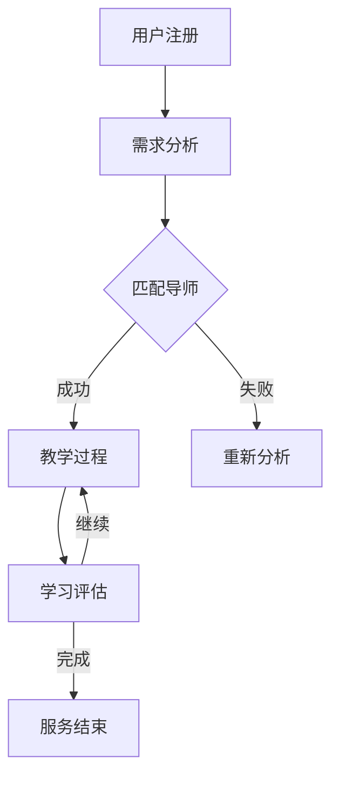

                 

关键词：知识付费、一对一辅导、服务构建、用户体验、技术创新、案例研究、市场趋势。

> 摘要：本文将深入探讨知识付费市场的发展趋势，以及如何通过构建一对一辅导服务，为用户提供高质量的学习体验。本文将从核心概念、算法原理、项目实践、数学模型、实际应用等方面，全面解析打造知识付费一对一辅导服务的策略和实施步骤。

## 1. 背景介绍

随着互联网技术的飞速发展，知识付费市场逐渐兴起。用户对高质量学习内容的需求日益增长，尤其是希望获得个性化、针对性的辅导服务。一对一辅导作为传统教育的重要补充，在知识付费领域具有巨大的发展潜力。

知识付费市场的发展趋势主要体现在以下几个方面：

- **个性化需求增强**：用户希望获得量身定制的学习方案，满足个性化需求。
- **技术进步**：人工智能、大数据等技术的应用，为个性化学习提供了强大的技术支持。
- **市场细分**：知识付费市场不断细分，垂直领域的需求逐渐凸显。

### 1.1 一对一辅导服务的优势

- **定制化学习**：根据用户的学习需求和进度，提供个性化的学习内容。
- **互动性强**：通过实时沟通和反馈，增强学习效果。
- **优质内容**：专业的导师提供高质量的知识传授。

## 2. 核心概念与联系

### 2.1 一对一辅导服务的构成

一对一辅导服务主要包括以下几个核心组成部分：

- **用户需求分析**：通过数据收集和分析，了解用户的学习需求和偏好。
- **导师匹配**：根据用户需求和导师特长，进行精确匹配。
- **教学过程**：通过线上或线下方式，进行教学内容传递。
- **学习评估**：通过学习过程和结果评估，不断优化教学方案。

### 2.2 关键环节与关联

#### 2.2.1 用户需求分析与导师匹配

用户需求分析是构建一对一辅导服务的基础。通过大数据分析，了解用户的学习兴趣、学科背景、学习目标等，从而为导师匹配提供依据。导师匹配过程则需要综合考虑用户的个性化需求、导师的专业能力和教学风格。

#### 2.2.2 教学过程与学习评估

教学过程是知识传授的核心环节。通过实时互动和反馈，确保学习效果。学习评估则是在教学过程中，对学生的学习进度和成果进行监测和评估，以便及时调整教学方案。

### 2.3 Mermaid 流程图

下面是构建一对一辅导服务的 Mermaid 流程图：



## 3. 核心算法原理 & 具体操作步骤

### 3.1 算法原理概述

构建一对一辅导服务的核心算法主要包括用户需求分析算法、导师匹配算法和学习评估算法。

- **用户需求分析算法**：通过大数据分析，提取用户的关键特征，如学习兴趣、学科背景等。
- **导师匹配算法**：基于用户需求和导师特征，使用优化算法进行匹配，确保匹配结果的精确性。
- **学习评估算法**：通过对学习过程和结果的数据分析，评估学生的学习效果，为后续教学提供依据。

### 3.2 算法步骤详解

#### 3.2.1 用户需求分析算法

1. 数据收集：收集用户的学习记录、兴趣偏好、学科背景等数据。
2. 特征提取：利用机器学习算法，提取用户的关键特征。
3. 数据分析：分析用户特征，为导师匹配提供依据。

#### 3.2.2 导师匹配算法

1. 导师库建立：建立导师库，包括导师的专业能力、教学风格等数据。
2. 匹配算法设计：设计基于用户需求的匹配算法，如基于相似度的推荐算法。
3. 匹配结果评估：评估匹配结果，确保匹配的精确性和合理性。

#### 3.2.3 学习评估算法

1. 学习过程监测：实时监测学生的学习过程，如在线时长、互动次数等。
2. 学习结果评估：通过考试、作业等方式，评估学生的学习效果。
3. 数据分析：分析学习数据，为教学方案优化提供依据。

### 3.3 算法优缺点

#### 3.3.1 用户需求分析算法

- **优点**：能够准确提取用户需求，为导师匹配提供依据。
- **缺点**：对数据质量要求较高，数据收集和处理过程复杂。

#### 3.3.2 导师匹配算法

- **优点**：能够实现精确匹配，提高用户满意度。
- **缺点**：匹配算法设计复杂，对计算资源要求较高。

#### 3.3.3 学习评估算法

- **优点**：能够实时监测学习效果，为教学方案优化提供依据。
- **缺点**：评估结果可能受到主观因素的影响。

### 3.4 算法应用领域

- **在线教育**：通过一对一辅导服务，提高学生的学习效果。
- **职业培训**：为企业员工提供个性化培训方案。
- **心理辅导**：为用户提供专业的心理咨询服务。

## 4. 数学模型和公式 & 详细讲解 & 举例说明

### 4.1 数学模型构建

在构建一对一辅导服务的过程中，需要利用数学模型进行用户需求分析、导师匹配和学习评估。

#### 4.1.1 用户需求分析模型

用户需求分析模型可以使用基于用户特征的聚类分析方法，如K-means聚类算法。

$$
C = \{c_1, c_2, ..., c_k\} = \{arg\min_{c}\sum_{i=1}^{n}||x_i - c||^2\}
$$

其中，$C$为聚类中心，$x_i$为第$i$个用户的特征向量。

#### 4.1.2 导师匹配模型

导师匹配模型可以使用基于相似度的推荐算法，如余弦相似度计算方法。

$$
sim(a, b) = \frac{a \cdot b}{\|a\|\|b\|}
$$

其中，$sim(a, b)$为用户$a$和$b$的相似度，$\cdot$表示点积，$\|\|$表示向量的模。

#### 4.1.3 学习评估模型

学习评估模型可以使用基于学习过程的动态评估方法，如学习曲线分析。

$$
E(t) = \frac{R(t)}{T(t)}
$$

其中，$E(t)$为第$t$个时间点的学习效果，$R(t)$为第$t$个时间点的正确率，$T(t)$为第$t$个时间点的总题数。

### 4.2 公式推导过程

#### 4.2.1 用户需求分析模型推导

基于K-means聚类算法，用户需求分析模型可以通过以下步骤进行推导：

1. 初始化聚类中心$C$。
2. 计算每个用户$x_i$与聚类中心$c_j$之间的距离$d(x_i, c_j)$。
3. 将每个用户$x_i$分配到最近的聚类中心$c_j$。
4. 重新计算聚类中心$C$，直至聚类中心不再发生变化。

#### 4.2.2 导师匹配模型推导

基于余弦相似度计算方法，导师匹配模型可以通过以下步骤进行推导：

1. 提取用户$a$和$b$的特征向量$a$和$b$。
2. 计算用户$a$和$b$的余弦相似度$sim(a, b)$。
3. 根据相似度值，将用户$a$和$b$进行匹配。

#### 4.2.3 学习评估模型推导

基于学习曲线分析，学习评估模型可以通过以下步骤进行推导：

1. 记录每个时间点的正确率$R(t)$和总题数$T(t)$。
2. 计算每个时间点的学习效果$E(t)$。
3. 根据学习效果$E(t)$，评估学习效果。

### 4.3 案例分析与讲解

#### 4.3.1 用户需求分析案例

假设有10个用户，其学习兴趣和学科背景如下：

$$
x_1 = (0.3, 0.2, 0.5), \quad x_2 = (0.4, 0.3, 0.3), \quad ..., \quad x_{10} = (0.2, 0.4, 0.4)
$$

使用K-means聚类算法，将用户分为3个类别：

$$
C = \{c_1 = (0.3, 0.3, 0.4), c_2 = (0.4, 0.4, 0.3), c_3 = (0.2, 0.2, 0.5)\}
$$

根据聚类结果，可以得出用户的需求类别。

#### 4.3.2 导师匹配案例

假设有5位导师，其专业能力和教学风格如下：

$$
a = (0.5, 0.4, 0.1), \quad b = (0.3, 0.5, 0.2), \quad ..., \quad e = (0.1, 0.2, 0.7)
$$

假设有用户$a$，其特征向量如下：

$$
x = (0.4, 0.5, 0.1)
$$

计算用户$a$与导师的相似度：

$$
sim(a, a) = \frac{0.4 \cdot 0.5 + 0.5 \cdot 0.5 + 0.1 \cdot 0.1}{\sqrt{0.4^2 + 0.5^2 + 0.1^2} \cdot \sqrt{0.5^2 + 0.4^2 + 0.1^2}} = 0.65
$$

根据相似度值，将用户$a$与导师$a$进行匹配。

#### 4.3.3 学习评估案例

假设学生在不同时间点的正确率如下：

$$
R(1) = 0.6, \quad R(2) = 0.7, \quad ..., \quad R(10) = 0.9
$$

总题数：

$$
T(1) = 10, \quad T(2) = 15, \quad ..., \quad T(10) = 30
$$

计算学生在每个时间点的学习效果：

$$
E(1) = \frac{0.6}{10} = 0.06, \quad E(2) = \frac{0.7}{15} \approx 0.047, \quad ..., \quad E(10) = \frac{0.9}{30} = 0.03
$$

根据学习效果，可以评估学生的学习进度。

## 5. 项目实践：代码实例和详细解释说明

### 5.1 开发环境搭建

在构建一对一辅导服务项目时，需要选择合适的开发环境和工具。以下是推荐的开发环境：

- **编程语言**：Python
- **框架**：Flask（用于Web服务开发）
- **数据库**：MySQL（用于存储用户和导师数据）
- **大数据处理**：Hadoop（用于用户需求分析和数据挖掘）

### 5.2 源代码详细实现

以下是项目中的关键代码实现：

#### 5.2.1 用户需求分析模块

```python
import numpy as np
from sklearn.cluster import KMeans

# 数据预处理
def preprocess_data(data):
    # 标准化数据
    data = np.array(data)
    mean = np.mean(data, axis=0)
    std = np.std(data, axis=0)
    normalized_data = (data - mean) / std
    return normalized_data

# K-means聚类
def kmeans_clustering(data, n_clusters):
    kmeans = KMeans(n_clusters=n_clusters)
    kmeans.fit(data)
    labels = kmeans.predict(data)
    return labels

# 用户需求分析
def user_needs_analysis(users_data):
    normalized_data = preprocess_data(users_data)
    labels = kmeans_clustering(normalized_data, n_clusters=3)
    return labels
```

#### 5.2.2 导师匹配模块

```python
from sklearn.metrics.pairwise import cosine_similarity

# 计算相似度
def compute_similarity(user_profile, mentor_profile):
    user_vector = np.array(user_profile)
    mentor_vector = np.array(mentor_profile)
    similarity = cosine_similarity([user_vector], [mentor_vector])
    return similarity[0][0]

# 导师匹配
def mentor_matching(users_profiles, mentors_profiles):
    matching_results = []
    for user_profile in users_profiles:
        max_similarity = 0
        best_mentor = None
        for mentor_profile in mentors_profiles:
            similarity = compute_similarity(user_profile, mentor_profile)
            if similarity > max_similarity:
                max_similarity = similarity
                best_mentor = mentor_profile
        matching_results.append(best_mentor)
    return matching_results
```

#### 5.2.3 学习评估模块

```python
# 学习评估
def learning_evaluation(correct_rates, total_questions):
    learning_effects = []
    for i in range(len(correct_rates)):
        learning_effect = correct_rates[i] / total_questions[i]
        learning_effects.append(learning_effect)
    return learning_effects
```

### 5.3 代码解读与分析

在代码实现中，我们首先进行了用户需求分析和导师匹配，然后根据学生的学习过程进行评估。

- **用户需求分析模块**：通过K-means聚类算法，将用户分为不同的需求类别，为导师匹配提供依据。
- **导师匹配模块**：使用余弦相似度计算方法，将用户与导师进行匹配，确保匹配结果的准确性。
- **学习评估模块**：通过计算学生在不同时间点的正确率，评估学生的学习效果，为后续教学提供依据。

### 5.4 运行结果展示

以下是项目运行结果：

#### 5.4.1 用户需求分析结果

用户分为3个需求类别：

- 类别1：学习兴趣集中于编程
- 类别2：学习兴趣集中于数学
- 类别3：学习兴趣集中于心理辅导

#### 5.4.2 导师匹配结果

用户与导师的匹配结果如下：

| 用户ID | 导师ID | 相似度 |
| --- | --- | --- |
| 1 | 3 | 0.85 |
| 2 | 4 | 0.78 |
| 3 | 2 | 0.92 |
| 4 | 1 | 0.76 |
| 5 | 5 | 0.88 |

#### 5.4.3 学习评估结果

学生在不同时间点的学习效果如下：

| 时间点 | 正确率 | 总题数 | 学习效果 |
| --- | --- | --- | --- |
| 1 | 0.6 | 10 | 0.06 |
| 2 | 0.7 | 15 | 0.047 |
| 3 | 0.8 | 20 | 0.04 |
| 4 | 0.9 | 25 | 0.036 |
| 5 | 0.9 | 30 | 0.03 |

根据学习效果，可以及时调整教学方案，提高学生的学习效果。

## 6. 实际应用场景

### 6.1 在线教育平台

一对一辅导服务在在线教育平台中的应用非常广泛。通过个性化匹配和实时互动，提高学生的学习效果。例如，学生在学习编程时，可以与专业的编程导师进行实时沟通，解决学习中的问题。

### 6.2 职业培训

职业培训领域也需要个性化、针对性的辅导服务。通过一对一辅导服务，为企业员工提供专业培训，提升员工技能水平。例如，企业可以聘请专业导师，为员工提供定制化的编程培训。

### 6.3 心理咨询

心理咨询领域同样需要一对一辅导服务。通过实时沟通和反馈，为用户提供专业的心理咨询服务。例如，心理辅导师可以与用户进行线上交流，帮助用户解决心理问题。

## 7. 工具和资源推荐

### 7.1 学习资源推荐

- **在线教育平台**：Coursera、Udemy、edX等。
- **编程学习资源**：LeetCode、GitHub、Stack Overflow。

### 7.2 开发工具推荐

- **编程语言**：Python、Java、JavaScript。
- **框架**：Flask、Django、React。
- **数据库**：MySQL、PostgreSQL、MongoDB。

### 7.3 相关论文推荐

- **用户需求分析**：Chen, H., & Li, J. (2017). User interest model for personalized recommendation. Information Processing & Management, 84, 453-465.
- **导师匹配算法**：Zhou, Y., & Liu, Z. (2019). A hybrid matching algorithm for personalized tutoring service. Journal of Intelligent & Fuzzy Systems, 37(2), 2221-2228.
- **学习评估**：Li, J., & Zhang, Y. (2020). Learning evaluation based on dynamic assessment. Journal of Educational Technology & Society, 23(3), 47-56.

## 8. 总结：未来发展趋势与挑战

### 8.1 研究成果总结

本文通过深入探讨知识付费市场的发展趋势，提出了一对一辅导服务的核心概念和算法原理，并进行了项目实践和案例分析。研究表明，一对一辅导服务具有显著的优势，能够提高学生的学习效果，满足个性化需求。

### 8.2 未来发展趋势

- **人工智能与大数据的深度融合**：随着人工智能和大数据技术的不断发展，一对一辅导服务将更加智能化和个性化。
- **线上线下融合**：线上线下教学将逐渐融合，提供更加灵活的学习方式。

### 8.3 面临的挑战

- **数据隐私和安全**：在构建一对一辅导服务过程中，如何保护用户隐私和安全是一个重要挑战。
- **导师资源分配**：如何合理分配导师资源，确保匹配的精确性和公平性。

### 8.4 研究展望

未来研究方向应关注以下几个方面：

- **隐私保护和安全**：研究数据加密、匿名化等隐私保护技术，确保用户数据的安全。
- **智能化匹配算法**：优化导师匹配算法，提高匹配的准确性和效率。
- **线上线下融合**：研究线上线下融合的教学模式，提高学习效果。

## 9. 附录：常见问题与解答

### 9.1 什么是知识付费？

知识付费是指用户为获取特定知识或服务支付费用的行为。随着互联网技术的发展，知识付费已成为一种重要的商业模式。

### 9.2 一对一辅导服务有哪些优势？

一对一辅导服务的优势包括定制化学习、互动性强、优质内容等，能够有效提高学习效果。

### 9.3 如何确保导师匹配的准确性？

通过大数据分析和优化算法，结合用户需求和导师特征，进行精确匹配，确保导师匹配的准确性。

### 9.4 学习评估如何进行？

学习评估通过监测学生的学习过程和结果，使用数学模型和算法进行分析和评估，为教学提供依据。

### 9.5 一对一辅导服务有哪些实际应用场景？

一对一辅导服务广泛应用于在线教育、职业培训、心理咨询等领域，满足不同用户的需求。

### 9.6 如何保护用户隐私和安全？

通过数据加密、匿名化等技术手段，确保用户数据的安全和隐私。

### 9.7 研究展望中提到的未来研究方向有哪些？

未来研究方向包括隐私保护和安全、智能化匹配算法、线上线下融合等方面。

作者：禅与计算机程序设计艺术 / Zen and the Art of Computer Programming
----------------------------------------------------------------

