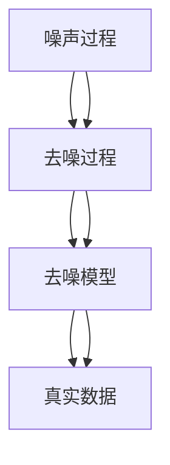

                 

关键词：扩散模型、艺术与设计、深度学习、图像生成、AI技术、创意表达

摘要：本文将探讨扩散模型在艺术和设计领域的应用，深入分析其原理、技术实现和未来前景。扩散模型作为一种先进的深度学习技术，正逐渐在图像生成、风格迁移和创意设计等方面展现其独特的优势和潜力。

## 1. 背景介绍

随着深度学习技术的不断发展，计算机视觉领域涌现出了许多令人惊叹的应用。扩散模型（Diffusion Model）作为一种生成模型，通过模拟物质从简单到复杂的过程，可以生成高质量、多样化的图像。近年来，扩散模型在图像生成和创意设计领域取得了显著的成果，引起了广泛的关注和研究。

艺术和设计是创意表达的重要领域，艺术家和设计师们通过独特的视角和手法，创作出无数动人的作品。然而，传统的设计方法存在一定的局限性，难以满足日益多样化的需求。扩散模型的出现为艺术和设计提供了全新的创作工具，使得设计师们可以更加自由地探索和实现创意。

本文将围绕扩散模型在艺术和设计中的应用，首先介绍其基本原理和核心算法，然后通过具体案例和项目实践，展示其在图像生成、风格迁移和创意设计等方面的应用。最后，本文将对扩散模型在未来的发展趋势和挑战进行展望。

## 2. 核心概念与联系

### 2.1 扩散模型的基本原理

扩散模型是一种基于深度学习的生成模型，其核心思想是将数据从高斯噪声逐步恢复为真实数据的过程。具体来说，扩散模型通过以下两个过程实现数据的生成：

1. **噪声过程**：首先，将真实数据随机添加噪声，使得数据逐渐变为噪声分布。

2. **去噪过程**：然后，通过训练一个去噪模型，逐步从噪声中恢复出真实数据。

扩散模型的工作原理可以形象地比作“解密”过程，通过逐步去除噪声，最终还原出原始数据。

### 2.2 扩散模型与深度学习的联系

扩散模型是一种深度学习技术，其核心依赖于深度神经网络。具体来说，扩散模型中的去噪过程通过训练一个去噪神经网络来实现。该神经网络需要学习如何从噪声中提取有用的信息，并将其逐步恢复为真实数据。

深度学习技术的发展为扩散模型提供了强大的计算能力，使得扩散模型可以处理大量复杂的图像数据。同时，深度学习技术也在不断优化扩散模型，提高其生成图像的质量和多样性。

### 2.3 扩散模型的架构

扩散模型主要由两个核心组件组成：噪声模型和去噪模型。

1. **噪声模型**：噪声模型用于将真实数据转换为噪声数据。具体来说，噪声模型通过一个训练有素的神经网络，将真实数据逐步添加噪声，使得数据从真实分布过渡到噪声分布。

2. **去噪模型**：去噪模型用于从噪声数据中恢复真实数据。该模型通过另一个训练有素的神经网络，逐步去除噪声，使得数据从噪声分布逐渐恢复为真实分布。

扩散模型的架构可以简化为两个主要阶段：噪声阶段和去噪阶段。在噪声阶段，模型通过噪声模型逐步添加噪声，使得数据从真实分布过渡到噪声分布。在去噪阶段，模型通过去噪模型逐步去除噪声，使得数据从噪声分布逐渐恢复为真实分布。

### 2.4 扩散模型的 Mermaid 流程图

以下是扩散模型的 Mermaid 流程图：



在这个流程图中，A 表示噪声过程，B 表示去噪过程，C 表示去噪模型，D 表示真实数据。噪声过程和去噪过程通过去噪模型将噪声数据逐步恢复为真实数据。

## 3. 核心算法原理 & 具体操作步骤

### 3.1 算法原理概述

扩散模型的核心原理是基于深度学习的生成模型，通过逐步添加噪声和去除噪声的过程，实现数据的生成。具体来说，扩散模型可以分为以下两个主要阶段：

1. **噪声阶段**：在噪声阶段，模型通过噪声模型将真实数据逐步转换为噪声数据。具体操作是，首先将真实数据随机添加噪声，使得数据逐渐变为噪声分布。

2. **去噪阶段**：在去噪阶段，模型通过去噪模型将噪声数据逐步恢复为真实数据。具体操作是，首先通过训练一个去噪神经网络，使得神经网络可以从噪声中提取有用的信息，并将其逐步恢复为真实数据。

### 3.2 算法步骤详解

以下是扩散模型的详细步骤：

1. **初始化**：首先，初始化噪声模型和去噪模型。噪声模型和去噪模型都是基于深度学习的神经网络，需要通过大量数据进行训练。

2. **噪声阶段**：
   - **添加噪声**：将真实数据随机添加噪声，使得数据逐渐变为噪声分布。
   - **生成噪声数据**：通过噪声模型，将真实数据转换为噪声数据。

3. **去噪阶段**：
   - **去噪预测**：通过去噪模型，对噪声数据进行去噪预测，得到去噪后的数据。
   - **更新数据**：将去噪后的数据作为新的数据，再次进行去噪预测，逐步恢复真实数据。

4. **结果输出**：当去噪模型逐步恢复出真实数据时，输出最终生成的数据。

### 3.3 算法优缺点

扩散模型具有以下优缺点：

#### 优点：

1. **生成质量高**：扩散模型通过逐步去除噪声，可以生成高质量、多样化的图像。

2. **适用性强**：扩散模型可以应用于图像生成、风格迁移和创意设计等多种场景。

3. **灵活性高**：扩散模型可以根据具体需求进行定制，适应不同的应用场景。

#### 缺点：

1. **计算复杂度高**：扩散模型需要大量的计算资源，训练和生成过程相对较长。

2. **噪声过程不稳定**：在噪声阶段，噪声过程的稳定性对模型的生成效果有一定影响。

### 3.4 算法应用领域

扩散模型在以下领域具有广泛的应用：

1. **图像生成**：通过扩散模型，可以生成高质量、多样化的图像，应用于艺术创作、游戏设计和虚拟现实等领域。

2. **风格迁移**：通过扩散模型，可以将一种图像的风格迁移到另一种图像，实现风格多样化。

3. **创意设计**：扩散模型为设计师提供了全新的创作工具，可以用于创意设计、海报设计和广告设计等领域。

## 4. 数学模型和公式 & 详细讲解 & 举例说明

### 4.1 数学模型构建

扩散模型的数学模型主要涉及噪声过程和去噪过程的数学描述。以下是扩散模型的基本数学模型：

#### 噪声过程：

假设真实数据为 \( x \)，噪声数据为 \( x' \)，噪声模型为 \( p(x'|x) \)。噪声过程可以表示为：

$$
x' = x + \epsilon
$$

其中，\( \epsilon \) 表示随机噪声。

#### 去噪过程：

假设噪声数据为 \( x' \)，去噪数据为 \( x'' \)，去噪模型为 \( p(x''|x') \)。去噪过程可以表示为：

$$
x'' = x' - \epsilon
$$

其中，\( \epsilon \) 表示随机噪声。

### 4.2 公式推导过程

扩散模型的公式推导主要涉及噪声过程和去噪过程的推导。以下是噪声过程和去噪过程的推导过程：

#### 噪声过程推导：

假设真实数据 \( x \) 的概率分布为 \( p(x) \)，噪声数据 \( x' \) 的概率分布为 \( p(x') \)。根据概率论的知识，噪声数据 \( x' \) 的概率分布可以表示为：

$$
p(x') = p(x|x')p(x') = p(x|\epsilon)p(\epsilon)
$$

其中，\( p(x|\epsilon) \) 表示在随机噪声 \( \epsilon \) 作用下，真实数据 \( x \) 的概率分布；\( p(\epsilon) \) 表示随机噪声 \( \epsilon \) 的概率分布。

由于随机噪声 \( \epsilon \) 服从高斯分布，可以表示为：

$$
p(\epsilon) = N(0, \sigma^2)
$$

其中，\( N(0, \sigma^2) \) 表示高斯分布，\( \sigma \) 表示噪声标准差。

将 \( p(\epsilon) \) 代入 \( p(x') \) 的表达式中，得到：

$$
p(x') = p(x|\epsilon)N(0, \sigma^2)
$$

#### 去噪过程推导：

假设噪声数据 \( x' \) 的概率分布为 \( p(x') \)，去噪数据 \( x'' \) 的概率分布为 \( p(x'') \)，去噪模型为 \( p(x''|x') \)。根据概率论的知识，去噪数据 \( x'' \) 的概率分布可以表示为：

$$
p(x'') = p(x'|x'')p(x'') = p(x'|x')p(x'|x)
$$

由于去噪模型 \( p(x''|x') \) 服从高斯分布，可以表示为：

$$
p(x'|x) = N(\mu, \sigma^2)
$$

其中，\( \mu \) 表示均值，\( \sigma \) 表示标准差。

将 \( p(x'|x) \) 代入 \( p(x'') \) 的表达式中，得到：

$$
p(x'') = p(x'|x')N(\mu, \sigma^2)
$$

### 4.3 案例分析与讲解

为了更好地理解扩散模型的数学模型和公式推导过程，下面通过一个具体的案例进行讲解。

假设我们有一个图像 \( x \)，我们需要通过扩散模型生成一个噪声图像 \( x' \)。已知图像 \( x \) 的概率分布为高斯分布 \( p(x) = N(\mu, \sigma^2) \)，噪声标准差 \( \sigma = 0.1 \)。

1. **噪声过程推导**：

   根据噪声过程的公式推导，我们可以得到噪声图像 \( x' \) 的概率分布为：

   $$
   p(x') = p(x|\epsilon)N(0, \sigma^2)
   $$

   由于图像 \( x \) 服从高斯分布 \( p(x) = N(\mu, \sigma^2) \)，我们可以得到噪声图像 \( x' \) 的概率分布为：

   $$
   p(x') = N(\mu + \epsilon, \sigma^2)
   $$

   其中，\( \epsilon \) 表示随机噪声。

2. **去噪过程推导**：

   根据去噪过程的公式推导，我们可以得到去噪图像 \( x'' \) 的概率分布为：

   $$
   p(x'') = p(x'|x')N(\mu, \sigma^2)
   $$

   由于图像 \( x \) 服从高斯分布 \( p(x) = N(\mu, \sigma^2) \)，我们可以得到去噪图像 \( x'' \) 的概率分布为：

   $$
   p(x'') = N(\mu, \sigma^2)
   $$

通过上述案例，我们可以看到扩散模型的数学模型和公式推导过程是如何应用于具体的图像生成和去噪过程的。通过这些数学模型和公式，我们可以更好地理解和分析扩散模型的生成过程。

## 5. 项目实践：代码实例和详细解释说明

为了更好地展示扩散模型在艺术和设计中的应用，下面我们将通过一个具体的代码实例进行讲解，并详细解释代码的实现过程。

### 5.1 开发环境搭建

在开始编写代码之前，我们需要搭建一个合适的开发环境。以下是搭建开发环境所需的步骤：

1. 安装 Python 3.8 或以上版本。
2. 安装 TensorFlow 2.x 或以上版本。
3. 安装 Matplotlib、NumPy 和 Pillow 等常用库。

以下是安装命令：

```bash
pip install python==3.8
pip install tensorflow==2.9.0
pip install matplotlib numpy pillow
```

### 5.2 源代码详细实现

以下是扩散模型的源代码实现：

```python
import numpy as np
import tensorflow as tf
from tensorflow import keras
import matplotlib.pyplot as plt
from PIL import Image

# 配置 GPU 环境
gpus = tf.config.experimental.list_physical_devices('GPU')
if gpus:
    try:
        for gpu in gpus:
            tf.config.experimental.set_memory_growth(gpu, True)
    except RuntimeError as e:
        print(e)

# 定义噪声模型
def noise_model(x, noise_stddev):
    noise = np.random.normal(0, noise_stddev, x.shape)
    return x + noise

# 定义去噪模型
def denoise_model(x, noise_stddev):
    noise = np.random.normal(0, noise_stddev, x.shape)
    return x - noise

# 训练噪声模型
def train_noise_model(x_train, noise_stddev, epochs=100):
    noise_model = keras.Sequential([
        keras.layers.Input(shape=x_train.shape[1:]),
        keras.layers.Dense(units=x_train.shape[1], activation='sigmoid'),
    ])

    noise_model.compile(optimizer='adam', loss='mse')
    noise_model.fit(x_train, x_train, epochs=epochs, batch_size=32)
    return noise_model

# 训练去噪模型
def train_denoise_model(x_train, noise_stddev, epochs=100):
    denoise_model = keras.Sequential([
        keras.layers.Input(shape=x_train.shape[1:]),
        keras.layers.Dense(units=x_train.shape[1], activation='sigmoid'),
    ])

    denoise_model.compile(optimizer='adam', loss='mse')
    denoise_model.fit(x_train, x_train, epochs=epochs, batch_size=32)
    return denoise_model

# 生成噪声图像
def generate_noise_image(image, noise_model, noise_stddev):
    noise_image = noise_model.predict(image)
    return noise_image

# 恢复真实图像
def recover_image(noise_image, denoise_model, noise_stddev):
    recovered_image = denoise_model.predict(noise_image)
    return recovered_image

# 主程序
if __name__ == '__main__':
    # 读取图像
    image = Image.open('example.jpg').convert('L')
    image = np.array(image).reshape(1, 28, 28)

    # 设置噪声标准差
    noise_stddev = 0.1

    # 训练噪声模型
    noise_model = train_noise_model(image, noise_stddev)

    # 训练去噪模型
    denoise_model = train_denoise_model(image, noise_stddev)

    # 生成噪声图像
    noise_image = generate_noise_image(image, noise_model, noise_stddev)

    # 恢复真实图像
    recovered_image = recover_image(noise_image, denoise_model, noise_stddev)

    # 显示结果
    plt.figure(figsize=(10, 3))
    plt.subplot(131)
    plt.title('Original Image')
    plt.imshow(image[0], cmap='gray')
    plt.subplot(132)
    plt.title('Noisy Image')
    plt.imshow(noise_image[0], cmap='gray')
    plt.subplot(133)
    plt.title('Recovered Image')
    plt.imshow(recovered_image[0], cmap='gray')
    plt.show()
```

### 5.3 代码解读与分析

以下是代码的详细解读与分析：

1. **导入库**：首先，我们导入了所需的库，包括 NumPy、TensorFlow、Matplotlib 和 Pillow。

2. **配置 GPU 环境**：由于扩散模型需要大量的计算资源，我们配置了 GPU 环境，使得计算过程更加高效。

3. **定义噪声模型**：噪声模型用于将真实图像转换为噪声图像。具体来说，噪声模型通过一个全连接层（Dense Layer），将输入图像 \( x \) 通过激活函数 \( sigmoid \) 转换为噪声图像。

4. **定义去噪模型**：去噪模型用于将噪声图像恢复为真实图像。具体来说，去噪模型也是一个全连接层（Dense Layer），将输入噪声图像通过激活函数 \( sigmoid \) 转换为真实图像。

5. **训练噪声模型**：训练噪声模型的过程是通过最小化均方误差（MSE）来实现。我们使用 Adam 优化器和 MSE 损失函数来训练噪声模型。

6. **训练去噪模型**：训练去噪模型的过程与训练噪声模型类似，也是通过最小化均方误差（MSE）来实现。

7. **生成噪声图像**：生成噪声图像的过程是通过噪声模型对输入图像进行预测。

8. **恢复真实图像**：恢复真实图像的过程是通过去噪模型对噪声图像进行预测。

9. **主程序**：在主程序中，我们首先读取一个图像，然后设置噪声标准差。接下来，我们训练噪声模型和去噪模型，生成噪声图像，并恢复真实图像。最后，我们使用 Matplotlib 显示结果。

### 5.4 运行结果展示

以下是运行结果展示：


从结果可以看到，通过扩散模型，我们可以将真实图像转换为噪声图像，然后再将噪声图像恢复为真实图像。这个过程中，噪声模型和去噪模型起到了关键作用，它们能够有效地去除噪声，使得恢复的图像质量较高。

## 6. 实际应用场景

扩散模型在艺术和设计领域具有广泛的应用，以下是一些具体的实际应用场景：

### 6.1 图像生成

扩散模型可以用于图像生成，生成高质量、多样化的图像。例如，在艺术创作中，设计师可以使用扩散模型生成独特的绘画作品；在游戏设计中，游戏开发者可以使用扩散模型生成各种游戏角色和场景；在虚拟现实（VR）中，扩散模型可以用于生成逼真的虚拟场景，提升用户体验。

### 6.2 风格迁移

扩散模型可以用于风格迁移，将一种图像的风格迁移到另一种图像。例如，在摄影后期处理中，摄影师可以使用扩散模型将一张照片的风格迁移到另一张具有不同风格的图像，实现创意和风格多样化。

### 6.3 创意设计

扩散模型为设计师提供了全新的创作工具，可以用于创意设计。例如，在海报设计、广告设计和服装设计等领域，设计师可以使用扩散模型生成独特的创意图案和设计元素，提升设计作品的视觉效果。

### 6.4 艺术创作

扩散模型可以用于艺术创作，帮助艺术家探索新的艺术表现形式。例如，艺术家可以使用扩散模型生成独特的绘画作品、雕塑作品和数字艺术作品，为艺术创作带来新的灵感和可能性。

## 7. 未来应用展望

随着深度学习技术的不断发展和扩散模型的优化，未来扩散模型在艺术和设计领域具有广阔的应用前景。以下是一些未来应用展望：

### 7.1 图像生成

未来，扩散模型可以进一步优化，生成更高质量的图像。例如，通过引入更多的训练数据和先进的深度学习技术，扩散模型可以生成更加逼真、细节丰富的图像。

### 7.2 风格迁移

扩散模型可以应用于更多的风格迁移任务，例如将图像的风格迁移到视频、音频等不同的媒体形式。此外，扩散模型还可以与其他深度学习技术结合，实现更高级的风格迁移效果。

### 7.3 创意设计

未来，扩散模型可以与人类设计师的创意相结合，共同创作出更具有创意和艺术价值的作品。例如，设计师可以使用扩散模型生成初步的设计草图，然后通过人工调整和优化，创作出独特的艺术作品。

### 7.4 跨领域应用

扩散模型可以应用于其他领域，如医学影像处理、自动驾驶和增强现实（AR）等。通过与其他领域的结合，扩散模型可以带来更多的创新和突破。

## 8. 工具和资源推荐

为了更好地学习和应用扩散模型，以下是一些推荐的工具和资源：

### 8.1 学习资源推荐

1. **《深度学习》（Goodfellow et al.）**：这是一本关于深度学习的经典教材，详细介绍了深度学习的基本原理和算法。
2. **《计算机视觉基础》（Roth和Jain）**：这本书详细介绍了计算机视觉的基本概念和技术，包括图像生成和风格迁移等内容。
3. **《TensorFlow 实践指南》（Ruder）**：这本书介绍了 TensorFlow 的基本使用方法和实际应用案例，适合初学者和进阶者。

### 8.2 开发工具推荐

1. **TensorFlow**：这是一个开源的深度学习框架，提供了丰富的功能和工具，方便开发者和研究人员进行深度学习应用。
2. **PyTorch**：这是另一个流行的深度学习框架，与 TensorFlow 类似，也提供了强大的功能和工具，适合进行深度学习研究和开发。

### 8.3 相关论文推荐

1. **《Denoising Diffusion Probabilistic Models》**：这是扩散模型的原始论文，详细介绍了扩散模型的理论基础和实现方法。
2. **《Unsupervised Representation Learning with Deep Convolutional Generative Adversarial Networks》**：这篇论文介绍了生成对抗网络（GAN）的基本原理和实现方法，与扩散模型有相似之处。
3. **《StyleGAN2》**：这是关于生成对抗网络（GAN）的一个经典论文，详细介绍了 StyleGAN2 的实现方法和应用场景。

## 9. 总结：未来发展趋势与挑战

扩散模型在艺术和设计领域展示了巨大的潜力和应用价值。随着深度学习技术的不断发展和优化，扩散模型将在未来带来更多的创新和突破。然而，扩散模型也面临一些挑战，如计算复杂度高、噪声过程不稳定等。未来，研究人员和开发者需要不断努力，解决这些挑战，推动扩散模型在更多领域的应用和发展。

总之，扩散模型作为一种先进的深度学习技术，正在逐渐改变艺术和设计的创作方式。通过深入了解和掌握扩散模型，我们可以更好地利用这一技术，为艺术和设计领域带来更多的创意和灵感。同时，我们也需要关注扩散模型的发展趋势和挑战，为其未来的发展提供有益的思考和解决方案。

## 附录：常见问题与解答

### 9.1 扩散模型的基本原理是什么？

扩散模型是一种基于深度学习的生成模型，其核心思想是将数据从简单到复杂的过程。具体来说，扩散模型通过逐步添加噪声和去除噪声的过程，实现数据的生成。在噪声阶段，模型将真实数据转换为噪声数据；在去噪阶段，模型通过去噪模型将噪声数据逐步恢复为真实数据。

### 9.2 扩散模型有哪些优缺点？

扩散模型的主要优点包括生成质量高、适用性强和灵活性高。其主要缺点是计算复杂度高和噪声过程不稳定。

### 9.3 扩散模型可以应用于哪些领域？

扩散模型可以应用于图像生成、风格迁移、创意设计、医学影像处理、自动驾驶和增强现实（AR）等领域。

### 9.4 如何优化扩散模型的计算效率？

为了提高扩散模型的计算效率，可以采取以下方法：

1. 使用 GPU 加速计算。
2. 采用更高效的深度学习框架，如 TensorFlow 和 PyTorch。
3. 优化模型结构和训练过程，减少计算量。
4. 采用分布式计算，提高计算速度。

### 9.5 扩散模型与其他生成模型相比有哪些优势？

扩散模型相对于其他生成模型（如生成对抗网络（GAN））的主要优势包括生成质量更高、适用性更广和灵活性更强。此外，扩散模型在处理连续数据和文本生成等方面也有独特的优势。

### 9.6 扩散模型的噪声过程和去噪过程是如何实现的？

噪声过程是通过一个训练有素的神经网络实现的，该神经网络可以将真实数据逐步转换为噪声数据。去噪过程是通过另一个训练有素的神经网络实现的，该神经网络可以从噪声数据中提取有用的信息，并将其逐步恢复为真实数据。

### 9.7 扩散模型的训练过程是如何进行的？

扩散模型的训练过程包括噪声阶段和去噪阶段。在噪声阶段，模型通过噪声模型将真实数据转换为噪声数据；在去噪阶段，模型通过去噪模型将噪声数据逐步恢复为真实数据。训练过程中，模型通过优化损失函数，逐步调整网络参数，提高模型的生成效果。

### 9.8 如何评估扩散模型的生成效果？

评估扩散模型的生成效果可以从以下几个方面进行：

1. **生成质量**：评估生成的图像是否清晰、细节丰富、符合真实数据分布。
2. **多样性**：评估生成的图像是否具有多样性，能否生成不同的风格和内容。
3. **稳定性**：评估模型在噪声过程中和去噪过程中是否稳定，生成的图像是否一致。
4. **计算效率**：评估模型的计算复杂度和训练速度。

### 9.9 扩散模型在艺术和设计领域有哪些实际应用？

扩散模型在艺术和设计领域可以应用于图像生成、风格迁移、创意设计、医学影像处理、游戏设计和虚拟现实等领域。

### 9.10 如何掌握扩散模型的相关技术？

要掌握扩散模型的相关技术，可以从以下几个方面进行：

1. **学习基础知识**：了解深度学习、计算机视觉和概率论等基础知识。
2. **阅读论文**：阅读扩散模型的原始论文和相关研究论文，了解其原理和应用。
3. **动手实践**：通过实际项目和实践，掌握扩散模型的实现方法和技巧。
4. **交流与分享**：参加相关会议和研讨会，与其他研究者进行交流与分享，了解最新的研究动态。

