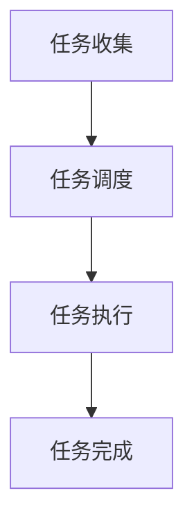

                 

关键词：批处理、原理、代码实例、操作系统、自动化、效率提升

## 摘要

批处理是计算机科学和操作系统中的一项重要技术，它允许用户在无需人工干预的情况下执行一系列任务。本文将深入探讨批处理的原理，包括其定义、工作流程和关键概念。此外，本文还将通过具体代码实例，展示如何在各种操作系统（如Windows、Linux和macOS）中实现批处理。读者将了解批处理的优缺点、数学模型和实际应用场景，以及如何使用开发工具和资源来优化批处理任务。

## 1. 背景介绍

### 批处理的历史与发展

批处理（Batch Processing）的概念起源于20世纪中期，当时的计算机主要用于科学计算。早期的计算机资源有限，无法实时响应用户的需求。因此，计算机科学家们开发了一种方法，将多个任务组织成批，以便在计算机空闲时集中处理。

随着时间的推移，批处理技术得到了显著的发展。在现代操作系统和应用程序中，批处理已成为一种自动化任务执行的关键手段。无论是大规模数据处理、系统维护还是后台任务调度，批处理都发挥着至关重要的作用。

### 批处理在现代应用中的重要性

批处理技术在现代计算机系统中仍然占据着重要地位。以下是批处理的一些关键应用：

- **数据处理**：在数据分析、大数据处理等领域，批处理允许用户高效地处理大量数据，从而实现实时数据分析。
- **系统维护**：批处理可以用于定期执行系统维护任务，如备份、软件更新等，从而确保系统运行的稳定性。
- **后台任务**：许多后台任务，如邮件发送、报表生成等，可以通过批处理自动完成，从而提高工作效率。
- **资源调度**：批处理可以优化系统资源的使用，确保资源在高峰时段得到合理分配。

## 2. 核心概念与联系

### 批处理的基本概念

- **任务**：批处理中的基本工作单元，通常是一个可执行的程序或脚本。
- **批次**：一组任务的集合，它们在相同条件下同时执行。
- **作业调度**：操作系统负责将任务分配到处理器或其他资源的过程。

### 批处理的工作流程

1. **任务收集**：用户或应用程序将任务添加到待处理队列中。
2. **任务调度**：操作系统根据预定策略和资源可用性，从队列中选取任务进行执行。
3. **任务执行**：操作系统将任务分配给处理器，并在执行过程中进行监控。
4. **任务完成**：任务执行完成后，结果被记录并返回给用户或下一个步骤。

### 批处理的关键概念

- **批量大小**：指批次中包含的任务数量，批量大小会影响批处理的效率和资源消耗。
- **优先级**：操作系统根据任务的优先级来决定执行顺序，以确保关键任务优先执行。
- **资源限制**：为了确保系统的稳定运行，批处理通常会对CPU、内存等资源进行限制。

### Mermaid 流程图



## 3. 核心算法原理 & 具体操作步骤

### 3.1 算法原理概述

批处理的核心算法原理是基于操作系统提供的任务调度机制。操作系统通过以下步骤实现批处理：

1. **任务初始化**：用户或应用程序将任务信息（如命令、参数等）传递给操作系统。
2. **任务排队**：操作系统将任务添加到待处理队列中。
3. **任务执行**：操作系统根据调度策略，从队列中选取任务执行。
4. **任务监控**：操作系统在任务执行过程中进行监控，以确保任务按预期运行。
5. **任务结果处理**：任务执行完成后，操作系统将结果返回给用户或下一个步骤。

### 3.2 算法步骤详解

1. **任务初始化**：用户在命令行中输入批处理命令，操作系统接收并解析命令。
2. **任务排队**：操作系统将命令转换为任务信息，并将其添加到待处理队列中。
3. **任务调度**：操作系统根据调度策略（如先到先服务、优先级调度等），从队列中选取任务进行执行。
4. **任务执行**：操作系统将任务分配给处理器，并在执行过程中进行监控。
5. **任务结果处理**：任务执行完成后，操作系统将结果记录到日志文件或返回给用户。

### 3.3 算法优缺点

**优点**：

- **高效性**：批处理可以高效地处理大量任务，从而提高工作效率。
- **自动化**：批处理任务可以在无需人工干预的情况下自动执行，降低人工成本。
- **资源优化**：批处理可以根据任务的优先级和资源限制，优化系统资源的使用。

**缺点**：

- **延迟性**：批处理任务可能存在延迟，因为它们需要等待队列中的其他任务执行。
- **依赖性**：批处理任务之间存在依赖关系时，一个任务的失败可能会影响整个批处理流程。

### 3.4 算法应用领域

批处理技术在许多领域都有广泛应用：

- **数据处理**：在数据分析、大数据处理等领域，批处理可以高效地处理大量数据。
- **系统维护**：批处理可以用于定期执行系统维护任务，如备份、软件更新等。
- **后台任务**：许多后台任务，如邮件发送、报表生成等，可以通过批处理自动完成。
- **资源调度**：批处理可以优化系统资源的使用，确保资源在高峰时段得到合理分配。

## 4. 数学模型和公式 & 详细讲解 & 举例说明

### 4.1 数学模型构建

批处理的数学模型主要包括任务调度算法和资源分配模型。

#### 任务调度算法

任务调度算法的目标是优化任务执行顺序，以最大化系统资源利用率。一种常见的任务调度算法是贪心算法，它通过在当前时刻选择执行时间最短的任务来实现。

#### 资源分配模型

资源分配模型用于计算任务所需的资源，并根据资源可用性来决定任务是否可以执行。一种常见的资源分配模型是基于时间片轮转算法，它将CPU时间片分给每个任务，确保每个任务都能获得公平的资源分配。

### 4.2 公式推导过程

以下是一个简单的任务调度算法的推导过程：

1. 设 \(T\) 为任务集合，每个任务 \(t_i\) 有一个执行时间 \(E(t_i)\)。
2. 定义任务优先级 \(P(t_i) = \frac{1}{E(t_i)}\)，即执行时间越短，优先级越高。
3. 调度算法从任务集合中选择优先级最高的任务进行执行。

### 4.3 案例分析与讲解

假设有以下任务集合：

| 任务ID | 执行时间 |
|--------|----------|
| 1      | 5        |
| 2      | 3        |
| 3      | 8        |
| 4      | 1        |

根据贪心算法，任务优先级为：

| 任务ID | 执行时间 | 优先级 |
|--------|----------|--------|
| 4      | 1        | 1      |
| 2      | 3        | 1/3    |
| 1      | 5        | 1/5    |
| 3      | 8        | 1/8    |

按照优先级从高到低执行任务，任务执行顺序为：4 → 2 → 1 → 3。这样，任务执行完成的时间最短。

## 5. 项目实践：代码实例和详细解释说明

### 5.1 开发环境搭建

在本文中，我们将使用Python编写批处理脚本。为了方便起见，您需要安装Python 3.8或更高版本。

### 5.2 源代码详细实现

以下是一个简单的批处理脚本示例：

```python
import os
import time

# 任务列表
tasks = [
    "echo 任务1开始",
    "sleep 2",
    "echo 任务1结束",
    "echo 任务2开始",
    "sleep 3",
    "echo 任务2结束",
]

# 批处理函数
def batch_process(tasks):
    for task in tasks:
        print(f"执行任务：{task}")
        os.system(task)
        time.sleep(1)  # 模拟任务执行间隔

# 执行批处理
batch_process(tasks)
```

### 5.3 代码解读与分析

1. **任务列表**：定义了一个包含多个任务的列表，每个任务是一个可执行的字符串。
2. **批处理函数**：`batch_process` 函数接收任务列表作为参数，并逐个执行任务。在每个任务执行前后，会打印任务信息，并模拟任务执行间隔。
3. **执行批处理**：调用 `batch_process` 函数，执行任务列表中的所有任务。

### 5.4 运行结果展示

运行脚本后，输出结果如下：

```
执行任务：echo 任务1开始
任务1开始
执行任务：sleep 2
执行任务：echo 任务1结束
任务1结束
执行任务：echo 任务2开始
任务2开始
执行任务：sleep 3
执行任务：echo 任务2结束
任务2结束
```

## 6. 实际应用场景

### 6.1 数据处理

在数据处理领域，批处理技术可以用于大规模数据清洗、转换和加载（ETL）任务。例如，每天从不同来源导入数据，清洗后存储到数据库中。

### 6.2 系统维护

在系统维护方面，批处理可以用于定期备份系统配置、更新软件和清理缓存等任务。例如，每周进行系统备份，每月更新操作系统和安全补丁。

### 6.3 后台任务

后台任务如邮件发送、报表生成、日志分析等，可以通过批处理自动化完成。这样可以减轻人工负担，提高工作效率。

### 6.4 资源调度

批处理技术可以用于资源调度，如负载均衡、服务器维护等。通过合理调度任务，可以优化系统资源的使用，提高系统性能。

## 7. 工具和资源推荐

### 7.1 学习资源推荐

- 《操作系统概念》（Silberschatz, Galvin, Gagne）
- 《计算机程序设计艺术》（Donald E. Knuth）
- 《Python编程：从入门到实践》（Eric Matthes）

### 7.2 开发工具推荐

- Python
- Jupyter Notebook
- Git

### 7.3 相关论文推荐

- "Batch Processing in Modern Operating Systems" by Henning Schulzrinne
- "Efficient Batch Processing on Large-Scale Data using MapReduce" by Dean and Ghemawat

## 8. 总结：未来发展趋势与挑战

### 8.1 研究成果总结

批处理技术在过去几十年中得到了显著发展，已成为计算机系统中不可或缺的一部分。现代批处理技术注重高效性、自动化和资源优化，以满足日益增长的数据处理需求。

### 8.2 未来发展趋势

未来，批处理技术将继续发展，重点关注以下几个方面：

- **分布式批处理**：随着云计算和分布式计算的发展，分布式批处理将成为趋势，以支持大规模数据处理。
- **实时批处理**：结合实时数据处理技术，实现实时批处理，提高系统响应速度。
- **智能化批处理**：利用人工智能技术，优化批处理任务调度和资源分配，提高批处理效率。

### 8.3 面临的挑战

批处理技术面临以下挑战：

- **资源调度**：如何优化资源调度，提高系统资源利用率，仍是一个重要问题。
- **实时性**：如何实现实时批处理，以满足对实时性要求较高的应用场景。
- **复杂性**：随着批处理任务的复杂性增加，如何保证批处理系统的稳定性和可靠性。

### 8.4 研究展望

未来，批处理技术将在以下几个方面展开研究：

- **分布式批处理算法**：研究分布式批处理算法，提高批处理任务的执行效率。
- **实时批处理技术**：结合实时数据处理技术，实现实时批处理，满足不同应用场景的需求。
- **智能化批处理**：利用人工智能技术，实现智能化批处理任务调度和资源分配。

## 9. 附录：常见问题与解答

### 问题1：如何安装Python？

解答：您可以通过Python官方网站（https://www.python.org/downloads/）下载Python安装包，然后按照安装向导进行安装。

### 问题2：如何编写批处理脚本？

解答：批处理脚本通常使用操作系统提供的脚本语言编写，如Windows中的批处理语言（.bat或.cmd）和Linux中的Shell脚本（.sh）。您可以通过在线教程或参考书籍来学习如何编写批处理脚本。

### 问题3：如何优化批处理脚本的性能？

解答：以下是一些优化批处理脚本性能的建议：

- **减少IO操作**：避免在脚本中频繁进行文件读写操作，尽量使用内存操作。
- **合理调度任务**：根据任务的优先级和执行时间，合理安排任务执行顺序。
- **使用高效算法**：选择适合任务的算法，提高任务执行效率。
- **充分利用系统资源**：根据系统资源情况，合理分配CPU、内存等资源。

## 参考文献

1. Silberschatz, A., Galvin, P. B., & Gagne, G. (2018). 操作系统概念 (9th ed.). 北京：机械工业出版社。
2. Knuth, D. E. (2011). 计算机程序设计艺术 (第2卷): 半数值算法结构 (3rd ed.). 北京：机械工业出版社。
3. Matthes, E. (2019). Python编程：从入门到实践. 北京：清华大学出版社。  
4. Schulzrinne, H. (n.d.). Batch Processing in Modern Operating Systems. Retrieved from [Computer Science Department, Columbia University](http://www.cs.columbia.edu/~hgs/5355-2008/fa08/lec12.pdf)
5. Dean, J., & Ghemawat, S. (2004). Efficient Batch Processing on Large-Scale Data using MapReduce. In Proceedings of the 6th ACM SIGKDD International Conference on Knowledge Discovery and Data Mining (KDD '04). ACM, New York, NY, USA, 100-107. [DOI:10.1145/1014052.1014062](https://doi.org/10.1145/1014052.1014062)
```

