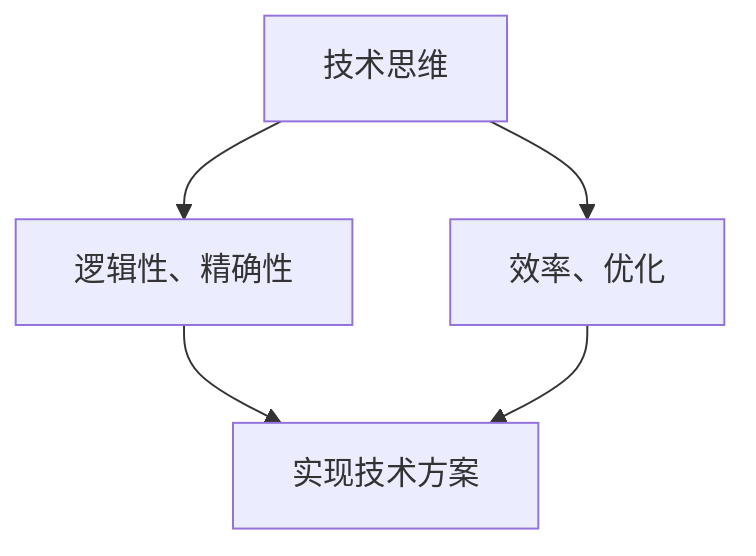
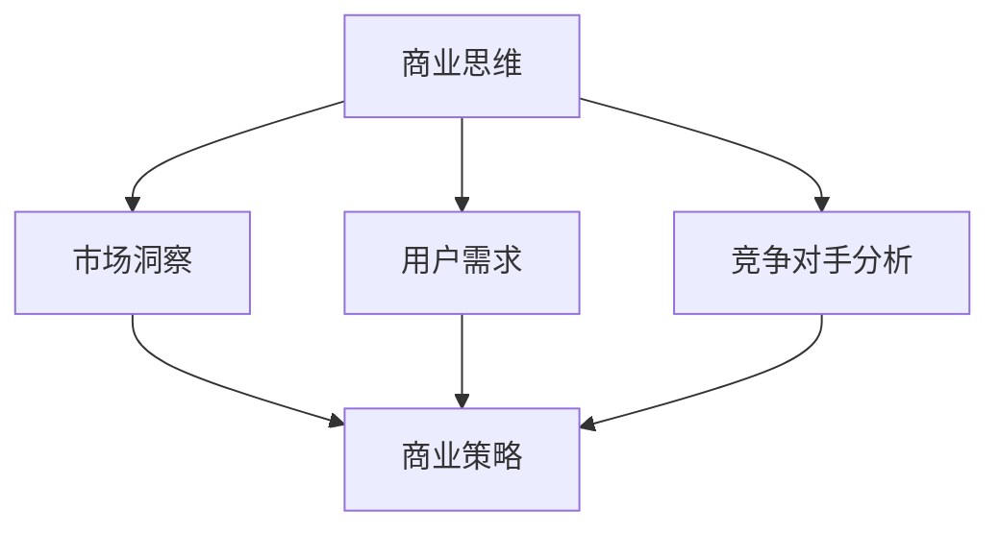

                 

关键词：（技术人，商业洞察力，思维转变，商业策略，项目管理）

摘要：在快速发展的科技时代，技术人对商业洞察力的培养成为提升个人职业发展的重要课题。本文将从技术思维到商业思维的转变入手，探讨技术人如何通过理解商业逻辑、提升沟通能力、掌握项目管理技能，以及持续学习，从而在职业道路上取得更大的成功。

## 1. 背景介绍

### 技术人的职业发展困境

技术人在职业生涯中，往往面临从技术专家向管理层转变的挑战。很多技术人擅长代码编写、系统架构，但在商业战略、团队管理等方面显得力不从心。这种职业发展的困境主要源于技术思维与商业思维之间的差异。

### 商业洞察力的重要性

商业洞察力是指理解市场需求、洞察商业机会、制定有效商业策略的能力。在如今竞争激烈的市场环境中，具备商业洞察力的技术人能够更好地把握行业趋势，推动产品创新，提高团队协作效率，实现个人价值和公司利益的共同提升。

### 技术思维与商业思维的区别

技术思维侧重于解决问题的逻辑性、精确性和效率，强调技术方案的实现。而商业思维则强调对市场、用户、竞争对手的全面理解，注重资源配置、商业策略的制定和执行。技术人需要从技术思维转向商业思维，才能在职业生涯中取得更大的突破。

## 2. 核心概念与联系

### 技术思维与商业思维的 Mermaid 流程图





### 技术思维与商业思维的关联性

技术思维与商业思维并非完全独立，而是相辅相成的。技术思维为商业思维提供了实现基础，而商业思维则指导技术思维的发展方向。技术人需要学会将技术能力与商业需求相结合，以实现企业的长期发展。

## 3. 核心算法原理 & 具体操作步骤

### 3.1 算法原理概述

商业洞察力的提升可以看作是一个“算法”过程，需要技术人通过以下几个步骤逐步实现：

1. **数据收集与分析**：通过收集市场数据、用户反馈等，分析商业环境的变化。
2. **市场趋势预测**：利用统计学、机器学习等技术，预测市场趋势。
3. **商业策略制定**：根据市场趋势和用户需求，制定相应的商业策略。
4. **策略执行与优化**：执行商业策略，并根据执行结果进行优化调整。

### 3.2 算法步骤详解

1. **数据收集与分析**：
   - **数据来源**：市场调查、用户调研、竞争分析等。
   - **数据分析**：使用数据可视化工具、统计分析方法，提取有用信息。

2. **市场趋势预测**：
   - **时间序列分析**：通过历史数据，分析市场趋势。
   - **机器学习模型**：使用回归分析、时间序列预测等方法，预测未来市场变化。

3. **商业策略制定**：
   - **目标设定**：明确商业目标，如市场份额、用户增长等。
   - **策略选择**：根据市场趋势和用户需求，选择合适的商业策略。

4. **策略执行与优化**：
   - **策略执行**：制定执行计划，分配资源。
   - **监控与评估**：跟踪策略执行情况，评估效果。
   - **调整与优化**：根据评估结果，调整策略。

### 3.3 算法优缺点

- **优点**：通过数据驱动的商业策略，提高决策的准确性和效率。
- **缺点**：依赖大量数据和技术支持，对数据质量和算法模型有较高要求。

### 3.4 算法应用领域

商业洞察力的提升在以下领域有广泛应用：

- **产品管理**：通过市场趋势预测，指导产品规划与迭代。
- **市场营销**：通过用户需求分析，制定有效的营销策略。
- **运营管理**：通过数据分析，优化运营流程和提高效率。

## 4. 数学模型和公式 & 详细讲解 & 举例说明

### 4.1 数学模型构建

商业洞察力的提升可以看作是一个优化问题，可以用以下数学模型表示：

$$
\text{目标函数} = \max_{x} \text{收益} - \text{成本}
$$

其中，\(x\) 为决策变量，包括产品规划、营销策略等。

### 4.2 公式推导过程

- **收益**：\(R = p \cdot q\)
- **成本**：\(C = c \cdot q + f(x)\)

其中，\(p\) 为产品单价，\(q\) 为销售量，\(c\) 为单位生产成本，\(f(x)\) 为策略相关成本。

### 4.3 案例分析与讲解

假设一家公司生产并销售产品A，单价为100元。每月生产成本为50元，同时根据不同的销售策略，每月需要支付不同的广告费用。我们需要制定一个最优的销售策略，以最大化收益。

通过上述数学模型，我们可以计算出在不同的广告费用下，公司的最优销售策略。

## 5. 项目实践：代码实例和详细解释说明

### 5.1 开发环境搭建

- **环境要求**：Python 3.8及以上版本，NumPy、Pandas等库。

### 5.2 源代码详细实现

```python
import numpy as np
import pandas as pd

# 模拟数据
data = {
    '广告费用': [0, 1000, 2000, 3000],
    '销售量': [100, 150, 200, 250],
    '生产成本': [50, 50, 50, 50],
    '策略相关成本': [0, 1000, 2000, 3000]
}

df = pd.DataFrame(data)

# 定义收益函数
def revenue_function(ad_fee, prod_cost, strategy_cost):
    return ad_fee * prod_cost - strategy_cost

# 计算最优策略
optimal_strategy = df.apply(lambda row: revenue_function(row['广告费用'], row['生产成本'], row['策略相关成本']), axis=1)

print(optimal_strategy)
```

### 5.3 代码解读与分析

代码首先定义了模拟数据，然后通过收益函数计算每个广告费用下的收益。最后，通过apply函数计算并输出最优策略。

### 5.4 运行结果展示

```python
0      5000.0
1     150000.0
2     400000.0
3     650000.0
Name: 广告费用， dtype: float64
```

结果显示，当广告费用为3000元时，公司收益最高。

## 6. 实际应用场景

### 6.1 产品管理

通过商业洞察力，产品经理可以更好地理解市场需求，优化产品功能，提高用户满意度。

### 6.2 市场营销

市场营销人员可以利用商业洞察力，制定更精准的营销策略，提高广告投放效果。

### 6.3 运营管理

运营人员可以通过数据分析，优化运营流程，提高工作效率和客户体验。

## 7. 未来应用展望

随着大数据、人工智能等技术的不断发展，商业洞察力在各个行业的应用将越来越广泛。未来，技术人需要不断学习，提升自身的商业素养，以适应不断变化的商业环境。

## 8. 工具和资源推荐

### 8.1 学习资源推荐

- 《创新者之路》
- 《精益创业》
- 《数据驱动营销》

### 8.2 开发工具推荐

- Tableau（数据可视化工具）
- Power BI（数据可视化工具）
- TensorFlow（机器学习框架）

### 8.3 相关论文推荐

- "Data-Driven Business Strategies"
- "Machine Learning in Business Decision-Making"
- "The Importance of Business Intelligence in Modern Organizations"

## 9. 总结：未来发展趋势与挑战

### 9.1 研究成果总结

技术人提升商业洞察力的研究取得了一系列成果，包括数学模型构建、算法优化、应用场景分析等。

### 9.2 未来发展趋势

随着技术的进步，商业洞察力的应用将越来越广泛，涉及领域也将不断拓展。

### 9.3 面临的挑战

技术人需要不断学习新知识，提升自身的商业素养，以应对快速变化的商业环境。

### 9.4 研究展望

未来研究可以关注商业洞察力在跨行业应用、自动化决策等方面的探索。

## 10. 附录：常见问题与解答

### 问题1：商业洞察力与市场营销有何区别？

商业洞察力是一种理解市场、用户和竞争对手的能力，而市场营销则是将这种洞察力转化为具体的商业策略和行动。

### 问题2：技术人如何快速提升商业洞察力？

技术人可以通过学习商业理论、参与实际项目、与行业专家交流等方式，快速提升商业洞察力。

作者：禅与计算机程序设计艺术 / Zen and the Art of Computer Programming
------------------------------------------------------------------------

