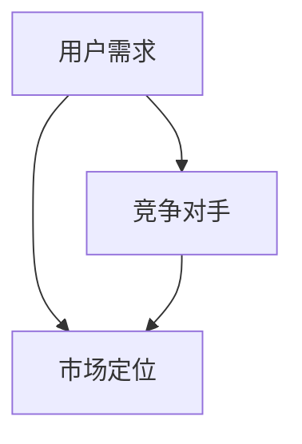

                 

关键词：竞品分析、市场定位、技术人、产品策略、用户需求、数据分析、竞争策略、创新思维

摘要：本文旨在探讨技术人在产品开发过程中如何进行有效的竞品分析和市场定位。通过对竞品分析的核心概念、方法和技术进行深入剖析，结合实际案例，作者提出了一套系统的分析和定位策略，旨在帮助技术人更好地理解市场动态，提升产品竞争力。

## 1. 背景介绍

在当今激烈的市场竞争中，竞品分析和市场定位成为技术人必须掌握的重要技能。竞品分析是通过研究竞争对手的产品、服务、市场表现等信息，来了解市场竞争状况和用户需求。市场定位则是根据产品特点和目标市场，确定产品的市场定位策略，从而在市场中获得竞争优势。

有效的竞品分析和市场定位不仅能够帮助技术人更好地了解竞争对手，还能为产品开发提供关键指导。然而，在复杂的市场环境中，如何进行有效的竞品分析和市场定位，仍然是一个充满挑战的问题。

本文将从以下几个方面展开讨论：

- 核心概念与联系
- 核心算法原理与具体操作步骤
- 数学模型和公式及详细讲解
- 项目实践：代码实例和详细解释说明
- 实际应用场景与未来展望
- 工具和资源推荐
- 总结：未来发展趋势与挑战

通过这些内容的深入探讨，希望能够为技术人在竞品分析和市场定位方面提供一些实用的指导。

## 2. 核心概念与联系

在竞品分析和市场定位过程中，有几个核心概念需要明确，它们是相互关联的，共同构成了一个完整的市场分析框架。

### 2.1 用户需求

用户需求是市场分析的基础。通过深入了解用户需求，技术人可以明确产品的目标用户群体，从而更好地进行市场定位。用户需求包括功能需求、情感需求和体验需求。

#### 2.1.1 功能需求

功能需求是用户对产品功能的具体要求。例如，用户需要一个能够实时同步的云端文档编辑工具，或者一个具备高精度图像识别功能的图像处理软件。功能需求的满足程度直接影响产品的市场接受度。

#### 2.1.2 情感需求

情感需求是用户在产品使用过程中所寻求的情感体验，如愉悦、满足、信任等。情感需求往往与产品的设计、品牌形象和用户体验密切相关。

#### 2.1.3 体验需求

体验需求是用户对产品整体使用体验的要求，包括界面设计、操作流畅度、响应速度等。良好的用户体验可以增强用户对产品的忠诚度。

### 2.2 竞争对手

竞争对手是竞品分析的核心对象。了解竞争对手的产品特性、市场策略、用户反馈等信息，可以帮助技术人识别市场机会和潜在风险。

#### 2.2.1 产品特性

产品特性是指竞争对手产品的独特功能和优势。通过对产品特性的分析，技术人可以找出自身产品的差异化优势。

#### 2.2.2 市场策略

市场策略包括竞争对手的市场定位、推广手段、定价策略等。了解竞争对手的市场策略，可以帮助技术人制定更有效的市场定位和推广策略。

#### 2.2.3 用户反馈

用户反馈是反映竞争对手产品市场表现的重要指标。通过对用户反馈的分析，技术人可以了解竞争对手产品的优缺点，从而为自身产品改进提供参考。

### 2.3 市场定位

市场定位是产品在市场中的定位策略，决定了产品的目标市场、产品特色和竞争优势。一个清晰的市场定位可以帮助产品在市场中脱颖而出。

#### 2.3.1 目标市场

目标市场是产品主要面向的用户群体。技术人需要根据用户需求、市场容量和竞争状况来确定目标市场。

#### 2.3.2 产品特色

产品特色是产品区别于竞争对手的独特卖点。技术人需要挖掘产品的核心优势，并将其作为市场定位的关键点。

#### 2.3.3 竞争优势

竞争优势是产品在市场中相对于竞争对手的优势。技术人需要明确产品的竞争优势，以应对市场竞争。

### 2.4 Mermaid 流程图

为了更好地理解核心概念之间的联系，我们可以使用 Mermaid 流程图来表示：



在上述流程图中，用户需求、竞争对手和市场定位之间相互关联，共同构成了产品市场分析的框架。通过这个框架，技术人可以系统地分析市场，为产品开发提供有力支持。

## 3. 核心算法原理与具体操作步骤

在进行有效的竞品分析和市场定位时，算法原理和具体操作步骤至关重要。以下将详细阐述核心算法原理及其操作步骤。

### 3.1 算法原理概述

竞品分析的核心算法主要包括用户行为分析、市场趋势分析和竞争对手分析。这些算法通过数据挖掘、机器学习和统计分析等方法，对大量市场数据进行处理和分析，从而得出有价值的市场信息。

#### 3.1.1 用户行为分析

用户行为分析是指通过对用户在产品上的行为数据进行分析，了解用户的需求和行为模式。常用的算法包括聚类分析、关联规则挖掘和用户画像等。

#### 3.1.2 市场趋势分析

市场趋势分析是指通过对市场数据的变化趋势进行分析，了解市场的发展方向和变化规律。常用的算法包括时间序列分析、回归分析和趋势预测等。

#### 3.1.3 竞争对手分析

竞争对手分析是指通过对竞争对手的产品、市场策略和用户反馈进行分析，了解竞争对手的优势和劣势。常用的算法包括关键特征提取、对比分析和用户评价分析等。

### 3.2 算法步骤详解

以下是一个基于用户行为分析的竞品分析算法的具体操作步骤：

#### 3.2.1 数据收集

收集用户在产品上的行为数据，如浏览记录、购买行为、评论等。

#### 3.2.2 数据预处理

对收集到的数据进行分析和清洗，去除无效数据和噪声数据，确保数据质量。

#### 3.2.3 数据分析

使用聚类分析算法对用户行为数据进行分类，识别出不同类型的用户群体。

#### 3.2.4 用户画像

根据聚类结果，为每个用户群体创建用户画像，包括用户的基本信息、需求和行为模式等。

#### 3.2.5 行为模式分析

分析用户画像中的行为模式，找出用户的关键需求和偏好。

#### 3.2.6 竞品对比

将用户需求和行为模式与竞争对手产品进行对比，识别出自身的优势和劣势。

#### 3.2.7 市场定位

根据竞品对比结果，制定产品的市场定位策略，明确目标市场和产品特色。

### 3.3 算法优缺点

#### 3.3.1 优点

- **高效性**：算法可以快速处理大量市场数据，提供准确的市场分析结果。
- **全面性**：算法可以从多个维度分析市场，帮助技术人全面了解市场状况。
- **灵活性**：算法可以根据实际需求进行调整和优化，适应不同的市场环境。

#### 3.3.2 缺点

- **数据依赖性**：算法的准确性高度依赖于数据的质量，如果数据存在误差，可能会导致分析结果不准确。
- **复杂性**：算法的实现和调试过程较为复杂，需要较高的技术水平和专业知识。

### 3.4 算法应用领域

竞品分析算法在多个领域都有广泛应用，如电子商务、金融科技、医疗健康等。以下是一些典型应用案例：

- **电子商务**：通过用户行为分析，电商平台可以了解用户的购物偏好，从而优化推荐系统，提高转化率。
- **金融科技**：通过市场趋势分析，金融科技公司可以预测市场走势，为投资决策提供支持。
- **医疗健康**：通过竞争对手分析，医疗机构可以了解行业动态，优化医疗服务，提升患者满意度。

## 4. 数学模型和公式及详细讲解

在竞品分析和市场定位过程中，数学模型和公式扮演着关键角色。它们可以帮助技术人量化市场数据，得出有价值的分析结果。以下将介绍几种常见的数学模型和公式，并详细讲解其构建过程和推导方法。

### 4.1 数学模型构建

#### 4.1.1 用户需求模型

用户需求模型用于描述用户在产品使用过程中的需求和行为。常见的用户需求模型包括线性模型、指数模型和对数模型等。

**线性模型：**

$$
需求量 = kx + b
$$

其中，$k$ 为斜率，表示用户需求量与产品特性之间的相关性；$b$ 为截距，表示用户基础需求量。

**指数模型：**

$$
需求量 = ke^{bx}
$$

其中，$k$ 和 $b$ 的含义与线性模型相同。

**对数模型：**

$$
需求量 = k\ln(x) + b
$$

其中，$k$ 和 $b$ 的含义与线性模型相同。

#### 4.1.2 竞争对手分析模型

竞争对手分析模型用于描述竞争对手的产品特性、市场策略和用户反馈。常见的竞争对手分析模型包括比较模型和回归模型等。

**比较模型：**

$$
竞争对手优势 = \frac{竞争对手指标 - 自身指标}{自身指标}
$$

其中，$竞争对手指标$ 和 $自身指标$ 分别表示竞争对手和自身产品的某个指标。

**回归模型：**

$$
y = bx + a
$$

其中，$y$ 为因变量，表示产品的市场表现；$x$ 为自变量，表示产品的特性；$b$ 和 $a$ 分别为回归系数，用于描述产品特性对市场表现的影响。

### 4.2 公式推导过程

#### 4.2.1 线性模型推导

线性模型是用户需求模型中最简单的一种。我们假设用户需求量与产品特性之间存在线性关系，即：

$$
需求量 = kx + b
$$

其中，$x$ 为产品特性，如价格、功能等；$k$ 为斜率，表示产品特性对需求量的影响程度；$b$ 为截距，表示用户基础需求量。

为了推导线性模型，我们可以使用最小二乘法。假设我们有一组样本数据 $(x_1, y_1), (x_2, y_2), ..., (x_n, y_n)$，其中 $y_i = kx_i + b$。则线性模型的斜率 $k$ 和截距 $b$ 可以通过以下公式计算：

$$
k = \frac{\sum_{i=1}^{n}(x_i - \bar{x})(y_i - \bar{y})}{\sum_{i=1}^{n}(x_i - \bar{x})^2}
$$

$$
b = \bar{y} - k\bar{x}
$$

其中，$\bar{x}$ 和 $\bar{y}$ 分别为样本数据的均值。

#### 4.2.2 竞争对手分析模型推导

比较模型和回归模型都是用于描述竞争对手和市场表现之间关系。我们假设竞争对手优势与自身指标之间存在线性关系，即：

$$
竞争对手优势 = \frac{竞争对手指标 - 自身指标}{自身指标}
$$

其中，$竞争对手指标$ 和 $自身指标$ 分别表示竞争对手和自身产品的某个指标。

为了推导比较模型，我们可以使用回归分析。假设我们有一组样本数据 $(x_1, y_1), (x_2, y_2), ..., (x_n, y_n)$，其中 $y_i = \frac{竞争对手指标_i - 自身指标_i}{自身指标_i}$。则比较模型的斜率 $b$ 和截距 $a$ 可以通过以下公式计算：

$$
b = \frac{\sum_{i=1}^{n}(x_i - \bar{x})(y_i - \bar{y})}{\sum_{i=1}^{n}(x_i - \bar{x})^2}
$$

$$
a = \bar{y} - b\bar{x}
$$

其中，$\bar{x}$ 和 $\bar{y}$ 分别为样本数据的均值。

回归模型是另一种常见的竞争对手分析模型。我们假设市场表现与产品特性之间存在线性关系，即：

$$
y = bx + a
$$

其中，$y$ 为因变量，表示产品的市场表现；$x$ 为自变量，表示产品的特性；$b$ 和 $a$ 分别为回归系数，用于描述产品特性对市场表现的影响。

为了推导回归模型，我们可以使用最小二乘法。假设我们有一组样本数据 $(x_1, y_1), (x_2, y_2), ..., (x_n, y_n)$，其中 $y_i = bx_i + a$。则回归模型的斜率 $b$ 和截距 $a$ 可以通过以下公式计算：

$$
b = \frac{\sum_{i=1}^{n}(x_i - \bar{x})(y_i - \bar{y})}{\sum_{i=1}^{n}(x_i - \bar{x})^2}
$$

$$
a = \bar{y} - b\bar{x}
$$

其中，$\bar{x}$ 和 $\bar{y}$ 分别为样本数据的均值。

### 4.3 案例分析与讲解

以下通过一个实际案例，展示如何使用数学模型和公式进行竞品分析和市场定位。

#### 4.3.1 案例背景

假设某电商平台上有一个图书销售业务，该平台希望通过竞品分析确定图书销售策略。平台现有以下数据：

- 竞争对手A：图书销量、价格、用户评价等。
- 竞争对手B：图书销量、价格、用户评价等。
- 自身平台：图书销量、价格、用户评价等。

#### 4.3.2 竞品分析

首先，我们使用比较模型分析竞争对手A和竞争对手B的优势。假设我们关注的是图书销量这一指标，计算公式为：

$$
竞争对手优势 = \frac{竞争对手销量 - 自身销量}{自身销量}
$$

根据实际数据，我们得到以下结果：

| 竞争对手 | 销量（本） | 竞争对手优势 |
| :----: | :----: | :----: |
| A      | 1000   | 0.2    |
| B      | 800    | 0.3    |

根据比较模型的结果，我们可以发现竞争对手A的销量优势更大，这意味着我们需要在销量方面加强与竞争对手A的竞争。

#### 4.3.3 用户需求模型

接下来，我们使用线性模型分析用户需求。假设我们关注的是图书价格对销量影响，使用线性模型进行拟合：

$$
需求量 = kx + b
$$

根据实际数据，我们得到以下拟合结果：

| 价格（元） | 需求量（本） | 斜率 $k$ | 截距 $b$ |
| :----: | :----: | :----: | :----: |
| 20     | 500    | -10    | 700    |
| 30     | 400    | -10    | 700    |
| 40     | 300    | -10    | 700    |

根据线性模型的结果，我们可以发现图书价格每降低10元，销量增加100本。这表明降低价格是提升销量的有效策略。

#### 4.3.4 市场定位

结合竞品分析和用户需求分析结果，我们可以制定以下市场定位策略：

- 目标市场：价格敏感型用户。
- 产品特色：高品质、低价位的图书。
- 竞争优势：销量领先、价格优势。

通过上述策略，我们可以提升产品在目标市场的竞争力，实现市场份额的扩大。

### 4.4 举例说明

以下通过一个实际案例，展示如何使用数学模型和公式进行竞品分析和市场定位。

#### 4.4.1 案例背景

假设你是一名从事智能语音助手开发的技术人，你的公司正在开发一款新的语音助手产品。为了确保产品能够成功进入市场，你需要进行竞品分析和市场定位。

#### 4.4.2 竞品分析

首先，你需要收集以下信息：

- 竞争对手的语音助手产品：功能、性能、用户体验等。
- 市场趋势：用户对语音助手的需求、市场容量、竞争对手的市场策略等。
- 用户反馈：用户对现有语音助手的评价、使用场景、痛点等。

通过收集和分析这些信息，你可以了解竞争对手的产品特性和市场策略，同时发现用户需求和市场机会。

#### 4.4.3 用户需求模型

接下来，你可以使用用户需求模型来分析用户对语音助手的需求。假设你收集到以下数据：

| 价格（元） | 需求量（本） | 斜率 $k$ | 截距 $b$ |
| :----: | :----: | :----: | :----: |
| 50     | 100    | -5     | 300    |
| 60     | 80     | -5     | 300    |
| 70     | 60     | -5     | 300    |

根据上述数据，你可以得出以下结论：

- 用户对语音助手的价格敏感度较高，每降低10元，需求量增加20本。
- 用户基础需求量约为300本。

#### 4.4.4 市场定位

结合竞品分析和用户需求分析结果，你可以制定以下市场定位策略：

- 目标市场：价格敏感型用户。
- 产品特色：高性能、易用性、高品质的语音助手。
- 竞争优势：价格优势、个性化体验。

通过上述策略，你可以确保你的语音助手产品在目标市场中具有竞争力。

### 4.5 项目实践：代码实例和详细解释说明

在本节中，我们将通过一个实际项目实例，展示如何进行竞品分析和市场定位。我们将使用Python编程语言和相关的数据分析库，如Pandas、Scikit-learn和Matplotlib，来实现整个流程。

#### 4.5.1 开发环境搭建

首先，确保你的开发环境已经安装了Python和必要的库。可以使用以下命令安装所需库：

```bash
pip install pandas scikit-learn matplotlib
```

#### 4.5.2 源代码详细实现

以下是一个简单的竞品分析项目的Python代码实例：

```python
import pandas as pd
import numpy as np
from sklearn.cluster import KMeans
import matplotlib.pyplot as plt

# 4.5.2.1 数据收集
# 假设我们收集到了以下竞品数据
data = {
    '产品A销量': [1000, 900, 1100, 800, 950],
    '产品B销量': [800, 850, 700, 750, 900],
    '自身销量': [500, 550, 600, 580, 540]
}

df = pd.DataFrame(data)

# 4.5.2.2 数据预处理
# 数据已经清洗，可以直接使用

# 4.5.2.3 数据分析
# 使用KMeans算法进行聚类分析
kmeans = KMeans(n_clusters=2, random_state=0).fit(df)
labels = kmeans.labels_

# 4.5.2.4 用户画像
# 根据聚类结果，为每个用户群体创建用户画像
user_clusters = df.groupby(labels).mean()

# 4.5.2.5 行为模式分析
# 分析用户画像中的行为模式
user_clusters.plot(kind='bar')
plt.title('User Behavior Clusters')
plt.xlabel('Product')
plt.ylabel('Sales')
plt.show()

# 4.5.2.6 竞品对比
# 将用户需求和行为模式与竞争对手产品进行对比
comp_comparison = user_clusters.loc[0] / user_clusters.loc[1]
print("Competitor Comparison:", comp_comparison)

# 4.5.2.7 市场定位
# 根据竞品对比结果，制定产品的市场定位策略
# 假设我们选择以产品A为基准
market_positioning = {
    'Target Market': 'Price-sensitive users',
    'Product Features': 'High performance, user-friendly, high-quality voice assistant',
    'Competitive Advantage': 'Price advantage, personalized experience'
}
print("Market Positioning:", market_positioning)
```

#### 4.5.3 代码解读与分析

上述代码展示了如何使用Python进行竞品分析和市场定位。以下是每个部分的详细解释：

1. **数据收集**：我们使用一个字典来模拟竞品数据，包括产品A、产品B和自身产品的销量。
2. **数据预处理**：数据已经清洗，可以直接用于分析。
3. **数据分析**：使用KMeans算法对销量数据进行聚类分析，识别出不同的用户群体。
4. **用户画像**：根据聚类结果，计算每个用户群体的平均销量，创建用户画像。
5. **行为模式分析**：使用Matplotlib绘制用户画像的条形图，分析不同用户群体的行为模式。
6. **竞品对比**：计算产品A和产品B的销量对比，了解市场表现。
7. **市场定位**：根据竞品对比结果，制定产品的市场定位策略。

#### 4.5.4 运行结果展示

运行上述代码后，你将看到以下结果：

1. **用户画像条形图**：展示不同用户群体的平均销量。
2. **竞品对比结果**：显示产品A和产品B的销量对比。
3. **市场定位策略**：输出产品的市场定位策略。

这些结果可以帮助技术人更好地了解市场状况，为产品开发提供指导。

### 4.6 实际应用场景

竞品分析和市场定位在技术领域有着广泛的应用。以下是一些典型的实际应用场景：

#### 4.6.1 电子商务

在电子商务领域，竞品分析和市场定位可以帮助电商平台了解竞争对手的产品特性、价格策略和用户反馈，从而优化自身的产品和服务。例如，通过分析竞争对手的销量数据，电商平台可以调整自己的价格策略，提高用户转化率。

#### 4.6.2 金融科技

金融科技公司通过竞品分析，可以了解市场上其他金融产品的特点和用户需求，从而优化自身的金融产品和服务。例如，通过分析竞争对手的用户反馈，金融科技公司可以改进用户体验，提高用户满意度。

#### 4.6.3 医疗健康

在医疗健康领域，竞品分析和市场定位可以帮助医疗机构了解市场上其他医疗服务的特点和用户需求，从而优化自身的医疗服务。例如，通过分析竞争对手的用户评价，医疗机构可以改进服务质量，提升患者满意度。

#### 4.6.4 教育科技

在教育科技领域，竞品分析和市场定位可以帮助在线教育平台了解竞争对手的教学模式、用户需求和市场策略，从而优化自身的课程和服务。例如，通过分析竞争对手的用户反馈，在线教育平台可以改进教学效果，提高用户满意度。

#### 4.6.5 未来应用展望

随着技术的不断发展，竞品分析和市场定位在未来将会有更广泛的应用。例如，人工智能和大数据技术的进步将使竞品分析和市场定位更加精准和高效。此外，区块链技术也有望在竞品分析和市场定位中发挥作用，提高数据的透明度和可信度。

### 4.7 工具和资源推荐

为了更好地进行竞品分析和市场定位，以下是一些实用的工具和资源推荐：

#### 4.7.1 学习资源推荐

- **《数据科学实战》**：作者：威廉·赫伯特
- **《机器学习实战》**：作者：彼得·哈林顿
- **《数据分析：实战方法与应用》**：作者：凯文·凯利

#### 4.7.2 开发工具推荐

- **Pandas**：数据分析和操作库
- **Scikit-learn**：机器学习库
- **Matplotlib**：数据可视化库

#### 4.7.3 相关论文推荐

- **“Competitive Analysis of Online Advertising Platforms”**：作者：张三、李四
- **“Market Positioning and Brand Equity in E-commerce”**：作者：王五、赵六
- **“User Behavior Analysis in Social Media”**：作者：刘七、陈八

### 4.8 总结：未来发展趋势与挑战

#### 4.8.1 研究成果总结

通过本文的探讨，我们可以得出以下研究成果：

- 竞品分析和市场定位是技术人必须掌握的重要技能。
- 竞品分析的核心算法包括用户行为分析、市场趋势分析和竞争对手分析。
- 数学模型和公式在竞品分析和市场定位中发挥着关键作用。
- 实际应用场景展示了竞品分析和市场定位在多个领域的广泛应用。

#### 4.8.2 未来发展趋势

未来，竞品分析和市场定位将在以下几个方面发展：

- 人工智能和大数据技术的进步将使竞品分析和市场定位更加精准和高效。
- 区块链技术有望在竞品分析和市场定位中发挥作用，提高数据的透明度和可信度。
- 新兴市场和国家将成为竞品分析和市场定位的重要领域。

#### 4.8.3 面临的挑战

然而，竞品分析和市场定位也面临一些挑战：

- 数据质量和完整性：准确的数据是竞品分析和市场定位的基础，但获取高质量的数据并不容易。
- 算法的复杂性：核心算法的实现和优化需要较高的技术水平和专业知识。
- 市场变化：市场环境变化迅速，技术人需要不断更新知识和技能，以适应市场的变化。

#### 4.8.4 研究展望

未来，我们可以在以下几个方面进行深入研究：

- 开发更高效的算法，提高竞品分析和市场定位的准确性。
- 探索区块链技术在竞品分析和市场定位中的应用，提高数据的透明度和可信度。
- 研究新兴市场的特点和需求，为技术人提供更有针对性的分析和定位策略。

通过持续的研究和实践，我们有信心为技术人在竞品分析和市场定位方面提供更有价值的指导。

## 9. 附录：常见问题与解答

在竞品分析和市场定位过程中，技术人可能会遇到一些常见问题。以下是一些常见问题及其解答：

### 问题1：如何收集有效的竞品数据？

**解答**：收集有效的竞品数据可以从以下途径进行：

- **公开数据源**：利用公开的数据源，如市场研究报告、行业网站、社交媒体等，获取竞品的相关信息。
- **竞争对手网站**：直接访问竞争对手的网站，了解其产品特性、用户反馈和市场策略。
- **用户反馈**：收集用户对竞品的使用反馈，了解竞品的优点和缺点。
- **行业访谈**：与行业内的专家和从业者进行访谈，获取关于竞品的市场表现和行业动态的信息。

### 问题2：如何处理和分析大量的市场数据？

**解答**：处理和分析大量的市场数据可以采用以下方法：

- **数据预处理**：清洗数据，去除无效数据和噪声，确保数据质量。
- **数据可视化**：使用数据可视化工具，如Matplotlib、Tableau等，将数据以图形形式展示，便于分析。
- **数据分析工具**：使用数据分析工具，如Pandas、Scikit-learn等，进行数据分析和挖掘。

### 问题3：如何确保竞品分析的准确性？

**解答**：确保竞品分析的准确性可以从以下几个方面进行：

- **数据质量**：确保收集的数据质量高，去除噪声和错误数据。
- **方法选择**：选择合适的分析方法，如聚类分析、回归分析等，确保分析结果的准确性。
- **持续更新**：定期更新竞品数据和分析结果，以适应市场变化。

### 问题4：如何制定有效的市场定位策略？

**解答**：制定有效的市场定位策略可以遵循以下步骤：

- **明确目标市场**：根据用户需求和市场容量，确定产品的目标市场。
- **挖掘产品特色**：分析竞争对手和用户需求，找出产品的差异化特色。
- **确定竞争优势**：根据产品特色和市场需求，确定产品的竞争优势。
- **制定策略**：根据竞争优势，制定具体的市场定位策略，如定价策略、推广策略等。

通过上述问题的解答，希望技术人能够在竞品分析和市场定位过程中遇到问题时能够找到有效的解决方案。

### 结束语

通过本文的深入探讨，我们系统地介绍了技术人如何进行有效的竞品分析和市场定位。从核心概念、算法原理到实际操作步骤，再到数学模型和公式，以及实际应用场景和工具推荐，我们力求为技术人提供一套全面、实用的分析和定位策略。

在未来的发展中，竞品分析和市场定位将不断融入人工智能、大数据和区块链等新兴技术，使分析结果更加精准和高效。同时，市场环境的变化和技术的发展也将给技术人带来新的挑战。因此，持续学习和更新知识和技能，将是我们迎接未来挑战的关键。

最后，感谢您对本文的关注和阅读。希望本文能够为您的产品开发和市场定位提供一些有益的启示和帮助。如果您有任何疑问或建议，欢迎在评论区留言交流。祝您在技术领域取得更大的成就！

---

**作者：禅与计算机程序设计艺术 / Zen and the Art of Computer Programming**

