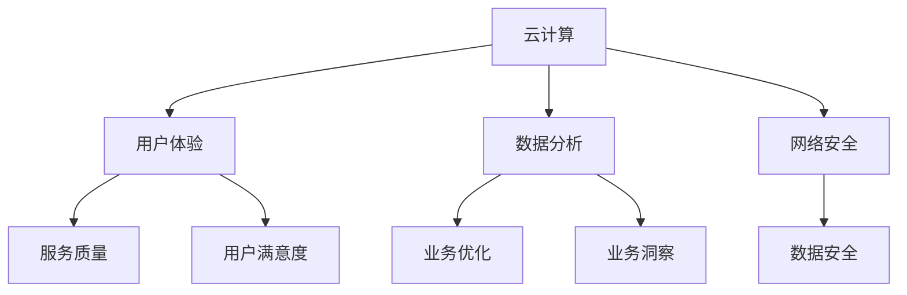

                 

关键词：数字化转型，线上服务，云计算，用户体验，技术架构，数据分析，网络安全

> 摘要：随着信息技术的飞速发展，越来越多的企业和组织开始将业务从线下转移到线上。本文将探讨从线下到线上的转变过程中的核心技术和策略，包括云计算、用户体验、数据分析、网络安全等方面，并提供实用的工具和资源推荐，帮助企业和开发者更好地实现线上转型。

## 1. 背景介绍

在过去的几十年里，线下业务一直是许多企业和组织的主要模式。然而，随着互联网的普及和移动设备的广泛使用，线上业务逐渐成为新的增长点。数字化转型已经成为企业和组织实现持续增长和竞争力的关键。

从线下到线上的转变不仅仅是一种业务模式的变化，更涉及到技术、策略、组织和文化等多个方面。在这个过程中，企业需要面对许多挑战，例如如何构建可靠的线上基础设施、如何提升用户体验、如何确保数据安全和隐私等。

本文将围绕这些核心问题，探讨从线下到线上的转变过程中的关键技术和策略。

## 2. 核心概念与联系

在讨论从线下到线上的转变之前，我们需要了解一些核心概念，这些概念是构建线上服务的基础。

### 2.1 云计算

云计算是线上业务的核心基础设施。它允许企业按需访问计算资源，如服务器、存储和网络，而不需要拥有和管理这些资源。云计算提供了弹性、可扩展性和灵活性，使企业能够快速响应市场需求。

### 2.2 用户体验

用户体验（UX）是线上服务的关键因素。良好的用户体验可以提高用户满意度，增加用户黏性，从而推动业务增长。用户体验包括界面设计、交互设计、内容呈现等多个方面。

### 2.3 数据分析

数据分析是线上业务的重要工具。通过对用户行为数据的分析，企业可以深入了解用户需求，优化服务，提高业务效率。

### 2.4 网络安全

网络安全是线上业务的基本保障。随着线上业务的增加，网络安全威胁也日益增加。企业需要采取有效的措施来保护用户数据和企业资产。

下面是这些核心概念之间的联系：



## 3. 核心算法原理 & 具体操作步骤

### 3.1 算法原理概述

从线下到线上的转变涉及多个核心算法和工具。以下是一些常用的算法和工具：

- **负载均衡**：通过将流量分配到多个服务器，提高系统的可用性和性能。
- **缓存机制**：通过存储常用数据，减少数据库查询次数，提高响应速度。
- **加密算法**：用于保护数据传输和存储的安全性。
- **机器学习**：用于用户行为分析、个性化推荐等。

### 3.2 算法步骤详解

#### 负载均衡

1. 识别流量来源和负载情况。
2. 选择合适的负载均衡算法（如轮询、最小连接数等）。
3. 将流量分配到不同的服务器。

#### 缓存机制

1. 识别需要缓存的资源。
2. 选择合适的缓存策略（如LRU、LFU等）。
3. 设置缓存的有效期和更新机制。

#### 加密算法

1. 选择合适的加密算法（如AES、RSA等）。
2. 对数据进行加密和解密。
3. 确保密钥的安全存储和传输。

#### 机器学习

1. 收集和预处理数据。
2. 选择合适的算法（如决策树、神经网络等）。
3. 训练模型并进行评估。
4. 应用模型进行预测和分析。

### 3.3 算法优缺点

- **负载均衡**：优点是可以提高系统性能和可用性，缺点是需要额外的硬件成本和维护。
- **缓存机制**：优点是可以提高响应速度，缺点是需要定期更新和维护缓存。
- **加密算法**：优点是可以保护数据安全，缺点是加密和解密过程会增加计算开销。
- **机器学习**：优点是可以实现自动化和智能化，缺点是需要大量的数据和处理能力。

### 3.4 算法应用领域

- **负载均衡**：广泛应用于大型互联网服务，如电商平台、视频流媒体等。
- **缓存机制**：广泛应用于Web应用、移动应用等。
- **加密算法**：广泛应用于网络安全领域，如VPN、HTTPS等。
- **机器学习**：广泛应用于推荐系统、自然语言处理、图像识别等领域。

## 4. 数学模型和公式 & 详细讲解 & 举例说明

### 4.1 数学模型构建

从线下到线上的转变涉及到多个数学模型，以下是一些常用的数学模型：

- **排队模型**：用于模拟用户访问服务的过程，如M/M/1队列。
- **决策树**：用于分类和回归问题，如ID3算法。
- **神经网络**：用于图像识别、自然语言处理等，如卷积神经网络（CNN）。

### 4.2 公式推导过程

以M/M/1队列模型为例，其服务率为μ，到达率为λ，队列长度为L，平均等待时间为W。

- 服务率：μ = 1/σ，其中σ为服务时间。
- 到达率：λ = 1/τ，其中τ为到达时间。
- 队列长度：L = λ/μ。
- 平均等待时间：W = L/λ。

### 4.3 案例分析与讲解

假设一个电商平台的用户访问量为每天1000次，每次访问需要处理的服务时间为1秒。我们需要计算平台的队列长度和平均等待时间。

- 服务率：μ = 1/1 = 1次/秒。
- 到达率：λ = 1000/3600 ≈ 0.278次/秒。
- 队列长度：L = λ/μ ≈ 0.278/1 ≈ 0.278次。
- 平均等待时间：W = L/λ ≈ 0.278/0.278 ≈ 1秒。

通过这个案例，我们可以看到平台在高峰时段可能会出现短暂的等待现象。为了解决这个问题，可以考虑增加服务器容量或优化服务流程。

## 5. 项目实践：代码实例和详细解释说明

### 5.1 开发环境搭建

为了实现从线下到线上的转变，我们需要搭建一个开发环境。以下是搭建环境的步骤：

1. 安装操作系统：选择一个稳定、安全、易用的操作系统，如Ubuntu。
2. 安装编程语言：选择一种适合项目的编程语言，如Python。
3. 安装开发工具：安装代码编辑器、集成开发环境（IDE）和版本控制系统，如Visual Studio Code、PyCharm和Git。
4. 安装依赖库：根据项目需求安装必要的依赖库，如Flask、Django等。

### 5.2 源代码详细实现

以下是一个简单的Web应用示例，实现用户登录功能。

```python
from flask import Flask, request, redirect, url_for, session

app = Flask(__name__)
app.secret_key = 'your_secret_key'

@app.route('/')
def index():
    if 'username' in session:
        return 'Welcome, {}!'.format(session['username'])
    return redirect(url_for('login'))

@app.route('/login', methods=['GET', 'POST'])
def login():
    if request.method == 'POST':
        username = request.form['username']
        password = request.form['password']
        # 验证用户名和密码
        if username == 'admin' and password == 'password':
            session['username'] = username
            return redirect(url_for('index'))
        else:
            return 'Invalid username or password'
    return '''
    <form method="post">
        <p><input type="text" name="username" placeholder="Username"></p>
        <p><input type="password" name="password" placeholder="Password"></p>
        <p><button type="submit">Login</button></p>
    </form>
    '''

if __name__ == '__main__':
    app.run(debug=True)
```

### 5.3 代码解读与分析

这个示例使用Flask框架实现了一个简单的用户登录功能。主要步骤如下：

1. 导入必要的模块和类。
2. 创建Flask应用程序实例。
3. 配置应用程序的密钥。
4. 定义两个路由：首页和登录页。
5. 在登录页处理表单提交，验证用户名和密码。
6. 在首页显示欢迎消息。

通过这个示例，我们可以看到如何使用Python和Flask框架实现一个简单的线上服务。这个服务可以扩展为更复杂的业务应用，如电商平台、社交网络等。

### 5.4 运行结果展示

运行这个示例，我们可以通过浏览器访问Web应用。输入正确的用户名和密码后，我们将看到欢迎消息。


## 6. 实际应用场景

从线下到线上的转变已经在各个领域得到广泛应用，以下是一些实际应用场景：

- **电商**：电商平台已经彻底改变了购物方式，用户可以随时随地在线购买商品。
- **金融**：在线支付、在线银行等服务已经成为人们日常生活的一部分。
- **医疗**：在线医疗咨询、远程诊断等服务为患者提供了便捷的医疗服务。
- **教育**：在线教育平台和在线课程为学习者提供了丰富的学习资源。
- **企业服务**：企业可以通过线上服务实现业务流程自动化，提高工作效率。

### 6.4 未来应用展望

随着技术的不断进步，从线下到线上的转变将继续深化和拓展。以下是一些未来应用展望：

- **物联网**：物联网技术将使更多的设备和物品连接到互联网，实现智能化的线上服务。
- **区块链**：区块链技术将为线上业务提供更安全、透明的数据存储和传输方式。
- **人工智能**：人工智能技术将使线上服务更加智能化和个性化。

## 7. 工具和资源推荐

为了更好地实现从线下到线上的转变，以下是几个工具和资源的推荐：

### 7.1 学习资源推荐

- **《深入理解计算机系统》**：这是一本关于计算机系统原理的经典教材，适合初学者和专业人士。
- **《Python编程：从入门到实践》**：适合初学者学习和掌握Python编程语言。
- **《机器学习实战》**：一本实用的机器学习入门书籍，通过实际案例讲解机器学习算法。

### 7.2 开发工具推荐

- **Visual Studio Code**：一款功能强大的代码编辑器，适合多种编程语言。
- **PyCharm**：一款专业的Python开发工具，具有丰富的插件和功能。
- **Git**：一款强大的版本控制系统，可以帮助团队协作和代码管理。

### 7.3 相关论文推荐

- **"The Design and Implementation of the FreeBSD Operating System"**：这是一篇关于操作系统设计和实现的经典论文。
- **"Deep Learning"**：这是一篇关于深度学习算法的综述论文，涵盖了深度学习的主要理论和应用。
- **"Blockchain: A System for Secure, Decentralized Transactions"**：这是一篇关于区块链技术的开创性论文，详细介绍了区块链的工作原理和应用场景。

## 8. 总结：未来发展趋势与挑战

从线下到线上的转变已经成为不可逆转的趋势。随着技术的不断进步，未来线上服务将更加智能化、个性化、安全化。然而，在这个过程中，企业也将面临许多挑战，如数据隐私保护、网络安全威胁、技术更新迭代等。

为了应对这些挑战，企业需要不断创新、持续学习和优化。同时，政府和监管机构也需要加强对线上服务的监管，确保用户的权益和安全。

总之，从线下到线上的转变是一个充满机遇和挑战的过程。只有紧跟时代潮流、不断创新，才能在激烈的市场竞争中脱颖而出。

## 9. 附录：常见问题与解答

### Q：如何确保线上服务的数据安全？

A：确保线上服务的数据安全是至关重要的一环。以下是一些常见的方法：

1. **数据加密**：对敏感数据进行加密，确保数据在传输和存储过程中不被窃取。
2. **访问控制**：限制对数据的访问权限，确保只有授权人员才能访问敏感数据。
3. **网络安全**：采用防火墙、入侵检测系统等网络安全措施，保护服务器和网络不受攻击。
4. **数据备份**：定期备份数据，以防止数据丢失或损坏。

### Q：如何优化用户体验？

A：优化用户体验是提高用户满意度、增加用户黏性的关键。以下是一些优化用户体验的方法：

1. **简洁的界面设计**：界面应简洁明了，避免过多的装饰和功能，使用户能够快速找到所需功能。
2. **响应速度**：提高页面加载速度，减少用户的等待时间。
3. **个性化推荐**：根据用户的行为和偏好，提供个性化的内容和推荐，增加用户的参与度。
4. **用户反馈**：定期收集用户反馈，了解用户的需求和问题，及时进行改进。

### Q：如何进行线上业务数据分析？

A：线上业务数据分析是了解用户需求、优化业务流程的重要手段。以下是一些常见的方法：

1. **数据收集**：通过网站日志、用户行为跟踪等方式收集数据。
2. **数据清洗**：清洗和整理数据，去除重复和错误的数据。
3. **数据分析**：使用统计分析和机器学习算法对数据进行处理和分析。
4. **数据可视化**：通过图表和报表等方式，将分析结果呈现给相关人员。

### Q：如何实现线上到线下的转变？

A：实现线上到线下的转变，即线下业务的数字化转型，需要以下步骤：

1. **确定目标**：明确数字化转型目标和预期效果。
2. **规划方案**：制定详细的数字化转型方案，包括技术选型、人员培训、流程优化等。
3. **试点项目**：选择一个或几个业务领域进行试点，积累经验和教训。
4. **全面推广**：在试点项目成功的基础上，逐步推广到其他业务领域。

### Q：如何确保线上服务的可靠性？

A：确保线上服务的可靠性是保障业务连续性和用户体验的关键。以下是一些常见的方法：

1. **容错机制**：设计容错机制，如冗余服务器、负载均衡等，确保系统在故障时仍能正常运行。
2. **监控和报警**：建立监控系统，实时监控系统性能和健康状态，及时发现和处理问题。
3. **定期备份**：定期备份数据，防止数据丢失或损坏。
4. **灾难恢复**：制定灾难恢复计划，确保在灾难发生时能够迅速恢复业务。

### Q：如何实现线上服务的国际化？

A：实现线上服务的国际化需要以下步骤：

1. **多语言支持**：开发多语言版本，支持不同国家和地区的用户。
2. **本地化**：根据不同国家和地区的文化习惯，进行界面和内容的本地化。
3. **国际支付**：提供多种国际支付方式，满足不同国家和地区的支付需求。
4. **物流和配送**：与本地物流和配送公司合作，确保商品能够快速、安全地送达用户。

### Q：如何处理线上服务中的用户投诉？

A：处理线上服务中的用户投诉需要以下步骤：

1. **快速响应**：及时回应用户的投诉，表达关注和歉意。
2. **了解问题**：详细了解用户投诉的原因和具体情况。
3. **解决问题**：根据问题的性质，采取相应的解决措施，如退款、换货等。
4. **反馈和改进**：向用户反馈解决问题的过程和结果，根据用户反馈进行改进。

通过以上方法，企业可以更好地处理用户投诉，提高用户满意度，增强品牌形象。

作者：禅与计算机程序设计艺术 / Zen and the Art of Computer Programming

----------------------------------------------------------------
### 附加内容 Additional Content ###

在撰写完核心内容后，我们还可以考虑添加一些附加内容，以丰富文章的深度和广度。以下是一些可能的附加内容：

### 10. 线上到线下转变案例分析

- **案例一**：亚马逊的线上书店到线下书店的转变
- **案例二**：星巴克的线上订单与线下体验结合
- **案例三**：阿里巴巴的线上电商平台到线下新零售的拓展

### 11. 线上到线下转变的心理学分析

- **用户行为心理学**：分析用户从线下到线上服务的心理变化
- **消费者行为**：探讨消费者在线上和线下购物行为的不同

### 12. 线上到线下转变的法律与伦理问题

- **数据隐私保护**：分析各国数据隐私保护法规及其对线上业务的影响
- **伦理问题**：探讨线上服务中可能出现的伦理问题，如人工智能的偏见和歧视

### 13. 线上到线下转变的技术趋势展望

- **5G技术**：展望5G技术对线上服务的潜在影响
- **人工智能与机器学习**：讨论人工智能和机器学习在提高线上服务质量和效率方面的应用

### 14. 线上到线下转变的可持续性分析

- **环境影响**：分析线上服务对环境的影响及可持续性解决方案
- **社会影响**：探讨线上服务对就业、经济和社会结构的影响

### 15. 线上到线下转变的国际比较

- **案例分析**：比较不同国家在数字化转型的进展和成果
- **政策差异**：分析各国在数字化转型政策上的差异及其影响

通过这些附加内容，文章将更加全面地呈现从线下到线上转变的多维度视角，为读者提供更深入的洞察和更丰富的信息。同时，这些内容也可以帮助读者更好地理解和应对数字化转型过程中的各种挑战和机遇。

