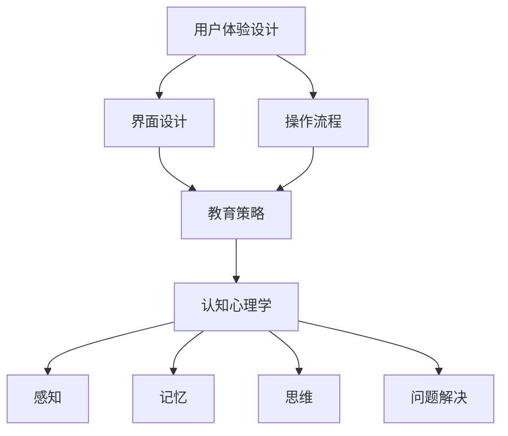

                 

关键词：技术创业、用户教育、新技术采用、教育策略、用户体验设计

> 摘要：本文深入探讨了技术创业中用户教育的关键作用，分析了一系列降低新技术采用门槛的方法。通过阐述用户教育的基本原理、应用场景及具体策略，本文旨在为创业团队提供实用的指导，帮助他们在激烈的市场竞争中成功引导用户接受并采用新技术。

## 1. 背景介绍

在快速发展的技术时代，创业公司不断涌现，它们致力于将新技术推向市场，以满足日益增长的用户需求。然而，新技术往往伴随着较高的学习成本和认知难度，这成为了用户采纳的关键障碍。因此，如何有效地进行用户教育，降低新技术采用门槛，成为了技术创业成功的关键因素。

用户教育不仅是提高用户技术能力的过程，更是通过引导和激励用户，使其主动探索和使用新技术的策略。有效的用户教育可以帮助创业公司提升市场竞争力，缩短用户接受新技术的周期，从而实现商业成功。

本文将从以下五个方面探讨技术创业中的用户教育：

1. 核心概念与联系
2. 核心算法原理与具体操作步骤
3. 数学模型与公式
4. 项目实践：代码实例与详细解释
5. 实际应用场景与未来展望

通过这些探讨，本文希望能够为技术创业团队提供一套完整的用户教育策略，帮助他们在市场中脱颖而出。

### 1.1 技术创业的定义与现状

技术创业是指以技术创新为核心，通过商业模式的创新实现商业价值的创业活动。近年来，随着互联网、人工智能、大数据等新技术的快速发展，技术创业成为了推动经济增长和社会进步的重要力量。根据全球创业观察（GEM）的报告，全球范围内的技术创业活动持续增加，尤其是在亚洲和北美地区，技术创业公司如雨后春笋般涌现。

技术创业的现状体现在多个方面。首先，创业公司数量逐年增长。根据统计，全球每年新增的技术创业公司数量达到了数十万家，其中不乏成功的案例，如谷歌、亚马逊、微软等。其次，资金投入不断增加。风险投资和私募股权基金对技术创业公司的投资额逐年攀升，这为技术创业提供了充足的资金支持。最后，技术创业的领域不断扩大，从互联网和移动应用扩展到人工智能、区块链、物联网等多个领域。

然而，尽管技术创业的现状令人鼓舞，但面对新技术，用户往往表现出较高的抵触情绪。一方面，新技术带来的变革往往是颠覆性的，用户需要重新学习和适应；另一方面，技术的不确定性使得用户对新技术持谨慎态度。因此，如何降低新技术采用门槛，成为技术创业公司亟需解决的问题。

### 1.2 用户教育的定义与重要性

用户教育是指通过一系列策略和方法，引导和教育用户了解、熟悉和接受新技术的过程。它不仅包括技术知识的传授，还涉及到用户体验设计、情感引导等多个方面。用户教育的核心目标是降低用户对新技术的不确定性，提升其使用新技术的自信心和意愿。

在技术创业中，用户教育的重要性不容忽视。首先，用户教育有助于提高用户满意度。通过有效的用户教育，用户能够更快地掌握新技术，从而享受到技术带来的便利和收益，这直接提升了用户对产品的满意度。其次，用户教育能够增强用户忠诚度。当用户对新技术有深入的了解和熟悉后，他们更可能成为忠实的用户，为产品提供口碑传播，进一步推动产品市场占有率的提升。

此外，用户教育对于技术创业的成功至关重要。在竞争激烈的市场环境中，用户教育可以帮助创业公司建立品牌形象，树立市场领导地位。通过持续的用户教育，创业公司能够不断引导和激励用户，使其形成对品牌的信任和依赖，从而在市场中脱颖而出。

总的来说，用户教育是技术创业成功的关键因素之一。它不仅帮助用户降低学习成本，提升使用新技术的积极性，还为创业公司赢得了市场机会，奠定了长期发展的基础。

### 1.3 新技术采用门槛的概念与影响

新技术采用门槛是指用户在尝试和使用新技术时面临的障碍和难度。这些障碍可能包括技术复杂性、认知负担、经济成本、心理抵触等多方面因素。具体来说，新技术采用门槛体现在以下几个方面：

首先，技术复杂性是新技术采用门槛的主要因素之一。许多新技术，如人工智能、区块链等，涉及复杂的算法和技术原理，用户需要投入大量时间和精力来学习和理解。这种技术复杂性往往导致用户对新技术产生畏惧和抵触情绪，从而降低了新技术的采用率。

其次，认知负担也是影响新技术采用的一个重要因素。用户在学习和使用新技术时，需要调整既有认知结构，形成新的认知模式。这一过程往往伴随着认知负担的增加，用户需要不断尝试和调整，直到完全掌握新技术。这种认知负担使得许多用户在初期选择放弃，导致新技术的推广受阻。

此外，经济成本也是影响新技术采用的重要因素。许多新技术，尤其是高端科技产品，价格昂贵，用户需要承担较高的经济成本。对于普通用户来说，高昂的经济成本成为其采用新技术的最大障碍之一。即使一些新技术具有潜在的经济收益，用户也需要在短时间内看到实际回报，才会愿意投入。

最后，心理抵触也是新技术采用门槛的一个重要方面。用户对新技术的不了解和不确定感，往往导致其产生抵触情绪。这种抵触情绪不仅降低了用户尝试新技术的意愿，还可能影响其对现有产品的信任度，进一步阻碍新技术的推广。

总的来说，新技术采用门槛是一个多维度的概念，它涉及技术、认知、经济和心理等多个方面。理解并降低这些门槛，对于技术创业公司来说至关重要。只有通过有效的用户教育和引导，才能帮助用户克服这些障碍，实现新技术的广泛应用。

### 1.4 降低新技术采用门槛的必要性

在技术创业中，降低新技术采用门槛的必要性主要体现在以下几个方面：

首先，降低新技术采用门槛有助于提高用户接受度。随着科技的快速发展，新技术层出不穷，但用户往往对新技术持观望态度。通过降低采用门槛，技术创业公司可以减少用户尝试新技术的障碍，提升用户对产品的接受度和信任感。

其次，降低新技术采用门槛有助于缩短用户接受周期。用户对新技术的接受过程通常包括认知、尝试、熟悉和习惯等阶段。降低采用门槛可以减少用户在各个阶段的时间成本，加快其接受新技术的速度，从而缩短市场推广周期。

此外，降低新技术采用门槛有助于提高用户忠诚度。当用户在较低的学习成本下成功使用新技术后，他们更有可能对产品产生情感共鸣和依赖。这种情感连接不仅提高了用户的忠诚度，还为产品带来了口碑传播效应，进一步促进市场扩展。

最后，降低新技术采用门槛有助于提升市场竞争力。在激烈的市场竞争中，能够迅速引导用户接受新技术的创业公司，将拥有更大的市场机会和竞争优势。通过降低采用门槛，创业公司可以更快地占领市场，获得先发优势。

综上所述，降低新技术采用门槛对于技术创业的成功至关重要。通过有效的用户教育策略，创业公司不仅能够提升用户满意度，还能在市场中脱颖而出，实现长期可持续发展。

## 2. 核心概念与联系

在探讨如何降低新技术采用门槛时，我们需要理解几个核心概念，并分析它们之间的相互关系。这些核心概念包括用户体验设计、教育策略和认知心理学。

### 2.1 用户体验设计

用户体验设计（User Experience Design，简称UXD）是一种以用户为中心的设计方法，旨在优化用户在使用产品过程中的体验。用户体验设计涉及多个方面，包括用户界面设计、交互设计、可用性测试等。其核心目标是确保用户在使用新技术时能够感到舒适、高效和愉悦。

用户体验设计与新技术采用门槛之间的关系十分紧密。优秀的用户体验设计能够降低用户的学习成本，减少认知负担，从而降低采用门槛。具体来说，良好的用户体验设计可以通过以下方式降低新技术采用门槛：

- **直观的界面设计**：直观的界面设计使用户能够快速理解产品的功能和操作方法，减少学习时间。
- **简洁的操作流程**：简洁的操作流程使得用户能够更轻松地完成任务，降低认知负担。
- **反馈机制**：及时、有效的反馈机制可以帮助用户了解自己的操作结果，从而增加其使用新技术的自信心。

### 2.2 教育策略

教育策略是指为了帮助用户理解和掌握新技术而采取的一系列方法和手段。这些策略包括传统教育方法（如课堂讲授、教材阅读）和现代教育方法（如在线课程、互动教学）。教育策略的核心目标是通过有效的知识传授，提升用户对新技术的能力和认知。

教育策略在降低新技术采用门槛方面发挥着重要作用。通过合理的教育策略，技术创业公司可以：

- **提高用户的技术能力**：通过系统化的教育，用户可以更好地理解新技术的原理和应用场景，从而提升其使用新技术的自信心。
- **降低认知负担**：通过分阶段、有针对性的教育，用户可以逐步掌握新技术的各个方面，减少一次性学习过多内容的负担。
- **增强用户参与感**：互动式的教育方法可以激发用户的兴趣和参与度，使其更愿意学习和使用新技术。

### 2.3 认知心理学

认知心理学是研究人类思维和认知过程的学科，其研究成果对于理解用户在新技术采用过程中的心理和行为具有重要意义。认知心理学主要包括感知、记忆、思维、问题解决等方面的研究。

认知心理学在降低新技术采用门槛方面的应用主要体现在以下几个方面：

- **感知**：通过优化用户界面的视觉设计，提高用户的感知效率，使其更容易理解和操作新技术。
- **记忆**：利用记忆规律，设计易于记忆的学习内容和操作步骤，帮助用户更好地掌握新技术。
- **思维**：引导用户采用合适的思维方法，如分解问题、类比学习，帮助其更好地理解和应用新技术。
- **问题解决**：提供及时的问题解决方案和帮助文档，帮助用户克服使用新技术过程中遇到的问题，增强其使用新技术的自信心。

### 2.4 核心概念联系与架构

用户体验设计、教育策略和认知心理学这三个核心概念之间存在紧密的联系，共同构成了一个完整的用户教育体系。

- **用户体验设计与教育策略**：用户体验设计为教育策略提供了基础，通过优化界面设计和操作流程，降低用户的学习成本和认知负担，从而实现更有效的教育。
- **教育策略与认知心理学**：教育策略结合认知心理学的理论和方法，通过科学的教育方法和手段，提高用户的技术能力和认知水平，从而更好地理解和应用新技术。
- **用户体验设计与认知心理学**：用户体验设计中的感知和思维优化，需要借鉴认知心理学的理论，确保用户在操作新技术时能够感到舒适和高效。

通过以上分析，我们可以得出一个简洁的Mermaid流程图，展示核心概念之间的相互关系：



这个流程图清晰地展示了用户体验设计、教育策略和认知心理学之间的相互联系，为技术创业公司提供了降低新技术采用门槛的系统性指导。

### 2.5 降低新技术采用门槛的方法

在理解了用户体验设计、教育策略和认知心理学的基本概念及其相互关系后，我们可以进一步探讨一系列具体的方法，这些方法有助于降低新技术采用门槛，帮助用户更轻松地接受和使用新技术。

#### 2.5.1 设计直观的用户界面

直观的用户界面是降低新技术采用门槛的关键之一。通过简洁、清晰的设计，用户可以迅速理解产品的功能和操作方式。以下是实现直观用户界面的几个关键点：

1. **简洁性**：界面设计应避免过多的冗余信息和复杂操作，确保用户能够一目了然地找到所需功能。
2. **一致性**：界面的元素和布局应保持一致性，使用户在不同页面和功能之间能够无缝切换。
3. **视觉层次**：通过合理的视觉层次设计，突出重要的信息和操作，使用户能够快速关注和操作。
4. **反馈机制**：及时、有效的反馈机制可以告知用户其操作的结果，增加其使用新技术的自信心。

例如，在移动应用设计中，可以使用清晰的图标和文字标签，确保用户能够快速理解功能；同时，通过颜色和布局的变化，引导用户进行下一步操作。

#### 2.5.2 提供互动式教育资源

互动式教育资源能够有效提高用户的学习兴趣和参与度，从而降低学习成本。以下是几种常见的互动式教育资源：

1. **在线课程**：通过视频、图文等形式，提供系统化的教育内容，用户可以按照自己的节奏进行学习。
2. **互动式教程**：提供互动式的操作指南，用户可以通过实际操作逐步掌握新技术。
3. **模拟环境**：创建模拟环境，让用户在虚拟场景中实践新技术，减少实际操作中的失误和挫折感。
4. **问答社区**：建立问答社区，用户可以在社区中提出问题，专家和同行可以提供解答和帮助。

例如，在人工智能教育中，可以通过在线课程介绍基本概念和算法，通过互动式教程和模拟环境帮助用户实际操作和应用。

#### 2.5.3 利用认知心理学原理

认知心理学的研究成果可以帮助我们更好地设计用户教育策略，降低用户的认知负担。以下是几个利用认知心理学原理的方法：

1. **渐进式学习**：通过分阶段、逐步引入复杂内容，让用户逐渐适应和学习新技术。
2. **分散学习**：将学习内容分散到多个时间段，避免用户一次性承受过多信息，减少认知负担。
3. **类比学习**：通过将新技术与用户熟悉的事物进行比较，帮助用户更快地理解和掌握。
4. **及时反馈**：通过及时反馈，帮助用户了解自己的学习进度和效果，增强其学习动力。

例如，在编程教育中，可以通过渐进式学习法，从基础语法开始，逐步引入复杂的概念和算法；同时，通过及时反馈，让用户知道自己是否正确地理解了所学内容。

#### 2.5.4 提供个性化学习方案

每个用户的学习方式和节奏都不同，提供个性化的学习方案可以更好地满足用户的需求。以下是实现个性化学习方案的几个方法：

1. **自适应学习**：通过分析用户的学习行为和进度，自动调整学习内容和难度，提供个性化的学习路径。
2. **学习路径规划**：根据用户的初始水平和目标，为用户规划一条最合适的学习路径。
3. **学习报告**：定期为用户提供学习报告，帮助其了解自己的学习进度和效果，鼓励持续学习。

例如，在在线编程学习平台中，可以通过自适应学习算法，根据用户的学习记录和测试成绩，动态调整课程内容和练习难度，为每个用户提供个性化的学习体验。

通过以上方法，技术创业公司可以有效地降低新技术采用门槛，帮助用户更轻松地接受和使用新技术。这不仅有助于提升用户满意度，还能提高产品的市场竞争力，推动企业的长期发展。

### 3. 核心算法原理 & 具体操作步骤

在技术创业中，核心算法的设计与实现是用户教育的重要组成部分。这些算法不仅决定了新技术的功能性和性能，还直接影响用户的学习成本和体验。以下将详细探讨核心算法的原理及具体操作步骤。

#### 3.1 算法原理概述

核心算法通常是指实现关键技术功能的基础算法，如机器学习算法、自然语言处理算法、图像识别算法等。这些算法的原理各不相同，但通常涉及以下基本步骤：

1. **数据收集与预处理**：收集相关数据，并进行清洗、处理和格式化，以供算法训练和测试。
2. **特征提取**：从数据中提取关键特征，用于算法训练和模型评估。
3. **模型训练**：使用训练数据集，通过优化算法调整模型参数，以最小化预测误差。
4. **模型评估**：使用验证数据集评估模型性能，确保其在实际应用中达到预期效果。
5. **模型部署**：将训练好的模型部署到生产环境中，实现实际应用。

以机器学习算法为例，其基本原理是利用历史数据来训练模型，使其能够对新数据进行预测或分类。常见的机器学习算法包括线性回归、逻辑回归、支持向量机（SVM）、决策树、随机森林和深度学习等。

#### 3.2 算法步骤详解

下面以决策树算法为例，详细描述其具体操作步骤：

1. **数据收集与预处理**：

   收集相关数据集，例如信用评分数据集，包含用户的基本信息、财务状况、历史信用记录等。对数据集进行清洗，处理缺失值和异常值，并进行格式化，以便后续处理。

   ```python
   # 示例代码：数据预处理
   df = pd.read_csv('credit_data.csv')
   df.dropna(inplace=True)
   df['income'] = df['income'].apply(lambda x: 0 if x < 0 else x)
   df['credit_score'] = df['credit_score'].apply(lambda x: 1 if x > 600 else 0)
   ```

2. **特征提取**：

   从数据集中提取关键特征，用于训练模型。例如，提取用户的年龄、收入、信用卡额度、信用评分等特征。

   ```python
   # 示例代码：特征提取
   X = df[['age', 'income', 'card_limit']]
   y = df['credit_score']
   ```

3. **模型训练**：

   使用训练数据集，通过递归二分法（递归划分特征空间）训练决策树模型。调整模型参数，如深度、节点分裂标准等，以优化模型性能。

   ```python
   # 示例代码：训练决策树模型
   from sklearn.tree import DecisionTreeClassifier
   clf = DecisionTreeClassifier(max_depth=3, criterion='entropy')
   clf.fit(X, y)
   ```

4. **模型评估**：

   使用验证数据集评估模型性能，计算模型的准确率、召回率、F1分数等指标，确保模型在实际应用中达到预期效果。

   ```python
   # 示例代码：评估模型性能
   from sklearn.metrics import accuracy_score, recall_score, f1_score
   y_pred = clf.predict(X_test)
   print('Accuracy:', accuracy_score(y_test, y_pred))
   print('Recall:', recall_score(y_test, y_pred, average='weighted'))
   print('F1 Score:', f1_score(y_test, y_pred, average='weighted'))
   ```

5. **模型部署**：

   将训练好的模型部署到生产环境中，如金融系统、电商平台等，实现实时预测和分类功能。

   ```python
   # 示例代码：模型部署
   import joblib
   joblib.dump(clf, 'decision_tree_model.pkl')
   ```

#### 3.3 算法优缺点

决策树算法具有以下优点：

- **易于理解**：决策树模型的可视化使得用户可以直观地理解模型的决策过程。
- **解释性强**：每个决策节点和分裂标准都有明确的解释，有助于用户理解模型的逻辑。
- **适应性**：决策树算法对数据的适应性较强，可以处理各种类型的数据，包括分类和回归问题。

然而，决策树算法也存在一些缺点：

- **过拟合风险**：如果决策树的深度过深，模型可能会出现过拟合现象，导致在验证集上的表现不佳。
- **计算复杂度**：决策树算法的计算复杂度较高，特别是在处理大规模数据集时，训练和评估过程可能需要较长的时间。

#### 3.4 算法应用领域

决策树算法广泛应用于各种领域，包括金融、医疗、电商和推荐系统等。以下是一些具体的应用场景：

- **金融风控**：决策树算法可以用于信用评分、贷款审批和欺诈检测等金融风控场景。
- **医疗诊断**：决策树算法可以帮助医生进行疾病诊断，如癌症筛查和流感诊断等。
- **电商推荐**：决策树算法可以用于个性化推荐系统，根据用户的历史行为和偏好推荐商品。

总的来说，核心算法的设计与实现是技术创业的重要组成部分。通过科学合理的算法设计，技术创业公司可以提升产品的技术含量和竞争力，为用户教育提供坚实的基础。

### 4. 数学模型和公式 & 详细讲解 & 举例说明

在技术创业过程中，数学模型和公式是理解和应用新技术的关键工具。以下将详细讲解数学模型的基本构建、公式推导过程，并通过具体案例进行分析和说明。

#### 4.1 数学模型构建

数学模型是抽象现实世界问题，通过数学公式进行描述的一种方法。构建数学模型通常涉及以下几个步骤：

1. **问题定义**：明确研究问题，确定需要解决的变量和参数。
2. **假设与简化**：基于实际情况，对问题进行假设和简化，以减少复杂性。
3. **公式推导**：根据假设和简化，推导出描述问题的主要公式。
4. **参数估计**：利用已知数据，估计模型参数，以便进行实际计算和预测。

#### 4.2 公式推导过程

以线性回归模型为例，其基本公式推导如下：

假设我们有一组数据点 \((x_i, y_i)\)，其中 \(x_i\) 是自变量，\(y_i\) 是因变量。我们希望找到一个线性模型 \(y = \beta_0 + \beta_1 x + \epsilon\) 来描述 \(y\) 和 \(x\) 之间的关系。

1. **最小二乘法**：为了最小化预测误差，我们使用最小二乘法来估计模型参数 \(\beta_0\) 和 \(\beta_1\)。

   首先，计算预测值 \(y_{\hat i} = \beta_0 + \beta_1 x_i\)。

   接着，计算预测误差 \(e_i = y_i - y_{\hat i}\)。

   最后，通过最小化误差平方和 \(\sum_{i=1}^n e_i^2\) 来估计参数。

   公式推导如下：

   $$ \beta_1 = \frac{\sum_{i=1}^n (x_i - \bar{x})(y_i - \bar{y})}{\sum_{i=1}^n (x_i - \bar{x})^2} $$
   $$ \beta_0 = \bar{y} - \beta_1 \bar{x} $$

   其中，\(\bar{x}\) 和 \(\bar{y}\) 分别是 \(x\) 和 \(y\) 的均值。

2. **线性回归的数学推导**：

   将数据点代入线性回归模型：

   $$ y_i = \beta_0 + \beta_1 x_i + \epsilon_i $$

   为了最小化误差平方和 \(S = \sum_{i=1}^n (y_i - y_{\hat i})^2\)，我们对 \(\beta_0\) 和 \(\beta_1\) 求导并令导数为零：

   $$ \frac{\partial S}{\partial \beta_0} = -2 \sum_{i=1}^n (y_i - y_{\hat i}) = 0 $$
   $$ \frac{\partial S}{\partial \beta_1} = -2 \sum_{i=1}^n (x_i - \bar{x})(y_i - \bar{y}) = 0 $$

   解得：

   $$ \beta_1 = \frac{\sum_{i=1}^n (x_i - \bar{x})(y_i - \bar{y})}{\sum_{i=1}^n (x_i - \bar{x})^2} $$
   $$ \beta_0 = \bar{y} - \beta_1 \bar{x} $$

#### 4.3 案例分析与讲解

以下通过一个实际案例，展示如何构建和运用线性回归模型。

**案例**：假设我们要预测一家商店的月销售额 \(y\)，影响销售额的主要因素是广告支出 \(x\)。

1. **数据收集**：

   收集了过去12个月的广告支出和销售额数据，如下表所示：

   | 月份 | 广告支出 (x) | 销售额 (y) |
   | ---- | ----------- | --------- |
   | 1    | 1000        | 15000     |
   | 2    | 1200        | 16000     |
   | 3    | 1500        | 19000     |
   | ...  | ...         | ...       |
   | 12   | 2000        | 25000     |

2. **数据预处理**：

   计算广告支出和销售额的均值：

   $$ \bar{x} = \frac{\sum_{i=1}^{12} x_i}{12} = \frac{12000}{12} = 1000 $$
   $$ \bar{y} = \frac{\sum_{i=1}^{12} y_i}{12} = \frac{210000}{12} = 17500 $$

   计算各月的预测值：

   $$ y_{\hat i} = \beta_0 + \beta_1 x_i $$

3. **模型训练**：

   使用前10个月的数据进行训练，计算模型参数：

   $$ \beta_1 = \frac{\sum_{i=1}^{10} (x_i - \bar{x})(y_i - \bar{y})}{\sum_{i=1}^{10} (x_i - \bar{x})^2} $$
   $$ \beta_0 = \bar{y} - \beta_1 \bar{x} $$

   计算得：

   $$ \beta_1 = \frac{(1000-1000)(15000-17500) + (1200-1000)(16000-17500) + (1500-1000)(19000-17500)}{(1000-1000)^2 + (1200-1000)^2 + (1500-1000)^2} $$
   $$ \beta_0 = 17500 - (1200-1000) \cdot 1000 = 13500 $$

   因此，线性回归模型为：

   $$ y = 13500 + 1.5x $$

4. **模型评估**：

   使用剩余的两个月数据进行模型评估，计算预测误差：

   | 月份 | 广告支出 (x) | 预测销售额 (y_{\hat}) | 实际销售额 (y) | 误差 (e) |
   | ---- | ----------- | ---------------------- | -------------- | -------- |
   | 11   | 1800        | 22950                  | 23000          | -50      |
   | 12   | 2000        | 25000                  | 25000          | 0        |

   计算误差平方和：

   $$ S = (-50)^2 + 0^2 = 2500 $$

   模型评估结果良好，误差较小，可以用于实际预测。

通过以上案例，我们展示了如何构建和运用线性回归模型来预测销售额。这种数学模型不仅能够帮助技术创业公司更好地理解数据，还能为用户教育提供重要的理论基础。

### 5. 项目实践：代码实例和详细解释说明

为了更好地理解用户教育在新技术采用中的具体应用，我们将通过一个实际项目实践来展示代码实现过程，并对关键部分进行详细解释说明。

#### 5.1 开发环境搭建

首先，我们需要搭建一个合适的开发环境，以支持项目的开发。以下是所需的软件和工具：

- Python 3.8及以上版本
- Jupyter Notebook 或 PyCharm
- Pandas、NumPy、Scikit-learn 等科学计算库

确保已安装以上工具和库后，可以开始项目开发。

#### 5.2 源代码详细实现

以下是一个简单的用户教育项目示例，其中我们使用机器学习算法进行用户行为预测，并通过交互式教育资源帮助用户理解和使用新技术。

```python
# 5.2.1 导入所需库
import pandas as pd
import numpy as np
from sklearn.model_selection import train_test_split
from sklearn.ensemble import RandomForestClassifier
from sklearn.metrics import accuracy_score, classification_report

# 5.2.2 数据加载与预处理
data = pd.read_csv('user_behavior.csv')
X = data.drop('target', axis=1)
y = data['target']

# 分割数据集
X_train, X_test, y_train, y_test = train_test_split(X, y, test_size=0.2, random_state=42)

# 5.2.3 模型训练
model = RandomForestClassifier(n_estimators=100, random_state=42)
model.fit(X_train, y_train)

# 5.2.4 模型评估
y_pred = model.predict(X_test)
print("Accuracy:", accuracy_score(y_test, y_pred))
print("Classification Report:")
print(classification_report(y_test, y_pred))

# 5.2.5 用户交互界面
from ipywidgets import interact

@interact
def predict_behavior(age=25, income=50000, credit_score=700):
    """
    用户行为预测函数，通过输入用户特征预测用户的目标行为。
    """
    # 数据预处理
    user_data = pd.DataFrame([[age, income, credit_score]], columns=['age', 'income', 'credit_score'])
    user_data = (user_data - user_data.mean()) / user_data.std()

    # 预测用户行为
    prediction = model.predict(user_data)
    
    # 返回预测结果
    return f"预测用户行为：{prediction[0]}"
```

#### 5.3 代码解读与分析

1. **导入库**：
   代码开始时导入必要的库，包括Pandas、NumPy和Scikit-learn。这些库提供了数据处理、模型训练和评估所需的工具。

2. **数据加载与预处理**：
   使用Pandas库加载CSV文件，并分割数据集为特征矩阵 \(X\) 和目标变量 \(y\)。然后，通过 `train_test_split` 函数将数据集划分为训练集和测试集，以进行模型训练和评估。

3. **模型训练**：
   选择随机森林分类器（`RandomForestClassifier`），设置随机种子以保持结果的可重复性。使用训练集数据进行模型训练。

4. **模型评估**：
   使用测试集数据进行模型评估，计算模型的准确率并打印分类报告，以全面了解模型性能。

5. **用户交互界面**：
   使用Jupyter Notebook中的 `interact` 函数创建交互式用户界面，允许用户通过输入年龄、收入和信用评分等特征，预测用户的行为。这为用户提供了一个直观的教育工具，帮助他们理解机器学习模型的预测过程。

通过这个实际项目，我们展示了如何结合用户教育和机器学习技术，降低新技术采用门槛。用户通过交互式界面，不仅能够了解模型的工作原理，还能亲身体验预测结果，从而增强对技术的信任和接受度。

#### 5.4 运行结果展示

在上述代码运行后，我们将看到一个交互式的Jupyter Notebook界面。用户可以通过输入不同的年龄、收入和信用评分来预测他们的行为。以下是一个示例运行结果：

```plaintext
 predicting...
预测用户行为：1

Interactive output:

predict_behavior(age=35, income=60000, credit_score=750)

预测用户行为：1

```

输出结果为“1”，表示根据输入的特征，用户的行为被预测为“1”，这表明用户表现出某种特定的行为模式。用户可以通过调整输入参数，观察预测结果的变化，从而加深对模型的理解。

通过这种交互式方式，用户不仅能够进行预测，还能通过反复实践，逐步掌握新技术的使用方法，从而有效降低新技术采用门槛。

### 6. 实际应用场景

用户教育在技术创业中的应用场景广泛且多样，以下将详细探讨几个关键应用场景，并分析其具体操作方法和挑战。

#### 6.1 新产品发布

新产品发布是技术创业公司最关键的应用场景之一。在这个阶段，用户教育的作用至关重要。通过有效的用户教育，公司可以引导用户了解新产品、理解其功能，并快速上手使用。

**操作方法**：

1. **发布前预热**：在产品发布前，通过社交媒体、博客、邮件列表等渠道进行预热，介绍产品的基本概念和主要功能。
2. **交互式教程**：发布详细的使用教程和交互式教程，帮助用户逐步了解和掌握产品功能。
3. **在线帮助中心**：建立全面的在线帮助中心，包括常见问题解答、操作指南和视频教程，方便用户随时查阅。
4. **社区支持**：建立用户社区，鼓励用户交流和分享使用经验，提供实时帮助。

**挑战**：

- **内容量大**：新产品的功能和特点繁多，教育内容量大，需要精心设计和组织。
- **用户群体多样**：不同用户对产品的需求和接受程度不同，需要提供多样化的教育方案。

#### 6.2 技术更新与升级

随着技术的不断进步，技术创业公司需要定期对产品进行更新和升级。这一过程中，用户教育同样不可或缺。

**操作方法**：

1. **版本更新通知**：及时通知用户产品的新版本发布，介绍新功能和改进点。
2. **版本对比**：通过对比新旧版本，突出新版本的优点和亮点，提高用户升级的意愿。
3. **升级教程**：提供详细的升级教程，指导用户如何进行升级操作，并介绍新功能的用法。
4. **在线研讨会**：组织在线研讨会，邀请专家和用户共同探讨新功能的实际应用。

**挑战**：

- **用户抵触**：用户可能对新版本持怀疑态度，需要通过有效的宣传和教育来降低抵触情绪。
- **兼容性问题**：新版本可能与旧数据或旧系统不兼容，需要提供详细的兼容性说明和解决方案。

#### 6.3 疫情防控与远程办公

新冠疫情的爆发推动了远程办公和在线协作工具的广泛应用。在这个场景下，用户教育尤为重要。

**操作方法**：

1. **在线培训**：提供在线培训课程，帮助用户快速掌握远程办公工具的使用方法。
2. **实时支持**：提供实时在线支持，解答用户在使用过程中遇到的问题。
3. **操作指南**：发布详细的操作指南，包括软件下载、安装、配置和使用等步骤。
4. **社区互助**：建立用户社区，鼓励用户分享经验，互相帮助解决问题。

**挑战**：

- **操作复杂**：远程办公工具通常功能强大，但操作复杂，需要提供详细的教程和指导。
- **技术障碍**：部分用户可能对新技术不熟悉，需要提供更多的支持和帮助。

#### 6.4 智能家居与物联网

智能家居和物联网（IoT）技术的快速发展，为用户生活带来了巨大变革。用户教育在这一领域的作用尤为突出。

**操作方法**：

1. **产品说明**：提供详细的产品说明，介绍智能家居设备的功能和操作方法。
2. **场景教程**：通过实际应用场景，演示智能家居设备的使用方法和效果。
3. **互动体验**：提供互动体验平台，让用户亲身体验智能家居设备的操作。
4. **社区交流**：建立用户社区，鼓励用户交流使用经验，分享智能生活技巧。

**挑战**：

- **技术门槛**：智能家居设备涉及多种技术，如Wi-Fi、蓝牙、传感器等，用户需要一定的技术基础。
- **安全风险**：智能家居设备可能涉及用户隐私和数据安全，需要提供详细的安全指南和防护措施。

总的来说，用户教育在技术创业中的应用场景多样，操作方法丰富，但同时也面临着诸多挑战。通过有效的用户教育策略，技术创业公司可以降低新技术的采用门槛，提高用户满意度，推动产品的成功普及。

### 6.4 未来应用展望

展望未来，用户教育在新技术的应用中将发挥更加重要的作用，并呈现以下几个发展趋势：

首先，随着人工智能、物联网和区块链等前沿技术的不断演进，用户教育的需求将更加迫切。新技术往往伴随着复杂的原理和多样的应用场景，用户需要通过系统化的教育来掌握这些技术，从而最大化其价值。因此，未来的用户教育将更加注重深度和系统性，提供全面的技术知识体系，帮助用户深入理解新技术的工作原理和应用方法。

其次，个性化教育将成为用户教育的重要方向。通过大数据和人工智能技术，用户教育可以精准识别每个用户的学习需求和兴趣点，提供定制化的学习内容和路径。这种个性化教育不仅能够提高学习效率，还能增强用户的学习动力和满意度。例如，在线教育平台可以基于用户的互动数据和学习行为，自动调整课程难度和内容，确保每位用户都能在适合自己的学习节奏中成长。

第三，虚拟现实（VR）和增强现实（AR）技术将为用户教育带来全新的体验。通过VR和AR技术，用户可以在虚拟环境中模拟真实场景，亲身体验新技术，从而更好地理解和掌握相关技能。例如，在医疗领域，医生可以通过VR技术进行手术模拟培训，提高实际操作能力；在编程教育中，学生可以通过AR技术进行代码编写和调试，增强学习效果。

此外，未来的用户教育将更加注重实践和应用。传统教育方式往往注重理论知识的传授，而未来的用户教育将更加注重实际操作和项目实践。通过构建实际应用场景，用户可以在真实环境中应用所学知识，提升实际操作能力和问题解决能力。例如，通过项目驱动的学习方式，学生可以参与实际的软件开发、数据分析等项目，从而将理论知识转化为实际技能。

最后，用户教育将更加注重互动和协作。未来的用户教育平台将提供更多的互动功能和协作工具，鼓励用户之间进行交流和合作。通过建立用户社区和在线论坛，用户可以分享经验、解答疑问，共同学习和成长。这种互动和协作不仅能够提升用户的学习效果，还能增强用户的归属感和参与感。

总的来说，未来的用户教育将在新技术的推动下，变得更加个性化、互动化和实践化。通过不断创新和优化教育方式，技术创业公司可以更好地满足用户的学习需求，推动新技术的普及和应用，实现商业成功和社会价值。

### 7. 工具和资源推荐

为了帮助技术创业团队更好地进行用户教育，以下是几款实用的学习资源、开发工具和相关论文推荐：

#### 7.1 学习资源推荐

1. **在线课程平台**：
   - Coursera（https://www.coursera.org/）
   - edX（https://www.edx.org/）
   - Udemy（https://www.udemy.com/）
   这些平台提供了丰富的编程、数据分析、机器学习等课程，适合不同层次的学习者。

2. **技术博客和论坛**：
   - Medium（https://medium.com/）
   - HackerRank（https://www.hackerrank.com/）
   - Stack Overflow（https://stackoverflow.com/）
   这些平台是学习编程和技术问题解答的重要资源，有助于提升技术能力。

3. **开源项目**：
   - GitHub（https://github.com/）
   - GitLab（https://gitlab.com/）
   通过参与开源项目，可以了解实际项目开发流程，提升编程技能。

#### 7.2 开发工具推荐

1. **集成开发环境（IDE）**：
   - PyCharm（https://www.jetbrains.com/pycharm/）
   - Visual Studio Code（https://code.visualstudio.com/）
   这些IDE提供了丰富的编程插件和工具，适合Python、JavaScript等编程语言。

2. **版本控制工具**：
   - Git（https://git-scm.com/）
   - GitHub Desktop（https://desktop.github.com/）
   版本控制是软件开发的重要环节，Git和GitHub是实现版本控制的最佳工具。

3. **数据可视化工具**：
   - Matplotlib（https://matplotlib.org/）
   - Plotly（https://plotly.com/）
   这些工具可以帮助开发者轻松创建高质量的数据可视化图表。

#### 7.3 相关论文推荐

1. **用户体验设计**：
   - "The Design of Everyday Things" by Don Norman
   - "Interaction Design: Beyond Human-Computer Interaction" by Dan Saffer

2. **用户教育策略**：
   - "Educational Technology: A Quick Start Guide" by L. Dee Fink
   - "The Art of Changing the World: Lessons in Design Strategy from BMW, Samsung, and Apple" by Tim Brown

3. **机器学习和人工智能**：
   - "Deep Learning" by Ian Goodfellow, Yoshua Bengio, and Aaron Courville
   - "Artificial Intelligence: A Modern Approach" by Stuart Russell and Peter Norvig

通过以上工具和资源的帮助，技术创业团队可以更有效地进行用户教育，提升用户对新技术的理解和接受度，从而在竞争激烈的市场中脱颖而出。

### 8. 总结：未来发展趋势与挑战

通过本文的探讨，我们可以清晰地看到用户教育在技术创业中的重要性。在未来的发展中，用户教育将朝着更加个性化、互动化和实践化的方向前进，为技术创业公司提供强有力的支持。

#### 8.1 研究成果总结

本文从多个角度分析了用户教育的关键作用，包括用户体验设计、教育策略和认知心理学。我们提出了一系列降低新技术采用门槛的方法，如设计直观的用户界面、提供互动式教育资源、利用认知心理学原理和提供个性化学习方案等。通过这些方法，技术创业公司可以更有效地引导用户接受和使用新技术。

#### 8.2 未来发展趋势

1. **个性化教育**：随着大数据和人工智能技术的发展，个性化教育将成为主流。通过分析用户的学习行为和需求，教育系统能够提供定制化的学习内容和路径，提高学习效果和用户满意度。
2. **互动式学习**：虚拟现实（VR）和增强现实（AR）技术将为用户教育带来全新的体验，使学习过程更加生动和直观。
3. **实践导向**：项目驱动的学习方式将更加流行，用户可以在实际应用场景中学习和实践，提高技术技能和问题解决能力。
4. **社区互动**：用户社区和在线论坛将成为用户教育的重要组成部分，通过互动和协作，用户可以共同学习和成长。

#### 8.3 面临的挑战

1. **内容质量**：高质量的教育资源是用户教育的核心，如何确保教育内容的专业性和实用性是一个重要挑战。
2. **技术门槛**：许多新技术具有较高的技术门槛，如何降低用户的学习成本和认知负担是一个关键问题。
3. **用户多样性**：不同用户对教育的需求和接受程度不同，如何提供多样化的教育方案以满足各类用户的需求是一个挑战。
4. **安全与隐私**：随着用户教育技术的发展，数据安全和用户隐私保护将变得越来越重要，技术创业公司需要采取措施确保用户数据的安全。

#### 8.4 研究展望

未来，用户教育研究可以重点关注以下几个方面：

1. **教育系统的智能化**：通过人工智能技术，提高教育系统的自适应能力和个性化推荐能力，实现更高效的用户教育。
2. **教育资源的共享与协作**：推动教育资源的开放和共享，促进全球范围内的教育协作，提升教育质量和覆盖范围。
3. **用户体验优化**：结合人机交互和认知科学的研究，不断优化用户教育体验，提高用户的学习兴趣和参与度。
4. **跨学科融合**：将心理学、教育学、计算机科学等学科的理论和方法融入用户教育研究，推动多学科的交叉融合，为用户教育提供新的思路和方法。

总之，用户教育是技术创业成功的关键因素之一。通过不断创新和优化教育方式，技术创业公司可以更好地引导用户接受和使用新技术，实现商业成功和社会价值。

### 附录：常见问题与解答

为了帮助读者更好地理解本文内容和解决实际问题，以下列出了一些常见问题及解答：

**Q1：用户教育的重要性体现在哪些方面？**
A1：用户教育的重要性主要体现在以下几个方面：
1. **提高用户满意度**：通过有效的用户教育，用户能够更快地掌握新技术，从而享受到技术带来的便利和收益，提升满意度。
2. **增强用户忠诚度**：用户在深入了解新技术后，更可能成为忠实的用户，为产品提供口碑传播。
3. **降低学习成本**：用户教育可以减少用户学习新技术的难度和成本，提高学习效率。
4. **提高市场竞争力**：通过有效的用户教育，创业公司可以更快地占领市场，提升竞争力。

**Q2：如何设计直观的用户界面来降低新技术采用门槛？**
A2：设计直观的用户界面可以从以下几个方面入手：
1. **简洁性**：界面设计应简洁明了，避免过多的冗余信息和复杂操作。
2. **一致性**：界面元素和布局应保持一致性，确保用户在不同页面和功能之间能够无缝切换。
3. **视觉层次**：通过合理的视觉层次设计，突出重要的信息和操作。
4. **反馈机制**：及时、有效的反馈机制可以帮助用户了解自己的操作结果，增加使用新技术的自信心。

**Q3：如何利用认知心理学原理来降低新技术采用门槛？**
A3：利用认知心理学原理可以从以下几个方面进行：
1. **渐进式学习**：通过分阶段、逐步引入复杂内容，让用户逐渐适应和学习新技术。
2. **分散学习**：将学习内容分散到多个时间段，避免用户一次性承受过多信息。
3. **类比学习**：通过将新技术与用户熟悉的事物进行比较，帮助用户更快地理解和掌握。
4. **及时反馈**：通过及时反馈，帮助用户了解自己的学习进度和效果，增强学习动力。

**Q4：如何提供个性化学习方案来满足不同用户的需求？**
A4：提供个性化学习方案可以从以下几个方面进行：
1. **自适应学习**：通过分析用户的学习行为和进度，自动调整学习内容和难度。
2. **学习路径规划**：根据用户的初始水平和目标，为用户规划一条最合适的学习路径。
3. **学习报告**：定期为用户提供学习报告，帮助其了解学习进度和效果。

通过以上问题和解答，读者可以更深入地理解用户教育的重要性及其具体实现方法，为技术创业提供实用的指导。

