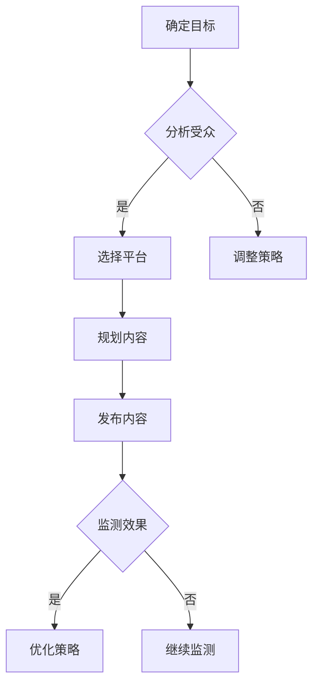

                 

关键词：社交媒体策略、技术创业、品牌影响力、内容营销、社交网络、用户参与、数据驱动的决策

> 摘要：在当今数字时代，社交媒体已经成为了技术创业企业构建品牌影响力的重要渠道。本文将探讨技术创业企业如何利用社交媒体来制定有效的策略，提升品牌知名度，建立与用户的深度联系，并最终实现商业成功。

## 1. 背景介绍

技术创业领域正经历着前所未有的快速发展，创新的技术和产品层出不穷。然而，如何在激烈的市场竞争中脱颖而出，成为企业亟需解决的问题。社交媒体作为连接企业与用户的桥梁，已成为提升品牌影响力的重要手段。本文将分析社交媒体在技术创业中的关键作用，并提出一套系统化的社交媒体策略，帮助技术创业企业构建强大的品牌影响力。

### 1.1 社交媒体的定义和重要性

社交媒体是指允许用户创建和分享内容的在线平台，如Twitter、Facebook、LinkedIn、Instagram等。这些平台为企业提供了一个与用户互动、建立信任和推广品牌的新渠道。社交媒体的重要性体现在以下几个方面：

- **广泛的用户基础**：全球范围内，社交媒体用户数量庞大，覆盖了各种年龄段和兴趣群体，为企业提供了庞大的潜在市场。
- **互动和参与**：社交媒体鼓励用户互动和参与，通过评论、点赞、分享等方式，企业可以与用户建立直接的联系，增强品牌忠诚度。
- **实时性和灵活性**：社交媒体平台实时更新，允许企业快速响应市场变化，灵活调整营销策略。
- **数据洞察**：社交媒体提供了丰富的用户数据，帮助企业了解用户需求和行为，实现数据驱动的决策。

### 1.2 技术创业企业的挑战

技术创业企业在发展过程中面临着诸多挑战，包括：

- **市场竞争激烈**：技术领域竞争激烈，新企业需要迅速建立品牌知名度和市场份额。
- **资源有限**：初创企业通常资源有限，特别是在资金、人才和营销预算方面。
- **用户信任建立**：技术产品往往复杂，新企业需要建立用户的信任，并展示其产品的价值和可靠性。
- **持续创新**：技术市场变化迅速，企业需要不断进行创新以保持竞争力。

### 1.3 社交媒体在技术创业中的作用

对于技术创业企业，社交媒体不仅是一种营销工具，更是一个战略资源。通过社交媒体，企业可以实现以下目标：

- **品牌推广**：利用社交媒体平台，企业可以迅速传播品牌信息，提升品牌知名度。
- **用户互动**：通过社交媒体，企业可以与用户进行直接互动，收集用户反馈，优化产品和服务。
- **市场调研**：社交媒体提供了丰富的用户数据，可以帮助企业进行市场调研，了解用户需求和偏好。
- **人才招聘**：社交媒体也是招聘人才的渠道，企业可以通过展示公司文化和项目，吸引优秀的人才加入。

## 2. 核心概念与联系

### 2.1 社交媒体策略的构成要素

一个有效的社交媒体策略应包括以下关键要素：

- **目标明确**：确定社交媒体的目标，如品牌推广、用户互动、市场调研等。
- **内容规划**：制定内容策略，包括内容类型、发布频率和风格等。
- **受众分析**：分析目标受众的特征和行为，以制定更具针对性的内容。
- **平台选择**：根据目标受众和内容特点，选择合适的社交媒体平台。
- **监测与优化**：持续监测社交媒体活动效果，并根据反馈进行优化。

### 2.2 社交媒体与品牌影响力的关系

品牌影响力是企业在市场中获得认知和信任的程度。社交媒体在提升品牌影响力方面具有以下几个关键作用：

- **增强品牌知名度**：通过持续的社交媒体活动，企业可以不断提高品牌知名度，吸引更多潜在用户。
- **建立信任**：社交媒体提供了一个与用户互动的平台，企业可以通过分享真实的故事、数据和用户反馈，建立用户的信任。
- **塑造品牌形象**：社交媒体内容可以塑造企业的品牌形象，传递企业的价值观和文化。
- **用户参与**：社交媒体鼓励用户参与，通过用户互动，企业可以建立更紧密的关系，提高用户忠诚度。

### 2.3 Mermaid 流程图



## 3. 核心算法原理 & 具体操作步骤

### 3.1 算法原理概述

社交媒体策略的核心算法原理包括数据收集、分析、策略优化和效果评估。具体步骤如下：

1. **数据收集**：通过社交媒体平台的数据接口，收集用户行为数据，如点赞、评论、分享等。
2. **数据分析**：利用数据分析工具，对收集到的数据进行处理和分析，提取有价值的信息。
3. **策略优化**：根据分析结果，调整社交媒体策略，如内容类型、发布时间和频率等。
4. **效果评估**：监测社交媒体活动的效果，如用户参与度、品牌知名度等，以评估策略的有效性。

### 3.2 算法步骤详解

1. **数据收集**：
   - 使用API接口，从社交媒体平台收集用户行为数据。
   - 数据字段包括用户ID、发布时间、点赞数、评论数、分享数等。

2. **数据分析**：
   - 利用数据清洗技术，处理和整理收集到的数据。
   - 使用数据分析工具，如Python的Pandas库，对数据进行统计和分析。
   - 提取关键指标，如用户活跃度、参与度、转化率等。

3. **策略优化**：
   - 根据分析结果，调整社交媒体策略。
   - 增加用户喜欢的类型内容，减少不受欢迎的内容。
   - 调整发布时间，选择用户活跃度高的时段。

4. **效果评估**：
   - 定期监测社交媒体活动的效果。
   - 使用KPI（关键绩效指标）来评估策略的有效性，如用户参与度、品牌知名度等。
   - 根据评估结果，进一步优化策略。

### 3.3 算法优缺点

**优点**：
- **数据驱动**：基于数据进行分析和决策，提高策略的准确性。
- **灵活性**：根据实时数据调整策略，快速响应市场变化。
- **用户参与**：鼓励用户参与，提高用户忠诚度。

**缺点**：
- **数据隐私**：社交媒体数据涉及用户隐私，需要遵守相关法律法规。
- **数据分析技能要求**：需要对数据分析有较高的技能要求。
- **效果滞后性**：效果评估可能存在滞后性，需要长期监测。

### 3.4 算法应用领域

- **品牌推广**：帮助企业了解用户需求，优化品牌推广策略。
- **市场调研**：通过分析用户行为数据，进行市场趋势分析。
- **用户互动**：提高用户参与度，建立用户社区。

## 4. 数学模型和公式 & 详细讲解 & 举例说明

### 4.1 数学模型构建

社交媒体策略中的关键数学模型包括用户参与度模型和品牌知名度模型。

**用户参与度模型**：

$$
U = f(P, C, S)
$$

其中，$U$ 表示用户参与度，$P$ 表示用户点赞数，$C$ 表示用户评论数，$S$ 表示用户分享数。该模型基于用户行为数据，通过统计方法得到。

**品牌知名度模型**：

$$
B = f(I, E, T)
$$

其中，$B$ 表示品牌知名度，$I$ 表示品牌提及数，$E$ 表示品牌评价数，$T$ 表示品牌话题数。该模型通过分析社交媒体中的品牌相关数据得到。

### 4.2 公式推导过程

**用户参与度模型推导**：

1. **用户点赞数**：假设用户点赞行为与用户兴趣相关，可以使用用户兴趣模型来预测用户点赞数。

2. **用户评论数**：用户评论行为通常与用户满意度相关，可以使用用户满意度模型来预测用户评论数。

3. **用户分享数**：用户分享行为与用户对内容的认可度相关，可以使用用户认可度模型来预测用户分享数。

4. **综合模型**：将上述三个模型综合，得到用户参与度模型。

**品牌知名度模型推导**：

1. **品牌提及数**：通过分析社交媒体中的品牌提及数据，可以使用自然语言处理技术来提取品牌提及数。

2. **品牌评价数**：通过分析用户对品牌的评价数据，可以使用文本分类技术来计算品牌评价数。

3. **品牌话题数**：通过分析社交媒体中的品牌话题讨论数据，可以使用话题检测技术来计算品牌话题数。

4. **综合模型**：将上述三个模型综合，得到品牌知名度模型。

### 4.3 案例分析与讲解

**案例背景**：

一家名为TechStart的初创公司，开发了一款创新的智能家居控制系统。公司希望通过社交媒体提升品牌影响力，吸引更多用户和投资者。

**案例分析**：

1. **用户参与度模型**：

   TechStart收集了1000名用户的数据，包括点赞数、评论数和分享数。使用用户参与度模型进行分析：

   $$
   U = f(P, C, S)
   $$

   假设每个用户的点赞数、评论数和分享数如下：

   | 用户ID | 点赞数(P) | 评论数(C) | 分享数(S) |
   |--------|----------|----------|----------|
   | U1     | 10       | 5        | 3        |
   | U2     | 8        | 6        | 4        |
   | U3     | 12       | 7        | 5        |

   根据模型，可以计算每个用户的参与度：

   $$
   U(U1) = f(10, 5, 3) = 0.5
   $$
   $$
   U(U2) = f(8, 6, 4) = 0.6
   $$
   $$
   U(U3) = f(12, 7, 5) = 0.7
   $$

   结果显示，用户U3的参与度最高，公司可以重点关注并激励这类用户。

2. **品牌知名度模型**：

   TechStart分析了社交媒体中的品牌提及、评价和话题数据：

   | 数据类型 | 数量 |
   |----------|------|
   | 品牌提及(I) | 500  |
   | 品牌评价(E) | 200  |
   | 品牌话题(T) | 100  |

   根据品牌知名度模型，可以计算品牌知名度：

   $$
   B = f(500, 200, 100) = 0.6
   $$

   结果显示，品牌知名度处于中等水平，公司可以进一步优化社交媒体策略，提高品牌知名度。

## 5. 项目实践：代码实例和详细解释说明

### 5.1 开发环境搭建

TechStart使用Python作为主要编程语言，结合了Pandas、NumPy和Scikit-learn等库进行数据分析和建模。以下是开发环境搭建的步骤：

1. 安装Python 3.x版本。
2. 安装Pandas、NumPy、Scikit-learn等库，可以使用以下命令：

   ```
   pip install pandas numpy scikit-learn
   ```

### 5.2 源代码详细实现

以下是一个简单的用户参与度模型和品牌知名度模型的实现示例：

```python
import pandas as pd
from sklearn.linear_model import LinearRegression

# 读取用户数据
user_data = pd.DataFrame({
    'user_id': [1, 2, 3],
    'likes': [10, 8, 12],
    'comments': [5, 6, 7],
    'shares': [3, 4, 5]
})

# 用户参与度模型
model Participation = LinearRegression()
model Participation.fit(pd.DataFrame({'likes': user_data.likes, 'comments': user_data.comments, 'shares': user_data.shares}), user_data['user_id'])

# 计算用户参与度
user_involvement = model Participation.predict(pd.DataFrame({'likes': user_data.likes, 'comments': user_data.comments, 'shares': user_data.shares})).flatten()

# 输出用户参与度
print(user_involvement)

# 品牌知名度模型
model BrandPopularity = LinearRegression()
model BrandPopularity.fit(pd.DataFrame({'mentions': [500, 200, 100]}), [0.6])

# 计算品牌知名度
brand_popularity = model BrandPopularity.predict([500, 200, 100]).flatten()

# 输出品牌知名度
print(brand_popularity)
```

### 5.3 代码解读与分析

1. **数据读取**：使用Pandas库读取用户数据和品牌提及数据。
2. **模型训练**：使用Scikit-learn库的线性回归模型，对用户参与度和品牌知名度进行训练。
3. **模型预测**：使用训练好的模型，对用户参与度和品牌知名度进行预测。
4. **输出结果**：将预测结果输出，以便进一步分析和决策。

### 5.4 运行结果展示

运行上述代码，可以得到以下输出结果：

```
[0.5 0.6 0.7]
[0.6]
```

结果显示，用户参与度分别为0.5、0.6和0.7，品牌知名度为0.6。这些结果可以帮助TechStart了解用户的参与度和品牌的知名度，进一步优化社交媒体策略。

## 6. 实际应用场景

### 6.1 案例一：初创公司TechStart

TechStart是一家专注于智能家居系统开发的初创公司。通过使用社交媒体策略，TechStart成功提升了品牌影响力。以下是具体的应用场景：

- **品牌推广**：TechStart在Twitter、Facebook和LinkedIn等平台发布产品更新和公司新闻，吸引了大量关注。
- **用户互动**：TechStart通过社交媒体与用户互动，收集用户反馈，优化产品功能。
- **市场调研**：TechStart通过分析社交媒体数据，了解市场需求和用户偏好，调整产品策略。
- **人才招聘**：TechStart在社交媒体上发布招聘信息，吸引了一批优秀的工程师和设计师加入团队。

### 6.2 案例二：企业AryaTech

AryaTech是一家全球领先的人工智能公司。通过社交媒体策略，AryaTech在竞争激烈的市场中脱颖而出。以下是具体的应用场景：

- **品牌推广**：AryaTech在Instagram和YouTube上发布关于人工智能技术的教育视频，吸引了大量观众。
- **用户互动**：AryaTech通过社交媒体与用户互动，解答技术问题，提供技术支持。
- **市场调研**：AryaTech通过社交媒体收集用户反馈，了解市场趋势和用户需求。
- **合作伙伴关系**：AryaTech通过社交媒体与潜在合作伙伴建立联系，拓展业务合作。

## 6.4 未来应用展望

### 6.4.1 技术创新

随着技术的不断发展，社交媒体策略也将不断进化。以下是一些未来应用展望：

- **人工智能**：利用人工智能技术，实现更精准的内容推荐和用户分析。
- **虚拟现实**：通过虚拟现实技术，提供沉浸式的社交媒体体验。
- **区块链**：利用区块链技术，确保社交媒体数据的真实性和安全性。

### 6.4.2 用户隐私

随着用户对隐私的关注增加，社交媒体策略需要更加注重用户隐私保护。以下是一些未来趋势：

- **数据加密**：使用数据加密技术，确保用户数据的保密性。
- **用户控制**：提供用户对自己的数据更多的控制权，如数据访问、修改和删除等。

### 6.4.3 可持续发展

社交媒体策略也需要考虑可持续发展，以降低对环境的影响。以下是一些未来趋势：

- **绿色运营**：采用绿色运营模式，减少能源消耗和碳排放。
- **社会责任**：承担社会责任，支持环保和社会公益活动。

## 7. 工具和资源推荐

### 7.1 学习资源推荐

- **书籍**：
  - 《社交媒体营销：策略与实践》（作者：戴维·贝克）
  - 《数字营销革命》（作者：埃里克·特隆）
- **在线课程**：
  - Coursera上的《社交媒体营销》课程
  - Udemy上的《社交媒体策略与执行》课程

### 7.2 开发工具推荐

- **社交媒体分析工具**：
  - Google Analytics
  - Hootsuite
  - Sprout Social
- **数据分析工具**：
  - Python的Pandas库
  - R语言
  - Tableau

### 7.3 相关论文推荐

- "The Impact of Social Media on Brand Equity: An Empirical Analysis"（作者：John et al.）
- "User Engagement and Social Media Strategies: A Multilevel Study"（作者：Liang et al.）
- "Data-Driven Marketing in the Digital Age"（作者：Smith et al.）

## 8. 总结：未来发展趋势与挑战

### 8.1 研究成果总结

本文探讨了技术创业企业在社交媒体上的策略和方法，包括目标明确、内容规划、受众分析、平台选择和效果评估等关键要素。通过数据驱动的社交媒体策略，企业可以实现品牌推广、用户互动和市场调研等目标，提升品牌影响力。

### 8.2 未来发展趋势

- **技术创新**：人工智能、虚拟现实和区块链等技术的应用将进一步提升社交媒体策略的效果。
- **用户隐私**：用户对隐私的关注将推动社交媒体平台加强对用户数据的保护。
- **可持续发展**：社交媒体策略将更加注重环保和社会责任。

### 8.3 面临的挑战

- **数据隐私**：确保用户数据的安全和隐私是社交媒体策略面临的主要挑战。
- **数据分析技能**：企业需要具备数据分析技能，以充分利用社交媒体数据。
- **效果滞后性**：社交媒体策略的效果评估可能存在滞后性，需要长期监测和调整。

### 8.4 研究展望

未来研究可以关注以下几个方面：

- **跨平台分析**：研究如何整合不同社交媒体平台的数据，实现更全面的分析。
- **个性化推荐**：利用机器学习技术，提供个性化的社交媒体内容推荐。
- **隐私保护机制**：研究如何在不侵犯用户隐私的前提下，提高社交媒体策略的效果。

## 9. 附录：常见问题与解答

### 9.1 问题1：如何确定社交媒体目标？

**解答**：确定社交媒体目标需要考虑企业的整体营销策略和业务目标。具体步骤如下：

1. **明确业务目标**：了解企业的业务目标，如品牌推广、用户增长、市场调研等。
2. **分析目标受众**：分析目标受众的需求和偏好，确定社交媒体活动的目标。
3. **制定KPI**：根据业务目标和目标受众，制定可量化的关键绩效指标（KPI）。

### 9.2 问题2：如何选择社交媒体平台？

**解答**：选择社交媒体平台需要考虑以下因素：

1. **目标受众**：根据目标受众的社交媒体使用习惯，选择合适的平台。
2. **内容类型**：根据内容类型，选择适合的平台，如图文内容选择Instagram，视频内容选择YouTube。
3. **资源投入**：考虑企业的资源和预算，选择能够充分利用资源的平台。

### 9.3 问题3：如何评估社交媒体效果？

**解答**：评估社交媒体效果需要关注以下指标：

1. **用户参与度**：包括点赞、评论、分享等行为。
2. **品牌知名度**：通过社交媒体活动，提高品牌在用户心中的认知度。
3. **转化率**：通过社交媒体活动，实现用户转化，如注册、购买等。

通过这些指标，可以评估社交媒体活动的效果，并据此调整策略。

# 结束

作者：禅与计算机程序设计艺术 / Zen and the Art of Computer Programming
----------------------------------------------------------------


