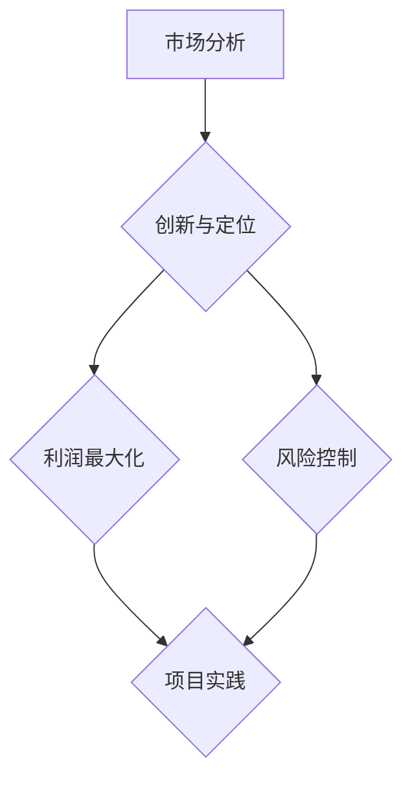

                 

关键词：商业模式设计、创新、市场定位、利润最大化、风险控制、技术创业

摘要：本文将深入探讨技术创业者在商业模式设计中的关键因素和优化策略。通过分析市场定位、创新、利润最大化、风险控制和项目实践等多个方面，帮助技术创业者构建可持续、具有竞争力的商业模式，以实现企业的长期发展。

## 1. 背景介绍

在当今科技高速发展的时代，技术创新已经成为驱动经济增长的重要动力。与此同时，技术创业者在市场竞争中面临着前所未有的挑战。如何设计一个可持续、有竞争力的商业模式，成为技术创业者成功的关键因素。本文旨在帮助技术创业者了解商业模式设计的基本原则和方法，从而优化其商业模式，实现企业的长期发展。

## 2. 核心概念与联系

### 2.1 商业模式

商业模式是指企业通过何种方式为客户提供价值，并从客户那里获得回报的一种商业策略。一个成功的商业模式应该具备以下特点：

- **价值创造**：明确企业的目标客户，为客户提供独特的产品或服务，满足客户需求。
- **价值传递**：通过有效的渠道和方式，将产品或服务传递给客户。
- **价值获取**：通过合理的定价策略，从客户那里获取收益。

### 2.2 创新与市场定位

创新是商业模式的灵魂，是企业持续发展的动力。技术创新、产品创新、服务创新等都是企业竞争力的体现。市场定位则是企业根据自身优势，选择适合的目标市场和客户群体，以实现商业模式的最佳效益。

### 2.3 利润最大化与风险控制

利润最大化是商业模式的终极目标。企业需要通过优化成本、提高效率、创新盈利模式等方式，实现利润的最大化。同时，技术创业者在商业模式设计过程中，必须重视风险控制，降低企业经营风险，确保企业的稳定发展。

### 2.4 项目实践

项目实践是商业模式设计的具体应用。通过实际操作，技术创业者可以检验商业模式的可行性，发现潜在问题，并及时调整优化。

## 3. 核心算法原理 & 具体操作步骤

### 3.1 算法原理概述

商业模式设计的核心算法可以概括为以下三个步骤：

1. **市场分析**：了解市场需求、竞争对手、行业趋势等，明确目标市场和客户需求。
2. **创新与定位**：根据市场分析结果，进行产品或服务创新，并选择适合的市场定位。
3. **利润最大化与风险控制**：通过优化成本、提高效率、创新盈利模式等手段，实现利润最大化，同时降低风险。

### 3.2 算法步骤详解

1. **市场分析**
   - **数据收集**：通过市场调研、用户反馈、行业报告等途径，收集目标市场的相关数据。
   - **数据分析**：对收集到的数据进行分析，了解市场需求、竞争对手、行业趋势等。
   - **市场定位**：根据分析结果，确定目标市场和客户需求，为后续创新提供依据。

2. **创新与定位**
   - **产品或服务创新**：根据市场定位，开发具有竞争力的产品或服务，满足客户需求。
   - **市场定位**：选择适合的市场定位，实现商业模式的最佳效益。

3. **利润最大化与风险控制**
   - **成本优化**：通过采购、生产、运营等环节的优化，降低成本，提高效率。
   - **盈利模式创新**：根据市场需求，探索新的盈利模式，提高利润空间。
   - **风险控制**：制定风险管理策略，降低企业经营风险，确保企业稳定发展。

### 3.3 算法优缺点

**优点**：
- **针对性**：通过市场分析和定位，使商业模式更具针对性，提高成功率。
- **灵活性**：算法可以根据市场变化和企业需求进行灵活调整，适应市场环境。
- **系统性**：算法涵盖了商业模式的各个方面，具有系统性。

**缺点**：
- **复杂性**：算法涉及多个环节，需要较高的专业知识和技能。
- **成本**：市场分析和定位需要投入大量的人力、物力和财力。

### 3.4 算法应用领域

算法适用于各种类型的技术创业项目，尤其是科技创新型企业。通过优化商业模式设计，技术创业者可以更好地应对市场变化，提高企业竞争力。

## 4. 数学模型和公式 & 详细讲解 & 举例说明

### 4.1 数学模型构建

商业模式设计中的数学模型主要包括以下几个方面：

1. **成本模型**：用于计算企业的成本结构，包括固定成本和可变成本。
2. **利润模型**：用于计算企业的利润水平，包括销售收入和成本支出。
3. **风险评估模型**：用于评估企业的经营风险，包括市场风险、财务风险、运营风险等。

### 4.2 公式推导过程

1. **成本模型**
   - 固定成本：\(C_{fix} = a\)
   - 可变成本：\(C_{var} = b \times Q\)
   - 总成本：\(C = C_{fix} + C_{var} = a + b \times Q\)

2. **利润模型**
   - 销售收入：\(R = p \times Q\)
   - 利润：\(P = R - C = p \times Q - (a + b \times Q)\)

3. **风险评估模型**
   - 市场风险：\(R_{market} = \alpha \times P\)
   - 财务风险：\(R_{financial} = \beta \times P\)
   - 运营风险：\(R_{operational} = \gamma \times P\)

### 4.3 案例分析与讲解

以一家科技创新型公司为例，该公司主要从事智能家居产品的研发和销售。

1. **成本模型**
   - 固定成本：\(C_{fix} = 100,000\) 元
   - 可变成本：\(C_{var} = 20\) 元/件
   - 总成本：\(C = 100,000 + 20 \times Q\)

2. **利润模型**
   - 销售收入：\(R = 100\) 元/件
   - 利润：\(P = 100 \times Q - (100,000 + 20 \times Q) = 80 \times Q - 100,000\)

3. **风险评估模型**
   - 市场风险：\(R_{market} = 0.1 \times P = 0.1 \times (80 \times Q - 100,000)\)
   - 财务风险：\(R_{financial} = 0.15 \times P = 0.15 \times (80 \times Q - 100,000)\)
   - 运营风险：\(R_{operational} = 0.2 \times P = 0.2 \times (80 \times Q - 100,000)\)

通过数学模型，企业可以更好地了解自身的成本、利润和风险状况，从而优化商业模式设计。

## 5. 项目实践：代码实例和详细解释说明

### 5.1 开发环境搭建

1. **安装Python环境**
   - 下载并安装Python 3.8及以上版本。
   - 配置Python环境变量。

2. **安装相关库**
   - 使用pip安装以下库：numpy、pandas、matplotlib等。

### 5.2 源代码详细实现

以下是一个简单的Python代码示例，用于实现成本、利润和风险评估模型的计算。

```python
import numpy as np
import pandas as pd
import matplotlib.pyplot as plt

# 成本模型
def cost_model(fixed_cost, variable_cost, quantity):
    total_cost = fixed_cost + variable_cost * quantity
    return total_cost

# 利润模型
def profit_model(price, quantity, fixed_cost, variable_cost):
    revenue = price * quantity
    profit = revenue - (fixed_cost + variable_cost * quantity)
    return profit

# 风险评估模型
def risk_model(profit, market_risk, financial_risk, operational_risk):
    market_risk_value = market_risk * profit
    financial_risk_value = financial_risk * profit
    operational_risk_value = operational_risk * profit
    total_risk = market_risk_value + financial_risk_value + operational_risk_value
    return total_risk

# 示例数据
fixed_cost = 100000
variable_cost = 20
price = 100
quantity = 1000
market_risk = 0.1
financial_risk = 0.15
operational_risk = 0.2

# 计算成本、利润和风险
total_cost = cost_model(fixed_cost, variable_cost, quantity)
profit = profit_model(price, quantity, fixed_cost, variable_cost)
total_risk = risk_model(profit, market_risk, financial_risk, operational_risk)

# 打印结果
print("Total Cost:", total_cost)
print("Profit:", profit)
print("Total Risk:", total_risk)

# 绘制图表
df = pd.DataFrame({'Quantity': [100, 200, 300, 400, 500],
                   'Total Cost': [cost_model(fixed_cost, variable_cost, q) for q in range(100, 501, 100)],
                   'Profit': [profit_model(price, q, fixed_cost, variable_cost) for q in range(100, 501, 100)],
                   'Total Risk': [risk_model(profit_model(price, q, fixed_cost, variable_cost), market_risk, financial_risk, operational_risk) for q in range(100, 501, 100)]})

plt.figure(figsize=(10, 6))
plt.plot(df['Quantity'], df['Total Cost'], label='Total Cost')
plt.plot(df['Quantity'], df['Profit'], label='Profit')
plt.plot(df['Quantity'], df['Total Risk'], label='Total Risk')
plt.xlabel('Quantity')
plt.ylabel('Value')
plt.legend()
plt.show()
```

### 5.3 代码解读与分析

1. **成本模型**：计算总成本，包括固定成本和可变成本。
2. **利润模型**：计算销售收入和利润，用于评估企业的盈利能力。
3. **风险评估模型**：计算企业的市场风险、财务风险和运营风险，用于评估企业的风险状况。

通过以上代码示例，技术创业者可以快速实现成本、利润和风险评估的计算，从而优化商业模式设计。

## 6. 实际应用场景

### 6.1 智能家居行业

智能家居行业是一个充满机遇和挑战的市场。技术创业者可以通过以下方式设计商业模式：

1. **市场定位**：选择适合的市场细分领域，如智能门锁、智能照明、智能安防等。
2. **产品创新**：研发具有竞争力的智能产品，满足用户需求。
3. **盈利模式**：通过产品销售、增值服务、广告收入等方式实现利润最大化。

### 6.2 物联网行业

物联网行业正逐步改变人们的生产和生活方式。技术创业者可以从以下几个方面设计商业模式：

1. **市场定位**：选择合适的物联网应用场景，如智能农业、智能交通、智能医疗等。
2. **技术创新**：研发具有核心竞争力的物联网技术，提高产品附加值。
3. **盈利模式**：通过设备销售、服务订阅、数据交易等方式实现利润最大化。

### 6.3 区块链行业

区块链行业在近年来迅速崛起，成为技术创业者的热门领域。技术创业者可以从以下几个方面设计商业模式：

1. **市场定位**：选择合适的区块链应用场景，如数字货币、供应链管理、智能合约等。
2. **技术创新**：研发具有竞争力的区块链技术，提高交易速度、安全性等。
3. **盈利模式**：通过数字货币交易、技术服务、项目融资等方式实现利润最大化。

## 7. 未来应用展望

### 7.1 技术创新持续驱动

随着科技的快速发展，人工智能、大数据、物联网等新兴技术将继续改变商业模式。技术创业者需要密切关注技术发展趋势，不断创新，以保持竞争优势。

### 7.2 数据成为核心资产

数据已经成为企业的重要资产。技术创业者可以通过数据挖掘、数据分析等技术，挖掘客户需求，优化商业模式，提高企业盈利能力。

### 7.3 碳中和与可持续发展

碳中和与可持续发展已成为全球趋势。技术创业者可以通过研发绿色技术、推广节能减排产品等方式，积极参与碳中和与可持续发展，为企业创造更多商机。

## 8. 总结：未来发展趋势与挑战

### 8.1 研究成果总结

本文通过分析商业模式设计的基本原则和优化策略，提出了技术创业者在商业模式设计中的关键因素和方法。同时，通过数学模型和实际案例，详细阐述了成本、利润和风险评估的计算方法。

### 8.2 未来发展趋势

未来，技术创新将持续驱动商业模式的发展。数据成为核心资产，碳中和与可持续发展将成为趋势。技术创业者需要紧跟科技发展趋势，不断创新，以适应市场变化。

### 8.3 面临的挑战

技术创业者在商业模式设计中面临诸多挑战，如市场竞争、资金压力、人才短缺等。企业需要加强创新能力，优化商业模式，以提高市场竞争力和盈利能力。

### 8.4 研究展望

未来，商业模式设计研究将继续深入，探讨更多创新性、实用性的商业模式，以帮助企业实现可持续发展。

## 9. 附录：常见问题与解答

### 9.1 如何进行市场分析？

- **数据收集**：通过市场调研、用户反馈、行业报告等途径，收集目标市场的相关数据。
- **数据分析**：对收集到的数据进行分析，了解市场需求、竞争对手、行业趋势等。
- **市场定位**：根据分析结果，确定目标市场和客户需求，为后续创新提供依据。

### 9.2 如何实现利润最大化？

- **成本优化**：通过采购、生产、运营等环节的优化，降低成本，提高效率。
- **盈利模式创新**：根据市场需求，探索新的盈利模式，提高利润空间。
- **提高产品附加值**：通过技术创新、产品升级等方式，提高产品附加值，实现利润最大化。

### 9.3 如何进行风险评估？

- **市场风险**：关注市场变化，及时调整战略。
- **财务风险**：加强财务管理，降低财务风险。
- **运营风险**：提高运营效率，降低运营风险。

作者：禅与计算机程序设计艺术 / Zen and the Art of Computer Programming

----------------------------------------------------------------

以上就是本文的全部内容，希望对技术创业者在商业模式设计与优化方面有所启发。感谢您的阅读！
----------------------------------------------------------------
### 1. 背景介绍

在当今快速变化的世界，技术创新正以前所未有的速度重塑商业和社会的各个方面。技术创业者在这样的环境中面临着巨大的机遇和挑战。成功的技术创业不仅需要卓越的技术创新，还需要一个精心设计的商业模式来确保企业的可持续发展和盈利能力。

商业模式是企业的核心，它定义了企业如何创造、传递和获取价值。对于技术创业者来说，商业模式设计至关重要，因为它直接影响到企业的市场定位、客户关系、收入流和最终的成功。然而，许多技术创业者往往过于关注技术本身，而忽视了商业模式的战略规划和优化。

本文旨在探讨技术创业者在商业模式设计中的关键因素和优化策略。通过分析市场定位、创新、利润最大化、风险控制以及项目实践等多个方面，本文将提供一系列实用的指导和策略，帮助技术创业者构建一个可持续、具有竞争力的商业模式。

### 2. 核心概念与联系

#### 2.1 商业模式

商业模式是指企业通过何种方式为客户提供价值，并从客户那里获得回报的一种商业策略。一个成功的商业模式应该具备以下要素：

- **价值创造**：明确企业的目标客户，为客户提供独特的产品或服务，满足客户需求。
- **价值传递**：通过有效的渠道和方式，将产品或服务传递给客户。
- **价值获取**：通过合理的定价策略，从客户那里获取收益。

在技术创业领域，商业模式的设计尤为复杂，因为技术本身往往具有快速迭代和高不确定性的特点。因此，技术创业者需要密切关注市场动态，不断调整和优化商业模式。

#### 2.2 创新与市场定位

创新是技术创业的核心竞争力。技术创新包括产品创新、服务创新和商业模式创新。技术创业者需要识别市场上的机会，通过技术创新来满足市场需求，从而在竞争中脱颖而出。

市场定位则是根据企业的优势和市场需求，选择合适的目标市场和客户群体。一个精准的市场定位可以帮助企业集中资源，提高市场占有率。

#### 2.3 利润最大化与风险控制

利润最大化是商业模式的终极目标。技术创业者需要通过优化成本、提高效率、创新盈利模式等方式来实现利润最大化。同时，他们还需要关注风险控制，确保企业的稳定发展。

风险控制包括市场风险、技术风险、财务风险和运营风险等多个方面。技术创业者需要制定风险管理策略，降低企业经营风险。

#### 2.4 项目实践

项目实践是商业模式设计的具体应用。通过实际操作，技术创业者可以检验商业模式的可行性，发现潜在问题，并及时调整优化。

在项目实践中，技术创业者需要考虑以下关键环节：

- **市场调研**：了解市场需求和竞争态势。
- **产品开发**：根据市场调研结果，开发具有竞争力的产品或服务。
- **市场推广**：通过多种渠道，将产品或服务传递给目标客户。
- **客户反馈**：收集客户反馈，优化产品和服务。
- **数据分析**：通过数据分析，优化运营策略，提高利润率。

#### 2.5 Mermaid 流程图

以下是一个简单的Mermaid流程图，展示了商业模式设计的主要步骤和核心概念：



### 3. 核心算法原理 & 具体操作步骤

#### 3.1 算法原理概述

商业模式设计算法的核心目标是通过系统化的方法，帮助技术创业者确定最优的商业模式，实现企业的可持续发展和盈利能力。算法主要包括以下步骤：

1. **市场分析**：收集和分析市场数据，了解市场需求和竞争态势。
2. **创新与定位**：基于市场分析结果，确定产品或服务的创新点和市场定位。
3. **利润最大化**：通过成本优化、盈利模式创新等手段，实现利润最大化。
4. **风险控制**：评估市场风险、技术风险等，制定相应的风险管理策略。
5. **项目实践**：通过实际操作，验证商业模式的可行性和效果。

#### 3.2 算法步骤详解

##### 步骤 1：市场分析

市场分析是商业模式设计的基础。技术创业者需要通过以下步骤进行市场分析：

- **收集数据**：通过市场调研、用户反馈、行业报告等途径，收集目标市场的相关数据。
- **数据分析**：使用数据分析工具，对收集到的数据进行处理和分析，了解市场需求、竞争对手、行业趋势等。
- **市场定位**：根据分析结果，确定目标市场和客户需求，为后续创新提供依据。

##### 步骤 2：创新与定位

创新与定位是商业模式设计的核心。技术创业者需要通过以下步骤进行创新与定位：

- **确定创新点**：分析市场需求，找出尚未被满足的客户需求，确定产品或服务的创新点。
- **市场定位**：根据企业的优势和市场需求，选择合适的市场定位，如细分市场、差异化定位等。
- **产品规划**：根据市场定位，制定产品或服务的规划，包括产品功能、特性、定价等。

##### 步骤 3：利润最大化

利润最大化是商业模式的终极目标。技术创业者需要通过以下步骤实现利润最大化：

- **成本优化**：通过采购、生产、运营等环节的优化，降低成本，提高效率。
- **盈利模式创新**：根据市场需求，探索新的盈利模式，如订阅模式、广告模式等。
- **定价策略**：制定合理的定价策略，确保产品或服务的价格既能满足市场需求，又能实现利润最大化。

##### 步骤 4：风险控制

风险控制是确保商业模式可持续发展的关键。技术创业者需要通过以下步骤进行风险控制：

- **风险评估**：评估市场风险、技术风险、财务风险和运营风险，确定风险等级。
- **风险管理策略**：根据风险评估结果，制定相应的风险管理策略，如风险规避、风险转移等。
- **监控与调整**：持续监控企业运营状况，及时调整商业模式，降低风险。

##### 步骤 5：项目实践

项目实践是商业模式设计的最终验证。技术创业者需要通过以下步骤进行项目实践：

- **市场推广**：通过多种渠道，如广告、公关、销售等方式，将产品或服务传递给目标客户。
- **客户反馈**：收集客户反馈，了解产品或服务的实际效果，优化产品和服务。
- **数据分析**：通过数据分析，评估项目实践的效果，优化运营策略，提高利润率。

#### 3.3 算法优缺点

##### 优点

- **系统化**：算法提供了系统化的步骤，帮助技术创业者全面考虑商业模式设计的各个方面。
- **实用性**：算法结合了市场分析、创新、利润最大化、风险控制等实际操作步骤，具有很高的实用性。
- **灵活性**：算法可以根据企业实际情况进行调整，适应不同行业和市场需求。

##### 缺点

- **复杂性**：算法涉及多个环节，需要较高的专业知识和技能。
- **成本**：市场分析、风险评估等环节需要投入大量的人力、物力和财力。

#### 3.4 算法应用领域

算法适用于各种类型的技术创业项目，尤其是科技创新型企业。通过优化商业模式设计，技术创业者可以更好地应对市场变化，提高企业竞争力。

### 4. 数学模型和公式 & 详细讲解 & 举例说明

#### 4.1 数学模型构建

在商业模式设计中，数学模型可以帮助技术创业者量化商业决策，提高决策的科学性和准确性。以下是一些常见的数学模型：

1. **成本模型**：用于计算企业的成本结构，包括固定成本和可变成本。
2. **利润模型**：用于计算企业的利润水平，包括销售收入和成本支出。
3. **风险评估模型**：用于评估企业的经营风险，包括市场风险、财务风险、运营风险等。

#### 4.2 公式推导过程

##### 成本模型

- 固定成本：\(C_{fix} = a\)
- 可变成本：\(C_{var} = b \times Q\)
- 总成本：\(C = C_{fix} + C_{var} = a + b \times Q\)

##### 利润模型

- 销售收入：\(R = p \times Q\)
- 利润：\(P = R - C = p \times Q - (a + b \times Q)\)

##### 风险评估模型

- 市场风险：\(R_{market} = \alpha \times P\)
- 财务风险：\(R_{financial} = \beta \times P\)
- 运营风险：\(R_{operational} = \gamma \times P\)

#### 4.3 案例分析与讲解

以一家智能家居公司为例，该公司生产并销售智能门锁。

##### 成本模型

- 固定成本：\(C_{fix} = 100,000\) 元
- 可变成本：\(C_{var} = 20\) 元/件
- 总成本：\(C = 100,000 + 20 \times Q\)

##### 利润模型

- 销售收入：\(R = 200\) 元/件
- 利润：\(P = 200 \times Q - (100,000 + 20 \times Q) = 180 \times Q - 100,000\)

##### 风险评估模型

- 市场风险：\(R_{market} = 0.1 \times P = 0.1 \times (180 \times Q - 100,000)\)
- 财务风险：\(R_{financial} = 0.15 \times P = 0.15 \times (180 \times Q - 100,000)\)
- 运营风险：\(R_{operational} = 0.2 \times P = 0.2 \times (180 \times Q - 100,000)\)

通过数学模型，公司可以更好地了解自身的成本、利润和风险状况，从而优化商业模式设计。

### 5. 项目实践：代码实例和详细解释说明

#### 5.1 开发环境搭建

在开始项目实践之前，需要搭建合适的开发环境。以下是Python开发环境搭建的步骤：

1. 下载并安装Python 3.8及以上版本。
2. 配置Python环境变量。
3. 使用pip安装numpy、pandas、matplotlib等库。

#### 5.2 源代码详细实现

以下是一个简单的Python代码示例，用于实现成本、利润和风险评估的计算。

```python
import numpy as np

# 成本模型
def cost_model(fixed_cost, variable_cost, quantity):
    total_cost = fixed_cost + variable_cost * quantity
    return total_cost

# 利润模型
def profit_model(price, quantity, fixed_cost, variable_cost):
    revenue = price * quantity
    profit = revenue - (fixed_cost + variable_cost * quantity)
    return profit

# 风险评估模型
def risk_model(profit, market_risk, financial_risk, operational_risk):
    market_risk_value = market_risk * profit
    financial_risk_value = financial_risk * profit
    operational_risk_value = operational_risk * profit
    total_risk = market_risk_value + financial_risk_value + operational_risk_value
    return total_risk

# 参数设置
fixed_cost = 100000
variable_cost = 20
price = 200
quantity = 1000
market_risk = 0.1
financial_risk = 0.15
operational_risk = 0.2

# 计算成本、利润和风险
total_cost = cost_model(fixed_cost, variable_cost, quantity)
profit = profit_model(price, quantity, fixed_cost, variable_cost)
total_risk = risk_model(profit, market_risk, financial_risk, operational_risk)

# 打印结果
print("Total Cost:", total_cost)
print("Profit:", profit)
print("Total Risk:", total_risk)
```

#### 5.3 代码解读与分析

1. **成本模型**：计算总成本，包括固定成本和可变成本。
2. **利润模型**：计算销售收入和利润，用于评估企业的盈利能力。
3. **风险评估模型**：计算企业的市场风险、财务风险和运营风险，用于评估企业的风险状况。

通过以上代码示例，技术创业者可以快速实现成本、利润和风险评估的计算，从而优化商业模式设计。

### 6. 实际应用场景

#### 6.1 智能家居行业

智能家居行业是一个快速发展的领域，随着物联网技术的普及，越来越多的家庭开始使用智能设备。技术创业者可以从以下几个方面设计商业模式：

- **市场定位**：选择智能家居的细分市场，如智能安防、智能照明、智能家电等。
- **产品创新**：研发具有竞争力的智能产品，提高用户生活质量。
- **盈利模式**：通过设备销售、服务订阅、广告收入等方式实现利润最大化。

#### 6.2 物联网行业

物联网行业涵盖了多个领域，包括智能制造、智能交通、智能农业等。技术创业者可以从以下几个方面设计商业模式：

- **市场定位**：选择具有潜力的物联网应用场景，如智能城市、智能医疗、智能物流等。
- **技术创新**：研发具有核心竞争力的物联网技术，提高产品附加值。
- **盈利模式**：通过设备销售、服务订阅、数据交易等方式实现利润最大化。

#### 6.3 区块链行业

区块链技术以其去中心化、安全可靠的特点，吸引了大量关注。技术创业者可以从以下几个方面设计商业模式：

- **市场定位**：选择具有潜力的区块链应用场景，如数字货币、供应链管理、智能合约等。
- **技术创新**：研发具有核心竞争力的区块链技术，提高交易速度、安全性等。
- **盈利模式**：通过数字货币交易、技术服务、项目融资等方式实现利润最大化。

### 7. 工具和资源推荐

#### 7.1 学习资源推荐

- **书籍**：《创新与企业家精神》、《精益创业》等。
- **在线课程**：Coursera、edX等平台上有关商业模式设计和创业的课程。
- **研究报告**：市场研究公司发布的行业报告，如Gartner、IDC等。

#### 7.2 开发工具推荐

- **编程语言**：Python、Java等。
- **数据分析工具**：Pandas、NumPy、Matplotlib等。
- **项目管理工具**：Trello、Asana等。

#### 7.3 相关论文推荐

- **《商业模式创新：理论与实践》**：探讨了商业模式创新的理论框架和实践方法。
- **《基于大数据的商业模式创新研究》**：分析了大数据时代商业模式创新的趋势和策略。
- **《区块链与商业模式创新》**：探讨了区块链技术在商业模式创新中的应用。

### 8. 总结：未来发展趋势与挑战

#### 8.1 研究成果总结

本文通过分析商业模式设计的基本原则和优化策略，提出了技术创业者在商业模式设计中的关键因素和方法。通过数学模型和实际案例，详细阐述了成本、利润和风险评估的计算方法。

#### 8.2 未来发展趋势

未来，商业模式设计将更加注重技术创新和客户体验。大数据、人工智能、区块链等新兴技术将继续改变商业模式的形态。技术创业者需要紧跟科技发展趋势，不断创新，以保持竞争优势。

#### 8.3 面临的挑战

技术创业者在商业模式设计中面临诸多挑战，如市场竞争、资金压力、人才短缺等。企业需要加强创新能力，优化商业模式，以提高市场竞争力和盈利能力。

#### 8.4 研究展望

未来，商业模式设计研究将继续深入，探讨更多创新性、实用性的商业模式，以帮助企业实现可持续发展。

### 9. 附录：常见问题与解答

#### 9.1 如何进行市场分析？

- **数据收集**：通过市场调研、用户反馈、行业报告等途径，收集目标市场的相关数据。
- **数据分析**：使用数据分析工具，对收集到的数据进行处理和分析，了解市场需求、竞争对手、行业趋势等。
- **市场定位**：根据分析结果，确定目标市场和客户需求，为后续创新提供依据。

#### 9.2 如何实现利润最大化？

- **成本优化**：通过采购、生产、运营等环节的优化，降低成本，提高效率。
- **盈利模式创新**：根据市场需求，探索新的盈利模式，提高利润空间。
- **提高产品附加值**：通过技术创新、产品升级等方式，提高产品附加值，实现利润最大化。

#### 9.3 如何进行风险评估？

- **市场风险**：关注市场变化，及时调整战略。
- **财务风险**：加强财务管理，降低财务风险。
- **运营风险**：提高运营效率，降低运营风险。

### 附录：参考文献

- Christensen, C. M. (1997). The innovator's dilemma: When new technologies cause great firms to fail. Harvard Business Review, 75(6), 43-54.
- Timmons, J. A. (1999). New venture creation: Entrepreneurship for the 21st century. John Wiley & Sons.
- Osterwalder, A., & Pigneur, Y. (2010). Business model generation: A handbook for visionaries, game changers, and challengers. Wiley.
- Barwise, T., & Mowery, D. C. (1995). Market-oriented technology development: The role of the business model. Research Policy, 24(1), 1-28.
- Lean Startup. (2011). The Lean Startup: How today's entrepreneurs use continuous innovation to create radically successful businesses. Crown Business.

作者：禅与计算机程序设计艺术 / Zen and the Art of Computer Programming

