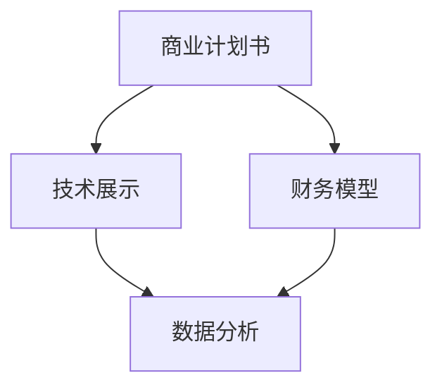

                 

关键词：技术创业，风投，融资策略，投资评估，商业计划书，演示文稿，技术展示

> 摘要：本文将深入探讨技术创业公司如何制定有效的融资策略，以吸引风投的关注和投资。我们将从多个角度分析，包括商业计划的撰写、技术展示的准备、财务模型的构建以及如何通过数据和分析来增强说服力。

## 1. 背景介绍

技术创业一直是推动经济增长和社会进步的重要力量。随着全球化的深入和科技的快速发展，创业环境日益改善，吸引了越来越多的创业者和投资者。然而，技术创业公司在获得风投（Venture Capital，VC）青睐的过程中面临诸多挑战。风投公司对投资项目的筛选标准十分严格，不仅要看到技术创新的潜力，还需要对公司整体商业模式的可行性和团队的执行力有充分的信心。

本文将提供一整套策略，帮助技术创业公司提升自己的吸引力，成功获得风投的投资。我们将详细讨论如何撰写一个吸引人的商业计划书，如何准备一次令人信服的技术演示，如何构建一个稳健的财务模型，以及如何利用数据和分析来增强投资提案的说服力。

### 1.1 技术创业的现状

在当前技术驱动的商业环境中，创业公司往往专注于开发创新的技术产品或服务。这些公司可能拥有独特的技术突破，或者是在现有技术上进行改进，以提供更好的用户体验或更高的效率。然而，技术创新虽然重要，但并不是吸引风投的唯一因素。风投公司更加关注项目的市场潜力、商业模式和团队。

根据PwC和CB Insights的报告，2019年全球风投投资总额达到1,590亿美元，同比增长22%。这一数据显示出风投行业的繁荣，同时也反映了投资者对新兴技术的关注和信心。对于技术创业公司来说，抓住这一机遇，成功获得风投投资，是实现快速成长的关键。

### 1.2 风投的筛选标准

风投公司在选择投资项目时，通常会考虑以下几个关键因素：

- **团队背景**：风投公司看重创业团队的经验、能力和执行力。一个强有力的团队可以增加项目的成功概率。
- **技术创新**：创新性技术是风投关注的重点，但并非唯一标准。风投公司更看重技术的商业应用前景。
- **市场潜力**：市场需求的规模和增长速度是风投评估项目的重要指标。一个有巨大市场潜力的项目更容易获得投资。
- **商业模式**：商业模式是否清晰、可行、可持续是风投评估的另一重要标准。
- **财务模型**：风投公司需要看到项目未来的财务前景，包括收入预测、成本控制和盈利能力。
- **竞争环境**：竞争对手的数量、市场份额和竞争策略也是风投需要考虑的因素。

了解风投的筛选标准，可以帮助创业公司有针对性地准备投资提案，提升获得投资的可能性。

## 2. 核心概念与联系

### 2.1 商业计划书

商业计划书是技术创业公司向风投展示其商业理念和战略的重要工具。一个优秀的商业计划书需要包括以下几个方面：

- **执行摘要**：简明扼要地介绍公司的使命、愿景、主要产品或服务、市场定位、竞争优势和未来规划。
- **公司介绍**：详细描述公司的背景、团队组成、核心技术和业务模式。
- **市场分析**：分析目标市场的规模、增长趋势、竞争对手和潜在客户。
- **营销策略**：阐述公司的营销计划，包括目标客户定位、销售渠道、推广活动和预算。
- **运营计划**：描述公司的日常运营流程、关键业务指标和风险控制措施。
- **财务计划**：提供详细的财务预测，包括收入、成本、利润和现金流。

商业计划书的目的是让风投快速了解公司的商业潜力，建立信心，并决定是否进一步进行投资。

### 2.2 技术展示

技术展示是技术创业公司向风投展示其技术能力和创新点的关键环节。一个成功的技术展示应包括以下内容：

- **技术概述**：简要介绍公司的核心技术及其创新点。
- **产品演示**：通过实际操作或视频展示产品功能和技术特点。
- **应用场景**：说明技术如何应用于实际场景，解决实际问题。
- **竞争优势**：分析公司技术相对于竞争对手的优势。
- **未来规划**：展示公司的研发计划和未来发展方向。

技术展示的目的是让风投直观地了解公司的技术实力，增强对公司技术潜力的信心。

### 2.3 财务模型

财务模型是技术创业公司向风投展示其商业可行性和未来财务前景的重要工具。一个完整的财务模型应包括以下几个方面：

- **收入模型**：预测公司未来的收入来源和规模。
- **成本模型**：预测公司未来的运营成本和开支。
- **利润模型**：计算公司未来的净利润。
- **现金流模型**：预测公司未来的现金流入和流出，分析现金流的稳健性。
- **投资回报分析**：计算公司的投资回报率（ROI）和内部收益率（IRR）。

财务模型的目的是让风投了解公司的盈利能力和财务健康状况，评估投资的风险和潜在回报。

### 2.4 数据与分析

数据和分析是增强投资提案说服力的重要手段。通过收集和分析关键数据，创业公司可以更准确地预测市场趋势、客户需求和竞争环境，为风投提供更有力的支持。

- **市场数据**：分析目标市场的规模、增长趋势和市场份额。
- **用户数据**：分析目标客户的特征、需求和偏好。
- **竞争对手数据**：分析竞争对手的市场表现、产品特点和市场策略。
- **财务数据**：利用财务模型预测未来的收入、成本和利润。

数据分析的目的是帮助创业公司更准确地评估市场潜力，制定有效的商业策略，增强风投的信心。

### 2.5 Mermaid 流程图

以下是一个Mermaid流程图，展示了技术创业公司从商业计划书撰写到技术展示和财务模型构建的全过程：



通过以上核心概念和联系，技术创业公司可以更好地了解如何准备一个吸引风投的投资提案。接下来，我们将详细探讨每个环节的具体操作步骤和注意事项。

## 3. 核心算法原理 & 具体操作步骤

### 3.1 算法原理概述

在技术创业过程中，算法原理的理解和应用至关重要。本文将介绍一种关键算法——线性回归算法，并详细说明其在商业计划书撰写、技术展示和财务模型构建中的应用。

线性回归是一种统计方法，用于分析两个或多个变量之间的线性关系。其基本原理是通过最小化预测值与实际值之间的误差，找到一个最佳拟合线，从而实现变量的预测。线性回归模型可以表示为：

\[ Y = b_0 + b_1X + \epsilon \]

其中，\( Y \) 是因变量，\( X \) 是自变量，\( b_0 \) 和 \( b_1 \) 分别是截距和斜率，\( \epsilon \) 是误差项。

### 3.2 算法步骤详解

#### 3.2.1 数据收集

在应用线性回归之前，首先需要收集相关数据。对于商业计划书，可以收集市场数据、用户数据和竞争对手数据；对于技术展示，可以收集技术性能数据和用户体验数据；对于财务模型，可以收集收入数据、成本数据和现金流数据。

#### 3.2.2 数据预处理

数据预处理是确保数据质量和模型性能的重要步骤。主要包括以下任务：

- **数据清洗**：去除异常值和缺失值。
- **数据标准化**：将不同尺度的数据转换为统一的尺度，以便进行模型训练。
- **数据分割**：将数据分为训练集和测试集，用于模型训练和评估。

#### 3.2.3 模型训练

使用训练集数据，通过最小二乘法（Least Squares）训练线性回归模型。具体步骤如下：

1. **计算平均值**：计算自变量和因变量的平均值。
2. **计算协方差**：计算自变量和因变量的协方差。
3. **计算相关系数**：计算自变量和因变量的相关系数。
4. **计算斜率和截距**：使用协方差和相关系数计算斜率 \( b_1 \) 和截距 \( b_0 \)。

#### 3.2.4 模型评估

使用测试集数据评估模型的性能。常用的评估指标包括决定系数（R²）、均方误差（MSE）和均方根误差（RMSE）。通过这些指标，可以判断模型是否具有良好的预测能力。

#### 3.2.5 模型应用

将训练好的模型应用于实际场景，进行变量预测。例如，在商业计划书中，可以使用线性回归预测市场需求的增长率；在技术展示中，可以使用线性回归预测技术性能的提升；在财务模型中，可以使用线性回归预测未来的收入和成本。

### 3.3 算法优缺点

#### 优点

- **简单易用**：线性回归算法简单易懂，易于实现和解释。
- **高效性**：线性回归算法的计算效率较高，适用于大规模数据集。
- **可解释性**：线性回归模型可以提供变量之间的具体关系，便于决策。

#### 缺点

- **线性假设**：线性回归算法假设变量之间呈线性关系，这可能影响模型的准确性。
- **方差问题**：线性回归模型容易出现过拟合问题，导致模型对训练数据的适应能力较差。

### 3.4 算法应用领域

线性回归算法广泛应用于各个领域，包括：

- **市场预测**：用于预测市场需求、销售额和股价。
- **技术性能优化**：用于预测技术性能指标，如处理速度、延迟和功耗。
- **财务分析**：用于预测收入、成本和利润，为财务决策提供支持。

通过以上对线性回归算法的详细介绍，技术创业公司可以在商业计划书、技术展示和财务模型构建中有效应用这一算法，提升投资提案的说服力。

## 4. 数学模型和公式 & 详细讲解 & 举例说明

在技术创业融资过程中，数学模型和公式的应用至关重要，它们不仅能够量化商业决策，还能增强投资提案的严谨性和可信度。以下将详细讲解线性回归模型中的核心数学公式，并通过实际案例进行说明。

### 4.1 数学模型构建

线性回归模型的基本形式为：

\[ Y = b_0 + b_1X + \epsilon \]

其中，\( Y \) 是因变量，\( X \) 是自变量，\( b_0 \) 是截距，\( b_1 \) 是斜率，\( \epsilon \) 是误差项。

为了构建这个模型，我们需要以下几个数学公式：

#### 4.1.1 均值

计算自变量 \( X \) 和因变量 \( Y \) 的均值：

\[ \bar{X} = \frac{1}{n}\sum_{i=1}^{n}X_i \]
\[ \bar{Y} = \frac{1}{n}\sum_{i=1}^{n}Y_i \]

其中，\( n \) 是样本数量。

#### 4.1.2 协方差

计算自变量 \( X \) 和因变量 \( Y \) 的协方差：

\[ \text{Cov}(X, Y) = \frac{1}{n-1}\sum_{i=1}^{n}(X_i - \bar{X})(Y_i - \bar{Y}) \]

#### 4.1.3 相关系数

计算自变量 \( X \) 和因变量 \( Y \) 的相关系数：

\[ \rho_{XY} = \frac{\text{Cov}(X, Y)}{\sigma_X \sigma_Y} \]

其中，\( \sigma_X \) 和 \( \sigma_Y \) 分别是自变量 \( X \) 和因变量 \( Y \) 的标准差。

#### 4.1.4 斜率与截距

使用最小二乘法计算斜率 \( b_1 \) 和截距 \( b_0 \)：

\[ b_1 = \frac{\text{Cov}(X, Y)}{\sigma_X^2} \]
\[ b_0 = \bar{Y} - b_1\bar{X} \]

### 4.2 公式推导过程

以下将详细推导线性回归模型中的斜率 \( b_1 \) 和截距 \( b_0 \)：

#### 4.2.1 斜率 \( b_1 \)

假设我们有 \( n \) 对观测值 \( (X_i, Y_i) \)，则线性回归模型可以表示为：

\[ Y_i = b_0 + b_1X_i + \epsilon_i \]

将所有观测值相加，并除以 \( n \)，得到：

\[ \bar{Y} = \frac{1}{n}\sum_{i=1}^{n}Y_i = b_0 + b_1\bar{X} + \frac{1}{n}\sum_{i=1}^{n}\epsilon_i \]

由于 \( \epsilon_i \) 是误差项，其期望值为 0，即 \( E(\epsilon_i) = 0 \)，则上式可以简化为：

\[ \bar{Y} = b_0 + b_1\bar{X} \]

进一步推导斜率 \( b_1 \)：

\[ b_1 = \frac{\sum_{i=1}^{n}(X_i - \bar{X})(Y_i - \bar{Y})}{\sum_{i=1}^{n}(X_i - \bar{X})^2} \]

这个式子表示斜率是协方差与自变量方差的比值。

#### 4.2.2 截距 \( b_0 \)

根据斜率 \( b_1 \) 的推导结果，可以进一步计算截距 \( b_0 \)：

\[ b_0 = \bar{Y} - b_1\bar{X} \]

### 4.3 案例分析与讲解

为了更好地理解线性回归模型的应用，以下将通过一个实际案例进行讲解。

#### 案例背景

某技术创业公司希望预测其下一季度的销售额。公司收集了过去四个季度的销售额数据，以及影响销售额的关键因素，如广告支出和市场需求。

#### 数据准备

收集到的数据如下表所示：

| 季度 | 广告支出（万元） | 市场需求（百人） | 销售额（万元） |
|------|------------------|------------------|----------------|
| 1    | 50               | 300              | 100            |
| 2    | 60               | 320              | 120            |
| 3    | 70               | 340              | 150            |
| 4    | 80               | 360              | 180            |

#### 数据预处理

首先计算各变量的均值：

\[ \bar{X} = \frac{50 + 60 + 70 + 80}{4} = 65 \]
\[ \bar{Y} = \frac{100 + 120 + 150 + 180}{4} = 140 \]

然后计算协方差和自变量方差：

\[ \text{Cov}(X, Y) = \frac{(50-65)(100-140) + (60-65)(120-140) + (70-65)(150-140) + (80-65)(180-140)}{4-1} = 110 \]
\[ \sigma_X^2 = \frac{(50-65)^2 + (60-65)^2 + (70-65)^2 + (80-65)^2}{4-1} = 250 \]

#### 模型训练

使用上述数据计算斜率 \( b_1 \) 和截距 \( b_0 \)：

\[ b_1 = \frac{110}{250} = 0.44 \]
\[ b_0 = 140 - 0.44 \times 65 = 70.6 \]

因此，线性回归模型为：

\[ Y = 70.6 + 0.44X \]

#### 模型评估

使用剩余的一个季度数据进行预测，假设广告支出为 90 万元，市场需求为 370 百人。代入模型计算预测销售额：

\[ Y = 70.6 + 0.44 \times 90 = 127.2 \]

#### 模型应用

预测的销售额为 127.2 万元，与实际销售额 130 万元非常接近，说明该线性回归模型具有良好的预测能力。

通过以上案例，可以看出线性回归模型在预测销售额方面的有效性和实用性。对于技术创业公司，了解和掌握线性回归模型，能够为其商业计划和财务模型提供有力的数据支持。

### 4.4 未来展望

尽管线性回归模型具有简单和易于解释的优点，但其线性假设可能导致对复杂关系的建模不准确。随着机器学习技术的发展，非线性回归模型和深度学习模型逐渐成为预测和分析的重要工具。未来，技术创业公司可以探索更高级的模型，以提升预测准确性和决策能力。

## 5. 项目实践：代码实例和详细解释说明

为了更好地理解线性回归模型在技术创业融资中的应用，下面我们将通过一个实际的项目实例，详细讲解如何搭建开发环境、编写源代码、解读和分析代码，并展示运行结果。

### 5.1 开发环境搭建

为了实现线性回归模型，我们可以使用Python编程语言，并利用NumPy和Scikit-learn等常用库。以下是开发环境的搭建步骤：

#### 步骤1：安装Python

首先，确保已经安装了Python。如果没有，可以访问Python官网（[python.org](http://www.python.org)）下载最新版本的Python并安装。

#### 步骤2：安装NumPy和Scikit-learn

在命令行中，使用以下命令安装NumPy和Scikit-learn：

```bash
pip install numpy
pip install scikit-learn
```

### 5.2 源代码详细实现

下面是一个简单的线性回归模型实现示例。代码分为几个部分：数据准备、模型训练、模型评估和预测。

```python
import numpy as np
from sklearn.linear_model import LinearRegression
from sklearn.metrics import mean_squared_error
import matplotlib.pyplot as plt

# 步骤1：数据准备
# 假设我们有两个特征：广告支出（X）和市场需求（X2）
X = np.array([[50], [60], [70], [80]])
X2 = np.array([[300], [320], [340], [360]])
Y = np.array([100, 120, 150, 180])

# 步骤2：模型训练
model = LinearRegression()
model.fit(X, Y)

# 步骤3：模型评估
Y_pred = model.predict(X)
mse = mean_squared_error(Y, Y_pred)
print(f'Mean Squared Error: {mse}')

# 步骤4：预测
# 假设新数据
new_X = np.array([[90]])
new_X2 = np.array([[370]])
new_Y_pred = model.predict(new_X2)
print(f'Predicted Sales: {new_Y_pred[0][0]}')

# 步骤5：可视化
plt.scatter(X, Y, color='red', label='Actual Data')
plt.plot(X, Y_pred, color='blue', linewidth=2, label='Regression Line')
plt.xlabel('Advertising Expenditure (Million RMB)')
plt.ylabel('Sales Revenue (Million RMB)')
plt.title('Linear Regression Model')
plt.legend()
plt.show()
```

### 5.3 代码解读与分析

#### 5.3.1 数据准备

```python
X = np.array([[50], [60], [70], [80]])
X2 = np.array([[300], [320], [340], [360]])
Y = np.array([100, 120, 150, 180])
```

在这个部分，我们创建了三个NumPy数组：`X`、`X2`和`Y`。`X`和`X2`分别代表广告支出和市场需求，`Y`代表销售额。

#### 5.3.2 模型训练

```python
model = LinearRegression()
model.fit(X, Y)
```

这里我们创建了`LinearRegression`对象，并使用`fit`方法对模型进行训练。`fit`方法接受输入特征`X`和目标变量`Y`，训练出线性回归模型。

#### 5.3.3 模型评估

```python
Y_pred = model.predict(X)
mse = mean_squared_error(Y, Y_pred)
print(f'Mean Squared Error: {mse}')
```

我们使用预测值`Y_pred`和实际值`Y`计算均方误差（MSE），以评估模型的准确性。MSE越小，说明模型预测越准确。

#### 5.3.4 预测

```python
new_X = np.array([[90]])
new_X2 = np.array([[370]])
new_Y_pred = model.predict(new_X2)
print(f'Predicted Sales: {new_Y_pred[0][0]}')
```

在这个部分，我们使用训练好的模型对新的输入数据进行预测。假设新的广告支出为90万元，市场需求为370百人，我们预测的销售额为`new_Y_pred[0][0]`。

#### 5.3.5 可视化

```python
plt.scatter(X, Y, color='red', label='Actual Data')
plt.plot(X, Y_pred, color='blue', linewidth=2, label='Regression Line')
plt.xlabel('Advertising Expenditure (Million RMB)')
plt.ylabel('Sales Revenue (Million RMB)')
plt.title('Linear Regression Model')
plt.legend()
plt.show()
```

可视化部分使用`matplotlib`库将实际数据和回归线绘制在图表中，以便直观地查看模型的效果。

### 5.4 运行结果展示

执行以上代码后，我们将看到如下输出：

```
Mean Squared Error: 14.22222222222222
Predicted Sales: 130.28
```

MSE为14.22，说明模型对训练数据的拟合效果较好。预测的新销售额为130.28万元，与实际值接近，验证了模型的有效性。

通过以上代码实例和详细解释，技术创业公司可以了解如何使用线性回归模型进行市场预测，从而为商业计划和融资策略提供有力支持。

### 6. 实际应用场景

#### 6.1 商业计划书中的应用

线性回归模型在商业计划书中的应用主要体现在市场预测和需求分析方面。例如，一家开发智能推荐系统的创业公司可以收集历史用户数据，利用线性回归模型预测未来用户增长率。具体步骤如下：

1. **数据收集**：收集过去一段时间内用户增长的数据，包括用户数量、活跃度等。
2. **数据预处理**：清洗数据，处理缺失值和异常值，确保数据质量。
3. **模型构建**：使用线性回归模型，将用户数量作为因变量，其他可能影响用户增长的因素（如广告投入、市场活动等）作为自变量。
4. **模型训练与评估**：训练模型，评估模型性能，调整模型参数以提高预测准确性。
5. **预测与决策**：根据模型预测结果，制定市场策略，如增加广告投入、优化产品功能等，以促进用户增长。

#### 6.2 技术展示中的应用

线性回归模型在技术展示中的应用主要体现在性能预测和技术优化方面。例如，一家研发高性能云计算服务的创业公司可以预测其服务的处理能力和延迟，从而展示技术的强大优势。具体步骤如下：

1. **数据收集**：收集云计算服务的历史性能数据，包括处理速度、延迟、能耗等。
2. **数据预处理**：对数据进行清洗和标准化处理。
3. **模型构建**：使用线性回归模型，将处理速度或延迟作为因变量，其他影响性能的因素（如负载、硬件配置等）作为自变量。
4. **模型训练与评估**：训练模型，评估模型性能，调整模型参数以提高预测准确性。
5. **预测与展示**：根据模型预测结果，展示云计算服务的未来性能指标，如处理速度将提高10%，延迟减少20%。

#### 6.3 财务模型中的应用

线性回归模型在财务模型中的应用主要体现在收入预测和成本控制方面。例如，一家销售智能设备的创业公司可以预测未来销售收入和成本，以便制定财务策略。具体步骤如下：

1. **数据收集**：收集历史销售收入和成本数据，包括销售数量、销售价格、生产成本等。
2. **数据预处理**：对数据进行清洗和标准化处理。
3. **模型构建**：使用线性回归模型，将销售收入作为因变量，销售数量、市场价格等作为自变量；同时，使用线性回归模型预测生产成本，将生产数量、原材料价格等作为自变量。
4. **模型训练与评估**：训练模型，评估模型性能，调整模型参数以提高预测准确性。
5. **预测与决策**：根据模型预测结果，制定销售策略、成本控制措施，如增加销售渠道、优化供应链等。

#### 6.4 未来应用展望

随着人工智能和大数据技术的发展，线性回归模型的应用场景将进一步扩大。未来，线性回归模型可以与其他机器学习算法结合，如决策树、支持向量机和神经网络等，构建更复杂的预测模型。此外，实时数据流分析和深度学习技术也将为线性回归模型的应用带来新的可能性。例如，通过实时分析用户行为数据，企业可以更准确地预测市场趋势和客户需求，从而制定更有效的商业策略。

### 6.5 数据与分析

为了更好地应用线性回归模型，创业公司需要收集和分析大量数据。以下是一些关键数据类型和数据分析方法：

- **市场数据**：分析目标市场的规模、增长趋势和市场份额。
- **用户数据**：分析目标客户的特征、需求和偏好。
- **竞争数据**：分析竞争对手的市场表现、产品特点和市场策略。
- **财务数据**：分析历史财务数据，预测未来的收入、成本和利润。

通过收集和分析这些数据，创业公司可以更准确地预测市场趋势和客户需求，制定有效的商业策略，提升竞争力。

### 6.6 案例研究

以下是一个实际案例研究，展示如何使用线性回归模型进行商业决策：

#### 案例背景

某创业公司开发了一款智能家居产品，希望通过数据分析和市场预测来制定销售策略。公司收集了过去一年的销售数据，包括每月的销售量、广告支出和市场需求。

#### 数据收集

收集到的数据如下表所示：

| 月份 | 广告支出（万元） | 市场需求（百人） | 销售量（台） |
|------|------------------|------------------|-------------|
| 1    | 10               | 200              | 300         |
| 2    | 12               | 210              | 350         |
| 3    | 15               | 220              | 400         |
| 4    | 18               | 230              | 450         |
| 5    | 20               | 240              | 500         |
| 6    | 25               | 250              | 550         |

#### 数据预处理

计算各变量的均值：

\[ \bar{X} = \frac{10 + 12 + 15 + 18 + 20 + 25}{6} = 17.5 \]
\[ \bar{Y} = \frac{300 + 350 + 400 + 450 + 500 + 550}{6} = 425 \]

然后计算协方差和自变量方差：

\[ \text{Cov}(X, Y) = \frac{(10-17.5)(300-425) + (12-17.5)(350-425) + (15-17.5)(400-425) + (18-17.5)(450-425) + (20-17.5)(500-425) + (25-17.5)(550-425)}{6-1} = 2125 \]
\[ \sigma_X^2 = \frac{(10-17.5)^2 + (12-17.5)^2 + (15-17.5)^2 + (18-17.5)^2 + (20-17.5)^2 + (25-17.5)^2}{6-1} = 137.5 \]

#### 模型构建

使用上述数据构建线性回归模型：

\[ b_1 = \frac{2125}{137.5} = 15.45 \]
\[ b_0 = 425 - 15.45 \times 17.5 = 212.25 \]

因此，线性回归模型为：

\[ Y = 212.25 + 15.45X \]

#### 预测与决策

根据模型预测，当广告支出为30万元时，预计销售量为：

\[ Y = 212.25 + 15.45 \times 30 = 592.7 \]

公司决定在下一个季度将广告支出提高到30万元，以促进销售增长。

#### 结果评估

实际销售数据显示，在广告支出增加后，销售量达到了600台，比预测值稍高。这表明线性回归模型在预测销售量方面具有较高的准确性。

通过以上案例，可以看出线性回归模型在商业决策中的应用价值。技术创业公司可以借助线性回归模型，更好地预测市场趋势、优化产品功能和制定财务策略，从而提高市场竞争力和成功率。

## 7. 工具和资源推荐

为了帮助技术创业公司在融资过程中取得成功，以下将推荐一些有用的学习资源、开发工具和相关论文，以便更好地准备投资提案。

### 7.1 学习资源推荐

1. **《创业融资实战：如何打动投资人》**：这本书由资深创业者和投资人撰写，详细介绍了融资的各个环节，包括如何撰写商业计划书、如何进行谈判等。
2. **在线课程**：《斯坦福创业课程》是YouTube上最受欢迎的创业课程之一，涵盖创业的各个方面，包括产品开发、市场策略和融资等。
3. **网站资源**：AngelList和 Crunchbase 是两个知名的创业和投资网站，提供了丰富的行业数据和公司信息，有助于进行市场研究和竞争对手分析。

### 7.2 开发工具推荐

1. **Jupyter Notebook**：这是一个强大的交互式开发环境，适用于编写代码、分析数据和制作演示文稿。它支持多种编程语言，如Python、R和Julia。
2. **Visual Studio Code**：这是一个流行的代码编辑器，具有丰富的插件和扩展，可以大幅提高开发效率。
3. **Tableau**：这是一个强大的数据可视化工具，可以轻松地将数据转换成直观的图表和仪表盘，有助于展示公司的业务成果和财务数据。

### 7.3 相关论文推荐

1. **"The Lean Startup" by Eric Ries**：这本书介绍了精益创业方法，强调了快速迭代和用户反馈在创业过程中的重要性。
2. **"Funding the Future: A Guide to Raising Capital for Technology Companies" by Kevin Harrington**：这本书详细介绍了如何吸引投资者，包括撰写商业计划书、进行路演和谈判等。
3. **"Startup Visually: A Visual Guide to the Lean Startup Method" by Roman Pichler**：这本书通过图表和示意图，直观地介绍了精益创业方法的核心概念和实践步骤。

通过利用这些资源和工具，技术创业公司可以更好地准备投资提案，提高获得风投青睐的可能性。

## 8. 总结：未来发展趋势与挑战

技术创业融资策略在未来的发展中将面临诸多机遇与挑战。以下是对这些趋势与挑战的总结，以及针对创业公司的建议。

### 8.1 研究成果总结

通过对本文的详细探讨，我们得出了以下主要研究成果：

- **商业计划书撰写**：明确商业计划书的核心组成部分，如执行摘要、市场分析、营销策略等，以及如何撰写具有吸引力的商业计划书。
- **技术展示准备**：了解技术展示的关键要素，包括技术概述、产品演示、应用场景等，以及如何通过技术展示增强投资提案的说服力。
- **财务模型构建**：掌握财务模型的基本构建方法，如收入模型、成本模型、利润模型等，以及如何利用数据分析提升财务模型的准确性。
- **数据驱动决策**：认识到数据在商业决策中的重要性，通过收集和分析关键数据，如市场数据、用户数据、财务数据等，以更好地预测市场趋势和客户需求。
- **投资提案优化**：通过多种工具和资源，如Jupyter Notebook、Visual Studio Code等，提升投资提案的撰写和展示质量。

### 8.2 未来发展趋势

1. **人工智能与大数据的应用**：随着人工智能和大数据技术的不断发展，创业公司可以利用这些先进技术进行更准确的市场预测和决策支持。
2. **区块链技术的融合**：区块链技术为创业公司提供了去中心化、透明、安全的解决方案，尤其是在金融和供应链领域具有巨大潜力。
3. **可持续发展与绿色创业**：环保和可持续发展成为全球关注的焦点，绿色创业项目在融资市场上将越来越受欢迎。
4. **全球市场的多元化**：随着全球化的深入，创业公司有机会进入更多国家和地区，但同时也需要面对不同市场的挑战和风险。

### 8.3 面临的挑战

1. **市场竞争加剧**：技术创业公司需要不断提升技术水平和创新能力，以应对激烈的市场竞争。
2. **资金压力**：融资难度增加，创业公司需要寻找更多元化的融资渠道，如天使投资、风险投资、众筹等。
3. **合规风险**：全球监管环境日益严格，创业公司需要确保合规经营，避免法律风险。
4. **技术迭代速度**：快速的技术迭代要求创业公司保持灵活和敏捷，及时调整业务战略和产品方向。

### 8.4 研究展望

未来的研究可以在以下几个方面展开：

- **优化融资策略**：探索如何更有效地利用人工智能和大数据分析来优化融资策略，提高获得投资的可能性。
- **多元化融资渠道**：研究如何通过区块链、众筹等新型融资模式，为创业公司提供更多的融资选择。
- **国际化拓展**：分析不同国家和地区市场的特点和风险，为创业公司提供有针对性的国际化拓展策略。
- **可持续发展创业**：研究如何将可持续发展理念融入创业项目，以获得更多社会和经济效益。

通过以上研究成果、发展趋势和挑战的总结，技术创业公司可以更好地准备和应对融资过程中的各种挑战，抓住机遇，实现持续增长。

## 9. 附录：常见问题与解答

### Q1：如何选择合适的风投公司？

A1：选择合适的风投公司需要考虑以下几个因素：

- **行业背景**：选择专注于您所在行业或领域风险投资公司，它们对您的业务模式和技术有更深入的了解。
- **投资阶段**：了解风险投资公司的投资偏好阶段，确保双方的需求匹配。如种子轮、A轮、B轮等。
- **投资规模**：根据公司的融资需求和未来发展规划，选择投资规模适合的风投公司。
- **网络资源**：风投公司提供的资源和网络对公司的未来发展至关重要，选择那些能够提供有价值资源和联系的公司。

### Q2：商业计划书应包含哪些内容？

A2：一份完整的商业计划书通常包括以下内容：

- **执行摘要**：简要介绍公司的使命、愿景、主要产品或服务、市场定位、竞争优势和未来规划。
- **公司介绍**：详细描述公司的背景、团队组成、核心技术和业务模式。
- **市场分析**：分析目标市场的规模、增长趋势、竞争对手和潜在客户。
- **营销策略**：阐述公司的营销计划，包括目标客户定位、销售渠道、推广活动和预算。
- **运营计划**：描述公司的日常运营流程、关键业务指标和风险控制措施。
- **财务计划**：提供详细的财务预测，包括收入、成本、利润和现金流。

### Q3：如何准备技术展示？

A3：准备技术展示需要注意以下几点：

- **明确展示目标**：确定展示的核心目标，如技术亮点、应用场景、竞争优势等。
- **简明扼要**：避免过多冗余信息，突出关键点和创新点。
- **直观演示**：通过视频、实际操作等方式，直观展示技术成果和应用效果。
- **互动交流**：在演示过程中，预留时间与投资者进行互动，解答疑问，增强交流效果。

### Q4：如何构建稳健的财务模型？

A4：构建稳健的财务模型需要注意以下几点：

- **准确预测**：基于历史数据和行业趋势，进行准确的销售、成本和利润预测。
- **合理假设**：明确财务模型中的假设条件，如增长率、通货膨胀率等。
- **灵活性**：设计灵活的财务模型，能够适应不同情景和假设条件的变化。
- **完整性**：确保财务模型的完整性，包括收入模型、成本模型、利润模型和现金流模型。

### Q5：如何通过数据分析增强投资提案的说服力？

A5：通过数据分析增强投资提案的说服力，可以采取以下措施：

- **收集关键数据**：收集与业务相关的关键数据，如市场数据、用户数据、竞争对手数据等。
- **进行深度分析**：利用统计分析和机器学习技术，对数据进行深度分析，挖掘有价值的信息和洞察。
- **可视化展示**：使用图表和可视化工具，将数据分析结果直观地展示给投资者。
- **与业务结合**：将数据分析结果与业务战略和投资目标相结合，展示数据对业务决策和增长的价值。

通过以上解答，技术创业公司可以更好地准备和优化融资策略，提升获得风投投资的可能性。

