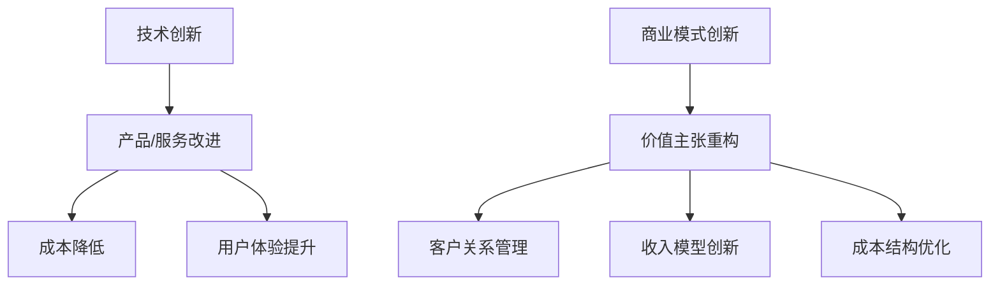

                 

关键词：技术创新、商业模式创新、结合、平衡、战略、案例研究、未来展望

摘要：本文探讨了技术创新与商业模式创新之间的结合与平衡，分析了两者在企业发展中的重要性，以及如何有效地实现两者的协同效应。通过实际案例研究和理论基础，本文提出了若干策略和方法，以帮助企业更好地整合技术创新和商业模式创新，实现持续增长和竞争优势。

## 1. 背景介绍

在当今全球化的竞争环境中，技术创新和商业模式创新已经成为企业获取竞争优势的重要手段。技术创新涉及产品、服务和生产流程的改进，旨在提高效率、降低成本、提升用户体验。而商业模式创新则侧重于商业模式的重新设计，包括收入模型、价值链、客户关系等，旨在创造新的价值主张和市场机会。

然而，在实践中，许多企业往往面临一个挑战：如何在技术创新和商业模式创新之间找到平衡点。过度依赖技术创新可能会导致商业模式的落后，而过分追求商业模式创新又可能忽视技术本身的进步。因此，如何有效地结合和平衡这两者的创新，是企业持续成功的关键。

## 2. 核心概念与联系

### 2.1 技术创新

技术创新通常指的是在产品、服务和生产流程中引入新技术或改进现有技术的过程。其核心目标是通过技术进步实现商业价值。技术创新可以体现在以下几个方面：

- **产品创新**：通过引入新技术或改进产品设计，提升产品功能、性能或用户体验。
- **服务创新**：通过创新服务模式或提升服务质量，满足客户新的需求。
- **流程创新**：通过改进生产或业务流程，提高效率、降低成本。

### 2.2 商业模式创新

商业模式创新涉及对现有商业模式的重新思考，旨在创造新的价值主张和市场机会。商业模式的核心要素包括：

- **价值主张**：企业为客户提供的产品或服务的独特价值。
- **客户关系**：企业与客户之间的互动方式和关系。
- **收入来源**：企业从客户那里获得收入的方式。
- **成本结构**：企业运营的成本构成。

### 2.3 Mermaid 流程图

以下是一个简化的 Mermaid 流程图，展示了技术创新与商业模式创新之间的联系：



## 3. 核心算法原理 & 具体操作步骤

### 3.1 算法原理概述

在整合技术创新与商业模式创新的过程中，以下算法原理和策略可以提供指导：

- **敏捷开发**：采用敏捷开发方法，快速迭代产品，及时调整商业模式。
- **价值网络分析**：通过分析企业内外部价值网络，识别创新机会。
- **商业模式画布**：使用商业模式画布工具，系统性地设计和管理商业模式。

### 3.2 算法步骤详解

#### 3.2.1 敏捷开发

1. **需求分析**：与客户和利益相关者合作，明确产品需求和目标。
2. **迭代开发**：按季度或月份进行迭代，每个迭代周期包含需求分析、设计、开发、测试和部署。
3. **反馈循环**：定期收集用户反馈，用于下一个迭代周期的改进。

#### 3.2.2 价值网络分析

1. **识别参与方**：列出与业务相关的所有利益相关者。
2. **价值链分析**：分析每个参与方的价值贡献和成本。
3. **机会识别**：识别潜在的商业模式创新机会。

#### 3.2.3 商模式画布

1. **价值主张定义**：明确产品或服务的价值主张。
2. **客户细分**：确定目标客户群体。
3. **渠道选择**：选择适合价值主张的推广渠道。
4. **客户关系管理**：制定客户获取和维系策略。
5. **收入模型设计**：设计合适的收入模式。
6. **成本结构分析**：优化成本结构。

### 3.3 算法优缺点

#### 优缺点

- **敏捷开发**：优点是快速响应市场需求，缺点是可能忽视长远规划和深度研究。
- **价值网络分析**：优点是全面了解企业内外部资源，缺点是需要大量时间和资源。
- **商业模式画布**：优点是系统性强，缺点是可能过于依赖工具而忽视实际操作。

### 3.4 算法应用领域

这些算法和策略可以应用于多个领域，包括但不限于：

- **高科技产业**：如人工智能、大数据、云计算等。
- **制造业**：如智能制造、供应链优化等。
- **服务业**：如金融科技、医疗保健、教育等。

## 4. 数学模型和公式 & 详细讲解 & 举例说明

### 4.1 数学模型构建

在技术创新和商业模式创新的结合过程中，以下数学模型和公式可以帮助我们分析和评估：

- **成本效益分析（CBA）**：用于评估项目的成本与预期效益之间的关系。
- **价值网络分析（VNA）**：用于识别企业在价值网络中的位置和机会。
- **马尔可夫决策过程（MDP）**：用于优化长期决策，特别是在不确定性环境中。

### 4.2 公式推导过程

#### 成本效益分析（CBA）

$$
\text{Net Present Value (NPV)} = \sum_{t=0}^{n} \frac{\text{Cash Flow at time t}}{(1 + \text{Discount Rate})^t}
$$

#### 价值网络分析（VNA）

$$
\text{Value Network} = \sum_{i=1}^{n} \text{Value of Relationship}_i + \sum_{j=1}^{m} \text{Value of Transaction}_j
$$

#### 马尔可夫决策过程（MDP）

$$
V^*(s) = \max_a \left[ \sum_{s'} p(s' | s, a) \cdot \mathbb{E}[\text{Reward}]_{s'} \right]
$$

### 4.3 案例分析与讲解

假设一家科技公司正在考虑引入一项新技术以提高产品性能。以下是一个简单的成本效益分析和价值网络分析的案例。

#### 成本效益分析

- **初始投资**：100 万美元
- **运营成本**：每年 20 万美元
- **预期收益**：每年 30 万美元
- **折现率**：10%

根据上述数据，我们可以计算 NPV：

$$
\text{NPV} = \sum_{t=0}^{5} \frac{\text{Cash Flow at time t}}{(1 + 0.1)^t} = \sum_{t=0}^{5} \frac{\text{30,000}}{(1.1)^t} - \text{100,000}
$$

#### 价值网络分析

- **客户关系价值**：通过新技术的引入，预计每年增加 10 万美元的收入。
- **交易价值**：预计每年通过新技术交易的成本降低 5 万美元。

根据上述数据，我们可以计算总价值：

$$
\text{Value Network} = 10,000 + 5,000 = 15,000
$$

通过以上分析，我们可以得出结论，这项新技术在财务上是有吸引力的，并且能够为企业创造额外的价值。

## 5. 项目实践：代码实例和详细解释说明

### 5.1 开发环境搭建

在实现一个结合技术创新和商业模式创新的案例中，我们选择使用 Python 编写一个简单的数据分析工具，以展示如何通过技术创新优化商业模式。

#### 开发环境：

- Python 3.8 或更高版本
- Jupyter Notebook
- Pandas 库
- NumPy 库

### 5.2 源代码详细实现

以下是一个简单的 Python 代码实例，用于读取、分析和可视化客户数据。

```python
import pandas as pd
import numpy as np
import matplotlib.pyplot as plt

# 5.2.1 读取数据
data = pd.read_csv('customer_data.csv')

# 5.2.2 数据预处理
data['Purchase Frequency'] = data.groupby('CustomerID')['TransactionID'].transform('count')
data['Average Purchase Amount'] = data['TransactionAmount'].mean()

# 5.2.3 数据分析
top_customers = data[data['Purchase Frequency'] > 5]
top_customers_summary = top_customers.groupby('CustomerID')['TransactionAmount'].sum().sort_values(ascending=False)

# 5.2.4 可视化
top_customers_summary.head(10).plot(kind='bar')
plt.xlabel('CustomerID')
plt.ylabel('Total Purchase Amount')
plt.title('Top Customers by Total Purchase Amount')
plt.show()
```

### 5.3 代码解读与分析

- **5.3.1 读取数据**：使用 Pandas 库读取 CSV 格式的客户数据。
- **5.3.2 数据预处理**：计算每个客户的购买频率和平均购买金额。
- **5.3.3 数据分析**：筛选出购买频率超过 5 次的顶级客户，并计算每个客户的总购买金额。
- **5.3.4 可视化**：使用 Matplotlib 库绘制柱状图，展示顶级客户的总购买金额。

通过以上代码，我们可以快速分析客户数据，识别顶级客户，并制定相应的客户关系管理策略。

### 5.4 运行结果展示

运行以上代码后，我们得到了一个柱状图，展示了购买频率最高的 10 个客户的总购买金额。这个结果可以帮助企业更好地了解其高价值客户，从而制定更有效的客户关系管理策略。

## 6. 实际应用场景

### 6.1 高科技产业

在高科技产业中，技术创新与商业模式创新的结合是推动企业发展的关键。例如，一家专注于人工智能的初创公司通过引入先进的机器学习算法，优化了其数据分析和预测模型。同时，公司重新设计了其商业模式，从传统的产品销售模式转向订阅服务模式，从而实现了收入的稳定增长和客户群体的扩大。

### 6.2 制造业

在制造业，技术创新和商业模式创新的结合可以帮助企业提高生产效率和降低成本。例如，一家制造自动化设备的公司通过引入物联网技术和大数据分析，实现了生产线的智能监控和优化。同时，公司推出了按需租赁服务，降低了客户的初始投资成本，从而增加了市场份额。

### 6.3 服务业

在服务业，技术创新和商业模式创新的结合可以提升客户体验并创造新的商业模式。例如，一家在线教育平台公司通过引入视频会议技术和人工智能算法，提供了更加灵活和个性化的学习体验。同时，公司推出了会员制服务，通过提供增值服务吸引了更多的付费用户，实现了商业模式的创新。

## 7. 工具和资源推荐

### 7.1 学习资源推荐

- 《创新与企业家精神》（作者：彼得·德鲁克）
- 《商业模式新生代》（作者：亚历山大·奥斯特瓦尔德、耶日·齐默尔曼、弗洛里安·辛格）
- 《精益创业》（作者：埃里克·莱斯）

### 7.2 开发工具推荐

- Jupyter Notebook：用于数据分析和可视化。
- GitHub：用于版本控制和协作开发。
- TensorFlow：用于机器学习和深度学习。

### 7.3 相关论文推荐

- "Value Networks: Creating Competitive Advantage Through Value Chain Analysis"（作者：迈克尔·波特）
- "The Business Model Innovation Factory"（作者：亚历山大·奥斯特瓦尔德、耶日·齐默尔曼、弗洛里安·辛格）
- "Agile Product Development"（作者：Kent Beck）

## 8. 总结：未来发展趋势与挑战

### 8.1 研究成果总结

本文通过理论分析和实际案例，探讨了技术创新与商业模式创新之间的结合与平衡。研究发现，敏捷开发、价值网络分析和商业模式画布等策略和方法有助于企业实现技术创新与商业模式创新的协同效应。

### 8.2 未来发展趋势

未来，技术创新与商业模式创新将继续融合，推动企业向更高效、更灵活的方向发展。人工智能、大数据和物联网等新兴技术将进一步加速这一过程。

### 8.3 面临的挑战

企业在整合技术创新与商业模式创新时面临的主要挑战包括：

- 技术创新与商业模式创新的平衡。
- 快速变化的市场环境和竞争压力。
- 人才和管理能力的提升。

### 8.4 研究展望

未来的研究可以进一步探讨如何更有效地整合技术创新与商业模式创新，以及如何利用新兴技术推动这一过程。此外，研究还可以关注不同行业和企业类型的最佳实践，以提供更具针对性的指导。

## 9. 附录：常见问题与解答

### 9.1 问题 1：技术创新和商业模式创新哪个更重要？

回答：技术创新和商业模式创新都是企业发展的重要驱动力。在特定情境下，技术创新可能更为关键，而在其他情境下，商业模式创新可能更为重要。关键是找到两者的平衡点。

### 9.2 问题 2：如何衡量技术创新和商业模式创新的成果？

回答：可以采用关键绩效指标（KPIs）来衡量。例如，技术创新的成果可以体现在产品性能的提升、生产效率的提高等方面；商业模式创新的成果可以体现在收入的增长、市场份额的增加等方面。

### 9.3 问题 3：中小企业如何整合技术创新和商业模式创新？

回答：中小企业可以通过以下策略整合技术创新和商业模式创新：

- **集中资源**：优先关注最有潜力的技术创新和商业模式创新项目。
- **敏捷开发**：快速迭代产品，及时调整商业模式。
- **合作伙伴关系**：与其他企业建立合作伙伴关系，共同推动技术创新和商业模式创新。

作者：禅与计算机程序设计艺术 / Zen and the Art of Computer Programming
--------------------------------------------------------------------

