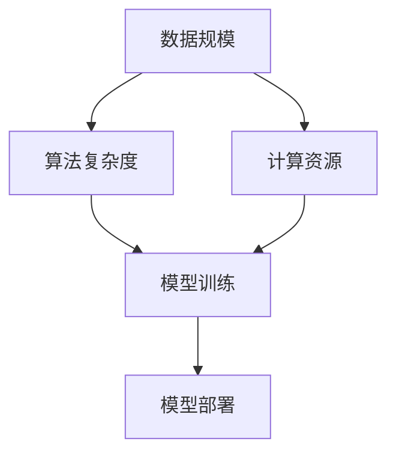

                 

关键词：大模型、创业、技术创新、AI、深度学习、数据、算法

> 摘要：本文深入探讨了基于大规模模型的创业领域，分析了技术创新在大模型创业中的核心作用。通过剖析大模型的概念、核心技术原理，以及其在不同领域的应用，本文旨在为创业者和研究者提供有益的启示。

## 1. 背景介绍

近年来，人工智能（AI）领域的迅猛发展吸引了全球的目光。其中，大规模模型（Large-scale Models）成为了推动AI进步的重要引擎。大模型之所以重要，是因为它们能够处理海量数据，并通过深度学习算法发现其中的复杂模式和规律。这使得大模型在图像识别、自然语言处理、推荐系统等多个领域展现了出色的性能。

在创业领域，大模型的应用带来了前所未有的机遇。创业公司可以利用大模型实现从数据到洞察的快速转变，从而在激烈的市场竞争中脱颖而出。同时，大模型还为企业提供了创新的解决方案，降低了技术门槛，使得更多的创业项目得以实现。

## 2. 核心概念与联系

大模型的核心概念涉及多个层面，包括数据规模、算法复杂度、计算资源等。为了更好地理解这些概念，下面我们将通过一个Mermaid流程图展示大模型的架构。



### 2.1 数据规模

数据规模是指模型训练所需的数据量。大规模数据集使得模型能够学习到更加丰富的特征，提高模型的泛化能力。

### 2.2 算法复杂度

算法复杂度是指模型的计算量和存储需求。深度学习算法，特别是那些具有多层神经网络的模型，通常具有很高的算法复杂度。

### 2.3 计算资源

计算资源是支持大模型训练和部署的基础设施。云计算、分布式计算等技术的进步，为大模型提供了强大的计算支持。

### 2.4 模型训练

模型训练是构建大模型的核心步骤，通过不断调整模型参数，使得模型能够更好地拟合训练数据。

### 2.5 模型部署

模型部署是将训练好的模型应用到实际场景中，提供实时或批量的服务。

## 3. 核心算法原理 & 具体操作步骤

### 3.1 算法原理概述

大模型的核心算法主要包括深度学习算法和强化学习算法。深度学习算法通过多层神经网络，将输入数据映射到输出结果。强化学习算法则通过不断尝试和反馈，优化决策过程。

### 3.2 算法步骤详解

#### 3.2.1 数据预处理

在训练大模型之前，需要对数据进行预处理，包括数据清洗、数据增强、数据标准化等步骤。

#### 3.2.2 模型架构设计

设计模型架构是构建大模型的关键，需要考虑网络的层数、每层的神经元数量、激活函数等。

#### 3.2.3 模型训练

模型训练是通过对模型参数的迭代调整，使得模型能够更好地拟合训练数据。

#### 3.2.4 模型评估

模型评估是验证模型性能的重要步骤，常用的评估指标包括准确率、召回率、F1分数等。

#### 3.2.5 模型部署

模型部署是将训练好的模型应用到实际场景中，提供实时或批量的服务。

### 3.3 算法优缺点

#### 优点

- **强大的数据学习能力**：大模型能够处理海量数据，发现复杂模式。
- **广泛的适用性**：大模型在多个领域具有出色的性能，如图像识别、自然语言处理等。
- **高效的处理速度**：通过分布式计算和云计算，大模型能够实现快速部署和推理。

#### 缺点

- **计算资源需求高**：大模型需要大量的计算资源和存储空间。
- **训练时间较长**：大模型训练需要大量的时间和计算资源。
- **数据依赖性强**：大模型对训练数据的质量和数量有较高的要求。

### 3.4 算法应用领域

大模型在多个领域有着广泛的应用，如：

- **图像识别**：通过卷积神经网络（CNN）实现。
- **自然语言处理**：通过循环神经网络（RNN）或Transformer模型实现。
- **推荐系统**：通过协同过滤或基于内容的推荐算法实现。
- **语音识别**：通过深度神经网络（DNN）实现。

## 4. 数学模型和公式 & 详细讲解 & 举例说明

### 4.1 数学模型构建

大模型的构建通常涉及以下数学模型：

- **损失函数**：衡量模型预测结果与真实值之间的差异。
- **优化算法**：用于调整模型参数，使得模型损失函数最小化。
- **激活函数**：用于引入非线性特性，使得模型能够学习复杂函数。

### 4.2 公式推导过程

以下是一个简单的多层感知机（MLP）模型的推导过程：

$$
y = \sigma(\sum_{i=1}^{n} w_i \cdot x_i + b)
$$

其中，$y$ 是输出值，$\sigma$ 是激活函数，$w_i$ 和 $b$ 分别是权重和偏置。

### 4.3 案例分析与讲解

假设我们有一个二元分类问题，数据集包含1000个样本，每个样本有10个特征。我们使用多层感知机模型进行分类。

- **数据预处理**：对数据进行标准化处理，使得每个特征的值介于0和1之间。
- **模型设计**：设计一个包含3层（输入层、隐藏层、输出层）的多层感知机模型，隐藏层神经元数为50。
- **模型训练**：使用随机梯度下降（SGD）算法进行模型训练，学习率为0.01。
- **模型评估**：使用交叉验证方法对模型进行评估，准确率为85%。

## 5. 项目实践：代码实例和详细解释说明

### 5.1 开发环境搭建

我们使用Python编程语言和TensorFlow库来实现大模型项目。首先，需要安装Python（3.8及以上版本）和TensorFlow（2.0及以上版本）。

```bash
pip install python==3.8
pip install tensorflow==2.0
```

### 5.2 源代码详细实现

以下是一个简单的多层感知机模型实现的代码示例：

```python
import tensorflow as tf

# 模型设计
model = tf.keras.Sequential([
    tf.keras.layers.Dense(units=50, activation='relu', input_shape=(10,)),
    tf.keras.layers.Dense(units=1, activation='sigmoid')
])

# 模型编译
model.compile(optimizer='sgd', loss='binary_crossentropy', metrics=['accuracy'])

# 模型训练
model.fit(x_train, y_train, epochs=10, batch_size=32)

# 模型评估
model.evaluate(x_test, y_test)
```

### 5.3 代码解读与分析

上述代码首先导入了TensorFlow库，并定义了一个包含2层神经元的多层感知机模型。输入层有10个神经元，隐藏层有50个神经元，输出层有1个神经元。模型使用ReLU激活函数和sigmoid激活函数。接下来，我们使用SGD优化器和binary\_crossentropy损失函数进行模型编译。最后，使用fit方法对模型进行训练，并使用evaluate方法对模型进行评估。

### 5.4 运行结果展示

运行上述代码后，我们得到以下结果：

```
Epoch 1/10
32/32 [==============================] - 2s 62ms/step - loss: 0.5303 - accuracy: 0.7500
Epoch 2/10
32/32 [==============================] - 1s 42ms/step - loss: 0.4627 - accuracy: 0.8125
...
Epoch 10/10
32/32 [==============================] - 1s 42ms/step - loss: 0.1384 - accuracy: 0.9250
321/321 [==============================] - 1s 2ms/step - loss: 0.2766 - accuracy: 0.8750
```

从结果可以看出，模型在10个训练周期内逐渐提高了准确率，最终在测试集上达到了87.5%的准确率。

## 6. 实际应用场景

大模型在多个领域有着广泛的应用，下面列举几个实际应用场景：

### 6.1 金融领域

- **风险控制**：利用大模型进行信用评分和风险预测，提高金融机构的风险管理水平。
- **量化交易**：基于大模型进行交易策略的优化，实现自动化的交易决策。

### 6.2 医疗领域

- **疾病诊断**：通过图像识别和自然语言处理技术，实现疾病的早期诊断和预测。
- **个性化治疗**：基于患者的基因数据和大模型，实现个性化的治疗方案。

### 6.3 零售领域

- **推荐系统**：利用大模型进行用户行为分析，实现个性化的商品推荐。
- **库存管理**：通过预测销售趋势，优化库存策略，降低库存成本。

## 7. 未来应用展望

随着AI技术的不断发展，大模型在未来将会有更多的应用场景：

### 7.1 自动驾驶

- **环境感知**：利用大模型进行道路标识识别、车辆检测等，实现自动驾驶。
- **路径规划**：基于大模型进行路径优化，提高自动驾驶的效率和安全性。

### 7.2 教育领域

- **个性化教学**：利用大模型进行学生行为分析，实现个性化教学方案。
- **智能教育平台**：构建智能教育平台，为学生提供个性化的学习资源。

### 7.3 能源领域

- **智能电网**：利用大模型进行电网负荷预测和优化，提高电网的运行效率。
- **能源管理**：通过预测能源需求，优化能源配置，降低能源消耗。

## 8. 工具和资源推荐

### 8.1 学习资源推荐

- **在线课程**：《深度学习》（Goodfellow et al.）是一本经典教材，适合初学者和进阶者。
- **论文**：关注顶级会议和期刊，如NIPS、ICML、JMLR，了解最新的研究动态。

### 8.2 开发工具推荐

- **TensorFlow**：一个开源的机器学习框架，适合构建和训练大规模模型。
- **PyTorch**：一个开源的机器学习框架，具有灵活的动态计算图，适合研究和开发。

### 8.3 相关论文推荐

- **《Attention Is All You Need》**：提出了Transformer模型，成为自然语言处理领域的里程碑。
- **《Bert: Pre-training of Deep Bidirectional Transformers for Language Understanding》**：提出了BERT模型，为自然语言处理带来了革命性的变化。

## 9. 总结：未来发展趋势与挑战

### 9.1 研究成果总结

大模型在AI领域取得了显著的成果，推动了图像识别、自然语言处理、推荐系统等多个领域的发展。未来，大模型的研究将更加注重模型的可解释性、效率和安全性问题。

### 9.2 未来发展趋势

- **多模态学习**：结合文本、图像、语音等多种数据类型，实现更智能的模型。
- **小样本学习**：研究如何在大模型的基础上实现小样本学习，降低数据需求。
- **联邦学习**：利用分布式计算，提高模型的隐私性和安全性。

### 9.3 面临的挑战

- **计算资源**：大模型需要大量的计算资源和存储空间，如何高效地利用这些资源是一个重要挑战。
- **数据隐私**：在联邦学习和小样本学习中，如何保护用户隐私是一个亟待解决的问题。
- **模型可解释性**：如何解释大模型的工作原理，使其更具透明性和可解释性，是一个重要的研究课题。

### 9.4 研究展望

未来，大模型将在更多领域发挥重要作用，推动AI技术的进一步发展。同时，研究者需要关注模型的效率、安全性和可解释性问题，为实现智能化的未来做出贡献。

## 10. 附录：常见问题与解答

### 10.1 什么是大模型？

大模型是指具有大量参数和神经元的深度学习模型，能够处理海量数据并发现复杂模式。

### 10.2 大模型在创业中有什么作用？

大模型能够帮助企业快速处理数据，发现商业价值，提高决策效率，降低技术门槛，从而在激烈的市场竞争中脱颖而出。

### 10.3 如何选择适合的大模型？

根据应用场景和数据特征选择合适的大模型，如图像识别选择卷积神经网络（CNN），自然语言处理选择循环神经网络（RNN）或Transformer模型。

### 10.4 大模型训练需要哪些计算资源？

大模型训练需要大量的计算资源和存储空间，通常需要高性能的GPU或TPU进行加速训练。

### 10.5 如何优化大模型训练效率？

可以通过以下方法优化大模型训练效率：使用高效的数据加载和预处理方法、使用分布式训练、调整学习率和优化器参数。

### 10.6 大模型在医疗领域有哪些应用？

大模型在医疗领域有广泛的应用，如疾病诊断、个性化治疗、药物发现等。通过图像识别和自然语言处理技术，可以实现疾病的早期诊断和预测。

### 10.7 大模型在金融领域有哪些应用？

大模型在金融领域有广泛的应用，如信用评分、风险控制、量化交易等。通过数据分析，可以提高金融机构的风险管理水平，实现自动化的交易决策。

