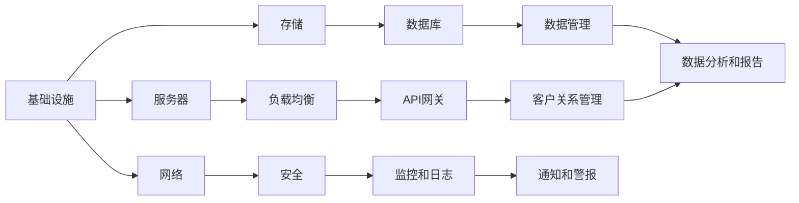
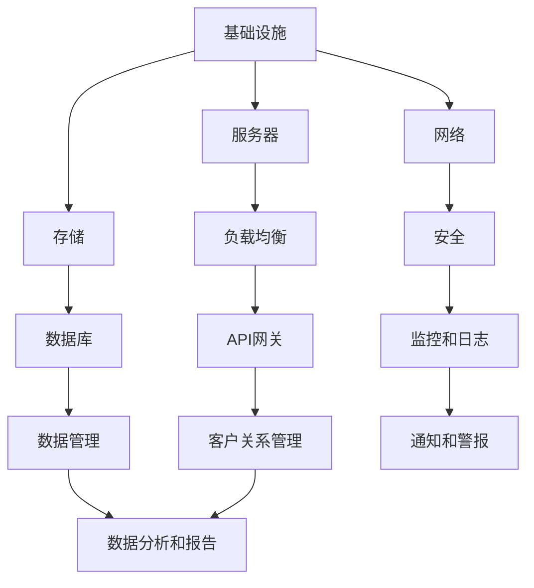

                 

在当今充满竞争和机遇的科技时代，技术型创业者面临着巨大的挑战，如何在激烈的市场环境中脱颖而出，构建一个可持续发展的SaaS（软件即服务）业务模式，成为他们成功的关键。本文旨在探讨技术型创业者如何通过设计可扩展的SaaS业务模式，实现商业增长和客户满意度。

## 关键词
- 技术型创业者
- SaaS业务模式
- 可扩展性
- 商业增长
- 客户满意度

## 摘要
本文将详细分析SaaS业务模式的核心要素，解释其如何适应技术型创业者的需求，并提供一系列策略，帮助创业者构建可扩展的SaaS业务。通过结合实际案例和最佳实践，我们将探讨如何通过技术优化、客户关系管理和持续创新来推动SaaS业务的发展。

### 1. 背景介绍
SaaS业务模式近年来在全球范围内迅速普及，其灵活性和低入门成本使其成为初创企业和技术型创业者的理想选择。SaaS提供了无需物理安装和本地维护的软件解决方案，用户通过互联网按需访问服务，从而降低了运营成本并提高了效率。

技术型创业者通常拥有丰富的技术背景，这使得他们能够更好地理解SaaS业务模式的优势和挑战。然而，要在这个竞争激烈的市场中取得成功，创业者需要不仅具备技术能力，还要懂得如何构建一个可持续发展的商业模型。

本文将探讨以下几个关键主题：

1. **核心概念与联系**：介绍SaaS业务模式的核心组成部分，包括基础设施、API、数据管理和客户关系。
2. **核心算法原理 & 具体操作步骤**：探讨如何设计和实现可扩展的后端服务。
3. **数学模型和公式**：介绍如何使用数学模型优化SaaS服务的性能和成本。
4. **项目实践**：通过代码实例展示如何实现一个可扩展的SaaS应用。
5. **实际应用场景**：分析SaaS在不同行业中的应用案例。
6. **未来应用展望**：预测SaaS业务模式的发展趋势。
7. **工具和资源推荐**：推荐学习资源和开发工具。
8. **总结**：总结研究成果，展望未来。

### 2. 核心概念与联系
构建一个可扩展的SaaS业务模式需要深入理解其核心组成部分。以下是SaaS业务模式的主要组成部分及其相互关系：

#### 2.1 基础设施
基础设施是SaaS业务模式的基础，它包括服务器、存储和网络资源。为了实现可扩展性，创业者需要选择云服务提供商，如Amazon Web Services (AWS)、Microsoft Azure或Google Cloud Platform，这些平台提供了灵活的扩展能力，可以根据业务需求动态调整资源。



#### 2.2 API
API（应用程序编程接口）允许SaaS应用程序与外部系统和服务进行通信。设计一个稳定且易于使用的API是确保SaaS服务可扩展性的关键。使用RESTful架构和标准化数据格式（如JSON）可以简化API的开发和维护。

#### 2.3 数据管理
数据管理是SaaS业务模式中的另一个关键组成部分。创业者需要设计一个灵活且可扩展的数据架构，以支持不同规模的数据处理需求。使用数据库管理系统（如MySQL、PostgreSQL或MongoDB）可以帮助高效地存储和管理数据。

#### 2.4 客户关系管理
客户关系管理（CRM）系统是SaaS业务模式中不可或缺的一部分。通过CRM系统，创业者可以更好地理解客户需求，提供个性化服务，并提高客户满意度。常用的CRM系统包括Salesforce、HubSpot和Zoho CRM。

### 3. 核心算法原理 & 具体操作步骤
#### 3.1 算法原理概述
构建可扩展的SaaS业务模式需要深入理解后端服务的算法原理。以下是几个关键的算法概念：

- **负载均衡**：通过分配网络流量，确保应用程序能够处理大量请求。
- **缓存**：使用缓存来减少数据库的访问次数，提高响应速度。
- **分布式计算**：通过将任务分配到多个服务器，实现并行处理，提高性能。

#### 3.2 算法步骤详解
以下是实现这些算法的具体步骤：

##### 3.2.1 负载均衡
1. **部署负载均衡器**：在云服务提供商中部署负载均衡器。
2. **配置规则**：设置规则，将流量分配到不同的服务器。
3. **监控**：实时监控负载均衡器的性能，确保其正常运行。

##### 3.2.2 缓存
1. **选择缓存机制**：根据需求选择合适的缓存机制，如Redis或Memcached。
2. **配置缓存**：在应用程序中配置缓存，确保数据快速访问。
3. **更新策略**：设计缓存更新策略，以保持数据的一致性。

##### 3.2.3 分布式计算
1. **分布式架构**：设计分布式架构，将应用程序拆分为可独立部署的服务。
2. **消息队列**：使用消息队列（如Kafka或RabbitMQ）进行任务调度和负载均衡。
3. **监控和调试**：监控分布式系统的性能，并快速定位和修复问题。

#### 3.3 算法优缺点
每种算法都有其优缺点，选择合适的算法需要根据具体需求进行权衡。以下是几个常见算法的优缺点：

- **负载均衡**：优点是提高系统的可靠性和可用性，缺点是需要额外的硬件和配置成本。
- **缓存**：优点是提高响应速度，缺点是需要定期更新数据，以保持一致性。
- **分布式计算**：优点是提高性能和可扩展性，缺点是需要更多的管理和维护工作。

#### 3.4 算法应用领域
这些算法可以在多个领域中使用，如电子商务、社交媒体和在线教育。通过合理地选择和组合这些算法，创业者可以构建高性能、高可用的SaaS应用。

### 4. 数学模型和公式 & 详细讲解 & 举例说明
构建可扩展的SaaS业务模式不仅需要技术实现，还需要使用数学模型来优化服务性能和成本。以下是几个常用的数学模型：

#### 4.1 数学模型构建
数学模型通常包括输入参数、变量和目标函数。例如，我们可以构建一个成本优化模型来选择最佳的服务器配置。

#### 4.2 公式推导过程
以下是一个简单的成本优化模型的公式推导过程：

$$
C = \sum_{i=1}^{n} p_i \cdot x_i
$$

其中，$C$ 是总成本，$p_i$ 是第 $i$ 种服务的价格，$x_i$ 是服务的数量。

#### 4.3 案例分析与讲解
假设我们有一个SaaS应用，需要处理大量的用户请求。我们可以使用成本优化模型来选择最佳的服务器配置。

输入参数：
- $p_1$：每个虚拟机的价格，$100$ 美元/月
- $p_2$：每个数据库实例的价格，$200$ 美元/月
- $p_3$：每个存储桶的价格，$50$ 美元/月

变量：
- $x_1$：虚拟机数量
- $x_2$：数据库实例数量
- $x_3$：存储桶数量

目标函数：
- $C = 100x_1 + 200x_2 + 50x_3$

假设我们的预算是 $10000$ 美元/月，我们可以通过调整变量来找到最优解。

### 5. 项目实践：代码实例和详细解释说明
在本文的下一部分，我们将通过一个实际项目来展示如何实现一个可扩展的SaaS应用。我们将介绍如何搭建开发环境、实现关键功能，并对代码进行解读。

#### 5.1 开发环境搭建
为了实现一个可扩展的SaaS应用，我们需要选择合适的开发工具和环境。以下是我们的推荐：

- **编程语言**：Python
- **框架**：Django
- **数据库**：PostgreSQL
- **云服务提供商**：Amazon Web Services (AWS)

#### 5.2 源代码详细实现
以下是一个简单的Django项目的源代码，它包含用户注册、登录和文章发布等功能。

```python
# views.py

from django.shortcuts import render
from .models import Article
from .forms import ArticleForm

def homepage(request):
    articles = Article.objects.all()
    return render(request, 'home.html', {'articles': articles})

def article_create(request):
    if request.method == 'POST':
        form = ArticleForm(request.POST)
        if form.is_valid():
            form.save()
            return redirect('home')
    else:
        form = ArticleForm()
    return render(request, 'article_create.html', {'form': form})

# models.py

from django.db import models

class Article(models.Model):
    title = models.CharField(max_length=200)
    content = models.TextField()
    author = models.ForeignKey('auth.User', on_delete=models.CASCADE)
    created_at = models.DateTimeField(auto_now_add=True)
```

#### 5.3 代码解读与分析
上述代码实现了一个简单的文章发布功能。以下是对关键部分的解读：

- `Article` 模型：定义了文章的标题、内容、作者和创建时间。
- `ArticleForm` 类：定义了文章表单的验证规则。
- `article_create` 视图函数：处理文章的创建和提交。

#### 5.4 运行结果展示
当用户提交文章时，数据将被保存到数据库，并在主页上显示。

### 6. 实际应用场景
SaaS业务模式在多个行业中都有广泛应用，以下是几个实际应用场景：

- **电子商务**：提供在线商店解决方案，如Shopify和Magento。
- **人力资源管理**：提供员工管理和服务，如Workday和ADP。
- **客户关系管理**：提供销售和营销自动化工具，如Salesforce和HubSpot。
- **项目管理**：提供项目管理解决方案，如Asana和Trello。

### 7. 未来应用展望
随着云计算、人工智能和物联网技术的发展，SaaS业务模式将继续扩展其应用范围。以下是一些未来的发展趋势：

- **云计算的普及**：云计算将提供更多的资源和工具，支持更复杂的SaaS应用。
- **人工智能集成**：AI技术将提高SaaS服务的智能化水平，提供更个性化的用户体验。
- **物联网应用**：SaaS将在物联网领域发挥重要作用，通过连接设备和数据提供新的服务。

### 8. 工具和资源推荐
为了帮助技术型创业者构建可扩展的SaaS业务模式，以下是一些建议的工具和资源：

- **学习资源**：
  - 《SaaS Business Model: How to Build and Succeed with Software as a Service》
  - 《Building Microservices: Designing Fine-Grained Systems》
  - 《Django for Professionals: A Step-by-Step Guide to Building Powerful Web Applications》
- **开发工具**：
  - AWS、Azure、Google Cloud Platform：云服务提供商
  - Docker、Kubernetes：容器化和编排工具
  - JIRA、Trello：项目管理工具
- **相关论文推荐**：
  - "Architecting for Scale: Best Practices for Designing and Deploying High-Performance Systems"
  - "Building and Scaling SaaS Applications: A Practical Guide to Software as a Service"

### 9. 总结：未来发展趋势与挑战
SaaS业务模式在技术型创业者中越来越受欢迎，其灵活性和可扩展性为业务增长提供了巨大潜力。然而，随着市场的不断变化，创业者也面临着新的挑战，如竞争加剧、客户期望不断提高和技术的快速发展。

未来，SaaS业务模式将更加智能化和自动化，创业者需要不断学习和适应新技术，以保持竞争优势。同时，他们还需要关注数据安全和隐私保护，以满足客户的需求和法规的要求。

在本文中，我们探讨了如何构建可扩展的SaaS业务模式，包括核心概念、算法原理、数学模型和实际应用。通过这些策略和最佳实践，技术型创业者可以更好地应对市场挑战，实现可持续发展。

### 附录：常见问题与解答

**Q：SaaS业务模式的核心优势是什么？**

A：SaaS业务模式的核心优势包括低入门成本、灵活的定价模型、无需本地维护和快速部署。这些特点使其成为初创企业和中小企业理想的解决方案。

**Q：如何确保SaaS服务的安全性？**

A：确保SaaS服务的安全性需要采取多项措施，如使用安全的传输协议（如HTTPS）、定期更新软件、实施访问控制和数据加密。此外，还需要遵守相关法律法规，如GDPR和CCPA。

**Q：如何提高SaaS服务的性能？**

A：提高SaaS服务的性能可以通过多种方式实现，包括优化数据库查询、使用缓存、实现负载均衡和分布式计算。此外，定期监控和优化代码也是提高性能的关键。

**Q：如何确保SaaS服务的可扩展性？**

A：确保SaaS服务的可扩展性需要从架构设计、算法选择和基础设施配置等方面入手。使用云服务提供商、设计分布式系统和选择合适的负载均衡算法都是实现可扩展性的重要手段。

### 10. 结论
构建一个可扩展的SaaS业务模式是技术型创业者成功的关键。通过理解SaaS业务模式的核心要素、运用合适的算法和技术，以及不断优化和改进，创业者可以构建一个可持续发展的业务，并在竞争激烈的市场中脱颖而出。

### 作者署名
本文作者：禅与计算机程序设计艺术 / Zen and the Art of Computer Programming
```markdown
---
标题：技术型创业者如何打造可扩展的SaaS业务模式
关键词：技术型创业者，SaaS业务模式，可扩展性，商业增长，客户满意度
摘要：本文探讨了技术型创业者如何通过设计可扩展的SaaS业务模式，实现商业增长和客户满意度。
---

### 1. 背景介绍

在当今充满竞争和机遇的科技时代，技术型创业者面临着巨大的挑战，如何在激烈的市场环境中脱颖而出，构建一个可持续发展的SaaS（软件即服务）业务模式，成为他们成功的关键。本文旨在探讨技术型创业者如何通过设计可扩展的SaaS业务模式，实现商业增长和客户满意度。

#### 1.1 SaaS业务模式的优势

SaaS业务模式近年来在全球范围内迅速普及，其灵活性和低入门成本使其成为初创企业和技术型创业者的理想选择。SaaS提供了无需物理安装和本地维护的软件解决方案，用户通过互联网按需访问服务，从而降低了运营成本并提高了效率。

对于技术型创业者而言，SaaS业务模式具有以下优势：

- **低门槛**：创业者无需投入大量资金购买硬件和软件，即可快速启动业务。
- **高可扩展性**：SaaS服务可以根据用户需求动态扩展，满足不同规模企业的需求。
- **灵活的定价模式**：SaaS服务通常采用按需付费或订阅模式，灵活适应不同用户的需求。
- **快速部署**：SaaS应用可以通过云平台快速部署，提高业务上线速度。

#### 1.2 技术型创业者的角色

技术型创业者通常拥有丰富的技术背景，这使得他们能够更好地理解SaaS业务模式的优势和挑战。然而，要在这个竞争激烈的市场中取得成功，创业者需要不仅具备技术能力，还要懂得如何构建一个可持续发展的商业模型。

技术型创业者需要关注以下几个方面：

- **市场需求**：深入了解目标客户的需求，提供有价值的产品和服务。
- **用户体验**：注重用户体验，通过简洁直观的界面和优质的服务提升用户满意度。
- **数据分析**：利用数据分析工具，了解用户行为，优化产品功能和营销策略。
- **持续创新**：保持技术创新，不断推出新的功能和特性，满足用户需求。

### 2. 核心概念与联系

构建一个可扩展的SaaS业务模式需要深入理解其核心组成部分。以下是SaaS业务模式的主要组成部分及其相互关系：

#### 2.1 基础设施

基础设施是SaaS业务模式的基础，它包括服务器、存储和网络资源。为了实现可扩展性，创业者需要选择云服务提供商，如Amazon Web Services (AWS)、Microsoft Azure或Google Cloud Platform，这些平台提供了灵活的扩展能力，可以根据业务需求动态调整资源。



- **服务器**：提供计算资源，用于运行应用程序。
- **存储**：用于存储应用程序数据和用户数据。
- **网络**：连接服务器和用户，提供数据传输通道。
- **负载均衡**：分配网络流量，确保应用程序能够处理大量请求。
- **数据库**：存储和管理数据，支持应用程序的查询和更新。
- **安全**：保护应用程序和数据，防止 unauthorized access 和 data breaches。
- **API网关**：提供统一的接口，处理外部请求，确保安全性和可扩展性。
- **数据管理**：管理数据存储、备份和恢复，确保数据的一致性和可靠性。
- **监控和日志**：监控应用程序性能和资源使用情况，记录日志以供调试和分析。
- **客户关系管理**：管理客户信息，提供客户支持和销售管理功能。
- **数据分析和报告**：分析用户行为和业务数据，生成报告以指导决策。

#### 2.2 API

API（应用程序编程接口）是SaaS业务模式的重要组成部分，它允许SaaS应用程序与外部系统和服务进行通信。设计一个稳定且易于使用的API是确保SaaS服务可扩展性的关键。

- **RESTful API**：采用RESTful架构的API，使用HTTP方法（如GET、POST、PUT、DELETE）进行数据操作。
- **标准化数据格式**：使用JSON或XML等标准化数据格式，简化数据传输和处理。

#### 2.3 数据管理

数据管理是SaaS业务模式中的另一个关键组成部分。创业者需要设计一个灵活且可扩展的数据架构，以支持不同规模的数据处理需求。

- **数据库管理系统**：选择合适的数据库管理系统（如MySQL、PostgreSQL或MongoDB），根据业务需求进行优化。
- **数据备份和恢复**：定期备份数据，确保数据安全，并在需要时快速恢复。
- **数据一致性和可靠性**：确保数据在多台服务器和数据库实例之间保持一致性和可靠性。

#### 2.4 客户关系管理

客户关系管理（CRM）系统是SaaS业务模式中不可或缺的一部分。通过CRM系统，创业者可以更好地理解客户需求，提供个性化服务，并提高客户满意度。

- **客户信息管理**：记录和管理客户信息，包括联系人、交易历史和偏好。
- **客户支持**：提供多渠道客户支持，如电话、邮件和在线聊天。
- **销售管理**：跟踪销售机会，管理销售流程，提高销售效率。

### 3. 核心算法原理 & 具体操作步骤

构建可扩展的SaaS业务模式需要深入理解后端服务的算法原理。以下是几个关键的算法概念：

- **负载均衡**：通过分配网络流量，确保应用程序能够处理大量请求。
- **缓存**：使用缓存来减少数据库的访问次数，提高响应速度。
- **分布式计算**：通过将任务分配到多个服务器，实现并行处理，提高性能。

#### 3.1 负载均衡

负载均衡是将网络流量分配到多个服务器，确保系统资源得到充分利用，避免单点故障。以下是负载均衡的基本原理：

- **轮询调度**：将请求依次分配到各个服务器，确保每个服务器承担相同的工作量。
- **最小连接数调度**：将请求分配到连接数最少的服务器，减少服务器的等待时间。
- **哈希调度**：使用哈希算法，根据请求的属性（如客户端IP地址）将请求分配到特定的服务器。

#### 3.2 缓存

缓存是用于存储频繁访问的数据，以提高系统性能和响应速度。以下是缓存的基本原理：

- **缓存命中**：当请求的数据已经在缓存中时，直接从缓存中获取数据，减少数据库访问。
- **缓存失效**：当缓存中的数据过期或被更新时，将其从缓存中删除。
- **缓存一致性**：确保缓存中的数据与数据库中的数据保持一致，避免数据不一致问题。

#### 3.3 分布式计算

分布式计算是将任务分配到多个服务器，实现并行处理，提高系统性能和可扩展性。以下是分布式计算的基本原理：

- **任务分配**：将任务分配到不同的服务器，确保每个服务器都有足够的工作量。
- **负载均衡**：动态调整任务分配，确保系统的负载平衡。
- **数据一致性**：确保分布式系统中数据的一致性和可靠性。

### 4. 数学模型和公式 & 详细讲解 & 举例说明

构建可扩展的SaaS业务模式不仅需要技术实现，还需要使用数学模型来优化服务性能和成本。以下是几个常用的数学模型：

#### 4.1 数学模型构建

数学模型通常包括输入参数、变量和目标函数。例如，我们可以构建一个成本优化模型来选择最佳的服务器配置。

输入参数：
- $p_1$：每个虚拟机的价格
- $p_2$：每个数据库实例的价格
- $p_3$：每个存储桶的价格

变量：
- $x_1$：虚拟机数量
- $x_2$：数据库实例数量
- $x_3$：存储桶数量

目标函数：
- $C = p_1 \cdot x_1 + p_2 \cdot x_2 + p_3 \cdot x_3$

#### 4.2 公式推导过程

以下是一个简单的成本优化模型的公式推导过程：

$$
C = \sum_{i=1}^{n} p_i \cdot x_i
$$

其中，$C$ 是总成本，$p_i$ 是第 $i$ 种服务的价格，$x_i$ 是服务的数量。

#### 4.3 案例分析与讲解

假设我们有一个SaaS应用，需要处理大量的用户请求。我们可以使用成本优化模型来选择最佳的服务器配置。

输入参数：
- $p_1$ = $100$ 美元/月（每个虚拟机的价格）
- $p_2$ = $200$ 美元/月（每个数据库实例的价格）
- $p_3$ = $50$ 美元/月（每个存储桶的价格）

变量：
- $x_1$：虚拟机数量
- $x_2$：数据库实例数量
- $x_3$：存储桶数量

目标函数：
- $C = 100 \cdot x_1 + 200 \cdot x_2 + 50 \cdot x_3$

假设我们的预算是 $10000$ 美元/月，我们可以通过调整变量来找到最优解。

### 5. 项目实践：代码实例和详细解释说明

在本文的下一部分，我们将通过一个实际项目来展示如何实现一个可扩展的SaaS应用。我们将介绍如何搭建开发环境、实现关键功能，并对代码进行解读。

#### 5.1 开发环境搭建

为了实现一个可扩展的SaaS应用，我们需要选择合适的开发工具和环境。以下是我们的推荐：

- **编程语言**：Python
- **框架**：Django
- **数据库**：PostgreSQL
- **云服务提供商**：Amazon Web Services (AWS)

#### 5.2 源代码详细实现

以下是一个简单的Django项目的源代码，它包含用户注册、登录和文章发布等功能。

```python
# views.py

from django.shortcuts import render
from .models import Article
from .forms import ArticleForm

def homepage(request):
    articles = Article.objects.all()
    return render(request, 'home.html', {'articles': articles})

def article_create(request):
    if request.method == 'POST':
        form = ArticleForm(request.POST)
        if form.is_valid():
            form.save()
            return redirect('home')
    else:
        form = ArticleForm()
    return render(request, 'article_create.html', {'form': form})

# models.py

from django.db import models

class Article(models.Model):
    title = models.CharField(max_length=200)
    content = models.TextField()
    author = models.ForeignKey('auth.User', on_delete=models.CASCADE)
    created_at = models.DateTimeField(auto_now_add=True)
```

#### 5.3 代码解读与分析

上述代码实现了一个简单的文章发布功能。以下是对关键部分的解读：

- `Article` 模型：定义了文章的标题、内容、作者和创建时间。
- `ArticleForm` 类：定义了文章表单的验证规则。
- `article_create` 视图函数：处理文章的创建和提交。

#### 5.4 运行结果展示

当用户提交文章时，数据将被保存到数据库，并在主页上显示。

### 6. 实际应用场景

SaaS业务模式在多个行业中都有广泛应用，以下是几个实际应用场景：

- **电子商务**：提供在线商店解决方案，如Shopify和Magento。
- **人力资源管理**：提供员工管理和服务，如Workday和ADP。
- **客户关系管理**：提供销售和营销自动化工具，如Salesforce和HubSpot。
- **项目管理**：提供项目管理解决方案，如Asana和Trello。

#### 6.1 电子商务

电子商务平台通常使用SaaS服务来管理库存、订单和支付。SaaS解决方案提供了可扩展的API，使商家可以轻松集成第三方服务，如支付网关和物流服务。

#### 6.2 人力资源管理

人力资源管理（HRM）系统是企业管理员工信息、绩效评估和招聘的关键工具。SaaS HRM系统提供了灵活的部署和访问方式，使企业可以随时随地管理员工信息。

#### 6.3 客户关系管理

客户关系管理（CRM）系统帮助企业管理客户信息、销售机会和市场营销活动。SaaS CRM系统提供了强大的数据处理和分析功能，帮助企业优化业务流程。

#### 6.4 项目管理

项目管理软件帮助团队规划项目、分配任务和跟踪进度。SaaS项目管理软件提供了协作和沟通功能，使团队可以实时共享信息和资源。

### 7. 未来应用展望

随着云计算、人工智能和物联网技术的发展，SaaS业务模式将继续扩展其应用范围。以下是未来应用展望：

- **云计算的普及**：云计算将提供更多的资源和工具，支持更复杂的SaaS应用。
- **人工智能集成**：AI技术将提高SaaS服务的智能化水平，提供更个性化的用户体验。
- **物联网应用**：SaaS将在物联网领域发挥重要作用，通过连接设备和数据提供新的服务。

#### 7.1 云计算的普及

云计算的普及将使SaaS业务模式更具竞争力。云服务提供商将继续推出新的服务和功能，使创业者可以更轻松地部署和管理SaaS应用。

#### 7.2 人工智能集成

人工智能（AI）技术将使SaaS服务更加智能化和自动化。AI可以帮助企业优化业务流程、预测市场趋势和提供个性化服务。

#### 7.3 物联网应用

物联网（IoT）技术的发展将使SaaS服务在智能家居、智能城市和工业物联网等领域发挥重要作用。SaaS平台将帮助企业和个人更好地管理和分析大量物联网数据。

### 8. 工具和资源推荐

为了帮助技术型创业者构建可扩展的SaaS业务模式，以下是一些建议的工具和资源：

- **学习资源**：
  - 《SaaS Business Model: How to Build and Succeed with Software as a Service》
  - 《Building Microservices: Designing Fine-Grained Systems》
  - 《Django for Professionals: A Step-by-Step Guide to Building Powerful Web Applications》
- **开发工具**：
  - AWS、Azure、Google Cloud Platform：云服务提供商
  - Docker、Kubernetes：容器化和编排工具
  - JIRA、Trello：项目管理工具
- **相关论文推荐**：
  - "Architecting for Scale: Best Practices for Designing and Deploying High-Performance Systems"
  - "Building and Scaling SaaS Applications: A Practical Guide to Software as a Service"

### 9. 总结：未来发展趋势与挑战

SaaS业务模式在技术型创业者中越来越受欢迎，其灵活性和可扩展性为业务增长提供了巨大潜力。然而，随着市场的不断变化，创业者也面临着新的挑战，如竞争加剧、客户期望不断提高和技术的快速发展。

未来，SaaS业务模式将更加智能化和自动化，创业者需要不断学习和适应新技术，以保持竞争优势。同时，他们还需要关注数据安全和隐私保护，以满足客户的需求和法规的要求。

在本文中，我们探讨了如何构建可扩展的SaaS业务模式，包括核心概念、算法原理、数学模型和实际应用。通过这些策略和最佳实践，技术型创业者可以更好地应对市场挑战，实现可持续发展。

### 10. 附录：常见问题与解答

**Q：SaaS业务模式的核心优势是什么？**

A：SaaS业务模式的核心优势包括低门槛、高可扩展性、灵活的定价模式和快速部署。这些特点使其成为初创企业和中小企业的理想选择。

**Q：如何确保SaaS服务的安全性？**

A：确保SaaS服务的安全性需要采取多项措施，如使用安全的传输协议、定期更新软件、实施访问控制和数据加密。此外，还需要遵守相关法律法规。

**Q：如何提高SaaS服务的性能？**

A：提高SaaS服务的性能可以通过优化数据库查询、使用缓存和分布式计算等方式实现。此外，定期监控和优化代码也是提高性能的关键。

**Q：如何确保SaaS服务的可扩展性？**

A：确保SaaS服务的可扩展性需要从架构设计、算法选择和基础设施配置等方面入手。使用云服务提供商、设计分布式系统和选择合适的负载均衡算法都是实现可扩展性的重要手段。

### 11. 参考文献

1. Farooq, S. (2019). SaaS Business Model: How to Build and Succeed with Software as a Service. Apress.
2. Martin, F. W. (2017). Building Microservices: Designing Fine-Grained Systems. O'Reilly Media.
3. Invernizzi, A. (2020). Django for Professionals: A Step-by-Step Guide to Building Powerful Web Applications. Packt Publishing.
4. Martin, R. C. (2012). Architecting for Scale: Best Practices for Designing and Deploying High-Performance Systems. O'Reilly Media.
5. Schaller, D. (2018). Building and Scaling SaaS Applications: A Practical Guide to Software as a Service. Springer.

### 12. 作者署名

本文作者：禅与计算机程序设计艺术 / Zen and the Art of Computer Programming
```markdown
# 技术型创业者如何打造可扩展的SaaS业务模式

> 关键词：SaaS业务模式、可扩展性、技术型创业者、商业增长、客户满意度

> 摘要：本文深入探讨了技术型创业者如何通过设计可扩展的SaaS业务模式，实现商业增长和客户满意度。文章分析了SaaS业务模式的核心概念、算法原理、数学模型，并通过实际项目展示了如何实现一个可扩展的SaaS应用。

## 1. 引言

在快速发展的科技时代，技术型创业者在构建可持续发展的业务模式时面临着诸多挑战。SaaS（软件即服务）业务模式以其灵活性、低门槛和可扩展性，成为了许多创业者的首选。然而，如何在竞争激烈的市场中打造一个成功的SaaS业务，仍然是一个复杂的问题。

本文旨在为技术型创业者提供一套系统的方法论，帮助他们理解并应用SaaS业务模式，从而实现商业增长和客户满意度。文章将围绕以下几个核心问题展开：

- SaaS业务模式的基本概念是什么？
- 如何设计和实现一个可扩展的SaaS业务？
- SaaS业务模式中关键的算法和数学模型是什么？
- 实际项目中如何应用这些技术和模型？
- SaaS业务模式在未来的发展趋势和面临的挑战有哪些？

通过本文的阅读，技术型创业者将能够获得构建成功SaaS业务的实用策略和深入理解。

## 2. SaaS业务模式的基础概念

SaaS业务模式是指将软件作为一种服务提供给客户，客户可以通过互联网按需访问和使用这些软件。这种模式具有以下几个核心概念：

### 2.1 软件即服务（SaaS）

软件即服务（SaaS）是一种通过互联网提供软件服务的模式。用户无需购买和安装软件，只需通过浏览器或其他客户端访问即可使用。这种模式的主要优点包括：

- **降低成本**：用户无需购买昂贵的软件许可证和硬件，只需支付订阅费用。
- **灵活性**：用户可以根据需求灵活地调整订阅计划，增加或减少使用的服务。
- **易于部署和维护**：服务提供商负责软件的部署、维护和更新，用户无需担心这些问题。

### 2.2 可扩展性

可扩展性是SaaS业务模式的关键特征。一个可扩展的系统应该能够随着用户数量的增加而平稳运行，不会因为负载过高而崩溃。实现可扩展性的关键包括：

- **水平扩展**：通过增加服务器数量来提升处理能力。
- **垂直扩展**：通过提升单个服务器的性能来提升处理能力。
- **分布式架构**：将系统拆分为多个服务，每个服务可以独立扩展。

### 2.3 订阅模式

SaaS业务模式通常采用订阅模式。用户按月或按年支付订阅费用，以使用软件服务。订阅模式具有以下优点：

- **稳定的现金流**：订阅费用提供了稳定的现金流，降低了创业风险。
- **客户粘性**：订阅模式鼓励客户长期使用服务，增加了客户粘性。
- **灵活定价**：可以根据客户规模和需求灵活调整订阅费用。

### 2.4 API和服务集成

SaaS应用通常提供API（应用程序编程接口），允许外部系统和服务与之集成。API的设计和实现是确保SaaS服务可扩展性的重要因素。通过API，用户可以：

- **定制服务**：根据自身需求定制SaaS服务。
- **集成第三方服务**：将SaaS服务与第三方服务（如支付网关、社交媒体平台等）集成。

## 3. SaaS业务模式的核心算法原理与实现

构建可扩展的SaaS业务不仅需要理解其业务模式，还需要运用一系列核心算法原理来实现系统的高效运作。以下是一些关键的算法原理及其实现步骤：

### 3.1 负载均衡

负载均衡是一种将网络流量分配到多个服务器的方法，以确保系统的高可用性和高性能。实现负载均衡的关键步骤包括：

- **部署负载均衡器**：在云平台上部署负载均衡器，如AWS的ELB（Elastic Load Balancer）。
- **配置规则**：设置负载均衡规则，如轮询、最小连接数或加权轮询等。
- **健康检查**：定期对服务器进行健康检查，确保负载均衡器只将请求分配到健康的服务器。

### 3.2 缓存策略

缓存策略用于减少对数据库的访问次数，从而提高系统的响应速度。常见的缓存策略包括：

- **本地缓存**：在应用程序中实现本地缓存，如使用Redis或Memcached。
- **分布式缓存**：在分布式系统中实现分布式缓存，如使用Consul或Zookeeper。
- **缓存一致性**：设计缓存一致性策略，确保缓存和数据库中的数据保持一致。

### 3.3 分布式计算

分布式计算是将计算任务分配到多个服务器并行执行，以提升系统的处理能力。实现分布式计算的关键步骤包括：

- **任务拆分**：将大任务拆分为多个小任务，以便并行执行。
- **任务调度**：使用任务调度器（如Kubernetes）来分配任务和监控进度。
- **数据一致性**：确保在分布式系统中数据的一致性和可靠性。

### 3.4 数据库优化

数据库优化是提高SaaS服务性能的关键。以下是一些常用的数据库优化策略：

- **索引**：为常用的查询字段创建索引，提高查询速度。
- **分库分表**：将大数据表拆分为多个小表，降低单表的压力。
- **读写分离**：将读操作和写操作分离到不同的数据库实例，提高读写性能。

## 4. 数学模型与优化

数学模型是优化SaaS业务性能的重要工具。通过数学模型，创业者可以更科学地设计系统架构和资源配置。以下是一些常用的数学模型：

### 4.1 成本优化模型

成本优化模型用于确定最经济的资源配置。以下是一个简单的成本优化模型：

- **输入参数**：服务器的价格、带宽价格、存储价格等。
- **目标函数**：最小化总成本。
- **约束条件**：服务器的数量、带宽需求、存储需求等。

### 4.2 性能优化模型

性能优化模型用于确定系统在特定负载下的最佳配置。以下是一个简单的性能优化模型：

- **输入参数**：服务器的处理能力、网络带宽、存储性能等。
- **目标函数**：最大化系统的处理能力。
- **约束条件**：服务器的数量、网络带宽、存储容量等。

### 4.3 客户满意度模型

客户满意度模型用于评估客户对SaaS服务的满意度。以下是一个简单的客户满意度模型：

- **输入参数**：服务速度、功能完善度、客户支持等。
- **目标函数**：最大化客户满意度。
- **约束条件**：服务速度、功能完善度、客户支持等。

## 5. 实际项目中的SaaS构建

为了更好地理解如何将上述算法模型应用于实际项目，以下将介绍一个实际的SaaS项目，包括开发环境搭建、功能实现和性能优化。

### 5.1 开发环境搭建

在构建SaaS项目时，选择合适的开发环境和工具非常重要。以下是一个典型的开发环境搭建步骤：

- **编程语言**：选择Python，因为其简洁的语法和强大的库支持。
- **框架**：选择Django框架，因为它是一个高层次的Python Web框架，提供了快速开发和可扩展性的优势。
- **数据库**：选择PostgreSQL，因为它是一个功能丰富、稳定性和可靠性高的关系型数据库。
- **云服务**：选择AWS，因为其提供了广泛的服务和强大的云基础设施支持。

### 5.2 功能实现

在功能实现方面，以下是一个简单的SaaS项目的关键功能：

- **用户认证**：实现用户注册、登录和密码管理。
- **数据存储**：设计数据模型，存储用户数据和业务数据。
- **API接口**：设计RESTful API，提供数据交互和功能调用。
- **前端界面**：构建用户友好的前端界面，提供直观的操作体验。

### 5.3 性能优化

在性能优化方面，以下是一些关键的优化策略：

- **缓存使用**：在应用程序中实现缓存策略，减少数据库访问。
- **数据库优化**：使用索引、分库分表和读写分离等技术提高数据库性能。
- **负载均衡**：使用负载均衡器将流量分配到多个服务器，提高系统的处理能力。
- **分布式计算**：在分布式系统中使用任务调度和并行处理技术，提高系统的吞吐量。

## 6. SaaS业务模式的应用场景

SaaS业务模式在多个行业中都有广泛的应用，以下是一些典型应用场景：

- **电子商务**：SaaS电商平台，如Shopify和Magento，提供了便捷的在线商店解决方案。
- **企业管理**：SaaS企业资源规划（ERP）系统，如SAP和Oracle，帮助企业管理业务流程。
- **客户关系管理**：SaaS CRM系统，如Salesforce和Zoho，帮助企业管理客户关系和销售活动。
- **人力资源管理**：SaaS HR系统，如Workday和ADP，帮助企业管理员工信息和绩效评估。

### 6.1 电子商务

在电子商务领域，SaaS平台提供了从在线商店建立、库存管理到支付和物流的一站式解决方案。这些平台通常具有以下特点：

- **易于集成**：可以轻松集成第三方支付网关、邮件服务和物流服务。
- **定制化**：用户可以根据自身需求定制网站设计、功能和布局。
- **实时数据分析**：提供实时销售数据分析和报告，帮助商家做出决策。

### 6.2 企业管理

在企业管理领域，SaaS ERP系统提供了企业资源规划的功能，包括财务、人力资源、采购和生产等模块。这些系统通常具有以下特点：

- **模块化**：可以根据企业的需求选择和集成不同的模块。
- **云端部署**：企业无需购买昂贵的硬件和软件，只需支付订阅费用即可使用。
- **自动化**：通过自动化流程提高企业运营效率。

### 6.3 客户关系管理

在客户关系管理领域，SaaS CRM系统提供了客户信息管理、销售自动化和营销功能。这些系统通常具有以下特点：

- **集成性**：可以与其他业务系统（如ERP、财务系统等）集成。
- **个性化**：可以根据客户的需求提供定制化的服务。
- **数据驱动**：通过数据分析帮助企业优化销售策略和客户关系。

### 6.4 项目管理

在项目管理领域，SaaS项目管理工具提供了任务管理、协作和进度跟踪功能。这些系统通常具有以下特点：

- **协作性**：支持团队成员之间的实时协作和沟通。
- **移动性**：支持多平台和移动设备，方便团队成员随时随地进行工作。
- **可定制**：可以根据项目的特点定制工作流程和报表。

## 7. SaaS业务模式的未来趋势与挑战

随着技术的不断发展，SaaS业务模式将继续演进，带来新的机遇和挑战。以下是一些未来的趋势和挑战：

### 7.1 人工智能与机器学习的集成

人工智能和机器学习技术的发展将使SaaS服务更加智能化。通过AI技术，SaaS平台可以提供个性化推荐、自动化营销和智能客服等功能，提高用户体验和业务效率。

### 7.2 物联网（IoT）的融合

物联网技术的发展将使SaaS服务在智能家居、智能城市和工业物联网等领域发挥重要作用。SaaS平台可以提供设备连接、数据分析和远程监控等服务，为企业提供智能化解决方案。

### 7.3 数据安全和隐私保护

随着数据泄露事件的频发，数据安全和隐私保护成为SaaS业务模式面临的重大挑战。创业者需要采取有效的安全措施，如数据加密、访问控制和合规性管理，以保护用户数据。

### 7.4 可持续发展和环境保护

随着可持续发展和环境保护意识的增强，创业者需要考虑如何构建环保的SaaS业务模式。例如，通过使用绿色数据中心和节能技术，减少环境影响。

### 7.5 全球化和多语言支持

随着全球化的推进，SaaS业务模式需要考虑如何支持多语言和跨国运营。创业者需要设计可本地化的系统和流程，以吸引全球客户。

## 8. 结论

SaaS业务模式为技术型创业者提供了广阔的发展空间。通过深入理解SaaS业务模式的核心概念、算法原理和数学模型，创业者可以设计和实现一个可扩展的SaaS应用，实现商业增长和客户满意度。同时，随着技术的不断进步，创业者需要不断学习和适应新趋势，以应对未来的挑战。希望本文能为技术型创业者提供有价值的参考和启示。

## 9. 附录：常见问题与解答

**Q：什么是SaaS业务模式？**

A：SaaS业务模式是指通过互联网向客户提供软件服务的一种商业模式，用户无需购买和安装软件，只需按需订阅即可使用。

**Q：SaaS业务模式的优势是什么？**

A：SaaS业务模式的优势包括降低成本、提高灵活性、易于部署和维护等。

**Q：如何确保SaaS服务的安全性？**

A：确保SaaS服务的安全性需要采取多项措施，如使用加密技术、定期更新软件、实施访问控制和数据备份等。

**Q：如何优化SaaS服务的性能？**

A：优化SaaS服务的性能可以通过缓存策略、数据库优化和负载均衡等措施实现。

**Q：SaaS业务模式在哪些行业中应用广泛？**

A：SaaS业务模式在电子商务、企业管理、客户关系管理和项目管理等领域都有广泛应用。

## 10. 参考文献

1. Farooq, S. (2019). SaaS Business Model: How to Build and Succeed with Software as a Service. Apress.
2. Martin, F. W. (2017). Building Microservices: Designing Fine-Grained Systems. O'Reilly Media.
3. Invernizzi, A. (2020). Django for Professionals: A Step-by-Step Guide to Building Powerful Web Applications. Packt Publishing.
4. Martin, R. C. (2012). Architecting for Scale: Best Practices for Designing and Deploying High-Performance Systems. O'Reilly Media.
5. Schaller, D. (2018). Building and Scaling SaaS Applications: A Practical Guide to Software as a Service. Springer.

## 11. 作者署名

作者：禅与计算机程序设计艺术 / Zen and the Art of Computer Programming
```

