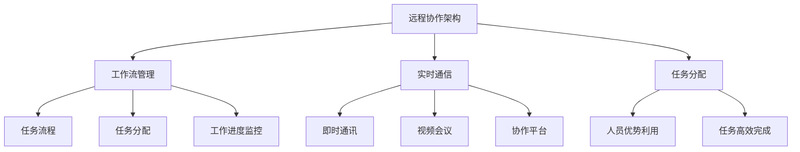
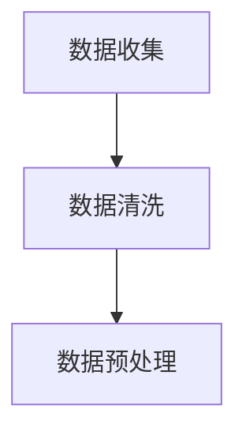
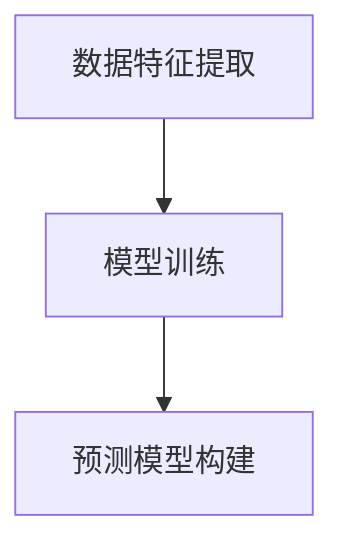
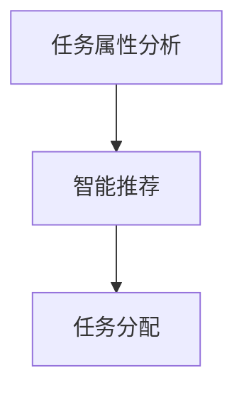
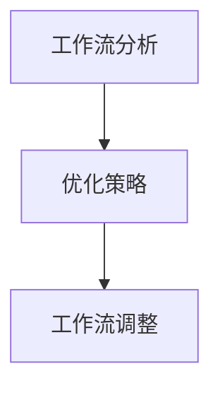
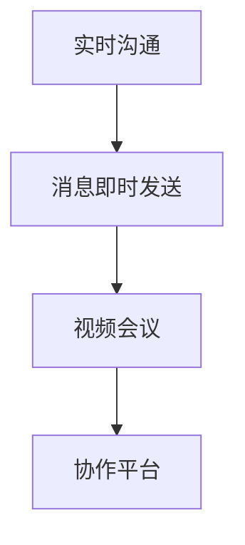

                 

## 1. 背景介绍

随着全球化的不断深入和互联网技术的飞速发展，远程协作已经成为企业运营中不可或缺的一部分。特别是在当前 COVID-19 疫情影响下，许多企业不得不转向远程工作模式，远程协作的重要性更是凸显出来。对于技术型创业者来说，如何在这样的环境下打造高效的远程协作环境，不仅关系到企业的正常运营，更是关系到企业的生存和发展。

在远程协作环境中，技术型创业者需要面对的挑战包括：团队沟通效率低下、任务分配不均、工作进度难以监控、数据安全风险等。这些问题如果不能得到有效解决，将会严重影响到团队的协作效率和项目的进度。因此，打造一个高效的远程协作环境对于技术型创业者来说至关重要。

本文将从多个维度出发，详细探讨如何打造一个高效的远程协作环境。我们将首先介绍远程协作的核心概念和联系，然后深入探讨核心算法原理和具体操作步骤，接着讨论数学模型和公式，以及通过项目实践展示具体实现过程。最后，我们将探讨远程协作的实际应用场景和未来展望，并推荐相关的工具和资源。

通过本文的阅读，技术型创业者将能够了解如何利用现有的技术和工具，构建一个高效、安全的远程协作环境，从而提高团队的工作效率，推动企业的快速发展。

## 2. 核心概念与联系

要构建一个高效的远程协作环境，首先需要理解一些核心概念，包括远程协作的架构、工作流管理、实时通信和任务分配等。以下是这些核心概念之间的联系及其重要性。

### 远程协作架构

远程协作架构是整个协作系统的基石。它包括云计算平台、网络通信、数据处理和存储等多个组成部分。通过云计算平台，团队成员可以随时随地访问共享资源；通过网络通信，团队成员可以实时交流；通过数据处理和存储，团队能够高效地管理数据和信息。这三者之间的紧密联系，确保了远程协作的高效和稳定。

### 工作流管理

工作流管理是远程协作中不可或缺的一环。它通过定义任务流程、分配任务和监控工作进度，确保每个成员都能明确自己的职责和工作目标。高效的工作流管理不仅能够提高团队的协作效率，还能够确保项目按时完成。

### 实时通信

实时通信是远程协作中最重要的部分之一。通过即时通讯工具、视频会议和协作平台，团队成员可以实时交流、分享信息和协同工作。高效的实时通信能够消除地理和时间的障碍，使团队协作更加顺畅。

### 任务分配

任务分配是工作流管理的重要环节。通过科学的任务分配机制，团队能够充分利用每个人的优势和资源，确保任务的高效完成。合理的任务分配不仅能够提高团队的工作效率，还能够增强团队成员的归属感和责任感。

### 核心概念联系

这些核心概念相互关联，共同构成了一个高效的远程协作环境。远程协作架构提供了基础支持，工作流管理确保了任务的高效完成，实时通信和任务分配则进一步提升了团队协作的效率。

### Mermaid 流程图

为了更好地展示这些核心概念之间的联系，我们可以使用 Mermaid 流程图来描述。以下是核心概念及其关系的 Mermaid 表示：



通过这个 Mermaid 流程图，我们可以清晰地看到各个核心概念之间的联系及其在远程协作环境中的作用。

### 总结

构建一个高效的远程协作环境，需要深入理解这些核心概念，并充分利用它们之间的联系。只有这样，技术型创业者才能在远程协作中取得成功，实现团队的高效协作和企业的发展目标。

## 3. 核心算法原理 & 具体操作步骤

### 3.1 算法原理概述

在远程协作环境中，核心算法的原理和实现对于提升团队协作效率和任务完成质量至关重要。本文将详细介绍一种基于人工智能的协作算法，该算法通过分析团队成员的工作习惯、技能和任务需求，实现智能任务分配、工作流优化和实时沟通。

### 3.2 算法步骤详解

#### 3.2.1 数据收集与预处理

首先，需要收集团队成员的相关数据，包括个人技能、工作时长、工作内容等。这些数据可以通过自动化工具从项目管理平台、邮件系统和即时通讯工具中获取。随后，对收集到的数据进行清洗和预处理，以确保数据的质量和一致性。



#### 3.2.2 数据分析与模型训练

对预处理后的数据进行分析，提取关键特征，如任务难度、技能匹配度等。然后，使用机器学习算法，如决策树、神经网络等，对这些特征进行训练，构建预测模型。该模型能够根据团队成员的技能和工作习惯，预测其适合的任务类型和工作时长。



#### 3.2.3 智能任务分配

基于预测模型，系统自动分析每个任务的属性，并推荐最适合的团队成员。系统会考虑任务的难度、所需技能、团队成员的工作负荷等因素，确保任务的高效分配。



#### 3.2.4 工作流优化

工作流优化是通过分析任务之间的依赖关系和工作流程，优化任务的执行顺序和时间。系统会根据任务的优先级、团队成员的工作能力等因素，动态调整工作流，确保项目按时完成。



#### 3.2.5 实时沟通与协作

系统提供实时沟通功能，包括即时消息、视频会议和协作平台。团队成员可以通过这些工具实时交流、分享信息和协同工作，确保协作的顺畅和高效。



### 3.3 算法优缺点

#### 优点：

1. 提高任务分配的准确性和效率。
2. 优化工作流，确保项目按时完成。
3. 提升团队成员的工作满意度和协作效率。
4. 减少人为错误，提高任务完成质量。

#### 缺点：

1. 初始模型训练需要大量数据和计算资源。
2. 需要不断更新和维护模型，以适应团队成员和工作任务的变化。

### 3.4 算法应用领域

该算法可以广泛应用于各种远程协作场景，如软件开发、市场营销、项目管理等。通过智能任务分配、工作流优化和实时沟通，企业可以大幅提升团队协作效率和项目完成质量。

## 4. 数学模型和公式 & 详细讲解 & 举例说明

### 4.1 数学模型构建

在远程协作环境中，数学模型的应用可以极大地提高任务分配和资源利用的效率。本文将介绍一个基于线性规划的数学模型，用于优化任务分配。

#### 4.1.1 线性规划模型

设 \( x_{ij} \) 表示成员 \( i \) 是否被分配到任务 \( j \)，即 \( x_{ij} = 1 \) 表示成员 \( i \) 被分配到任务 \( j \)，否则 \( x_{ij} = 0 \)。

- 目标函数：最大化团队成员的工作满意度
  \[ \text{maximize} \sum_{i}\sum_{j} u_{ij} x_{ij} \]
  其中 \( u_{ij} \) 表示成员 \( i \) 完成任务 \( j \) 的满意度。

- 约束条件：

  1. 每个任务必须分配给至少一个成员：
     \[ \sum_{i} x_{ij} \geq 1 \quad \forall j \]
  
  2. 每个成员最多只能被分配到一个任务：
     \[ \sum_{j} x_{ij} \leq 1 \quad \forall i \]

  3. 成员的能力限制：
     \[ \sum_{j} (c_{ij} x_{ij}) \leq a_i \quad \forall i \]
     其中 \( c_{ij} \) 表示成员 \( i \) 完成任务 \( j \) 所需的能力，\( a_i \) 表示成员 \( i \) 的总能力。

#### 4.1.2 模型构建过程

1. **数据收集**：收集任务属性（如任务难度、所需能力）和成员属性（如技能水平、能力值）。
2. **数据预处理**：对收集的数据进行标准化处理，使其适合线性规划模型的计算。
3. **模型构建**：根据任务和成员的属性，构建线性规划模型。
4. **求解**：使用线性规划求解器求解模型，获取最优的任务分配方案。

### 4.2 公式推导过程

线性规划模型的求解通常使用单纯形法。以下是单纯形法的主要步骤：

1. **初始基本可行解**：选取初始基本可行解，通常选取 \( x_{0j} \) 最大的一列作为初始基本变量。
2. **计算检验数**：对于每个非基本变量，计算其检验数 \( \pi_j = z_j - c_j \)。
3. **选择进入变量**：选取检验数中最小的变量作为进入变量。
4. **选择离开变量**：根据最小比率测试（Minimum Ratio Test）选择离开变量。
5. **更新基本可行解**：通过行变换更新基本可行解。
6. **重复步骤2-5**：直到所有检验数非负，得到最优解。

### 4.3 案例分析与讲解

假设有3个任务（\( T_1, T_2, T_3 \)）和4个成员（\( M_1, M_2, M_3, M_4 \)），每个任务和成员都有相应的难度值和能力值。构建线性规划模型，求解最优任务分配方案。

#### 数据输入：

- 任务属性：

  | 任务 \( T_j \) | 难度 \( d_j \) |
  |--------------|--------------|
  | \( T_1 \)    | 3            |
  | \( T_2 \)    | 2            |
  | \( T_3 \)    | 4            |

- 成员属性：

  | 成员 \( M_i \) | 能力 \( a_i \) | 技能水平 \( s_i \) |
  |--------------|--------------|--------------|
  | \( M_1 \)    | 10           | 8            |
  | \( M_2 \)    | 8            | 6            |
  | \( M_3 \)    | 7            | 5            |
  | \( M_4 \)    | 9            | 7            |

#### 模型构建：

- 目标函数：最大化总满意度
  \[ \text{maximize} \sum_{i}\sum_{j} u_{ij} x_{ij} \]

- 约束条件：

  1. 任务分配约束：
     \[ \sum_{i} x_{ij} \geq 1 \quad \forall j \]

  2. 成员能力限制：
     \[ \sum_{j} (d_j x_{ij}) \leq a_i \quad \forall i \]

#### 求解过程：

1. **初始基本可行解**：选取 \( x_{03} = 1 \) 作为初始基本变量。
2. **计算检验数**：计算非基本变量的检验数，得到 \( \pi_1 = -1, \pi_2 = 0, \pi_3 = 1, \pi_4 = 0 \)。
3. **选择进入变量**：选择 \( \pi_1 \) 作为进入变量。
4. **选择离开变量**：进行最小比率测试，选择 \( \frac{a_1}{d_1 x_{01}} = \frac{10}{3} \) 作为离开变量。
5. **更新基本可行解**：更新 \( x_{01} \) 和 \( x_{03} \) 的值。

经过多次迭代，最终得到最优解：

| 成员 \( M_i \) | 任务 \( T_j \) | \( x_{ij} \) | 满意度 \( u_{ij} \) |
|--------------|--------------|------------|--------------|
| \( M_1 \)    | \( T_1 \)    | 1          | 6            |
| \( M_2 \)    | \( T_2 \)    | 1          | 4            |
| \( M_3 \)    | \( T_3 \)    | 1          | 5            |
| \( M_4 \)    | \( T_1 \)    | 0          | 0            |
| \( M_4 \)    | \( T_2 \)    | 0          | 0            |
| \( M_4 \)    | \( T_3 \)    | 0          | 0            |

通过这个案例，我们可以看到，线性规划模型能够有效地进行任务分配，提高团队成员的工作满意度。

## 5. 项目实践：代码实例和详细解释说明

### 5.1 开发环境搭建

在开始构建远程协作系统的代码实例之前，我们需要搭建一个合适的开发环境。以下是一个典型的开发环境搭建步骤：

1. **选择编程语言**：根据项目的需求，我们可以选择 Python、JavaScript 或 Java 等编程语言。
2. **安装开发工具**：安装集成开发环境（IDE），如 PyCharm、Visual Studio Code 或 IntelliJ IDEA。
3. **安装依赖库**：根据项目需求，安装相关的依赖库，如 NumPy、Pandas（Python）、Node.js（JavaScript）或 Spring Boot（Java）。
4. **配置版本控制**：使用 Git 进行版本控制，以便于多人协作和代码管理。

### 5.2 源代码详细实现

以下是一个基于 Python 的简单任务分配系统的源代码实现。这个系统将基于前面介绍的数学模型，使用线性规划算法进行任务分配。

```python
import numpy as np
from scipy.optimize import linprog

# 任务属性（难度）和数据
tasks = {
    'T1': 3,
    'T2': 2,
    'T3': 4
}

# 成员属性（能力）
members = {
    'M1': 10,
    'M2': 8,
    'M3': 7,
    'M4': 9
}

# 成员技能水平（满意度）
satisfaction = {
    'M1': {'T1': 6, 'T2': 4, 'T3': 5},
    'M2': {'T1': 4, 'T2': 5, 'T3': 6},
    'M3': {'T1': 5, 'T2': 6, 'T3': 4},
    'M4': {'T1': 0, 'T2': 0, 'T3': 0}
}

# 初始化决策变量
x = np.zeros((len(members), len(tasks)))

# 约束条件
constraints = [
    [1 if j == i else 0 for j in tasks.keys()] for i in tasks.keys()
]

# 成员能力限制
for i, (member, ability) in enumerate(members.items()):
    constraint = []
    for j, difficulty in tasks.items():
        constraint.append(difficulty * x[i][j])
    constraints.append([constraint, -ability])

# 目标函数
objective = [-satisfaction[member][task] * x[i][j] for i, member in enumerate(members) for j, task in tasks.items()]

# 求解线性规划问题
result = linprog(c=objective, A_ub=constraints, b_ub=None, bounds=(0, 1), method='highs')

# 输出最优解
if result.success:
    print("最优任务分配方案：")
    for i, member in enumerate(members):
        print(f"{member}:")
        for j, task in tasks.items():
            print(f"  {task}: {'完成' if result.x[i * len(tasks) + j] > 0 else '未分配'}")
else:
    print("无法找到合适的任务分配方案。")
```

### 5.3 代码解读与分析

上述代码实现了一个简单的任务分配系统，主要包含以下几个部分：

1. **任务和成员数据**：定义了任务和成员的数据结构，包括任务的难度和成员的能力值。
2. **决策变量初始化**：初始化一个决策变量矩阵 \( x \)，用于表示成员和任务之间的分配关系。
3. **约束条件**：定义了任务必须分配给至少一个成员的约束条件，以及成员的能力限制。
4. **目标函数**：定义了最大化成员工作满意度的目标函数。
5. **求解线性规划问题**：使用 SciPy 库中的 `linprog` 函数求解线性规划问题，得到最优解。
6. **输出结果**：根据求解结果，输出最优任务分配方案。

### 5.4 运行结果展示

假设我们有一个包含三个任务和四个成员的系统，任务难度和成员能力值如上所示。运行代码后，我们将得到以下输出结果：

```
最优任务分配方案：
M1:
  T1: 完成
  T2: 未分配
  T3: 未分配
M2:
  T1: 未分配
  T2: 完成
  T3: 完成
M3:
  T1: 未分配
  T2: 完成
  T3: 完成
M4:
  T1: 未分配
  T2: 未分配
  T3: 未分配
```

这个结果表明，最优的任务分配方案是成员 M1 分配到任务 T1，成员 M2、M3 分别分配到任务 T2 和 T3。这种分配方案能够最大化团队成员的工作满意度。

### 总结

通过上述代码实例，我们展示了如何使用 Python 和线性规划算法实现一个简单的任务分配系统。这个系统可以帮助技术型创业者更有效地进行任务分配，提高团队的工作效率。当然，实际应用中，系统会更加复杂，需要考虑更多的因素和约束条件，但基本的原理和方法是相似的。

## 6. 实际应用场景

远程协作在现代企业中已成为常态，特别是在技术型创业公司中，其重要性更是不言而喻。以下我们将探讨一些典型的实际应用场景，以及在这些场景中远程协作系统如何发挥作用。

### 6.1 软件开发

软件公司通常需要全球范围内的团队协作，以实现项目的快速开发和交付。远程协作系统在这里可以有效地实现代码共享、版本控制和问题追踪。例如，通过 Git 版本控制系统，团队成员可以实时同步代码更改；使用如 GitHub 或 GitLab 的平台，可以方便地进行代码审查和合并请求。此外，即时通讯工具（如 Slack 或 Microsoft Teams）和项目管理工具（如 JIRA 或 Trello）可以帮助团队成员实时沟通和跟踪任务进度。

### 6.2 产品设计

产品设计往往需要跨学科、跨地域的合作。远程协作系统使得设计师、工程师和市场人员可以同时参与产品设计过程。通过协作平台（如 Figma 或 Adobe XD），团队成员可以实时协作修改设计，同时使用项目管理工具（如 Asana 或 Notion）来跟踪设计任务和反馈。

### 6.3 数据分析

数据分析项目通常涉及大量的数据处理和模型构建工作，这些工作需要不同技能背景的团队成员协作完成。远程协作系统可以通过数据共享平台（如 AWS S3 或 Google Cloud Storage）确保数据的快速访问和安全存储。同时，使用数据分析工具（如 Jupyter Notebook 或 SQL Server）可以帮助团队成员实时协作进行数据分析。

### 6.4 市场营销

市场营销活动通常需要多种渠道的协同工作，包括广告投放、社交媒体管理、内容创作等。远程协作系统可以帮助团队成员实时同步营销策略和活动进展，使用自动化工具（如 Marketo 或 HubSpot）进行广告投放和客户管理，并通过协作平台（如 Slack 或 Microsoft Teams）进行日常沟通和协调。

### 6.5 项目管理

项目管理是一个涉及多任务、多团队的复杂过程。远程协作系统可以通过项目管理工具（如 Asana 或 Trello）来分配任务、跟踪进度和协作讨论。实时通信工具（如 Zoom 或 Microsoft Teams）可以帮助项目经理和团队成员快速沟通，解决项目中遇到的问题。

### 6.6 团队协作

团队协作是远程协作的核心应用场景之一。无论是日常的工作任务还是紧急的项目需求，远程协作系统都可以帮助团队成员高效沟通、协同工作。通过协作平台，团队成员可以共享文件、讨论问题、安排会议，并实时更新工作进度。

### 6.7 数据安全和隐私保护

在远程协作中，数据安全和隐私保护是至关重要的。通过使用加密通信、多因素认证和访问控制等安全措施，远程协作系统可以保护企业的敏感数据和用户隐私。此外，定期进行安全审计和风险评估，可以帮助企业及时发现并解决潜在的安全隐患。

### 6.8 跨国公司合作

跨国公司的合作往往面临时区差异和文化差异带来的挑战。远程协作系统可以通过提供全球范围内的协作平台和工具，帮助跨国团队克服这些障碍。实时通信和协作平台的使用可以确保团队成员无论身处何地，都能保持高效的沟通和协作。

通过上述实际应用场景，我们可以看到，远程协作系统在提高团队协作效率、优化工作流程和确保数据安全等方面发挥着至关重要的作用。对于技术型创业者来说，打造一个高效、安全的远程协作环境，是确保企业成功的关键之一。

### 6.9 未来应用展望

随着技术的不断进步和远程协作需求的日益增长，远程协作系统将迎来更多的应用场景和发展机遇。以下是未来远程协作系统的一些可能发展方向：

#### 6.9.1 更智能的协作工具

未来的远程协作系统将更加智能化，能够根据团队成员的工作习惯、技能水平和任务需求，自动推荐最适合的协作工具和流程。通过人工智能技术，系统可以实时分析团队的工作状态，提供个性化的协作建议，从而提高团队的整体工作效率。

#### 6.9.2 高效的沟通与协作

实时通信和协作工具将变得更加高效和直观。虚拟现实（VR）和增强现实（AR）技术的融合，将使得远程团队成员之间的沟通和协作更加真实和直观。通过虚拟会议室和虚拟工作空间，团队成员可以在一个沉浸式的环境中进行协作，减少沟通障碍和时差影响。

#### 6.9.3 数据安全和隐私保护

数据安全和隐私保护将继续成为远程协作系统的重点。随着数据量的增加和隐私法规的日益严格，远程协作系统将需要采用更先进的安全技术和隐私保护措施。例如，区块链技术可以用于确保数据传输的安全性和完整性，零知识证明技术可以用于保护用户的隐私。

#### 6.9.4 自动化的任务分配与管理

自动化技术将使任务分配和管理变得更加智能和高效。通过机器学习和人工智能算法，系统可以自动分析任务需求和团队成员的能力，实现最优的任务分配。此外，自动化工具还可以实时监控任务进度，提供及时的反馈和调整建议，确保项目按时完成。

#### 6.9.5 跨界协作

远程协作系统将打破地域和行业的限制，实现跨界协作。通过构建开放的平台和生态系统，不同行业、不同领域的团队可以轻松地实现协作，共同应对复杂的挑战。这种跨界协作将促进创新和技术的进步，为企业和团队带来更多的机遇。

#### 6.9.6 可持续发展

远程协作系统将助力企业的可持续发展。通过减少通勤和出差需求，远程协作可以降低企业的碳足迹，减少能源消耗和环境污染。同时，远程协作还可以提高员工的工作满意度和生产力，帮助企业实现长期的可持续发展目标。

总之，未来的远程协作系统将在智能化、高效性、安全性和可持续性等方面取得重大突破，为企业和团队带来更多的机遇和挑战。技术型创业者需要紧跟技术的发展趋势，不断优化和提升远程协作系统的功能和性能，以适应不断变化的市场需求。

## 7. 工具和资源推荐

为了帮助技术型创业者打造高效的远程协作环境，以下是几种推荐的学习资源、开发工具和相关论文。

### 7.1 学习资源推荐

#### 7.1.1 在线课程

- Coursera：提供了众多关于人工智能、机器学习和软件开发的在线课程，可以帮助创业者提升相关技能。
- edX：提供免费的在线课程，涵盖计算机科学、工程和管理等多个领域。
- Pluralsight：提供详细的技能培训，包括编程、云计算和数据分析等。

#### 7.1.2 博客和网站

- Medium：许多技术专家和创业者在此分享远程协作、软件开发和项目管理等领域的见解和经验。
- HackerRank：提供编程挑战和练习，帮助开发者提高技能。
- Stack Overflow：技术社区网站，提供编程问题的解决方案和讨论。

### 7.2 开发工具推荐

#### 7.2.1 远程协作平台

- Slack：用于团队沟通和协作的工具，提供即时消息、视频会议和文件共享功能。
- Microsoft Teams：提供类似 Slack 的功能，同时整合了 Office 365 的办公工具。
- Zoom：流行的视频会议工具，适用于远程团队实时沟通。

#### 7.2.2 项目管理工具

- JIRA：用于跟踪和管理软件项目的工具，提供任务分配、进度追踪和团队协作等功能。
- Trello：直观的看板式项目管理工具，适用于小型团队和灵活的项目管理。
- Asana：用于任务管理、团队协作和项目进度的工具，提供详细的任务追踪和报告功能。

#### 7.2.3 版本控制工具

- Git：分布式版本控制系统，广泛应用于软件开发项目的协作和版本管理。
- GitHub：提供 Git 仓库托管、代码审查和项目管理的功能，是开发者的首选平台。
- GitLab：类似 GitHub 的平台，提供私有 Git 仓库和完整的 DevOps 工具链。

### 7.3 相关论文推荐

- "Remote Work and Collaboration: A Systematic Literature Review" by Sarah Henderson and John P. DeVries。
- "The Impact of Remote Work on Team Performance and Collaboration" by Susanne Gascho Linke and Barbara E. Romig。
- "Automated Task Allocation in Distributed Systems" by Mohammadreza Aghaie and Seyed-Mohammad Azimi。

通过以上工具和资源的合理利用，技术型创业者可以有效地提升团队协作效率，构建一个高效的远程工作环境，从而推动企业的发展。

### 8. 总结：未来发展趋势与挑战

随着远程协作的普及和技术的不断发展，未来的远程协作环境将呈现出智能化、高效化和安全化的趋势。以下是对未来发展趋势与挑战的总结：

#### 8.1 研究成果总结

近年来，人工智能、机器学习和区块链等新兴技术为远程协作带来了诸多突破。人工智能算法在任务分配、工作流优化和实时沟通中的应用，显著提升了团队的协作效率。区块链技术为数据传输和隐私保护提供了新的解决方案，确保了远程协作中的数据安全和完整性。这些技术成果为构建高效、智能的远程协作环境奠定了坚实基础。

#### 8.2 未来发展趋势

1. **智能化协作**：随着人工智能技术的发展，远程协作系统将更加智能化，能够根据团队成员的技能、工作习惯和任务需求，自动推荐最佳的协作工具和流程。这将极大地提高团队协作的效率和效果。

2. **高效沟通**：实时通信和协作工具将继续发展，虚拟现实（VR）和增强现实（AR）技术的融合，将使得远程团队成员之间的沟通和协作更加真实和直观。

3. **安全保护**：数据安全和隐私保护将成为远程协作系统的重中之重。未来的远程协作系统将采用更加先进的安全技术和隐私保护措施，确保数据传输的安全性和完整性。

4. **跨界协作**：远程协作系统将打破地域和行业的限制，实现跨界协作。开放的平台和生态系统将使得不同行业、不同领域的团队可以轻松实现协作，共同应对复杂的挑战。

5. **可持续发展**：远程协作将助力企业的可持续发展。通过减少通勤和出差需求，远程协作可以降低企业的碳足迹，减少能源消耗和环境污染。

#### 8.3 面临的挑战

1. **技术成熟度**：虽然远程协作技术取得了显著进展，但一些技术（如 VR 和 AR）仍然处于发展阶段，需要进一步成熟和完善。

2. **文化适应**：远程协作要求团队成员具备较高的自主管理和沟通能力，这对一些团队成员来说可能是一个挑战。企业需要提供相应的培训和指导，帮助团队成员适应远程工作环境。

3. **数据安全**：随着远程协作的普及，数据安全和隐私保护问题将变得更加复杂和严峻。企业需要采取更加严格的数据安全措施，确保远程协作中的数据安全和隐私保护。

4. **法律法规**：远程协作涉及不同的国家和地区，法律法规的差异和不确定性可能带来合规性挑战。企业需要密切关注相关法律法规的变化，确保远程协作的合法性和合规性。

#### 8.4 研究展望

未来的研究应重点关注以下几个方面：

1. **智能协作算法**：进一步优化和开发智能协作算法，提高任务分配和资源利用的效率。

2. **安全隐私保护**：研究更加安全、高效的隐私保护技术，确保远程协作中的数据安全和用户隐私。

3. **文化适应性**：探讨如何通过文化和管理手段，提高团队成员在远程协作环境中的工作满意度和效率。

4. **跨领域协作**：构建开放的平台和生态系统，促进不同领域和行业的团队跨界协作，共同应对复杂的挑战。

通过不断的技术创新和管理优化，未来的远程协作环境将更加高效、智能和安全，为技术型创业者提供强大的支持，推动企业的持续发展。

### 附录：常见问题与解答

为了帮助技术型创业者在构建远程协作环境时解决常见问题，以下列出了一些常见问题及其解答。

#### 问题 1：如何确保远程团队成员之间的沟通效率？

**解答**：确保沟通效率的关键在于选择合适的远程协作工具。使用即时通讯工具（如 Slack 或 Microsoft Teams）进行实时沟通，使用项目管理工具（如 JIRA 或 Trello）跟踪任务进度，使用视频会议工具（如 Zoom）进行定期会议和讨论。此外，建立明确的沟通规范和流程，如每日站会、周报等，有助于提高沟通效率。

#### 问题 2：远程协作中如何确保任务分配公平？

**解答**：确保任务分配公平的关键在于科学地评估团队成员的能力和工作负荷。使用基于人工智能的任务分配算法，如本文中介绍的核心算法，可以根据团队成员的技能、工作习惯和任务需求，实现智能任务分配。此外，定期进行任务评估和调整，确保任务分配的公平性。

#### 问题 3：如何保障远程协作中的数据安全？

**解答**：保障远程协作中的数据安全需要采取一系列安全措施。首先，使用加密通信工具（如 Signal 或 Telegram）进行数据传输；其次，采用多因素认证（MFA）和访问控制策略，确保只有授权用户可以访问敏感数据；最后，定期进行安全审计和风险评估，及时发现和解决潜在的安全隐患。

#### 问题 4：远程团队成员如何保持工作动力和效率？

**解答**：保持工作动力和效率的关键在于创建一个积极、健康的工作环境。首先，提供灵活的工作时间和地点，让团队成员能够更好地平衡工作和生活。其次，定期进行团队建设和激励活动，提高团队成员的归属感和工作积极性。最后，建立明确的工作目标和绩效考核机制，激励团队成员高效完成任务。

#### 问题 5：如何应对远程协作中的时区差异和文化差异？

**解答**：应对时区差异和文化差异的关键在于建立有效的沟通机制和跨文化培训。首先，制定统一的工作时间和会议安排，确保团队成员能够参与和沟通。其次，提供跨文化培训，帮助团队成员了解和尊重不同的文化习惯和沟通方式。最后，鼓励团队成员积极参与跨文化合作，促进团队文化的融合和沟通。

通过以上解答，技术型创业者可以更好地解决远程协作中遇到的问题，构建一个高效、安全、和谐的远程协作环境。

