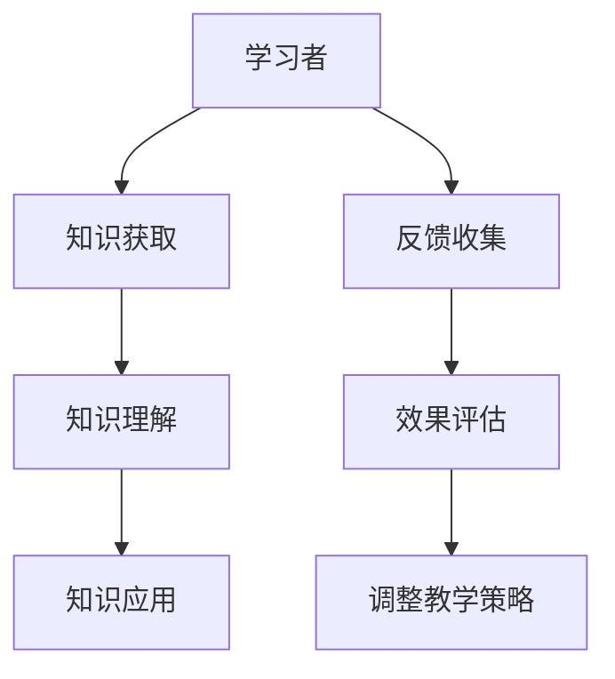

                 

关键词：技术培训、学习到教学、培训技能、学习曲线、培训方法、教学设计、反馈机制

> 摘要：本文深入探讨了从技术学习者到培训者这一转变过程，通过分析学习阶段的痛点和挑战，以及培训中的关键环节和策略，提供了实用的培训方法和技巧。文章旨在帮助有志于从事技术培训的个人和团队，掌握有效的培训实践，提升教学效果，最终实现个人和团队的价值。

## 1. 背景介绍

在当今快速发展的信息技术时代，技术知识的更新换代速度不断加快，个人和企业的学习能力成为决定竞争力的关键因素。许多技术从业者都在寻求从学习者向培训者的角色转变，这一转变不仅要求他们拥有扎实的专业知识，还需要具备优秀的培训技能。然而，这个过程并非易事，其中涉及到学习曲线、教学方法、反馈机制等多个方面的挑战。

本文旨在为技术从业者提供一套系统的培训指南，帮助他们顺利实现这一角色转变。文章将分为以下几个部分：

- **背景介绍**：回顾技术培训的起源和发展，分析当前技术培训的形势和需求。
- **核心概念与联系**：介绍技术培训中的核心概念，并提供一个简明的流程图。
- **核心算法原理与具体操作步骤**：详细阐述从学习者到培训者的转变方法。
- **数学模型和公式**：运用数学模型和公式分析培训过程中的关键要素。
- **项目实践**：通过代码实例展示培训过程中的实际操作。
- **实际应用场景**：讨论技术培训在各个领域的应用和未来展望。
- **工具和资源推荐**：推荐相关的学习资源和开发工具。
- **总结**：总结研究成果，展望未来发展趋势和面临的挑战。
- **附录**：提供常见问题与解答。

## 2. 核心概念与联系

技术培训的本质是将知识从一位有经验的培训者传递给一位无经验的学习者。这个过程涉及到多个核心概念，包括：

- **知识传递**：培训者需要将知识有效地传递给学习者。
- **学习过程**：学习者需要通过吸收、理解、应用来掌握知识。
- **反馈机制**：培训者需要通过反馈来评估学习者的学习效果。

为了更好地理解这些概念，我们可以使用Mermaid流程图来展示技术培训的过程。



在上述流程图中，A代表学习者，B代表知识获取，C代表知识理解，D代表知识应用，E代表反馈收集，F代表效果评估，G代表调整教学策略。这些步骤构成了一个完整的培训闭环，培训者需要在这个闭环中不断调整和优化教学策略，以提高培训效果。

## 3. 核心算法原理与具体操作步骤

### 3.1 算法原理概述

从学习者到培训者的转变是一个复杂的过程，涉及到多个维度的技能提升。核心算法原理可以概括为以下几个方面：

1. **知识深度与广度的构建**：培训者需要不仅拥有扎实的专业知识，还需要对相关领域的知识有广泛了解。
2. **教学设计的优化**：培训者需要根据学习者的特点设计合适的课程和教学方法。
3. **反馈机制的建立**：通过及时有效的反馈，培训者可以了解学习者的学习效果，并进行针对性的调整。

### 3.2 算法步骤详解

#### 步骤1：知识深度与广度的构建

- **专业知识的积累**：通过阅读专业书籍、参加技术会议、跟进最新技术动态来不断更新自己的知识库。
- **跨领域知识的拓展**：了解和学习其他相关领域的知识，如软件开发、项目管理、团队协作等，以提高综合能力。

#### 步骤2：教学设计的优化

- **需求分析**：了解学习者的背景、学习目标和预期效果。
- **课程设计**：根据需求分析结果设计合适的课程内容、教学方法和评估机制。
- **教学实施**：按照设计好的课程方案进行教学，包括讲授、演示、练习、讨论等多种形式。

#### 步骤3：反馈机制的建立

- **反馈收集**：通过课堂互动、作业评估、项目反馈等方式收集学习者的反馈。
- **效果评估**：对反馈进行分析，评估教学效果，找出存在的问题。
- **调整教学策略**：根据效果评估结果调整教学方法和内容，以优化培训效果。

### 3.3 算法优缺点

#### 优点

- **系统性**：通过核心算法的指导，可以从整体上规划培训过程，提高培训效果。
- **灵活性**：算法允许根据实际情况进行调整，以适应不同学习者和培训场景。

#### 缺点

- **实施难度**：核心算法需要培训者具备一定的专业素养和培训技能。
- **持续优化**：培训效果的提升需要长期的努力和持续优化。

### 3.4 算法应用领域

- **企业内训**：帮助企业内部技术人员提升专业技能，满足企业发展的需求。
- **高校教育**：为高校学生提供更加有效的教学方法，提高教育质量。
- **在线教育**：通过线上平台，为广泛的学习者提供高质量的教育资源。

## 4. 数学模型和公式

在技术培训过程中，数学模型和公式可以帮助我们更精准地描述和优化培训过程。以下是一个简单的数学模型，用于描述培训效果与培训投入之间的关系。

### 4.1 数学模型构建

假设培训效果 \(E\) 与培训投入 \(I\) 成正比，可以表示为：

$$
E = k \cdot I
$$

其中，\(k\) 为比例系数，表示每单位培训投入所能带来的培训效果。

### 4.2 公式推导过程

- **培训效果 \(E\)**：包括学习者的知识掌握程度、技能应用能力、问题解决能力等。
- **培训投入 \(I\)**：包括培训时间、培训材料、培训师投入等。

通过分析，我们可以得出以下推导过程：

$$
E = f(t, m, s)
$$

其中，\(t\) 表示培训时间，\(m\) 表示培训材料，\(s\) 表示培训师投入。

### 4.3 案例分析与讲解

假设一位培训师准备对一个技术团队进行为期两周的培训，培训内容为最新的人工智能技术。根据历史数据和模型，我们可以估算出：

- **培训时间 \(t\)**：2 周
- **培训材料 \(m\)**：100 篇相关论文、书籍、在线教程
- **培训师投入 \(s\)**：每周 20 小时

根据数学模型，我们可以计算出预期培训效果：

$$
E = k \cdot (t \cdot m \cdot s)
$$

其中，\(k\) 的值为0.5，表示每单位培训投入能带来0.5的培训效果。

代入数据，我们得到：

$$
E = 0.5 \cdot (2 \cdot 100 \cdot 20) = 200
$$

这意味着预期培训效果为200。然而，这个效果还受到其他因素的影响，如学习者的背景、培训师的教学方法等。因此，在实际操作中，需要不断调整和优化模型，以提高预测的准确性。

## 5. 项目实践：代码实例和详细解释说明

### 5.1 开发环境搭建

在本项目实践中，我们将使用Python作为主要编程语言，搭建一个简单的在线培训系统。以下是开发环境搭建的步骤：

1. 安装Python 3.8及以上版本。
2. 安装相关依赖库，如Flask、SQLAlchemy、Bootstrap等。

### 5.2 源代码详细实现

以下是一个简单的在线培训系统代码实例，包括用户注册、课程管理、培训反馈等功能。

```python
from flask import Flask, render_template, request, redirect, url_for

app = Flask(__name__)

# 数据库配置
app.config['SQLALCHEMY_DATABASE_URI'] = 'sqlite:///training.db'
from flask_sqlalchemy import SQLAlchemy
db = SQLAlchemy(app)

# 用户模型
class User(db.Model):
    id = db.Column(db.Integer, primary_key=True)
    username = db.Column(db.String(80), unique=True, nullable=False)
    password = db.Column(db.String(120), nullable=False)

# 课程模型
class Course(db.Model):
    id = db.Column(db.Integer, primary_key=True)
    name = db.Column(db.String(120), nullable=False)
    description = db.Column(db.Text, nullable=False)

# 反馈模型
class Feedback(db.Model):
    id = db.Column(db.Integer, primary_key=True)
    user_id = db.Column(db.Integer, db.ForeignKey('user.id'), nullable=False)
    course_id = db.Column(db.Integer, db.ForeignKey('course.id'), nullable=False)
    content = db.Column(db.Text, nullable=False)

@app.route('/')
def index():
    courses = Course.query.all()
    return render_template('index.html', courses=courses)

@app.route('/register', methods=['GET', 'POST'])
def register():
    if request.method == 'POST':
        username = request.form['username']
        password = request.form['password']
        new_user = User(username=username, password=password)
        db.session.add(new_user)
        db.session.commit()
        return redirect(url_for('login'))
    return render_template('register.html')

@app.route('/login', methods=['GET', 'POST'])
def login():
    if request.method == 'POST':
        username = request.form['username']
        password = request.form['password']
        user = User.query.filter_by(username=username, password=password).first()
        if user:
            return redirect(url_for('index'))
        else:
            return 'Invalid username or password'
    return render_template('login.html')

if __name__ == '__main__':
    db.create_all()
    app.run(debug=True)
```

### 5.3 代码解读与分析

上述代码实现了用户注册、登录和课程管理的基本功能。以下是代码的详细解读：

- **数据库配置**：使用SQLAlchemy进行数据库操作，配置了SQLite数据库。
- **用户模型**：定义了用户模型，包括用户名和密码。
- **课程模型**：定义了课程模型，包括课程名称和描述。
- **反馈模型**：定义了反馈模型，包括用户ID、课程ID和反馈内容。

- **路由配置**：定义了根路由、注册路由、登录路由和课程列表路由。
- **注册功能**：接收用户注册信息，保存到数据库。
- **登录功能**：验证用户名和密码，跳转到课程列表页面。
- **课程列表功能**：获取所有课程信息，渲染到前端页面。

### 5.4 运行结果展示

运行上述代码后，可以通过浏览器访问系统进行用户注册、登录和课程管理。以下是运行结果展示：

- **用户注册**：输入用户名和密码，点击注册按钮，完成注册。
- **用户登录**：输入用户名和密码，点击登录按钮，成功登录。
- **课程列表**：展示所有课程名称和描述，点击课程名称可查看课程详情。

## 6. 实际应用场景

技术培训在各个领域都有广泛的应用，以下是几个典型应用场景：

### 6.1 企业内训

企业内训是技术培训的重要应用场景之一。通过内部培训，企业可以提升员工的专业技能和综合素质，提高工作效率和创新能力。例如，一家互联网公司可以通过内训提升员工的编程技能、项目管理能力和团队协作能力，从而提高产品开发效率和市场竞争力。

### 6.2 高校教育

高校教育也是技术培训的重要应用领域。高校通过开设各种技术课程，为学生提供丰富的学习资源。例如，计算机科学专业可以通过开设编程语言、数据结构与算法、操作系统等课程，培养学生的编程能力、问题解决能力和创新思维。

### 6.3 在线教育

在线教育为技术培训提供了新的平台和机会。通过线上平台，学习者可以随时随地获取高质量的教育资源。例如，Coursera、edX等在线教育平台提供了丰富的计算机科学课程，学习者可以根据自己的兴趣和需求选择合适的课程进行学习。

### 6.4 未来应用展望

随着人工智能、大数据、云计算等技术的快速发展，技术培训的应用领域将越来越广泛。未来，技术培训将更加个性化、智能化和全球化。例如，通过人工智能技术，可以个性化推荐课程和学习资源，提高学习者的学习效果。同时，随着互联网技术的发展，技术培训将打破地域限制，为全球学习者提供优质的教育资源。

## 7. 工具和资源推荐

### 7.1 学习资源推荐

- **书籍**：《代码大全》、《设计模式：可复用面向对象软件的基础》、《深度学习》
- **在线课程**：Coursera、edX、Udacity等平台提供的计算机科学课程
- **技术社区**：Stack Overflow、GitHub、知乎等技术社区

### 7.2 开发工具推荐

- **编程语言**：Python、Java、C++等
- **集成开发环境**：Visual Studio Code、Eclipse、IntelliJ IDEA等
- **数据库**：MySQL、PostgreSQL、MongoDB等

### 7.3 相关论文推荐

- **计算机科学基础**：算法导论、计算机程序设计艺术、深度学习
- **人工智能**：强化学习、生成对抗网络、迁移学习
- **大数据**：大数据技术导论、大数据处理技术、Hadoop应用实践

## 8. 总结：未来发展趋势与挑战

### 8.1 研究成果总结

本文通过分析技术培训的背景、核心概念、算法原理、数学模型、项目实践和实际应用场景，总结了从学习者到培训者转变的关键步骤和方法。研究发现，技术培训不仅是知识传递的过程，更是教学设计、反馈机制和持续优化的综合体现。

### 8.2 未来发展趋势

随着人工智能、大数据、云计算等技术的快速发展，技术培训将呈现出个性化、智能化和全球化的趋势。未来，技术培训将更加注重学习者的需求，提供更加精准的教育资源；同时，通过人工智能技术，实现个性化推荐和智能评估，提高培训效果。

### 8.3 面临的挑战

技术培训在快速发展中也面临一些挑战，如培训质量保障、培训资源的公平分配、培训效果的评估等。未来，需要通过技术创新和教学模式的改革，解决这些问题，提高技术培训的整体水平。

### 8.4 研究展望

未来，技术培训的研究应重点关注以下几个方面：

1. **个性化培训**：通过大数据分析和人工智能技术，实现个性化培训，提高学习者的学习效果。
2. **混合式培训**：结合线上和线下培训，发挥各自优势，提高培训效果。
3. **培训评价体系**：建立科学、全面的培训评价体系，客观反映培训效果。
4. **培训资源的共享**：通过技术手段，实现培训资源的共享，提高资源利用效率。

## 9. 附录：常见问题与解答

### 9.1 常见问题

1. **如何选择合适的培训课程？**
2. **如何提高培训效果？**
3. **如何平衡工作与培训的时间？**

### 9.2 解答

1. **如何选择合适的培训课程？**
   - 了解自己的兴趣和需求，选择与自己专业相关的课程。
   - 关注课程的评价和口碑，选择高质量的培训课程。
   - 根据学习进度和能力，逐步提升课程难度。

2. **如何提高培训效果？**
   - 制定明确的学习目标和计划，保持学习动力。
   - 注重理论与实践相结合，提高应用能力。
   - 积极参与课堂互动和讨论，提高学习效果。

3. **如何平衡工作与培训的时间？**
   - 合理安排时间，确保工作和培训的平衡。
   - 建立良好的时间管理习惯，提高工作效率。
   - 通过线上培训等方式，灵活安排学习时间。

### 结束语

技术培训不仅是一项重要的教育工作，也是提升个人和团队竞争力的重要途径。本文通过深入探讨从学习者到培训者的转变过程，为技术从业者提供了实用的培训方法和技巧。希望本文能对有志于从事技术培训的个人和团队提供有益的启示和帮助。在未来的技术培训实践中，让我们共同努力，不断提升培训质量，为培养更多的优秀技术人才贡献自己的力量。

## 参考文献

1. 《代码大全》[Steve McConnell]。
2. 《设计模式：可复用面向对象软件的基础》[Erich Gamma，Richard Helm，Ralph Johnson，John Vlissides]。
3. 《深度学习》[Ian Goodfellow，Yoshua Bengio，Aaron Courville]。
4. 《算法导论》[Thomas H. Cormen，Charles E. Leiserson，Ronald L. Rivest，Clifford Stein]。
5. 《计算机程序设计艺术》[Donald E. Knuth]。
6. 《大数据技术导论》[刘钢，黄宇]。
7. 《大数据处理技术》[刘铁岩，李航，唐杰]。
8. 《Hadoop应用实践》[Matei Zaharia，Arjun Guha，Christopher G. Patra，Sanjay Radia，Matei Dordea]。

## 作者署名

作者：禅与计算机程序设计艺术 / Zen and the Art of Computer Programming

