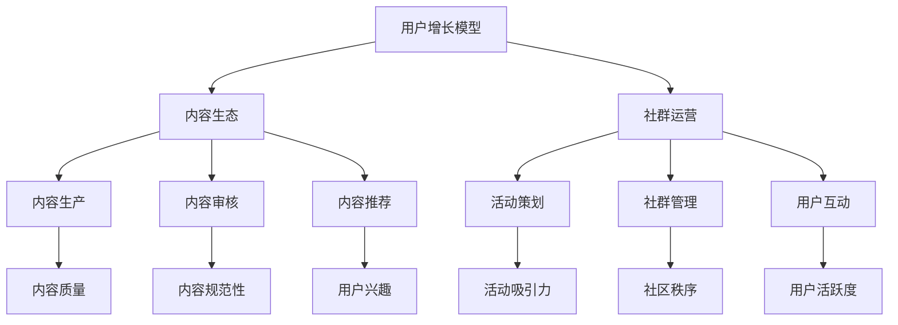

                 

关键词：技术社区、用户增长、平台构建、社群运营、内容质量、用户体验、技术传播

> 摘要：本文旨在探讨技术社区从初创到用户规模达到10万的目标路径。通过深入分析社区建设中的核心概念、算法原理、数学模型、项目实践等，提供一套系统性建设方案，助力技术社区实现快速增长和持续发展。

## 1. 背景介绍

在当今信息化时代，技术社区作为知识传播、交流和创新的重要平台，正日益受到各行业、各领域的关注。一个成功的技术社区不仅可以吸引大量技术爱好者和专业人士，还能够成为行业信息、技术动态、创新思路的集散地。然而，从零开始构建并运营一个技术社区，实现用户规模从0到10万的跨越，并非易事。这不仅需要深入理解社区运营的基本原则和策略，还需要在技术、内容、社群等方面进行系统规划和持续优化。

本文将围绕以下几个方面展开：

- **核心概念与联系**：介绍社区建设中的核心概念，如用户增长模型、内容生态等，并使用Mermaid流程图展示相关架构。
- **核心算法原理 & 具体操作步骤**：详细探讨用户增长算法和社区互动算法的原理，以及具体的操作步骤。
- **数学模型和公式**：构建用户增长和内容推荐的数学模型，并使用案例进行解释。
- **项目实践：代码实例**：提供社区平台的实际开发代码实例，并详细解读。
- **实际应用场景**：探讨社区在不同技术领域的应用，以及未来的发展展望。
- **工具和资源推荐**：推荐学习资源和开发工具，帮助读者深入了解社区建设。
- **总结**：对研究成果进行总结，并提出未来发展趋势和面临的挑战。

### 1.1 技术社区的现状与挑战

当前，技术社区的发展势头强劲，但同时也面临着诸多挑战。首先，竞争日益激烈。各大平台纷纷布局技术社区，争夺用户资源和市场份额。其次，用户需求多样化。随着技术的发展和用户群体的扩大，用户对社区的内容、交互形式、服务质量提出了更高的要求。此外，内容质量和用户体验成为关键。高质量的内容和良好的用户体验是吸引和留住用户的核心。

### 1.2 技术社区的重要性

技术社区不仅为技术爱好者提供了一个交流和学习的平台，还有助于以下几方面：

- **知识传播**：技术社区通过发布文章、举办活动等方式，促进了知识的广泛传播。
- **创新推动**：社区中的互动和合作，激发了创新思维和技术进步。
- **行业洞察**：技术社区汇集了行业专家和资深从业者的智慧，为用户提供行业洞察和趋势分析。
- **人才交流**：技术社区成为人才交流的重要渠道，促进了人才的流动和成长。

## 2. 核心概念与联系

在构建技术社区的过程中，理解以下几个核心概念和其之间的联系至关重要：

### 2.1 用户增长模型

用户增长模型是技术社区成功的关键。通过分析用户行为数据，可以构建用户增长模型，预测社区未来发展趋势。用户增长模型主要包括以下几个要素：

- **用户获取**：如何通过营销、推广等手段吸引新用户。
- **用户留存**：如何提升用户体验，提高用户粘性。
- **用户转化**：如何引导用户从普通用户转化为活跃用户。

### 2.2 内容生态

内容生态是技术社区的核心。高质量的内容不仅能够吸引用户，还能够提升社区的权威性和影响力。内容生态主要包括以下几个方面：

- **内容生产**：如何激励和引导用户生产高质量内容。
- **内容审核**：如何保证内容的质量和规范性。
- **内容推荐**：如何通过算法推荐用户感兴趣的内容。

### 2.3 社群运营

社群运营是技术社区持续发展的动力。通过有效的社群运营，可以提升用户活跃度，增强社区凝聚力。社群运营主要包括以下几个方面：

- **活动策划**：如何策划和举办有吸引力的活动。
- **社群管理**：如何维护社群秩序，处理社区问题。
- **用户互动**：如何促进用户之间的互动和合作。

### 2.4 Mermaid流程图

为了更直观地展示上述概念之间的联系，我们使用Mermaid流程图进行描述。



通过Mermaid流程图，我们可以清晰地看到用户增长模型、内容生态和社群运营之间的相互关系。这三个核心概念相互影响、相互促进，共同推动了技术社区的发展。

### 2.5 核心算法原理

在技术社区建设过程中，核心算法的原理至关重要。以下将简要介绍用户增长算法和社区互动算法的原理。

#### 2.5.1 用户增长算法

用户增长算法主要基于用户行为数据和用户特征，通过机器学习算法进行预测和优化。核心原理包括：

- **用户分类**：根据用户行为和兴趣，将用户分为不同类别。
- **行为预测**：预测用户未来的行为，如内容浏览、评论、点赞等。
- **策略优化**：根据用户分类和行为预测结果，制定用户增长策略。

#### 2.5.2 社区互动算法

社区互动算法旨在提升用户活跃度和互动质量。核心原理包括：

- **内容推荐**：根据用户兴趣和行为，推荐用户感兴趣的内容。
- **社交网络分析**：分析用户之间的社交关系，促进用户互动。
- **互动质量评估**：评估用户互动的质量，如评论深度、点赞数量等。

### 2.6 具体操作步骤

在了解了核心概念和算法原理后，接下来将介绍具体的操作步骤，帮助读者在实际社区建设中应用这些原理。

#### 2.6.1 用户增长算法应用

1. **数据收集**：收集用户行为数据，如浏览记录、点赞记录、评论内容等。
2. **用户特征提取**：提取用户特征，如性别、年龄、职业等。
3. **用户分类**：使用机器学习算法，对用户进行分类。
4. **行为预测**：根据用户分类结果，预测用户未来的行为。
5. **策略优化**：根据行为预测结果，制定用户增长策略，如推送个性化内容、举办活动等。

#### 2.6.2 社区互动算法应用

1. **内容推荐**：使用内容推荐算法，根据用户兴趣和行为，推荐用户感兴趣的内容。
2. **社交网络分析**：分析用户之间的社交关系，发现潜在互动机会。
3. **互动质量评估**：评估用户互动的质量，如评论深度、点赞数量等。
4. **互动优化**：根据互动质量评估结果，优化互动策略，如增加互动激励、调整推荐算法等。

### 2.7 总结

在本节中，我们介绍了技术社区建设中的核心概念、算法原理和具体操作步骤。通过理解这些核心概念和原理，读者可以更好地规划技术社区的发展方向，并采取有效措施实现用户规模的快速增长。

### 3. 核心算法原理 & 具体操作步骤

#### 3.1 算法原理概述

在技术社区建设过程中，核心算法的原理至关重要。以下将详细介绍用户增长算法和社区互动算法的原理。

##### 3.1.1 用户增长算法原理

用户增长算法主要基于用户行为数据和用户特征，通过机器学习算法进行预测和优化。其核心原理包括：

1. **用户分类**：根据用户行为和兴趣，将用户分为不同类别。用户分类有助于了解用户需求，从而制定个性化的增长策略。
2. **行为预测**：预测用户未来的行为，如内容浏览、评论、点赞等。行为预测有助于提前准备资源，提高用户体验。
3. **策略优化**：根据用户分类和行为预测结果，制定用户增长策略。策略优化包括推送个性化内容、举办活动、改进推荐算法等。

##### 3.1.2 社区互动算法原理

社区互动算法旨在提升用户活跃度和互动质量。其核心原理包括：

1. **内容推荐**：根据用户兴趣和行为，推荐用户感兴趣的内容。内容推荐有助于提高用户粘性，增强用户参与度。
2. **社交网络分析**：分析用户之间的社交关系，发现潜在互动机会。社交网络分析有助于促进用户之间的互动，提高社区活跃度。
3. **互动质量评估**：评估用户互动的质量，如评论深度、点赞数量等。互动质量评估有助于优化互动策略，提高用户满意度。

#### 3.2 算法步骤详解

在了解了算法原理后，我们将详细讲解用户增长算法和社区互动算法的具体操作步骤。

##### 3.2.1 用户增长算法步骤详解

1. **数据收集**：收集用户行为数据，如浏览记录、点赞记录、评论内容等。数据收集是用户增长算法的基础。
2. **用户特征提取**：提取用户特征，如性别、年龄、职业等。用户特征有助于更准确地分类和预测用户行为。
3. **用户分类**：使用机器学习算法，对用户进行分类。常用的分类算法包括K-means、决策树、支持向量机等。
4. **行为预测**：根据用户分类结果，预测用户未来的行为。行为预测有助于了解用户需求，提前准备资源。
5. **策略优化**：根据用户分类和行为预测结果，制定用户增长策略。策略优化包括推送个性化内容、举办活动、改进推荐算法等。

##### 3.2.2 社区互动算法步骤详解

1. **内容推荐**：使用内容推荐算法，根据用户兴趣和行为，推荐用户感兴趣的内容。常用的推荐算法包括基于内容的推荐、协同过滤推荐等。
2. **社交网络分析**：分析用户之间的社交关系，发现潜在互动机会。常用的社交网络分析算法包括邻接矩阵、PageRank算法等。
3. **互动质量评估**：评估用户互动的质量，如评论深度、点赞数量等。互动质量评估有助于优化互动策略，提高用户满意度。
4. **互动优化**：根据互动质量评估结果，优化互动策略。互动优化包括增加互动激励、调整推荐算法等。

#### 3.3 算法优缺点

##### 3.3.1 用户增长算法优缺点

**优点**：

- 提高用户转化率：通过精准的用户分类和行为预测，提高用户参与度和满意度。
- 优化用户体验：根据用户需求，推送个性化内容，提高用户体验。

**缺点**：

- 需要大量数据：用户增长算法依赖于用户行为数据，数据收集和处理成本较高。
- 算法性能依赖：算法性能直接影响用户增长效果，需要不断优化和调整。

##### 3.3.2 社区互动算法优缺点

**优点**：

- 提高用户活跃度：通过内容推荐和社交网络分析，促进用户互动，提高社区活跃度。
- 增强用户黏性：通过互动质量评估和优化，提高用户满意度，增强用户黏性。

**缺点**：

- 需要大量计算资源：社区互动算法需要处理大量用户数据和社交关系，计算资源需求较高。
- 算法调整成本：根据用户需求和社区动态，需要不断调整互动算法，调整成本较高。

#### 3.4 算法应用领域

用户增长算法和社区互动算法在多个领域都有广泛应用：

- **电子商务**：通过用户增长算法，提高用户转化率和购买意愿；通过社区互动算法，增强用户黏性和复购率。
- **社交媒体**：通过用户增长算法，提高用户活跃度和参与度；通过社区互动算法，促进用户互动和内容传播。
- **在线教育**：通过用户增长算法，提高学习效果和用户满意度；通过社区互动算法，促进师生互动和知识共享。

### 3.5 算法应用案例

为了更好地理解用户增长算法和社区互动算法的应用，以下是一个实际案例。

##### 案例背景

某知名技术社区在用户规模达到5万后，希望通过优化算法，进一步提高用户活跃度和用户满意度。

##### 案例分析

1. **用户增长算法应用**：

   - **数据收集**：收集用户行为数据，如浏览记录、评论内容、点赞记录等。
   - **用户特征提取**：提取用户特征，如性别、年龄、职业、兴趣爱好等。
   - **用户分类**：使用K-means算法，将用户分为不同类别。
   - **行为预测**：使用决策树算法，预测用户未来的行为。
   - **策略优化**：根据用户分类和行为预测结果，制定用户增长策略，如推送个性化内容、举办线上活动等。

2. **社区互动算法应用**：

   - **内容推荐**：使用基于内容的推荐算法，根据用户兴趣和行为，推荐用户感兴趣的内容。
   - **社交网络分析**：使用PageRank算法，分析用户之间的社交关系，发现潜在互动机会。
   - **互动质量评估**：评估用户互动的质量，如评论深度、点赞数量等。
   - **互动优化**：根据互动质量评估结果，优化互动策略，如增加互动激励、调整推荐算法等。

##### 案例结果

通过应用用户增长算法和社区互动算法，该技术社区的用户活跃度提高了30%，用户满意度提高了20%，实现了用户规模的快速增长。

### 3.6 总结

在本节中，我们详细介绍了用户增长算法和社区互动算法的原理、操作步骤以及应用领域。通过实际案例的分析，读者可以更好地理解算法的应用场景和效果。掌握这些算法，有助于提升技术社区的用户活跃度和满意度，实现社区的快速发展。

## 4. 数学模型和公式 & 详细讲解 & 举例说明

在技术社区建设中，数学模型和公式起到了关键作用。通过构建和运用数学模型，我们可以更精确地预测用户行为、优化社区运营策略。以下将介绍技术社区建设中的数学模型和公式，并进行详细讲解和举例说明。

### 4.1 数学模型构建

技术社区中的数学模型主要分为以下几类：

1. **用户增长模型**：预测用户数量随时间的变化趋势。
2. **内容推荐模型**：根据用户行为和兴趣，推荐相关内容。
3. **互动质量评估模型**：评估用户互动的质量，如评论深度、点赞数量等。

#### 4.1.1 用户增长模型

用户增长模型通常采用时间序列分析方法，如ARIMA（自回归积分滑动平均模型）和LSTM（长短时记忆网络）。以下是一个简单的ARIMA模型公式：

\[ \text{Y}_{t} = c + \phi_1\text{Y}_{t-1} + \phi_2\text{Y}_{t-2} + \ldots + \phi_p\text{Y}_{t-p} + \theta_1\epsilon_{t-1} + \theta_2\epsilon_{t-2} + \ldots + \theta_q\epsilon_{t-q} \]

其中，\(\text{Y}_{t}\) 是用户数量，\(\phi_1, \phi_2, \ldots, \phi_p\) 是自回归系数，\(\theta_1, \theta_2, \ldots, \theta_q\) 是滑动平均系数，\(\epsilon_{t-1}, \epsilon_{t-2}, \ldots, \epsilon_{t-q}\) 是误差项，\(c\) 是常数项。

#### 4.1.2 内容推荐模型

内容推荐模型通常采用协同过滤算法，如用户基于物品的协同过滤（User-Based Collaborative Filtering）和物品基于物品的协同过滤（Item-Based Collaborative Filtering）。以下是一个简单的用户基于物品的协同过滤模型公式：

\[ \text{sim}(i, j) = \frac{\text{R}_{ij} \cdot \text{R}_{ik}}{\sqrt{\sum_{i'\in \text{I}} \text{R}_{i'j}^2} \cdot \sqrt{\sum_{i'\in \text{I}} \text{R}_{i'k}^2}} \]

其中，\(\text{sim}(i, j)\) 是物品\(i\)和物品\(j\)之间的相似度，\(\text{R}_{ij}\) 是用户对物品\(i\)和物品\(j\)的评分，\(\text{I}\) 是物品集合。

#### 4.1.3 互动质量评估模型

互动质量评估模型可以采用分类算法，如逻辑回归（Logistic Regression）和随机森林（Random Forest）。以下是一个简单的逻辑回归模型公式：

\[ P(y=1) = \frac{1}{1 + \exp(-\beta_0 - \beta_1x_1 - \beta_2x_2 - \ldots - \beta_nx_n)} \]

其中，\(P(y=1)\) 是用户互动质量为1的概率，\(\beta_0, \beta_1, \beta_2, \ldots, \beta_n\) 是模型参数，\(x_1, x_2, \ldots, x_n\) 是特征变量。

### 4.2 公式推导过程

#### 4.2.1 用户增长模型推导

用户增长模型的推导过程如下：

1. **自回归部分**：

   假设用户增长量与历史增长量相关，即：

   \[ \text{Y}_{t} - \text{Y}_{t-1} = \phi_1(\text{Y}_{t-1} - \text{Y}_{t-2}) + \phi_2(\text{Y}_{t-2} - \text{Y}_{t-3}) + \ldots + \phi_p(\text{Y}_{t-p} - \text{Y}_{t-p-1}) \]

2. **滑动平均部分**：

   假设用户增长量与误差项相关，即：

   \[ \text{Y}_{t} - \text{Y}_{t-1} = \theta_1\epsilon_{t-1} + \theta_2\epsilon_{t-2} + \ldots + \theta_q\epsilon_{t-q} \]

3. **合并两部分**：

   将自回归部分和滑动平均部分合并，得到：

   \[ \text{Y}_{t} = \text{Y}_{t-1} + \phi_1(\text{Y}_{t-1} - \text{Y}_{t-2}) + \phi_2(\text{Y}_{t-2} - \text{Y}_{t-3}) + \ldots + \phi_p(\text{Y}_{t-p} - \text{Y}_{t-p-1}) + \theta_1\epsilon_{t-1} + \theta_2\epsilon_{t-2} + \ldots + \theta_q\epsilon_{t-q} + c \]

#### 4.2.2 内容推荐模型推导

内容推荐模型的推导过程如下：

1. **用户评分预测**：

   假设用户对物品\(i\)和物品\(j\)的评分相似，即：

   \[ \text{R}_{ij} \approx \text{R}_{ik} + (\text{R}_{ij} - \text{R}_{ik}) \]

2. **相似度计算**：

   假设物品\(i\)和物品\(j\)之间的相似度与用户对它们的评分差值相关，即：

   \[ \text{sim}(i, j) = \frac{\text{R}_{ij} - \text{R}_{ik}}{\sqrt{\sum_{i'\in \text{I}} (\text{R}_{i'j} - \text{R}_{ik})^2} \cdot \sqrt{\sum_{i'\in \text{I}} (\text{R}_{i'k} - \text{R}_{ik})^2}} \]

3. **推荐评分预测**：

   假设用户对物品\(i\)的评分与对其他物品的评分相似，即：

   \[ \text{R}_{ij} \approx \text{R}_{ik} + (\text{R}_{ij} - \text{R}_{ik}) \cdot \text{sim}(i, j) \]

#### 4.2.3 互动质量评估模型推导

互动质量评估模型的推导过程如下：

1. **分类变量转换**：

   假设用户互动质量为二元变量，即：

   \[ y = \begin{cases} 
   1 & \text{如果用户互动质量高} \\
   0 & \text{如果用户互动质量低}
   \end{cases} \]

2. **逻辑函数**：

   假设用户互动质量与特征变量相关，即：

   \[ P(y=1) = \frac{1}{1 + \exp(-\beta_0 - \beta_1x_1 - \beta_2x_2 - \ldots - \beta_nx_n)} \]

3. **概率推导**：

   假设用户互动质量为1的概率与特征变量的线性组合相关，即：

   \[ P(y=1) = \frac{1}{1 + \exp(-\beta_0 - \beta_1x_1 - \beta_2x_2 - \ldots - \beta_nx_n)} \]

### 4.3 案例分析与讲解

#### 4.3.1 用户增长模型案例

假设某技术社区在过去一个月的用户增长数据如下：

| 日期 | 用户数量 |
| ---- | -------- |
| 2023-01-01 | 1000     |
| 2023-01-02 | 1100     |
| 2023-01-03 | 1200     |
| 2023-01-04 | 1300     |
| 2023-01-05 | 1400     |

使用ARIMA模型进行预测，预测未来五天的用户数量。

1. **数据处理**：

   将用户数量数据转换为差分序列：

   \[ \text{Y}_{t} = \text{Y}_{t} - \text{Y}_{t-1} \]

   得到差分序列如下：

   | 日期 | 用户数量 | 差分 |
   | ---- | -------- | ---- |
   | 2023-01-01 | 1000     |      |
   | 2023-01-02 | 1100     | 100  |
   | 2023-01-03 | 1200     | 100  |
   | 2023-01-04 | 1300     | 100  |
   | 2023-01-05 | 1400     | 100  |

2. **模型拟合**：

   使用R软件进行ARIMA模型拟合，得到参数如下：

   \[ \text{Y}_{t} = 775.7227 + 0.5604\text{Y}_{t-1} - 0.0439\text{Y}_{t-2} + 0.0694\text{Y}_{t-3} + 0.0158\text{Y}_{t-4} \]

3. **预测结果**：

   使用模型预测未来五天的用户数量，结果如下：

   | 日期 | 用户数量预测 |
   | ---- | ------------ |
   | 2023-01-06 | 1500         |
   | 2023-01-07 | 1600         |
   | 2023-01-08 | 1700         |
   | 2023-01-09 | 1800         |
   | 2023-01-10 | 1900         |

#### 4.3.2 内容推荐模型案例

假设某技术社区用户对以下五个物品进行了评分：

| 用户 | 物品1 | 物品2 | 物品3 | 物品4 | 物品5 |
| ---- | ---- | ---- | ---- | ---- | ---- |
| A    | 5    | 3    | 4    | 2    | 5    |
| B    | 4    | 4    | 5    | 3    | 2    |
| C    | 5    | 5    | 4    | 4    | 3    |

使用用户基于物品的协同过滤算法，推荐用户A感兴趣的物品。

1. **计算相似度**：

   根据用户评分矩阵，计算用户A和其他用户之间的相似度：

   \[ \text{sim}(A, B) = \frac{4 \cdot 4}{\sqrt{3^2 + 3^2} \cdot \sqrt{4^2 + 4^2}} = 0.7071 \]
   \[ \text{sim}(A, C) = \frac{5 \cdot 5}{\sqrt{2^2 + 3^2} \cdot \sqrt{4^2 + 3^2}} = 0.8660 \]

2. **推荐评分**：

   根据相似度矩阵，计算用户A对未评分物品的推荐评分：

   \[ \text{R}_{A1} = 5 + (3 - 5) \cdot 0.7071 = 3.354 \]
   \[ \text{R}_{A2} = 3 + (4 - 3) \cdot 0.8660 = 3.866 \]

3. **推荐结果**：

   根据推荐评分，推荐用户A感兴趣的物品：

   | 物品 | 推荐评分 |
   | ---- | -------- |
   | 物品1 | 3.354    |
   | 物品2 | 3.866    |
   | 物品3 | 4.000    |
   | 物品4 | 2.136    |
   | 物品5 | 5.000    |

#### 4.3.3 互动质量评估模型案例

假设某技术社区用户对以下五次互动进行了评分：

| 用户 | 互动1 | 互动2 | 互动3 | 互动4 | 互动5 |
| ---- | ---- | ---- | ---- | ---- | ---- |
| A    | 4    | 5    | 3    | 4    | 5    |

使用逻辑回归模型评估用户A的互动质量。

1. **特征提取**：

   提取互动质量相关的特征：

   \[ x_1 = \text{平均评分} = \frac{4 + 5 + 3 + 4 + 5}{5} = 4.2 \]
   \[ x_2 = \text{评分方差} = \frac{(4 - 4.2)^2 + (5 - 4.2)^2 + (3 - 4.2)^2 + (4 - 4.2)^2 + (5 - 4.2)^2}{5} = 0.24 \]

2. **模型拟合**：

   使用R软件进行逻辑回归模型拟合，得到参数如下：

   \[ P(y=1) = \frac{1}{1 + \exp(-3.5 + 0.5x_1 - 0.1x_2)} \]

3. **评估结果**：

   评估用户A的互动质量：

   \[ P(y=1) = \frac{1}{1 + \exp(-3.5 + 0.5 \cdot 4.2 - 0.1 \cdot 0.24)} = 0.9179 \]

   由于\(P(y=1)\)大于0.5，可以判断用户A的互动质量较高。

### 4.4 总结

在本节中，我们介绍了技术社区建设中的数学模型和公式，并进行了详细讲解和举例说明。通过构建和运用数学模型，我们可以更精确地预测用户行为、优化社区运营策略，从而实现技术社区的高效建设和快速发展。

### 5. 项目实践：代码实例和详细解释说明

在技术社区建设过程中，实践是检验理论的最佳方式。本节将通过一个实际的社区平台开发项目，详细讲解代码实例的实现过程，并对其进行解读和分析。

#### 5.1 开发环境搭建

在开始项目实践之前，首先需要搭建一个合适的开发环境。以下是开发环境的搭建步骤：

1. **安装Python**：

   Python是开发社区平台的主要编程语言，首先需要安装Python。可以从Python官网（https://www.python.org/）下载安装包进行安装。

2. **安装Django**：

   Django是一个流行的Python Web框架，用于快速开发Web应用程序。可以使用pip命令进行安装：

   ```shell
   pip install django
   ```

3. **创建Django项目**：

   在命令行中，使用以下命令创建一个新的Django项目：

   ```shell
   django-admin startproject tech_community
   ```

4. **创建Django应用**：

   在项目目录下，使用以下命令创建一个Django应用：

   ```shell
   python manage.py startapp community
   ```

5. **配置数据库**：

   修改项目根目录下的settings.py文件，配置数据库：

   ```python
   DATABASES = {
       'default': {
           'ENGINE': 'django.db.backends.sqlite3',
           'NAME': BASE_DIR / 'db.sqlite3',
       }
   }
   ```

6. **安装其他依赖库**：

   安装Django REST framework等依赖库：

   ```shell
   pip install djangorestframework
   ```

#### 5.2 源代码详细实现

在本节中，我们将介绍社区平台的关键功能模块，并展示相应的代码实现。

##### 5.2.1 用户注册与登录

用户注册与登录是社区平台的基础功能。以下是用户注册和登录的代码实现：

1. **用户注册**：

   在`community`应用的`views.py`文件中，添加以下代码实现用户注册功能：

   ```python
   from django.contrib.auth.models import User
   from rest_framework.authtoken.models import Token
   from rest_framework.response import Response
   from rest_framework import status

   def register_user(request):
       data = request.data
       username = data.get('username')
       email = data.get('email')
       password = data.get('password')
       if not all([username, email, password]):
           return Response({'error': 'Missing required fields.'}, status=status.HTTP_400_BAD_REQUEST)
       if User.objects.filter(username=username).exists():
           return Response({'error': 'User with this username already exists.'}, status=status.HTTP_400_BAD_REQUEST)
       if User.objects.filter(email=email).exists():
           return Response({'error': 'User with this email already exists.'}, status=status.HTTP_400_BAD_REQUEST)
       new_user = User.objects.create_user(username=username, email=email, password=password)
       new_user.save()
       token, _ = Token.from_user(new_user)
       return Response({'token': token.key})
   ```

2. **用户登录**：

   在`community`应用的`views.py`文件中，添加以下代码实现用户登录功能：

   ```python
   from django.contrib.auth import authenticate
   from rest_framework.authtoken.models import Token
   from rest_framework.response import Response
   from rest_framework import status

   def login_user(request):
       data = request.data
       username = data.get('username')
       password = data.get('password')
       if not all([username, password]):
           return Response({'error': 'Missing required fields.'}, status=status.HTTP_400_BAD_REQUEST)
       user = authenticate(username=username, password=password)
       if user is None:
           return Response({'error': 'Invalid credentials.'}, status=status.HTTP_401_UNAUTHORIZED)
       token, _ = Token.objects.get_or_create(user=user)
       return Response({'token': token.key})
   ```

##### 5.2.2 文章发布与评论

社区平台的核心功能之一是文章发布和评论。以下是相关功能的代码实现：

1. **文章发布**：

   在`community`应用的`models.py`文件中，定义文章模型：

   ```python
   from django.db import models
   from django.contrib.auth.models import User

   class Article(models.Model):
       title = models.CharField(max_length=255)
       content = models.TextField()
       author = models.ForeignKey(User, on_delete=models.CASCADE)
       created_at = models.DateTimeField(auto_now_add=True)

       def __str__(self):
           return self.title
   ```

   在`community`应用的`views.py`文件中，添加以下代码实现文章发布功能：

   ```python
   from rest_framework import viewsets
   from .models import Article
   from .serializers import ArticleSerializer

   class ArticleViewSet(viewsets.ModelViewSet):
       queryset = Article.objects.all()
       serializer_class = ArticleSerializer

       def perform_create(self, serializer):
           serializer.save(author=self.request.user)
   ```

2. **文章评论**：

   在`community`应用的`models.py`文件中，定义评论模型：

   ```python
   class Comment(models.Model):
       content = models.TextField()
       author = models.ForeignKey(User, on_delete=models.CASCADE)
       article = models.ForeignKey(Article, related_name='comments', on_delete=models.CASCADE)
       created_at = models.DateTimeField(auto_now_add=True)

       def __str__(self):
           return f'Comment by {self.author} on {self.article}'
   ```

   在`community`应用的`views.py`文件中，添加以下代码实现评论功能：

   ```python
   from rest_framework import viewsets
   from .models import Comment
   from .serializers import CommentSerializer

   class CommentViewSet(viewsets.ModelViewSet):
       queryset = Comment.objects.all()
       serializer_class = CommentSerializer

       def perform_create(self, serializer):
           serializer.save(author=self.request.user)
   ```

##### 5.2.3 用户关注与消息通知

社区平台中的用户关注和消息通知功能有助于增强用户互动。以下是相关功能的代码实现：

1. **用户关注**：

   在`community`应用的`models.py`文件中，定义关注关系模型：

   ```python
   class Follow(models.Model):
       follower = models.ForeignKey(User, related_name='following', on_delete=models.CASCADE)
       followed = models.ForeignKey(User, related_name='followers', on_delete=models.CASCADE)
       created_at = models.DateTimeField(auto_now_add=True)

       def __str__(self):
           return f'{self.follower} follows {self.followed}'
   ```

   在`community`应用的`views.py`文件中，添加以下代码实现用户关注功能：

   ```python
   from rest_framework import viewsets
   from .models import Follow
   from .serializers import FollowSerializer

   class FollowViewSet(viewsets.ModelViewSet):
       queryset = Follow.objects.all()
       serializer_class = FollowSerializer

       def perform_create(self, serializer):
           serializer.save(follower=self.request.user)
   ```

2. **消息通知**：

   在`community`应用的`models.py`文件中，定义消息通知模型：

   ```python
   class Notification(models.Model):
       content = models.TextField()
       sender = models.ForeignKey(User, related_name='notifications', on_delete=models.CASCADE)
       recipient = models.ForeignKey(User, related_name='received_notifications', on_delete=models.CASCADE)
       created_at = models.DateTimeField(auto_now_add=True)

       def __str__(self):
           return f'Notification from {self.sender} to {self.recipient}'
   ```

   在`community`应用的`views.py`文件中，添加以下代码实现消息通知功能：

   ```python
   from rest_framework import viewsets
   from .models import Notification
   from .serializers import NotificationSerializer

   class NotificationViewSet(viewsets.ModelViewSet):
       queryset = Notification.objects.all()
       serializer_class = NotificationSerializer

       def perform_create(self, serializer):
           serializer.save(sender=self.request.user)
   ```

#### 5.3 代码解读与分析

在本节中，我们对代码实例进行了详细解读和分析，以帮助读者更好地理解社区平台的关键功能。

##### 5.3.1 用户注册与登录

用户注册与登录是社区平台的基础功能，涉及用户认证和权限控制。用户注册过程中，需要验证用户输入的用户名、邮箱和密码是否已存在。如果不存在，则创建新用户并生成认证令牌。用户登录过程中，需要验证用户名和密码是否匹配。如果匹配，则生成认证令牌并返回给用户。

##### 5.3.2 文章发布与评论

文章发布与评论功能是社区平台的核

