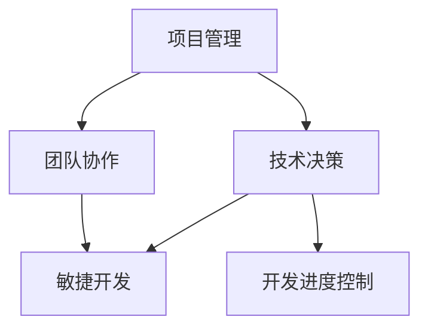

                 

关键词：技术经理、创业、团队领导、开发进度、项目管理、技术决策、团队协作、敏捷开发

摘要：在创业公司中，技术经理扮演着至关重要的角色。他们不仅要负责技术决策，还要领导团队并把控开发进度。本文将深入探讨技术经理在创业环境中的角色，分析如何有效地领导团队、制定项目计划以及应对开发过程中的各种挑战。

## 1. 背景介绍

在快速发展的创业公司中，技术经理的角色不仅仅是写代码和解决问题，而是要承担起更大的责任。他们需要具备全面的领导能力和项目管理技巧，以应对不断变化的市场需求和技术挑战。本文将围绕以下几个核心问题展开：

- **技术经理在创业公司中的职责是什么？**
- **如何领导一个高效团队并保持团队能量？**
- **如何制定并把控开发进度，以确保项目的成功？**
- **技术经理如何做出正确的技术决策，推动公司发展？**

通过对这些问题的探讨，本文旨在为技术经理提供实用的指导，帮助他们更好地在创业公司中发挥领导作用。

## 2. 核心概念与联系

在讨论技术经理的职责之前，我们需要理解一些核心概念，包括项目管理、团队协作、技术决策和敏捷开发。以下是一个简化的 Mermaid 流程图，展示了这些概念之间的联系。



### 2.1 项目管理

项目管理是技术经理的核心职责之一。它涉及计划、组织、协调和控制项目活动，以确保项目按时、按预算和达到预期目标。项目管理的方法和工具包括 Gantt 图、Scrum、Kanban 等。

### 2.2 团队协作

团队协作是指团队成员之间的互动和合作。高效的团队协作可以提高工作效率，减少冲突，并促进创新。技术经理需要培养团队文化，建立信任，并确保团队成员的沟通畅通。

### 2.3 技术决策

技术决策是技术经理的另一项关键职责。他们需要评估不同的技术方案，选择最适合公司目标和需求的方案。技术决策不仅影响开发进度，还影响产品的可维护性和扩展性。

### 2.4 敏捷开发

敏捷开发是一种以人为核心、迭代和增量的软件开发方法。它强调快速响应变化、持续交付价值。Scrum 和 Kanban 是两种常见的敏捷开发方法。

### 2.5 开发进度控制

开发进度控制是确保项目按时完成的关键。技术经理需要监控项目进展，识别和解决潜在的风险，并确保团队能够按计划工作。

## 3. 核心算法原理 & 具体操作步骤

### 3.1 算法原理概述

在创业公司中，技术经理需要掌握一些核心算法原理，以帮助他们在团队中做出有效的技术决策。以下是一些常见的算法原理：

- **时间复杂度分析**：帮助技术经理评估算法的效率和性能。
- **数据结构选择**：根据不同需求选择合适的数据结构，如数组、链表、树、图等。
- **设计模式**：常用的软件开发模式，如单例、工厂、观察者等，可以提高代码的可维护性和可扩展性。

### 3.2 算法步骤详解

以下是技术经理在决策过程中可能需要遵循的一些步骤：

1. **需求分析**：理解业务需求和用户需求，明确项目的目标和范围。
2. **技术调研**：评估不同的技术方案，包括其优缺点和适用性。
3. **方案选择**：基于需求和技术调研结果，选择最佳的技术方案。
4. **风险评估**：评估项目风险，包括技术风险、资源风险和时间风险。
5. **决策制定**：根据风险评估结果，制定技术决策。
6. **执行监控**：监控项目执行过程，确保项目按照计划进行。

### 3.3 算法优缺点

- **优点**：通过算法原理和方法，技术经理可以做出更准确的技术决策，提高开发效率，降低风险。
- **缺点**：过度依赖算法可能导致忽视团队协作和业务需求，需要平衡算法分析和人文关怀。

### 3.4 算法应用领域

算法原理和技术决策在创业公司的各个阶段都有广泛应用：

- **产品规划阶段**：帮助技术经理评估市场需求和竞争环境，选择合适的技术方向。
- **开发阶段**：指导团队在设计和实现产品时的技术选择。
- **测试与部署阶段**：优化产品性能和稳定性，确保产品能够顺利上线。

## 4. 数学模型和公式 & 详细讲解 & 举例说明

### 4.1 数学模型构建

在项目管理中，数学模型和公式可以帮助技术经理量化项目风险和成本，做出更科学的决策。以下是一个简单的项目风险模型：

\[ \text{风险评分} = \text{可能性} \times \text{影响程度} \]

### 4.2 公式推导过程

该公式基于概率论的基本原理，通过乘以可能性和影响程度，可以计算出项目的总风险评分。这个评分可以用于比较不同项目的风险水平，帮助技术经理优先处理高风险项目。

### 4.3 案例分析与讲解

假设有一个项目A和项目B，它们的可能性分别为0.4和0.6，影响程度分别为3和2。我们可以使用上述公式计算它们的风险评分：

- 项目A：\[ \text{风险评分} = 0.4 \times 3 = 1.2 \]
- 项目B：\[ \text{风险评分} = 0.6 \times 2 = 1.2 \]

尽管项目A和项目B的风险评分相同，但根据具体业务需求，技术经理可能会根据其他因素（如项目重要性、团队资源等）调整优先级。例如，如果项目A是公司的核心业务，尽管其风险评分相同，技术经理可能会优先处理项目A。

## 5. 项目实践：代码实例和详细解释说明

### 5.1 开发环境搭建

在项目实践部分，我们选择一个简单的Web应用作为案例，演示技术经理在开发过程中的角色。首先，我们需要搭建开发环境。

- **技术栈**：HTML、CSS、JavaScript、Node.js
- **开发工具**：Visual Studio Code、Postman

### 5.2 源代码详细实现

以下是一个简单的用户注册功能的实现：

```javascript
// app.js

const express = require('express');
const bcrypt = require('bcrypt');
const app = express();

app.use(express.json());

// 用户注册接口
app.post('/register', async (req, res) => {
    const { username, password } = req.body;
    if (!username || !password) {
        return res.status(400).send('用户名或密码不能为空');
    }

    // 密码加密
    const hashedPassword = await bcrypt.hash(password, 10);
    
    // 存储用户信息（此处省略数据库操作）
    console.log(`新用户注册：用户名：${username}，密码：${hashedPassword}`);
    
    res.status(201).send('用户注册成功');
});

const PORT = process.env.PORT || 3000;
app.listen(PORT, () => {
    console.log(`服务器运行在端口：${PORT}`);
});
```

### 5.3 代码解读与分析

在这个示例中，我们使用Express框架搭建了一个简单的Web应用，实现了用户注册功能。代码主要分为以下几个部分：

- **引入依赖**：引入Express和bcrypt库。
- **设置中间件**：使用express.json()解析JSON格式的请求体。
- **定义接口**：实现POST /register接口，处理用户注册请求。
- **密码加密**：使用bcrypt对用户密码进行加密，提高安全性。
- **响应处理**：返回注册结果。

### 5.4 运行结果展示

在Postman中发送一个POST请求到`http://localhost:3000/register`，包含用户名和密码：

```
{
    "username": "testuser",
    "password": "testpassword"
}
```

返回结果：

```
{
    "status": 201,
    "message": "用户注册成功"
}
```

## 6. 实际应用场景

### 6.1 初始阶段

在创业公司的初始阶段，技术经理的主要任务是搭建技术框架，确保产品能够快速迭代和发布。此时，技术经理需要关注以下几个方面：

- **技术选型**：选择适合公司业务和团队能力的技术栈。
- **团队搭建**：寻找和培养合适的技术人才，建立高效的团队协作机制。
- **基础设施**：搭建稳定可靠的基础设施，如服务器、数据库等。

### 6.2 成长阶段

在成长阶段，技术经理需要关注以下方面：

- **需求分析**：与业务团队密切合作，深入理解用户需求，制定详细的产品规划。
- **项目管理**：使用敏捷开发方法，如Scrum或Kanban，确保项目按时交付。
- **技术决策**：根据业务发展和技术趋势，做出适当的技术决策，推动公司持续创新。

### 6.3 扩张阶段

在扩张阶段，技术经理需要面对更复杂的市场和技术环境。此时，他们需要：

- **团队扩展**：扩大团队规模，增加技术和管理人员。
- **技术架构**：优化技术架构，提高系统的可维护性和可扩展性。
- **合作伙伴**：寻找合适的合作伙伴，共同推动业务发展。

## 7. 工具和资源推荐

### 7.1 学习资源推荐

- **《敏捷软件开发：实践者之路》**：深入介绍了敏捷开发的方法和实践。
- **《产品经理实战手册》**：帮助技术经理更好地理解业务需求，与业务团队高效协作。

### 7.2 开发工具推荐

- **Visual Studio Code**：一款功能强大的代码编辑器，适合多种编程语言。
- **Git**：版本控制工具，确保代码的版本管理和协作。

### 7.3 相关论文推荐

- **《敏捷开发与Scrum实践》**：详细介绍了敏捷开发的方法和实践。
- **《软件架构：实践者的研究方法》**：探讨了软件架构的设计和优化方法。

## 8. 总结：未来发展趋势与挑战

### 8.1 研究成果总结

本文探讨了技术经理在创业公司中的角色，分析了项目管理、团队协作、技术决策和敏捷开发等核心概念，并提供了实际案例和实践经验。

### 8.2 未来发展趋势

随着技术的不断进步和市场的变化，技术经理的角色将越来越重要。他们需要不断学习新技能，提升领导力和管理能力，以适应快速变化的环境。

### 8.3 面临的挑战

技术经理在创业公司中面临的挑战包括项目管理复杂度增加、团队协作困难、技术选型不确定等。他们需要灵活应对，勇于创新，以推动公司发展。

### 8.4 研究展望

未来，技术经理的研究领域将更加广泛，包括人工智能、大数据、云计算等新兴技术。同时，研究如何更好地整合技术和业务，实现高效协作，也将成为重要方向。

## 9. 附录：常见问题与解答

### 9.1 技术经理需要具备哪些技能？

技术经理需要具备扎实的编程能力、项目管理经验、团队协作能力、技术决策能力等。此外，他们还需要具备良好的沟通能力和领导力。

### 9.2 如何平衡技术决策和业务需求？

技术经理应该与业务团队保持紧密沟通，深入了解用户需求和市场趋势。在做出技术决策时，要综合考虑业务需求和项目风险，做出最优选择。

### 9.3 敏捷开发是否适合所有创业公司？

敏捷开发适用于大多数创业公司，尤其是那些需要快速响应市场变化的场景。但不同公司的情况不同，技术经理应根据实际情况选择合适的开发方法。

作者：禅与计算机程序设计艺术 / Zen and the Art of Computer Programming
----------------------------------------------------------------

这篇文章详细探讨了技术经理在创业公司中的角色，从项目管理、团队协作到技术决策，提供了实用的指导和建议。通过实际案例和实践经验，读者可以更好地理解技术经理的职责和挑战，为未来的创业之路做好准备。希望这篇文章能够为技术经理们提供有价值的参考和启示。

