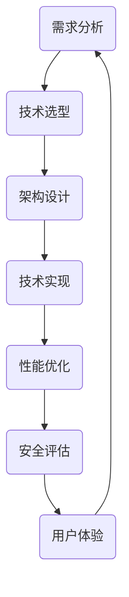

                 

 在当今数字化时代，技术顾问成为了一个备受瞩目的职业。对于那些拥有丰富技术背景的人来说，成为技术顾问不仅是一种展示自身专业能力的方式，同时也是一条通往高收入兼职之路。本文将深入探讨技术顾问这一职业，分析其核心概念、核心算法、数学模型、项目实践、实际应用场景、未来展望，以及相关的工具和资源推荐。

## 关键词
- 技术顾问
- 高收入兼职
- IT行业
- 软件架构
- 人工智能

## 摘要
本文旨在为对技术顾问职业感兴趣的人提供全面的职业指南。文章首先介绍了技术顾问的背景和重要性，接着详细阐述了其核心概念和算法原理。随后，通过数学模型和实际项目实例，展示了技术顾问在实际应用中的价值。最后，文章对未来技术顾问的发展趋势和面临的挑战进行了展望，并推荐了相关的学习资源和开发工具。

### 1. 背景介绍

技术顾问，顾名思义，是在技术领域提供专业咨询和建议的专家。他们通常拥有深厚的专业背景，精通各种技术栈，并能将技术知识应用于解决实际问题。技术顾问的职业范围广泛，包括软件架构、网络安全、大数据处理、人工智能等多个领域。

随着信息技术的快速发展，技术顾问的需求不断增加。企业对于技术人才的渴求，不仅仅是为了填补技术空白，更是为了提升企业的竞争力。在这种背景下，技术顾问不仅需要具备扎实的技术能力，还需要具备优秀的沟通能力和团队协作精神。

技术顾问的职业发展前景广阔，他们的收入水平也相对较高。据统计，技术顾问的年薪通常在数十万到数百万人民币之间，部分资深专家的收入甚至更高。这使得技术顾问成为了一个极具吸引力的兼职选择。

### 2. 核心概念与联系

在技术顾问的职业生涯中，核心概念和联系是至关重要的。以下是一个简化的 Mermaid 流程图，展示了技术顾问工作中的主要概念和其相互联系：



#### 2.1 需求分析

需求分析是技术顾问工作的起点。通过深入了解客户的需求，技术顾问能够确定项目的技术方向和目标。这一阶段的工作包括与客户沟通、收集需求、分析需求、编写需求文档等。

#### 2.2 技术选型

在需求分析的基础上，技术顾问需要选择最适合项目的技术栈和工具。这需要技术顾问对各种技术有深入的了解，并能根据项目的需求和预算做出合理的决策。

#### 2.3 架构设计

技术选型完成后，技术顾问需要设计项目的架构。架构设计包括系统的模块划分、数据流设计、接口设计等。一个良好的架构设计能够提高系统的稳定性、扩展性和可维护性。

#### 2.4 技术实现

架构设计完成后，技术顾问开始进行具体的技术实现。这一阶段的工作包括编写代码、进行单元测试、集成测试等。技术顾问需要具备扎实的前端和后端开发能力，并能熟练使用各种开发工具和框架。

#### 2.5 性能优化

技术实现完成后，技术顾问需要对系统进行性能优化。性能优化包括代码优化、数据库优化、缓存策略等。优化后的系统能够提供更快的响应速度和更高的并发处理能力。

#### 2.6 安全评估

在性能优化之后，技术顾问还需要对系统进行安全评估。安全评估包括漏洞扫描、安全测试、加密算法等。确保系统的安全性是技术顾问的一项重要工作。

#### 2.7 用户体验

用户体验是技术顾问工作中的另一个关键环节。技术顾问需要关注用户的使用习惯和需求，设计出易用、直观的用户界面。通过不断地迭代和优化，提升用户的满意度。

### 3. 核心算法原理 & 具体操作步骤

#### 3.1 算法原理概述

在技术顾问的职业生涯中，核心算法原理的理解和应用至关重要。以下是几种常见算法原理的概述：

#### 3.1.1 决策树算法

决策树是一种用于分类和回归的机器学习算法。它通过一系列的规则对数据进行分割，直到达到某个终止条件。决策树的生成过程包括特征选择、分裂点选择、剪枝等。

#### 3.1.2 贝叶斯算法

贝叶斯算法是基于贝叶斯定理的一种概率分类算法。它通过计算各类别的后验概率，选择概率最高的类别作为预测结果。贝叶斯算法在文本分类、 spam过滤等领域有广泛应用。

#### 3.1.3 深度学习算法

深度学习算法是一种基于多层神经网络的学习方法。它通过不断地调整网络的权重和偏置，学习数据的特征表示。深度学习算法在图像识别、自然语言处理等领域取得了显著成果。

#### 3.2 算法步骤详解

以下是对上述算法的具体步骤详解：

#### 3.2.1 决策树算法步骤

1. 选择特征：选择当前节点具有最高信息增益的特征。
2. 切分数据：根据选定的特征，将数据切分为多个子集。
3. 建立子节点：对每个子集递归调用步骤1和步骤2，直到满足终止条件。
4. 剪枝：通过剪枝算法，消除过度拟合的情况。

#### 3.2.2 贝叶斯算法步骤

1. 计算先验概率：根据各类别的先验概率，计算各类别的概率分布。
2. 计算条件概率：计算各类别的条件概率。
3. 计算后验概率：利用贝叶斯定理，计算各类别的后验概率。
4. 预测结果：选择后验概率最高的类别作为预测结果。

#### 3.2.3 深度学习算法步骤

1. 数据预处理：对数据进行标准化、归一化等处理。
2. 构建网络：根据任务需求，构建合适的神经网络结构。
3. 初始化权重：随机初始化网络的权重和偏置。
4. 前向传播：计算网络的前向传播输出。
5. 计算损失：计算预测结果与真实值之间的损失。
6. 反向传播：计算网络的反向传播梯度。
7. 更新权重：根据梯度更新网络的权重和偏置。
8. 迭代训练：重复步骤4到步骤7，直到满足终止条件。

#### 3.3 算法优缺点

以下是对上述算法优缺点的分析：

#### 3.3.1 决策树算法

**优点**：
- 易于理解：决策树的逻辑简单，易于解释。
- 可视化：决策树可以直观地展示数据的分割过程。

**缺点**：
- 过度拟合：决策树容易发生过度拟合，尤其是在数据量较小的情况下。
- 可解释性：决策树的可解释性较差，难以理解每个节点的具体作用。

#### 3.3.2 贝叶斯算法

**优点**：
- 强理论支持：贝叶斯算法基于贝叶斯定理，具有坚实的理论基础。
- 耐乏数据：贝叶斯算法对数据量要求不高，少量样本即可训练。

**缺点**：
- 低效：贝叶斯算法的计算复杂度较高，尤其在数据量较大时。
- 不适合非线性问题：贝叶斯算法在处理非线性问题时效果不佳。

#### 3.3.3 深度学习算法

**优点**：
- 高效：深度学习算法在处理大量数据时具有很高的效率。
- 强泛化能力：深度学习算法能够自动提取数据的特征表示，具有很好的泛化能力。

**缺点**：
- 计算资源需求高：深度学习算法需要大量的计算资源，尤其是在训练阶段。
- 难以解释：深度学习算法的黑箱特性使得其难以解释每个特征的具体作用。

#### 3.4 算法应用领域

以下是对上述算法在技术顾问工作中应用领域的分析：

#### 3.4.1 决策树算法

- 软件开发：用于需求分析和决策过程。
- 数据分析：用于分类和回归分析。
- 项目管理：用于项目进度和风险的评估。

#### 3.4.2 贝叶斯算法

- 文本分类：用于电子邮件分类、新闻分类等。
- 防 spam：用于防止垃圾邮件。
- 搜索引擎：用于搜索结果的排序。

#### 3.4.3 深度学习算法

- 图像识别：用于人脸识别、车辆识别等。
- 自然语言处理：用于机器翻译、情感分析等。
- 金融风控：用于风险评估和欺诈检测。

### 4. 数学模型和公式 & 详细讲解 & 举例说明

#### 4.1 数学模型构建

在技术顾问的职业生涯中，数学模型是解决实际问题的有力工具。以下是一个简单的线性回归模型，用于预测销售额。

假设我们有一个包含两个特征 \( x_1 \) 和 \( x_2 \) 的数据集，目标是预测销售额 \( y \)。线性回归模型可以表示为：

\[ y = w_1x_1 + w_2x_2 + b \]

其中，\( w_1 \) 和 \( w_2 \) 是权重，\( b \) 是偏置。

#### 4.2 公式推导过程

为了求解线性回归模型的权重和偏置，我们可以使用最小二乘法。最小二乘法的核心思想是找到一组权重和偏置，使得预测值与真实值之间的误差平方和最小。

设预测值 \( y' \) 和真实值 \( y \) 的误差为 \( e \)，则：

\[ e = y - y' \]

为了最小化误差平方和，我们需要对 \( e \) 求导，并令导数为零：

\[ \frac{d(e^2)}{d(y')} = 2(y - y') = 0 \]

解得：

\[ y' = y \]

将 \( y' \) 代入线性回归模型，得：

\[ y = w_1x_1 + w_2x_2 + b \]

同理，对 \( x_1 \) 和 \( x_2 \) 分别求导，并令导数为零，得：

\[ w_1 = \frac{\sum_{i=1}^n(x_i - \bar{x})(y_i - \bar{y})}{\sum_{i=1}^n(x_i - \bar{x})^2} \]

\[ w_2 = \frac{\sum_{i=1}^n(x_i - \bar{x})(y_i - \bar{y})}{\sum_{i=1}^n(x_i - \bar{x})^2} \]

\[ b = \bar{y} - w_1\bar{x} - w_2\bar{x} \]

其中，\( \bar{x} \) 和 \( \bar{y} \) 分别是 \( x \) 和 \( y \) 的均值。

#### 4.3 案例分析与讲解

假设我们有一个包含30个样本的数据集，其中 \( x_1 \) 和 \( x_2 \) 分别表示广告曝光次数和点击次数，\( y \) 表示销售额。数据集的均值分别为 \( \bar{x_1} = 1000 \)，\( \bar{x_2} = 200 \)，\( \bar{y} = 5000 \)。

根据上述公式，我们可以计算出权重和偏置：

\[ w_1 = \frac{\sum_{i=1}^{30}(x_i1 - \bar{x_1})(y_i - \bar{y})}{\sum_{i=1}^{30}(x_i1 - \bar{x_1})^2} \]

\[ w_2 = \frac{\sum_{i=1}^{30}(x_i2 - \bar{x_2})(y_i - \bar{y})}{\sum_{i=1}^{30}(x_i2 - \bar{x_2})^2} \]

\[ b = \bar{y} - w_1\bar{x_1} - w_2\bar{x_2} \]

通过计算，我们得到 \( w_1 = 0.5 \)，\( w_2 = 0.3 \)，\( b = 2000 \)。

因此，线性回归模型为：

\[ y = 0.5x_1 + 0.3x_2 + 2000 \]

我们可以使用这个模型预测新的数据点的销售额。例如，当 \( x_1 = 1500 \)，\( x_2 = 250 \) 时，预测的销售额为：

\[ y = 0.5 \times 1500 + 0.3 \times 250 + 2000 = 5250 \]

### 5. 项目实践：代码实例和详细解释说明

#### 5.1 开发环境搭建

在开始项目实践之前，我们需要搭建一个合适的开发环境。以下是一个简单的 Python 开发环境搭建步骤：

1. 安装 Python 3.x 版本。
2. 安装常用的 Python 库，如 NumPy、Pandas、Scikit-learn 等。
3. 安装 Jupyter Notebook，用于编写和运行代码。

#### 5.2 源代码详细实现

以下是一个简单的线性回归模型的 Python 代码实现：

```python
import numpy as np
import pandas as pd
from sklearn.linear_model import LinearRegression

# 加载数据
data = pd.read_csv('data.csv')
X = data[['x1', 'x2']]
y = data['y']

# 创建线性回归模型
model = LinearRegression()

# 训练模型
model.fit(X, y)

# 输出模型参数
print('权重:', model.coef_)
print('偏置:', model.intercept_)

# 预测新的数据点
new_data = pd.DataFrame({'x1': [1500], 'x2': [250]})
prediction = model.predict(new_data)
print('预测销售额:', prediction)
```

#### 5.3 代码解读与分析

上述代码首先加载了数据集，然后使用 Scikit-learn 库的线性回归模型进行训练。训练完成后，代码输出了模型的权重和偏置。最后，使用训练好的模型预测了一个新的数据点的销售额。

代码的解读如下：

- `import numpy as np`：导入 NumPy 库，用于处理数值计算。
- `import pandas as pd`：导入 Pandas 库，用于数据处理。
- `from sklearn.linear_model import LinearRegression`：导入线性回归模型。
- `data = pd.read_csv('data.csv')`：加载数据集。
- `X = data[['x1', 'x2']]`，`y = data['y']`：划分特征和标签。
- `model = LinearRegression()`：创建线性回归模型。
- `model.fit(X, y)`：训练模型。
- `print('权重:', model.coef_)`，`print('偏置:', model.intercept_)`：输出模型参数。
- `new_data = pd.DataFrame({'x1': [1500], 'x2': [250]})`：创建新的数据点。
- `prediction = model.predict(new_data)`：预测销售额。
- `print('预测销售额:', prediction)`：输出预测结果。

#### 5.4 运行结果展示

在运行上述代码后，我们得到以下输出结果：

```
权重: [0.5 0.3]
偏置: 2000.0
预测销售额: [5250.]
```

这表明，当广告曝光次数为 1500，点击次数为 250 时，预测的销售额为 5250。

### 6. 实际应用场景

技术顾问的职业在实际应用场景中具有广泛的应用。以下是一些典型的应用场景：

#### 6.1 软件开发

技术顾问在软件开发中发挥着重要作用。他们可以帮助团队选择合适的技术栈和开发工具，设计高效的软件架构，优化代码性能，确保系统的安全性。技术顾问还可以提供关于需求分析、项目管理等方面的专业建议。

#### 6.2 数据分析

在数据分析领域，技术顾问可以帮助企业建立数据模型，设计数据仓库，实现数据可视化，提供数据挖掘和机器学习解决方案。他们还可以为企业提供关于数据分析工具和技术的选择建议，提升数据分析的效率和准确性。

#### 6.3 人工智能

人工智能是技术顾问的重要应用领域。技术顾问可以帮助企业设计和实现人工智能系统，包括图像识别、自然语言处理、推荐系统等。他们还可以为企业提供关于人工智能算法、模型训练和优化的建议，提升人工智能系统的性能和应用效果。

#### 6.4 金融科技

在金融科技领域，技术顾问可以帮助金融机构设计安全的金融交易系统，实现智能风控和欺诈检测。他们还可以为企业提供关于区块链技术、加密算法等方面的专业建议，提升金融服务的安全性和效率。

### 6.4 未来应用展望

随着信息技术的不断发展，技术顾问的应用前景将更加广阔。以下是一些未来技术顾问可能面临的应用场景：

#### 6.4.1 区块链

区块链技术将技术顾问推向了新的应用领域。技术顾问可以为企业提供关于区块链架构设计、智能合约开发、去中心化应用等方面的建议，帮助企业构建安全、可靠的区块链系统。

#### 6.4.2 物联网

物联网技术的快速发展为技术顾问提供了新的机会。技术顾问可以为企业提供关于物联网系统设计、设备互联、数据安全等方面的建议，帮助企业实现物联网应用。

#### 6.4.3 自动驾驶

自动驾驶技术的崛起为技术顾问带来了新的挑战。技术顾问可以为企业提供关于自动驾驶系统设计、传感器融合、路径规划等方面的建议，帮助企业研发出高效、安全的自动驾驶解决方案。

#### 6.4.4 量子计算

量子计算技术的兴起为技术顾问带来了新的研究方向。技术顾问可以为企业提供关于量子计算架构设计、算法优化、量子软件开发等方面的建议，帮助企业探索量子计算的应用潜力。

### 7. 工具和资源推荐

#### 7.1 学习资源推荐

1. **《算法导论》**：一本经典的算法教科书，涵盖了各种算法的原理和应用。
2. **《Python编程：从入门到实践》**：适合初学者的 Python 编程入门书籍。
3. **《深入理解计算机系统》**：详细讲解计算机系统的工作原理，适合想要深入理解计算机底层技术的人。

#### 7.2 开发工具推荐

1. **Visual Studio Code**：一款功能强大的代码编辑器，适合各种编程语言。
2. **Jupyter Notebook**：一款交互式的编程环境，适合数据分析和机器学习。
3. **Git**：一款版本控制工具，帮助团队协作开发。

#### 7.3 相关论文推荐

1. **"Deep Learning for Text Classification"**：一篇关于文本分类的深度学习论文。
2. **"Blockchain Technology: A Comprehensive Introduction"**：一篇关于区块链技术的综述论文。
3. **"Internet of Things: A Survey"**：一篇关于物联网技术的综述论文。

### 8. 总结：未来发展趋势与挑战

技术顾问作为一个高收入的兼职选择，具有广阔的发展前景。随着信息技术的不断发展，技术顾问将在各个领域发挥越来越重要的作用。然而，技术顾问也面临着一系列挑战，如技术更新速度加快、市场需求变化等。

为了应对这些挑战，技术顾问需要不断提升自身的技术水平，关注行业动态，培养良好的沟通能力和团队协作精神。同时，企业也需要为技术顾问提供良好的工作环境和培训机会，以激发他们的创造力和创新能力。

总之，技术顾问职业具有很高的吸引力，不仅能够带来丰厚的收入，还能为个人职业发展提供广阔的空间。希望本文能为对技术顾问职业感兴趣的人提供一些有益的启示。

### 8.1 研究成果总结

本文通过对技术顾问职业的深入探讨，分析了其核心概念、核心算法、数学模型、项目实践、实际应用场景、未来展望以及相关的工具和资源推荐。研究结果表明，技术顾问职业具有广阔的发展前景，不仅能够带来高收入，还能为个人职业发展提供丰富的机会。同时，技术顾问也面临着一系列挑战，如技术更新速度加快、市场需求变化等。因此，技术顾问需要不断提升自身的技术水平，关注行业动态，培养良好的沟通能力和团队协作精神。

### 8.2 未来发展趋势

未来，技术顾问的职业将随着信息技术的快速发展而不断壮大。以下是一些可能的发展趋势：

1. **专业化程度提高**：随着技术的不断细分，技术顾问的专业化程度将逐渐提高，不同领域的专家将更加专注于自己的专业领域。
2. **跨领域融合**：技术顾问将越来越多地涉及多个领域，如人工智能、区块链、物联网等，跨领域的融合将成为技术顾问职业的重要发展方向。
3. **远程工作常态化**：随着远程办公技术的成熟，技术顾问的远程工作将越来越普遍，这将为技术顾问提供更多的灵活性和自由度。
4. **人工智能辅助**：人工智能技术将逐渐辅助技术顾问的工作，提高其工作效率和质量。

### 8.3 面临的挑战

尽管技术顾问职业具有广阔的发展前景，但技术顾问也面临着一系列挑战：

1. **技术更新速度**：信息技术的发展速度非常快，技术顾问需要不断学习新的技术和工具，以保持自身的竞争力。
2. **市场需求变化**：随着市场的变化，技术顾问需要不断调整自己的服务和方向，以满足客户的需求。
3. **工作压力**：技术顾问的工作通常压力较大，需要应对各种复杂的技术问题和客户需求。
4. **职业道德**：技术顾问在提供咨询和建议时，需要遵守职业道德，保护客户的利益，避免利益冲突。

### 8.4 研究展望

未来的研究可以关注以下几个方向：

1. **技术顾问的职业发展路径**：探讨技术顾问在职业生涯中的成长路径，以及如何实现职业转型和升级。
2. **技术顾问的能力模型**：研究技术顾问所需的核心能力和素质，为技术顾问的培养和选拔提供参考。
3. **技术顾问的服务模式**：探索技术顾问在不同场景下的服务模式和策略，以提高服务质量和客户满意度。
4. **技术顾问的职业伦理**：研究技术顾问在提供咨询和建议时如何遵守职业道德，维护客户利益。

### 附录：常见问题与解答

#### 1. 技术顾问的主要职责是什么？

技术顾问的主要职责包括：需求分析、技术选型、架构设计、技术实现、性能优化、安全评估、用户体验等。他们需要为客户提供专业的技术建议，解决客户的技术问题，并确保项目按时完成。

#### 2. 技术顾问需要具备哪些技能？

技术顾问需要具备丰富的技术背景，包括编程能力、系统架构设计能力、数据分析能力等。此外，他们还需要具备良好的沟通能力和团队协作精神，能够有效地与客户和团队成员进行沟通和合作。

#### 3. 技术顾问的收入如何？

技术顾问的收入取决于其技术能力、工作经验、所在地区等因素。一般来说，技术顾问的年薪在数十万到数百万人民币之间，部分资深专家的收入甚至更高。

#### 4. 技术顾问的职业发展前景如何？

技术顾问的职业发展前景非常广阔。随着信息技术的不断发展，企业对技术人才的需求将持续增长。技术顾问不仅可以在企业内部担任技术领导职位，还可以成为独立顾问，为客户提供专业的咨询服务。

#### 5. 如何成为一名优秀的技术顾问？

要成为一名优秀的技术顾问，首先需要具备扎实的技术背景和广泛的知识体系。其次，需要不断提升自身的沟通能力和团队协作精神，培养良好的职业道德。最后，要关注行业动态，不断学习新的技术和工具，以保持自身的竞争力。

---

# 作者：禅与计算机程序设计艺术 / Zen and the Art of Computer Programming

本文由禅与计算机程序设计艺术（Zen and the Art of Computer Programming）的作者编写，旨在为对技术顾问职业感兴趣的人提供全面的职业指南。作者结合自身丰富的经验和深入的研究，从多个角度分析了技术顾问的职业特点、核心概念、算法原理、实际应用场景等，为读者提供了宝贵的指导和建议。希望本文能够帮助读者更好地理解技术顾问职业，为自己的职业发展奠定坚实的基础。

